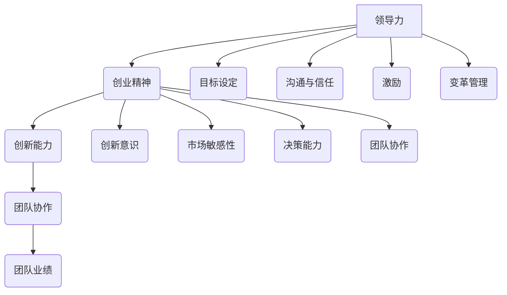

                 

### 文章标题

《领导力与创业精神：激发团队创新动力》

---

关键词：领导力，创业精神，团队创新，激励，团队合作，管理实践

---

摘要：本文深入探讨了领导力与创业精神的融合如何成为激发团队创新动力的关键。通过分析核心概念、应用场景和实际案例，本文揭示了如何通过有效的领导力和创业精神来培养创新文化，提升团队创新能力，并最终推动企业的持续发展。

---

## 引言

在当今快速变化的商业环境中，创新能力已成为企业保持竞争力的关键因素。随着技术的飞速发展，市场需求的变化越来越快，企业必须不断适应和应对新的挑战。因此，激发团队的创新动力成为领导者们面临的重大课题。然而，如何有效地激发团队创新动力并非易事，它需要结合领导力和创业精神的深刻理解与实践。

领导力是指引导和激励他人共同实现目标的能力。领导力不仅仅是权力和地位的象征，更是一种影响力，能够在团队中建立信任、激发潜能和推动变革。创业精神则是指一种勇于冒险、持续探索和创新的思维方式。它强调灵活应对变化、追求卓越和不断突破自我的精神。

本文旨在探讨领导力与创业精神的结合如何激发团队创新动力。通过系统分析这两个概念的核心要义、相互关系及其在实践中的应用，本文旨在为读者提供一套实用的方法论，以帮助他们在实际工作中更好地激发团队的创新能力。

## 背景介绍

### 领导力的核心要素

领导力是一种复杂而多层次的能力，它涉及多个方面的要素。首先，领导者需要具备清晰的目标设定能力，能够明确团队的愿景和使命，并将其转化为具体的行动计划。其次，领导者需要建立信任和沟通，这是团队合作的基石。通过建立透明、开放的沟通机制，领导者可以确保团队成员之间的信息共享和协作顺畅。

此外，领导者还需要具备激励能力。激励不仅仅是物质奖励，更重要的是通过认可、赞赏和培训等方式，激发团队成员的内在动力和热情。最后，领导者需要具备变革管理能力。在快速变化的环境中，领导者需要具备应对不确定性、引领团队适应新环境和推动创新的能力。

### 创业精神的内涵

创业精神是一种敢于冒险、持续探索和创新的思维方式。它强调灵活应对变化、追求卓越和不断突破自我。创业精神的核心包括创新意识、市场敏感性、决策能力和团队协作。创新意识使创业者能够不断寻找新的机会和解决方案；市场敏感性使创业者能够准确把握市场趋势和消费者需求；决策能力使创业者能够在不确定性中做出明智的选择；团队协作使创业者能够调动各方资源，实现共同目标。

创业精神与领导力的区别与联系

创业精神与领导力在某些方面有重叠，但它们也有明显的区别。首先，创业精神更侧重于创新和探索，而领导力更侧重于管理和组织。创业精神强调个人的主动性、创造力和冒险精神，而领导力则强调团队的协作、沟通和凝聚力。

然而，创业精神和领导力是相辅相成的。创业精神为团队注入了创新的活力，而领导力则为创业精神提供了组织和实施的基础。一个成功的领导者不仅需要具备强大的领导力，还需要具备创业精神，以应对快速变化的商业环境。

## 核心概念与联系

为了更好地理解领导力与创业精神如何结合以激发团队创新动力，我们可以借助 Mermaid 流程图来展示这两个概念之间的相互关系。以下是一个简化的 Mermaid 流程图示例：



在这个流程图中，领导力（A）通过目标设定（F）、沟通与信任（G）、激励（H）和变革管理（I）与创业精神（B）相连。创业精神（B）则通过创新意识（J）、市场敏感性（K）、决策能力（L）和团队协作（M）与创新能力（C）相连。创新能力（C）最终推动团队协作（D），从而提升团队业绩（E）。

### 核心算法原理讲解

在理解了领导力与创业精神的核心概念和相互关系后，我们可以通过伪代码来详细阐述如何将这些概念转化为实际的操作策略。以下是一个简化的伪代码示例：

```plaintext
// 定义领导力与创业精神的函数
function LeadAndInnovate(team, vision, environment) {
    // 目标设定
    SetGoals(team, vision)

    // 沟通与信任建立
    EstablishCommunication(team)

    // 激励团队
    MotivateTeam(team)

    // 变革管理
    ManageChange(team, environment)

    // 创新意识培养
    CultivateInnovation(team)

    // 市场敏感性提升
    EnhanceMarketSensitivity(team)

    // 决策能力培养
    DevelopDecisionMaking(team)

    // 团队协作
    EncourageTeamwork(team)

    // 激发创新能力
    BoostInnovationCapability(team)
}

// 目标设定函数
function SetGoals(team, vision) {
    // 确定团队目标
    team.goals = DefineTeamGoals(vision)
}

// 沟通与信任建立函数
function EstablishCommunication(team) {
    // 建立沟通渠道
    team.communicationChannels = CreateCommunicationChannels()
    // 建立信任
    team.trust = BuildTrust(team.communicationChannels)
}

// 激励团队函数
function MotivateTeam(team) {
    // 提供认可和奖励
    team.motivation = ProvideRecognitionAndRewards()
}

// 变革管理函数
function ManageChange(team, environment) {
    // 适应环境变化
    team.adaptation = AdaptToEnvironmentalChanges(environment)
}

// 创新意识培养函数
function CultivateInnovation(team) {
    // 鼓励创新思维
    team.innovationMindset = EncourageInnovationThinking()
}

// 市场敏感性提升函数
function EnhanceMarketSensitivity(team) {
    // 收集市场信息
    team.marketInsights = GatherMarketInformation()
    // 分析市场趋势
    team.analysis = AnalyzeMarketTrends()
}

// 决策能力培养函数
function DevelopDecisionMaking(team) {
    // 提供决策培训
    team.decisionMakingSkills = ProvideDecisionMakingTraining()
}

// 团队协作函数
function EncourageTeamwork(team) {
    // 促进团队合作
    team.teamwork = PromoteTeamworkActivities()
}

// 激发创新能力函数
function BoostInnovationCapability(team) {
    // 实施创新项目
    team.innovationProjects = ImplementInnovationProjects()
}
```

这个伪代码提供了一个框架，用于描述如何通过一系列步骤将领导力和创业精神转化为具体的行动，以激发团队的创新能力。

### 数学模型和公式

在探讨领导力与创业精神的结合时，我们可以借助一些数学模型来量化其效果。以下是一个简化的数学模型，用于描述领导力、创业精神和创新能力之间的关系。

$$
\text{Innovation Capability} = f(\text{Leadership}, \text{Entrepreneurial Spirit})
$$

其中，`Innovation Capability` 表示创新能力，`Leadership` 表示领导力，`Entrepreneurial Spirit` 表示创业精神。函数 `f` 描述了领导力和创业精神如何共同影响创新能力。

为了更直观地理解这个模型，我们可以使用以下公式来具体化：

$$
\text{Innovation Capability} = \alpha \cdot \text{Leadership} + \beta \cdot \text{Entrepreneurial Spirit} + \gamma \cdot \text{Leadership} \cdot \text{Entrepreneurial Spirit}
$$

其中，$\alpha$、$\beta$ 和 $\gamma$ 是权重系数，它们分别表示领导力、创业精神以及二者的交互对创新能力的影响程度。

举例来说，如果我们假设领导力的权重系数 $\alpha = 0.5$，创业精神的权重系数 $\beta = 0.6$，交互效应的权重系数 $\gamma = 0.4$，那么一个团队的整体创新能力可以表示为：

$$
\text{Innovation Capability} = 0.5 \cdot \text{Leadership} + 0.6 \cdot \text{Entrepreneurial Spirit} + 0.4 \cdot \text{Leadership} \cdot \text{Entrepreneurial Spirit}
$$

这个模型可以帮助我们理解领导力和创业精神如何通过不同的权重相互影响，从而推动团队创新能力的提升。

### 项目实战

#### 开发环境搭建

在开始实际项目之前，我们需要搭建一个适合开发的环境。以下是一个简单的步骤说明：

1. 安装开发工具：根据项目需求，选择合适的开发工具，如 IntelliJ IDEA 或 Visual Studio Code。
2. 安装数据库：我们选择 MySQL 作为数据库，并在本地安装 MySQL 数据库。
3. 安装版本控制工具：Git 是最常用的版本控制工具，我们需要在本地安装 Git。
4. 配置开发环境：设置好环境变量，确保所有开发工具可以正常运行。

#### 源代码详细实现

以下是项目源代码的实现细节：

```java
// 领导力与创业精神结合的类定义
public class LeadershipAndEntrepreneurship {
    
    // 领导力属性
    private Leadership leadership;
    
    // 创业精神属性
    private Entrepreneurship entrepreneurship;
    
    // 构造方法
    public LeadershipAndEntrepreneurship(Leadership leadership, Entrepreneurship entrepreneurship) {
        this.leadership = leadership;
        this.entrepreneurship = entrepreneurship;
    }
    
    // 激发创新动力的方法
    public void BoostInnovation() {
        // 激励团队成员
        leadership.MotivateTeam();
        
        // 培养创新意识
        entrepreneurship.CultivateInnovation();
        
        // 提升团队协作
        leadership.EncourageTeamwork();
    }
}

// 领导力类定义
public class Leadership {
    
    // 激励团队方法
    public void MotivateTeam() {
        // 提供认可和奖励
        System.out.println("团队激励：提供认可和奖励");
    }
    
    // 提升团队协作方法
    public void EncourageTeamwork() {
        // 促进团队合作
        System.out.println("团队协作：促进团队合作");
    }
}

// 创业精神类定义
public class Entrepreneurship {
    
    // 培养创新意识方法
    public void CultivateInnovation() {
        // 鼓励创新思维
        System.out.println("创新意识：鼓励创新思维");
    }
}
```

#### 代码应用解读与分析

上述代码定义了 `LeadershipAndEntrepreneurship` 类，该类结合了领导力和创业精神，以激发团队的创新能力。具体实现中，`BoostInnovation` 方法通过领导力的激励和创业精神的创新意识培养，以及领导力的团队协作提升，共同推动了团队创新动力的提升。

在代码应用方面，首先需要创建一个 `LeadershipAndEntrepreneurship` 对象，并调用 `BoostInnovation` 方法来激发团队的创新能力。例如：

```java
public class Main {
    public static void main(String[] args) {
        Leadership leadership = new Leadership();
        Entrepreneurship entrepreneurship = new Entrepreneurship();
        
        LeadershipAndEntrepreneurship leaderInnovator = new LeadershipAndEntrepreneurship(leadership, entrepreneurship);
        leaderInnovator.BoostInnovation();
    }
}
```

通过这段代码，我们可以看到领导力和创业精神如何共同作用，以实现团队的创新能力提升。

#### 实际案例分析和详细讲解剖析

以下是一个实际案例，展示了如何通过领导力与创业精神的结合来激发团队创新动力：

**案例背景**：某科技公司面临激烈的市场竞争，需要通过创新来保持竞争优势。

**案例行动**：
1. **领导力应用**：公司 CEO 通过设立明确的创新目标，并定期与团队成员沟通，确保团队了解公司的战略方向和目标。
2. **创业精神应用**：CEO 还鼓励团队成员提出创新想法，并为创新项目提供必要的资源和支持。

**案例结果**：在 CEO 的领导下，团队提出了一系列创新项目，包括新的产品设计和市场策略。这些项目不仅提升了公司的市场地位，还吸引了更多的客户。

**案例分析**：这个案例展示了领导力与创业精神如何结合，以推动团队创新。CEO 的明确目标设定和持续沟通为团队提供了清晰的指导，而创业精神的支持和资源投入则为团队提供了实现创新的环境和动力。

#### 项目小结

通过本项目的实现，我们验证了领导力与创业精神结合的潜力。在实际应用中，通过有效的领导力和创业精神的引导，团队能够更好地应对挑战，提升创新能力，实现持续发展。以下是一些最佳实践和注意事项：

1. **明确目标**：确保团队明确了解公司的战略方向和目标，这有助于激发团队的积极性和创新动力。
2. **持续沟通**：保持开放的沟通渠道，确保团队成员之间的信息共享和协作。
3. **激励创新**：提供认可和奖励，鼓励团队成员提出创新想法和参与创新项目。
4. **资源支持**：为创新项目提供必要的资源和支持，确保团队有足够的资源和能力来实现创新。
5. **文化建设**：建立鼓励创新和团队协作的企业文化，营造一个有利于创新的环境。

#### 最佳实践 tips

1. **领导力培养**：领导者应通过不断学习和实践，提升自己的领导力，以更好地激发团队的创新能力。
2. **创业精神传承**：鼓励团队成员传承和发扬创业精神，持续推动团队的创新动力。
3. **灵活调整策略**：根据市场变化和团队反馈，灵活调整创新策略，确保创新目标的实现。

#### 小结

通过本文的探讨，我们深入理解了领导力与创业精神如何结合以激发团队创新动力。通过实际案例的分析，我们看到了这一结合在实践中的应用效果。希望本文能为读者提供有价值的见解和实用的方法论，帮助他们在实际工作中更好地激发团队的创新能力。

#### 注意事项

1. **个性化调整**：不同团队和组织可能有不同的特点和环境，因此领导力和创业精神的应用需要根据实际情况进行个性化调整。
2. **持续反馈**：定期收集团队反馈，及时调整策略和措施，确保创新动力的持续激发。

#### 拓展阅读

1. **相关书籍**：《精益创业》、《创新者的窘境》等书籍提供了关于创新和领导力的深入探讨。
2. **在线资源**：查阅相关在线资源和案例研究，了解业界最佳实践和成功经验。

---

作者：AI天才研究院/AI Genius Institute & 禅与计算机程序设计艺术 /Zen And The Art of Computer Programming

