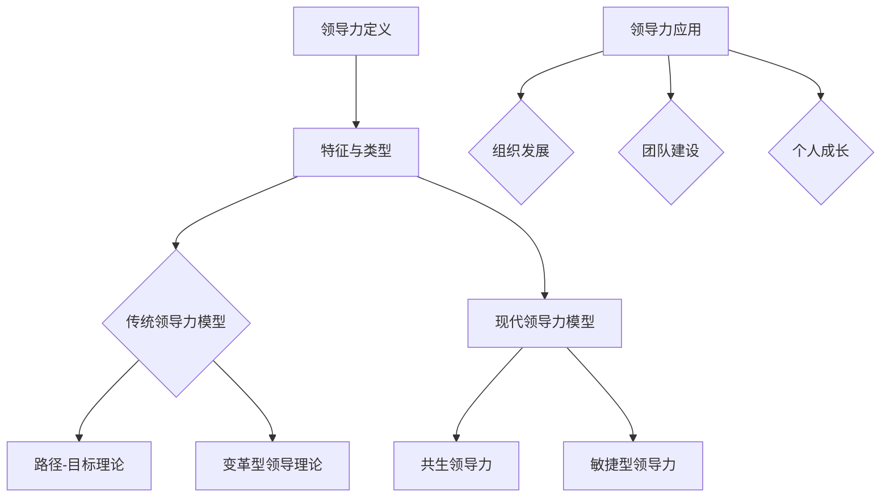
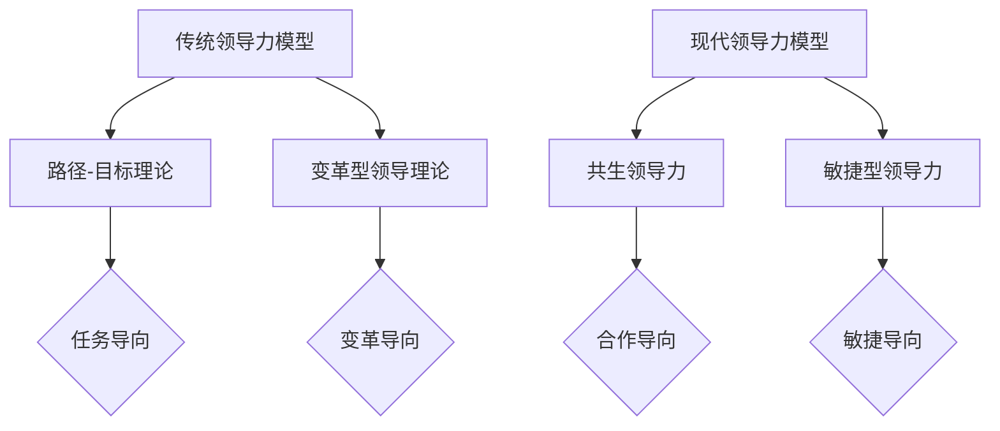
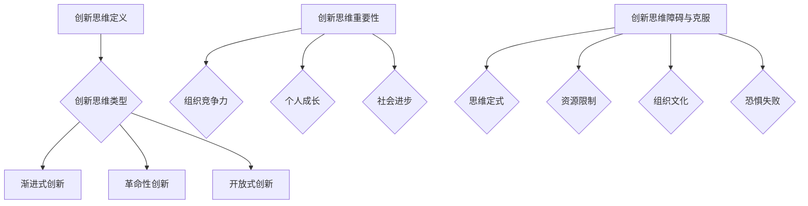
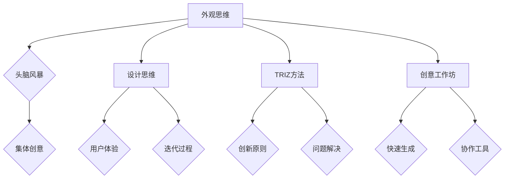
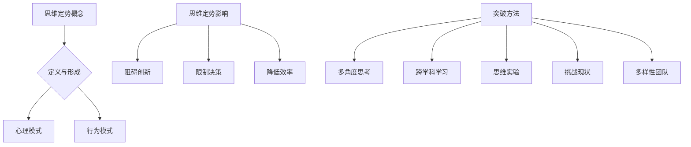
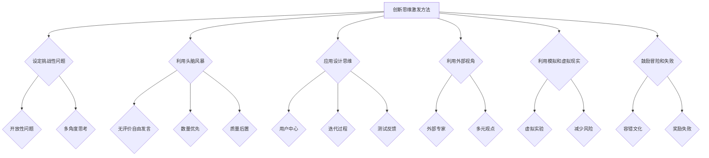

                 

### 摘要

本文以《领导力与创新思维激发：突破常规的思考方式》为题，深入探讨了领导力与创新思维在组织和个人发展中的重要性。文章首先介绍了领导力的定义、特征及其重要性，通过对比传统与现代领导力模型，揭示了领导力在组织中的关键作用。接着，文章深入探讨了创新思维的概念、类型及其在个人和组织中的意义，详细分析了创新思维的障碍及克服方法。随后，文章介绍了多种创新方法，包括外观思维、头脑风暴、设计思维等，并展示了这些方法在不同领域的应用。文章还通过多个实战案例，详细阐述了如何在实际项目中运用创新思维和领导力，从而突破常规思维定势，激发组织的创新活力。最后，文章总结了提升领导力和创新思维的最佳实践，为读者提供了实用的指导和建议。全文旨在帮助读者理解并掌握领导力与创新思维的核心原理，提升个人和组织的竞争力。

## 文章关键词

领导力、创新思维、突破常规、思考方式、组织发展、个人成长。

----------------------------------------------------------------

### 第一部分：领导力基础

#### 1.1 领导力概述

领导力是领导者通过激励、影响和引导他人来实现共同目标的能力。其定义虽然多种多样，但其核心在于领导者如何影响和激发团队成员的潜力，以实现组织的目标。领导力不仅仅是管理技能，更是一种影响力和号召力，能够激发团队的积极性和创造力。

领导力具有以下几个特征：

1. **影响力**：领导者通过自身的行为和价值观，对团队成员产生积极的影响。
2. **号召力**：领导者能够激励团队成员为实现共同目标而努力。
3. **协调能力**：领导者能够协调团队内部和外部资源，以实现目标。
4. **决策能力**：领导者能够在复杂环境中做出明智的决策。

领导力在组织和个人发展中的重要性体现在以下几个方面：

1. **组织发展**：领导力能够提升组织的整体效能，通过激发团队成员的潜力，实现组织的目标。
2. **团队建设**：领导力能够促进团队成员之间的合作和信任，构建高效的团队。
3. **个人成长**：领导力的发展有助于个人职业素养的提升，增强个人在组织中的竞争力。

为了更好地理解领导力的概念，我们可以通过以下Mermaid流程图来展示领导力的核心概念及其相互关系：

通过这个流程图，我们可以看到领导力的定义、特征、模型及其在组织和个人发展中的应用。接下来，我们将详细探讨传统和现代领导力模型，以及它们之间的异同点。

#### 1.2 领导力模型

领导力模型是描述领导行为和效果的理论框架。不同的领导力模型反映了领导者在不同情境下如何影响和激励团队成员。以下是几种常见的领导力模型：

1. **传统领导力模型**：
   - **路径-目标理论**：该理论认为领导者的主要任务是帮助团队成员明确目标，并为他们提供实现目标的路径和支持。领导者通过激励、指导和设置目标来影响团队成员。
   - **变革型领导理论**：变革型领导者通过激励和激发团队成员的潜力，推动组织实现变革。他们通常具有远见、强烈的道德感，并能激励团队成员超越自我，共同实现目标。

2. **现代领导力模型**：
   - **共生领导力**：共生领导力强调领导者与团队成员之间的相互依赖和共同成长。领导者通过建立信任、促进沟通和协作，实现组织的共同目标。
   - **敏捷型领导力**：敏捷型领导力强调灵活性和适应性，领导者需要快速响应变化，并能够灵活调整团队的工作方式。

传统领导力模型和现代领导力模型在许多方面存在差异：

- **关注点**：传统领导力模型主要关注任务的完成和绩效的提升，而现代领导力模型则更注重团队建设、员工满意度和创新能力。
- **领导行为**：传统领导力模型强调领导者的权威和指令，而现代领导力模型则更强调领导者的服务意识和合作精神。
- **适应能力**：传统领导力模型通常适用于相对稳定的环境，而现代领导力模型则更适用于快速变化的环境。

为了更好地理解传统和现代领导力模型的异同点，我们可以通过以下Mermaid流程图来展示这些模型的核心概念及其相互关系：

通过这个流程图，我们可以看到传统和现代领导力模型的不同关注点、领导行为和适应能力。接下来，我们将探讨领导力模型在具体组织中的应用和效果。

#### 1.3 领导力技能

领导力不仅是一种理论，更是一种实践技能。领导者需要具备一系列的技能来有效地管理团队和推动组织的发展。以下是领导力技能中的几个关键方面：

1. **沟通技能**：

沟通是领导者与团队成员之间建立联系的重要手段。有效的沟通能够确保信息的准确传递，促进团队内部的协作和信任。领导者需要掌握以下沟通技能：

   - **倾听**：倾听是有效沟通的第一步，领导者需要认真倾听团队成员的意见和反馈。
   - **清晰表达**：领导者需要能够清晰、准确地表达自己的想法和期望。
   - **非言语沟通**：领导者通过身体语言、面部表情等非言语手段来表达态度和情感。

2. **决策技能**：

决策是领导者的重要职责之一。领导者需要能够在复杂的环境中做出明智的决策。以下是一些关键的决策技能：

   - **分析能力**：领导者需要具备分析问题的能力，能够从多个角度审视问题，并找到最佳的解决方案。
   - **风险评估**：领导者需要能够评估决策的潜在风险，并制定相应的应对策略。
   - **果断性**：领导者需要在关键时刻做出决策，并勇于承担决策后果。

3. **领导风格**：

领导风格是领导者处理团队和管理工作的方式。不同的领导风格适用于不同的情境和团队。以下是几种常见的领导风格：

   - **指令型领导风格**：领导者通过明确的指令和指导来管理团队。
   - **参与型领导风格**：领导者鼓励团队成员参与决策过程，共同制定目标和计划。
   - **支持型领导风格**：领导者关注团队成员的需求和感受，提供支持和鼓励。

4. **领导力提升策略**：

为了提升领导力，领导者需要采取一系列的策略和方法。以下是一些提升领导力的策略：

   - **持续学习**：领导者需要不断学习新的知识和技能，以适应不断变化的环境。
   - **反思和反馈**：领导者需要定期反思自己的领导行为，并寻求他人的反馈，以不断改进。
   - **建立团队文化**：领导者需要建立积极的团队文化，鼓励团队成员之间的合作和信任。
   - **培养下属**：领导者需要培养下属的领导能力和责任感，为他们的职业发展提供支持。

通过提升沟通技能、决策技能和领导风格，领导者能够更有效地管理团队，推动组织的发展。接下来，我们将探讨领导力在具体组织中的应用，并分析其效果。

#### 1.4 领导力在具体组织中的应用

领导力在组织中的应用是一个复杂而动态的过程，它涉及到领导者与团队成员之间的相互作用，以及组织内部和外部的各种因素。以下是如何在具体组织中应用领导力以及其效果的探讨：

1. **组织战略规划**：

领导者需要制定清晰的组织战略规划，为组织的发展指明方向。这包括确定组织的愿景、使命和目标，以及制定实现这些目标的具体计划。领导者通过有效的沟通，确保团队成员理解并支持组织的战略规划，从而形成共同的愿景和目标。

2. **团队建设**：

领导力在团队建设中的作用至关重要。领导者需要通过建立积极的工作氛围，促进团队成员之间的合作和信任。这可以通过以下几种方式实现：

   - **鼓励团队成员参与决策**：领导者鼓励团队成员参与决策过程，使团队成员感到被重视和参与感，从而增强团队凝聚力。
   - **提供反馈和指导**：领导者及时给予团队成员反馈和指导，帮助他们改进工作，提高绩效。
   - **建立团队文化**：领导者通过制定和推广团队文化，如团队合作、诚信和创新等价值观，来塑造团队的工作氛围。

3. **领导力发展**：

领导者需要不断地提升自己的领导力，以适应组织发展的需求。这可以通过以下几种方式实现：

   - **培训和学习**：领导者参加各种培训和学习活动，获取新的知识和技能，提升自己的领导能力。
   - **反思和自我提升**：领导者定期反思自己的领导行为，识别自己的优势和不足，并制定自我提升的计划。
   - **培养下属**：领导者通过培养下属的领导能力和责任感，为组织的长远发展储备人才。

4. **组织变革**：

在快速变化的环境中，领导者需要推动组织进行变革，以保持竞争力。这包括以下几个方面：

   - **制定变革计划**：领导者需要制定明确的变革计划，包括变革的目标、步骤和资源分配。
   - **沟通和协调**：领导者需要与团队成员进行充分的沟通，解释变革的原因和目标，协调各方面的资源和支持。
   - **激励和引导**：领导者通过激励和引导团队成员，帮助他们克服变革中的困难和挑战，推动变革的顺利进行。

领导力在组织中的应用效果可以从以下几个方面来衡量：

- **组织绩效**：领导力能够提升组织的整体绩效，通过激发团队成员的潜力，实现组织的目标。
- **员工满意度**：领导力能够提高员工的满意度和忠诚度，促进员工的积极参与和合作。
- **创新能力**：领导力能够激发团队的创新能力，推动组织的持续发展和进步。

总之，领导力在组织中的应用是一个动态的过程，需要领导者具备各种技能和策略，以应对不同的挑战和机遇。通过有效的领导力，组织能够实现长期的发展和成功。

### 第二部分：创新思维

#### 2.1 创新思维概述

创新思维是一种通过创造性的方法和策略来解决问题的思维方式。它不仅是科技领域发展的驱动力，也是各个行业中提升竞争力的关键因素。创新思维的定义和类型多种多样，但核心在于其创造性和解决问题的能力。

**创新思维的定义**：

创新思维是指通过重新组合、重新定义和重新构建现有的知识、技能和资源，创造出新的解决方案或产品。这种思维模式强调打破常规，挑战现状，以产生新的价值。

**创新思维的类型**：

1. **渐进式创新**：这种创新类型通过逐步改进现有产品或服务来提高其性能或效率。它通常涉及改进现有技术或流程，以满足客户日益增长的需求。

2. **革命性创新**：这种创新类型涉及彻底改变现有的产品、服务或行业。它通常源于颠覆性的技术突破或全新市场需求的发现。

3. **开放式创新**：这种创新类型通过开放合作，鼓励外部创新者和内部团队共同参与创新过程。它利用外部资源来加速创新，提高创新效率。

**创新思维的重要性**：

创新思维在组织和个人发展中的重要性体现在以下几个方面：

1. **组织竞争力**：创新思维能够帮助组织在竞争激烈的市场中保持领先地位，通过持续的产品和服务创新，满足不断变化的市场需求。

2. **个人成长**：创新思维能够激发个人的创造力和解决问题的能力，促进个人的职业发展和个人品牌的提升。

3. **社会进步**：创新思维推动了科技进步和社会发展，带来了新的技术、产品和服务，改善了人们的生活质量。

**创新思维的障碍与克服**：

创新思维在实际应用中面临许多障碍，如思维定式、资源限制、组织文化和恐惧失败等。以下是一些常见的障碍及其克服方法：

1. **思维定式**：克服思维定式的方法包括多角度思考、跨学科学习和思维实验。

2. **资源限制**：通过资源整合、外部合作和精益创新方法，可以有效克服资源限制。

3. **组织文化**：改变组织文化，鼓励冒险和创新，可以消除对创新的恐惧和阻碍。

4. **恐惧失败**：通过建立容错文化和奖励创新失败，可以鼓励团队成员勇于尝试和实验。

为了更好地理解创新思维的概念，我们可以通过以下Mermaid流程图来展示创新思维的核心概念及其相互关系：

通过这个流程图，我们可以清晰地看到创新思维的定义、类型、重要性以及障碍与克服方法。接下来，我们将详细探讨各种创新方法及其在不同领域的应用。

#### 2.2 创新方法

创新方法是指为了激发创造力和解决问题而采用的具体策略和技巧。以下是一些常见的创新方法：

**外观思维（Outside-In Thinking）**

外观思维是一种从用户的角度出发，重新审视产品或服务的方法。这种方法强调用户需求和市场趋势，以设计出更符合用户期望的产品。

- **核心概念**：外观思维要求设计师和开发者站在用户的角度思考，关注用户的行为、感受和需求。
- **应用领域**：外观思维广泛应用于产品设计、用户体验设计和市场营销。

**头脑风暴（Brainstorming）**

头脑风暴是一种集体创意生成方法，通过集思广益，快速产生大量创意。

- **核心概念**：头脑风暴的规则包括无评价、自由发言、数量优先和质量后置等。
- **应用领域**：头脑风暴广泛应用于产品创新、市场策略和团队建设。

**设计思维（Design Thinking）**

设计思维是一种以用户为中心的创新方法，强调用户体验、迭代和协作。

- **核心概念**：设计思维包括五个阶段：定义问题、创意生成、原型设计、测试反馈和实施迭代。
- **应用领域**：设计思维广泛应用于产品设计、服务创新和战略规划。

**TRIZ方法（Theory of Inventive Problem Solving）**

TRIZ是一种基于经验和数学模型的创新方法，旨在解决复杂问题。

- **核心概念**：TRIZ提供了40个创新原则和一系列工具，帮助解决设计问题。
- **应用领域**：TRIZ方法广泛应用于工程、制造和科技创新。

**创意工作坊（Creative Workshop）**

创意工作坊是一种集中创意和资源，快速生成创意解决方案的方法。

- **核心概念**：创意工作坊通常包括多种创意生成技巧和协作工具，如思维导图、快速原型设计和团队竞赛。
- **应用领域**：创意工作坊广泛应用于产品开发、市场营销和团队建设。

通过以下Mermaid流程图，我们可以更直观地理解这些创新方法及其相互关系：

通过这个流程图，我们可以看到各种创新方法的核心概念和应用领域，以及它们如何相互补充和结合。接下来，我们将探讨创新思维在不同领域的具体应用。

#### 2.3 创新思维应用

创新思维在各个领域的应用都是至关重要的，它不仅能够推动技术进步，还能提升产品和服务质量，创造新的商业模式。以下是一些创新思维在不同领域的具体应用实例：

**产品创新**

在产品创新中，创新思维帮助公司发现并满足市场需求，从而创造出更具竞争力的产品。例如，苹果公司的产品创新策略就体现了创新思维的核心原则。苹果公司通过外观思维，不断重新定义智能手机、平板电脑和电脑的外观和功能，使其产品在市场中脱颖而出。此外，设计思维在苹果产品开发过程中也发挥了关键作用，通过用户研究、原型设计和用户测试，确保产品的用户体验达到最佳状态。

**服务创新**

服务创新同样需要创新思维的支持，特别是在高度竞争的市场中。例如，Uber利用创新思维，重新定义了出租车服务。Uber通过将移动技术和支付系统整合到其应用程序中，提供了一个更加便捷和高效的打车服务。这不仅改变了传统出租车行业的运作方式，还开创了共享经济的先河。Uber的创新思维体现在其不断优化用户体验、扩展服务范围和引入新功能，以保持市场领先地位。

**业务模式创新**

业务模式创新是企业在竞争激烈的市场中寻找新增长点的关键。例如，亚马逊通过创新思维，建立了基于订阅的云计算服务Amazon Web Services（AWS）。AWS不仅为亚马逊带来了可观的收入，还帮助该公司建立了强大的云计算生态系统。亚马逊通过设计思维和用户反馈，不断优化AWS的服务质量和功能，使其成为全球企业首选的云计算平台。

**社会创新**

社会创新是指利用创新思维解决社会问题，提高社会福利。一个典型的例子是M-Pesa，这是一家提供移动支付和微金融服务的企业。M-Pesa利用创新思维，在肯尼亚等发展中国家推出了移动支付服务，解决了传统金融服务无法触及大量人口的难题。通过创新思维，M-Pesa设计了一个简单易用的支付系统，使得数百万用户能够方便地进行交易和存款，从而提高了他们的财务状况和生活质量。

**教育创新**

教育创新利用创新思维改进教育方法和工具，以提高教育质量。一个成功的例子是Khan Academy，这是一家提供免费在线教育资源的非营利组织。Khan Academy通过设计思维，开发了一系列互动式的视频课程和教育工具，使学习变得更加有趣和有效。通过用户反馈和迭代，Khan Academy不断优化其教学内容和平台，使其成为全球数百万学生的在线学习资源。

**医疗创新**

在医疗领域，创新思维被用于开发新的诊断方法、治疗方案和医疗设备。一个例子是CRISPR基因编辑技术的发明和应用。CRISPR技术通过创新思维，提供了一种高效、精确的基因编辑工具，使得科学家能够治疗遗传性疾病和癌症。CRISPR技术的创新不仅推动了医学研究，还为全球患者带来了新的希望。

通过上述实例，我们可以看到创新思维在各个领域的广泛应用和重要作用。无论是产品创新、服务创新、业务模式创新，还是社会创新、教育创新和医疗创新，创新思维都是推动进步和发展的核心驱动力。利用创新思维，企业和组织能够不断创造新的价值，满足不断变化的市场需求，实现可持续发展。

### 第三部分：突破常规的思考方式

#### 3.1 突破思维定势

思维定势是指人们由于长期习惯性的思考模式和行为模式，而形成的固定的思维方式。这种思维定势在某些情况下是有益的，因为它可以帮助人们快速做出决策和行动。然而，在快速变化的环境中，思维定势往往成为创新的障碍，限制了人们的创造力和解决问题的能力。

**思维定势的概念**

思维定势是一种心理和行为模式，人们在这种模式中，对问题、情况或信息的处理方式往往是固定的、习惯性的。这种模式可能是由于过去的经验、教育、文化背景或社会环境等因素形成的。

**思维定势的影响**

1. **阻碍创新**：思维定势限制了人们的创造力，使他们难以从新的角度看待问题，从而阻碍了创新的产生。
2. **限制决策**：思维定势可能导致人们做出错误的决策，因为他们只考虑了传统的解决方案，而没有探索其他可能性。
3. **降低效率**：在某些情况下，思维定势可能导致人们重复执行无效的任务，降低工作效率。

**突破思维定势的方法**

1. **多角度思考**：通过从多个角度审视问题，可以帮助人们摆脱固定的思维模式，发现新的解决方案。
2. **跨学科学习**：通过学习不同领域的知识，可以拓宽人们的视野，激发新的思维方式。
3. **思维实验**：通过进行思维实验，人们可以在虚拟的环境中尝试新的想法和方案，从而突破实际的限制。
4. **挑战现状**：鼓励人们不断质疑现有的假设和规则，以发现改进的机会。
5. **多样性团队**：组建多样化的团队，可以引入不同的观点和思维方式，促进创新。

为了更好地理解思维定势的概念及其影响，我们可以通过以下Mermaid流程图来展示：

通过这个流程图，我们可以清晰地看到思维定势的概念、影响以及突破方法。接下来，我们将探讨如何通过创新思维激发突破思维定势。

#### 3.2 创新思维激发

创新思维激发是指通过特定的方法和工具，激发人们的创造力，使其能够产生新的想法和解决方案。在快速变化和竞争激烈的环境中，创新思维激发成为推动组织和个人发展的重要手段。以下是一些常见的创新思维激发方法：

**1. 设定具有挑战性的问题**

通过设定具有挑战性的问题，可以激发人们的思考和创造力。这些问题应该是开放性的，鼓励人们从不同的角度思考，寻找创新的解决方案。例如，可以提出“如何在5年内实现公司的业务增长200%？”这样的问题，激发团队成员思考新的业务模式和市场策略。

**2. 利用头脑风暴**

头脑风暴是一种集体创意生成方法，通过集思广益，快速产生大量创意。在头脑风暴过程中，鼓励参与者无评价地自由发言，数量优先，质量后置。这种方法可以帮助打破思维定势，激发创新思维。例如，可以组织一次关于“如何改善用户体验”的头脑风暴会议，让团队成员提出各种可能的解决方案。

**3. 应用设计思维**

设计思维是一种以用户为中心的创新方法，通过定义问题、创意生成、原型设计和测试反馈等阶段，逐步完善解决方案。设计思维强调用户体验和迭代，可以激发创新思维。例如，可以组建一个设计团队，通过设计思维的方法，开发一款新的手机应用程序，不断迭代和优化，以满足用户的需求。

**4. 利用外部视角**

通过引入外部专家或合作伙伴，可以带来不同的观点和思维方式，激发创新思维。外部视角可以帮助人们从新的角度看待问题，发现潜在的解决方案。例如，可以邀请行业专家参与公司的战略规划会议，通过他们的观点和建议，激发创新思维。

**5. 利用模拟和虚拟现实**

通过模拟和虚拟现实技术，可以在虚拟环境中进行创新思维实验，探索新的想法和方案。这种方法可以减少实际实施的风险，提高创新的效率。例如，可以使用虚拟现实技术模拟新产品上市的场景，评估不同营销策略的效果，从而激发创新思维。

**6. 鼓励冒险和失败**

在创新过程中，冒险和失败是不可避免的。通过鼓励团队成员勇于尝试和接受失败，可以激发创新思维。建立容错文化和奖励创新失败，可以减少团队成员的恐惧，鼓励他们进行更多的创新尝试。例如，可以设立“创新奖金”，奖励那些在创新过程中取得突破性进展的团队成员。

为了更好地理解创新思维激发的方法，我们可以通过以下Mermaid流程图来展示：

通过这个流程图，我们可以清晰地看到创新思维激发的方法及其具体应用。接下来，我们将通过实战案例来具体展示如何应用这些方法，突破思维定势。

#### 3.3 实战案例：如何通过创新思维突破思维定势

以下是一个具体的企业案例，展示了如何通过创新思维突破思维定势，实现业务创新。

**案例背景**

某家大型零售公司近年来面临激烈的市场竞争，销售增长放缓。公司管理层意识到，必须通过创新来提升业务竞争力。然而，公司内部的思维定势限制了创新思维的产生，导致解决方案缺乏新意。

**创新思维方法应用**

1. **设定挑战性问题**：

公司管理层提出问题：“如何在一年内实现销售额增长10%？”这个问题具有挑战性，激励团队成员思考新的业务模式和市场策略。

2. **利用头脑风暴**：

公司组织了一次跨部门的头脑风暴会议，鼓励员工无评价地自由发言。在会议上，员工提出了多种创新想法，如引入新品牌、推出会员制度、优化线上购物体验等。

3. **应用设计思维**：

公司采用设计思维的方法，成立了跨部门团队，专注于优化顾客购物体验。团队通过用户研究，发现顾客对线上购物体验的痛点，如商品图片质量差、购物流程复杂等。团队设计了新的线上购物界面，增加了商品360度旋转图片和一键购买功能，显著提升了用户体验。

4. **利用外部视角**：

公司邀请了一位零售行业的外部专家参与战略规划会议。专家带来了丰富的行业经验和创新的视角，提出了通过社交媒体营销和内容营销来吸引年轻顾客的建议。

5. **利用模拟和虚拟现实**：

公司使用虚拟现实技术，模拟了新的线上购物体验，让员工和顾客体验新设计。通过模拟，团队发现了一些需要改进的地方，并在实际实施前进行了调整。

6. **鼓励冒险和失败**：

公司建立了容错文化和奖励创新失败的机制。对于尝试新想法的团队成员，即使失败也能获得一定的奖励和反馈。这种机制鼓励了团队成员勇于尝试，推动了创新思维的实践。

**案例成果**

通过上述创新思维方法的应用，公司实现了以下成果：

1. **销售额增长**：在一年内，公司的销售额增长了12%，超过了设定的目标。
2. **品牌认知度提升**：通过社交媒体营销和内容营销，公司品牌在年轻顾客中的认知度显著提升。
3. **用户体验优化**：新设计的线上购物界面和功能得到了顾客的广泛好评，提升了顾客满意度和复购率。
4. **员工创造力提升**：创新思维方法的应用激发了员工的创造力，提高了团队的协作效率。

通过这个案例，我们可以看到创新思维在突破思维定势、实现业务创新方面的关键作用。企业通过设定挑战性问题、利用头脑风暴、应用设计思维、引入外部视角、利用模拟和虚拟现实以及鼓励冒险和失败，成功地突破了思维定势，实现了业务的快速增长和提升。

### 总结

本文通过深入探讨领导力与创新思维，以及如何突破常规的思考方式，为读者提供了一系列实用的方法和策略。领导力不仅是组织成功的基石，也是个人成长的关键因素。通过理解领导力的定义、特征和模型，领导者可以更有效地管理团队，推动组织的发展。创新思维则是推动组织和个人发展的核心驱动力，通过多种创新方法的应用，可以激发团队的创造力和解决问题的能力。

在突破常规的思考方式部分，我们讨论了思维定势的概念及其影响，并提出了多种突破思维定势的方法。通过设定挑战性问题、利用头脑风暴、应用设计思维、引入外部视角、利用模拟和虚拟现实以及鼓励冒险和失败，组织可以突破思维定势，实现创新和业务的快速增长。

总之，领导力与创新思维的结合，是提升组织和个人竞争力的关键。通过本文的讨论，我们希望读者能够理解并掌握这些核心概念和策略，将其应用于实际工作中，推动组织的持续发展和进步。

### 最佳实践 Tips

1. **定期反思**：领导者应定期反思自己的领导行为，识别优势和不足，制定改进计划。

2. **培养跨学科能力**：鼓励团队成员学习跨学科知识，拓宽思维视野，提高创新能力。

3. **鼓励团队协作**：建立积极的团队文化，鼓励团队成员之间的协作和分享，促进创新思维的交流。

4. **设立创新奖励机制**：建立创新奖励机制，鼓励团队成员勇于尝试新想法，即使失败也能获得一定的认可和激励。

5. **持续学习与培训**：领导者应不断提升自己的知识和技能，参加相关培训和研讨会，保持与时俱进。

### 注意事项

1. **避免过度依赖单一领导力模型**：领导者应根据不同情境选择合适的领导力模型，避免过度依赖某一种模型。

2. **关注用户体验**：在创新过程中，始终关注用户的需求和体验，确保创新成果能够满足市场需求。

3. **风险管理**：在实施创新项目时，应进行全面的风险评估，并制定相应的风险管理策略。

4. **持续反馈与迭代**：创新过程是一个持续迭代的过程，应不断收集用户反馈，优化创新成果。

### 拓展阅读

1. **《领导力与新科学》**：作者约翰·M·伊夫斯（John M. Ivancevich），详细探讨了领导力与复杂系统之间的关系。

2. **《创新者的窘境》**：作者克里斯坦森（Clayton M. Christensen），通过案例分析，阐述了企业如何通过创新应对市场变化。

3. **《创新思维与问题解决》**：作者理查德·哈克曼（Richard Hackman），介绍了创新思维的多种方法和应用场景。

4. **《设计思维：创新的方法》**：作者戴维·凯利（David Kelly），深入讲解了设计思维的原理和应用。

作者：AI天才研究院/AI Genius Institute & 禅与计算机程序设计艺术 /Zen And The Art of Computer Programming

