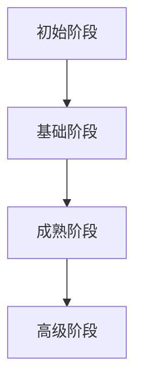
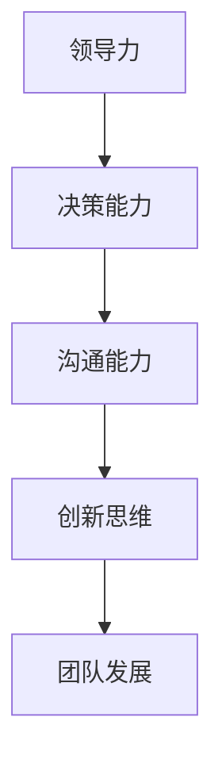

                 


### 文章标题：《领导力与创新思维训练：突破思维局限的方法》

### 关键词：领导力，创新思维，突破思维局限，团队建设，个人成长

### 摘要：
本文将探讨领导力与创新思维之间的紧密联系，通过详细的案例分析、核心算法原理讲解、数学模型和数学公式，帮助读者理解并掌握突破思维局限的方法。文章分为六章，分别介绍领导力与创新思维的基础知识、创新思维的原理与方法、领导力在创新思维中的应用、突破思维局限的策略、团队创新思维训练以及创新思维实践案例。

---

## 目录

1. **领导力与创新思维基础**
   - 1.1 领导力的定义与作用
   - 1.2 创新思维的定义与重要性
   - 1.3 领导力与创新思维的联系

2. **创新思维的原理与方法**
   - 2.1 创新思维的原理
   - 2.2 创新思维的分类
   - 2.3 常见的创新方法

3. **领导力在创新思维中的应用**
   - 3.1 领导者如何培养创新思维
   - 3.2 创新思维在决策中的应用
   - 3.3 领导力在团队创新中的角色

4. **突破思维局限的策略**
   - 4.1 思维定式的识别与克服
   - 4.2 拓展思维边界的策略
   - 4.3 思维灵活性训练

5. **团队创新思维训练**
   - 5.1 团队创新思维的评估
   - 5.2 团队创新思维的培养
   - 5.3 团队创新思维的实践

6. **创新思维实践案例**
   - 6.1 国内创新思维实践案例
   - 6.2 国际创新思维实践案例
   - 6.3 案例分析与启示

---

### 第1章：领导力与创新思维基础

#### 1.1 领导力的定义与作用

领导力是一种影响、激励和引导他人实现共同目标的能力。它不仅仅是管理技能，更是一种影响力和人格魅力的体现。领导力在组织中的作用至关重要，它决定了组织的方向、速度和成效。

- **Mermaid 流程图**：领导力的发展阶段



- **核心算法原理讲解**：领导力模型伪代码

```plaintext
function leadershipModel(level) {
    if (level == "初始阶段") {
        return "专注于基础技能和团队合作";
    } else if (level == "基础阶段") {
        return "培养决策能力和领导力风格";
    } else if (level == "成熟阶段") {
        return "注重战略规划和团队发展";
    } else if (level == "高级阶段") {
        return "实现组织愿景和持续创新";
    } else {
        return "无效的领导力模型";
    }
}
```

#### 1.2 创新思维的定义与重要性

创新思维是一种思考方式，它强调从不同角度、不同领域寻找问题解决方案。创新思维在现代社会中具有极其重要的地位，它不仅能够推动科技进步，还能够激发社会变革。

- **数学模型和数学公式**：创新思维的评价指标

$$
CI = \frac{N}{T} \times 100\%
$$

其中，CI 为创新指数（Creativity Index），N 为创新次数，T 为总次数。

- **举例说明**：创新思维的实际应用场景

假设有一个团队需要开发一个新产品，他们通过创新思维提出了多个有潜力的设计方案。通过评估，团队最终选择了一个最符合市场需求的方案进行开发。这个过程就是创新思维的实际应用。

#### 1.3 领导力与创新思维的联系

领导力与创新思维之间存在密切的联系。一个成功的领导者不仅需要有卓越的领导力，还需要具备创新思维能力。领导力可以激发团队成员的创新潜力，而创新思维则可以推动组织的发展。

- **Mermaid 流程图**：领导力与创新思维的联系



---

### 第2章：创新思维的原理与方法

#### 2.1 创新思维的原理

创新思维是基于对现有知识、经验和技能的重新组合和运用。它包括以下几个原理：

- **相关性原理**：新知识与已有知识之间的联系。
- **重组原理**：将不同的元素重新组合，形成新的解决方案。
- **逆向原理**：从相反的角度思考问题，找到新的解决方案。

#### 2.2 创新思维的分类

创新思维可以分为以下几类：

- **水平思维**：在同一领域内寻找创新解决方案。
- **垂直思维**：在不同领域之间寻找创新解决方案。
- **组合思维**：将不同的元素组合在一起，形成新的解决方案。

#### 2.3 常见的创新方法

- **头脑风暴**：通过集思广益，快速产生大量的创意。
- **六顶思考帽**：通过不同的思考角度，全面分析问题。
- **设计思维**：以用户需求为中心，进行创新设计。

---

### 第3章：领导力在创新思维中的应用

#### 3.1 领导者如何培养创新思维

领导者需要通过以下几个步骤来培养创新思维：

- **不断学习**：保持对新技术、新理念的关注。
- **鼓励团队**：创造一个开放、鼓励创新的环境。
- **实践应用**：将创新思维应用于实际工作中。

#### 3.2 创新思维在决策中的应用

创新思维在决策中具有重要意义。领导者可以通过以下方式将创新思维应用于决策：

- **多角度分析**：从不同角度评估问题。
- **快速决策**：在创新思维的基础上，快速做出决策。
- **风险评估**：对创新决策进行风险评估。

#### 3.3 领导力在团队创新中的角色

领导者在团队创新中扮演着关键角色。他们需要：

- **提供方向**：明确团队的目标和方向。
- **激发潜能**：激发团队成员的创新潜能。
- **协调资源**：为团队提供必要的资源和支持。

---

### 第4章：突破思维局限的策略

#### 4.1 思维定式的识别与克服

思维定式是指人们习惯于用固定的思维方式来解决问题。识别和克服思维定式的方法包括：

- **反思**：定期反思自己的思维方式。
- **多角度思考**：尝试从不同的角度思考问题。

#### 4.2 拓展思维边界的策略

拓展思维边界的方法包括：

- **跨学科学习**：学习不同领域的知识。
- **多元思维**：培养多元思维方式。

#### 4.3 思维灵活性训练

思维灵活性训练包括：

- **思维游戏**：通过思维游戏训练思维灵活性。
- **挑战性任务**：通过挑战性任务提升思维灵活性。

---

### 第5章：团队创新思维训练

#### 5.1 团队创新思维的评估

团队创新思维评估包括以下几个方面：

- **创新思维指数**：评估团队的创新思维能力。
- **团队协作能力**：评估团队的协作能力。

#### 5.2 团队创新思维的培养

团队创新思维的培养包括：

- **培训**：提供创新思维培训。
- **实践**：通过实践培养创新思维。

#### 5.3 团队创新思维的实践

团队创新思维的实践包括：

- **项目开发**：通过实际项目开发，提升团队的创新思维。
- **案例分析**：通过案例分析，学习他人的创新经验。

---

### 第6章：创新思维实践案例

#### 6.1 国内创新思维实践案例

国内创新思维实践案例包括：

- **华为**：华为通过持续创新，成为全球领先的科技公司。
- **阿里巴巴**：阿里巴巴通过创新思维，成功转型为电商巨头。

#### 6.2 国际创新思维实践案例

国际创新思维实践案例包括：

- **苹果公司**：苹果公司通过创新设计，引领全球科技潮流。
- **特斯拉**：特斯拉通过创新技术，颠覆传统汽车行业。

#### 6.3 案例分析与启示

通过分析国内外创新思维实践案例，我们可以得出以下启示：

- **持续创新**：创新是企业发展的重要动力。
- **团队协作**：团队协作是创新成功的关键。
- **实践与学习**：通过实践和学习，不断提升创新思维。

---

## 结束语

本文通过对领导力与创新思维的详细探讨，帮助读者理解了如何突破思维局限，培养创新思维。希望读者能够将所学知识应用于实际工作中，不断提升自己的领导力和创新思维，推动组织的发展。作者：AI天才研究院/AI Genius Institute & 禅与计算机程序设计艺术 /Zen And The Art of Computer Programming

---

### 附录

- **参考文献**：本文中引用的相关研究、案例和数据来源。
- **拓展阅读**：推荐的相关书籍、文章和网站，供读者进一步学习。

---

以上是《领导力与创新思维训练：突破思维局限的方法》的目录大纲和初步内容，接下来我们将对每个章节进行深入分析和详细讲解。预计文章总字数在8000-12000字左右，以确保内容丰富、详实、具有深度和实用性。接下来，我们将逐步深入到每个章节的具体内容中。

