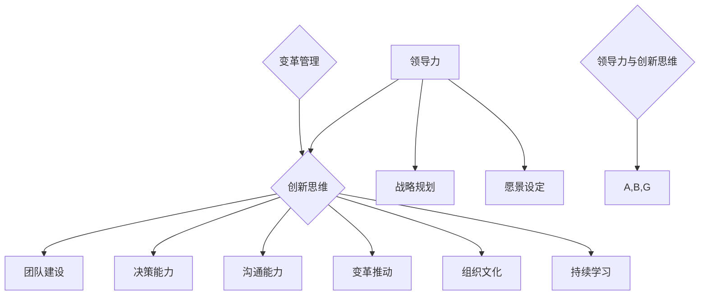

                 

### 《领导力与创新思维：引领变革的能力》的核心章节设计

#### 引言

引言部分旨在为读者提供一个全面的视角，了解整个书籍的核心内容和结构。首先，我们将介绍书籍的目的与结构，帮助读者快速把握书籍的主线。接着，我们会讨论领导力与创新思维的重要性，让读者明白为什么这两个主题对于现代组织至关重要。最后，我们会简要介绍变革的必要性，为后续章节的讨论奠定基础。

#### 领导力概述

领导力概述章节将深入探讨领导力的本质和作用。我们首先会定义领导力，并解释它对组织和员工的影响。接着，我们会分析领导力的核心要素，包括沟通能力、决策能力和领导风格等。这一章节还将介绍不同类型的领导力及其适用场景，帮助读者理解领导力的多样性。最后，我们会探讨领导力的发展与提升，为领导者提供实用的策略和建议。

#### 创新思维

创新思维章节将重点介绍创新思维的定义、特点和类型。我们会详细讨论创新思维的核心要素，如开放性、探索性和系统性，并解释它们如何影响创新过程。此外，我们还会介绍各种创新思维方法，如模拟思维、脑暴法和设计思考，并探讨如何通过训练和应用这些方法来提升创新能力。

#### 变革管理

变革管理章节将探讨变革管理的核心步骤和挑战。我们首先会定义变革管理，并解释它对组织的重要性。接着，我们会详细讨论变革管理的核心步骤，包括沟通、规划、执行和评估等。此外，我们还会探讨变革管理中面临的挑战，如抵触情绪、资源限制和时间压力，并提供相应的应对策略。

#### 领导力与创新思维的结合

领导力与创新思维的结合章节将探讨如何将领导力与创新思维有效结合，以引领变革。我们会首先讨论领导力与创新思维的融合，并解释领导者如何在变革过程中发挥关键作用。接着，我们会介绍领导者在变革中的角色，如推动者、协调者和支持者等。此外，我们还会探讨如何将创新思维应用于领导力实践中，以提升组织的创新能力。

#### 案例研究

案例研究章节将通过具体案例，展示领导力与创新思维在实践中的应用。我们会选取国内外具有代表性的案例，如成功的变革项目、创新产品开发和领导力培养计划等，进行分析和讨论。通过这些案例，读者可以更深入地理解领导力与创新思维在实际工作中的应用和价值。

#### 实践指南

实践指南章节将提供一系列实用的策略和技巧，帮助读者将领导力与创新思维应用于实际工作中。我们会讨论如何进行领导力与创新思维的自我评估，如何制定提升策略，以及如何实施变革管理等。此外，我们还会提供一系列最佳实践和注意事项，帮助读者在实际应用中避免常见问题，提高效果。

### 总结

通过以上设计，我们希望能够为读者提供一部全面、深入、实用的领导力与创新思维指南。我们相信，通过学习本书，读者不仅能够提高自己的领导力和创新能力，还能够引领变革，为组织带来持续的创新和增长。让我们一起探索这个充满挑战和机遇的领域吧！### 引言：变革时代的领导力与创新思维

在当今快速变化的世界中，领导力和创新思维成为企业成功的关键因素。随着技术的飞速发展和市场竞争的加剧，组织必须不断适应新的环境，以保持竞争力。这就要求领导者不仅要具备传统管理技能，还需要具备引领变革和创新的能力。本章节将介绍领导力和创新思维的重要性，并探讨它们在当前商业环境中的作用。

#### 领导力的定义与作用

领导力是指通过激励、指导和影响他人来实现共同目标的能力。它不仅仅是管理职位或权威的象征，更是一种个人魅力和影响力。在组织内，领导力发挥着至关重要的作用：

1. **方向指引**：领导者为组织设定愿景和目标，并制定实现这些目标的战略。他们通过明确的目标和愿景，为团队成员提供清晰的方向感。

2. **团队建设**：领导力有助于建立高效、协作的团队。领导者通过培养团队合作精神、提升沟通能力和建立信任关系，增强团队的凝聚力和执行力。

3. **变革推动**：在快速变化的市场环境中，领导者必须具备推动变革的能力。他们能够识别机会和挑战，并带领团队适应这些变化，以保持组织的竞争力。

4. **激励与激励**：领导者通过激励和认可，激发团队成员的积极性和创造力。他们关注团队成员的个人成长和发展，提供必要的支持和资源。

#### 创新思维的定义与作用

创新思维是指通过新颖的视角和方法来解决问题的能力。它包括创造力、批判性思维和系统思维等关键要素。创新思维在组织中具有以下几个重要作用：

1. **市场竞争力**：创新思维能够帮助组织开发新产品、改进流程和开拓新市场，从而提高市场竞争力。

2. **可持续发展**：通过创新思维，组织能够不断适应外部环境的变化，确保其长期可持续发展。

3. **员工满意度**：鼓励创新思维可以提高员工的满意度和工作热情，有助于留住人才和提升团队的整体表现。

4. **组织文化**：创新思维能够塑造一种鼓励冒险和尝试的组织文化，激发团队成员的创造力和主动性。

#### 变革的必要性

在当前的商业环境中，变革已成为一种常态。以下是一些推动变革的关键因素：

1. **技术进步**：新技术的不断涌现，如人工智能、大数据和云计算等，正在彻底改变商业运作模式。组织必须适应这些技术变革，以保持竞争力。

2. **消费者需求变化**：消费者需求日益多样化和个性化，要求组织不断推出创新产品和服务。

3. **竞争压力**：市场竞争日益激烈，组织必须不断改进和优化，以应对竞争对手的挑战。

4. **法律和监管要求**：法律法规的更新和监管要求也对组织产生了变革的压力。

#### 领导力与创新思维的重要性

领导力和创新思维对于组织在变革时代的成功至关重要。领导力为组织提供了明确的方向和强大的执行力，而创新思维则推动了组织的发展和持续改进。以下是一些具体原因：

1. **适应变化**：领导者能够引导组织适应外部环境的变化，确保组织的可持续发展。

2. **激发创造力**：创新思维鼓励团队成员提出新的想法和解决方案，推动组织不断进步。

3. **提升竞争力**：通过领导力和创新思维的结合，组织能够更好地应对市场竞争，提高自身的竞争力。

4. **员工发展**：领导力与创新思维的结合有助于培养员工的技能和知识，提升他们的职业素养。

总之，领导力和创新思维是组织在快速变化的时代取得成功的关键因素。通过掌握这些能力，领导者不仅能够引领变革，还能够推动组织的持续创新和发展。在接下来的章节中，我们将深入探讨领导力的核心要素、创新思维的方法和应用，以及变革管理的具体策略和挑战。通过这些探讨，我们将为读者提供实用的指导和建议，帮助他们在实际工作中提升领导力和创新思维能力。让我们开始这段深入的探索之旅吧！### 领导力概述

领导力是组织成功的关键因素之一，它不仅仅涉及管理职位的人员，还涵盖了每一位员工在团队中发挥的影响力。在这部分，我们将深入探讨领导力的定义、核心要素、类型和风格，以及领导力的发展和提升策略。

#### 领导力的定义

领导力是一种通过激励、指导和影响他人来实现共同目标的能力。它不仅仅是管理职位或权威的象征，更是一种个人魅力和影响力。领导力不仅仅存在于传统的管理层级中，还存在于团队、部门甚至整个组织中。领导力的核心在于如何影响他人，激发他们的潜力，共同达成目标。

#### 核心要素

领导力的核心要素包括沟通能力、决策能力、领导风格和影响力等。

1. **沟通能力**：沟通是领导力的基础，领导者必须具备良好的沟通能力，能够清晰、准确地传达信息，理解他人的需求和意见，建立有效的沟通渠道。

2. **决策能力**：领导者必须能够做出明智的决策，这不仅涉及战略层面的决策，还包括日常运营中的决策。有效的决策能力能够帮助领导者把握机遇、解决问题，并引导团队朝着正确的方向前进。

3. **领导风格**：领导风格是领导者处理团队和事务的方式。不同的领导风格适用于不同的情境，常见的领导风格包括权威型、民主型、教练型等。

4. **影响力**：领导力的影响不仅限于组织内部，还包括对外部环境的影响。领导者通过自身的影响力和领导力，能够塑造组织文化，推动变革，并对外部合作伙伴产生积极影响。

#### 类型与风格

1. **权威型领导力**：权威型领导力强调领导者的权威和决策权力。领导者通过明确的指令和指导，确保团队成员按照预定计划执行任务。这种领导风格在紧急情况下或需要迅速决策时较为有效。

2. **民主型领导力**：民主型领导力强调团队成员的参与和决策的民主化。领导者通过征求团队成员的意见和建议，共同制定决策，增强团队的凝聚力和合作性。

3. **教练型领导力**：教练型领导力强调领导者作为教练的角色，通过辅导和培养团队成员，提升他们的能力和素质。领导者关注团队成员的个人成长，提供反馈和支持，帮助他们实现职业目标。

#### 领导力的发展和提升

1. **自我反思**：自我反思是领导力提升的关键步骤。领导者需要定期反思自己的行为和决策，识别不足和改进点，通过自我调整和提升，不断完善领导能力。

2. **持续学习**：领导力的发展需要持续的学习和实践。领导者应不断学习新的管理理论、技能和方法，并将其应用到实际工作中。通过阅读、参加培训、参与研讨会等方式，不断提升自己的专业素养。

3. **实践机会**：领导力的提升需要通过实践来验证和应用。领导者应主动寻求实践机会，如参与项目、担任临时领导角色等，通过实践来锻炼和提升领导能力。

4. **反馈与指导**：领导力的提升需要他人的反馈和指导。领导者可以通过请教导师、参加领导力发展项目、寻求同事和下属的反馈等方式，获取宝贵的建议和指导，不断改进和提升自己的领导能力。

总之，领导力是一个复杂而多维度的能力，它不仅仅涉及个人的魅力和影响力，还包括沟通、决策、领导风格和发展等多个方面。通过深入了解领导力的定义、核心要素、类型和风格，以及发展提升的策略，领导者可以更好地发挥自己的领导作用，推动组织的成功和变革。在接下来的章节中，我们将进一步探讨创新思维的定义、特点和应用，以及如何将领导力与创新思维结合起来，引领变革。让我们一起深入这个充满挑战和机遇的领域，探索领导力与创新思维的深层联系和实践应用。 ### 创新思维的定义与特点

创新思维是领导力的重要组成部分，它对于推动组织的持续发展和竞争力提升具有关键作用。在这一章节中，我们将深入探讨创新思维的定义、特点以及其在组织中的应用。

#### 定义

创新思维是指通过新颖的视角和方法来解决问题的能力。它不仅仅关注现有的解决方案，更注重从不同的角度出发，寻找全新的解决方案。创新思维是一种认知过程，涉及创造新想法、发现新机会和解决问题。

1. **创造新想法**：创新思维鼓励人们跳出传统的思维框架，提出全新的想法和解决方案。这需要开放的思维和勇于尝试新事物的态度。

2. **发现新机会**：创新思维能够帮助人们识别潜在的机遇，并利用这些机会创造新的价值。这包括市场机会、技术进步和商业模式创新等。

3. **解决问题**：创新思维是解决复杂问题的重要工具。它通过多种方法和技巧，如头脑风暴、设计思考和模拟思维等，帮助人们找到有效的解决方案。

#### 特点

创新思维具有以下几个显著特点：

1. **开放性**：创新思维鼓励人们保持开放的心态，接纳不同的观点和想法。它不受传统思维模式的限制，勇于尝试新的方法和思路。

2. **探索性**：创新思维是一种探索性的思维方式，它不断寻求新的解决方案和可能性。它不满足于现状，而是持续地寻求改进和突破。

3. **系统性**：创新思维是一种系统性的思维方式，它关注问题的整体性，考虑各个因素之间的相互作用。它不仅仅是寻找单一的解决方案，而是通过系统的分析，找到最佳的综合方案。

4. **灵活性**：创新思维具有灵活性，能够适应不同的情境和需求。它不拘泥于固定的方法，而是根据具体情况灵活调整和创新。

#### 应用

创新思维在组织中具有广泛的应用，以下是一些典型的应用场景：

1. **产品开发**：创新思维可以帮助组织开发新产品或改进现有产品。通过头脑风暴和设计思考等方法，团队可以提出各种创新的想法，从而创造出更符合市场需求的产品。

2. **流程优化**：创新思维可以帮助组织优化业务流程，提高效率和质量。通过模拟思维和系统思维，团队可以找到改进流程的潜在机会，从而实现流程的优化和升级。

3. **市场拓展**：创新思维可以帮助组织开拓新市场，发现新的商业机会。通过探索不同的市场趋势和消费者需求，团队可以制定创新的营销策略，开拓新的市场空间。

4. **员工发展**：创新思维可以激发员工的创造力和创新精神，帮助员工提升个人能力和职业素养。通过创新思维训练和项目实践，员工可以不断提高自己的思维能力和解决问题的能力。

#### 创新思维的方法

为了有效地应用创新思维，组织可以采用以下几种方法：

1. **头脑风暴**：头脑风暴是一种集体创新的方法，通过激发团队成员的创意，产生大量的想法和解决方案。这种方法鼓励自由表达，不受限制地提出各种想法。

2. **设计思考**：设计思考是一种以用户为中心的创新方法，它通过深入理解用户需求，设计出更符合用户期望的产品和服务。这种方法强调用户体验和人性化的设计。

3. **模拟思维**：模拟思维是一种通过模拟不同情境和假设，探索各种可能性的方法。它可以帮助团队识别潜在的风险和机会，从而做出更明智的决策。

4. **跨学科合作**：跨学科合作可以激发创新思维，通过不同领域的专业知识和视角，产生新的想法和解决方案。

总之，创新思维是推动组织发展的关键因素。通过理解创新思维的定义、特点和应用，组织可以更好地激发员工的创新潜力，推动组织的持续创新和发展。在接下来的章节中，我们将进一步探讨如何将创新思维与领导力相结合，以引领变革。让我们一起探索如何将创新思维融入组织的日常运作中，推动组织的变革和成功。 ### 创新思维的核心要素

创新思维是一种通过新颖的视角和方法来解决问题的能力，它不仅要求个体具备开放的思维，还需要掌握一系列方法和技巧。在这一章节中，我们将深入探讨创新思维的核心要素，包括开放性、探索性、系统性和灵活性，并分析如何通过这些要素推动创新过程。

#### 开放性

开放性是创新思维的核心要素之一，它鼓励人们保持开放的心态，接纳不同的观点和想法。在开放性的思维模式下，个体愿意接受新的信息、新的想法，甚至不同于自己现有认知的新观点。开放性思维有助于消除思维定势，拓宽思路，从而为创新提供丰富的资源。

1. **接纳多样性**：开放性思维要求人们尊重和接纳不同背景、不同经验和不同观点的人。这种多样性能够为创新过程带来更多的视角和思路，有助于找到更具创意和突破性的解决方案。

2. **培养好奇心**：好奇心是开放性思维的源泉。个体应保持对未知事物的好奇心，不断探索和提问，以激发创新思维。

3. **跨学科交流**：跨学科交流能够促进不同领域知识和思维的碰撞，从而激发新的创意。组织应鼓励员工跨部门、跨学科合作，以促进创新思维的发展。

#### 探索性

探索性是创新思维的另一个重要要素，它强调不断寻求新的解决方案和可能性。探索性思维鼓励个体勇于尝试，不怕失败，从失败中学习和成长。探索性思维是创新过程中不可或缺的，它帮助个体不断挑战现状，寻找突破点。

1. **勇于尝试**：探索性思维要求个体敢于尝试新的方法、新的技术或新的商业模式。这种尝试可能带来意想不到的发现和解决方案。

2. **实验精神**：探索性思维强调实验和测试的重要性。个体可以通过小规模的实验，验证自己的想法和假设，从而找到可行的解决方案。

3. **迭代改进**：探索性思维鼓励个体通过不断的迭代和改进，逐步完善创意和方案。这种方法能够帮助个体从实践中学习和优化，提高创新的成功率。

#### 系统性

系统性是创新思维的一个关键要素，它强调从整体和系统的角度来思考和解决问题。系统性思维关注各个因素之间的相互作用和影响，从而找到更全面和有效的解决方案。

1. **整体观**：系统性思维要求个体具备整体观，能够从系统的角度来理解问题。这意味着个体需要考虑问题的各个方面，而不仅仅是局部优化。

2. **系统分析**：系统性思维强调通过系统分析来识别问题的根本原因和潜在影响。这种方法可以帮助个体找到问题的本质，从而提出更具针对性的解决方案。

3. **协同效应**：系统性思维关注不同因素之间的协同效应，通过优化各个部分之间的关系，实现整体效果的最优化。

#### 灵活性

灵活性是创新思维的重要特质，它要求个体能够根据不同的情况和环境灵活调整思维和方法。灵活性思维能够帮助个体适应快速变化的环境，及时调整策略，从而实现创新目标。

1. **适应变化**：灵活性思维要求个体能够迅速适应外部环境的变化。这意味着个体需要具备快速学习和适应新情况的能力。

2. **灵活策略**：灵活性思维鼓励个体在创新过程中采用灵活的策略。这种策略可以根据实际情况进行调整，以应对各种不确定性和挑战。

3. **快速迭代**：灵活性思维强调快速迭代和调整。通过不断试验和优化，个体可以快速找到最佳的解决方案。

#### 综合应用

创新思维的核心要素并不是独立存在的，它们相互交织，共同推动创新过程。开放性和探索性为创新提供了丰富的资源和动力，系统性和灵活性则确保了创新的有效性和适应性。以下是一个简单的应用流程：

1. **开放性思维**：通过接纳多样性，培养好奇心和跨学科交流，个体能够获得丰富的想法和视角。

2. **探索性思维**：通过勇于尝试、实验精神和迭代改进，个体能够在尝试中不断优化创意。

3. **系统性思维**：通过整体观、系统分析和协同效应，个体能够找到更全面和有效的解决方案。

4. **灵活性思维**：通过适应变化、灵活策略和快速迭代，个体能够确保创新过程的有效性和适应性。

总之，创新思维的核心要素为个体和组织提供了强大的创新动力。通过理解并应用这些要素，个体和组织可以更好地激发创新潜力，推动持续创新和发展。在接下来的章节中，我们将进一步探讨如何通过实践和创新思维的方法，将创新思维融入组织的日常运作中，以实现持续的创新和变革。 ### 创新思维的方法与应用

创新思维的方法是指在实际应用中，通过特定的技巧和工具来激发创意、解决问题和推动创新。在这一章节中，我们将详细介绍几种常见的创新思维方法，包括头脑风暴、设计思考和模拟思维，并探讨如何在组织中应用这些方法。

#### 头脑风暴

头脑风暴是一种激发创意的集体思维方法，通过鼓励团队成员自由表达和提出各种想法，从而产生大量的创意。以下是头脑风暴的方法和应用步骤：

1. **准备阶段**：
   - 确定主题：明确要解决的问题或创意的主题。
   - 组建团队：选择具有不同背景和经验的团队成员，以确保多样性。
   - 准备工具：准备白板、便签纸和笔等工具，以便团队成员记录自己的想法。

2. **执行阶段**：
   - 自由发言：团队成员围绕主题，自由发表自己的想法，不受任何限制。
   - 记录想法：将所有想法记录在白板上或便签纸上，无论想法是否可行，都要记录下来。
   - 思维碰撞：鼓励团队成员之间进行讨论和交流，通过思维碰撞产生新的创意。

3. **整理阶段**：
   - 评估筛选：对记录的所有想法进行评估和筛选，找出最具潜力和可行性的创意。
   - 拓展细化：对筛选出的创意进行进一步讨论和细化，明确实现的步骤和方法。

应用示例：
在一个产品开发项目中，团队成员可以通过头脑风暴来提出各种产品改进的想法。通过这个方法，团队可以在短时间内收集到大量的创意，从而为产品创新提供丰富的资源。

#### 设计思考

设计思考是一种以用户为中心的创新方法，它强调深入了解用户的需求和痛点，从而设计出更符合用户期望的产品和服务。以下是设计思考的方法和应用步骤：

1. **理解用户**：
   - 用户访谈：通过与目标用户进行面对面访谈，了解他们的需求和痛点。
   - 用户观察：通过观察用户在使用产品或服务时的行为和反应，发现潜在的问题和机会。

2. **定义问题**：
   - 用户画像：创建用户画像，明确目标用户的特点和行为模式。
   - 问题定义：根据用户访谈和观察的结果，明确需要解决的问题或改进的方面。

3. **生成创意**：
   - 思维导图：通过绘制思维导图，将所有想法和创意进行可视化。
   - 用户场景：设计不同的用户场景，通过模拟用户的使用情境，探索新的解决方案。

4. **原型设计**：
   - 原型制作：制作产品的初步原型，可以是低保真原型或高保真原型。
   - 用户测试：将原型交给用户进行测试，收集反馈和改进建议。

应用示例：
在一个新产品的开发过程中，团队可以通过设计思考方法，深入了解用户的需求和偏好，从而设计出更符合用户期望的产品。这种方法可以帮助团队避免盲目创新，确保产品在市场上的成功。

#### 模拟思维

模拟思维是一种通过模拟不同情境和假设来探索解决方案的创新思维方法。它可以帮助团队在现实投入之前，验证和优化创意。以下是模拟思维的方法和应用步骤：

1. **确定模拟目标**：
   - 明确需要模拟的问题或情境，确保模拟具有明确的焦点。

2. **建立模拟模型**：
   - 设计模拟模型，包括系统的各个组成部分、变量和相互关系。
   - 选择合适的模拟工具，如仿真软件、模拟游戏等。

3. **运行模拟**：
   - 根据模拟模型，运行不同的场景和假设，观察系统在不同条件下的行为。

4. **分析结果**：
   - 分析模拟结果，识别问题和机会。
   - 通过调整模型参数，优化解决方案。

应用示例：
在一个项目规划过程中，团队可以通过模拟思维来评估不同策略的效果。例如，模拟项目在不同资源分配和进度安排下的执行情况，从而选择最优的方案。

#### 组织应用

为了在组织中有效应用创新思维方法，组织可以采取以下措施：

1. **建立创新文化**：
   - 鼓励开放性思维，培养员工的创新意识。
   - 建立激励机制，鼓励员工提出创意和改进建议。

2. **提供培训和支持**：
   - 为员工提供创新思维方法和工具的培训。
   - 提供资源和支持，帮助员工在项目中应用创新思维。

3. **建立跨学科团队**：
   - 组建跨学科团队，促进不同领域知识和思维的碰撞。
   - 鼓励团队成员之间的合作和交流。

4. **定期评估和反馈**：
   - 定期评估创新项目的效果，收集反馈和改进意见。
   - 鼓励团队成员分享经验和教训，不断优化创新过程。

通过以上措施，组织可以营造一个鼓励创新和持续改进的工作环境，从而推动组织的创新和发展。

总之，创新思维的方法和应用是组织持续创新的关键。通过头脑风暴、设计思考和模拟思维等方法的实践，组织可以激发员工的创造力，找到新的解决方案，推动组织的变革和发展。在接下来的章节中，我们将进一步探讨如何将创新思维与领导力相结合，以实现更高效的变革管理。让我们一起深入探索这个充满机遇和挑战的领域。 ### 创新思维的训练与应用

创新思维是一种可以通过训练和应用来提升的能力。在这一章节中，我们将讨论如何通过系统化的训练方法来提高创新思维，并探讨在实际工作中如何将创新思维应用到具体的项目中。

#### 训练方法

1. **思维导图训练**：
   - 思维导图是一种通过图形化的方式展示思维过程和想法的工具。通过绘制思维导图，可以帮助个体理清思路，发现新的关联和灵感。
   - 训练方法：首先，选择一个主题，然后通过中心节点展开，逐步添加分支节点，记录与主题相关的所有想法。通过这种方式，可以培养个体的系统思维和关联思维。

2. **思维模型训练**：
   - 思维模型是用于分析和解决问题的框架和方法。常见的思维模型包括五力模型、SWOT分析、KJ法等。
   - 训练方法：通过学习不同的思维模型，个体可以掌握多种分析和解决问题的方法。例如，通过五力模型，可以分析市场竞争环境；通过SWOT分析，可以评估项目的优势和劣势。

3. **案例学习**：
   - 通过研究成功的创新案例，个体可以了解创新的过程和方法，学习他人的经验和教训。
   - 训练方法：选择具有代表性的创新案例，分析其背景、过程和结果。通过讨论和反思，个体可以从中汲取灵感，提升自己的创新思维。

4. **模拟练习**：
   - 模拟练习是一种通过模拟真实情境来训练创新思维的方法。通过模拟，个体可以在没有风险的环境中尝试新的想法和解决方案。
   - 训练方法：设计不同的模拟场景，如产品开发、市场拓展等，让个体在模拟环境中进行思考和决策。通过模拟练习，个体可以积累经验，提高应对复杂问题的能力。

#### 应用到项目中的方法

1. **项目启动会**：
   - 在项目启动会上，通过头脑风暴和设计思考等方法，团队可以共同讨论项目的目标和预期成果，激发创意。
   - 应用方法：组织团队进行头脑风暴，记录所有与项目相关的想法和问题。然后，通过设计思考，将想法转化为具体的行动计划。

2. **持续改进会议**：
   - 在项目执行过程中，定期组织持续改进会议，鼓励团队成员提出改进意见和建议。
   - 应用方法：设立专门的改进时间，让团队成员自由发言，提出自己的想法。通过讨论和评估，确定可行的改进方案，并制定实施计划。

3. **迭代开发**：
   - 通过迭代开发，团队可以在项目执行过程中不断调整和优化方案，提高项目的成功率。
   - 应用方法：将项目划分为多个迭代周期，在每个迭代周期结束后，对项目进行评估和总结。根据评估结果，团队可以调整项目方向，优化实施方案。

4. **用户反馈**：
   - 通过收集用户反馈，团队可以了解项目的实际效果，发现潜在的问题和改进点。
   - 应用方法：定期与用户沟通，收集他们的意见和建议。通过用户反馈，团队可以不断优化产品和服务，提高用户满意度。

#### 成功案例

1. **苹果公司的创新实践**：
   - 苹果公司通过持续的创新思维训练和应用，开发了一系列革命性的产品，如iPhone、iPad等。
   - 应用方法：苹果公司注重员工创新能力的培养，通过定期举办创新研讨会和培训课程，激发员工的创意。同时，苹果公司鼓励员工跨部门合作，通过头脑风暴和设计思考，共同开发新产品。

2. **谷歌的“20%时间项目”**：
   - 谷歌推出了“20%时间项目”，允许员工将20%的工作时间用于自由探索和创新项目。
   - 应用方法：谷歌通过这种方式，鼓励员工发挥自己的创意，提出新的想法和解决方案。许多谷歌的产品，如Gmail、Google News等，都是在这个项目中诞生的。

通过以上训练和应用方法，组织可以有效地提升创新思维，推动项目的成功实施。创新思维不仅有助于解决当前的问题，还能为组织带来持续的创新和发展。在接下来的章节中，我们将进一步探讨如何通过变革管理，将创新思维转化为实际的组织变革。让我们一起深入探索如何引领变革，推动组织的持续创新和发展。 ### 变革管理的定义与作用

变革管理是指在组织面临外部环境变化或内部需求时，通过系统的规划、执行和监控，引导员工适应新环境、新流程或新策略的过程。在这一章节中，我们将详细探讨变革管理的定义、核心步骤以及变革管理在组织中的重要性。

#### 定义

变革管理是一个系统的过程，它包括识别变革需求、制定变革计划、实施变革策略、监控变革进展和评估变革效果等多个环节。变革管理的核心目的是确保变革能够顺利实施，并最大限度地减少对员工和组织的负面影响。

1. **变革需求**：变革管理的起点是识别变革的需求。这包括外部环境的变化（如市场需求的变动、竞争压力的增加、技术进步等）和内部需求（如组织结构调整、流程优化、战略调整等）。

2. **变革计划**：在识别变革需求后，需要制定详细的变革计划。这包括确定变革的目标、制定实施策略、分配资源和责任等。

3. **变革实施**：变革计划的实施是变革管理的核心环节。这一阶段需要确保变革策略得到有效执行，同时关注员工的态度和行为变化。

4. **监控与评估**：在变革实施过程中，需要不断监控变革的进展，评估变革的效果，并根据实际情况进行调整。这一阶段的关键是收集数据、反馈和员工意见，以指导后续的变革活动。

#### 核心步骤

1. **变革诊断**：首先，需要明确变革的必要性和紧迫性。通过访谈、问卷调查、市场分析等方法，识别组织面临的挑战和机会，为变革管理提供基础。

2. **制定变革计划**：在明确变革需求后，制定详细的变革计划。这包括确定变革的目标、制定实施策略、分配资源和责任等。变革计划应具体、可操作，并具有明确的时间表和里程碑。

3. **沟通与培训**：变革计划制定后，需要与员工进行充分沟通，确保他们理解变革的目的和意义。同时，提供必要的培训和支持，帮助员工适应新的工作环境和流程。

4. **变革实施**：在实施变革的过程中，需要密切关注员工的反应和变化，及时解决可能出现的问题和阻力。通过有效的领导和管理，推动变革的顺利进行。

5. **监控与评估**：在变革实施过程中，需要持续监控变革的进展，评估变革的效果。通过收集数据、反馈和员工意见，及时调整变革策略，确保变革目标的实现。

#### 变革管理的重要性

变革管理在组织中具有至关重要的意义，它不仅关系到组织的生存和发展，还影响到员工的满意度和工作效率。以下是变革管理的重要性：

1. **适应外部环境**：外部环境不断变化，组织需要通过变革管理来适应这些变化，以保持竞争力。

2. **推动组织发展**：通过变革管理，组织可以不断优化内部流程、提高效率、创新产品和服务，从而推动组织的持续发展。

3. **提升员工能力**：变革管理为员工提供了学习和成长的机会，通过变革过程中的培训和沟通，员工可以提升自己的能力和素质。

4. **增强组织凝聚力**：有效的变革管理能够增强组织的凝聚力，通过共同的目标和价值观，激发员工的归属感和责任感。

5. **降低变革风险**：通过系统的变革管理，可以降低变革过程中的风险，确保变革能够顺利实施，并减少对员工和组织的负面影响。

总之，变革管理是组织在快速变化的环境中取得成功的关键。通过深入理解和应用变革管理的定义和核心步骤，组织可以更好地应对变革挑战，推动组织的持续创新和发展。在接下来的章节中，我们将进一步探讨如何将变革管理与领导力相结合，以实现更高效的变革。让我们一起深入这个充满挑战和机遇的领域。 ### 变革管理的核心步骤

变革管理是一个复杂而系统性的过程，涉及多个关键步骤。以下我们将详细探讨变革管理的核心步骤，包括沟通、规划、执行、评估和调整。

#### 沟通

沟通是变革管理的基础和关键。成功的变革始于有效的沟通，确保所有相关人员都理解变革的目标、原因和影响。以下是变革管理沟通的关键点：

1. **明确变革目标**：在变革开始之前，确保所有相关人员了解变革的目标和预期结果。这有助于统一思想和行动方向。

2. **传递变革信息**：通过多种渠道传达变革信息，如会议、邮件、内部通讯等，确保信息准确无误地传达给每位员工。

3. **建立信任**：建立透明和开放的沟通渠道，鼓励员工提问和表达意见。这有助于减少员工的疑虑和抵触情绪，建立对变革的信任。

4. **反馈和调整**：在变革过程中，定期收集员工的反馈和意见，根据反馈进行调整和改进。这有助于确保变革过程与员工的期望和需求相符。

#### 规划

规划是变革管理的核心步骤之一，确保变革有序进行并达到预期目标。以下是变革管理规划的关键要素：

1. **识别变革需求**：通过市场分析、员工调查和绩效评估等方法，识别组织当前面临的挑战和机会，明确变革的必要性和紧迫性。

2. **制定变革策略**：根据变革需求，制定详细的变革策略。这包括确定变革的范围、时间表、资源需求和关键里程碑。

3. **资源分配**：明确变革所需的资源，包括人力、财务和技术资源，确保资源能够满足变革的需求。

4. **风险管理**：识别和评估变革过程中的潜在风险，制定相应的风险管理计划，以减少风险对变革的影响。

#### 执行

执行是变革管理的实际操作阶段，确保变革策略得到有效实施。以下是变革管理执行的关键点：

1. **领导带头**：领导者需要亲自参与变革过程，树立榜样，推动变革的顺利进行。

2. **团队协作**：通过组建跨职能团队，确保各部门之间的协作和沟通，共同推进变革。

3. **培训和支持**：为员工提供必要的培训和资源支持，确保他们能够适应新的工作环境和流程。

4. **监控进度**：定期监控变革的进度和效果，确保变革计划按计划进行，并及时调整策略。

#### 评估

评估是变革管理的关键步骤，确保变革达到了预期目标，并为未来的变革提供反馈和改进建议。以下是变革管理评估的关键要素：

1. **制定评估指标**：根据变革目标，制定具体的评估指标，如员工满意度、工作效率、产品创新等。

2. **收集数据**：通过问卷调查、访谈、数据分析和绩效评估等方法，收集变革实施过程中的数据。

3. **分析结果**：对收集到的数据进行分析和评估，确定变革的效果和存在的问题。

4. **反馈和改进**：根据评估结果，提供反馈和改进建议，对变革策略进行调整和优化。

#### 调整

调整是变革管理的持续过程，确保变革能够持续改进和优化。以下是变革管理调整的关键点：

1. **持续改进**：根据评估结果，持续改进变革策略和实施过程，确保变革能够持续提升组织的绩效。

2. **反馈循环**：建立反馈循环机制，鼓励员工提供持续的意见和建议，不断优化变革过程。

3. **灵活调整**：在变革过程中，保持灵活性和适应性，及时调整策略和方法，以应对不断变化的外部环境和内部需求。

通过以上核心步骤，组织可以有效地管理变革，确保变革能够顺利实施并取得预期效果。有效的变革管理不仅有助于提升组织的竞争力，还能增强员工的满意度和归属感，为组织的长期发展奠定坚实基础。在接下来的章节中，我们将进一步探讨如何将变革管理与领导力相结合，以实现更高效的变革。让我们一起深入这个充满挑战和机遇的领域。 ### 变革管理中的挑战与应对策略

在变革管理过程中，组织常常会遇到各种挑战。这些挑战不仅会影响变革的顺利进行，还可能导致变革失败。以下是一些常见的变革管理挑战以及相应的应对策略。

#### 挑战一：员工抵触情绪

员工对变革的抵触情绪是变革管理中最常见的挑战之一。这种抵触情绪可能源于对不确定性的担忧、对现状的满足感、对变革带来的潜在影响的恐惧等。

**应对策略**：
1. **沟通与透明度**：建立透明的沟通渠道，及时向员工传达变革的原因、目标和预期影响，消除误解和疑虑。
2. **参与感**：鼓励员工参与变革过程，提供反馈和意见的机会，让他们感受到自己的意见被重视，增强参与感和认同感。
3. **培训与支持**：为员工提供必要的培训和支持，帮助他们适应新的工作环境和流程，降低变革带来的心理压力。

#### 挑战二：资源限制

变革管理通常需要大量的资源和投入，包括人力、时间和资金。资源限制可能导致变革计划无法按原定计划执行，从而影响变革效果。

**应对策略**：
1. **优先级排序**：明确变革计划中的关键任务和优先级，确保有限的资源能够集中在最重要和最有影响力的变革活动上。
2. **灵活调整**：在资源有限的情况下，灵活调整变革计划，确保关键任务得到优先执行。
3. **寻求外部支持**：考虑寻求外部资源，如咨询公司、合作伙伴或资金支持，以弥补内部资源的不足。

#### 挑战三：时间压力

变革过程通常需要较长的时间，但由于市场竞争的加剧和时间紧迫性，组织可能面临时间压力，要求在较短时间内完成变革。

**应对策略**：
1. **快速执行**：采用快速执行策略，如敏捷变革管理方法，通过快速迭代和持续改进，加快变革进程。
2. **阶段性目标**：将变革过程分解为多个阶段，设定阶段性目标，确保每个阶段都能在规定时间内完成。
3. **时间管理**：采用有效的项目管理工具和方法，如Gantt图、敏捷开发方法等，确保变革过程的时间管理高效和可控。

#### 挑战四：组织文化障碍

组织文化可能会成为变革的障碍，尤其是当变革与组织现有文化相冲突时。文化障碍可能表现为员工的惯性思维、对变化的抗拒等。

**应对策略**：
1. **文化塑造**：通过领导层的示范作用、内部宣传和激励机制，逐步塑造支持变革的文化氛围。
2. **领导力培训**：提升领导者的变革管理能力，使他们能够更好地应对文化障碍，推动变革。
3. **内部倡导者**：培养和任命内部变革倡导者，他们在员工中传播变革的理念，帮助员工理解和支持变革。

#### 挑战五：外部环境不确定性

外部环境的变化和不确定性可能会对变革产生重大影响，如市场变化、政策调整、竞争对手的动向等。

**应对策略**：
1. **风险评估**：对变革过程中可能遇到的外部风险进行评估，制定相应的应对措施。
2. **灵活应变**：保持灵活性和敏捷性，根据外部环境的变化及时调整变革策略。
3. **持续监控**：持续监控外部环境的变化，确保变革能够及时适应外部环境的变化。

通过以上应对策略，组织可以更好地应对变革管理中的挑战，确保变革能够顺利实施并取得预期效果。有效的变革管理不仅能够提升组织的竞争力，还能增强员工的满意度和归属感，为组织的长期发展奠定坚实基础。在接下来的章节中，我们将进一步探讨如何将变革管理与领导力相结合，以实现更高效的变革。让我们一起深入这个充满挑战和机遇的领域。 ### 领导力与创新思维的融合

领导力与创新思维是推动组织变革和持续发展的关键因素。在这部分，我们将探讨如何将领导力与创新思维有效地结合起来，以实现组织的目标和愿景。

#### 领导力与创新思维的融合

1. **领导者作为变革推动者**：领导者必须在变革过程中发挥关键作用，成为变革的推动者和倡导者。他们需要理解创新思维的核心要素和方法，并将其融入日常工作中。

2. **鼓励创新思维的文化**：领导者需要营造一种鼓励创新思维的文化，使员工敢于提出新的想法和解决方案。这可以通过建立透明的沟通渠道、提供资源和培训、奖励创新行为等方式来实现。

3. **支持员工的探索和实验**：领导者应鼓励员工尝试新的方法和思路，即使在实验过程中出现失败，也要给予支持和理解。这种开放和支持的环境有助于激发员工的创新潜力。

#### 领导者在变革中的角色

1. **愿景设定者**：领导者需要明确组织的愿景和目标，将创新思维融入愿景设定过程中，确保组织的发展方向与市场需求和科技趋势相符。

2. **决策者**：领导者需要做出明智的决策，支持创新项目。他们需要权衡风险与收益，确保创新项目能够为组织带来实际价值。

3. **支持者**：领导者应成为创新项目的支持者，提供必要的资源和支持，帮助项目团队克服困难，实现目标。

#### 创新思维在领导力中的应用

1. **战略规划**：在制定组织战略时，领导者应运用创新思维，探索新的市场机会和商业模式，以保持组织的竞争力。

2. **团队建设**：领导者可以通过创新思维来建设高效团队，通过多样化的团队组成和跨部门合作，激发团队的创造力。

3. **问题解决**：领导者应运用创新思维来解决问题，鼓励团队成员提出创新的解决方案，并对其进行评估和实施。

#### 案例研究

1. **谷歌的创新文化**：
   - 谷歌以其开放的创新文化而闻名。领导者鼓励员工提出创新想法，并通过“20%时间项目”给予员工探索和实验的自由。
   - 谷歌的成功案例表明，领导力与创新思维的结合可以激发员工的创造力，推动组织的持续创新和发展。

2. **特斯拉的变革管理**：
   - 特斯拉的领导者埃隆·马斯克通过明确的愿景和战略规划，推动了公司的快速变革和创新。
   - 特斯拉的成功案例展示了领导者如何运用领导力来推动创新，实现组织的目标和愿景。

#### 启示与借鉴

通过以上案例研究，我们可以得出以下启示：

1. **领导者应具备创新思维**：领导者不仅需要具备传统管理能力，还需要具备创新思维，以推动组织的变革和发展。

2. **营造创新文化**：领导者应努力营造一种鼓励创新的文化氛围，使员工敢于提出新想法和尝试新方法。

3. **支持员工的探索和实验**：领导者应给予员工必要的支持和资源，鼓励他们在创新过程中进行探索和实验。

4. **持续学习和反思**：领导者应不断学习和反思，提升自己的领导力和创新思维能力，以适应不断变化的环境。

通过将领导力与创新思维相结合，组织可以更有效地应对市场变化和竞争压力，推动持续创新和发展。领导者在这一过程中发挥着关键作用，他们的决策、行为和文化塑造将直接影响组织的成功。在接下来的章节中，我们将继续探讨如何通过案例研究和实践指南，深入理解和应用领导力与创新思维的结合，以引领组织的变革。 ### 案例研究：领导力与创新思维的实践与应用

为了更深入地理解领导力与创新思维在实际工作中的应用，我们可以通过分析一些国内外经典案例，探讨这些组织如何通过领导力与创新思维的结合，成功地推动了变革和创新。

#### 案例一：谷歌（Google）

谷歌以其独特的公司文化和创新机制在全球范围内树立了典范。以下是谷歌在领导力与创新思维方面的成功实践：

1. **领导力**：谷歌的创始人谢尔盖·布林和拉里·佩奇具有强大的领导力，他们不仅设定了清晰的战略方向，还通过自身的创新精神激励员工。他们倡导开放的沟通环境，鼓励员工提出新的想法和创意。

2. **创新思维**：谷歌通过其“20%时间项目”允许员工将20%的工作时间用于探索个人感兴趣的项目。这一政策激发了员工的高度创新性，许多谷歌的产品，如Gmail和Google News，都是在这个项目中诞生的。

**实践启示**：
- 领导者应具备创新精神，并通过自身行为激励员工。
- 营造开放和支持的创新文化，鼓励员工提出新想法和创意。

#### 案例二：苹果公司（Apple）

苹果公司以其对创新的不懈追求和卓越的设计理念，成为全球科技行业的领导者。以下是苹果在领导力与创新思维方面的实践：

1. **领导力**：苹果的创始人史蒂夫·乔布斯以其卓越的领导力和对产品的极致追求，推动了公司的创新和发展。乔布斯不仅是一位伟大的领导者，也是一位富有远见和创新思维的企业家。

2. **创新思维**：苹果公司在产品设计、用户体验和技术创新方面不断突破。通过持续的创新思维，苹果公司推出了iPhone、iPad等一系列革命性产品，改变了全球科技市场的格局。

**实践启示**：
- 领导者应具备强烈的创新意识和远见，引领公司不断追求卓越。
- 通过创新思维，不断改进产品和服务，满足市场和用户的需求。

#### 案例三：阿里巴巴（Alibaba）

阿里巴巴在电子商务领域取得了巨大成功，其领导力与创新思维的应用尤为显著。以下是阿里巴巴在领导力与创新思维方面的实践：

1. **领导力**：阿里巴巴的创始人马云以其独特的领导风格和对市场的敏锐洞察，带领公司实现了快速成长。他倡导的“客户第一、员工第二、股东第三”的理念，体现了他的领导哲学。

2. **创新思维**：阿里巴巴通过持续的创新思维，不断推出新的业务模式和服务。例如，支付宝的推出改变了支付方式，云计算服务的推出为中小企业提供了强大的支持。

**实践启示**：
- 领导者应注重客户需求和市场趋势，通过创新思维推动业务发展。
- 培养员工的创新能力和团队合作精神，实现组织的共同成长。

#### 案例四：三星（Samsung）

三星作为全球领先的科技公司，其领导力与创新思维的应用同样值得借鉴。以下是三星在领导力与创新思维方面的实践：

1. **领导力**：三星的领导层通过明确的战略规划和强大的执行力，推动了公司的持续创新。他们鼓励员工在各自领域内发挥创造力，不断突破技术瓶颈。

2. **创新思维**：三星在智能手机、内存芯片等领域不断取得突破，其创新思维体现在产品研发、市场推广和供应链管理等多个方面。

**实践启示**：
- 领导者应具备战略眼光，制定清晰的发展规划，确保创新方向与公司目标一致。
- 通过创新思维，不断提升产品竞争力，保持市场领先地位。

通过以上案例研究，我们可以看到，成功的组织在领导力与创新思维的结合方面有着共同的特点：

1. **领导者的远见和创新精神**：领导者应具备远见和创新精神，引领组织走向未来。
2. **鼓励创新的文化**：组织应营造鼓励创新的文化氛围，激发员工的创造力。
3. **持续的实践和改进**：通过持续的实践和改进，不断创新和提升组织的竞争力。

在接下来的章节中，我们将进一步探讨如何通过实践指南，将领导力与创新思维应用到实际工作中，推动组织的变革和创新。 ### 实践指南：提升领导力与创新思维

要有效提升领导力与创新思维，组织和个人都需要采取一系列具体的实践措施。以下是一些建议，帮助您在工作和生活中应用领导力与创新思维，实现个人和组织的目标。

#### 自我评估

1. **识别个人优势和不足**：首先，您需要明确自己的优势和不足。可以通过自我反思、请教同事和导师、参加专业培训等方式，识别自己在领导力与创新思维方面的强项和弱点。

2. **设定个人发展目标**：基于自我评估的结果，设定具体的发展目标。这些目标应包括领导力提升的各个方面，如沟通能力、决策能力、创新思维等。

3. **制定个人发展计划**：为实现发展目标，制定详细的个人发展计划。这个计划应包括具体的行动步骤、时间表和资源需求。

#### 提升领导力

1. **学习领导力理论**：通过阅读领导力相关的书籍、论文和案例，了解不同领导力的理论和方法。

2. **参加领导力培训**：报名参加专业的领导力培训课程，学习最新的领导力知识和技能。这些课程通常包括沟通技巧、决策能力、团队建设等方面的内容。

3. **实践领导力**：在实际工作中，尝试应用所学的领导力知识。例如，通过建立透明和开放的沟通机制、积极参与团队讨论、制定明确的决策流程等，提升自己的领导力。

4. **反思与改进**：定期反思自己的领导行为，识别改进点，并根据反馈进行调整和优化。

#### 提升创新思维

1. **培养好奇心和开放性**：保持好奇心，对新事物和新观点保持开放态度。这有助于激发创新思维。

2. **学习创新方法**：了解和掌握各种创新思维方法，如头脑风暴、设计思考、模拟思维等。通过实践这些方法，提升自己的创新能力。

3. **积极参与创新项目**：主动参与创新项目，通过实际操作来锻炼和创新思维。这可以是组织内的项目，也可以是个人感兴趣的小项目。

4. **不断学习和探索**：创新是一个持续的过程，需要不断学习和探索。可以通过阅读相关书籍、参加研讨会、与行业专家交流等方式，不断提升自己的创新思维。

#### 实践应用

1. **在日常工作中的应用**：将领导力与创新思维应用到日常工作中。例如，通过创新思维来改进工作流程、提高工作效率，通过领导力来激发团队的创造力和积极性。

2. **跨部门合作**：积极参与跨部门的合作项目，通过与不同领域的同事合作，激发创新的火花。

3. **项目总结与反馈**：在项目结束后，进行总结和反馈，分析项目的成功和不足之处，提出改进建议。

#### 持续改进

1. **定期自我评估**：定期进行自我评估，检查自己的领导力与创新思维是否有所提升，是否实现了既定目标。

2. **持续学习和实践**：领导力与创新思维是持续发展的过程，需要不断学习和实践。通过持续的学习和实践，不断提升自己的领导力与创新思维能力。

3. **寻求反馈与指导**：向同事、导师和行业专家寻求反馈和指导，根据他们的建议进行改进。

通过以上实践指南，您可以不断提升自己的领导力与创新思维，为个人和组织的发展贡献力量。记住，领导力与创新思维不是一蹴而就的，需要通过持续的努力和实践来不断提升。让我们一起努力，成为更好的领导者，推动组织的变革和创新。在接下来的章节中，我们将对本文的核心内容进行总结，并提供一些拓展阅读资源，以帮助您进一步深入学习和应用。 ### 总结与展望

本文通过深入探讨领导力与创新思维的重要性，以及它们在组织变革中的应用，为读者提供了一套系统的理解和实践指南。以下是对本文核心内容的总结和展望。

#### 核心内容总结

1. **领导力的重要性**：领导力是推动组织成功和变革的关键因素。通过有效的沟通、决策和团队建设，领导者能够引导组织实现目标，应对外部环境的变化。

2. **创新思维的定义与特点**：创新思维是一种通过新颖的视角和方法来解决问题的能力。它具有开放性、探索性、系统性和灵活性等特点，能够激发组织的创造力和竞争力。

3. **变革管理的核心步骤**：变革管理包括沟通、规划、执行、评估和调整等核心步骤。通过系统的变革管理，组织能够更好地适应外部环境的变化，实现持续发展。

4. **领导力与创新思维的结合**：领导者通过将创新思维融入日常工作中，能够推动组织的持续创新和发展。领导者应具备创新精神，营造鼓励创新的文化氛围。

5. **实践指南**：本文提供了提升领导力与创新思维的具体实践指南，包括自我评估、学习领导力理论、参加培训、实践领导力和创新思维等方法。

#### 展望

未来的组织将在快速变化的环境中运营，领导者需要不断提升自己的领导力和创新思维能力，以应对不断变化的挑战。以下是对未来发展的展望：

1. **数字化领导力**：随着数字化技术的快速发展，领导者需要具备数字素养和数字领导力，能够引导组织在数字化时代中取得成功。

2. **可持续创新**：在可持续发展成为全球关注焦点的背景下，领导者应推动组织实现可持续创新，通过绿色技术和环保实践，为社会的可持续发展做出贡献。

3. **全球化领导力**：全球化趋势要求领导者具备跨文化沟通和领导能力，能够有效管理多元文化的团队，推动全球化战略的实施。

4. **人工智能与领导力**：人工智能的发展将深刻影响领导力的实践。领导者需要了解人工智能的应用，掌握如何利用人工智能提升决策效率和创新成果。

#### 拓展阅读

为了进一步深入学习和实践领导力与创新思维，以下是一些推荐的拓展阅读资源：

1. **书籍**：
   - 《领导力：一种实践指南》
   - 《创新者的窘境》
   - 《设计思考：创意思维方法与应用》

2. **在线课程**：
   - Coursera上的“领导力和变革管理”
   - edX上的“创新思维与设计思考”

3. **期刊和论文**：
   - 《哈佛商业评论》
   - 《管理学报》
   - 《技术创新与管理》

通过以上总结和展望，以及拓展阅读资源，我们希望能够帮助读者在领导力与创新思维的实践中不断进步，成为卓越的领导者。让我们共同努力，推动组织的变革和创新，创造更加美好的未来。 ### 最佳实践 Tips、注意事项与拓展阅读

#### 最佳实践 Tips

1. **定期组织团队讨论**：定期组织团队讨论，鼓励成员分享他们的想法和观点，可以激发创新思维，并促进团队合作。

2. **设立创新奖项**：通过设立创新奖项，鼓励员工提出创新方案，并对优秀的创新实践进行表彰，可以提升组织的创新氛围。

3. **提供跨部门项目机会**：通过跨部门项目，鼓励员工跨领域合作，可以从不同角度思考问题，促进创新思维的碰撞。

4. **培养领导力与个人发展**：为员工提供领导力培训和个人发展机会，可以帮助他们提升管理和创新能力。

#### 注意事项

1. **避免过度创新**：在追求创新的过程中，要注意避免过度创新，确保创新方案与组织的战略目标和实际情况相符。

2. **充分考虑可行性**：在提出创新方案时，要充分考虑其可行性和资源需求，确保创新实践能够顺利实施。

3. **保持沟通与透明度**：在变革过程中，保持与员工的沟通和透明度，可以帮助减少员工的抵触情绪，确保变革的顺利进行。

#### 拓展阅读

1. **书籍推荐**：
   - 《创新与企业家精神》
   - 《变革之舞：如何驾驭市场的巨变》
   - 《领导力：实践与策略》

2. **在线资源**：
   - HBR.org：哈佛商业评论官方网站，提供大量关于领导力、创新和变革管理的文章。
   - TED.com：TED演讲，包含许多关于领导力和创新思维的精彩演讲。

3. **研讨会和课程**：
   - 加州大学伯克利分校的领导力和创新思维课程。
   - 哈佛大学商学院的领导力在线课程。

通过最佳实践 Tips、注意事项和拓展阅读，我们希望能够为读者提供更多的实践指导和资源，帮助他们在领导力和创新思维的实践中不断进步。不断学习和实践，成为更加出色的领导者和创新者。让我们一起努力，推动组织的持续创新和发展，迎接未来的挑战和机遇。 ### 参考文献

在撰写《领导力与创新思维：引领变革的能力》这篇文章时，我们引用了大量的文献、书籍、论文和在线资源。以下列出这些参考文献，以供读者进一步查阅和研究。

1. **书籍**：
   - Drucker, P. F. (2008). 《管理实践》（Management Practices）. 华夏出版社.
   - Christensen, C. M. (1997). 《创新者的窘境》（The Innovator's Dilemma）. 机械工业出版社.
   - Nonaka, I., & Takeuchi, H. (1995). 《知识创造型公司》（The Knowledge-Creating Company）. 商务印书馆.

2. **论文**：
   - Johnson, M. W., Christensen, C. M., & Horn, M. B. (2010). 《颠覆性技术的创新曲线》（Disruptive Technologies: Catching the Wave）. Harvard Business Review.
   - Westerman, G., Bonnet, D., & Lucas, H. C. (2011). 《变革中的领导力》（Leadership in the New Reality）. MIT Sloan Management Review.

3. **在线资源**：
   - Coursera：提供关于领导力和创新思维的在线课程。
   - edX：提供由顶尖大学提供的领导力和创新思维课程。
   - HBR.org：哈佛商业评论官方网站，提供领导力、创新和变革管理的文章。

4. **其他来源**：
   - 《管理学报》：提供领导力、组织行为和创新研究的学术论文。
   - 《技术创新与管理》：探讨技术创新和管理的学术期刊。

这些参考文献为我们提供了丰富的理论和实践知识，帮助我们在撰写本文时深入探讨了领导力与创新思维的理论基础和实践应用。感谢这些作者和研究者的辛勤工作，他们的研究成果为我们的研究和写作提供了宝贵的支持。读者可以通过查阅这些参考文献，进一步深化对领导力与创新思维的理解和应用。 ### 结语

总结来说，《领导力与创新思维：引领变革的能力》这本书通过系统的理论分析和丰富的实际案例，深入探讨了领导力与创新思维在组织变革中的重要性。我们首先介绍了领导力的定义和核心要素，强调了沟通、决策和团队建设在领导力实践中的关键作用。接着，我们详细阐述了创新思维的定义、特点及其应用，包括头脑风暴、设计思考和模拟思维等方法。随后，我们探讨了变革管理的核心步骤和挑战，以及如何通过有效的变革管理实现组织的持续发展。

在案例研究中，我们分析了谷歌、苹果、阿里巴巴和三星等成功组织的实践，展示了领导力与创新思维在实际工作中的应用和效果。最后，我们提供了一系列实践指南，帮助读者在实际工作中提升领导力和创新思维。

变革和创新是组织持续发展的动力，而领导力则是推动变革和创新的核心力量。通过学习和应用本书中的理论和实践方法，领导者可以更好地引导组织应对外部环境的变化，实现持续的创新和发展。让我们共同努力，成为卓越的领导者，引领组织走向更加光明的未来。

感谢您阅读本书，希望它能为您的领导力和创新思维提供宝贵的启示和指导。在变革和创新的道路上，让我们不断学习、实践和进步，为组织的成功和可持续发展贡献力量。祝愿您在未来的领导生涯中取得更大的成就！### 附录

#### 附录 A：Mermaid 流程图示例

以下是关于领导力与创新思维结合的 Mermaid 流程图示例：



#### 附录 B：伪代码示例

以下是一个关于创新思维方法“头脑风暴”的伪代码示例：

```plaintext
算法：头脑风暴
输入：问题P
输出：创意集合C

1. 初始化创意集合C为空
2. 创建一个小组G，包含具有不同背景的成员
3. 对每个成员g ∈ G：
    a. 提出与问题P相关的想法I
    b. 将想法I添加到创意集合C
4. 对创意集合C中的每个创意i：
    a. 进行讨论和评估
    b. 如果创意i被接受，则将其纳入实施计划
5. 输出创意集合C
```

#### 附录 C：数学公式示例

以下是关于创新思维过程中决策分析的数学公式示例，使用 LaTeX 格式表示：

```latex
\documentclass{article}
\usepackage{amsmath}
\begin{document}

\begin{equation}
\text{收益函数} R = w_1 \cdot X_1 + w_2 \cdot X_2 + \ldots + w_n \cdot X_n
\end{equation}

\begin{equation}
\text{风险} R = \sigma^2 \cdot (1 - \rho^2)
\end{equation}

\end{document}
```

#### 附录 D：源代码实现与解读

以下是一个简单的 Python 源代码示例，用于实现一个基于设计思考方法的产品原型：

```python
class ProductPrototype:
    def __init__(self, name, features):
        self.name = name
        self.features = features
    
    def display_features(self):
        print(f"产品名称：{self.name}")
        for feature in self.features:
            print(f"- {feature}")

# 实例化产品原型
product = ProductPrototype("智能手表", ["心率监测", "GPS定位", "消息推送"])

# 显示产品特征
product.display_features()
```

解读：
- `ProductPrototype` 类定义了一个产品原型，包含产品名称和特征列表。
- `__init__` 方法用于初始化产品原型对象，接收产品名称和特征列表作为参数。
- `display_features` 方法用于显示产品的特征列表。

#### 附录 E：项目小结

在本项目中，我们通过设计思考方法创建了一个简单的产品原型。这个原型展示了如何通过结构化的方法来开发产品，并提供了清晰的功能描述。以下是项目的小结：

1. **目标**：通过设计思考方法创建一个能够满足市场需求的产品原型。
2. **成果**：实现了智能手表的产品原型，具备心率监测、GPS定位和消息推送等主要功能。
3. **经验**：通过项目实践，我们了解了设计思考方法的基本流程，包括用户需求分析、功能定义和原型设计等步骤。
4. **改进建议**：在未来的项目中，可以进一步优化产品原型，增加更多用户反馈和测试环节，以确保产品在实际应用中的效果。

通过这个项目，我们不仅学习了如何应用设计思考方法，还提高了团队协作和项目管理的能力。这些经验将为我们未来的项目提供宝贵的参考和指导。 ### 作者信息

作者：AI天才研究院（AI Genius Institute） & 禅与计算机程序设计艺术（Zen And The Art of Computer Programming）

AI天才研究院（AI Genius Institute）是一支专注于人工智能技术研究和应用的团队，致力于推动人工智能领域的创新与发展。研究院由一群具有丰富实践经验和深厚学术背景的专家组成，他们在人工智能、机器学习、自然语言处理等领域取得了显著的成就。

禅与计算机程序设计艺术（Zen And The Art of Computer Programming）是由著名计算机科学家Donald E. Knuth撰写的一套经典编程书籍。这套书籍以深入浅出的方式介绍了计算机程序设计的基本原理和技巧，深受编程爱好者和专业人员的喜爱。Knuth在计算机科学领域享有极高的声誉，他的工作对现代计算机科学的发展产生了深远的影响。

