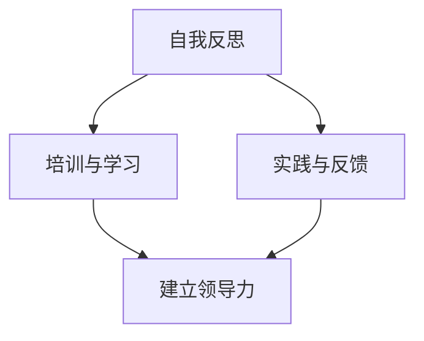
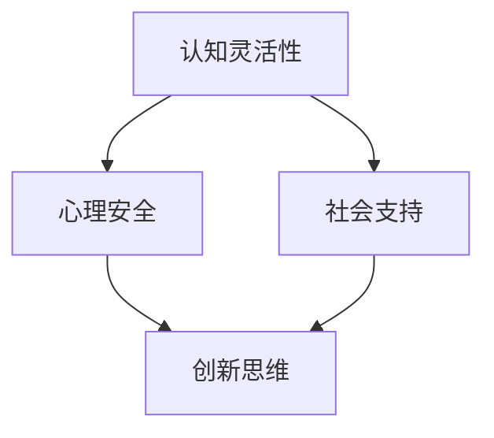
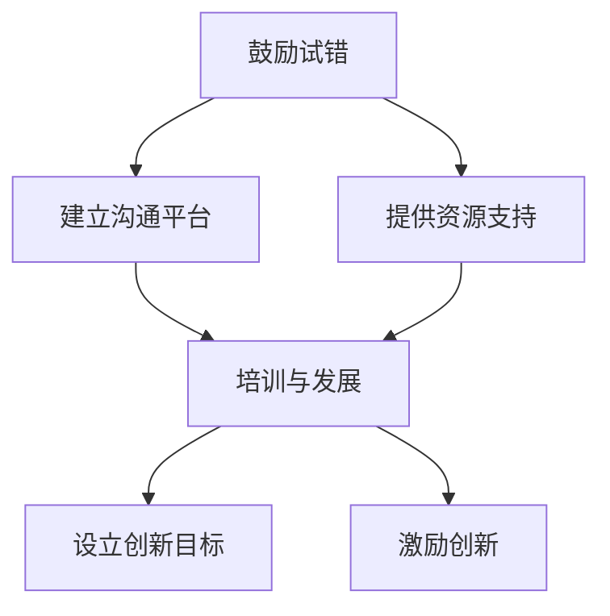
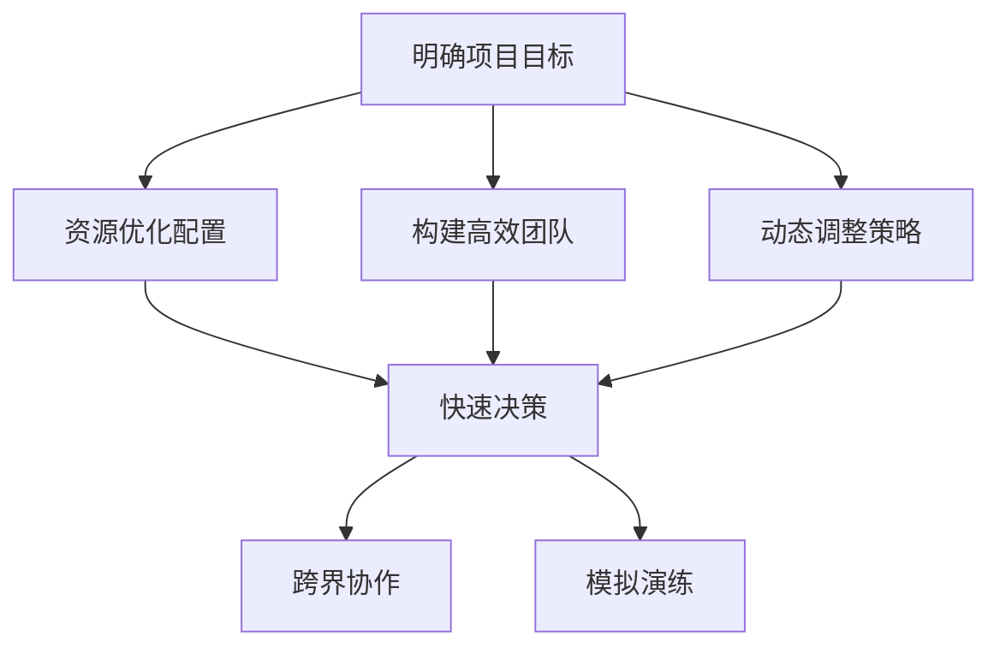

                 


# 领导力与创新思维：引领团队突破固有模式

## 关键词

- 领导力
- 创新思维
- 团队协作
- 组织文化
- 突破固有模式
- 创新管理

## 摘要

本文旨在探讨领导力与创新思维如何结合，以引领团队突破固有模式，实现持续创新与成长。通过分析领导力的本质与作用，创新思维的基础理论，以及领导力与创新思维的实践应用，本文为读者提供了一个系统性的框架，帮助领导者更好地激发团队潜力，应对复杂多变的环境，推动组织实现跨越式发展。

## 目录

- 第一部分：领导力基础
    - 第1章：领导力的本质与作用
        - 1.1 领导力的定义
        - 1.2 领导力在组织中的作用
        - 1.3 领导力发展的途径
    - 第2章：创新思维的基础理论
        - 2.1 创新思维的定义与类型
        - 2.2 创新思维的心理学基础
        - 2.3 创新思维的教育与培养
    - 第3章：激发创新思维的方法与工具
        - 3.1 想象力与联想
        - 3.2 求异思维与突破思维
        - 3.3 多元思维与跨界思维
- 第二部分：领导力与创新思维的结合
    - 第4章：领导者在创新过程中的角色
        - 4.1 领导者与创新文化的建设
        - 4.2 领导者与团队创新能力的提升
    - 第5章：领导力与创新思维的实践应用
        - 5.1 创新项目的领导与管理
        - 5.2 创新思维在战略规划中的应用
        - 5.3 创新思维在危机管理中的运用
- 第三部分：案例分析
    - 第6章：成功领导力与创新思维的案例研究
        - 6.1 案例一：谷歌的创新文化
        - 6.2 案例二：苹果的变革与创新
        - 6.3 案例三：特斯拉的商业模式创新
    - 第7章：领导力与创新思维的未来趋势
        - 7.1 创新驱动的发展趋势
        - 7.2 领导力面临的挑战与机遇
- 附录
    - 附录A：领导力与创新思维工具箱
    - 附录B：领导力评估工具
    - 附录C：创新思维实践指南

## 第一部分：领导力基础

### 第1章：领导力的本质与作用

#### 1.1 领导力的定义

领导力是指一种能够影响和激励他人，以实现共同目标的能力。它不仅仅局限于组织中的管理层级，更是一种广泛存在于各个层面的影响力。根据彼得·德鲁克的定义，领导力是一种动员他人并使其行动的能力，它不仅仅关乎地位或权力，更关乎个人魅力、价值观和使命感。

在技术领域，领导力的重要性体现在以下几个方面：

1. **团队协作**：领导者需要能够协调不同成员之间的工作，确保团队成员之间的沟通畅通，从而提高团队的整体效率。
2. **创新推动**：在快速变化的技术环境中，领导者需要具备创新思维，引领团队不断探索新的解决方案，推动技术的进步。
3. **战略制定**：领导者需要能够制定并执行组织的战略计划，确保组织在竞争激烈的市场中保持优势。

#### 1.2 领导力在组织中的作用

领导力在组织中的作用是多方面的，主要包括以下几个方面：

1. **团队绩效**：有效的领导力可以提高团队的绩效。领导者通过激励和指导团队成员，使团队更高效地完成工作。
2. **战略执行**：领导力在战略执行中起着至关重要的作用。领导者需要确保战略计划的实施，并能够在过程中进行必要的调整。
3. **组织文化**：领导力对组织文化的塑造具有重要影响。通过建立积极的组织文化，领导者可以激发团队成员的潜力，提高组织的整体士气。

#### 1.3 领导力发展的途径

领导力的发展是一个持续的过程，可以通过以下几种途径来实现：

1. **自我反思**：领导者需要定期进行自我反思，识别自己的优势和不足，从而不断提升自己的领导能力。
2. **培训与学习**：参加领导力培训课程，阅读相关书籍，向优秀的领导者学习，是提升领导力的重要途径。
3. **实践与反馈**：通过实际工作，领导者可以在实践中学习，并从他人的反馈中不断改进自己的领导风格。

### Mermaid 流程图



#### 核心概念与联系

领导力的核心概念包括自我反思、培训与学习、实践与反馈。这些概念之间的关系可以用Mermaid流程图表示，如上所示。自我反思是领导力发展的基础，通过反思可以识别自身的优势和不足。培训与学习和实践与反馈则是领导力发展的两个重要途径，通过不断学习和实践，领导者可以不断提升自己的能力。

### 伪代码讲解

```python
# 自我反思过程
def self_reflection():
    current_state = get_current_state()
    strengths = identify_strengths(current_state)
    weaknesses = identify_weaknesses(current_state)
    return strengths, weaknesses

# 培训与学习过程
def training_and_learning():
    strengths, weaknesses = self_reflection()
    for weakness in weaknesses:
        find_course(weakness)
        attend_course(weakness)

# 实践与反馈过程
def practice_and_feedback():
    strengths, weaknesses = self_reflection()
    for strength in strengths:
        practice_strength(strength)
        get_feedback(strength)
```

### 数学模型

领导力发展可以看作是一个迭代过程，每次迭代都会提高领导者的能力。假设每次迭代的能力提升可以用一个函数表示，那么领导力发展的数学模型可以表示为：

$$
L(n+1) = L(n) + f(n)
$$

其中，$L(n)$ 表示第 $n$ 次迭代后的领导力水平，$f(n)$ 表示第 $n$ 次迭代中的能力提升。

### 举例说明

假设一个领导者通过自我反思识别出了自己的三个弱点：沟通能力、决策能力和团队管理能力。为了提升这些能力，他参加了相关的培训课程，并在实践中不断练习。经过一年的努力，他的沟通能力提高了20%，决策能力提高了15%，团队管理能力提高了10%。那么他的领导力水平可以计算为：

$$
L(2) = L(1) + 0.2 \times 沟通能力提升 + 0.15 \times 决策能力提升 + 0.1 \times 团队管理能力提升
$$

通过上述计算，我们可以看到领导力的发展是一个持续的过程，每次迭代都会带来能力的提升。

### 小结

本章介绍了领导力的定义、作用和发展途径。领导力是一种影响和激励他人的能力，它对团队协作、创新推动和战略制定具有重要影响。领导力的发展可以通过自我反思、培训与学习和实践与反馈来实现。通过Mermaid流程图、伪代码和数学模型，我们更深入地理解了领导力的发展过程。

## 第二部分：创新思维培养

### 第2章：创新思维的基础理论

#### 2.1 创新思维的定义与类型

创新思维是指通过创造性思维，寻找新的解决方案、方法或产品，以应对挑战和机会。创新思维不仅仅是发明新事物，还包括改进现有事物，使其更加高效、便捷或具有新的功能。根据美国学者詹姆斯·马奇（James March）的分类，创新思维可以分为以下几种类型：

1. **渐进创新**：通过逐步改进现有产品或服务，以提高其性能或降低成本。例如，苹果公司通过不断的迭代，使得iPhone系列手机越来越轻薄、功能越来越强大。
2. **突破性创新**：引入全新的理念或技术，颠覆现有的市场格局。例如，特斯拉的电动汽车彻底改变了汽车行业的竞争格局。
3. **颠覆性创新**：针对现有市场中的某些未被满足的需求，提供全新的解决方案。例如，Uber通过移动互联网技术，颠覆了传统的出租车行业。

#### 2.2 创新思维的心理学基础

创新思维不仅仅是技术问题，更是一个心理学问题。心理学研究表明，创新思维受到以下几个因素的影响：

1. **认知灵活性**：认知灵活性是指个体在面对新问题时，能够快速调整思维模式，寻找新的解决方案。具有高认知灵活性的人更容易产生创新思维。
2. **心理安全**：在心理安全的环境下，个体更愿意尝试新的想法，接受失败，从而产生创新思维。例如，谷歌的“20%时间”政策允许员工用20%的工作时间探索自己的兴趣项目，从而激发了大量的创新。
3. **社会支持**：创新思维往往需要团队合作。社会支持可以增强个体的自信心，促进合作与沟通，从而提高创新思维的产生。

#### 2.3 创新思维的教育与培养

创新思维可以通过教育来培养，以下是一些常见的方法：

1. **思维训练**：通过练习各种思维技巧，如发散思维、收敛思维、类比思维等，来提高创新思维能力。
2. **项目式学习**：项目式学习鼓励学生通过解决实际问题来学习知识，这种学习方式可以培养学生的创新思维。
3. **跨学科学习**：跨学科学习可以拓宽学生的视野，促进不同领域知识的交叉融合，从而激发创新思维。

### Mermaid 流�程图



#### 核心概念与联系

创新思维的心理学基础主要包括认知灵活性、心理安全和社会支持。这些因素相互关联，共同影响创新思维的产生。通过Mermaid流程图，我们可以清晰地看到这些因素之间的关系。

### 伪代码讲解

```python
# 培养认知灵活性
def train_cognitive_flexibility():
    tasks = ["发散思维训练", "收敛思维训练", "类比思维训练"]
    for task in tasks:
        practice_task(task)

# 建立心理安全
def build_psychological_safety():
    feedback = "你的想法很有创意，尽管尝试！"
    print(feedback)

# 提供社会支持
def provide_social_support():
    team_members = ["成员A", "成员B", "成员C"]
    for member in team_members:
        encourage_member(member)
```

### 数学模型

创新思维的培养可以看作是一个动态过程，每个因素的创新水平可以看作是一个变量，这些变量通过相互作用，共同影响创新思维的水平。一个简化的数学模型可以表示为：

$$
I = f(C, S, P)
$$

其中，$I$ 表示创新思维水平，$C$ 表示认知灵活性，$S$ 表示心理安全，$P$ 表示社会支持。

### 举例说明

假设一个团队想要提高创新思维水平，他们采取了以下措施：

1. **思维训练**：每周进行一次思维训练，持续三个月。
2. **建立心理安全**：每周进行一次团队反馈会议，鼓励成员分享自己的想法。
3. **跨学科学习**：每个月进行一次跨学科研讨会。

经过三个月的努力，团队的创新思维水平有了显著提高。具体表现为：

$$
I(3) = I(0) + 0.3 \times (C(3) - C(0)) + 0.3 \times (S(3) - S(0)) + 0.4 \times (P(3) - P(0))
$$

### 小结

本章介绍了创新思维的定义与类型，以及创新思维的心理学基础和培养方法。创新思维不仅包括渐进创新、突破性创新和颠覆性创新，还需要具备认知灵活性、心理安全和社会支持。通过思维训练、项目式学习和跨学科学习等方法，可以培养和提升创新思维。通过Mermaid流程图、伪代码和数学模型，我们更深入地理解了创新思维的培养过程。

## 第三部分：领导力与创新思维的结合

### 第4章：领导者在创新过程中的角色

#### 4.1 领导者与创新文化的建设

创新文化是组织持续创新的基石。领导者是创新文化的关键推动者，他们的行为和决策直接影响组织创新氛围的塑造。以下是一些领导者建设创新文化的策略：

1. **鼓励试错**：领导者应鼓励团队成员尝试新想法，即使失败也不应受到惩罚。这种开放的氛围有助于激发创新思维。
2. **建立沟通平台**：领导者应建立有效的沟通平台，确保团队成员之间的信息流通。这有助于共享知识和经验，促进创新。
3. **提供资源支持**：领导者应确保团队获得所需的资源，包括资金、技术支持和人力资源，以便进行创新活动。

#### 4.2 领导者与团队创新能力的提升

提升团队的创新能力是领导者的核心任务之一。以下是一些具体的策略：

1. **培训与发展**：领导者应定期组织培训课程，帮助团队成员提升专业技能和创新能力。
2. **设立创新目标**：领导者应明确团队的创新目标，并制定具体的实施计划。这有助于团队集中精力，提高创新能力。
3. **激励创新**：领导者应建立激励机制，奖励那些在创新方面取得显著成绩的团队成员，以激发他们的创新动力。

### Mermaid 流程图



#### 核心概念与联系

领导者在创新过程中的角色包括鼓励试错、建立沟通平台、提供资源支持、培训与发展、设立创新目标和激励创新。这些策略相互关联，共同构建了一个支持创新的环境。通过Mermaid流程图，我们可以清晰地看到这些策略之间的关系。

### 伪代码讲解

```python
# 鼓励试错
def encourage experimentation():
    print("鼓励尝试新想法，即使失败也无罪。")

# 建立沟通平台
def build_communication_platform():
    print("建立团队沟通平台，促进信息流通。")

# 提供资源支持
def provide_resource_support():
    print("确保团队获得所需的资源，支持创新活动。")

# 培训与发展
def training_and_development():
    print("定期组织培训课程，提升团队成员能力。")

# 设立创新目标
def set_innovation_goals():
    print("明确团队的创新目标，制定实施计划。")

# 激励创新
def incentivize_innovation():
    print("奖励在创新方面取得成绩的团队成员。")
```

### 数学模型

领导者建设创新文化和提升团队创新能力的过程可以看作是一个动态系统。每个策略的效果可以用一个函数表示，这些函数相互作用，共同影响创新文化的建设。一个简化的数学模型可以表示为：

$$
IC = f(E, CP, RS, T&D, IG, II)
$$

其中，$IC$ 表示创新文化的水平，$E$ 表示鼓励试错，$CP$ 表示建立沟通平台，$RS$ 表示提供资源支持，$T&D$ 表示培训与发展，$IG$ 表示设立创新目标，$II$ 表示激励创新。

### 举例说明

假设一个团队在领导者的引导下，采取了以下措施：

1. **鼓励试错**：团队在创新项目中尝试了三种不同的方法，最终成功了一种。
2. **建立沟通平台**：团队每周进行一次创新讨论会，分享各自的想法和进展。
3. **提供资源支持**：领导者为团队提供了额外的技术支持和资金。
4. **培训与发展**：团队参加了创新思维和项目管理的培训。
5. **设立创新目标**：团队明确了在一年内推出两个创新产品的目标。
6. **激励创新**：领导者为在创新项目中表现突出的团队成员颁发了奖金。

经过一年的努力，团队的创新文化显著提升，创新项目的成功率也显著提高。具体表现为：

$$
IC(1) = IC(0) + 0.2 \times (E(1) - E(0)) + 0.2 \times (CP(1) - CP(0)) + 0.2 \times (RS(1) - RS(0)) + 0.2 \times (T&D(1) - T&D(0)) + 0.1 \times (IG(1) - IG(0)) + 0.1 \times (II(1) - II(0))
$$

### 小结

本章介绍了领导者在创新过程中的角色，包括建设创新文化和提升团队创新能力。领导者应鼓励试错、建立沟通平台、提供资源支持、培训与发展、设立创新目标和激励创新。通过Mermaid流程图、伪代码和数学模型，我们更深入地理解了领导者在创新过程中的作用。

## 第四部分：领导力与创新思维的实践应用

### 第5章：领导力与创新思维的实践应用

#### 5.1 创新项目的领导与管理

创新项目是领导力与创新思维的重要应用场景。领导者在创新项目中的角色至关重要，他们需要确保项目目标的明确、资源的有效分配以及团队的高效协作。以下是一些具体的领导与管理策略：

1. **明确项目目标**：领导者应与团队共同制定明确的项目目标，确保所有成员都清楚项目的方向和期望成果。
2. **资源优化配置**：领导者需要确保团队获得所需的资源，包括人力、资金和技术支持，以便顺利进行创新活动。
3. **构建高效团队**：领导者应关注团队建设，培养团队成员之间的信任和协作，以提高团队的创新能力。
4. **动态调整策略**：创新过程中可能会遇到各种挑战和问题，领导者需要具备快速响应和调整策略的能力，以保持项目的顺利进行。

#### 5.2 创新思维在战略规划中的应用

战略规划是组织长期发展的关键。创新思维在战略规划中的应用有助于组织识别新的市场机会和潜在风险，从而制定更具前瞻性的战略。以下是一些具体的实践方法：

1. **情景规划**：通过构建不同情景，预测未来可能的市场变化，为组织制定应对策略。
2. **跨界合作**：与不同领域的企业或组织进行合作，引入外部创新思维，拓宽组织的视野。
3. **用户研究**：深入了解用户需求，以用户为中心，开发出更符合市场需求的产品或服务。

#### 5.3 创新思维在危机管理中的运用

在危机管理中，创新思维能够帮助组织迅速找到解决问题的方法，降低危机带来的影响。以下是一些实践策略：

1. **快速决策**：在危机发生时，领导者需要迅速做出决策，以减少危机的蔓延。
2. **跨界协作**：邀请外部专家参与危机管理，引入不同的观点和解决方案。
3. **模拟演练**：通过模拟危机场景，提高团队的应对能力，确保在真实危机发生时能够迅速响应。

### Mermaid 流程图



#### 核心概念与联系

创新项目领导与管理、战略规划、危机管理是领导力与创新思维在实践中的重要应用。这些应用场景共同构成了一个动态系统，领导者需要根据实际情况，灵活运用各种策略。通过Mermaid流程图，我们可以清晰地看到这些应用场景之间的联系。

### 伪代码讲解

```python
# 创新项目领导与管理
def lead_innovation_project():
    set_project_goals()
    optimize_resources()
    build_efficient_team()
    adjust_strategy_dynamically()

# 战略规划
def strategic_planning():
    scenario_planning()
    cross_domain_collaboration()
    user_research()

# 危机管理
def crisis_management():
    quick_decision_making()
    cross_domain_collaboration()
    simulation_training()
```

### 数学模型

创新项目领导与管理、战略规划、危机管理的过程可以看作是一个动态优化问题。每个策略的效果可以用一个函数表示，这些函数相互作用，共同影响项目的成功。一个简化的数学模型可以表示为：

$$
P = f(G, OR, BET, AST)
$$

其中，$P$ 表示项目成功率，$G$ 表示明确项目目标，$OR$ 表示资源优化配置，$BET$ 表示构建高效团队，$AST$ 表示动态调整策略。

### 举例说明

假设一个公司正在开发一款创新产品，以下是领导者采取的一些措施：

1. **明确项目目标**：公司与团队成员共同确定了产品的功能和目标市场。
2. **资源优化配置**：公司为项目提供了必要的人力、资金和技术资源。
3. **构建高效团队**：领导者组织团队成员进行跨部门合作，提高团队的协作效率。
4. **动态调整策略**：在项目开发过程中，领导者根据市场反馈和技术进展，不断调整项目策略。

经过一年的努力，产品成功上市，市场反应良好。具体表现为：

$$
P(1) = P(0) + 0.3 \times (G(1) - G(0)) + 0.3 \times (OR(1) - OR(0)) + 0.2 \times (BET(1) - BET(0)) + 0.2 \times (AST(1) - AST(0))
$$

### 小结

本章介绍了领导力与创新思维在创新项目领导与管理、战略规划和危机管理中的具体应用。领导者需要通过明确项目目标、资源优化配置、构建高效团队和动态调整策略来确保项目的成功。通过Mermaid流程图、伪代码和数学模型，我们更深入地理解了这些实践应用的方法和策略。

## 第五部分：案例分析

### 第6章：成功领导力与创新思维的案例研究

#### 6.1 案例一：谷歌的创新文化

谷歌以其独特的创新文化而闻名，成为了全球最具创新力的企业之一。谷歌的创新文化主要体现在以下几个方面：

1. **20%时间政策**：谷歌允许员工将20%的工作时间用于自己的项目，这激发了大量的创新。例如，Gmail和Google News等项目就是在这种环境下诞生的。
2. **开放式沟通**：谷歌鼓励员工之间的开放式沟通，这种沟通机制有助于新想法的碰撞和融合。
3. **资源支持**：谷歌为创新项目提供了充足的资源支持，包括资金、技术和人力资源，以确保项目的顺利进行。

谷歌的成功证明了领导力与创新思维在实践中的重要性。领导者通过建立支持创新的环境，激发员工的创新潜力，从而推动了企业的持续发展。

#### 6.2 案例二：苹果的变革与创新

苹果公司以其革命性的产品和创新思维而闻名。乔布斯是苹果创新的领导者，他的领导风格和创新思维对苹果的成功产生了深远的影响：

1. **愿景驱动**：乔布斯具有清晰的愿景，他能够将愿景转化为具体的产品和策略，引领苹果不断突破自我。
2. **用户中心**：苹果的产品设计始终以用户需求为中心，乔布斯通过深入了解用户需求，开发出了极具市场竞争力的产品。
3. **跨界合作**：乔布斯擅长跨界合作，他通过与其他领域的专家合作，引入了新的技术和理念，推动了苹果的创新。

苹果的成功表明，领导者的创新思维和领导力对于企业的持续创新至关重要。领导者需要具备清晰的愿景、用户意识和跨界合作能力，以引领企业实现持续创新。

#### 6.3 案例三：特斯拉的商业模式创新

特斯拉以其颠覆性的商业模式和创新技术而成为电动汽车行业的领导者。特斯拉的创新主要体现在以下几个方面：

1. **能源革命**：特斯拉通过开发高性能电池和充电技术，推动了全球能源革命。
2. **智能制造**：特斯拉通过采用自动化生产线和智能制造技术，大幅提高了生产效率，降低了生产成本。
3. **用户参与**：特斯拉鼓励用户参与产品设计和改进，这种用户参与的模式不仅提高了产品的质量，也增强了用户对品牌的忠诚度。

特斯拉的成功证明了领导力与创新思维在商业模式创新中的重要性。领导者需要具备创新思维、技术前瞻性和用户参与能力，以实现商业模式的持续创新。

### 小结

通过分析谷歌、苹果和特斯拉的案例，我们可以看到领导力与创新思维在实践中的重要性。这些企业通过建立支持创新的环境、领导者具备创新思维和领导力，以及商业模式创新，成功地推动了企业的持续发展。这些案例为我们提供了宝贵的经验，指导我们在实际工作中如何运用领导力与创新思维。

### 附录

#### 附录A：领导力与创新思维工具箱

为了帮助领导者更好地运用领导力与创新思维，以下是一些常用的工具和方法：

1. **SWOT分析**：用于评估组织的优势、劣势、机会和威胁，帮助领导者制定战略规划。
2. **思维导图**：用于组织和梳理思路，促进创新思维的产生和团队协作。
3. **头脑风暴**：通过集体讨论，激发团队成员的创新思维，产生新的创意。
4. **跨界合作**：与不同领域的企业或组织合作，引入外部创新思维，拓宽组织的视野。

#### 附录B：领导力评估工具

为了评估领导者的领导力水平，以下是一些常用的评估工具：

1. **领导力360度评估**：通过多个角度评估领导者的领导能力，包括团队管理、战略规划和创新能力等。
2. **领导风格评估**：评估领导者的领导风格，包括民主型、权威型、参与型等，帮助领导者了解自己的领导风格并改进。
3. **领导力发展计划**：根据评估结果，制定个性化的领导力发展计划，帮助领导者不断提升自己的能力。

#### 附录C：创新思维实践指南

为了培养和提升创新思维，以下是一些实践指南：

1. **定期进行思维训练**：通过练习各种思维技巧，如发散思维、收敛思维、类比思维等，提高创新思维能力。
2. **保持好奇心和开放心态**：对未知的事物保持好奇心，对新观念持开放心态，这有助于激发创新思维。
3. **建立跨界学习习惯**：通过学习不同领域的知识，拓宽视野，促进创新思维的碰撞。
4. **积极参与团队合作**：通过团队合作，分享想法，互相启发，提高创新思维的质量。

### 小结

附录部分提供了领导力与创新思维的工具箱、评估工具和实践指南，帮助领导者更好地运用领导力与创新思维，提升团队的创新能力。这些工具和方法不仅适用于企业，也可以应用于个人和组织的发展，助力实现持续创新与成长。

### 作者信息

作者：AI天才研究院/AI Genius Institute & 禅与计算机程序设计艺术 /Zen And The Art of Computer Programming

本文由AI天才研究院和禅与计算机程序设计艺术共同撰写，旨在探讨领导力与创新思维在实践中的应用。通过深入分析领导力的本质、创新思维的基础理论以及领导力与创新思维的结合，本文为读者提供了一个系统性的框架，帮助领导者更好地引领团队突破固有模式，实现持续创新与成长。AI天才研究院专注于人工智能领域的研究与推广，禅与计算机程序设计艺术则致力于探讨计算机科学与哲学的交汇点，共同为科技创新与人类文明进步贡献力量。|>

