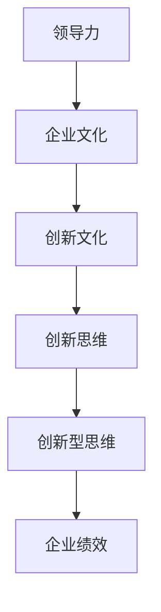

                 

### 文章标题：领导力与创新文化：培养创新型思维

#### 关键词：领导力、创新文化、创新型思维、企业绩效、创新思维工具、设计思维、项目实战

#### 摘要：
本文旨在探讨领导力与创新文化的融合，以及如何通过培养创新型思维来提升企业绩效。我们将逐步分析领导力与创新文化之间的关系，介绍创新思维的概念和工具，并通过实际案例来展示如何将创新思维应用于项目实践中。文章的目标是帮助读者理解领导力与创新文化的重要性，掌握培养创新型思维的方法，并能够将其应用于实际工作中。

---

### 目录大纲设计步骤

在撰写本文之前，我们需要进行详细的目录大纲设计，以确保文章的逻辑清晰、内容丰富且结构紧凑。以下是设计目录大纲的步骤：

1. **确定书的主题和目标读者**：
   - 首先，明确书的主题是《领导力与创新文化：培养创新型思维》。
   - 其次，确定目标读者，包括企业管理层、企业员工、创业者等。

2. **规划整体结构**：
   - 将书分为四个主要部分：引言、领导力与企业文化、创新思维培养、领导力与创新文化的融合实践。
   - 确定每个部分的大纲，包括章节标题和简要内容。

3. **细化每个章节**：
   - 对每个章节进行细化，列出二级和三级目录。
   - 确保每个章节的内容都有明确的主题和目标。

4. **核心概念与联系**：
   - 准备 Mermaid 流程图，展示领导力、创新文化和创新型思维之间的联系。

5. **核心算法原理讲解**：
   - 使用伪代码详细阐述创新思维培养的核心算法原理。

6. **数学模型和数学公式**：
   - 引入相关的数学模型和公式，并使用 LaTeX 格式进行详细讲解和举例说明。

7. **项目实战**：
   - 提供实际案例，详细解释说明如何将理论应用到实际项目中。

8. **最终审查和修改**：
   - 审查整个目录大纲，确保其逻辑清晰、内容完整、字数符合要求。

### 核心概念与联系（Mermaid 流程图）



通过上述步骤，我们设计出了本文的目录大纲，为后续内容的撰写提供了清晰的框架。

---

### 第一部分：引言

#### 第1章 领导力与创新文化的融合

#### 1.1 创新文化的定义与重要性

创新文化是企业成功的关键因素之一。它不仅仅是一个口号，而是贯穿于企业各个层面的实践和价值观。创新文化的定义可以概括为一种鼓励创新、容忍失败、追求卓越的氛围和机制。这种文化在企业中的重要性体现在以下几个方面：

- **提升竞争力**：在快速变化的市场环境中，创新是企业在竞争中脱颖而出的关键。创新文化能够激发员工的创造力，推动新产品、新服务的开发，从而提高企业的市场竞争力。

- **促进持续发展**：创新文化有助于企业不断突破自身能力的边界，推动技术的进步和管理创新，实现企业的持续发展。

- **增强员工满意度**：在创新文化中，员工有机会参与到创新过程中，感受到自身的价值和重要性，从而提高工作满意度和忠诚度。

#### 1.2 领导力在创新文化中的角色

领导力在创新文化中扮演着至关重要的角色。领导者的行为和决策不仅直接影响创新文化的形成和维持，还影响着员工的创新动机和行为。以下是领导力在创新文化中的一些关键角色：

- **倡导者**：领导者需要率先倡导创新文化，将其作为企业核心价值观之一。他们通过自身的言行来传递创新的重要性，鼓励员工勇于尝试新思路和方法。

- **推动者**：领导者需要推动创新文化的落地，为员工提供支持和资源。他们可以通过组织创新活动、设立创新奖项等方式，激励员工积极参与创新实践。

- **协调者**：在创新过程中，领导者需要协调不同部门和团队之间的合作，解决潜在的冲突和障碍，确保创新项目的顺利进行。

#### 1.3 领导力与创新文化的融合路径

要实现领导力与创新文化的深度融合，企业可以采取以下几条路径：

- **建立明确的创新目标**：领导者需要明确企业的创新目标，并将其纳入企业战略规划中。这有助于统一员工的方向和努力，确保创新活动与企业的长远发展目标相一致。

- **培养创新型人才**：领导者需要识别和培养具备创新潜力的人才，为他们的成长提供支持和资源。这可以通过内部培训、外部招聘等方式实现。

- **建立创新激励机制**：领导者需要建立有效的创新激励机制，包括物质激励和精神激励。这可以激发员工的创新动力，提高他们的创新积极性。

- **鼓励跨部门合作**：领导者需要鼓励不同部门之间的合作，打破部门壁垒，促进知识共享和创新思路的碰撞。

- **建立创新风险容忍机制**：领导者需要建立一种容忍失败的创新文化，鼓励员工在创新过程中勇于尝试，不怕失败。这可以降低员工的创新风险，提高他们的创新成功率。

通过上述措施，企业可以逐步建立起以领导力为驱动，以创新文化为核心的创新生态系统，从而在激烈的市场竞争中立于不败之地。

---

### 第二部分：领导力与企业文化

#### 第2章 领导力基础

#### 2.1 领导力的定义与类型

领导力是指领导者通过影响力、沟通能力和决策能力来引导和激励团队，实现组织目标的能力。领导力不仅仅是管理，更是一种影响力，一种能够激发他人潜能、凝聚团队的力量。以下是领导力的几个主要类型：

- **指挥型领导**：指挥型领导者通过明确的目标和详细的指令来指导团队。这种领导风格适用于紧急情况和需要快速决策的场合。

- **民主型领导**：民主型领导者鼓励团队成员参与决策过程，尊重每个成员的意见。这种领导风格有助于增强团队凝聚力和创新思维。

- **变革型领导**：变革型领导者通过激励和启发团队成员，推动组织变革和创新发展。这种领导风格强调个人价值观和愿景的重要性。

- **赋能型领导**：赋能型领导者通过授权和赋能团队成员，让他们自主决策和承担责任。这种领导风格有助于提升团队成员的积极性和创造力。

#### 2.2 领导力模型与理论

领导力模型是理解和应用领导力的重要工具。以下是几个常见的领导力模型：

- **情境领导模型**：由赫赛和布兰查德提出的情境领导模型认为，领导风格应该根据下属的能力和动机来调整。该模型将领导风格分为四种：指挥型、支持型、参与型和委托型。

- **领导力五因素模型**：由布兰克和哈斯提出，该模型认为领导力由五个因素组成：交易型领导、变革型领导、团队型领导、任务型领导和关系型领导。

- **变革型领导模型**：由伯恩斯提出，该模型认为变革型领导者通过激励和启发团队成员，推动组织变革和创新发展。

#### 2.3 领导力的核心能力

有效的领导力需要具备一系列核心能力。以下是领导力的几个关键能力：

- **沟通能力**：领导者需要具备良好的沟通能力，包括倾听、表达和反馈。这有助于建立信任和共识，确保信息传递的准确性和及时性。

- **决策能力**：领导者需要具备良好的决策能力，能够在复杂和不确定的情况下做出明智的决策。这需要领导者具备分析问题的能力、风险评估的能力和快速决策的能力。

- **激励能力**：领导者需要具备激励能力，能够激发团队成员的积极性和创造力。这可以通过设置合理的目标、提供奖励和认可等方式实现。

- **团队管理能力**：领导者需要具备团队管理能力，能够建立有效的团队、协调团队成员之间的合作和解决团队冲突。

- **变革管理能力**：领导者需要具备变革管理能力，能够在组织变革中引导和激励团队成员，确保变革的顺利进行。

通过了解领导力的定义、类型、模型和核心能力，领导者可以更好地理解和应用领导力，提升自身的领导力水平，从而推动企业的发展和成功。

---

#### 第3章 企业文化与创新文化

#### 3.1 企业文化的概念与特征

企业文化是指企业在长期经营过程中形成的共同价值观、信念和行为规范。它是企业内部的一种隐性管理机制，通过影响员工的行为和决策，推动企业的发展和成功。以下是企业文化的几个主要特征：

- **共同价值观**：企业文化是企业共同认可和遵循的价值观，它反映了企业的核心价值观和行为准则。

- **持续性**：企业文化是企业在长期经营过程中逐步形成的，具有持续性和稳定性。

- **传承性**：企业文化在企业内部代代相传，通过员工的培训和传承，确保企业文化的持续发展。

- **差异性**：不同企业的企业文化具有明显的差异性，反映了企业的历史背景、行业特点和领导风格。

#### 3.2 企业文化的构建与演变

企业文化的构建是一个长期而持续的过程，涉及以下几个方面：

- **领导层的倡导**：企业领导层需要率先倡导和践行企业文化，通过自身的言行树立榜样，影响和带动全体员工。

- **员工参与**：企业文化需要全体员工的共同参与和认同，企业可以通过各种形式，如员工大会、培训、团队建设等，促进员工对企业文化的理解和接受。

- **制度保障**：企业需要通过制度来保障企业文化的实施和传承，如制定企业文化手册、企业行为准则等。

企业文化的演变是一个动态的过程，随着企业的发展和外部环境的变化，企业文化也会相应地调整和演变。以下是企业文化演变的一些常见趋势：

- **从单一向多元化转变**：随着企业的发展和国际化，企业文化逐渐从单一文化向多元化文化转变，融合不同文化背景和价值观。

- **从权威向民主化转变**：现代企业文化更加注重民主化和员工参与，通过建立开放、透明和包容的管理机制，促进员工的自主性和创新性。

- **从传统向创新转变**：随着科技的发展和市场竞争的加剧，企业文化逐渐从传统向创新转变，鼓励员工勇于创新、持续改进。

#### 3.3 创新文化与组织绩效

创新文化是企业持续发展的重要驱动力，它能够提升企业的竞争力和创新能力。创新文化对组织绩效的影响体现在以下几个方面：

- **提高员工创新意识**：创新文化能够激发员工的创新意识，鼓励他们勇于尝试新思路和方法，从而提升企业的创新能力和市场竞争力。

- **促进知识共享**：创新文化强调知识共享和团队合作，有助于员工之间的交流和协作，提高团队整体的知识水平和创新能力。

- **提升企业竞争力**：创新文化能够帮助企业快速响应市场变化，开发出更具竞争力的产品和服务，从而提升企业的市场地位和绩效。

- **增强企业适应力**：创新文化使企业能够迅速适应外部环境的变化，灵活调整战略和运营模式，提高企业的生存和发展能力。

通过构建和维持创新文化，企业可以不断提升组织绩效，实现持续发展和竞争优势。

---

### 第三部分：创新思维培养

#### 第4章 创新思维概述

#### 4.1 创新思维的定义与类型

创新思维是指通过独特、创造性的思考方式来解决问题和发现新机会的能力。它是一种超越常规、寻求突破的思维方式。创新思维可以分为以下几个类型：

- **发散思维**：发散思维是指从不同的角度和方向思考问题，寻求多种可能的解决方案。它能够激发创意和想象力，有助于发现新的机会和解决方案。

- **收敛思维**：收敛思维是指从多个可能的解决方案中筛选出最优的方案。它强调逻辑和推理能力，有助于对问题进行深入分析和评估。

- **系统思维**：系统思维是指从整体和系统的角度思考问题，考虑各个部分之间的相互作用和影响。它有助于识别问题的根本原因，制定全面的解决方案。

- **跨学科思维**：跨学科思维是指跨越不同学科和领域的思维方式，通过整合不同领域的知识和方法来解决复杂问题。

#### 4.2 创新思维的重要性

创新思维在现代社会中具有极其重要的意义。以下是创新思维的重要性体现在几个方面：

- **推动社会进步**：创新思维能够推动社会进步和经济发展，通过解决现实问题和创造新机会，提升人类的生活质量和幸福感。

- **提升竞争力**：创新思维能够帮助企业应对市场变化和竞争压力，开发出更具竞争力的产品和服务，从而提升企业的市场地位和绩效。

- **培养创新能力**：创新思维是培养创新能力的基础，通过不断思考和探索，个人和组织可以不断提升自身的创新能力和竞争力。

- **促进可持续发展**：创新思维能够促进可持续发展，通过开发绿色技术、推广环保理念，实现经济发展与环境保护的平衡。

#### 4.3 创新思维的培养路径

要培养创新思维，个人和组织可以采取以下几种方法：

- **学习与创新方法**：学习各种创新方法和工具，如头脑风暴、思维导图、设计思维等，有助于拓展思维方式和解决问题能力。

- **跨学科学习**：跨学科学习可以丰富知识储备，培养跨学科思维，提高解决复杂问题的能力。

- **实践与创新**：通过实际项目和创新实践，将理论知识应用到实际中，积累经验和技能，提高创新思维的实际应用能力。

- **培养好奇心和批判性思维**：保持好奇心，不断提出问题和挑战现状，培养批判性思维，勇于质疑和反思，有助于激发创新思维。

通过以上方法，个人和组织可以不断提升创新思维能力，应对复杂多变的社会环境，实现持续发展和竞争优势。

---

#### 第5章 创新思维工具与方法

#### 5.1 想象力与创意生成

想象力是创新思维的重要源泉，它能够激发创意和创造力，推动创新的发生。以下是培养想象力的一些方法：

- **阅读和观看**：通过阅读书籍、观看电影和纪录片，可以开阔视野，激发想象力。

- **脑力训练**：进行脑力训练，如解谜、逻辑思维游戏等，有助于提高思维能力和创造力。

- **跨界思考**：尝试将不同领域和行业的知识进行交叉融合，有助于产生独特的创意。

创意生成是想象力转化为实际创新的关键步骤。以下是一些创意生成的工具和方法：

- **头脑风暴**：头脑风暴是一种集体创意生成方法，通过快速、自由地提出各种想法，激发团队成员的创意思维。

- **思维导图**：思维导图是一种图形化的思考工具，通过将思维过程以图形的方式展示出来，有助于梳理思路、发现关联和激发创意。

- **TRIZ方法**：TRIZ是一种基于理论基础的创新方法，通过解决常见的创新难题，提供解决问题的方法和思路。

#### 5.2 头脑风暴与思维导图

头脑风暴和思维导图是两种常见的创新思维工具，它们在创意生成和问题解决中发挥着重要作用。

**头脑风暴**：

- **定义**：头脑风暴是一种集体创意生成方法，通过快速、自由地提出各种想法，不受任何限制，激发团队成员的创意思维。
- **步骤**：
  1. 确定主题：明确讨论的主题和目标。
  2. 提出想法：鼓励团队成员尽可能多地提出各种想法，不论想法是否可行。
  3. 记录和分类：将提出的想法进行记录和分类，以便后续分析和筛选。
  4. 评估和选择：对提出的想法进行评估和筛选，选择最具潜力和可行性的创意。

**思维导图**：

- **定义**：思维导图是一种图形化的思考工具，通过将思维过程以图形的方式展示出来，有助于梳理思路、发现关联和激发创意。
- **步骤**：
  1. 确定中心主题：在思维导图中心绘制一个主题词或图形，表示要解决的问题或创意主题。
  2. 添加分支：从中心主题出发，添加相关的分支和子主题，表示各个方面的想法和思路。
  3. 丰富内容：在各个分支和子主题上添加文字、图像、符号等，以丰富思维导图的内容。
  4. 分析和优化：通过分析和优化思维导图，梳理思路、发现关联和激发新的创意。

头脑风暴和思维导图相辅相成，可以有效地激发创意思维，帮助个人和组织在创新过程中找到新的解决方案。

#### 5.3 设计思维与创新方法

设计思维是一种以人为本的创新方法，它强调从用户的角度出发，通过迭代和试错来解决问题和创造新价值。以下是设计思维的核心步骤：

- **同理心**：通过深入了解用户的需求和痛点，建立对用户的同理心，从而更好地理解用户的需求和行为。

- **定义问题**：明确要解决的问题或目标，将其转化为具体的用户需求和问题陈述。

- **创意生成**：通过头脑风暴、思维导图等方法，生成各种可能的解决方案。

- **原型制作**：制作初步的原型，通过快速迭代和用户反馈来不断优化和改进。

- **测试和验证**：将原型交付给用户进行测试和验证，收集反馈并进行改进。

设计思维强调用户参与和迭代优化，有助于提高创新的成功率和实用性。以下是几种常见的创新方法：

- **快速原型法**：通过快速制作原型，快速验证和改进，缩短创新周期。

- **敏捷开发**：采用敏捷开发方法，通过快速迭代和用户反馈来优化产品。

- **跨界合作**：通过跨界合作，整合不同领域的资源和知识，创造新的创新机会。

- **开源创新**：通过开源社区的合作和贡献，共享知识和资源，推动创新。

设计思维和创新方法的结合，可以帮助个人和组织在创新过程中更加高效地解决问题，创造出具有实际价值的创新成果。

---

#### 第6章 创新思维的实践与案例

#### 6.1 创新思维在产品开发中的应用

创新思维在产品开发中扮演着至关重要的角色，它能够帮助团队发现新的市场需求，创造独特的用户体验，提升产品的竞争力。以下是创新思维在产品开发中的应用步骤：

1. **市场调研**：通过市场调研，了解用户的需求和痛点，识别潜在的市场机会。

2. **用户画像**：创建用户画像，明确目标用户群体的特点和需求，为后续的设计提供参考。

3. **创意生成**：采用头脑风暴、思维导图等方法，生成各种可能的解决方案和创意。

4. **原型设计**：制作初步的原型，通过快速迭代和用户反馈来不断优化和改进。

5. **用户测试**：将原型交付给用户进行测试和验证，收集反馈并进行改进。

6. **产品优化**：根据用户反馈和测试结果，对产品进行优化和改进，确保产品能够满足用户的需求。

通过以上步骤，团队可以有效地应用创新思维，开发出具有市场竞争力的产品。

#### 6.2 创新思维在项目管理中的应用

创新思维在项目管理中同样具有重要价值，它可以帮助项目经理和团队应对复杂的项目挑战，提高项目的成功率和效率。以下是创新思维在项目管理中的应用步骤：

1. **问题识别**：通过会议讨论、风险评估等方法，识别项目中的问题和潜在风险。

2. **解决方案生成**：采用头脑风暴、思维导图等方法，生成各种可能的解决方案。

3. **方案评估**：对生成的解决方案进行评估和筛选，选择最具可行性和创新性的方案。

4. **试点测试**：选择一个或几个方案进行试点测试，验证其可行性和效果。

5. **迭代优化**：根据试点测试的结果，对方案进行迭代优化，确保其能够在项目中有效实施。

6. **实施和监控**：将优化的方案应用到项目中，并持续监控项目进展和效果，确保项目目标的实现。

通过以上步骤，项目经理和团队能够有效地应用创新思维，提高项目的管理水平和成功率。

#### 6.3 创新思维在组织变革中的应用

创新思维在组织变革中扮演着关键角色，它能够帮助组织适应外部环境的变化，推动组织的发展和转型。以下是创新思维在组织变革中的应用步骤：

1. **问题诊断**：通过内部调研和访谈，识别组织存在的问题和瓶颈。

2. **愿景制定**：明确组织变革的目标和愿景，确保变革的方向和目标一致。

3. **方案设计**：采用头脑风暴、设计思维等方法，生成各种可能的变革方案。

4. **试点实施**：选择一个或几个方案进行试点实施，验证其可行性和效果。

5. **推广实施**：根据试点结果，将优化的方案推广到整个组织，确保变革的全面实施。

6. **监控和反馈**：持续监控变革的进展和效果，收集反馈并进行调整，确保变革目标的实现。

通过以上步骤，组织能够有效地应用创新思维，实现组织变革，提升组织的竞争力和创新能力。

---

### 第四部分：领导力与创新文化的融合实践

#### 第7章 领导力与创新文化的实践路径

#### 7.1 创新文化的领导力实践

要构建和维持创新文化，领导者的行为和决策至关重要。以下是一些领导力实践方法：

- **领导层的倡导**：领导层需要率先倡导创新文化，将其作为企业核心价值观之一。通过树立榜样、宣传创新文化，激励员工积极参与创新实践。

- **鼓励风险容忍**：领导者需要鼓励员工勇于尝试新思路和方法，容忍失败。通过建立风险容忍机制，降低员工创新的风险，激发他们的创新动力。

- **提供资源和支持**：领导者需要为员工提供足够的资源和支持，包括技术支持、资金支持和培训机会，确保创新活动能够顺利进行。

- **激励机制**：建立有效的激励机制，包括物质激励和精神激励，激发员工的创新积极性。通过奖励创新成果，提高员工的创新动力和成就感。

- **跨部门协作**：领导者需要鼓励不同部门之间的协作，打破部门壁垒，促进知识共享和创新思路的碰撞。通过建立跨部门项目组，推动跨部门合作和创新。

#### 7.2 领导力在创新文化中的角色转换

在创新文化中，领导者需要从传统的指挥者转变为协作者和推动者。以下是一些角色转换的方法：

- **从指令型领导到参与型领导**：领导者需要从单一的指令型领导转变为参与型领导，鼓励员工参与决策过程，尊重他们的意见和建议。

- **从控制型领导到支持型领导**：领导者需要从控制型领导转变为支持型领导，提供必要的支持和资源，帮助员工解决创新过程中的问题和挑战。

- **从结果导向到过程导向**：领导者需要从单纯关注结果转变为关注过程，重视创新过程中的学习和成长，鼓励员工勇于尝试和失败。

- **从单一目标到多元化目标**：领导者需要从单一目标转变为多元化目标，既关注短期业绩，也关注长期发展和创新能力。

通过角色转换，领导者能够更好地适应创新文化的要求，推动企业的发展和成功。

#### 7.3 领导力与创新文化的协同作用

领导力与创新文化的协同作用能够显著提升企业的创新能力和绩效。以下是一些协同作用的方法：

- **领导力驱动创新文化**：领导力的倡导和实践能够激发和推动创新文化的发展，形成一种以创新为核心的企业氛围。

- **创新文化促进领导力发展**：创新文化的建立和维持有助于领导者不断提升自身的领导力水平，增强对创新的敏感性和应对能力。

- **领导力与创新文化的相互促进**：领导力和创新文化的相互促进能够形成一种良性循环，推动企业持续创新和持续发展。

通过领导力与创新文化的协同作用，企业能够不断提升自身的创新能力和竞争力，实现持续发展和成功。

---

### 案例研究

#### 第8章 创新型思维的领导力实践案例分析

#### 8.1 国内企业的创新文化案例

国内企业在创新文化方面有着丰富的实践案例，以下是两个具有代表性的案例：

**案例一：阿里巴巴**

阿里巴巴是一家以电子商务为核心业务的企业，其创新文化体现在以下几个方面：

- **领导层的倡导**：阿里巴巴的创始人马云率先倡导创新文化，将其作为企业核心价值观之一。他通过自身的言行树立榜样，鼓励员工勇于创新。

- **风险容忍**：阿里巴巴建立了一种容忍失败的创新文化，鼓励员工勇于尝试新思路和方法。即使失败，也能够得到领导和同事的理解和支持。

- **资源支持**：阿里巴巴为员工提供丰富的资源和培训机会，包括技术支持、资金支持和培训课程，确保创新活动能够顺利进行。

- **激励机制**：阿里巴巴建立了有效的激励机制，通过奖励创新成果，提高员工的创新动力和成就感。

通过以上措施，阿里巴巴成功构建了一种创新文化，推动了企业的高速发展和持续创新。

**案例二：腾讯**

腾讯是一家以社交和网络游戏为主要业务的企业，其创新文化体现在以下几个方面：

- **用户导向**：腾讯始终坚持以用户需求为导向，通过不断收集和分析用户反馈，优化产品和服务。

- **跨部门协作**：腾讯鼓励不同部门之间的协作，打破部门壁垒，促进知识共享和创新思路的碰撞。

- **快速迭代**：腾讯采用快速迭代的方法，通过不断测试和优化，提升产品的用户体验和市场竞争力。

- **开放创新**：腾讯积极参与开源社区，通过开放创新，共享知识和资源，推动企业的发展和进步。

通过以上措施，腾讯成功构建了一种创新文化，推动了企业的持续发展和市场领先地位。

#### 8.2 国际企业的创新文化案例

国际企业在创新文化方面也有着丰富的实践案例，以下是两个具有代表性的案例：

**案例一：苹果公司**

苹果公司是一家以创新为核心竞争力的企业，其创新文化体现在以下几个方面：

- **领导层的倡导**：苹果的创始人乔布斯率先倡导创新文化，将其作为企业核心价值观之一。他通过自身的言行树立榜样，鼓励员工追求卓越和创新。

- **设计思维**：苹果采用设计思维方法，从用户的角度出发，通过迭代和试错来解决问题和创造新价值。

- **跨学科协作**：苹果鼓励不同部门之间的协作，打破学科壁垒，促进创新思路的碰撞和融合。

- **用户参与**：苹果通过用户反馈和测试，不断优化产品和服务，确保产品的用户体验和市场竞争力。

通过以上措施，苹果成功构建了一种创新文化，推动了企业的高速发展和市场领先地位。

**案例二：谷歌公司**

谷歌公司是一家以技术创新和用户体验为核心竞争力的企业，其创新文化体现在以下几个方面：

- **领导层的倡导**：谷歌的创始人谢尔盖·布林和拉里·佩奇率先倡导创新文化，将其作为企业核心价值观之一。他们通过自身的言行树立榜样，鼓励员工追求创新和卓越。

- **自由工作环境**：谷歌为员工提供自由的工作环境，鼓励他们自由探索和创新。

- **跨学科研究**：谷歌鼓励员工跨学科研究，通过整合不同领域的知识和方法，推动创新。

- **奖励机制**：谷歌建立了有效的激励机制，通过奖励创新成果，提高员工的创新动力和成就感。

通过以上措施，谷歌成功构建了一种创新文化，推动了企业的高速发展和持续创新。

通过以上国内和国际企业的案例，我们可以看到创新文化在企业发展中的重要性，以及领导力在构建和维护创新文化中的关键作用。

---

### 附录

#### 附录 A：创新思维工具与方法汇总

以下是创新思维的主要工具与方法：

- **头脑风暴**：通过快速、自由地提出各种想法，激发创意思维。
- **思维导图**：通过图形化展示思维过程，梳理思路，发现关联。
- **设计思维**：通过用户导向和迭代试错，解决问题和创造新价值。
- **快速原型法**：通过快速制作原型，验证和改进创新方案。
- **TRIZ方法**：通过解决常见创新难题，提供创新思路和解决方案。
- **跨学科思维**：通过整合不同领域的知识和方法，推动创新。

#### 附录 B：领导力与创新文化的参考文献

- **《领导力：五项修炼》（Patrick Lencioni）**：探讨领导力的五项核心能力。
- **《创新者的窘境》（Clayton M. Christensen）**：分析创新者在市场竞争中的困境和应对策略。
- **《设计思维》（David Kelley）**：介绍设计思维的方法和应用。
- **《创新与企业家精神》（Peter Drucker）**：探讨创新和企业家精神的重要性。

#### 附录 C：创新项目实践指南

以下是创新项目实践的一些指南：

- **明确项目目标**：确保项目目标清晰、具体、可衡量。
- **组建跨学科团队**：整合不同领域的知识和经验，推动创新。
- **用户参与**：通过用户反馈和测试，优化创新方案。
- **快速迭代**：通过快速制作原型，验证和改进创新方案。
- **持续学习和改进**：在项目过程中不断学习和调整，提高项目成功率。

#### 附录 D：Mermaid 流程图与核心算法原理伪代码

**Mermaid 流程图**


**核心算法原理伪代码**

```python
# 定义创新思维培养的核心算法
def innovate_mindset_building():
    # 初始化领导力评分
    leadership_score = 0
    # 初始化创新文化评分
    innovation_culture_score = 0
    # 初始化创新思维评分
    innovative_thinking_score = 0
    
    # 对领导力进行评分
    leadership_score = assess_leadership()
    # 对创新文化进行评分
    innovation_culture_score = assess_innovation_culture()
    # 对创新思维进行评分
    innovative_thinking_score = assess_innovative_thinking()

    # 计算综合评分
    total_score = leadership_score + innovation_culture_score + innovative_thinking_score
    
    # 输出评分结果
    print("领导力评分：", leadership_score)
    print("创新文化评分：", innovation_culture_score)
    print("创新思维评分：", innovative_thinking_score)
    print("综合评分：", total_score)
```

---

### 总结与展望

本文从领导力与创新文化的融合、领导力与企业文化、创新思维培养、领导力与创新文化的融合实践等方面，详细探讨了如何通过培养创新型思维来提升企业绩效。我们通过案例分析和附录内容，展示了领导力与创新文化在实际中的应用和效果。

在未来的发展中，企业需要更加重视领导力与创新文化的建设，通过培养创新型思维，推动企业的持续创新和竞争力提升。同时，领导者需要不断学习和实践，提升自身的领导力水平，为企业的创新和文化建设提供有力支持。

我们期待读者能够通过本文的启发，积极探索和创新，将领导力与创新文化融入到企业的日常运营中，实现企业的长期发展和成功。

---

### 作者信息

**作者：AI天才研究院/AI Genius Institute & 禅与计算机程序设计艺术 /Zen And The Art of Computer Programming**

AI天才研究院致力于推动人工智能和计算机科学的发展，为全球企业和个人提供领先的技术培训和咨询服务。禅与计算机程序设计艺术则专注于探索计算机编程的哲学和艺术，通过深入思考和不断创新，推动技术进步和人类文明的进步。本文作者在这两个领域的深入研究和实践，为本文提供了坚实的理论基础和实践指导。

