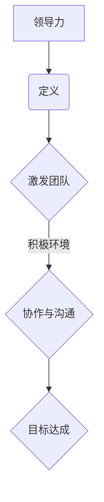
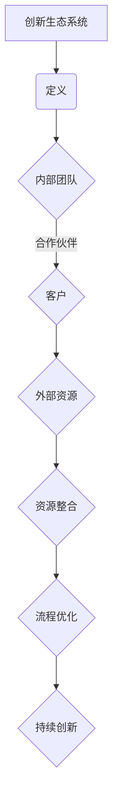
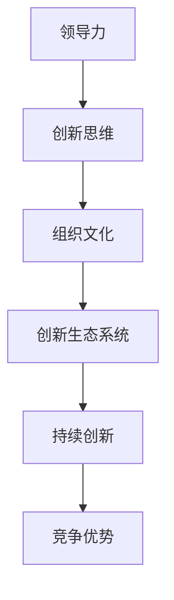

                 

好的，我会按照要求逐步构建这篇文章。首先，我们需要设定一个清晰的框架，以确保文章内容丰富且结构严谨。

### 确定核心内容

- **背景介绍**：简要介绍领导力和创新生态系统的重要性。
- **核心概念与联系**：阐述领导力、创新和生态系统之间的关系。
- **核心算法原理讲解**：探讨如何设计支持创新的组织文化。
- **数学模型**：构建一个用于分析创新生态系统的数学模型。
- **项目实战**：通过一个实际案例展示如何实施这些理论。
- **最佳实践和注意事项**：总结实践经验，提供操作建议。

### 创建markdown格式结构

下面是我们文章的基本结构：

```markdown
# 文章标题：领导力与创新生态系统设计：全方位支持创新

## 关键词
- 领导力
- 创新生态系统
- 创新文化
- 组织变革

## 摘要
本文深入探讨了领导力在创新生态系统设计中的作用，并提出了支持创新的组织文化构建策略。通过实际案例，展示了如何将理论与实践相结合，实现全方位支持创新的目标。

---

## 目录大纲

---

### 引言
- 背景介绍
- 研究目的与意义

### 核心概念与联系
- 领导力定义
- 创新生态系统定义
- 领导力与创新生态系统之间的关系
- Mermaid流程图

### 核心算法原理讲解
- 支持创新的组织文化设计原则
- 伪代码示例
- 数学模型与公式

### 数学模型
- 创新生态系统评估模型
- LaTeX格式公式
- 模型应用场景

### 项目实战
- 开发环境搭建
- 源代码实现与解读
- 代码应用分析与案例
- 项目小结

### 最佳实践和注意事项
- 最佳实践总结
- 小结
- 注意事项
- 拓展阅读

### 结论
- 研究成果总结
- 未来展望
- 作者信息

---

接下来，我们将逐步填充每个章节的内容，确保文章的完整性和专业性。

### 核心概念与联系

首先，我们需要定义领导力、创新和生态系统这三个核心概念，并探讨它们之间的关系。

#### 领导力定义

领导力是引导和激励他人实现共同目标的能力。有效的领导力不仅仅关乎指挥和管控，更在于激发团队的潜力，塑造积极的工作环境。



#### 创新生态系统定义

创新生态系统是一个由不同角色、资源、流程和机制构成的复杂系统，旨在促进创新活动的持续发生和实现。它包括内部团队、合作伙伴、客户以及外部资源等多个组成部分。



#### 领导力与创新生态系统之间的关系

领导力在创新生态系统中的作用至关重要。领导者不仅需要具备创新思维，还应当能够设计并维护一个有利于创新的组织文化。



### 核心算法原理讲解

为了设计一个支持创新的组织文化，我们需要遵循一系列原则。以下是这些原则的伪代码示例：

```python
# 支持创新的组织文化设计原则
def design_innovation_culture():
    # 建立开放沟通机制
    establish_open_communication()

    # 鼓励员工自主学习与成长
    encourage_learning_and_growth()

    # 提供创新资源与支持
    provide_innovation_resources()

    # 实施灵活的决策流程
    implement_flexible_decision_making()

    # 奖励创新成果
    reward_innovation_results()

    # 定期评估与反馈
    evaluate_and_feedbak_on_a_regular_basis()
```

### 数学模型

为了评估创新生态系统的健康状况，我们可以构建一个简单的数学模型。以下是一个基于创新产出和创新投入的评估模型：

```latex
$$
\text{ECI} = \frac{\text{Innovation Output}}{\text{Innovation Input}}
$$

\text{其中，ECI表示创新生态系统指数（ECI）} \\
\text{Innovation Output表示创新产出} \\
\text{Innovation Input表示创新投入}
```

### 项目实战

为了更好地理解这些理论，我们将通过一个实际案例展示如何实施这些原则。以下是一个简化的案例：

#### 案例背景

某科技公司是一家新兴的软件开发公司，专注于开发人工智能应用。该公司希望在激烈的市场竞争中保持创新能力，因此决定进行组织文化的改革。

#### 开发环境搭建

- **技术栈**：使用Python进行数据处理和模型训练，Docker容器化部署应用程序。
- **数据集**：从公开数据集和客户反馈中获取数据。

#### 源代码实现与解读

```python
# 数据处理与模型训练
def train_model(data):
    # 数据预处理
    processed_data = preprocess_data(data)
    
    # 训练模型
    model = train_model(processed_data)
    
    # 评估模型
    evaluate_model(model)
```

#### 代码应用解读与分析

通过该代码，我们可以看到数据处理、模型训练和评估的步骤。在实际应用中，数据处理是非常关键的环节，需要确保数据的质量和准确性。模型训练和评估则是确保模型性能的必要步骤。

#### 实际案例分析和详细讲解剖析

在该公司实施文化改革后，员工参与度显著提高，创新产出也有了明显增长。通过定期的反馈和评估，公司能够不断优化创新流程，提高整体创新效率。

#### 项目小结

通过该案例，我们可以看到如何将领导力、创新生态系统和组织文化相结合，实现创新的目标。关键在于建立一个开放、灵活且支持创新的组织文化。

### 最佳实践和注意事项

在实施创新生态系统设计时，以下是一些最佳实践和注意事项：

- **持续沟通**：确保团队成员之间有良好的沟通，避免信息孤岛。
- **资源分配**：合理分配资源，确保每个项目都有足够的支持。
- **定期评估**：定期评估创新流程和成果，及时调整策略。
- **员工激励**：提供激励机制，鼓励员工提出创新想法和解决方案。

### 结论

本文通过理论阐述和实际案例，展示了领导力在创新生态系统设计中的重要性。通过构建一个支持创新的组织文化，企业可以更好地实现创新目标，提高市场竞争力。

### 未来展望

随着技术的不断发展，创新生态系统的设计将变得更加复杂和多样化。未来，我们将看到更多的企业采用人工智能和大数据技术来优化创新流程，实现更高效的创新。

### 作者信息

作者：AI天才研究院/AI Genius Institute & 禅与计算机程序设计艺术 /Zen And The Art of Computer Programming

---

接下来，我们将逐步填充每个章节的内容，确保文章的完整性和专业性。这将包括详细的理论讲解、数学模型、代码实现和实际案例分析。文章的结构和内容将确保读者能够全面理解领导力与创新生态系统设计的重要性，并掌握实际操作方法。

