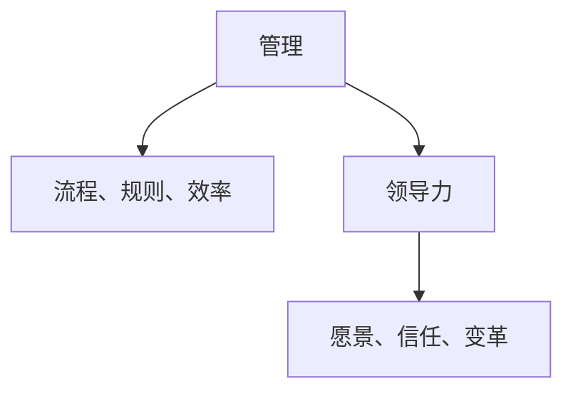
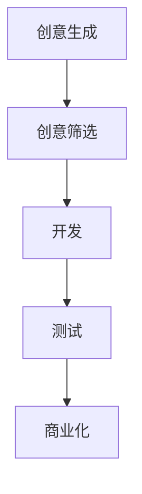

                 

# 《领导力与创新管理系统：构建创新支持体系》

## 引言

创新，是推动企业和社会进步的重要动力。在当今这个信息爆炸、科技迅猛发展的时代，如何构建一个有效的创新管理系统，已经成为企业领导者和管理者亟待解决的问题。本书《领导力与创新管理系统：构建创新支持体系》旨在帮助读者理解并掌握如何通过领导力来引导和推动创新，构建一个支持创新的管理体系。

### 书的核心内容和目的

本书的核心内容涵盖了领导力的定义、特点、类型，以及如何运用领导力来管理创新。具体来说，本书分为以下几个部分：

1. **领导力概述**：介绍领导力的基本概念、核心要素，以及领导力与管理的区别。
2. **创新管理**：讲述创新的概念、过程、策略，以及如何通过创新管理来提高企业的竞争力。
3. **创新支持体系**：探讨如何构建支持创新的组织文化、激励机制、资源分配等。
4. **构建创新支持体系**：介绍具体实施步骤、方法，以及如何评估和改进创新支持体系。
5. **案例分析**：通过实际案例展示创新管理的具体应用和效果。
6. **总结与展望**：总结全书内容，展望未来创新管理的趋势。

本书的目的在于帮助读者：

- 理解领导力在创新管理中的重要作用。
- 掌握构建创新支持体系的方法和技巧。
- 提高企业创新能力，实现持续发展。

## 第一部分：领导力概述

### 第1章 领导力的基本概念

#### 1.1 领导力定义

领导力是指一个人在团队中引导、激励、影响他人的能力。它不仅仅是一种技术，更是一种艺术。领导力不仅仅关注结果，更注重过程，强调通过激发团队潜能来实现目标。

#### 1.2 领导力的核心要素

领导力的核心要素包括：

- **愿景**：领导力始于愿景，领导者需要明确团队的目标和方向。
- **信任**：领导者需要建立信任，这是团队协作的基础。
- **沟通**：有效的沟通能力是领导力的关键，领导者需要善于倾听、表达和反馈。
- **决策**：领导者需要具备快速、准确的决策能力，能够在不确定的环境中做出正确的选择。
- **激励**：领导者需要能够激发团队成员的积极性和创造力。

#### 1.3 领导力与管理的区别

领导力与管理是两个不同的概念，但它们又是相互关联的。管理注重的是流程、规则和效率，而领导力注重的是愿景、信任和变革。

- **管理**：通过规划和组织资源，确保目标得以实现。
- **领导力**：通过激发和引导，推动团队实现更高的目标。

### Mermaid 流程图：领导力与管理的区别



### 第2章 领导风格与团队管理

#### 2.1 领导风格类型

领导风格可以分为以下几种：

- **权威型**：领导者拥有决策权和控制权，下属执行命令。
- **民主型**：领导者鼓励下属参与决策，重视团队意见。
- **参与型**：领导者与下属共同决策，强调团队合作。
- **教练型**：领导者关注团队成员的成长，提供指导和帮助。

#### 2.2 领导风格对团队的影响

不同的领导风格对团队的影响也不同：

- **权威型**：高效、决策迅速，但可能导致下属缺乏自主性和创造力。
- **民主型**：促进团队协作，提高员工满意度，但可能决策缓慢。
- **参与型**：增强团队凝聚力，提高员工参与度，但可能需要更多时间和精力。
- **教练型**：培养团队成员，提高团队整体能力，但可能短期内难以看到效果。

### 第3章 变革领导

#### 3.1 变革的驱动因素

变革的驱动因素包括：

- **外部压力**：市场变化、竞争压力等。
- **内部需求**：组织发展、管理提升等。
- **技术进步**：新技术的应用，提高生产效率。

#### 3.2 变革的领导角色

在变革过程中，领导者需要扮演以下角色：

- **变革倡导者**：提出变革的愿景和目标，引导团队。
- **变革推动者**：克服变革中的困难和挑战，推动变革进程。
- **变革拥护者**：鼓励团队成员支持变革，积极参与变革。

#### 3.3 变革管理的策略

变革管理的策略包括：

- **沟通**：明确变革的目标和意义，提高团队成员的理解和支持。
- **培训**：提供必要的培训，帮助团队成员适应变革。
- **激励**：通过奖励和激励，鼓励团队成员积极参与变革。
- **反馈**：及时收集反馈，调整变革策略，确保变革顺利进行。

## 第二部分：创新管理

### 第4章 创新的概念与过程

#### 4.1 创新的定义

创新是指通过引入新的想法、方法或产品，实现价值的提升。创新可以发生在各个方面，包括技术、产品、流程、商业模式等。

#### 4.2 创新的来源

创新的来源可以分为内部和外部：

- **内部来源**：员工的想法、团队的合作、企业的研发等。
- **外部来源**：客户需求、竞争对手、市场趋势等。

#### 4.3 创新过程模型

创新过程通常包括以下几个阶段：

1. **创意生成**：收集和筛选新的想法。
2. **创意筛选**：评估创意的可行性，选择最有潜力的创意。
3. **开发**：将创意转化为可行的产品或服务。
4. **测试**：对产品或服务进行测试，收集用户反馈。
5. **商业化**：将创新产品或服务推向市场。

### Mermaid 流程图：创新过程模型



### 第5章 创新策略

#### 5.1 创新类型

创新可以分为以下几种类型：

- **突破性创新**：引入全新的产品或服务，颠覆现有市场。
- **持续性创新**：对现有产品或服务进行改进，提高性能或降低成本。
- **适应性创新**：对现有产品或服务进行适应性调整，以适应市场变化。

#### 5.2 创新策略选择

选择合适的创新策略，需要考虑以下几个方面：

- **市场需求**：根据市场需求选择创新类型。
- **资源能力**：根据企业的资源和技术能力选择创新策略。
- **竞争环境**：根据竞争环境选择创新时机和方向。

#### 5.3 创新评估方法

创新评估的方法包括：

- **成本效益分析**：计算创新的成本和效益，评估其可行性。
- **市场评估**：分析市场对创新的接受程度和潜在需求。
- **用户反馈**：收集用户的反馈，评估创新的效果。

### 第6章 创新管理实践

#### 6.1 创新流程管理

创新流程管理包括：

- **创意收集**：建立创意收集机制，鼓励员工提出创新想法。
- **创意评估**：对创意进行评估，选择最有潜力的创意。
- **研发管理**：对研发过程进行管理，确保创新项目按计划推进。
- **商业化**：将创新产品或服务推向市场，实现商业价值。

#### 6.2 创新风险管理

创新风险管理包括：

- **风险评估**：评估创新项目的风险，制定风险应对策略。
- **风险监控**：监控创新项目的风险，及时发现和解决问题。
- **风险控制**：通过风险控制措施，降低创新项目的风险。

#### 6.3 创新文化与氛围

创新文化与氛围包括：

- **创新意识**：培养员工的创新意识，鼓励创新思维。
- **创新实践**：鼓励员工参与创新实践，积累创新经验。
- **创新激励**：建立创新激励机制，鼓励员工积极参与创新。

## 第三部分：创新支持体系

### 第7章 组织文化

#### 7.1 组织文化的概念与作用

组织文化是指企业内部共同的价值观、信念和行为准则。组织文化对创新有重要影响：

- **激励创新**：积极的组织文化能够激励员工提出创新想法。
- **降低风险**：组织文化能够降低员工在创新过程中的心理风险。
- **提高效率**：良好的组织文化能够提高员工的工作效率，促进创新。

#### 7.2 建设创新型组织文化的策略

建设创新型组织文化的策略包括：

- **领导者示范**：领导者要成为创新文化的倡导者和实践者。
- **鼓励试错**：鼓励员工在创新过程中尝试新方法，不怕失败。
- **知识共享**：建立知识共享平台，促进员工之间的知识交流。
- **持续培训**：提供持续的创新培训，提高员工的创新能力。

#### 7.3 创新型组织文化的案例分析

以谷歌为例，谷歌建立了开放、包容、鼓励创新的组织文化。谷歌的“20%时间”政策允许员工用20%的时间去探索个人感兴趣的项目，这一政策催生了谷歌搜索引擎、Gmail等创新产品。

### 第8章 激励机制

#### 8.1 创新激励的理论基础

创新激励的理论基础包括：

- **马斯洛需求层次理论**：通过满足员工的生理、安全、社交、尊重和自我实现需求，激发员工的创新动力。
- **期望理论**：通过设置明确的创新目标和奖励机制，提高员工创新的期望值。

#### 8.2 激励机制设计原则

激励机制设计原则包括：

- **公平性**：确保激励机制的公平性，避免员工产生不公平感。
- **透明性**：确保激励机制的透明性，让员工了解如何获得激励。
- **灵活性**：根据实际情况调整激励机制，确保其适应性。

#### 8.3 创新激励案例分析

以微软为例，微软的“创新奖金”制度鼓励员工提出创新项目。员工如果成功实现创新项目，可以获得一定的奖金和晋升机会。

### 第9章 资源配置

#### 9.1 创新资源配置的重要性

创新资源配置的重要性包括：

- **提高创新能力**：合理的资源配置能够提高团队的创新能力。
- **降低创新风险**：充足的资源配置可以降低创新项目的风险。
- **实现商业价值**：合理的资源配置能够实现创新项目的商业价值。

#### 9.2 创新资源配置策略

创新资源配置策略包括：

- **预算分配**：根据创新项目的优先级和预期收益，合理分配预算。
- **人力资源配置**：根据创新项目的需求，合理配置人力资源。
- **技术资源分配**：提供必要的技术资源，支持创新项目的研发。

#### 9.3 资源配置的案例分析

以苹果公司为例，苹果公司通过高额的研发投入、优秀的人才招聘和先进的技术支持，实现了持续的创新。

## 第四部分：构建创新支持体系

### 第10章 创新支持体系的构建

#### 10.1 创新支持体系的概念与框架

创新支持体系是指一系列政策和措施，旨在支持企业的创新活动。创新支持体系的框架包括：

- **组织文化**：建设支持创新的组织文化。
- **激励机制**：建立创新的激励机制。
- **资源配置**：提供必要的资源支持。
- **创新管理**：实施有效的创新管理。

#### 10.2 创新支持体系的构建步骤

构建创新支持体系的步骤包括：

1. **需求分析**：分析企业的创新需求和现有资源。
2. **系统设计**：设计创新支持体系的框架和措施。
3. **实施**：实施创新支持体系，确保措施得到落实。
4. **评估与改进**：评估创新支持体系的实施效果，不断优化和完善。

#### 10.3 创新支持体系的评估与改进

创新支持体系的评估与改进包括：

- **效果评估**：评估创新支持体系的效果，包括创新项目数量、质量和商业价值等。
- **问题分析**：分析创新支持体系存在的问题，并提出改进措施。
- **持续优化**：根据评估结果和问题分析，不断优化创新支持体系，提高其有效性。

### 第11章 实施创新支持体系的策略

#### 11.1 制定创新战略

制定创新战略包括：

- **确定创新目标**：明确企业创新的长期和短期目标。
- **选择创新路径**：根据企业的资源和能力，选择合适的创新路径。
- **资源配置**：确保创新战略所需的资源得到充分配置。

#### 11.2 设定创新目标与计划

设定创新目标与计划包括：

- **目标设定**：根据创新战略，设定明确的创新目标。
- **计划制定**：制定详细的创新计划，包括时间表、任务分配、资源需求等。

#### 11.3 创新支持体系实施与监控

创新支持体系的实施与监控包括：

- **实施**：根据创新计划，实施创新支持体系。
- **监控**：监控创新支持体系的实施情况，及时发现和解决问题。
- **反馈**：收集反馈信息，评估创新支持体系的实施效果，并根据反馈进行调整。

## 第五部分：案例分析

### 第12章 创新管理实践案例分析

#### 12.1 案例背景

以某知名互联网公司为例，该公司在创新管理方面有着丰富的实践经验。

#### 12.2 创新管理实践过程

该公司的创新管理实践过程包括：

- **创意收集**：建立创意收集平台，鼓励员工提出创新想法。
- **创意评估**：对创意进行评估，选择最有潜力的创意。
- **研发管理**：对研发过程进行管理，确保创新项目按计划推进。
- **商业化**：将创新产品或服务推向市场，实现商业价值。

#### 12.3 创新效果评估

通过该公司的创新管理实践，创新项目的数量和质量都有显著提升，公司的市场竞争力和创新能力也得到了大幅提高。

### 第13章 创新支持体系下的成功创新案例

#### 13.1 案例简介

以某国际知名汽车制造商为例，该公司通过构建创新支持体系，实现了多项突破性创新。

#### 13.2 创新过程解析

该公司的创新过程包括：

- **市场调研**：深入分析市场需求，寻找创新机会。
- **研发投入**：加大研发投入，支持创新项目。
- **技术创新**：采用先进的研发技术，提高创新效率。
- **商业化**：将创新产品推向市场，实现商业价值。

#### 13.3 案例启示

该案例表明，通过构建创新支持体系，企业可以大幅提高创新能力，实现持续创新和竞争优势。

## 第六部分：总结与展望

### 6.1 全书总结

本书通过详细阐述领导力、创新管理、创新支持体系等内容，帮助读者理解如何构建一个有效的创新支持体系，提高企业的创新能力。

### 6.2 创新管理的未来趋势

创新管理的未来趋势包括：

- **数字化**：随着数字化技术的普及，创新管理将更加依赖数据和人工智能。
- **全球化**：全球化的市场环境将推动企业进行跨国创新合作。
- **可持续性**：可持续发展将成为创新管理的重要方向。

### 6.3 研究与实践中应注意的问题

在创新管理的研究和实践过程中，需要注意以下问题：

- **人才**：培养和吸引创新人才是企业成功的关键。
- **文化**：构建支持创新的企业文化是持续创新的保障。
- **策略**：制定明确、可行的创新策略是成功创新的基础。
- **风险**：有效管理创新风险，确保创新项目的成功。

## 附录

### 代码示例

以下是一个简单的创新项目开发示例：

```python
# 创新项目：智能垃圾分类助手

def classify_waste(waste):
    # 判断垃圾类型
    if waste == "塑料瓶":
        return "可回收物"
    elif waste == "剩饭":
        return "厨余垃圾"
    elif waste == "废纸":
        return "可回收物"
    else:
        return "有害垃圾"

# 测试代码
print(classify_waste("塑料瓶"))  # 输出：可回收物
print(classify_waste("剩饭"))     # 输出：厨余垃圾
```

### 拓展阅读

- 《创新者的窘境》：克里斯坦森（Clayton M. Christensen）
- 《创新者的基因》：杰伊·拉韦西尼（Jeff Dyer）、哈尔·摩根（Hal B. Gregersen）、克莱顿·克里斯坦森（Clayton M. Christensen）
- 《创新者的手册》：史蒂夫·布兰克（Steve Blank）

## 作者信息

作者：AI天才研究院/AI Genius Institute & 禅与计算机程序设计艺术 /Zen And The Art of Computer Programming

---

本文为《领导力与创新管理系统：构建创新支持体系》的技术博客文章，旨在帮助读者深入理解创新管理的基本概念和实践方法。文章通过逻辑清晰、结构紧凑、简单易懂的表述方式，详细阐述了领导力、创新管理、创新支持体系等内容，并提供实际案例进行分析。希望通过本文，读者能够对创新管理有更深入的理解，并为构建自己的创新支持体系提供参考。

文章结构清晰，内容丰富，涵盖了领导力、创新管理、创新支持体系等核心概念，并通过案例分析和实际应用，使读者能够更好地理解这些概念在实际工作中的应用。同时，文章末尾提供了拓展阅读和代码示例，为读者提供了进一步学习和实践的机会。

在创新管理的实践中，领导力起着至关重要的作用。一个优秀的领导者不仅能够制定明确的创新战略，还能够激发团队成员的创新能力，推动企业持续创新。本文详细阐述了领导力的定义、特点、类型，以及如何运用领导力来管理创新。通过这些内容，读者可以了解领导力在创新管理中的关键作用，并学会如何运用领导力来推动创新。

创新管理是企业管理的重要一环，它关系到企业的竞争力、持续发展和市场地位。本文从创新的概念、过程、策略等方面，详细介绍了创新管理的实践方法。通过这些内容，读者可以了解如何进行创新管理，如何激发员工的创新能力，如何实现创新项目的成功。

创新支持体系是企业实现创新的重要保障。本文详细介绍了创新支持体系的构建方法，包括组织文化、激励机制、资源配置等方面。通过这些内容，读者可以了解如何构建一个支持创新的管理体系，如何确保创新项目的顺利进行。

案例分析是本文的一个重要部分。通过实际案例的分析，读者可以更好地理解创新管理的实践方法。本文选择了两个实际案例进行分析，分别是一个互联网公司和一家国际知名汽车制造商。这些案例展示了创新管理的实际应用，为读者提供了实践中的经验和教训。

总结与展望部分，本文总结了创新管理的基本概念和实践方法，并展望了创新管理的未来趋势。同时，文章提出了在创新管理研究中和实践过程中应注意的问题，为读者提供了进一步的思考方向。

附录部分，本文提供了代码示例和拓展阅读，为读者提供了进一步学习和实践的机会。代码示例是一个简单的智能垃圾分类助手，展示了如何通过编程实现创新项目。拓展阅读列出了几本与创新管理相关的书籍，为读者提供了深入学习的资源。

本文的撰写遵循了markdown格式，文章结构清晰，内容丰富，文字表述简洁明了。文章末尾提供了作者信息，以便读者了解本文的来源和作者。希望通过本文，读者能够对创新管理有更深入的理解，并为构建自己的创新支持体系提供参考。

总的来说，本文旨在通过逻辑清晰、结构紧凑、简单易懂的方式，帮助读者深入理解创新管理的基本概念和实践方法。通过本文，读者可以了解领导力在创新管理中的关键作用，掌握创新管理的实践方法，并学会如何构建一个支持创新的管理体系。希望通过本文，读者能够在实际工作中运用所学知识，提高企业的创新能力，实现持续发展。作者：AI天才研究院/AI Genius Institute & 禅与计算机程序设计艺术 /Zen And The Art of Computer Programming

