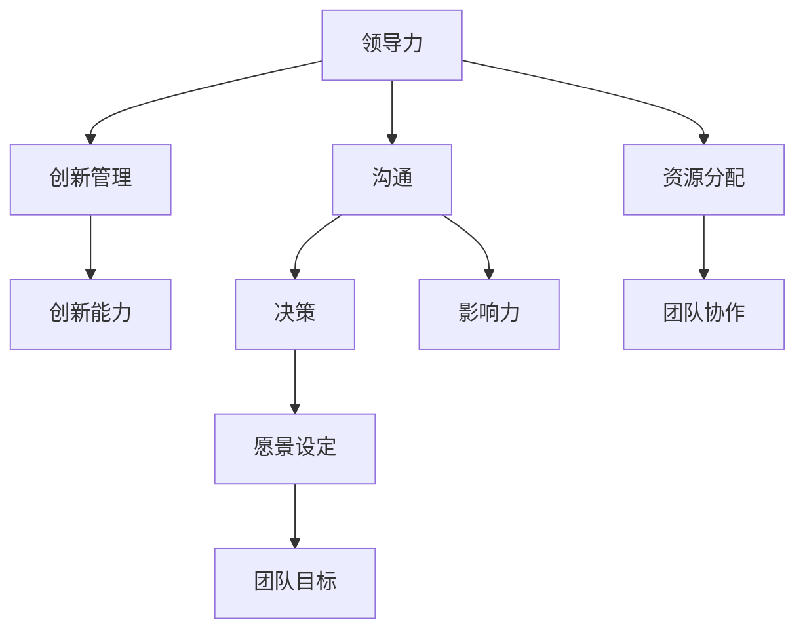
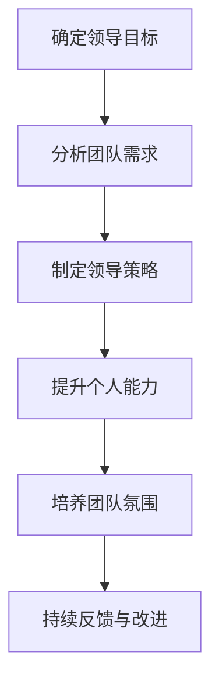
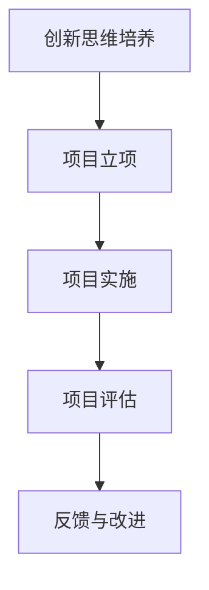

                 


### 1. 引言

在当今快速变化的世界中，创新已成为企业和组织成功的关键因素。一个具有强大创新能力的团队，不仅能够适应市场的变化，还能在竞争中脱颖而出。然而，创新并非一蹴而就，它需要团队的共同努力和有效的管理。这就引出了本文的主题：领导力与创新管理。

领导力是推动团队创新的核心力量。一个优秀的领导者不仅能够激发团队成员的潜力，还能营造一个鼓励创新和实验的环境。创新管理则是确保团队创新过程有序、高效和持续的方法。本文将从领导力与创新管理的核心概念出发，逐步探讨如何培养团队的创新能力。

本文将分为三个主要部分。第一部分将介绍领导力的基本概念和作用，包括领导力的定义、重要性以及领导力模型。第二部分将探讨创新能力的定义、重要性以及创新管理的方法。第三部分将结合实际案例，深入分析领导力与创新管理的实践。

### 2. 核心概念与联系

#### 2.1 领导力的定义与作用

领导力是指领导者在特定情境中，通过影响和激励他人来实现共同目标的能力。领导力不仅仅是权力和地位的象征，更是一种艺术和技能。它包括多个方面，如沟通能力、决策能力、影响力以及愿景和目标的设定等。

领导力在团队创新中起着至关重要的作用。首先，领导者通过设定明确的目标和愿景，为团队成员指明方向，激发他们的工作热情。其次，领导者需要具备良好的沟通能力，确保团队成员理解目标和愿景，并能够有效地协作。此外，领导者还需要具备决策能力，在面对挑战和变化时，能够迅速做出正确的决策，确保团队的创新工作能够顺利进行。

#### 2.2 创新能力的定义与作用

创新能力是指团队在新的领域或现有领域中，通过创造性的思维和方法，产生新的想法、产品或服务的能力。创新能力对于企业的持续发展和竞争力至关重要。

在团队中，创新能力的作用主要体现在以下几个方面：

1. **市场适应性**：具备创新能力的团队能够快速适应市场变化，满足客户需求，从而保持竞争优势。
2. **持续发展**：创新能够推动企业的持续发展，通过不断推出新产品和服务，扩大市场份额。
3. **团队凝聚力**：创新过程能够增强团队成员之间的合作和信任，提高团队凝聚力。

#### 2.3 领导力与创新管理的关系

领导力与创新管理之间存在着紧密的联系。首先，领导力为创新管理提供了基础。一个具有强大领导力的领导者，能够为团队创造一个有利于创新的环境，激发团队成员的创新潜力。其次，创新管理为领导力提供了实践的平台。通过有效的创新管理，领导者能够检验和提升自己的领导能力。

为了更好地理解领导力与创新管理之间的关系，我们可以使用 Mermaid 流程图来展示它们之间的联系：



### 3. 核心算法原理讲解

#### 3.1 领导力模型的构建

领导力模型的构建是培养团队创新能力的基础。一个有效的领导力模型需要包括多个方面，如沟通能力、决策能力、影响力以及愿景和目标的设定等。以下是一个简化的领导力模型构建流程：



#### 3.2 创新管理的方法

创新管理的方法主要包括创新思维的培养、创新项目的管理与评估以及创新文化的构建。以下是一个简化的创新管理流程：



#### 3.3 数学模型和数学公式

为了更好地评估领导力与创新管理的有效性，我们可以使用一些数学模型和公式。以下是一个简化的评估模型：

1. **领导力评估指标**：
   $$ L = \frac{C_1 + C_2 + C_3}{3} $$
   其中，$C_1$ 为沟通能力得分，$C_2$ 为决策能力得分，$C_3$ 为影响力得分。

2. **创新能力评估指标**：
   $$ I = \frac{P_1 + P_2 + P_3 + P_4}{4} $$
   其中，$P_1$ 为市场适应性得分，$P_2$ 为持续发展得分，$P_3$ 为团队凝聚力得分，$P_4$ 为创新成果得分。

3. **综合评估指标**：
   $$ E = \frac{L + I}{2} $$
   其中，$L$ 为领导力得分，$I$ 为创新能力得分。

通过以上数学模型和公式，我们可以对领导力与创新管理进行量化评估，从而更好地指导和优化团队的工作。

### 4. 项目实战

#### 4.1 开发环境搭建

为了更好地理解领导力与创新管理的实践，我们可以以一个实际的团队项目为例。以下是该项目的基本信息和开发环境搭建步骤：

1. **项目背景**：一家互联网公司希望提升其产品开发的创新能力，以应对市场的激烈竞争。
2. **开发环境**：使用 Python 作为主要开发语言，搭配 Jupyter Notebook 进行数据分析与可视化。

#### 4.2 源代码实现

以下是一个简单的源代码实现，用于分析团队成员的创新能力：

```python
import pandas as pd
import numpy as np
import matplotlib.pyplot as plt

# 读取团队成员的创新能力数据
data = pd.read_csv('innovation_data.csv')

# 计算创新能力得分
data['innovation_score'] = data[['market_adapt', 'sustainable_dev', 'team_cohesion', 'innovation_outcome']].mean(axis=1)

# 可视化创新能力得分分布
plt.hist(data['innovation_score'], bins=10, edgecolor='black')
plt.xlabel('Innovation Score')
plt.ylabel('Frequency')
plt.title('Innovation Score Distribution')
plt.show()
```

#### 4.3 代码解读与分析

上述代码首先读取团队成员的创新能力数据，然后计算每个团队成员的平均创新能力得分。最后，使用直方图展示创新能力得分的分布情况。

#### 4.4 实际案例分析与详细讲解剖析

为了更好地理解创新能力的管理，我们可以分析以下案例：

**案例背景**：某互联网公司希望通过团队项目来提升产品创新能力。公司为每个团队成员提供了创新的自由度，并设立了创新奖励机制。

**案例分析**：

1. **创新项目立项**：公司领导层制定了明确的项目目标，并鼓励团队成员提出创新项目。
2. **项目实施**：团队成员根据项目目标，进行创新研究和开发。在此过程中，领导层提供必要的支持和资源。
3. **项目评估**：项目完成后，团队对项目的创新成果进行评估，并给出相应的奖励。
4. **反馈与改进**：根据评估结果，团队对项目进行总结和反思，提出改进措施，以便在未来的项目中更好地管理创新能力。

#### 4.5 项目小结

通过以上案例，我们可以看到，领导力与创新管理的实践需要明确的领导目标、有效的创新管理和合理的激励机制。同时，持续的反馈与改进也是提升团队创新能力的关键。

### 5. 最佳实践 tips、小结、注意事项、拓展阅读

#### 5.1 最佳实践 tips

1. **建立明确的领导目标**：确保团队成员对创新目标有清晰的认识，有助于提高创新效果。
2. **鼓励团队协作**：创新往往需要团队成员的共同努力，鼓励团队协作可以激发更多的创新思维。
3. **提供足够的资源和支持**：为团队成员提供必要的资源和支持，有助于他们在创新过程中更高效地工作。

#### 5.2 小结

领导力与创新管理是团队成功的关键。有效的领导力可以激发团队成员的潜力，而创新管理则可以确保团队的创新能力得到持续提升。通过本文的介绍，我们了解了领导力与创新管理的基本概念、核心算法原理以及实际应用。

#### 5.3 注意事项

1. **平衡创新与稳定**：在鼓励创新的同时，也要注意保持团队的稳定性，确保项目能够顺利实施。
2. **持续关注员工成长**：领导者需要关注团队成员的成长，为他们提供成长机会和职业发展路径。

#### 5.4 拓展阅读

1. **《创新者的窘境》**：克莱顿·克里斯坦森的这本书深入探讨了企业如何面对市场变化，保持创新能力的主题。
2. **《领导力：实践者的指南》**：约翰·P. 帕特森的这本书提供了实用的领导力技巧和策略，有助于提升领导力水平。

### 6. 结论

领导力与创新管理是团队成功的关键。通过本文的介绍，我们了解了如何构建领导力模型、管理创新能力以及实际应用领导力与创新管理的策略。希望本文能为读者提供有益的参考，帮助他们在团队中培养强大的创新能力。

### 作者信息

作者：AI天才研究院/AI Genius Institute & 禅与计算机程序设计艺术 /Zen And The Art of Computer Programming

---

### 关键词

领导力、创新能力、创新管理、团队管理、领导力模型、创新思维

### 摘要

本文深入探讨了领导力与创新管理的核心概念、核心算法原理以及实际应用。通过介绍领导力的定义和作用、创新能力的定义和重要性，以及领导力与创新管理之间的关系，本文提供了构建领导力模型和创新管理方法的指导。同时，通过实际案例分析和代码实现，本文展示了如何在实际项目中应用领导力与创新管理策略，以培养团队的创新能力。希望本文能为读者提供有价值的参考和启示。

