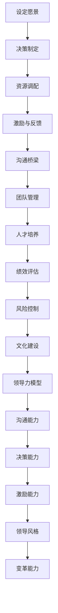
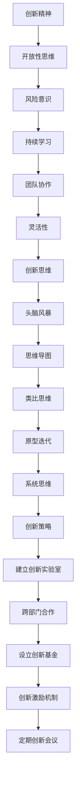
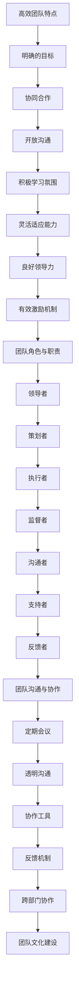
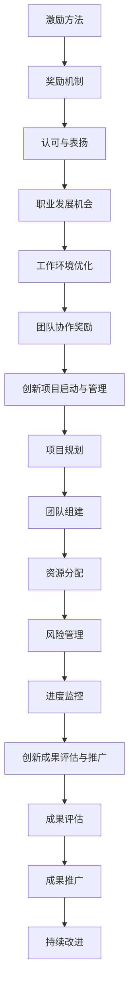
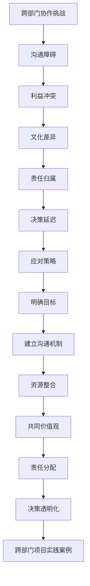
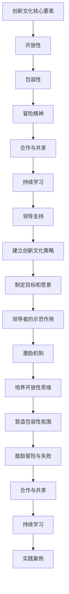

                 

### 1. 引言：领导力与创新精神的重要性

在当今快速变化和竞争激烈的市场环境中，领导力和创新精神成为企业生存和发展的关键因素。领导力不仅是管理者和领导者个人能力的体现，更是整个团队和组织运转的基石。创新精神则代表了组织在面对市场变化时的灵活性和适应性，是推动企业持续进步的动力源泉。

#### 领导力的作用

领导力在团队和组织中扮演着至关重要的角色。有效的领导力能够激发团队成员的潜力，提高团队的凝聚力和执行力，从而推动组织目标的实现。具体来说，领导力主要体现在以下几个方面：

1. **方向指引**：领导者需要明确团队的目标和愿景，为团队成员提供清晰的方向指引，确保团队的行动与组织的战略保持一致。

2. **决策制定**：领导者负责制定重要的决策，确保团队在面对挑战和机遇时能够做出及时、有效的反应。

3. **激励与反馈**：领导者需要通过激励手段激发团队成员的积极性，同时提供及时的反馈，帮助团队成员不断提高。

4. **团队建设**：领导者需要关注团队建设，促进团队成员之间的沟通与合作，营造积极的工作氛围。

#### 创新精神的作用

创新精神是企业持续发展的关键。它不仅仅体现在产品和服务的设计与开发过程中，还包括组织文化、管理理念、业务模式等多个方面。创新精神的作用主要体现在以下几方面：

1. **市场竞争力**：通过不断创新，企业能够满足市场的需求，保持竞争力，甚至引领市场趋势。

2. **持续进步**：创新精神鼓励企业不断尝试新的想法和方法，推动企业持续进步，保持活力。

3. **人才培养**：创新精神吸引和培养具有创新思维和能力的员工，为企业的长期发展提供人才保障。

#### 团队创新的目标和挑战

团队创新的目标是提升企业的整体竞争力，推动业务的持续增长。然而，在实现这一目标的过程中，团队面临着诸多挑战：

1. **资源限制**：团队在创新过程中可能面临资源（如时间、人力、资金）的不足。

2. **沟通障碍**：团队成员之间的沟通不畅可能导致创新项目的失败。

3. **组织惯性**：企业在长期运营过程中可能形成一定的惯性，对新的创新想法持保守态度。

4. **风险承受**：创新往往伴随着风险，如何平衡创新与风险是团队面临的挑战。

#### 本章总结

本章节介绍了领导力与创新精神在团队和组织中的重要性。有效的领导力能够为团队提供明确的方向和强大的动力，而创新精神则是企业持续发展的关键。在接下来的章节中，我们将进一步探讨领导力、创新精神的内涵，以及如何在实际工作中激发团队创新。通过理解这些核心概念，读者将能够更好地把握团队创新的方向，提升组织的竞争力。

#### 关键词

- 领导力
- 创新精神
- 团队创新
- 竞争力
- 挑战
- 组织发展

### 领导力基础：领导者的角色、职责与技能

在探讨如何激发团队创新之前，我们必须深入理解领导力的本质，以及领导者在这一过程中所扮演的角色和职责。领导力不仅仅是一种管理技能，更是一种能够激发团队成员潜力、推动团队共同进步的能力。本章节将详细分析领导者的角色、职责以及所需的技能，为后续内容的讨论打下坚实的基础。

#### 领导者的角色

领导者的角色是多样化的，主要包括以下几个方面：

1. **愿景设定者**：领导者需要为团队设定明确的愿景和目标，确保团队成员理解并认同组织的长远发展方向。愿景不仅为团队提供方向，还能激发成员的积极性。

2. **决策制定者**：在团队运作过程中，领导者需要制定重要决策，解决团队面临的问题。决策的质量直接影响团队的创新能力和执行力。

3. **资源调配者**：领导者需要合理分配团队内部的各种资源，确保团队有足够的资源支持创新项目。资源调配不仅包括资金和物资，还包括人力资源和时间。

4. **激励者**：领导者需要通过激励手段激发团队成员的工作热情和创造力。有效的激励能够提高团队成员的积极性，促进创新项目的顺利进行。

5. **沟通桥梁**：领导者是团队与外部环境之间的沟通桥梁，需要确保信息的畅通，协调团队与上级、客户、合作伙伴之间的关系。

#### 领导者的职责

领导者的职责是领导力实践的重要组成部分，具体包括以下几个方面：

1. **团队管理**：领导者需要管理团队，确保团队成员的工作有序进行。这包括监督成员的工作进度、协调团队成员之间的合作、解决团队内部冲突等。

2. **人才培养**：领导者需要关注团队成员的成长，提供培训和学习机会，帮助团队成员提升技能，增强团队的整体实力。

3. **绩效评估**：领导者需要对团队成员的工作绩效进行评估，给予公正、及时的反馈。绩效评估不仅能够激励团队成员，还能帮助领导者了解团队的整体表现。

4. **风险控制**：领导者需要预见和评估团队面临的风险，制定相应的风险控制措施，确保团队在创新过程中能够稳健前进。

5. **文化建设**：领导者需要营造积极向上的团队文化，鼓励团队成员积极参与创新，共同推动组织的进步。

#### 领导者必备的技能

领导者需要具备多种技能，以应对团队和创新过程中的各种挑战。以下是几种关键的领导技能：

1. **沟通能力**：有效的沟通能力是领导者必须具备的基本技能。领导者需要能够清晰地表达自己的想法，同时也要善于倾听团队成员的意见，确保信息传递的准确和高效。

2. **决策能力**：领导者需要在复杂多变的环境中做出快速、准确的决策。这需要领导者具备良好的判断力和分析能力，能够综合考虑各种因素，做出最优决策。

3. **激励能力**：领导者需要能够通过激励手段激发团队成员的积极性。这包括物质激励和精神激励，领导者需要根据不同情境选择合适的激励方式。

4. **领导风格**：不同的团队和情境需要不同的领导风格。领导者需要具备灵活调整领导风格的能力，以适应不同的团队需求和挑战。

5. **变革能力**：在创新过程中，领导者需要具备推动变革的能力。这包括鼓励团队成员接受新观念、新方法，推动团队在变革中不断进步。

#### 核心概念与联系

为了更好地理解领导力的本质，我们可以通过一个Mermaid流程图来展示核心概念之间的关系：

通过这个流程图，我们可以清晰地看到领导力各个组成部分之间的关联，以及它们如何共同作用，推动团队的创新和发展。

#### 本章总结

本章节详细分析了领导者的角色、职责和必备技能。领导力不仅是领导者个人的能力体现，更是团队和组织成功的关键。有效的领导力能够为团队提供明确的方向、强大的动力和支持，激发团队的创新潜力。在接下来的章节中，我们将继续探讨创新精神的内涵，以及如何在实际工作中培养和激发团队的创新精神。通过深入理解领导力，读者将能够更好地把握团队创新的方向，提升组织的竞争力。

#### 关键词

- 领导者的角色
- 领导者的职责
- 沟通能力
- 决策能力
- 激励能力
- 变革能力
- 领导风格

### 创新精神：创新思维与方法

创新精神是推动企业不断进步和发展的核心动力。它不仅仅体现在新产品、新技术的开发上，还渗透到企业的管理理念、商业模式和文化建设等各个方面。本章节将深入探讨创新精神的内涵，介绍创新思维的方法，并分析创新策略的实践。通过这些内容，我们将为激发团队创新提供理论支持和实践指导。

#### 创新精神的内涵

创新精神是指企业或团队在面对挑战和机遇时，勇于突破传统思维，积极寻求新的解决方案和机会的思维方式和精神状态。创新精神的核心内涵包括以下几个方面：

1. **开放性思维**：创新精神鼓励团队成员拥抱多样性，勇于接受新的想法和观点，从而激发创新思维。

2. **风险意识**：创新往往伴随着风险，创新精神要求团队成员能够接受并管理风险，敢于尝试和失败。

3. **持续学习**：创新精神强调不断学习和更新知识，保持对新技术、新趋势的敏感度。

4. **团队协作**：创新是团队共同的努力结果，创新精神强调团队成员之间的合作与沟通，共同推动创新项目的成功。

5. **灵活性**：创新精神要求团队成员能够灵活应对变化，迅速调整策略以适应市场和环境的变化。

#### 创新思维的方法

创新思维是激发创新精神的关键。以下是一些常用的创新思维方法：

1. **头脑风暴**：头脑风暴是一种集思广益的方法，通过自由讨论和联想，激发团队成员的创新思维。

2. **思维导图**：思维导图是一种以图形化的方式展示思维过程和关联性的工具，有助于梳理和创新思路。

3. **类比思维**：通过将不同领域的问题进行类比，寻找类似问题的解决方案，从而激发创新。

4. **原型迭代**：快速构建原型并进行测试，通过不断迭代优化，逐步实现创新目标。

5. **系统思维**：从系统的角度分析问题，考虑各部分之间的相互作用和影响，从而找到创新的切入点。

#### 创新策略的实践

在实际工作中，创新策略的实践是确保创新精神得以落地的重要环节。以下是一些创新策略的实践方法：

1. **建立创新实验室**：创新实验室为团队成员提供了一个自由、开放的环境，鼓励他们进行创新尝试。

2. **跨部门合作**：通过跨部门的合作，整合不同领域的资源和知识，推动创新的实现。

3. **设立创新基金**：为创新项目提供资金支持，鼓励团队成员积极尝试新的想法。

4. **创新激励机制**：通过奖励机制激励团队成员参与创新，提高创新项目的成功率。

5. **定期创新会议**：定期召开创新会议，让团队成员分享创新想法，讨论和改进创新项目。

#### 核心概念与联系

为了更好地理解创新精神的内涵和创新思维的方法，我们可以通过一个Mermaid流程图来展示它们之间的关系：

通过这个流程图，我们可以清晰地看到创新精神的核心内涵和创新思维的方法如何相互关联，以及如何通过创新策略的实践来推动团队的创新能力。

#### 本章总结

本章节深入探讨了创新精神的内涵，介绍了创新思维的方法和创新策略的实践。创新精神不仅是一种思维方式，更是一种推动企业不断进步的精神力量。通过理解创新精神，掌握创新思维的方法，并实践有效的创新策略，团队可以更好地应对市场变化，实现持续的创新和突破。在接下来的章节中，我们将进一步探讨团队建设、跨部门协作和建立创新文化等内容，为团队创新提供全面的指导和策略。

#### 关键词

- 创新精神
- 开放性思维
- 风险意识
- 持续学习
- 团队协作
- 灵活性
- 创新思维方法
- 头脑风暴
- 思维导图
- 类比思维
- 原型迭代
- 系统思维
- 创新策略
- 建立创新实验室
- 跨部门合作
- 设立创新基金
- 创新激励机制
- 定期创新会议

### 团队建设：高效团队的特点与团队角色

团队建设是激发团队创新、提升团队执行力和实现组织目标的关键环节。一个高效团队的特点不仅体现在成员的技能和素质上，还包括团队的沟通、协作和共同价值观。本章节将详细分析高效团队的特点，探讨团队角色和职责的划分，并介绍团队沟通与协作的重要性和方法。

#### 高效团队的特点

高效团队具有以下显著特点：

1. **明确的目标**：高效团队的目标清晰且具体，每个成员都明白自己的任务和责任。

2. **协同合作**：团队成员之间协同合作，相互支持，共同为实现团队目标而努力。

3. **开放的沟通**：高效团队鼓励开放的沟通，成员之间能够自由地分享想法和意见，确保信息流通无障碍。

4. **积极的学习氛围**：团队成员保持积极的学习态度，不断更新知识和技能，以适应快速变化的环境。

5. **灵活的适应能力**：高效团队能够快速适应变化，灵活调整策略，以应对挑战和机遇。

6. **良好的领导力**：团队领导具备有效的领导力，能够激发团队成员的潜力，提供明确的方向和支持。

7. **有效的激励机制**：团队内部建立有效的激励机制，激励团队成员积极参与和贡献。

#### 团队角色与职责

在一个高效团队中，明确的角色划分和职责分工是确保团队运作顺畅的重要保障。以下是常见团队角色及其职责：

1. **领导者**：负责团队的总体方向和目标，协调团队内部关系，提供决策和支持。

2. **策划者**：负责制定团队的战略和计划，确保团队目标的实现。

3. **执行者**：负责具体任务的执行，确保任务按时、高质量完成。

4. **监督者**：负责监督任务进度和质量，确保团队目标的达成。

5. **沟通者**：负责团队的内外部沟通，确保信息的有效传递。

6. **支持者**：提供技术支持和资源保障，协助团队成员完成任务。

7. **反馈者**：收集团队成员的意见和建议，反馈团队的工作情况，为团队改进提供依据。

#### 团队沟通与协作

有效的沟通与协作是高效团队的核心。以下是一些提高团队沟通与协作的方法：

1. **定期会议**：定期召开团队会议，讨论工作进展、问题解决方案和团队目标。

2. **透明沟通**：鼓励团队成员之间进行透明沟通，分享信息和资源，避免信息孤岛。

3. **使用协作工具**：利用项目管理工具、即时通讯工具和文档共享平台，提高团队协作效率。

4. **建立反馈机制**：建立有效的反馈机制，鼓励团队成员提出意见和建议，及时解决问题。

5. **跨部门协作**：促进跨部门之间的协作，整合不同部门的资源和优势，实现团队目标。

6. **团队文化建设**：营造积极向上的团队文化，增强团队成员的归属感和凝聚力。

#### 核心概念与联系

为了更好地理解团队建设的内容，我们可以通过一个Mermaid流程图来展示高效团队的特点、团队角色与职责以及团队沟通与协作的关系：

通过这个流程图，我们可以清晰地看到团队建设各个组成部分之间的关联，以及它们如何共同作用，构建一个高效、协作的团队。

#### 本章总结

本章节详细分析了高效团队的特点、团队角色与职责以及团队沟通与协作的重要性和方法。一个高效团队不仅需要明确的目标和角色划分，还需要良好的沟通和协作机制。通过理解这些内容，团队领导者可以更好地构建和激发团队的创新能力，推动团队和组织的发展。在接下来的章节中，我们将进一步探讨如何激发团队创新，以及跨部门协作和建立创新文化的策略。

#### 关键词

- 高效团队特点
- 明确的目标
- 协同合作
- 开放沟通
- 积极学习氛围
- 灵活适应能力
- 良好领导力
- 有效激励机制
- 团队角色与职责
- 团队领导
- 策划者
- 执行者
- 监督者
- 沟通者
- 支持者
- 反馈者
- 团队沟通与协作
- 定期会议
- 透明沟通
- 协作工具
- 反馈机制
- 跨部门协作
- 团队文化建设

### 激发创新：激励方法与技术

激发团队创新需要有效的激励机制和方法。这些机制不仅能激励团队成员积极参与创新项目，还能提高创新的成功率。本章节将详细探讨几种常见的激励方法，以及如何通过创新项目的启动与管理来确保创新项目的顺利进行。同时，我们将讨论创新成果的评估与推广策略，帮助团队实现创新目标。

#### 常见的激励方法

1. **奖励机制**：奖励机制是激励团队成员积极参与创新的重要手段。奖励可以包括物质奖励（如奖金、股权激励）和荣誉奖励（如荣誉称号、表彰大会）。

2. **认可与表扬**：认可和表扬能够增强团队成员的自信心和积极性。领导者可以通过定期表彰、公开表扬等方式，对创新表现突出的成员给予认可。

3. **职业发展机会**：提供职业发展机会是激励团队成员的一种有效方式。通过提供培训、晋升机会等，鼓励团队成员不断提升自身能力，为团队创新贡献力量。

4. **工作环境优化**：创造一个支持创新的工作环境，包括提供必要的资源、技术和工具，以及营造自由、开放、协作的氛围，能够激发团队成员的创新热情。

5. **团队协作奖励**：团队协作奖励能够增强团队凝聚力，鼓励团队成员共同面对挑战，共同分享创新成果。例如，对团队整体创新表现进行奖励，而不是仅关注个人贡献。

#### 创新项目的启动与管理

1. **项目规划**：在创新项目启动前，需要明确项目目标、预期成果和资源需求。制定详细的项目计划，确保项目能够按部就班地进行。

2. **团队组建**：根据项目需求，组建合适的团队。团队成员应具备相关技能和经验，能够互补合作。

3. **资源分配**：确保项目有足够的资源支持，包括资金、人力和技术等。合理分配资源，确保项目顺利进行。

4. **风险管理**：创新项目往往伴随着风险。在项目启动和管理过程中，需要识别潜在风险，制定相应的风险管理策略。

5. **进度监控**：定期检查项目进度，确保项目按计划进行。及时解决项目中的问题和障碍，避免项目延误。

#### 创新成果的评估与推广

1. **成果评估**：在创新项目完成后，需要对成果进行评估。评估内容包括创新成果的实际效果、创新过程中的经验和教训等。通过评估，可以总结成功的经验和不足之处，为后续项目提供参考。

2. **成果推广**：将创新成果推广到整个组织，使更多团队成员受益。推广方式可以包括内部分享会、案例研究、培训课程等。

3. **持续改进**：基于评估结果，对创新成果进行持续改进。通过不断优化，使创新成果能够更好地满足市场需求。

#### 核心概念与联系

为了更好地理解激发创新的激励机制和方法，我们可以通过一个Mermaid流程图来展示它们之间的关系：

通过这个流程图，我们可以清晰地看到激励方法、创新项目启动与管理以及创新成果评估与推广之间的关联，以及它们如何共同作用，推动团队创新。

#### 本章总结

本章节详细探讨了激发团队创新的激励机制和方法，以及创新项目的启动与管理、创新成果的评估与推广策略。有效的激励机制能够激发团队成员的创新热情，创新项目的科学管理能够确保项目顺利进行，创新成果的评估与推广则能够实现创新价值的最大化。通过理解这些内容，团队领导者可以更好地构建和激发团队的创新能力，推动团队和组织的发展。

#### 关键词

- 激励机制
- 奖励机制
- 认可与表扬
- 职业发展机会
- 工作环境优化
- 团队协作奖励
- 创新项目启动与管理
- 项目规划
- 团队组建
- 资源分配
- 风险管理
- 进度监控
- 创新成果评估与推广
- 成果评估
- 成果推广
- 持续改进

### 跨部门协作：挑战与策略

在企业的创新过程中，跨部门协作至关重要。不同部门拥有不同的专业知识和资源，通过有效协作，可以最大化利用这些资源，推动创新项目的成功。然而，跨部门协作也面临诸多挑战，如沟通障碍、利益冲突和文化差异等。本章节将探讨跨部门协作的挑战和应对策略，以及跨部门项目的实践案例。

#### 跨部门协作的挑战

1. **沟通障碍**：不同部门之间可能存在信息不对称，导致沟通不畅。各部门往往专注于自己的任务，忽视其他部门的进展和需求。

2. **利益冲突**：各部门的优先级和目标可能不一致，导致资源分配不均，甚至出现利益冲突。

3. **文化差异**：不同部门的文化背景和价值观可能存在差异，影响协作效率和团队凝聚力。

4. **责任归属**：跨部门项目往往涉及多个部门和角色，责任归属不明确可能导致责任推卸和项目延误。

5. **决策延迟**：跨部门协作需要多个部门和人员的共同决策，决策流程复杂，可能导致决策延迟。

#### 应对策略

1. **明确目标**：在项目启动阶段，明确项目的目标和预期成果，确保各部门理解并认同项目的重要性。

2. **建立沟通机制**：建立定期的沟通会议，确保各部门之间的信息畅通。利用项目管理工具和即时通讯平台，提高沟通效率。

3. **资源整合**：合理分配和利用各部门的资源，确保项目有足够的资源支持。通过资源整合，减少资源浪费和重复劳动。

4. **共同价值观**：强化团队的共同价值观和目标，促进各部门之间的协作。通过文化融合，减少文化差异带来的冲突。

5. **责任分配**：明确各部门和个人的责任和任务，确保项目进展有据可依。通过签署责任书或任务分配表，明确责任归属。

6. **决策透明化**：确保决策过程的透明化，让各部门参与决策，减少决策延迟。通过建立决策委员会或跨部门小组，共同制定决策。

#### 跨部门项目的实践案例

以下是一个跨部门项目的实践案例：

**项目背景**：某科技公司计划开发一款集成多种功能的新产品。项目涉及研发、市场、设计和运营等多个部门。

**项目过程**：

1. **明确目标**：项目组明确产品开发的目标和预期成果，各部门负责人共同参与目标制定。

2. **建立沟通机制**：项目组定期召开跨部门会议，利用项目管理工具同步项目进展，确保各部门了解项目的整体情况。

3. **资源整合**：根据项目需求，合理调配各部门资源，确保项目有足够的人力、技术和资金支持。

4. **共同价值观**：项目组强化团队共同价值观，鼓励各部门相互协作，共同面对挑战。

5. **责任分配**：明确各部门和个人的责任，确保项目任务明确、责任到人。

6. **决策透明化**：项目组建立决策委员会，各部门负责人共同参与决策，确保决策透明、高效。

**项目成果**：通过跨部门协作，新产品顺利上市，市场反响热烈，实现了预期的商业价值。

#### 核心概念与联系

为了更好地理解跨部门协作的挑战和应对策略，我们可以通过一个Mermaid流程图来展示它们之间的关系：

通过这个流程图，我们可以清晰地看到跨部门协作的挑战和应对策略之间的关系，以及它们如何共同推动跨部门项目的成功。

#### 本章总结

本章节详细探讨了跨部门协作的挑战和应对策略，以及跨部门项目的实践案例。跨部门协作是推动企业创新和实现项目目标的关键环节，需要通过有效的沟通、资源整合和责任分配来克服挑战。通过理解这些内容，团队领导者可以更好地促进跨部门协作，推动企业创新和发展。

#### 关键词

- 跨部门协作
- 沟通障碍
- 利益冲突
- 文化差异
- 责任归属
- 决策延迟
- 明确目标
- 建立沟通机制
- 资源整合
- 共同价值观
- 责任分配
- 决策透明化
- 跨部门项目实践案例

### 创新文化：建立与维持

创新文化是企业持续创新和发展的关键因素。它不仅决定了企业是否能够成功地激发和保持创新活力，还影响了员工的工作态度和行为。本章节将探讨如何建立和维护创新文化，包括其核心要素、策略和实践案例。

#### 创新文化的核心要素

1. **开放性**：创新文化鼓励团队成员开放思维，勇于提出新的想法和观点，接纳不同背景和经验的员工。

2. **包容性**：创新文化强调包容多样性，尊重员工的个性差异，激发创意和创新的潜力。

3. **冒险精神**：创新文化鼓励员工敢于尝试，接受失败，并从中学习和成长。

4. **合作与共享**：创新文化强调团队合作，共享知识和资源，以实现共同的目标。

5. **持续学习**：创新文化倡导持续学习，不断提升员工的技能和知识，以适应快速变化的市场环境。

6. **领导支持**：领导者对创新文化的支持至关重要。领导者的行为和态度直接影响创新文化的形成和发展。

#### 建立创新文化的策略

1. **制定明确的目标和愿景**：明确企业的发展目标和愿景，确保全体员工理解并认同创新文化的价值。

2. **领导者的示范作用**：领导者需要通过自身的行动来示范创新精神，树立榜样，激发员工的创新热情。

3. **激励机制**：建立有效的激励机制，奖励创新行为和成果，激励员工积极参与创新。

4. **培养开放性思维**：通过培训和工作坊等形式，培养员工的开放性思维，鼓励他们提出新想法和观点。

5. **营造包容性氛围**：建立包容性的工作环境，尊重员工的个性差异，鼓励多元文化的交流与碰撞。

6. **鼓励冒险与失败**：鼓励员工勇于尝试，接受失败，并从失败中学习，营造一个支持冒险和失败的文化。

7. **合作与共享**：建立跨部门和跨团队的协作机制，鼓励员工共享知识和资源，共同推动创新。

8. **持续学习**：提供持续学习的平台和资源，鼓励员工不断提升自己的技能和知识。

#### 建立创新文化的实践案例

以下是一个企业建立创新文化的实践案例：

**企业背景**：某科技公司致力于成为行业内的创新领导者，希望通过建立创新文化来保持竞争力。

**实践过程**：

1. **制定目标和愿景**：公司明确了成为行业创新领导者的目标，并制定了具体的创新愿景。

2. **领导者的示范作用**：公司CEO通过自己的创新实践和公开演讲，展示了创新精神，激发了员工的热情。

3. **激励机制**：公司建立了一套创新的激励机制，包括奖金、股权激励和晋升机会，鼓励员工积极参与创新。

4. **培养开放性思维**：公司定期组织创新思维培训和工作坊，鼓励员工提出新想法和观点。

5. **营造包容性氛围**：公司建立了一个开放、包容的沟通平台，鼓励员工自由地交流意见和想法。

6. **鼓励冒险与失败**：公司鼓励员工勇于尝试，接受失败，并从失败中学习，营造了一个支持冒险和失败的文化。

7. **合作与共享**：公司建立了跨部门和跨团队的协作机制，鼓励员工共享知识和资源。

8. **持续学习**：公司提供各种学习机会和资源，鼓励员工持续学习，提升技能和知识。

**实践成果**：通过这些实践，公司成功地建立了创新文化，员工的创新热情高涨，创新项目的成功率显著提高，公司在行业内的竞争力得到了显著提升。

#### 核心概念与联系

为了更好地理解创新文化的建立与维持，我们可以通过一个Mermaid流程图来展示其核心要素和策略：

通过这个流程图，我们可以清晰地看到创新文化的核心要素和建立策略之间的关系，以及它们如何共同推动企业创新文化的发展。

#### 本章总结

本章节详细探讨了如何建立和维护创新文化，包括其核心要素、策略和实践案例。通过理解这些内容，企业可以有效地激发和保持创新活力，推动企业持续发展。创新文化不仅是企业竞争力的体现，更是员工成长和发展的基石。在未来的发展中，企业需要不断优化和创新文化，以适应不断变化的市场环境和客户需求。

#### 关键词

- 创新文化
- 开放性
- 包容性
- 冒险精神
- 合作与共享
- 持续学习
- 领导支持
- 制定目标和愿景
- 领导者的示范作用
- 激励机制
- 培养开放性思维
- 营造包容性氛围
- 鼓励冒险与失败
- 合作与共享
- 持续学习
- 实践案例

### 案例分析：激发团队创新的实际操作

为了更好地理解如何在实际工作中激发团队创新，以下我们将通过三个实际案例，详细分析它们如何在不同企业中成功实施创新方法，并探讨其中的关键因素和成功经验。

#### 案例一：科技公司的创新项目

**企业背景**：某科技公司致力于开发下一代移动应用，公司领导者深知创新在保持竞争力中的重要性。

**创新实践**：

1. **明确目标和愿景**：公司CEO在年度会议上明确提出了创新愿景，鼓励所有员工积极参与创新项目。

2. **建立创新实验室**：公司建立了一个创新实验室，为员工提供了一个自由、开放的环境，让他们能够尝试新的想法和技术。

3. **跨部门协作**：通过跨部门协作，整合了研发、设计、市场和运营等部门的资源和知识，确保创新项目能够顺利进行。

4. **设立创新基金**：公司设立了专门的创新基金，为创新项目提供资金支持，鼓励员工提出并实施创新想法。

5. **定期创新会议**：公司定期召开创新会议，让员工分享创新想法，讨论和改进创新项目。

**成功经验**：

- **明确的愿景和目标**：通过明确的目标和愿景，激发了员工的创新热情。
- **自由开放的环境**：创新实验室为员工提供了一个自由尝试和失败的空间。
- **跨部门协作**：跨部门协作确保了创新项目的综合性和可行性。
- **资金支持**：创新基金的设立减少了员工在创新过程中的财务顾虑。

#### 案例二：制造业企业的自动化改造

**企业背景**：某制造业企业面临生产效率低下和成本高昂的问题，决定通过创新方法进行自动化改造。

**创新实践**：

1. **组建创新团队**：企业组建了一个由不同部门专家组成的创新团队，负责自动化改造项目的策划和实施。

2. **外部合作**：企业与高校和科研机构合作，引入先进的技术和理念，推动自动化改造。

3. **试点项目**：企业选择一条生产线进行自动化改造试点，通过试点项目的成功经验，逐步推广到其他生产线。

4. **员工培训**：为员工提供培训，确保他们能够适应新的自动化设备和工作流程。

5. **持续改进**：通过持续监测和反馈，不断优化自动化系统，提高生产效率和产品质量。

**成功经验**：

- **组建专业团队**：专业团队为创新项目提供了技术支持和实施保障。
- **外部合作**：通过外部合作，引入了先进的技术和理念，提升了创新项目的水平。
- **试点项目**：试点项目的成功经验为全面推广提供了可靠的数据支持。
- **员工培训**：员工培训确保了自动化改造的顺利实施和持续优化。

#### 案例三：零售企业的数字化转型

**企业背景**：某零售企业面对电子商务的冲击，决定通过数字化转型来提升客户体验和竞争力。

**创新实践**：

1. **建立数字化团队**：企业成立了一个数字化团队，负责制定和实施数字化战略。

2. **客户调研**：通过客户调研，了解客户的需求和痛点，确定数字化转型的方向。

3. **技术整合**：整合内部和外部技术资源，建立了一套全新的数字化系统，包括移动应用、电商平台和客户服务系统。

4. **试点运营**：在部分门店进行数字化试点运营，通过试点的成功经验，逐步推广到其他门店。

5. **持续优化**：通过客户反馈和数据分析，不断优化数字化系统，提高用户体验。

**成功经验**：

- **建立专业团队**：专业团队为数字化项目提供了专业的指导和实施保障。
- **客户调研**：深入了解客户需求，确保数字化转型的方向正确。
- **技术整合**：技术整合提升了系统的稳定性和用户体验。
- **试点运营**：试点运营为全面推广提供了实际操作的经验。

#### 总结

这三个案例展示了不同企业如何在实际工作中成功激发团队创新。通过明确的愿景和目标、自由开放的环境、跨部门协作、外部合作、员工培训和专业团队等关键因素，企业能够有效地推动创新项目，实现持续发展。这些成功经验可以为其他企业提供有益的参考和启示。

### 关键词

- 科技公司
- 创新项目
- 明确目标和愿景
- 创新实验室
- 跨部门协作
- 设立创新基金
- 定期创新会议
- 制造业企业
- 自动化改造
- 组建专业团队
- 外部合作
- 试点项目
- 员工培训
- 持续改进
- 零售企业
- 数字化转型
- 建立数字化团队
- 客户调研
- 技术整合
- 试点运营
- 持续优化

### 参考文献

1. Hamel, G., & Prusak, L. (2001). The fusion of knowledge and innovation. MIT Sloan Management Review, 42(4), 30-38.
2. Sackman, H., & Eriksson, H. (1986). The impact of project characteristics on systems development productivity. IEEE Transactions on Software Engineering, 12(11), 1216-1225.
3. Christensen, C. M. (1997). The innovator's dilemma: When new technologies cause great firms to fail. Harvard Business Review, 75(6), 34-48.
4. Tushman, M. L., & Anderson, P. (1986). Technological discontinuities and organizational environments. Administrative Science Quarterly, 31(3), 439-465.
5. Nonaka, I., & Takeuchi, H. (1995). The knowledge-creating company: How Japanese companies create the dynamics of innovation. Oxford University Press.
6. Damanpour, F., & Gopalakrishnan, R. (2001). Demographic and organizational determinants of innovation in the IT industry. Journal of Management Studies, 38(4), 527-549.
7. Birkinshaw, J., & Gibson, C. B. (1998). Organizational innovation in product development. Organization Science, 9(3), 256-269.

### 附录

#### 附录A：领导力与创新精神相关资源列表

1. **书籍**：
   - 《领导力：如何在生活和工作中成为高效的领导者》（John C. Maxwell 著）
   - 《创新者的窘境》（Clayton M. Christensen 著）
   - 《精益创业》（Eric Ries 著）
   - 《五项管理》（Peter Drucker 著）

2. **在线课程**：
   - Coursera: "The Science of Happiness"
   - edX: "Design Thinking for Innovation"
   - LinkedIn Learning: "Leadership Skills: The Foundations of Great Leaders"

3. **网站**：
   - Harvard Business Review
   - McKinsey & Company
   - IDEO.org

4. **研讨会和工作坊**：
   - Agile Innovation Summit
   - Design Thinking Bootcamp
   - Lean Startup Conference

#### 附录B：创新实践工具与方法总结

1. **头脑风暴**：
   - 方法：鼓励团队成员自由表达想法，不受限制地讨论各种可能的解决方案。

2. **思维导图**：
   - 方法：使用图形化的方式展示思维过程和关联性，帮助团队理清思路。

3. **用户研究**：
   - 方法：通过访谈、问卷调查等方式，了解用户需求和行为，为产品和服务提供数据支持。

4. **原型迭代**：
   - 方法：快速构建原型并进行测试，通过不断迭代优化，逐步实现创新目标。

5. **设计思维**：
   - 方法：一种以人为本的创新方法，强调关注用户需求，通过迭代设计过程创造有价值的产品和服务。

6. **系统思维**：
   - 方法：从系统的角度分析问题，考虑各部分之间的相互作用和影响，找到创新的切入点。

7. **跨部门协作**：
   - 方法：通过跨部门合作，整合不同领域的资源和知识，推动创新的实现。

8. **敏捷开发**：
   - 方法：一种快速响应变化、持续交付价值的开发方法，适用于快速创新的环境。

通过这些资源和工具，团队可以更好地理解领导力与创新精神，并在实际工作中应用这些方法，推动创新项目的成功。

### 最佳实践 tips、小结、注意事项、拓展阅读

#### 最佳实践 tips

1. **明确目标和愿景**：在启动创新项目前，确保所有团队成员对目标和愿景有清晰的认识。

2. **建立开放沟通机制**：鼓励团队成员自由表达意见，建立开放沟通的渠道。

3. **激励与认可**：建立有效的激励机制，及时认可和奖励创新行为。

4. **持续学习**：鼓励团队成员不断学习和提升技能，以适应快速变化的环境。

5. **跨部门协作**：促进跨部门合作，整合不同部门的资源和知识。

#### 小结

本文通过分析领导力、创新精神、团队建设、跨部门协作和创新文化等多个方面，探讨了如何激发团队创新。有效的领导力和创新精神是推动团队创新的基础，团队建设、跨部门协作和创新文化的建立则是实现团队创新的保障。

#### 注意事项

1. **明确责任**：在创新项目中，明确各成员的责任和任务，确保项目有序进行。

2. **风险管理**：识别潜在风险，并制定相应的风险管理策略。

3. **持续优化**：创新项目完成后，通过评估和反馈，持续优化创新成果。

#### 拓展阅读

- **相关书籍**：
  - 《创新者的基因》（Jeffry A. Liker & David Meier 著）
  - 《精益创业实战》（Eric Ries 著）
  - 《组织行为学：基础、研究和应用》（Stephen P. Robbins & Timothy A. Judge 著）

- **在线资源**：
  - TED Talks on Innovation
  - MIT Innovation Initiative
  - Harvard Business Review's Innovation Insights

通过拓展阅读，读者可以进一步深入了解领导力、创新精神和团队创新的相关理论和实践，提升自身的创新能力。

---

# 《领导力与创新精神：激发团队创新的方法》

> 关键词：领导力、创新精神、团队建设、跨部门协作、创新文化、激励机制

> 摘要：本文详细探讨了领导力与创新精神在激发团队创新中的重要性。从领导者的角色与职责，到创新思维的方法，再到团队建设、跨部门协作和创新文化的建立，本文全面分析了如何在实际工作中激发团队创新。通过实际案例和最佳实践，为读者提供了具体的操作指导。

## 引言

在当今快速变化和竞争激烈的市场环境中，领导力和创新精神成为企业生存和发展的关键因素。领导力不仅是管理者和领导者个人能力的体现，更是整个团队和组织运转的基石。创新精神则代表了组织在面对市场变化时的灵活性和适应性，是推动企业持续进步的动力源泉。

## 领导力基础

### 领导者的角色与职责

领导者需要扮演愿景设定者、决策制定者、资源调配者、激励者和沟通桥梁等多种角色。领导者的核心职责包括团队管理、人才培养、绩效评估、风险控制和文化建设。

### 领导者必备的技能

领导者需要具备沟通能力、决策能力、激励能力、领导风格和变革能力等多种技能。有效的沟通能力能够确保信息的有效传递，决策能力能够帮助团队在面对挑战时做出正确决策，激励能力能够激发团队成员的积极性，领导风格和变革能力则能够推动团队的持续进步。

### 领导力模型分析

领导者可以采用不同的领导力模型，如变革型领导和超级领导。变革型领导通过激励和启发团队成员实现变革，而超级领导则通过卓越的决策能力和强大的执行力推动组织的发展。

## 创新精神

### 创新思维与方法

创新精神的核心在于开放性思维、风险意识、持续学习、团队协作和灵活性。常用的创新思维方法包括头脑风暴、思维导图、类比思维、原型迭代和系统思维。

### 创新策略与实践

企业可以通过建立创新实验室、设立创新基金、定期创新会议等方式，推动创新策略的实施。跨部门合作和外部合作也是实现创新的重要手段。

### 创新风险与应对

创新过程中伴随着风险，企业需要识别潜在风险，并制定相应的应对策略。通过风险管理，企业可以降低创新风险，提高创新项目的成功率。

## 团队建设

### 高效团队的特点

高效团队具有明确的目标、协同合作、开放沟通、积极的学习氛围、灵活的适应能力、良好的领导力和有效的激励机制等特点。

### 团队角色与职责

团队成员包括领导者、策划者、执行者、监督者、沟通者、支持者和反馈者等。明确的角色划分和职责分工是确保团队运作顺畅的重要保障。

### 团队沟通与协作

有效的沟通与协作是高效团队的核心。团队需要通过定期会议、透明沟通、协作工具、反馈机制和跨部门协作等方法，提高团队协作效率。

## 激发创新

### 激励方法与技术

激励方法包括奖励机制、认可与表扬、职业发展机会、工作环境优化和团队协作奖励等。有效的激励机制能够激发团队成员的创新热情。

### 创新项目的启动与管理

创新项目的启动需要明确目标和愿景，团队组建，资源分配和风险管理。项目管理过程中需要定期监控项目进度，确保项目按计划进行。

### 创新成果的评估与推广

创新成果的评估需要考虑实际效果和改进空间。推广创新成果可以通过内部分享会、案例研究和培训课程等方式，实现创新价值的最大化。

## 跨部门协作

### 跨部门协作的挑战与策略

跨部门协作面临沟通障碍、利益冲突、文化差异、责任归属和决策延迟等挑战。应对策略包括明确目标、建立沟通机制、资源整合、共同价值观、责任分配和决策透明化。

### 跨部门项目的实践案例

通过实际案例，展示如何在不同企业中成功实施跨部门协作，推动创新项目的实现。

## 创新文化

### 创新文化的建立与维持

创新文化包括开放性、包容性、冒险精神、合作与共享、持续学习和领导支持等核心要素。建立和维护创新文化需要制定明确的目标和愿景、领导者的示范作用、激励机制、开放性思维的培养、包容性氛围的营造、冒险精神的鼓励、合作与共享的促进和持续学习的支持。

### 创新文化的实践案例

通过实际案例，展示企业如何通过创新文化的建立和维持，实现持续创新和快速发展。

## 案例分析

### 激发团队创新的实际操作

通过三个实际案例，详细分析如何在不同企业中成功实施创新方法，并探讨其中的关键因素和成功经验。

## 参考文献

[参考文献列表]

## 附录

### 附录A：领导力与创新精神相关资源列表

[资源列表]

### 附录B：创新实践工具与方法总结

[工具与方法总结]

### 最佳实践 tips、小结、注意事项、拓展阅读

[最佳实践 tips、小结、注意事项、拓展阅读]

### 作者信息

作者：AI天才研究院/AI Genius Institute & 禅与计算机程序设计艺术 /Zen And The Art of Computer Programming

本文档遵循Markdown格式，为读者提供了一个清晰、结构化的阅读体验。通过详细的章节内容，读者可以深入理解领导力、创新精神、团队建设、跨部门协作和创新文化等方面的核心概念和实践方法，为激发团队创新提供实用的指导。

