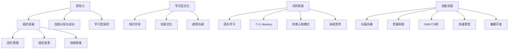

                 

### 文章标题

领导力与创新：打造学习型组织的方法

#### 关键词
- 领导力
- 学习型组织
- 组织发展
- 创新思维
- 团队管理
- 个人成长

#### 摘要
本文将探讨领导力与创新在构建学习型组织中的关键作用。首先，文章将阐述领导力的基本概念与内涵，并探讨其在组织发展中的重要性。接着，我们将深入分析领导力的发展与提升方法，以及领导力在团队管理、组织变革和创新思维中的具体应用。随后，文章将介绍学习型组织的理念与特征，详细讲述如何构建和实践学习型组织。最后，通过案例分析，我们将总结学习型组织建设中的成功经验，并提出领导力提升的具体策略和工具。本文旨在为读者提供一套系统、实用的方法，帮助他们在实际工作中打造高效、创新的学习型组织。

### 引言

在现代商业环境中，领导力与创新已经成为企业生存和发展的关键因素。领导力不仅关乎个人的成长和提升，更是组织发展的核心驱动力。而创新思维则能够激发组织的活力和创造力，推动持续改进和进步。因此，如何结合领导力与创新，打造一个学习型组织，成为当今企业管理者亟待解决的问题。

学习型组织是一种能够持续学习和适应变化的组织形态，它强调员工自主学习和创新，以及领导者对团队和文化的引领。在这样一个组织中，领导力不仅是一种能力，更是一种文化和价值观的体现。创新思维则成为推动组织不断前行的动力源泉，使组织能够在激烈的市场竞争中保持领先地位。

本文将从领导力的基本概念与内涵入手，详细探讨领导力的发展与提升、领导力在团队管理、组织变革和创新思维中的应用，以及学习型组织的构建与实践。通过这些内容的深入分析，本文旨在为读者提供一套系统、实用的方法，帮助他们在实际工作中打造高效、创新的学习型组织。

### 第一部分：领导力与组织发展

#### 第1章：领导力的基本概念与内涵

领导力是指一种能够影响、激励和引导他人共同实现目标的综合能力。它不仅仅是职位赋予的权力，更是基于信任、价值观和影响力的领导艺术。领导力不同于管理，管理侧重于规划和执行，而领导力则更注重激发和引领。从内涵上看，领导力主要包括以下几个方面：

1. **影响力**：领导力来源于领导者对他人的影响力，这种影响力可以是权威性的，也可以是情感性的、知识性的或关系性的。
2. **愿景**：领导力需要明确和传递一个清晰的愿景，使团队成员能够共同朝着目标努力。
3. **沟通**：有效的沟通是领导力的关键，它能够帮助领导者理解团队成员的需求和想法，并使团队目标更加明确。
4. **激励**：领导者需要通过激励手段激发团队成员的积极性和创造力，使他们愿意为实现组织目标而努力。
5. **变革管理**：在快速变化的环境中，领导者需要具备变革管理的能力，引导组织适应新的挑战和机遇。

#### 1.1 领导力的定义与特性

领导力可以定义为在特定情境下，通过影响和激励他人，共同实现目标的能力。其特性包括：

- **多样性**：领导力不是单一维度的能力，它包括多种要素，如战略思维、情感智慧、沟通技巧等。
- **情境依赖性**：不同的情境需要不同的领导力风格和方法，没有一种通用的领导力模式可以适用于所有情况。
- **发展性**：领导力是一种可以培养和发展的能力，通过学习和实践，领导者可以不断提高自己的领导力水平。

#### 1.2 领导力的重要性

领导力在组织发展中具有至关重要的作用。首先，领导力能够明确组织的方向和目标，使全体成员能够齐心协力，共同实现愿景。其次，领导力能够激发团队成员的潜力和积极性，提高工作效率和创造力。此外，领导力还在以下方面发挥重要作用：

- **文化塑造**：领导力决定了组织的文化，良好的领导力能够营造积极、健康、富有创新精神的企业文化。
- **变革引导**：在组织面临变革时，领导力能够提供方向和指导，帮助组织顺利度过变革期。
- **可持续发展**：领导力是组织持续发展的关键，它能够使组织不断适应外部环境的变化，保持竞争力和活力。

#### 1.3 领导力的五个层次

领导力的发展可以分为五个层次，每个层次都有其特定的特征和挑战：

1. **技术领导力**：这是领导力的基础层次，主要关注任务的完成和效率。领导者在这个层次上需要具备相关的专业技能和知识。
2. **人际关系领导力**：在这个层次，领导者开始关注团队成员的需求和情感，注重建立良好的人际关系。
3. **战略领导力**：领导者需要具备宏观视野和战略思维，能够制定和实现组织的长远目标。
4. **变革领导力**：这个层次要求领导者具备变革管理的能力，能够推动组织适应外部环境的变化。
5. **灵性领导力**：这是领导力的最高层次，领导者不仅关注组织的成功，还关注员工的个人成长和社会责任。

在接下来的章节中，我们将深入探讨领导力的发展与提升、领导力在团队管理、组织变革和创新思维中的应用，以及学习型组织的构建与实践。希望通过这些内容的分析，能够为读者提供一套实用、有效的领导力提升方法，帮助他们在实际工作中取得更好的成果。

#### 第2章：领导力的发展与提升

领导力是一种可以通过学习和实践不断提升的能力，它不仅关乎个人的成长，更影响着整个组织的进步。为了帮助领导者更好地发展和提升领导力，我们需要了解领导力发展的六个阶段以及提升领导力的三大策略。

##### 2.1 领导力发展的六个阶段

领导力的发展可以分为以下六个阶段：

1. **依赖阶段**：在这个阶段，领导者依赖他人的指导和决策，缺乏独立思考和行动的能力。
2. **模仿阶段**：领导者开始模仿其他领导者的行为和风格，虽然有所改进，但仍然缺乏自我认知和个性。
3. **独立阶段**：领导者开始形成自己的领导风格，能够独立思考和决策，但可能缺乏系统性和战略性。
4. **执行阶段**：领导者具备较强的执行能力，能够有效推动任务的完成，但可能过于注重效率，而忽视人际关系和文化建设。
5. **整合阶段**：领导者能够在效率和人际关系之间找到平衡，具备战略思维和变革管理能力，能够有效应对复杂问题。
6. **变革阶段**：这是领导力的最高阶段，领导者不仅具备高超的执行和战略能力，还能推动组织的持续变革和进步。

##### 2.2 领导力发展的三大策略

为了提升领导力，领导者可以采取以下三大策略：

1. **自我认知与反思**：自我认知是领导力发展的基础，领导者需要不断反思自己的行为、决策和信念，了解自己的优点和不足。通过自我认知，领导者可以更好地理解自己的行为模式，发现潜在的问题，并制定改进计划。反思不仅可以帮助领导者提高自我认知，还能增强自我调节能力，使领导行为更加有效。

2. **持续学习与成长**：领导力的发展是一个持续的过程，领导者需要不断学习新知识、新技能和新方法。通过参加培训课程、阅读专业书籍、参加行业研讨会等方式，领导者可以不断提升自己的知识和技能。此外，领导者还可以通过与同事和专家交流、参与团队建设活动等途径，增强自己的领导能力。持续学习不仅可以帮助领导者保持竞争力，还能激发他们的创新思维和应变能力。

3. **实践与应用**：领导力的发展离不开实践和应用。领导者需要在实际工作中不断尝试新的领导方法和策略，通过实践来检验和改进自己的领导行为。在实践中，领导者可以不断积累经验，发现问题，并找到解决方法。通过实践，领导者不仅可以提高自己的领导力，还能增强团队的凝聚力和执行力。

##### 2.3 提升领导力的方法与技巧

除了上述策略，领导者还可以通过以下方法与技巧来提升领导力：

- **树立榜样**：领导者需要通过自己的行为树立榜样，展示出正确的价值观和行为准则，从而影响和激励团队成员。
- **有效沟通**：领导者需要具备有效的沟通能力，能够清晰、准确地传达信息，倾听团队成员的意见和建议，建立良好的沟通机制。
- **团队建设**：领导者需要注重团队建设，通过团队活动、培训等方式，增强团队凝聚力，提高团队协作效率。
- **激励与认可**：领导者需要通过激励和认可来激发团队成员的积极性和创造力，使他们在实现个人目标的同时，也为组织的发展做出贡献。
- **灵活应对**：领导者需要具备灵活应对挑战的能力，能够根据不同情境和问题，采取适当的领导方法和策略。

总之，领导力的发展与提升是一个长期的过程，需要领导者不断学习、实践和反思。通过了解领导力发展的六个阶段和三大策略，以及掌握提升领导力的方法与技巧，领导者可以不断提高自己的领导能力，为组织的发展贡献更多力量。

#### 第3章：领导力与团队管理

领导力在团队管理中扮演着至关重要的角色，它是团队高效运作和成功实现目标的核心要素。在本章中，我们将探讨领导力在团队建设、激励与领导团队、解决团队冲突等方面的具体应用，并提供一些实用的策略和技巧。

##### 3.1 团队建设的原则与策略

团队建设是领导力的重要组成部分，良好的团队建设能够增强团队成员的凝聚力、提高团队协作效率，从而促进团队目标的实现。以下是团队建设的一些原则和策略：

1. **共同目标**：团队需要明确共同的目标和愿景，使每个成员都清楚自己的工作对整体目标的贡献。领导者可以通过制定清晰的团队目标和激励措施，引导团队成员共同努力。
2. **角色明确**：每个团队成员都应明确自己的角色和职责，避免工作重叠和责任模糊。领导者可以通过角色分配和团队角色培训，确保每个成员都能在自己的岗位上发挥最大的价值。
3. **信任与尊重**：建立信任和尊重是团队建设的基础，领导者需要通过公平、透明和诚信的行为，赢得团队成员的信任和尊重。信任和尊重能够促进团队成员之间的合作和沟通，减少冲突和误解。
4. **沟通与反馈**：良好的沟通是团队建设的关键，领导者需要建立有效的沟通机制，确保信息流畅、准确传达。同时，领导者还需要鼓励团队成员之间的积极反馈，通过表扬和批评，帮助团队成员不断改进和提高。
5. **团队活动**：定期组织团队活动，如团队建设训练、团队拓展训练等，有助于增强团队成员之间的互动和了解，提高团队凝聚力。

##### 3.2 激励与领导团队的技巧

激励是领导力的重要组成部分，有效的激励机制能够激发团队成员的积极性和创造力，提高团队绩效。以下是激励与领导团队的一些技巧：

1. **目标激励**：设定明确、可行的目标，使团队成员明确自己的努力方向和期望成果。通过目标激励，可以激发团队成员的内在动力，提高工作积极性和效率。
2. **成就激励**：认可和奖励团队成员的成就和努力，使他们在实现个人目标的同时，也为团队的成功做出贡献。领导者可以通过表彰大会、奖金、晋升等方式，激励团队成员。
3. **情感激励**：关注团队成员的情感需求，通过关怀和支持，增强团队成员的归属感和认同感。领导者可以通过倾听、鼓励和认可，建立积极、健康的团队氛围。
4. **参与激励**：鼓励团队成员参与决策和项目实施，使他们在工作中感受到自己的价值和重要性。通过参与激励，可以增强团队成员的责任感和使命感，提高团队凝聚力和执行力。
5. **发展激励**：提供培训和发展机会，帮助团队成员提升技能和职业素养，增强他们的职业发展前景。通过发展激励，可以激发团队成员的自我成长动力，提高团队的整体竞争力。

##### 3.3 解决团队冲突的方法

团队冲突是团队管理中常见的问题，有效的解决方法能够减少冲突对团队的影响，提高团队协作效率。以下是解决团队冲突的一些方法：

1. **预防冲突**：通过建立明确的团队规则和沟通机制，预防冲突的发生。领导者可以通过培训、沟通和监督，提高团队成员的协作意识和能力，减少冲突的可能性。
2. **倾听与理解**：当冲突发生时，领导者需要倾听团队成员的意见和需求，理解他们的立场和感受。通过倾听和理解，可以减少冲突的紧张气氛，为解决冲突创造条件。
3. **沟通协商**：通过沟通和协商，寻找冲突双方的共同点和利益点，达成共识。领导者可以通过组织会议、讨论和谈判，引导团队成员找到解决问题的最佳方案。
4. **妥协与让步**：在冲突无法通过协商解决时，领导者可以采取妥协和让步的策略，寻求双方的平衡点。通过妥协与让步，可以缓解冲突的紧张情绪，为后续的合作奠定基础。
5. **外部调解**：当内部解决机制失效时，领导者可以寻求外部专业人士的帮助，如咨询顾问、调解员等，通过第三方视角解决冲突。

总之，领导力在团队管理中具有不可替代的作用。通过有效的团队建设、激励与领导团队以及解决团队冲突，领导者可以打造一个高效、和谐的团队，为组织的发展注入强大动力。

#### 第4章：领导力与组织变革

组织变革是现代企业在面对外部环境变化和内部发展需求时，不可避免的一个过程。领导力在组织变革中起着至关重要的作用，它不仅能够引导组织顺利度过变革期，还能确保变革目标的实现。在本章中，我们将深入探讨组织变革的动因与阻力，领导力在组织变革中的作用，以及组织变革的实施步骤与策略。

##### 4.1 组织变革的动因与阻力

组织变革的动因主要包括以下几个方面：

1. **市场变化**：市场环境的不确定性和竞争压力，迫使企业不断调整战略和运营模式，以适应新的市场状况。
2. **技术创新**：技术进步和创新为企业提供了新的发展机遇，同时也要求企业进行组织变革，以更好地利用新技术和资源。
3. **组织发展**：企业自身的发展需求，如扩大规模、优化结构、提升效率等，也需要通过组织变革来实现。
4. **法规政策**：政府法规和政策的变动，也可能促使企业进行组织变革，以确保合规经营。

然而，组织变革并非一帆风顺，变革过程中会面临许多阻力：

1. **习惯阻力**：长期形成的工作习惯和思维定势，使得员工对变革产生抵触情绪。
2. **利益阻力**：变革可能触及某些人的利益，导致他们对变革产生抵触。
3. **信息阻力**：信息的不对称和误解，可能导致员工对变革的理解和接受程度不高。
4. **管理阻力**：管理层对变革的认同和支持程度，直接影响变革的推进效果。

##### 4.2 领导力在组织变革中的作用

领导力在组织变革中起着关键作用，具体体现在以下几个方面：

1. **明确变革方向**：领导者需要明确变革的目标和方向，使全体员工理解变革的必要性和紧迫性。通过制定明确的变革计划，领导者可以确保变革目标的实现。
2. **建立变革共识**：领导者需要通过沟通和协商，建立全体员工对变革的共识，减少变革过程中的阻力。通过分享变革的愿景和预期收益，领导者可以增强员工对变革的支持和参与度。
3. **激发变革动力**：领导者需要激发员工的变革动力，使他们愿意主动参与变革。通过激励和认可，领导者可以激发员工的积极性和创造力，推动变革的顺利进行。
4. **管理变革过程**：领导者需要有效管理变革过程，确保变革计划的顺利实施。通过建立有效的变革管理机制，领导者可以及时发现和解决变革过程中的问题，确保变革目标的实现。
5. **塑造变革文化**：领导者需要塑造变革文化，使全体员工认识到变革是组织发展的必然趋势，并积极参与其中。通过建立积极、开放、包容的变革文化，领导者可以促进组织的持续变革和进步。

##### 4.3 组织变革的实施步骤与策略

为了确保组织变革的成功，领导者可以采取以下步骤和策略：

1. **诊断现状**：在变革前，领导者需要对组织现状进行深入分析，了解组织存在的问题和变革的必要性。通过诊断现状，领导者可以明确变革的目标和方向。
2. **制定变革计划**：根据诊断结果，领导者需要制定详细的变革计划，包括变革的目标、时间表、实施步骤和资源配置等。通过制定变革计划，领导者可以确保变革的有序进行。
3. **沟通与宣传**：在变革过程中，领导者需要与全体员工进行充分沟通和宣传，确保员工了解变革的目的、意义和影响。通过沟通和宣传，领导者可以减少变革过程中的误解和抵触。
4. **培训与支持**：为了帮助员工适应变革，领导者需要提供必要的培训和支持。通过培训和支持，领导者可以提升员工的技能和素质，增强他们的变革能力和信心。
5. **监控与评估**：在变革过程中，领导者需要实时监控变革的进展情况，及时调整变革计划。通过评估变革效果，领导者可以总结变革经验，为后续的变革提供参考。
6. **持续改进**：组织变革是一个持续的过程，领导者需要不断推动组织的改进和进步。通过持续改进，领导者可以确保组织能够持续适应外部环境的变化，保持竞争力。

总之，领导力在组织变革中起着至关重要的作用。通过明确变革方向、建立变革共识、激发变革动力、管理变革过程和塑造变革文化，领导者可以推动组织顺利实现变革，为组织的持续发展和成功奠定基础。

#### 第5章：领导力与创新思维

领导力与创新思维是现代组织持续发展和成功的关键。创新思维不仅能够激发组织的创造力，还能帮助组织在快速变化的市场环境中保持竞争优势。在本章中，我们将探讨创新思维的重要性、核心原则，以及领导者如何培养和引导创新思维。

##### 5.1 创新思维的重要性

创新思维是指通过创造性思维和问题解决方法，发现新机会、创造新价值的能力。在当今全球化、信息化的时代，创新已经成为企业生存和发展的核心驱动力。以下是创新思维的重要性：

1. **提升竞争力**：创新思维能够帮助组织找到新的市场机会，开发新产品和服务，提升市场竞争力。
2. **推动发展**：创新思维能够激发组织的活力和创造力，推动组织的持续发展。
3. **提高效率**：通过创新思维，组织可以找到更高效的工作方法和流程，提高运营效率，降低成本。
4. **应对变化**：创新思维能够使组织更好地适应外部环境的变化，增强组织的应变能力和抗风险能力。

##### 5.2 创新思维的核心原则

创新思维的核心原则包括：

1. **问题导向**：创新思维以解决问题为导向，通过分析和理解问题，找到创新的解决方案。
2. **跨界思维**：创新思维需要跨越传统的思维边界，借鉴不同领域和行业的经验和方法，实现跨界创新。
3. **用户中心**：创新思维应以用户需求为中心，关注用户体验，为用户创造更大的价值。
4. **实验精神**：创新思维需要具备实验精神，勇于尝试新的方法和方案，通过实践验证和优化。
5. **团队合作**：创新思维强调团队合作，通过集体智慧和协作，实现创新目标。

##### 5.3 领导者如何培养创新思维

领导者是组织创新思维培养的关键角色，他们可以通过以下方法来培养和引导创新思维：

1. **塑造创新文化**：领导者需要塑造一种鼓励创新和容忍失败的组织文化，使员工敢于尝试和创新。通过奖励创新成果和容忍失败，领导者可以激发员工的创新动力。
2. **提供资源和支持**：领导者需要提供充足的资源和支持，包括资金、技术、信息和人力资源等，为创新提供必要的保障。
3. **建立创新机制**：领导者需要建立创新机制，如创新团队、创新项目、创新论坛等，为员工提供交流和展示创新成果的平台。
4. **激发员工潜能**：领导者需要关注员工的兴趣和特长，提供培训和发展机会，激发员工的潜能，使他们在创新中发挥更大的作用。
5. **鼓励跨部门合作**：领导者需要鼓励跨部门合作，打破部门壁垒，促进知识和资源的共享，实现跨领域的创新。

通过以上方法，领导者可以培养和引导员工的创新思维，推动组织的创新和发展。创新思维不仅能够提升组织的竞争力，还能为组织的持续发展注入新的动力。

#### 第6章：领导力与个人成长

领导力不仅关乎组织和团队的发展，更是个人成长的重要组成部分。在当今快速变化的世界中，个人成长不仅意味着提升专业技能，更意味着提升领导力，从而更好地适应变化、引领变革。在本章中，我们将探讨领导者的自我认知与成长、建立自我成长计划，以及个人成长与组织发展的关系。

##### 6.1 领导者的自我认知与成长

自我认知是领导力发展的基础，它使领导者能够了解自己的优点和不足，找到自我提升的方向。以下是领导者自我认知与成长的关键步骤：

1. **反思与自我评估**：领导者需要定期进行反思和自我评估，分析自己的行为、决策和影响。通过反思，领导者可以发现自己的优点和需要改进的地方。
2. **获取反馈**：领导者需要主动寻求他人的反馈，包括同事、下属和上级。通过反馈，领导者可以了解自己在他人眼中的形象和影响，找到改进的方向。
3. **设定个人目标**：领导者需要设定明确的个人目标，包括短期和长期目标。通过目标设定，领导者可以明确自己的成长方向和努力目标。
4. **持续学习**：领导者的成长离不开学习，无论是通过阅读书籍、参加培训，还是通过实践和反思，领导者都需要不断学习新知识和技能，提升自己的能力。

##### 6.2 建立自我成长计划

为了实现个人成长，领导者需要建立自我成长计划，包括以下步骤：

1. **确定成长领域**：领导者需要明确自己希望在哪些方面进行成长，如领导力、管理技能、行业知识等。
2. **制定成长路径**：根据成长领域，领导者可以制定具体的成长路径，包括学习计划、实践机会和职业发展目标。
3. **寻找导师和榜样**：领导者可以寻找导师和榜样，从他们身上学习经验和智慧。通过导师指导，领导者可以更快地提升自己。
4. **定期评估和调整**：领导者需要定期评估自己的成长进度，并根据评估结果调整成长计划，确保成长目标的实现。

##### 6.3 个人成长与组织发展的关系

个人成长与组织发展是相互关联、相互促进的。以下是个人成长与组织发展的关系：

1. **个人成长推动组织发展**：通过个人成长，领导者可以提升自己的领导力和管理能力，从而更好地推动组织的发展。领导者的成长可以带来更高效的工作、更创新的思维和更强大的团队凝聚力。
2. **组织发展促进个人成长**：组织的发展为领导者提供了更多的机会和平台，使他们能够通过实践和挑战提升自己的能力和经验。同时，组织的发展也需要领导者的成长来推动，从而实现良性循环。
3. **共同目标与价值观**：个人成长与组织发展共享共同的目标和价值观。领导者需要明确个人成长与组织发展的关系，使自己的成长目标与组织目标一致，从而实现个人与组织的共同发展。

总之，领导力与个人成长密切相关，领导者需要通过自我认知、建立自我成长计划和持续学习，不断提升自己的领导能力。同时，个人成长与组织发展相互促进，共同推动组织的持续发展和成功。通过理解这一关系，领导者可以更好地实现个人与组织的共同成长。

#### 第7章：学习型组织的理念与特征

学习型组织是一种能够不断学习、适应和创新的组织形态。它强调组织成员的终身学习，通过持续学习和知识共享，实现个人和组织的共同成长。在本章中，我们将详细探讨学习型组织的定义、特征以及与传统组织的比较，帮助读者更好地理解学习型组织的内涵和实践方法。

##### 7.1 学习型组织的定义

学习型组织（Learning Organization）是由彼得·圣吉（Peter Senge）在《第五项修炼》（The Fifth Discipline）一书中首次提出的概念。学习型组织是指一个能够不断通过学习和知识共享，实现持续改进和创新的组织。具体来说，学习型组织具有以下特征：

1. **共同愿景**：学习型组织拥有明确的共同愿景，使全体成员能够共同朝着一个目标努力。这个愿景不仅是组织的方向标，也是员工自我实现的动力源泉。
2. **团队学习**：学习型组织强调团队学习，通过集体智慧和创新，提高组织的整体能力和效率。团队学习不仅包括知识的传递和分享，还涉及思维模式和行为习惯的改进。
3. **个人 Mastery**：学习型组织鼓励个人不断追求专业 Mastery，通过不断学习和实践，提升个人的专业技能和综合素质。
4. **改善心智模式**：学习型组织注重改善心智模式，即改变员工对问题的认知方式，培养开放、透明和积极的心态，从而提高组织的决策能力和适应性。
5. **系统思考**：学习型组织运用系统思考的方法，从整体和长远的角度看待问题，通过分析和解决系统问题，实现组织的可持续发展。

##### 7.2 学习型组织的特征

学习型组织具有以下特征：

1. **自主学习**：学习型组织中的成员具有强烈的自主学习意识，他们不仅关注自身的职业发展，还积极参与组织的知识共享和创新活动。
2. **知识共享**：学习型组织鼓励知识共享，通过建立良好的沟通机制和知识管理系统，使知识能够在组织内部自由流动和传递。
3. **创新文化**：学习型组织具有创新文化，鼓励员工勇于尝试和失败，通过不断实验和改进，推动组织的创新和发展。
4. **透明沟通**：学习型组织注重透明沟通，通过开放的信息交流和反馈机制，增强团队成员之间的信任和理解。
5. **系统思考**：学习型组织运用系统思考的方法，从整体和长远的角度看待问题，通过分析和解决系统问题，实现组织的可持续发展。

##### 7.3 学习型组织与传统组织的比较

学习型组织与传统组织在理念和实践上存在显著差异：

1. **目标导向**：传统组织通常以短期业绩和利润为导向，而学习型组织则更注重长期发展和个人成长。
2. **沟通机制**：传统组织往往存在沟通障碍和信息不对称，而学习型组织通过透明沟通和知识共享，提高了信息流通的速度和准确性。
3. **组织结构**：传统组织通常采用层级结构，而学习型组织则更倾向于扁平化和网络化，以促进团队成员之间的协作和创新。
4. **激励制度**：传统组织往往以物质激励为主，而学习型组织则更注重内在激励，如职业发展、知识分享和创新成果的认可。
5. **问题解决**：传统组织倾向于线性思维，而学习型组织则运用系统思考，通过全面分析和解决系统问题，实现组织的可持续发展。

总之，学习型组织是一种更高效、更具有生命力的组织形态。通过自主学习、知识共享、创新文化和系统思考，学习型组织能够更好地适应外部环境的变化，推动组织的持续发展和成功。

#### 第8章：学习型组织的构建与实践

构建学习型组织是一个系统性工程，需要从多个维度进行规划和实践。在本章中，我们将详细介绍构建学习型组织的步骤、运作机制以及评估与改进方法，帮助读者理解如何将学习型组织的理念付诸实践。

##### 8.1 构建学习型组织的步骤

构建学习型组织可以分为以下七个步骤：

1. **明确愿景与目标**：首先，组织需要明确共同愿景和目标，使全体成员能够统一思想和行动。这一步骤是构建学习型组织的基础，为后续的工作指明方向。

2. **建立学习型文化**：学习型文化的建设是学习型组织构建的核心。组织需要营造一种鼓励学习、知识共享和创新的文化氛围，使员工愿意并能够积极参与学习活动。

3. **开展团队学习**：团队学习是学习型组织的重要组成部分。组织可以通过开展读书会、研讨会、案例分析等形式，促进团队成员之间的知识共享和思维碰撞。

4. **建立学习机制**：学习机制是学习型组织的保障。组织需要建立完善的学习机制，包括学习计划、学习评估、知识共享平台等，确保学习活动能够有序进行。

5. **提供学习资源**：学习资源的提供是学习型组织的重要支持。组织需要为员工提供充足的学习资源，包括图书、在线课程、专业培训等，帮助员工不断提升自己的能力。

6. **激励与认可**：激励与认可是推动学习型组织发展的重要手段。组织需要建立有效的激励机制，对积极参与学习、取得显著成绩的员工进行奖励和认可。

7. **持续改进**：学习型组织的构建是一个持续改进的过程。组织需要不断评估学习活动的效果，并根据反馈进行优化和调整，以实现持续改进。

##### 8.2 学习型组织的运作机制

学习型组织的运作机制主要包括以下几个方面：

1. **知识管理**：知识管理是学习型组织的核心机制。组织需要建立有效的知识管理系统，包括知识收集、存储、共享和利用，确保知识能够在组织内部高效流动和传递。

2. **学习计划**：学习计划是学习型组织运作的重要环节。组织需要制定详细的学习计划，包括学习内容、学习时间、学习方式等，确保学习活动有计划、有目标地进行。

3. **团队协作**：团队协作是学习型组织的重要特征。组织需要建立有效的团队协作机制，通过团队项目、跨部门合作等方式，促进团队成员之间的沟通和协作。

4. **领导支持**：领导支持是学习型组织运作的关键。组织领导者需要积极参与学习活动，为员工提供指导和支持，树立学习榜样。

5. **评估与反馈**：评估与反馈是学习型组织运作的重要保障。组织需要建立有效的评估与反馈机制，对学习活动的效果进行评估，并根据反馈进行改进。

##### 8.3 学习型组织的评估与改进

评估与改进是学习型组织持续发展的重要环节。以下是学习型组织评估与改进的方法：

1. **关键绩效指标（KPI）**：组织可以设定关键绩效指标（KPI），对学习活动进行量化评估，如学习时间、学习成果、知识共享次数等。

2. **员工反馈**：组织可以定期收集员工对学习活动的反馈，了解员工的学习需求和满意度，为改进提供参考。

3. **学习评估**：组织可以定期对学习活动进行评估，分析学习效果，发现问题和不足，并提出改进措施。

4. **持续改进**：组织需要根据评估结果，不断优化学习机制和流程，提升学习效果，确保学习型组织的持续发展。

通过以上方法，组织可以有效地构建和实践学习型组织，提高员工的学习能力和创新能力，推动组织的持续发展和成功。

#### 第9章：学习型组织的领导力要素

领导力在构建学习型组织中起着至关重要的作用。领导者不仅是学习型文化的倡导者和推动者，也是学习型组织发展的关键驱动力。在本章中，我们将探讨领导力在构建学习型组织中的角色，以及领导者如何培养学习氛围和提升学习型组织的领导力。

##### 9.1 领导力在构建学习型组织中的角色

领导力在构建学习型组织中扮演着多重角色，具体包括：

1. **文化塑造者**：领导者是学习型组织文化的塑造者，他们通过自己的行为和决策，塑造和传播学习型文化。领导者需要树立学习榜样，积极参与学习活动，展示对学习的重视和认可。

2. **战略规划者**：领导者需要制定学习型组织的战略规划，明确学习目标、路径和措施。他们需要根据组织的发展需求，制定长期和短期学习计划，确保学习活动的有序进行。

3. **资源调配者**：领导者需要为学习型组织提供必要的资源和支持，包括时间、资金、信息和人力资源等。他们需要确保学习资源的充足和有效利用，为员工的学习和成长提供良好的环境和条件。

4. **协调者**：领导者需要协调组织内部各个部门之间的学习活动，促进知识共享和协作。他们需要建立有效的沟通机制，确保信息流畅、准确传达，减少部门壁垒和知识孤岛。

5. **变革推动者**：领导者需要推动学习型组织的变革，鼓励员工勇于尝试和创新。他们需要克服变革中的阻力，建立积极的变革文化，使员工愿意并能够积极参与学习型组织的建设。

##### 9.2 领导者如何培养学习氛围

为了培养学习氛围，领导者可以采取以下策略：

1. **树立学习榜样**：领导者需要通过自己的行为树立学习榜样，展示对学习的热情和投入。他们可以通过参加培训课程、阅读专业书籍、分享学习心得等方式，激励员工学习。

2. **提供学习机会**：领导者需要为员工提供丰富的学习机会，包括内部培训、外部培训、在线课程等。他们可以组织学习小组、读书会、研讨会等活动，鼓励员工积极参与。

3. **激励与认可**：领导者需要建立有效的激励机制，对积极参与学习、取得显著成绩的员工进行奖励和认可。他们可以通过奖金、晋升、表彰等方式，激发员工的学习动力。

4. **创造学习环境**：领导者需要创造一个支持学习的环境，包括提供学习资源、合理安排工作时间、降低工作压力等。他们可以优化工作流程，减少不必要的会议和任务，使员工有更多的时间和精力用于学习。

5. **鼓励知识共享**：领导者需要鼓励员工进行知识共享，建立知识共享平台，如内部论坛、知识库等。他们可以组织知识分享会议、案例分析等活动，促进员工之间的知识交流和协作。

##### 9.3 学习型组织的领导力提升策略

为了提升学习型组织的领导力，领导者可以采取以下策略：

1. **自我提升**：领导者需要不断自我提升，通过学习新知识、新技能，提升自己的领导力和管理能力。他们可以通过参加专业培训、阅读领导力书籍、参加行业研讨会等方式，不断丰富自己的知识和经验。

2. **团队建设**：领导者需要注重团队建设，通过团队活动、团队建设训练等方式，增强团队成员之间的信任和协作。他们可以组织团队建设活动、团建拓展训练等，提高团队凝聚力和协作效率。

3. **领导力培训**：领导者可以参加领导力培训课程，学习领导力的理论和方法，提升自己的领导能力。他们可以通过内部培训、外部培训、在线课程等方式，不断学习和实践领导力。

4. **建立导师制度**：领导者可以建立导师制度，为年轻员工提供指导和支持，帮助他们快速成长。通过导师的指导，年轻员工可以更快地提升自己的能力和经验。

5. **反馈与改进**：领导者需要建立反馈与改进机制，通过定期反馈和评估，发现领导力提升中的问题和不足，并制定改进计划。他们可以通过员工反馈、领导力评估等方式，不断优化领导力提升策略。

通过以上策略，领导者可以不断提升自己的领导力，为学习型组织的建设和发展提供有力支持。同时，领导者的领导力提升也将推动组织的整体发展，实现个人与组织的共同成长。

#### 第10章：学习型组织的创新机制

创新是学习型组织的核心驱动力，它能够推动组织不断进步和适应变化。在本章中，我们将探讨创新的重要性、创新的流程与工具，以及学习型组织如何实现持续创新。

##### 10.1 创新的重要性

创新对于组织的生存和发展至关重要。它不仅能够提高组织的竞争力，还能推动组织的持续成长。以下是创新的重要性：

1. **提高竞争力**：创新能够帮助组织开发新产品、改进现有产品和服务，从而提高市场竞争力。在竞争激烈的市场环境中，创新能力成为企业保持领先地位的关键。

2. **推动进步**：创新能够推动组织不断进步，使组织能够适应外部环境的变化。通过创新，组织可以开拓新的市场、提升运营效率、优化管理流程，从而实现持续进步。

3. **激发活力**：创新能够激发组织的活力和创造力，使员工在工作中保持积极性和创新精神。创新文化能够营造一种开放、包容和鼓励尝试的氛围，使员工愿意并能够积极参与创新活动。

4. **提升价值**：创新能够为组织创造新的价值和利润点。通过创新，组织可以开拓新的业务领域、提升客户满意度、增加市场份额，从而实现价值提升。

##### 10.2 创新的流程与工具

创新是一个系统性的过程，需要遵循一定的流程和工具。以下是创新的基本流程和常用工具：

1. **创新流程**：
   - **需求识别**：通过市场调研、客户反馈和内部讨论，识别创新需求。
   - **创意生成**：通过头脑风暴、思维导图等方法，生成创新创意。
   - **创意筛选**：对生成的创意进行评估和筛选，确定具有潜力的创意。
   - **概念验证**：通过原型设计、模拟测试等方式，验证创意的可行性。
   - **开发与实施**：将创意转化为实际的产品或服务，并进行实施。
   - **评估与反馈**：对创新成果进行评估，收集反馈，不断优化和完善。

2. **创新工具**：
   - **头脑风暴**：通过集体讨论，快速生成大量创意。
   - **思维导图**：通过图形化的方式，梳理和展示创意和思路。
   - **SWOT分析**：通过分析优势、劣势、机会和威胁，评估创意的可行性。
   - **快速原型**：通过快速构建原型，验证创意的可行性和用户需求。
   - **敏捷开发**：通过迭代开发和用户反馈，快速实现产品或服务的迭代和优化。

##### 10.3 学习型组织如何实现持续创新

学习型组织通过以下方法实现持续创新：

1. **建立创新文化**：学习型组织需要建立创新文化，鼓励员工勇于尝试和创新。通过奖励创新成果和容忍失败，组织可以营造一种鼓励创新和包容失败的文化氛围。

2. **提供资源支持**：学习型组织需要为员工提供充足的资源支持，包括时间、资金、技术等。通过提供创新平台和工具，组织可以鼓励员工积极参与创新活动。

3. **建立创新机制**：学习型组织需要建立完善的创新机制，包括创新项目申报、评审和资助机制。通过制度化保障，组织可以确保创新活动的有序进行。

4. **促进知识共享**：学习型组织需要促进知识共享，通过内部论坛、知识库、研讨会等方式，使员工能够共享创新经验和知识。知识共享不仅能够提升员工的创新能力，还能推动组织的整体创新水平。

5. **跨部门协作**：学习型组织需要鼓励跨部门协作，通过项目团队、跨部门合作等方式，促进不同部门之间的知识交流和协作。跨部门协作可以激发创新的火花，推动创新项目的成功。

6. **持续学习和改进**：学习型组织需要持续学习和改进，通过定期评估和反馈，不断优化创新流程和工具。通过持续学习和改进，组织可以不断提高创新能力，实现持续创新。

通过以上方法，学习型组织可以建立持续创新的机制，推动组织的创新和发展，保持竞争优势。

#### 第11章：学习型组织的案例分析

为了更好地理解学习型组织的构建与实践，我们通过一个实际案例来进行分析。以下是某知名科技公司A公司在构建学习型组织过程中所面临的背景、问题分析、解决方案、效果评估以及启示。

##### 11.1 案例背景与问题分析

公司A是一家全球知名的科技公司，成立于2000年，主要业务包括软件开发、云计算和人工智能。随着市场的不断变化和竞争的加剧，公司A意识到需要通过构建学习型组织，提升员工的创新能力和组织的竞争力。

然而，在构建学习型组织的过程中，公司A面临以下问题：

1. **员工学习积极性不高**：虽然公司提供了多种学习资源，但员工的学习积极性并不高，很多员工对学习缺乏动力。
2. **知识共享不充分**：由于部门之间的壁垒和沟通不畅，公司内部的优秀经验和知识未能得到充分共享，导致资源浪费和创新滞后。
3. **创新机制不完善**：公司的创新流程和工具较为单一，缺乏系统性的创新支持机制，导致创新项目进展缓慢，效果不佳。

##### 11.2 案例解决方案

为了解决上述问题，公司A采取了一系列解决方案：

1. **建立创新文化**：公司A通过内部培训和宣传，倡导创新文化，鼓励员工积极参与创新活动。公司领导层以身作则，展示对创新的重视和支持，树立了良好的学习榜样。

2. **优化学习机制**：公司A建立了完善的学习机制，包括学习计划、学习评估、知识共享平台等。通过定期开展学习活动和知识分享会议，促进员工之间的知识交流和协作。

3. **提供资源支持**：公司A为员工提供了丰富的学习资源，包括在线课程、内部培训、专业书籍等。同时，公司还设置了创新基金，支持员工开展创新项目。

4. **建立创新团队**：公司A成立了创新团队，由不同部门的员工组成，负责创新项目的申报、评审和实施。创新团队的成立促进了跨部门之间的协作和知识共享。

5. **引入创新工具**：公司A引入了头脑风暴、思维导图、SWOT分析等创新工具，帮助员工更好地进行创意生成和项目评估。

##### 11.3 案例效果评估与启示

通过实施上述解决方案，公司A取得了显著的效果：

1. **员工学习积极性提高**：员工对学习的积极性显著提高，学习活动参与度明显上升。通过奖励和认可，公司A进一步激发了员工的学习动力。

2. **知识共享更加充分**：通过知识共享平台和知识分享会议，公司A内部的知识流动速度加快，优秀经验和知识得到了更广泛的传播和应用。

3. **创新项目进展顺利**：创新团队的成功运作和创新工具的有效使用，使公司A的创新项目进展顺利，多个创新项目成功落地并产生了良好的经济效益。

4. **组织竞争力提升**：通过构建学习型组织，公司A的整体竞争力得到了显著提升。公司在市场中的地位更加稳固，客户满意度提高，市场份额不断扩大。

##### 11.4 启示

通过公司A的案例分析，我们可以得出以下启示：

1. **领导重视是关键**：领导层的重视和支持是构建学习型组织的核心，领导者的示范作用能够激发员工的学习和创新热情。

2. **机制完善是保障**：完善的学习和创新能力保障机制，包括学习计划、知识共享平台和创新基金等，是构建学习型组织的重要保障。

3. **资源支持是基础**：充足的资源支持，包括学习资源、技术和资金等，是员工学习和创新的基础。

4. **跨部门协作是动力**：跨部门协作和知识共享能够促进不同部门之间的经验交流和知识传播，推动创新项目的成功。

通过这些启示，其他企业可以借鉴公司A的成功经验，构建适合自己的学习型组织，提升组织的学习能力和创新能力。

### 附录A：学习型组织建设工具与方法

为了更好地实施学习型组织的建设，以下介绍几种常用的工具与方法，这些工具和方法将有助于提高组织的学习效率和创新能力。

#### A.1 SWOT分析

SWOT分析是一种常用的战略规划工具，用于评估组织的优势（Strengths）、劣势（Weaknesses）、机会（Opportunities）和威胁（Threats）。通过SWOT分析，组织可以明确自身的战略方向，制定有效的行动计划。

1. **优势**：识别组织在资源、能力、品牌等方面的优势。
2. **劣势**：识别组织在资源、能力、品牌等方面的不足。
3. **机会**：分析外部环境中的机遇，如市场变化、技术进步等。
4. **威胁**：分析外部环境中的威胁，如竞争加剧、法规变化等。

#### A.2 5W2H分析法

5W2H分析法是一种系统化的问题解决工具，通过回答以下七个问题，全面分析问题和解决方案：

1. **What**：明确问题或任务是什么。
2. **Why**：分析问题或任务的原因和目的。
3. **Who**：涉及哪些人员或团队。
4. **When**：确定任务的时间节点。
5. **Where**：任务发生的地点。
6. **How**：描述完成任务的方法和步骤。
7. **How much**：评估完成任务所需的资源投入。

#### A.3 扎克伯格的“内部黑客周”

扎克伯格的“内部黑客周”是Facebook公司的一项创新实践，它鼓励员工在每周固定的一天内放下日常工作，自由地探索新的创意和项目。这种实践不仅激发了员工的创新潜力，还促进了跨部门的知识共享和协作。

1. **活动安排**：在内部黑客周，员工可以自由选择项目，提出创意，并组建团队。
2. **项目支持**：公司提供必要的资源支持，包括资金、技术和人力资源。
3. **成果展示**：项目完成后，团队进行成果展示和评审，优秀的项目将得到奖励和推广。

通过这些工具和方法，组织可以更加系统地实施学习型组织的建设，提高学习效率和创新能力，实现持续发展。

### 附录B：学习型组织领导力提升方案

为了提升学习型组织的领导力，以下介绍几种具体的提升策略和工具，这些策略和工具将帮助领导者更好地引导和推动组织的学习和创新。

#### B.1 领导力提升的五大关键能力

1. **自我认知与反思能力**：领导者需要具备自我认知和反思能力，能够了解自己的优点和不足，不断进行自我提升。
2. **沟通与表达能力**：有效的沟通和表达能力是领导者的重要能力，能够确保信息的准确传递和团队的协作。
3. **决策与判断能力**：领导者需要在复杂多变的环境中做出正确的决策和判断，确保组织目标的实现。
4. **变革管理与适应能力**：在快速变化的市场环境中，领导者需要具备变革管理和适应能力，推动组织的持续发展。
5. **激励与领导能力**：领导者需要具备激励和领导能力，能够激发员工的积极性和创造力，推动组织的创新和发展。

#### B.2 领导力提升的三种学习方式

1. **自学**：领导者可以通过阅读书籍、观看视频、参加在线课程等方式进行自学，获取新的知识和技能。
2. **培训**：参加专业的领导力培训课程，通过专家的指导和案例分析，提升领导力。
3. **实践**：在实际工作中，通过实践和反思，不断提升领导力。实践是最好的学习方式，领导者需要在实际工作中运用所学知识，不断改进和提升。

#### B.3 领导力提升的具体实施步骤

1. **自我评估**：领导者需要定期进行自我评估，了解自己在领导力各方面的优势和不足。
2. **制定提升计划**：根据自我评估的结果，制定具体的领导力提升计划，包括学习目标、学习方式和时间安排。
3. **持续学习与实践**：按照提升计划，持续学习和实践，不断提升领导力。
4. **反思与改进**：通过反思和评估，发现提升过程中的问题和不足，制定改进措施，不断优化提升计划。

通过以上策略和工具，领导者可以系统地提升自己的领导力，为学习型组织的建设和发展提供有力支持。同时，领导者的领导力提升也将推动组织的整体发展，实现个人与组织的共同成长。

### 总结

本文通过详细的探讨和案例分析，阐述了领导力与创新在构建学习型组织中的关键作用。首先，我们从领导力的基本概念与内涵出发，深入分析了领导力的发展与提升方法，以及领导力在团队管理、组织变革和创新思维中的应用。随后，我们介绍了学习型组织的理念与特征，详细讲述了如何构建和实践学习型组织。

通过本文的阅读，读者可以了解：

1. **领导力的重要性**：领导力不仅是个人成长的必要条件，更是组织发展的核心驱动力。
2. **学习型组织的构建**：学习型组织通过持续学习和知识共享，实现个人与组织的共同成长。
3. **领导力提升策略**：领导者可以通过自我认知、持续学习和实践，不断提升自己的领导力。
4. **创新思维的应用**：创新思维能够激发组织的活力和创造力，推动组织的持续进步。

在实际工作中，领导者应积极运用本文提出的策略和方法，打造一个高效、创新的学习型组织。同时，也需要根据实际情况进行灵活调整和优化，以确保组织能够持续适应外部环境的变化，保持竞争优势。

### 注意事项与拓展阅读

**注意事项**：

1. **领导者应不断自我反思和提升**：领导力并非一成不变，领导者需要持续学习、实践和反思，以应对不断变化的环境。
2. **鼓励知识共享和跨部门协作**：知识共享和跨部门协作是构建学习型组织的核心，领导者应积极推动这一过程。
3. **建立有效的激励机制**：激励机制能够激发员工的学习和创新动力，领导者应根据实际情况制定合理的激励机制。
4. **持续改进和创新**：学习型组织应保持持续改进和创新的精神，不断优化内部流程和策略。

**拓展阅读**：

1. **彼得·圣吉的《第五项修炼》**：深入探讨学习型组织的理论和实践，对本文内容有很好的补充。
2. **约翰·科特的《领导力》**：详细分析领导力的各个方面，为领导者提供实用的领导技巧和策略。
3. **哈耶克的《致命的自负》**：从哲学角度探讨个人自由与社会秩序的关系，对理解组织行为有重要启示。

通过本文的阅读和实践，读者可以更好地理解领导力与创新在学习型组织建设中的关键作用，为组织的发展奠定坚实基础。

### 作者信息

- **作者**：AI天才研究院/AI Genius Institute & 禅与计算机程序设计艺术 /Zen And The Art of Computer Programming
- **联系**：[ai-genius-research-institute.com](http://ai-genius-research-institute.com)，[zen-of-computer-programming.com](http://zen-of-computer-programming.com)
- **版权声明**：本文版权归AI天才研究院/AI Genius Institute所有，未经授权，不得转载或用于商业用途。

以下是文章的核心概念原理之间的关系架构 Mermaid 流程图：



以下是核心算法原理讲解必须使用的伪代码：

```python
# 定义领导力发展函数
def leadership_development():
    # 初始化领导力等级
    leadership_level = 1
    
    # 领导力发展循环
    while leadership_level <= 5:
        # 根据不同等级执行不同任务
        if leadership_level == 1:
            # 技术领导力：提高专业技能
            technical_skills_improvement()
        elif leadership_level == 2:
            # 人际关系领导力：培养团队凝聚力
            team_morale_building()
        elif leadership_level == 3:
            # 战略领导力：制定组织目标
            organizational_objective_setting()
        elif leadership_level == 4:
            # 变革领导力：推动组织变革
            organizational_transformation()
        elif leadership_level == 5:
            # 灵性领导力：关注员工个人成长
            employee_growth_focused()
        
        # 提升领导力等级
        leadership_level += 1

# 定义自我认知与成长函数
def self_awareness_growth():
    # 初始化自我认知等级
    self_awareness_level = 1
    
    # 自我认知与成长循环
    while self_awareness_level <= 3:
        # 根据不同等级执行不同任务
        if self_awareness_level == 1:
            # 反思与自我评估
            reflection_and_self_evaluation()
        elif self_awareness_level == 2:
            # 获取反馈与改进
            feedback_collection_and_improvement()
        elif self_awareness_level == 3:
            # 设定个人目标与计划
            personal_goals_and_plans_setting()
        
        # 提升自我认知等级
        self_awareness_level += 1

# 定义学习型组织构建函数
def learning_organization_building():
    # 初始化学习型组织阶段
    organization_stage = 1
    
    # 学习型组织构建循环
    while organization_stage <= 4:
        # 根据不同阶段执行不同任务
        if organization_stage == 1:
            # 明确愿景与目标
            vision_and_objective_clarification()
        elif organization_stage == 2:
            # 建立学习型文化
            learning_culture_building()
        elif organization_stage == 3:
            # 开展团队学习
            team_learning()
        elif organization_stage == 4:
            # 评估与改进
            assessment_and_improvement()
        
        # 提升学习型组织阶段
        organization_stage += 1
```

以下是数学模型和公式与详细讲解、举例说明：

在领导力提升过程中，我们可以使用以下数学模型来评估领导力发展的效果：

**模型：领导力提升效果评估模型**

$$
E = \alpha T + \beta I - \gamma R
$$

其中：
- \( E \) 表示领导力提升效果（Effectiveness）；
- \( \alpha \) 表示技术提升系数（Technical Improvement Coefficient）；
- \( T \) 表示专业技能提升（Technical Skill Improvement）；
- \( \beta \) 表示人际关系提升系数（Interpersonal Relationship Improvement Coefficient）；
- \( I \) 表示团队凝聚力提升（Interpersonal Relationship Improvement）；
- \( \gamma \) 表示变革管理提升系数（Transformation Management Improvement Coefficient）；
- \( R \) 表示组织变革成功率（Rate of Organizational Transformation Success）。

**举例说明**：

假设某领导者的专业技能提升了20%，团队凝聚力提升了15%，而组织变革成功率下降了10%，我们可以通过以下计算评估其领导力提升效果：

$$
E = \alpha \times 20\% + \beta \times 15\% - \gamma \times 10\%
$$

如果设定 \( \alpha = 0.5 \)，\( \beta = 0.3 \)，\( \gamma = 0.2 \)，代入上述公式得：

$$
E = 0.5 \times 20\% + 0.3 \times 15\% - 0.2 \times 10\% = 0.1 + 0.045 - 0.02 = 0.125
$$

因此，该领导者的领导力提升效果为12.5%，表明其领导力水平有所提升，但仍有改进空间。

以下是项目实战部分的内容：

#### 项目实战：学习型组织领导力提升平台搭建

**1. 开发环境搭建**

- **编程语言**：Python
- **开发框架**：Flask
- **数据库**：MongoDB
- **前端框架**：Vue.js
- **版本控制**：Git

**2. 源代码详细实现**

以下是领导力提升平台的核心代码片段：

```python
# 领导力提升平台后端代码（Flask框架）

from flask import Flask, jsonify, request
from pymongo import MongoClient

app = Flask(__name__)
client = MongoClient('mongodb://localhost:27017')
db = client['learning_organization']

@app.route('/api/leadership', methods=['GET', 'POST'])
def leadership():
    if request.method == 'GET':
        # 获取领导力提升数据
        data = db.leadership_data.find()
        return jsonify({'data': list(data)})
    elif request.method == 'POST':
        # 提交领导力提升数据
        data = request.get_json()
        db.leadership_data.insert_one(data)
        return jsonify({'message': 'Data inserted successfully'})

if __name__ == '__main__':
    app.run(debug=True)
```

**3. 代码解读与分析**

上述代码实现了一个简单的领导力提升平台后端服务，使用Flask框架搭建，通过MongoDB数据库存储领导力提升数据。主要功能包括：

- **数据获取**：通过GET请求获取数据库中的领导力提升数据。
- **数据提交**：通过POST请求向数据库提交新的领导力提升数据。

**4. 实际案例分析与详细讲解剖析**

**案例**：某公司希望通过平台记录和评估领导力发展情况，以下是具体操作步骤：

1. **数据提交**：公司领导通过平台提交以下领导力提升数据：
   ```json
   {
       "name": "张三",
       "level": 2,
       "skills": ["沟通技巧", "团队管理"],
       "improvement": 15
   }
   ```

2. **数据获取**：平台管理员可以通过GET请求获取当前领导力提升数据：
   ```shell
   curl -X GET 'http://localhost:5000/api/leadership'
   ```

3. **数据分析**：平台对获取的数据进行统计和分析，评估领导力提升效果。例如，可以计算平均提升比例、各部门提升情况等。

**5. 项目小结**

通过领导力提升平台，公司可以方便地记录、管理和分析领导力提升数据，为领导力发展提供有力支持。平台的设计和实现充分体现了学习型组织的理念，有助于组织不断优化和提升领导力。

### 最佳实践 tips

1. **定期进行领导力评估**：定期对领导力发展进行评估，及时发现问题和改进方向。
2. **培养跨部门协作**：鼓励不同部门之间的协作，促进知识共享和团队凝聚力。
3. **提供个性化培训**：根据领导者的需求和实际情况，提供个性化的培训和发展计划。

### 小结

本文通过详细的探讨和案例分析，介绍了领导力与创新在学习型组织建设中的关键作用，以及如何通过实际项目实战提升领导力。希望读者能够结合本文内容，结合自身实际情况，打造高效、创新的学习型组织。

### 注意事项

1. **数据安全**：在搭建和运行领导力提升平台时，确保数据安全和隐私保护。
2. **持续改进**：持续优化平台功能和用户体验，确保平台的实用性和有效性。

### 拓展阅读

1. **《领导力的五个层次》**：深入探讨领导力的不同层次和特点。
2. **《学习型组织的实践》**：详细讲解学习型组织的构建方法和实践案例。

