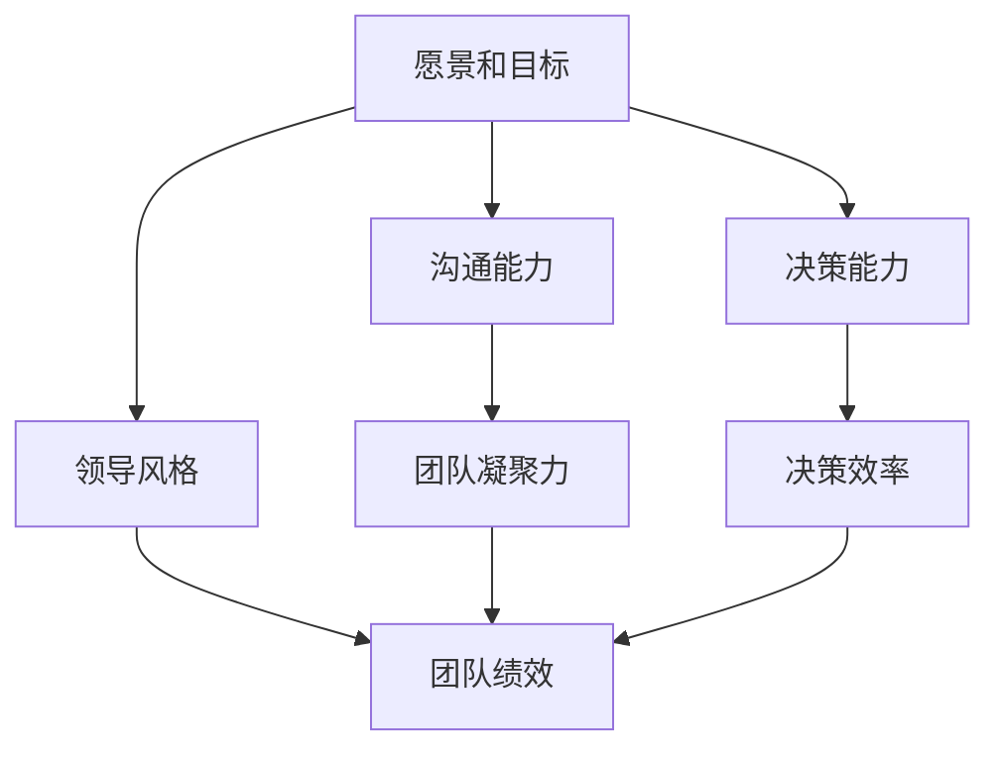
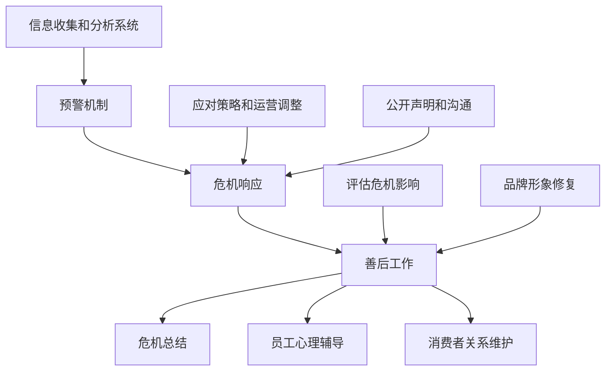
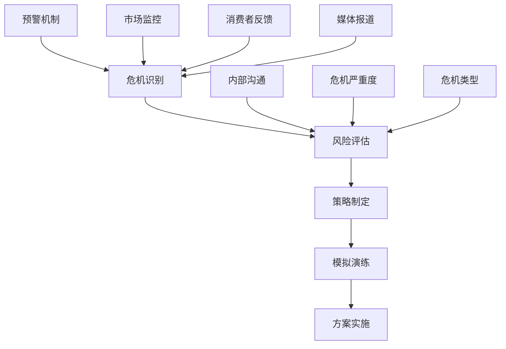
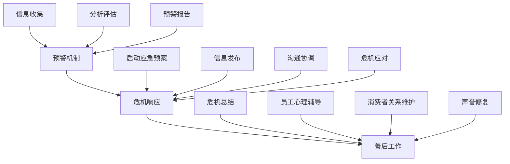

                 

### 文章标题

《领导力与危机公关：维护团队与企业形象的方法》

### 关键词

领导力，危机公关，团队管理，企业形象，沟通策略，决策能力

### 摘要

在快速发展的信息技术时代，企业面临的危机种类繁多，形势瞬息万变。作为企业领导者，如何在危机中保持冷静、有效应对，不仅考验着个人的领导力，也直接关系到企业的生死存亡。本文旨在探讨领导力与危机公关之间的密切关系，从基本概念、策略流程、实际应用等多个维度，详细阐述如何利用领导力来维护团队与企业形象。文章首先定义危机公关和领导力的核心概念，并介绍其基本要素。接着，通过分析常见的危机类型和危机对企业的影响，为制定有效的危机公关策略提供理论基础。随后，文章深入探讨危机公关的具体策略与流程，从预警机制、危机响应到善后工作，提供全面的操作指南。在此基础上，文章重点讲述领导力在危机公关中的应用，包括沟通艺术、决策能力和团队管理。通过解析成功的危机公关案例，读者可以学习到实际操作中的最佳实践。最后，文章从法律法规和伦理角度，探讨了危机公关面临的挑战和未来发展趋势，为领导者提供全面、系统的应对策略。通过本文的阅读，读者将深刻理解领导力在危机公关中的关键作用，掌握维护团队与企业形象的实用方法。

### 引言

#### 1.1 危机公关的定义与重要性

危机公关，是指企业在面临各种突发事件或负面舆论时，通过一系列有计划、有组织的公关活动，来维护企业形象、降低危机影响、恢复公众信任的一门科学。危机公关的重要性体现在多个方面：首先，它能够帮助企业迅速应对突发事件，防止危机扩大化；其次，通过有效的危机公关，企业可以转危为安，甚至化危为机，提升品牌价值和市场竞争力；最后，危机公关有助于增强企业的危机管理能力，使其在未来面对类似事件时更加从容。

在当今信息爆炸的时代，危机公关的作用尤为重要。一方面，互联网和社交媒体的普及，使得信息传播速度极快，企业一旦陷入危机，负面消息可以在短时间内迅速扩散，对企业声誉造成巨大冲击。另一方面，消费者对企业形象的重视程度日益提高，一个负面的新闻事件可能对企业的市场地位和客户信任产生长期的负面影响。因此，企业必须高度重视危机公关，建立完善的危机管理体系，确保在危机爆发时能够迅速反应，有效应对。

#### 1.2 领导力在危机公关中的作用

领导力在危机公关中扮演着至关重要的角色。首先，领导者是企业的核心人物，他们的决策和行动直接影响企业的命运。在危机时刻，领导者必须保持冷静、果断，迅速做出正确决策，为团队树立信心。其次，领导者的沟通能力至关重要。危机公关的核心是信息传递，领导者需要通过有效的沟通，准确、及时地向内部员工和外部公众传递信息，以降低恐慌和误解。此外，领导者的团队管理能力也在危机公关中发挥关键作用。在危机面前，团队需要紧密合作，共同应对挑战，领导者必须善于激发团队的凝聚力和战斗力。

有效的领导力不仅能帮助企业迅速应对危机，还能为企业的长远发展奠定坚实基础。一个具有高度领导力的领导者，能够在危机中保持战略定力，带领团队迎难而上，转危为机。同时，他们的领导风范和应对策略也会成为企业文化的核心部分，影响企业的整体发展和员工的心态。

#### 1.3 书籍结构概述

本文将从以下几个方面对领导力与危机公关进行详细探讨：

1. **领导力与危机公关的基本概念**：介绍领导力和危机公关的核心要素，并阐述它们之间的关系。
2. **危机公关策略与流程**：讲解危机公关策略的制定方法和具体流程，包括预警机制、危机响应和善后工作。
3. **领导力在危机公关中的应用**：探讨领导力在沟通艺术、决策能力和团队管理中的具体应用。
4. **成功的危机公关案例解析**：通过分析实际案例，展示如何在实际操作中运用危机公关策略。
5. **危机公关的法律法规与伦理**：讨论危机公关过程中涉及的法律法规和伦理问题。
6. **危机公关的未来发展趋势**：探讨数字化技术和全球化背景对危机公关的影响。
7. **结论**：总结危机公关与领导力的关系，并对未来进行展望。

通过本文的阅读，读者将全面了解领导力在危机公关中的重要作用，掌握维护团队与企业形象的实用方法。

#### 2.1 领导力的核心要素

领导力是危机公关中不可或缺的核心要素，其成功实施依赖于一系列关键要素。首先，**愿景和目标**是领导力的基石。一个优秀的领导者必须具备远见，能够为团队设定清晰的目标和愿景，激发员工的热情和动力。其次，**沟通能力**是领导者不可或缺的技能。在危机时刻，领导者需要通过有效的沟通，确保信息的准确传递，减少误解和恐慌，同时也能够倾听员工的意见和反馈，增强团队凝聚力。

**决策能力**是领导力的另一个重要方面。在危机中，领导者必须能够快速做出决策，权衡各种利弊，选择最佳方案。这不仅需要领导者具备果断的决策风格，还需要他们具备丰富的经验和知识储备，以便在面对复杂局面时能够做出明智的判断。

**领导风格**也是领导力的重要组成部分。不同的领导风格适用于不同的情境，领导者需要根据实际情况灵活调整自己的领导风格，以最大化团队的绩效。例如，在危机初期，领导者可能需要采取更为果断和强势的领导风格，以确保迅速采取行动；而在危机善后阶段，则可能需要更多关注员工的情感需求和团队建设。

为了更好地理解领导力的核心要素，我们可以通过一个**Mermaid流程图**来展示其各要素之间的联系和作用。

在这个流程图中，愿景和目标是整个领导力体系的起点，它们指导着其他要素的运用和团队的行为。沟通能力是确保信息准确传递和团队协作的关键，而决策能力则决定了在面对危机时能否迅速做出有效应对。领导风格的选择则根据具体情境进行调整，以确保团队能够在压力下保持高效和协调。通过这样的流程图，我们可以清晰地看到各个要素之间的相互作用和依赖关系，从而更好地理解领导力在危机公关中的核心作用。

#### 2.2 危机公关的核心概念

危机公关的核心概念包括预警机制、危机响应和善后工作。首先，**预警机制**是企业危机管理的第一步，其目的是提前发现潜在的风险和危机，以便及时采取措施进行预防和控制。预警机制通常包括对市场动态、消费者反馈、员工投诉等多方面的监测和分析，通过建立信息收集和分析系统，企业能够及时发现异常情况，防止危机的爆发。

其次，**危机响应**是企业在危机发生时的关键环节。危机响应的速度和效果直接关系到危机的严重程度和企业形象的恢复。在危机响应过程中，企业需要迅速启动危机应对计划，包括与相关利益方沟通、制定应对策略、调整运营计划等。例如，当企业产品出现质量问题，企业需要立即召回产品，同时发布公开声明，说明问题原因和处理方案，以最大程度地降低负面影响。

最后，**善后工作**是危机公关的最后一环，其目的是评估危机对企业的影响，修复企业声誉，并防止类似危机再次发生。善后工作包括危机总结、员工心理辅导、消费者关系维护等。通过危机总结，企业可以分析危机产生的原因和应对过程中的不足，为未来的危机管理提供经验教训。同时，通过员工心理辅导和消费者关系维护，企业可以重建公众信任，提升品牌形象。

这些核心概念相互关联，共同构成一个完整的危机公关体系。预警机制为危机响应提供信息基础，危机响应则通过快速行动减轻危机影响，而善后工作则确保危机对企业的影响降到最低，并为未来的风险管理提供保障。

为了更直观地展示这些核心概念之间的关系，我们可以使用一个**Mermaid流程图**来描述：

在这个流程图中，预警机制通过信息收集和分析系统提前发现潜在危机，危机响应则通过制定应对策略和调整运营计划来迅速应对危机，善后工作则通过危机总结、员工心理辅导和消费者关系维护来修复企业声誉。这些环节相互衔接，形成一个完整的危机公关体系，确保企业能够有效应对各种突发事件。

#### 2.2.1 常见危机类型

企业危机类型多种多样，根据其性质和影响范围，可以分为以下几类：

首先，**产品危机**是指企业产品出现质量问题、安全问题或设计缺陷，导致消费者权益受损，从而引发公众关注和媒体报道。例如，某知名手机品牌因电池爆炸问题而召回大量产品，严重影响了品牌形象和市场销售。

其次，**财务危机**是指企业因资金链断裂、财务造假或财务报告问题，导致投资者信心受挫，股价暴跌，甚至可能面临破产风险。例如，某国际知名服装品牌因涉嫌财务造假而被证监会调查，导致股价大幅下跌。

**公关危机**则是指企业因公关活动失败、高管不当言论或与利益相关方发生冲突，导致公众对企业产生负面情绪和不满。例如，某知名餐饮企业因使用过期食材被媒体曝光，引发消费者投诉和舆论压力。

**法律危机**是指企业因违反法律法规，导致面临法律诉讼和处罚。例如，某互联网企业因侵犯用户隐私被用户起诉，并受到监管部门的罚款。

**自然灾害或突发事件**则是指由于自然灾害或其他不可抗力因素，导致企业运营中断或重大财产损失。例如，某沿海企业因台风袭击而造成生产设备严重损坏。

了解这些常见的危机类型，有助于企业提前识别潜在风险，制定针对性的危机应对策略，从而在危机发生时能够迅速反应，有效应对。

#### 2.2.2 危机对企业的影响

危机对企业的影响是多方面且深远的。首先，从**声誉方面**来看，危机事件往往会迅速传播，导致企业声誉受损。无论是产品质量问题、财务造假还是公关失误，都会在公众和媒体中引发负面舆论，影响企业的品牌形象和市场地位。例如，某知名企业的产品因质量问题被召回，虽然公司迅速采取了补救措施，但依然难以完全恢复公众信任，长期影响品牌声誉。

其次，**市场方面**，危机事件会导致消费者信心下降，从而影响企业的市场表现。在产品危机或财务危机中，消费者可能会转向其他品牌，导致市场份额减少，销售额下降。例如，某品牌因财务造假被曝光后，股价暴跌，市场信心受挫，投资者纷纷撤资，进一步加剧了企业的财务困境。

**运营方面**，危机事件常常会中断企业的正常运营。无论是自然灾害导致的工厂停产，还是突发事件引发的安全问题，都会对企业生产经营造成严重影响。例如，某企业在地震中遭受重大财产损失，导致生产线瘫痪，生产周期延长，从而影响整个供应链的稳定性。

最后，**财务方面**，危机事件往往伴随着高额的赔偿费用、诉讼费用和公关费用，对企业的财务状况造成巨大压力。例如，某企业因产品质量问题需要赔偿大量消费者，同时面临高额的法律诉讼费用，使得企业的财务状况急剧恶化。

综上所述，危机对企业的影响是多方面的，企业需要全面评估危机可能带来的风险，并制定有效的危机应对策略，以减轻危机对企业造成的负面影响。

#### 3.1 危机公关策略的制定

危机公关策略的制定是确保企业在危机爆发时能够迅速、有效应对的关键环节。要制定一套行之有效的危机公关策略，首先需要明确危机公关的目标和原则。

**目标**方面，危机公关的核心目标是：

1. **控制危机扩散**：在危机初期，迅速采取措施，防止危机信息的扩散，避免负面舆论蔓延。
2. **修复企业声誉**：通过透明、负责任的沟通，逐步修复企业声誉，重建公众信任。
3. **维护消费者关系**：在危机期间，保持与消费者的沟通，解答疑问，确保消费者的权益得到保护。
4. **恢复运营稳定**：迅速评估危机对企业运营的影响，制定应对措施，恢复企业的正常运营。

**原则**方面，危机公关策略应遵循以下几个基本原则：

1. **及时性**：危机发生时，企业需要迅速反应，尽快发布声明，阐明事实，回应公众关切。
2. **透明性**：信息传递应保持透明，避免隐瞒事实，以免引发更大的误解和恐慌。
3. **一致性**：企业内部和外部沟通要保持一致，避免不同部门或利益相关方发布相互矛盾的信息。
4. **针对性**：根据不同危机类型和具体情境，制定有针对性的应对策略，确保措施的针对性和有效性。

**制定方法**方面，危机公关策略的制定通常包括以下步骤：

1. **危机识别**：首先，企业需要建立危机预警机制，通过持续监控市场动态、消费者反馈、媒体报道等，识别潜在的危机信号。
2. **风险评估**：对识别出的危机进行风险评估，分析危机的可能性、影响范围和严重程度，为后续策略制定提供依据。
3. **策略制定**：根据风险评估结果，制定详细的危机应对策略，包括危机响应、信息发布、媒体沟通、员工安抚等具体措施。
4. **模拟演练**：在策略制定完成后，组织模拟演练，检验策略的有效性，并根据演练结果进行调整和完善。
5. **方案实施**：在危机实际发生时，按照制定的策略迅速行动，确保各项措施得到有效执行。

通过以上步骤，企业可以制定出一套系统化、科学化的危机公关策略，提高应对危机的能力，确保在危机面前能够冷静应对，维护企业声誉和运营稳定。

为了更好地理解危机公关策略的制定过程，我们可以通过一个**Mermaid流程图**来展示：

在这个流程图中，企业首先通过预警机制和多种监控手段识别潜在危机，然后进行风险评估，制定详细的应对策略，并进行模拟演练，最终在危机发生时迅速实施，确保危机得到有效控制。

#### 3.2 危机公关流程详解

危机公关的流程包括预警机制、危机响应和善后工作，每个环节都至关重要，决定了企业能否有效应对危机、降低负面影响。以下是这些环节的详细解析。

**3.2.1 危机预警机制**

预警机制是危机公关的第一道防线，其目的是在危机发生前提前识别和预测潜在的风险。预警机制的建立包括以下几个关键步骤：

1. **信息收集**：企业应建立完善的信息收集系统，包括市场动态、消费者反馈、行业报告、媒体报道等，确保能够及时获取各种信息。
2. **分析评估**：对收集到的信息进行深入分析，识别潜在的风险信号，评估危机的可能性及其可能的影响。
3. **预警报告**：定期生成预警报告，将分析结果和潜在危机通知到相关部门和人员，确保在危机发生前能够采取预防措施。

通过有效的预警机制，企业可以在危机萌芽阶段就采取行动，避免危机的进一步恶化。

**3.2.2 危机响应与处理**

危机响应是危机公关的核心环节，直接关系到企业能否在危机中迅速应对、减少损失。危机响应与处理包括以下几个关键步骤：

1. **启动应急预案**：在确认危机发生时，立即启动应急预案，组织相关部门和人员迅速行动。
2. **信息发布**：及时发布危机声明，向公众和媒体说明危机事实，澄清误解，避免信息真空导致恐慌。
3. **沟通协调**：与利益相关方进行沟通协调，包括内部员工、消费者、投资者、政府部门等，确保信息的准确传递，减少误解和冲突。
4. **危机应对**：根据危机的具体情况，采取相应的应对措施，例如召回问题产品、关闭受影响的生产线、调整运营计划等。

在危机响应过程中，企业需要保持冷静、果断，迅速做出反应，同时确保内部团队的高效协作和外部沟通的透明性。

**3.2.3 危机善后工作**

危机善后工作是危机公关的最后一步，其目的是评估危机对企业的影响，修复企业声誉，防止类似危机再次发生。危机善后工作包括以下几个关键步骤：

1. **危机总结**：对危机发生过程进行总结，分析危机产生的原因、应对过程中的问题及改进措施，为未来的危机管理提供经验教训。
2. **员工心理辅导**：对受危机影响较大的员工进行心理辅导，缓解其心理压力，增强团队凝聚力。
3. **消费者关系维护**：通过多种渠道与消费者保持沟通，解答疑问，提供解决方案，重建消费者信心。
4. **声誉修复**：通过积极沟通、公益行动等手段，逐步修复企业声誉，重建公众信任。

通过有效的善后工作，企业可以最大限度地降低危机对企业造成的负面影响，同时为未来的危机管理积累宝贵经验。

为了更好地理解危机公关的各个流程环节，我们可以通过一个**Mermaid流程图**来展示：

在这个流程图中，预警机制通过信息收集和分析评估，提前识别潜在危机；危机响应通过启动应急预案、信息发布和危机应对，迅速应对危机；善后工作通过危机总结、员工心理辅导、消费者关系维护和声誉修复，确保危机得到全面解决。

通过以上详细的流程解析，企业可以更好地理解危机公关的各个环节，从而在危机面前更加从容应对，维护企业形象和运营稳定。

#### 4.1 领导者的沟通艺术

在危机公关中，领导者的沟通艺术起着至关重要的作用。有效的沟通不仅是信息传递的工具，更是维护团队稳定和重建公众信任的关键。以下将详细探讨沟通在危机公关中的作用以及领导者如何进行有效沟通。

**4.1.1 沟通在危机公关中的作用**

沟通在危机公关中具有以下几个重要作用：

1. **信息传递**：危机发生时，领导者需要迅速、准确地向内部员工和外部利益相关方传递信息，确保信息的透明性和一致性，避免信息真空引发恐慌和误解。
2. **团队协调**：领导者通过有效的沟通，可以协调内部团队，确保各部门和员工在危机中能够高效协作，共同应对挑战。
3. **公众信任**：透明、负责任的沟通有助于重建公众信任，减少危机对企业声誉的长期影响。
4. **危机应对**：良好的沟通有助于制定和实施有效的危机应对策略，确保企业在危机中能够迅速反应，降低损失。

**4.1.2 领导者如何进行有效沟通**

为了进行有效的沟通，领导者应遵循以下几个原则和策略：

1. **明确信息**：在危机中，领导者应确保信息的明确和准确，避免模糊和误导性信息。信息应包括危机事实、应对措施和后续计划。
2. **及时性**：危机发生时，领导者需要迅速发布信息，避免信息滞后引发公众的误解和恐慌。
3. **透明性**：保持信息透明，避免隐瞒事实，以建立公众信任。领导者应公开承认问题的存在，并说明企业正在采取的措施。
4. **一致性**：企业内部和外部沟通应保持一致性，避免不同部门和利益相关方发布相互矛盾的信息。
5. **双向沟通**：鼓励员工和消费者提出疑问和反馈，领导者应积极回应，确保沟通的双向性和互动性。
6. **适当时机**：选择适当的时机发布信息，避免在危机高峰期发布过多的信息，造成信息过载。
7. **情感关怀**：在沟通中，领导者应表现出对员工的关怀和对消费者的尊重，通过情感上的共鸣增强沟通的效果。

**示例**：假设一家知名手机品牌发现其部分产品存在电池安全问题，领导者可以通过以下方式进行有效沟通：

1. **明确信息**：发布公开声明，说明问题电池的具体型号和批次，并提供更换方案。
2. **及时性**：立即启动危机应对计划，通知相关部门和合作伙伴，确保信息传递的及时性。
3. **透明性**：公开承认问题，说明企业正在采取措施解决问题，并邀请第三方机构进行检测。
4. **一致性**：确保内部团队和外部媒体发布的信息一致，避免误导性信息。
5. **双向沟通**：设立热线电话和在线咨询平台，解答消费者的疑问，收集反馈。
6. **适当时机**：在危机初期和解决问题过程中，定期发布更新，避免在高峰期发布过多信息。
7. **情感关怀**：向消费者表达歉意，并提供补偿措施，以增强沟通的亲和力。

通过以上示例，我们可以看到，领导者通过有效的沟通，不仅能够迅速应对危机，还能减少负面影响，重建公众信任。

总之，领导者的沟通艺术在危机公关中至关重要。通过明确信息、及时性、透明性、一致性、双向沟通和情感关怀，领导者可以确保信息的准确传递，维护团队稳定，重建公众信任，从而在危机中保持企业的声誉和运营稳定。

#### 4.2 领导者的决策能力

在危机公关中，领导者的决策能力是决定企业能否有效应对危机、转危为安的关键因素。高效的决策能力不仅要求领导者具备迅速判断和果断行动的能力，还需要他们在复杂多变的环境中做出合理、可行的选择。以下是领导者如何在危机公关中做出正确决策的详细解析。

**4.2.1 决策在危机公关中的重要性**

1. **影响范围**：危机公关中的决策直接关系到企业的声誉、运营和财务状况，错误的决策可能导致危机扩大、企业声誉受损，甚至影响长期发展。
2. **时间紧迫**：危机公关的决策往往需要在极短的时间内做出，领导者需要在有限的信息和资源下迅速做出决策，这要求他们具备快速反应和果断决策的能力。
3. **风险权衡**：领导者需要在多种可能的选择中权衡风险和收益，选择最优方案。这种权衡不仅需要基于事实和数据，还需要结合领导者的经验和直觉。
4. **团队协作**：有效的决策需要领导者和团队成员的共同努力，领导者需要通过沟通和协调，确保决策能够得到团队的支持和执行。

**4.2.2 领导者如何做出正确决策**

为了在危机公关中做出正确决策，领导者应遵循以下步骤和原则：

1. **迅速判断**：在危机发生时，领导者需要迅速判断危机的性质和影响范围，确定应急响应的优先级。例如，判断是产品质量问题、财务问题还是公关失误，并采取相应的应对措施。
2. **信息收集**：领导者应尽快收集相关信息，包括危机的具体情况、潜在的影响、利益相关方的反应等。通过全面的信息收集，领导者可以更准确地评估危机的严重程度，为决策提供依据。
3. **分析评估**：在收集到充分信息后，领导者需要对危机进行详细分析，评估各种应对方案的风险和收益，确定最佳方案。分析评估过程中，领导者应考虑各种可能的后果，包括短期和长期的影响。
4. **沟通协调**：领导者需要与团队成员、利益相关方进行充分沟通，听取各方意见和建议，确保决策能够得到广泛支持。通过沟通协调，领导者可以更全面地了解情况，提高决策的科学性和合理性。
5. **果断行动**：在综合分析评估后，领导者需要迅速做出决策，并果断行动。决策一旦确定，领导者应确保决策能够得到有效执行，避免因犹豫不决而错失最佳时机。
6. **持续监控**：决策实施后，领导者需要持续监控危机的进展和决策的效果，根据实际情况进行调整。如果决策未能达到预期效果，领导者应迅速调整策略，确保危机得到有效控制。

**示例**：假设一家食品公司发现其产品存在食品添加剂超标的问题，领导者可以通过以下步骤做出正确决策：

1. **迅速判断**：确认问题产品，评估其对消费者健康的影响，并判断问题是否涉及产品质量标准。
2. **信息收集**：收集相关数据，包括检测报告、消费者投诉、媒体报道等，了解问题的具体情况。
3. **分析评估**：评估不同应对方案，如立即召回问题产品、与消费者沟通并补偿、公开道歉等，权衡各方案的利弊。
4. **沟通协调**：与内部团队、消费者代表、监管机构等进行沟通，听取各方意见和建议。
5. **果断行动**：决定立即召回问题产品，发布公开声明，向消费者道歉，并承诺采取措施确保产品质量。
6. **持续监控**：持续监控危机进展，及时调整应对措施，确保问题得到彻底解决。

通过以上步骤，领导者可以确保在危机公关中做出正确决策，有效应对危机，维护企业声誉和运营稳定。

总之，领导者的决策能力在危机公关中至关重要。通过迅速判断、信息收集、分析评估、沟通协调、果断行动和持续监控，领导者可以做出科学合理的决策，带领团队有效应对危机，转危为安。

#### 4.3 领导者的团队管理

在危机公关中，领导者的团队管理能力至关重要。有效的团队管理不仅能够确保危机响应的高效执行，还能增强团队的凝聚力和战斗力。以下是领导者如何通过团队管理在危机公关中发挥作用，以及如何激发团队凝聚力。

**4.3.1 团队合作在危机公关中的作用**

1. **协同作战**：危机公关往往需要各部门和员工协同作战，共同应对挑战。有效的团队合作能够确保信息共享、资源整合和行动协调，从而提高危机响应的效率。
2. **资源整合**：团队合作能够将不同部门和个人的专业知识和技能整合起来，形成合力，应对复杂的危机局势。例如，市场部、法务部和技术部的协作，有助于全面应对危机。
3. **快速反应**：在危机中，团队协作能够使企业迅速做出反应，减少决策和执行的时间差，从而降低危机对企业的影响。
4. **员工激励**：团队合作能够激发员工的积极性和创造力，使他们在危机中发挥最大潜力，为企业提供更多的应对方案和解决思路。

**4.3.2 领导者如何激发团队凝聚力**

为了在危机中激发团队凝聚力，领导者应采取以下措施：

1. **明确目标**：领导者应明确团队的目标和任务，确保每个成员都清楚自己的职责和期望，从而形成共同的目标感，增强团队的凝聚力。
2. **有效沟通**：领导者应建立有效的沟通机制，确保团队成员之间的信息畅通，减少误解和矛盾。在危机中，领导者需要及时传达决策和信息，确保团队行动的一致性。
3. **信任建设**：领导者应通过信任建设增强团队成员之间的信任感，例如，通过共同承担责任、互相支持和鼓励，建立良好的团队关系。
4. **激励和奖励**：领导者应适时对团队成员进行激励和奖励，认可他们的努力和贡献，增强团队的动力和归属感。
5. **团队活动**：领导者可以组织团队活动，增强团队之间的交流和互动，例如，团队建设活动、经验分享会等，有助于团队成员建立更紧密的联系。

**示例**：在应对一场突如其来的网络攻击时，一位领导者可以通过以下措施激发团队凝聚力：

1. **明确目标**：明确团队的目标是尽快恢复网络安全，保护用户数据，并减少对公司运营的影响。
2. **有效沟通**：立即召开团队会议，传达危机情况和应对策略，确保每个成员都了解任务和职责。
3. **信任建设**：与团队成员建立信任，鼓励他们互相支持和合作，共同应对挑战。
4. **激励和奖励**：对在危机中表现突出的团队成员给予表彰和奖励，增强团队的动力。
5. **团队活动**：在危机缓解后，组织一次团队建设活动，如聚餐或团建游戏，增强团队成员之间的感情。

通过以上措施，领导者可以激发团队凝聚力，确保团队在危机中高效协作，共同应对挑战。

总之，领导者的团队管理能力在危机公关中至关重要。通过明确目标、有效沟通、信任建设、激励和奖励以及团队活动，领导者可以激发团队凝聚力，确保团队在危机中发挥最大潜力，共同应对挑战。

#### 5.1 案例一：公司产品召回事件

**5.1.1 案例背景与危机分析**

某知名电子产品公司A在生产一批新款智能手机时，发现部分产品的电池存在安全隐患。具体来说，这些电池在充电过程中可能会过热，甚至发生爆炸，对消费者的人身和财产安全构成严重威胁。这一情况迅速引起了消费者的关注，并引起了媒体的大量报道。一时间，消费者对A公司的产品信心大幅下降，市场销售也受到严重影响。

**危机分析**：

1. **产品安全隐患**：这是导致危机的核心问题，直接影响消费者的安全感和信任度。
2. **信息传播速度**：互联网和社交媒体的迅速传播，使危机信息在短时间内迅速扩散，加剧了危机的严重性。
3. **消费者信心受挫**：消费者对A公司的信任度下降，导致购买意愿降低，市场销售下滑。
4. **品牌形象受损**：媒体的广泛报道和消费者的负面评价，使A公司的品牌形象受到严重损害。

**5.1.2 案例处理过程与结果**

面对这一危机，A公司迅速采取了一系列措施：

1. **启动应急预案**：公司立即启动危机应对预案，成立专门的危机应对小组，负责处理此次危机。
2. **发布声明**：A公司通过官方网站、社交媒体和新闻发布会，向公众发布声明，承认电池问题，说明问题原因，并承诺将采取有效措施解决。
3. **召回产品**：公司迅速召回受影响的智能手机，并设立专门的客服热线，解答消费者的疑问，提供退货和更换服务。
4. **透明沟通**：A公司保持与消费者的透明沟通，通过多种渠道发布召回通知、问题解决方案和后续进展，确保信息传递的及时性和透明性。
5. **第三方检测**：公司邀请第三方检测机构对电池进行检测，以证明问题已经得到有效解决，增强消费者的信任。
6. **赔偿措施**：对于受到影响的消费者，公司提供补偿措施，如退款、换货或优惠券等，以缓解消费者的不满情绪。

**结果**：

1. **召回成功**：在A公司迅速、果断的行动下，受影响的智能手机被顺利召回，问题电池得到了妥善处理。
2. **消费者信任恢复**：通过透明、负责任的沟通和有效的赔偿措施，消费者的信任逐渐恢复，购买意愿有所回升。
3. **品牌形象改善**：虽然危机对品牌形象造成了一定影响，但A公司通过积极的危机应对，成功修复了部分受损的品牌形象。

**总结**：

A公司此次产品召回事件的危机处理，展示了良好的危机公关能力和领导力。通过及时、透明、负责任的应对措施，公司不仅成功化解了危机，还恢复了消费者的信任，为今后的品牌发展奠定了基础。此次案例为其他企业提供了宝贵的经验，强调了危机公关中及时性、透明性和责任感的重要性。

#### 5.2 案例二：企业高管丑闻

**5.2.1 案例背景与危机分析**

某知名互联网企业B因一位高管涉嫌性骚扰丑闻而被媒体曝光。事件发生时，这位高管在公司内部享有较高的声誉和权力，其行为严重违反了公司的行为准则和职业道德，引发了广泛关注和强烈反响。事件爆发后，公司股价应声下跌，员工士气低落，消费者对公司的信任度也大幅下降。

**危机分析**：

1. **高管行为失范**：这是导致危机的核心问题，高管的不当行为直接违反了公司文化和职业道德，引发了公众的强烈不满。
2. **信息传播迅速**：由于互联网和社交媒体的广泛传播，事件迅速扩散，吸引了大量媒体和公众的关注。
3. **品牌形象受损**：高管的不当行为严重影响了公司的品牌形象和公众形象，导致消费者对公司的信任度下降。
4. **员工士气受影响**：事件对员工士气造成打击，员工对公司的信任和忠诚度下降，可能导致人才流失。

**5.2.2 案例处理过程与结果**

面对这一危机，B公司迅速采取了一系列措施：

1. **内部调查**：公司立即成立内部调查委员会，对事件进行全面调查，确保事件的真相得到揭露。
2. **公开道歉**：公司高层领导通过新闻发布会和官方网站，向公众和员工公开道歉，承认公司管理不善，并承诺将采取有效措施解决。
3. **惩处责任人**：公司对涉事高管进行了严肃处理，包括解聘、追究法律责任等，以向公众和员工表明公司的决心和态度。
4. **强化企业文化**：公司发布新的行为准则，加强员工职业道德教育，提高员工对职业道德和公司文化的认知。
5. **员工沟通**：公司通过内部邮件、员工会议和匿名反馈平台，与员工进行充分沟通，了解员工对事件的看法和意见，确保员工的情绪得到安抚。
6. **公关宣传**：公司通过多种渠道进行公关宣传，包括新闻发布会、社交媒体互动等，主动回应公众关切，重建公众信任。

**结果**：

1. **内部调查结果公布**：内部调查委员会公布了事件调查结果，对涉事高管进行了严肃处理，增强了员工的信任感。
2. **品牌形象逐步修复**：通过积极的公关宣传和有效的企业文化强化，B公司的品牌形象逐渐得到修复，消费者对公司的信任度有所回升。
3. **员工士气稳定**：员工对公司的信任和忠诚度得到恢复，员工士气稳定，公司运营逐步恢复正常。

**总结**：

B公司应对高管丑闻危机的处理，展示了其强大的危机应对能力和领导力。通过内部调查、公开道歉、惩处责任人、强化企业文化和员工沟通等措施，公司成功化解了危机，恢复了公众和员工的信任。此次案例为其他企业在面对高管丑闻时提供了宝贵的经验，强调了及时、透明和坚决应对危机的重要性。

#### 6.1 危机公关的法律法规

在危机公关过程中，企业不仅需要关注策略和流程的制定，还必须遵守相关的法律法规。这些法律法规旨在规范危机公关行为，保障企业和公众的合法权益，维护社会秩序。

**6.1.1 我国危机公关相关法律法规**

我国针对危机公关的法律框架较为完善，主要包括以下几个方面：

1. **《中华人民共和国广告法》**：该法规定了广告发布的内容和形式，要求广告必须真实、合法，不得误导和欺骗消费者。企业在危机公关中发布的声明和公告，应严格遵守该法的规定，确保信息的真实性。
   
2. **《中华人民共和国反不正当竞争法》**：该法规定了企业不得通过虚假宣传、诋毁竞争对手等不正当手段竞争。企业在危机公关中应避免使用不正当手段，以免触犯法律。

3. **《中华人民共和国产品质量法》**：该法规定了产品质量的基本要求，企业如因产品质量问题引发危机，必须依法承担责任，并采取有效措施进行补救。

4. **《中华人民共和国消费者权益保护法》**：该法规定了消费者的合法权益，企业必须在危机公关中保护消费者的合法权益，如退货、换货、赔偿等。

5. **《中华人民共和国网络安全法》**：该法规定了网络运营者的网络安全责任，企业在应对网络危机时，应确保网络安全，防止数据泄露和网络安全事件的发生。

**6.1.2 国际危机公关法律法规比较**

在国际上，不同国家和地区的危机公关法律法规也有所差异，但总体上都是为了保护消费者权益和维护市场秩序。以下是几个主要国家和地区的法律法规简述：

1. **美国**：《联邦贸易委员会法》和《消费者保护法》是美国危机公关的主要法律依据。企业需确保信息透明、真实，不得误导消费者。同时，美国的《紧急事件管理法》也对危机应对提出了具体要求。

2. **欧洲**：欧洲的《一般数据保护条例》（GDPR）对数据保护提出了严格的要求。企业在应对数据泄露危机时，必须遵守GDPR的规定，及时报告和采取措施，以保护消费者的隐私权益。

3. **日本**：《日本消费者保护法》和《企业社会责任法》是日本危机公关的主要法律依据。企业需在危机公关中注重社会责任，积极应对消费者关切，采取有效措施防止类似事件再次发生。

了解和遵守相关法律法规，不仅有助于企业在危机公关中避免法律风险，还能增强企业的公信力和形象。企业在制定危机公关策略时，应充分考虑法律法规的要求，确保所有行动都在法律允许的范围内进行。

#### 6.2 危机公关的伦理问题

在危机公关中，伦理问题同样至关重要，它不仅影响企业的声誉，还关系到企业的长期可持续发展。危机公关过程中的道德准则是企业必须坚守的原则，而在面临伦理困境时，企业应采取的应对策略也是关键。

**6.2.1 危机公关中的道德准则**

1. **透明性**：企业应在危机公关中保持信息的透明性，不隐瞒事实，及时向公众和利益相关方披露相关信息，以建立和维护信任。
2. **诚实性**：企业应诚实面对危机，不夸大问题，不虚假宣传，确保信息的真实性，避免误导公众。
3. **责任感**：企业应对危机负有责任感，积极采取措施解决问题，保护消费者的合法权益，不逃避责任。
4. **公正性**：企业应公平对待所有利益相关方，不偏袒任何一方，确保决策的公正性和合理性。
5. **保护隐私**：在危机公关过程中，企业应尊重和保护个人隐私，不泄露无关信息，避免侵犯消费者的隐私权。

**6.2.2 伦理困境与应对策略**

在危机公关中，企业可能会面临多种伦理困境，以下是一些常见的伦理困境及其应对策略：

1. **隐瞒事实**：当危机涉及潜在的法律责任或经济损失时，企业可能会考虑隐瞒事实，以避免立即的负面影响。应对策略：企业应坚持透明性原则，即使短期内可能会面临负面影响，也应诚实面对问题，公开披露信息，以赢得公众的信任。

2. **利益冲突**：在处理危机时，企业可能会面临内部利益冲突，例如高管或员工的个人利益与公司利益发生冲突。应对策略：企业应建立独立的危机应对委员会，确保决策的客观性和公正性，避免利益冲突。

3. **资源分配**：在危机中，企业需要合理分配资源，例如在召回产品、赔偿消费者等方面，可能会面临资源不足的困境。应对策略：企业应优先保障消费者的安全和权益，通过合理的资源调配，确保危机得到有效控制。

4. **社会责任**：企业在危机中可能需要承担一定的社会责任，如对受影响的社区进行补偿。应对策略：企业应积极履行社会责任，通过公益行动和社会责任报告，展示企业的社会责任感，增强公众信任。

5. **媒体与公众压力**：在危机中，媒体和公众可能会对企业施加巨大压力，要求企业立即采取措施。应对策略：企业应保持冷静，遵循道德准则，不因外部压力而采取不合理或短期行为的决策，确保措施的长期有效性。

通过遵守道德准则和有效应对伦理困境，企业不仅能够维护自身声誉，还能为社会的和谐与可持续发展做出贡献。危机公关的伦理问题需要企业持续关注和改进，以确保企业在快速变化的市场环境中保持竞争优势。

#### 7.1 数字化技术在危机公关中的应用

在当今数字化时代，数字化技术已经深刻改变了危机公关的运作方式，为企业和领导者提供了更加高效、精准的工具和策略。以下将探讨数字化技术，特别是社交媒体、大数据和人工智能，在危机公关中的应用。

**7.1.1 社交媒体在危机公关中的作用**

社交媒体平台如微博、微信、Facebook、Twitter等，已经成为危机公关的重要工具。它们具有以下几个显著作用：

1. **信息传播速度**：社交媒体的信息传播速度极快，使得企业能够在危机初期能够迅速发布信息，减少信息真空，防止谣言扩散。
2. **公众互动**：通过社交媒体，企业可以直接与公众互动，了解他们的关切和意见，从而更有效地回应和解决问题。
3. **舆论监测**：社交媒体平台上的讨论和评论可以帮助企业实时监测公众情绪和舆论趋势，及时调整公关策略。
4. **危机预警**：社交媒体上的信息可以帮助企业提前识别潜在危机，及时采取预防措施，避免危机扩大。

**示例**：某知名品牌在发现产品存在安全隐患后，立即通过微博和微信发布官方声明，澄清事实，并通过社交媒体与消费者进行互动，解答疑问，有效控制了危机的扩散。

**7.1.2 大数据与人工智能在危机公关中的应用**

大数据和人工智能技术为危机公关提供了强大的数据分析能力和智能决策支持。以下是它们的主要应用：

1. **数据分析**：通过大数据分析，企业可以快速收集和处理大量危机相关信息，识别危机的根源和影响范围，为决策提供依据。
2. **智能监控**：人工智能技术可以自动监测社交媒体和新闻媒体，识别负面信息，预警危机，提高危机管理的效率。
3. **预测模型**：利用大数据和人工智能技术，企业可以建立预测模型，预测危机的可能发展趋势，提前制定应对策略。
4. **智能响应**：基于人工智能的自动化系统可以迅速生成危机响应方案，提供决策建议，帮助企业快速、准确地应对危机。

**示例**：某互联网企业利用大数据和人工智能技术，实时监控网络舆情，识别潜在的危机信号，并通过智能分析系统生成应急响应方案，成功避免了多起危机事件。

**总结**：

数字化技术为危机公关带来了革命性的变化，使企业能够更加迅速、精准地应对危机。通过社交媒体的快速传播、大数据的深入分析和人工智能的智能决策，企业可以更加有效地维护企业形象，减少危机的负面影响。随着技术的不断进步，数字化技术将在危机公关中发挥越来越重要的作用，成为企业领导者不可或缺的工具。

#### 7.2 全球化背景下的危机公关

在全球化背景下，企业的运营和影响力已经跨越国界，这使得危机公关面临更加复杂和多样化的挑战。以下将探讨国际化企业在危机公关中面临的挑战与机遇，并分析文化差异对危机公关的影响。

**7.2.1 国际化企业危机公关的挑战与机遇**

**挑战**：

1. **文化差异**：不同国家和地区有着不同的文化背景和社会价值观，这可能导致危机公关策略在不同市场中的适用性差异。国际化企业需要深入了解目标市场的文化特点，以制定符合当地文化需求的公关策略。
2. **法律法规差异**：不同国家和地区的法律法规对危机公关的要求有所不同，国际化企业需要遵守当地的法律规定，避免因违反法律法规而进一步扩大危机。
3. **语言障碍**：语言的差异可能影响信息传递的准确性，国际化企业需要在多语言环境中进行有效的沟通，确保信息的准确性和一致性。
4. **时区差异**：不同国家和地区的时区差异可能影响危机公关的时效性，国际化企业需要合理安排沟通和响应时间，确保危机能够得到及时、有效的处理。

**机遇**：

1. **全球化视野**：国际化企业具有更广泛的视野和资源，可以在危机公关中利用全球资源，调动不同地区的团队和资源，形成合力，提高危机应对的效率。
2. **跨文化交流**：国际化企业可以利用跨文化交流的机会，提升品牌形象，增强公众的信任感和认同感。
3. **多元化经验**：国际化企业可以借鉴不同市场的成功经验，优化自身的危机公关策略，提高整体危机管理能力。
4. **国际化合作**：国际化企业可以与不同国家的媒体、政府和利益相关方建立合作关系，形成多方协调的危机应对机制，提高危机公关的效果。

**7.2.2 文化差异对危机公关的影响**

文化差异对危机公关的影响体现在以下几个方面：

1. **沟通方式**：不同文化背景下，人们的沟通方式和偏好有所不同。例如，某些文化强调间接沟通和委婉表达，而另一些文化则更加直接和坦率。国际化企业需要根据不同文化的沟通特点，调整沟通策略，确保信息传递的准确性和有效性。
2. **危机管理理念**：不同文化对危机管理的理念和方法有所不同。例如，某些文化注重集体主义，强调团队协作和集体决策，而另一些文化则更加注重个人主义和自主决策。国际化企业需要尊重不同文化的管理理念，灵活调整危机管理策略。
3. **公众反应**：不同文化背景下，公众对危机的反应和态度也有所差异。某些文化可能更加宽容和理性，而另一些文化则可能更加情绪化和极端。国际化企业需要了解目标市场的公众反应，采取有针对性的公关策略，以最大程度地减少危机的负面影响。
4. **法律法规**：不同文化背景下，法律法规对危机公关的要求和处罚标准也有所不同。国际化企业需要了解和遵守当地的法律规定，确保危机公关活动的合法性和合规性。

**示例**：

假设某国际化品牌在中国市场面临产品召回危机，需要采取以下措施：

1. **文化适应性**：了解中国文化的沟通特点和公众反应，采取更加委婉和真诚的沟通方式，确保信息的准确传达。
2. **法律法规遵守**：了解中国的法律法规，确保召回措施符合法律规定，避免因违规操作而进一步扩大危机。
3. **多元化团队**：组建包括中外员工的多元化团队，共同应对危机，充分利用不同文化的优势，提高危机应对的效率。
4. **跨文化沟通**：通过多语言沟通渠道，确保信息在不同语言环境中的准确传达，避免因语言障碍导致的误解和冲突。

通过以上措施，国际化企业可以更有效地应对全球化背景下的危机公关挑战，抓住机遇，提升品牌形象和市场竞争力。

综上所述，全球化背景下的危机公关既面临挑战，也蕴含机遇。国际化企业需要深入了解文化差异，灵活调整公关策略，充分利用全球化视野和资源，以应对复杂的危机局势，维护企业声誉和市场地位。

#### 8.1 危机公关与领导力的关系

危机公关与领导力之间的密切关系在于，领导力是危机公关成功实施的核心驱动力。在危机爆发时，领导者的决策能力、沟通技巧和团队管理能力决定了企业的应对效率和效果。首先，**决策能力**是领导者应对危机的关键。在危机中，领导者需要迅速做出合理、果断的决策，选择最优的应对方案。这种决策能力不仅源于领导者的经验，还依赖于他们对市场、法规和内部运营的深刻理解。其次，**沟通技巧**是领导者引导公众和员工信任的关键。通过清晰、透明和及时的沟通，领导者可以有效传递信息，缓解恐慌情绪，增强团队的凝聚力和战斗力。最后，**团队管理能力**是领导者确保危机应对措施有效执行的基础。领导者需要激发团队潜能，协调各部门和员工的合作，形成合力，共同应对危机。

总之，危机公关的成功离不开强有力的领导力支持。一个具备高度领导力的领导者，能够在危机中保持冷静、果断，带领团队迅速应对，转危为安，从而维护企业的声誉和运营稳定。

#### 8.2 未来展望与建议

随着全球化进程的加速和数字化技术的广泛应用，危机公关将面临新的挑战和机遇。未来，危机公关将呈现以下几个发展趋势：

**1. 数字化技术应用更加广泛**：大数据和人工智能技术将在危机预警、舆情监测、决策支持等方面发挥更大作用，提高危机公关的效率和精准度。

**2. 跨国合作与文化交流**：国际化企业在全球市场中运营，需要更加注重跨国合作和跨文化交流，以适应不同国家和地区的文化背景和法律法规。

**3. 社交媒体的主导地位**：社交媒体将继续成为危机公关的重要平台，企业需要更加重视社交媒体的管理和利用，确保信息传递的快速、准确和有效。

**4. 透明性与社会责任**：未来，企业将更加注重危机公关的透明性和社会责任，积极回应公众关切，展示企业的诚信和责任感。

针对这些趋势，以下是一些建议：

**1. 提升数字化能力**：企业应积极引进和应用大数据、人工智能等先进技术，建立智能化的危机预警和管理系统。

**2. 强化跨文化培训**：国际化企业应加强跨文化培训，提高员工的跨文化沟通能力和适应能力。

**3. 建立完善的危机公关机制**：企业应建立完善的危机公关机制，包括危机预警、响应、善后等各个环节，确保在危机发生时能够迅速反应。

**4. 注重社会责任**：企业应积极履行社会责任，通过公益活动和社会责任报告，展示企业的社会担当，增强公众信任。

总之，未来危机公关将更加依赖于数字化技术和跨文化交流，企业需要不断创新和适应，才能在激烈的市场竞争中立于不败之地。

