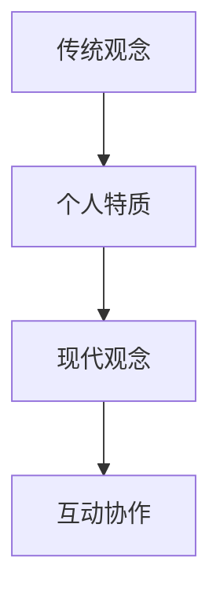
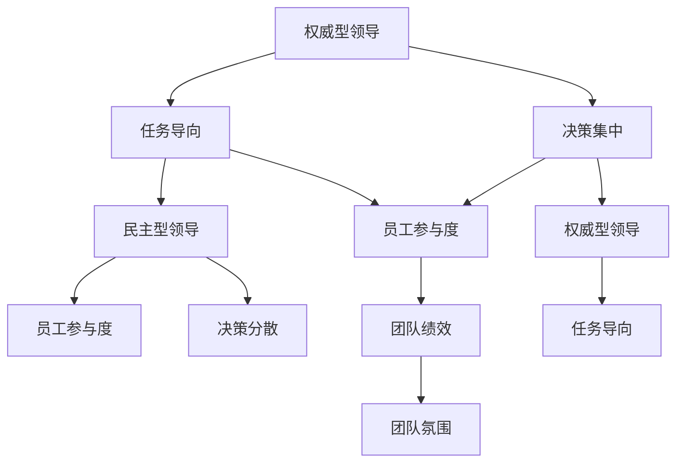
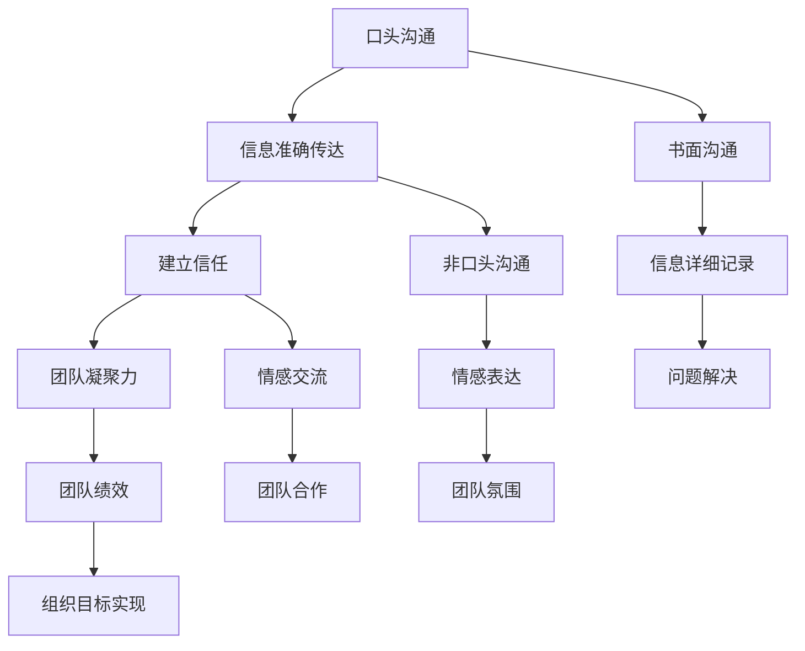
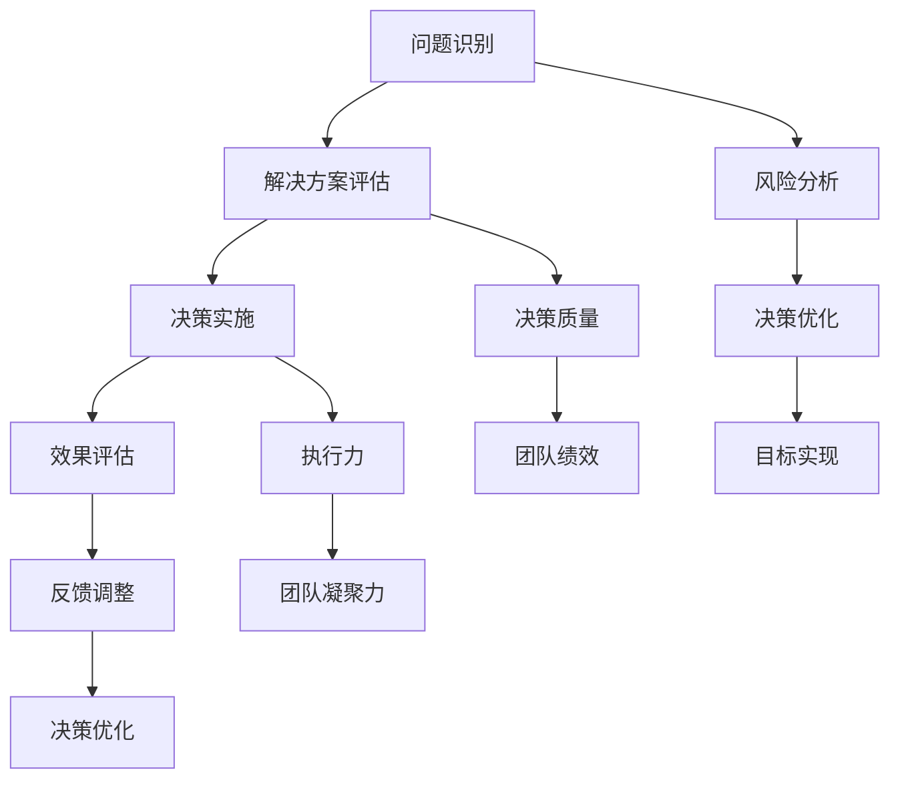
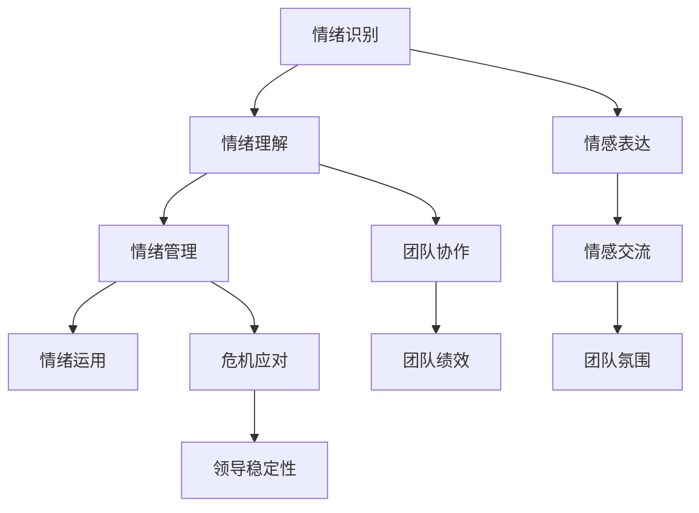
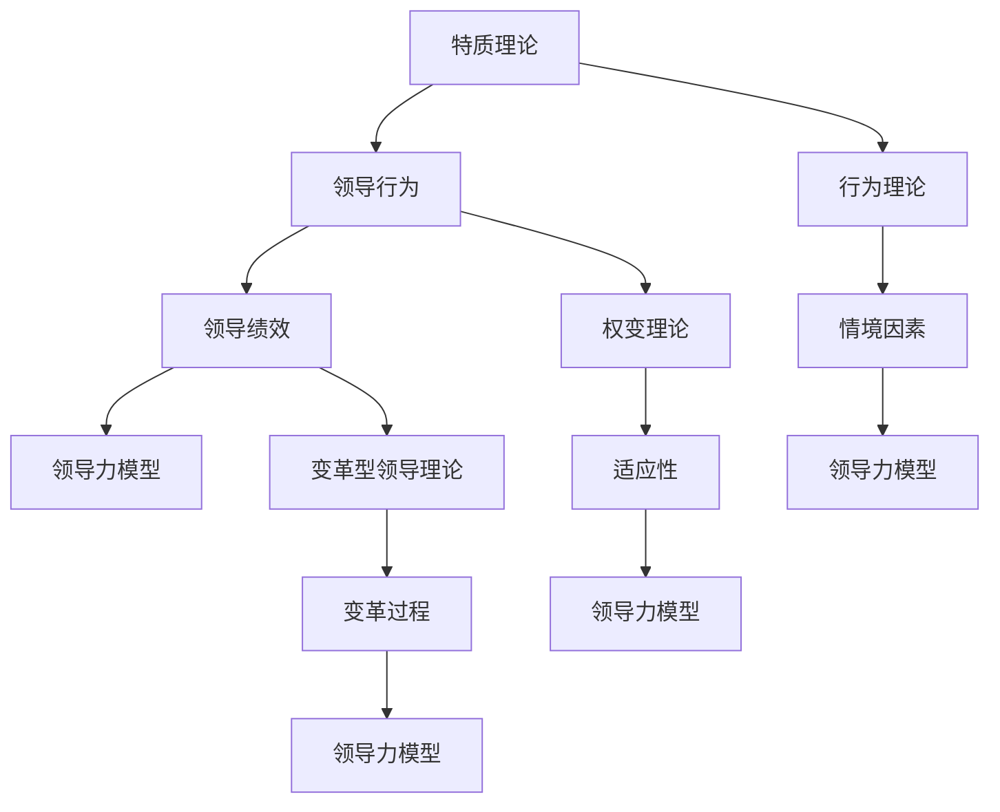
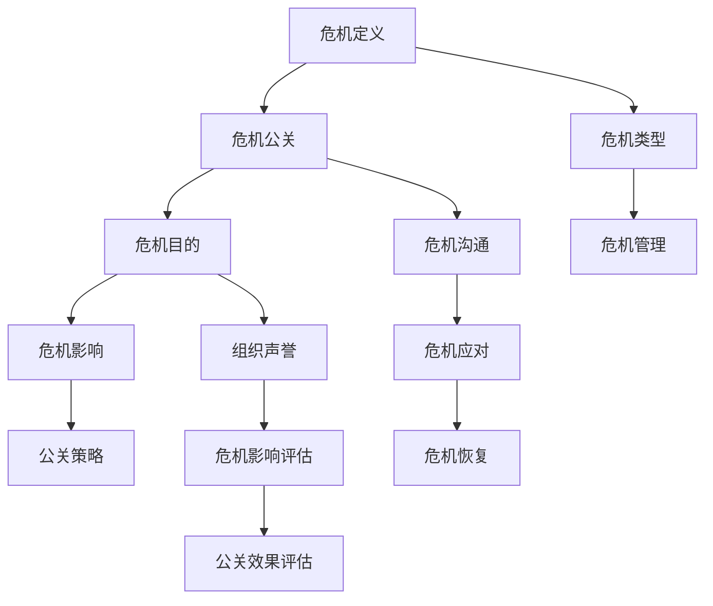
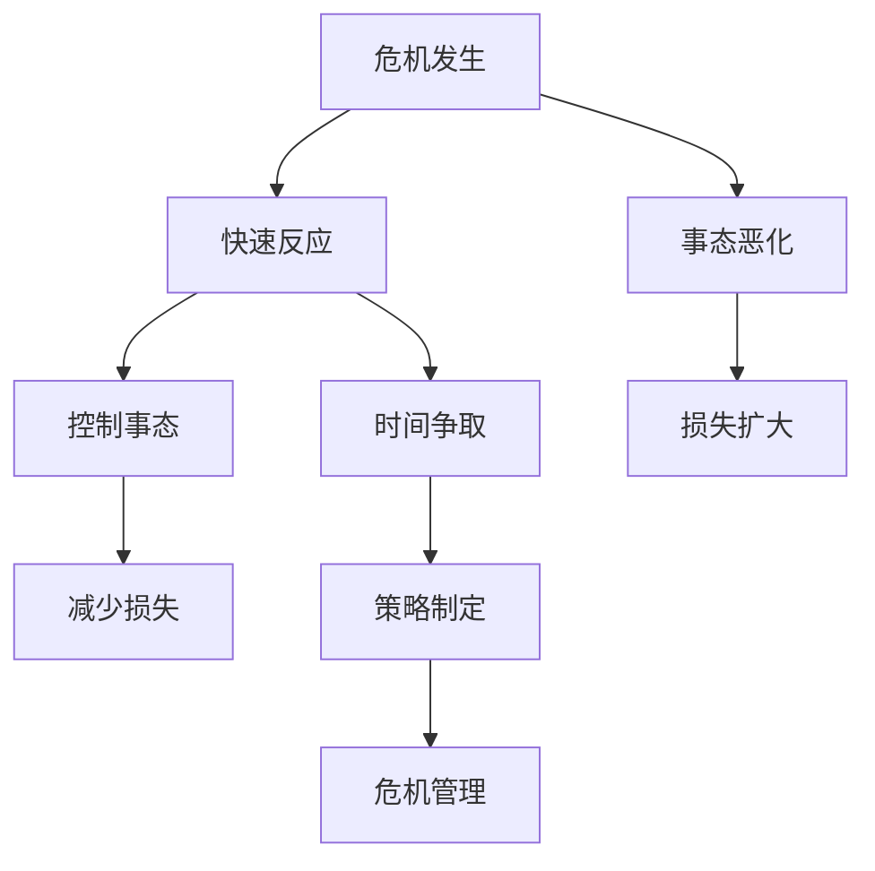
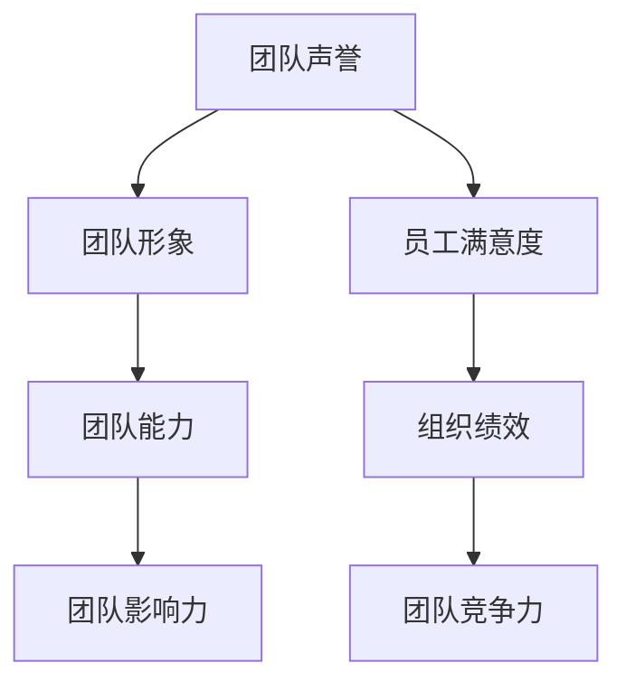

                 

## 文章标题：领导力与危机公关：维护团队声誉

### 关键词：
- 领导力
- 危机公关
- 团队声誉
- 算法原理
- 数学模型
- 实战案例

### 摘要：
本文将深入探讨领导力与危机公关在维护团队声誉方面的关键作用。通过分析领导力的核心要素和领导力模型，我们将了解如何在危机中保持团队的稳定与凝聚力。此外，本文还将详细阐述危机公关的策略、危机应对技巧以及团队声誉管理的方法。通过一系列的实际案例和项目实战，我们将理解如何在复杂的环境中维护团队声誉，提供实用的最佳实践建议。本文旨在为IT领域的专业人士提供一套完整的指导框架，帮助他们有效地应对危机，提升团队的整体声誉。

## 第一部分：领导力概述

### 第1章 领导力基础

#### 1.1 领导力的定义与重要性

##### 1.1.1 领导力的定义
领导力是一种能够激励和引导他人共同实现目标的能力。它不仅仅是权力和地位的象征，更是一种个人素质和技能的综合体现。传统观念中，领导力被视为领导者个人的特质和能力，如勇敢、果断、智慧等。而现代领导力理论则认为，领导力是一个动态的过程，涉及到领导者与团队成员之间的互动和协作。

**核心概念与联系流程图：**


在传统观念中，领导力主要关注领导者的个人特质和能力，这些特质被认为是领导成功的关键因素。然而，现代观念则认为，领导力更多地依赖于领导者与团队成员之间的互动和协作。这种互动和协作不仅能够提高团队的绩效，还能够增强团队的凝聚力。

**伪代码阐述：**
```python
# 传统观念中的领导力
def traditional_leadership():
    # 领导者的特质
    traits = ["勇敢", "果断", "智慧"]
    # 评估领导者的特质
    evaluate_traits(traits)
    # 实现领导目标
    implement_goals()

# 现代观念中的领导力
def modern_leadership():
    # 领导者与团队成员的互动
    interaction = "协作与沟通"
    # 评估互动效果
    evaluate_interaction(interaction)
    # 实现领导目标
    implement_goals()
```

##### 1.1.2 领导力的重要性
领导力在个人、团队和组织层面上都具有重要的价值。

**个人层面的价值：**
- 提升个人影响力：通过有效的领导力，个人能够更好地影响他人，实现个人目标。
- 增强自信心：有效的领导力能够增强个人的自信心，提升自我价值感。

**团队层面的价值：**
- 提高团队绩效：领导力能够激发团队成员的潜能，提高团队的协作效率。
- 增强团队凝聚力：领导力能够增强团队成员之间的信任和合作，提升团队的整体凝聚力。

**组织层面的价值：**
- 提升组织竞争力：领导力能够推动组织的创新和发展，提升组织的竞争力。
- 维护组织声誉：领导力能够有效地应对危机，维护组织的声誉。

**伪代码阐述：**
```python
# 个人层面的价值
def personal_value_of_leadership():
    # 提升个人影响力
    increase_influence()
    # 增强自信心
    enhance_self_esteem()

# 团队层面的价值
def team_value_of_leadership():
    # 提高团队绩效
    improve_team_performance()
    # 增强团队凝聚力
    enhance_team_cohesion()

# 组织层面的价值
def organizational_value_of_leadership():
    # 提升组织竞争力
    increase_organizational_competitiveness()
    # 维护组织声誉
    maintain_organizational_reputation()
```

#### 1.2 领导力的核心要素

##### 1.2.1 领导风格
领导风格是指领导者如何行使权力、指导团队和影响他人的方式。不同的领导风格会对团队的绩效和氛围产生不同的影响。

**核心概念与联系流程图：**


权威型领导风格通常以任务为导向，决策集中，强调领导者的权威和决策的效率。这种风格在应对紧急情况和需要迅速行动的场景中效果较好。然而，过度依赖权威型领导可能导致团队成员的参与度低，影响团队的长期绩效。

民主型领导风格则强调员工的参与和决策的分散，以员工参与度为导向。这种风格能够提高团队成员的满意度和参与度，增强团队的凝聚力。然而，在需要迅速决策和行动的紧急情况下，民主型领导风格可能不够高效。

**伪代码阐述：**
```python
# 权威型领导
def authoritative_leadership():
    # 任务导向
    task oriented
    # 决策集中
    centralized decision-making

# 民主型领导
def democratic_leadership():
    # 员工参与度
    employee involvement
    # 决策分散
    decentralized decision-making
```

##### 1.2.2 沟通能力
沟通能力是领导力的核心要素之一。有效的沟通不仅能够确保信息的准确传达，还能够建立信任和增强团队的凝聚力。

**核心概念与联系流程图：**


口头沟通是领导力中最常用的沟通方式，它能够快速传达信息，解决紧急问题。然而，口头沟通也可能存在信息传达不准确的问题，尤其是在复杂或敏感的信息交流中。

书面沟通则提供了详细信息记录和问题解决的可能性。通过书面文档，团队成员可以清楚地了解任务要求、目标期望和问题解决方案。

非口头沟通，如肢体语言、面部表情和语调，也是沟通能力的重要组成部分。这些非言语沟通方式能够补充和强化口头和书面沟通的效果，帮助建立信任和增强团队氛围。

**伪代码阐述：**
```python
# 口头沟通
def verbal_communication():
    # 信息准确传达
    accurate_information_transmission
    # 解决紧急问题
    urgent_issue_resolution

# 书面沟通
def written_communication():
    # 信息详细记录
    detailed_information_recording
    # 问题解决
    problem_resolution

# 非口头沟通
def non_verbal_communication():
    # 情感表达
    emotional_expression
    # 建立信任
    trust_building
    # 增强团队氛围
    enhance_team_atmosphere
```

##### 1.2.3 决策能力
决策能力是领导者必须具备的重要技能。有效的决策不仅能够解决当前问题，还能够为团队的长期发展提供方向。

**核心概念与联系流程图：**


问题识别是决策过程的第一步，它要求领导者能够准确地识别问题的本质和关键因素。

解决方案评估是对不同方案进行评估和比较的过程，它要求领导者具备分析问题和评估方案的能力。

决策实施是将决策转化为具体行动的过程，它要求领导者具备执行力和组织协调能力。

效果评估是对决策结果进行评估和反馈的过程，它能够帮助领导者了解决策的有效性和不足之处，为后续的决策优化提供依据。

**伪代码阐述：**
```python
# 问题识别
def problem_identification():
    # 识别问题
    identify_problem
    # 确定关键因素
    determine_key_factors

# 解决方案评估
def solution_evaluation():
    # 评估解决方案
    evaluate_solutions
    # 选择最佳方案
    select_best_solution

# 决策实施
def decision_implementation():
    # 实施决策
    implement_decision
    # 组织协调
    organize Coordination

# 效果评估
def effectiveness_evaluation():
    # 评估决策效果
    evaluate_decision_effects
    # 调整反馈
    adjust_feedback
```

##### 1.2.4 情绪智力
情绪智力是指个体识别、理解、管理和运用情绪的能力。在领导力中，情绪智力能够帮助领导者更好地处理复杂的人际关系，提升领导效果。

**核心概念与联系流程图：**


情绪识别是指能够准确感知自己和他人的情绪状态。

情绪理解是指能够理解情绪背后的原因和含义。

情绪管理是指能够有效地调节自己的情绪，保持情绪的稳定。

情绪运用是指能够利用情绪来激励和引导团队成员。

**伪代码阐述：**
```python
# 情绪识别
def emotional_identification():
    # 识别情绪
    identify_emotions
    # 分析情绪
    analyze_emotions

# 情绪理解
def emotional_understanding():
    # 理解情绪
    understand_emotions
    # 解释情绪
    explain_emotions

# 情绪管理
def emotional_management():
    # 调节情绪
    regulate_emotions
    # 保持稳定
    maintain_stability

# 情绪运用
def emotional_application():
    # 激励团队
    motivate_team
    # 引导行为
    guide_behavior
```

### 第2章 领导力模型与理论

#### 2.1 领导力模型概述

##### 2.1.1 领导力模型的作用
领导力模型是一种理论工具，用于帮助人们理解和应用领导力。它通过将复杂的领导现象简化为几个关键要素，为领导实践提供了指导。

**核心概念与联系流程图：**


特质理论主要关注领导者的个人特质如何影响领导效果。

行为理论则侧重于领导者的行为模式及其对团队绩效的影响。

权变理论强调领导行为应根据不同情境进行调整。

变革型领导理论关注领导者在推动组织变革中的作用。

**伪代码阐述：**
```python
# 特质理论
def trait_theory():
    # 识别领导者特质
    identify_leader_traits
    # 评估特质对绩效的影响
    evaluate_impact_on_performance

# 行为理论
def behavior_theory():
    # 观察领导者行为
    observe_leader_behavior
    # 分析行为对团队绩效的影响
    analyze_impact_on_team_performance

# 权变理论
def contingency_theory():
    # 识别不同情境
    identify_different_situations
    # 调整领导行为
    adjust_leader_behavior

# 变革型领导理论
def transformational_leadership_theory():
    # 确定变革目标
    determine_transformational_goals
    # 推动变革过程
    drive_transformational_process
```

##### 2.1.2 主流领导力模型

主流领导力模型包括特质理论、行为理论、权变理论和变革型领导理论。

**特质理论：**
特质理论认为，领导者的个人特质是影响领导效果的关键因素。这种理论强调领导者需要具备某些固有的特质，如聪明、自信、勇敢等。

**行为理论：**
行为理论关注领导者的行为模式。它认为，领导者的行为对团队绩效有直接影响，领导者应该通过特定的行为来激励和引导团队成员。

**权变理论：**
权变理论强调领导行为应根据不同情境进行调整。领导者需要根据具体情境选择最合适的领导风格和行为。

**变革型领导理论：**
变革型领导理论关注领导者在推动组织变革中的作用。这种理论认为，领导者应该能够激发团队成员的潜能，推动组织实现变革。

**伪代码阐述：**
```python
# 特质理论
def trait_theory():
    # 确定领导者特质
    identify_leader_traits
    # 评估特质对团队绩效的影响
    evaluate_impact_on_team_performance

# 行为理论
def behavior_theory():
    # 观察领导者行为
    observe_leader_behavior
    # 分析行为对团队绩效的影响
    analyze_impact_on_team_performance

# 权变理论
def contingency_theory():
    # 识别不同情境
    identify_different_situations
    # 调整领导行为
    adjust_leader_behavior

# 变革型领导理论
def transformational_leadership_theory():
    # 确定变革目标
    determine_transformational_goals
    # 推动变革过程
    drive_transformational_process
```

##### 2.1.3 领导力模型应用案例

以下是几个领导力模型在不同情境下的应用案例。

**特质理论案例分析：**
在一家初创公司中，创始人具备聪明、自信和创新的特质。这些特质帮助他在团队中树立了权威，激发了团队成员的创新能力，推动了公司的快速发展。

**行为理论案例分析：**
在一家大公司中，领导者通过定期召开会议、发布任务目标和提供反馈来激励团队成员。这些行为模式提高了团队的工作效率和绩效。

**权变理论案例分析：**
在一家面临市场变化的公司中，领导者根据市场状况调整了领导风格，从原先的指令型转向了更为合作的模式。这种调整帮助公司迅速适应市场变化，保持了竞争力。

**变革型领导理论案例分析：**
在一家传统制造企业中，领导者推动了数字化转型和流程优化。他通过激发员工的创新思维和提供持续培训，成功地推动了组织的变革，提升了企业的竞争力。

**伪代码阐述：**
```python
# 特质理论案例分析
def trait_theory_case_study():
    # 确定创始人特质
    identify_founder_traits
    # 分析特质对团队绩效的影响
    analyze_impact_on_team_performance
    # 推动公司发展
    drive_company_growth

# 行为理论案例分析
def behavior_theory_case_study():
    # 观察领导者行为
    observe_leader_behavior
    # 分析行为对团队绩效的影响
    analyze_impact_on_team_performance
    # 提高团队效率
    improve_team_efficiency

# 权变理论案例分析
def contingency_theory_case_study():
    # 识别市场变化
    identify_market_changes
    # 调整领导风格
    adjust_leadership_style
    # 适应市场变化
    adapt_to_market_changes

# 变革型领导理论案例分析
def transformational_leadership_case_study():
    # 确定变革目标
    determine_transformational_goals
    # 推动数字化转型
    drive_digital_transformation
    # 提升企业竞争力
    improve_company_competitiveness
```

### 第二部分：危机公关策略

#### 3.1 危机公关概述

##### 3.1.1 危机公关的定义与目的
危机公关是指组织在面临重大危机时采取的一系列策略和措施，以减轻危机对组织的负面影响，维护组织声誉和形象。危机公关的目的是迅速应对危机，控制事态发展，最大限度地减少损失。

**核心概念与联系流程图：**


**伪代码阐述：**
```python
# 危机定义
def crisis_definition():
    # 定义危机
    define_crisis
    # 确定危机类型
    identify_crisis_type

# 危机公关
def crisis_communication():
    # 制定公关策略
    develop_communication_strategy
    # 进行危机沟通
    perform_crisis_communication

# 危机目的
def crisis_objectives():
    # 减轻危机影响
    reduce_crisis_impact
    # 维护组织声誉
    maintain_organization_reputation

# 危机影响评估
def crisis_impact_evaluation():
    # 评估危机影响
    evaluate_crisis_impact
    # 评估公关效果
    evaluate_public_relations_effects
```

##### 3.1.2 危机公关的要素
危机公关成功的关键在于以下几个方面：

- **危机预防：** 通过定期培训和风险识别，提前准备危机应对计划。
- **危机沟通：** 及时、透明、一致地与内部和外部利益相关者沟通，传递准确信息。
- **危机应对：** 快速采取行动，控制事态发展，减轻危机影响。
- **危机恢复：** 在危机结束后，通过重建信任和改善组织形象，恢复组织的声誉。

**伪代码阐述：**
```python
# 危机预防
def crisis_prevention():
    # 定期培训
    regular_training
    # 风险识别
    risk_identification

# 危机沟通
def crisis_communication():
    # 及时沟通
    timely_communication
    # 透明沟通
    transparent_communication
    # 一致沟通
    consistent_communication

# 危机应对
def crisis_response():
    # 快速行动
    rapid_action
    # 控制事态
    control_situation
    # 减轻影响
    reduce_impact

# 危机恢复
def crisis_recovery():
    # 重建信任
    rebuild_trust
    # 改善形象
    improve_image
    # 恢复声誉
    restore_reputation
```

##### 3.1.3 危机公关的核心原则
危机公关的核心原则包括以下几方面：

- **迅速响应：** 在危机发生的第一时间，迅速采取行动，以控制事态发展。
- **透明沟通：** 与利益相关者保持开放、透明的沟通，确保信息一致性和准确性。
- **内部统一：** 确保组织内部各部门和员工之间的信息一致，形成统一的应对策略。
- **专业支持：** 寻求专业公关团队和法律顾问的支持，确保危机处理的合法性和有效性。

**伪代码阐述：**
```python
# 迅速响应
def rapid_response():
    # 第一时间行动
    immediate_action
    # 控制事态发展
    control_situation

# 透明沟通
def transparent_communication():
    # 开放沟通
    open_communication
    # 一致信息
    consistent_information
    # 准确传递
    accurate_transmission

# 内部统一
def internal_unification():
    # 信息一致
    information_unification
    # 应对策略
    response_strategy

# 专业支持
def professional_support():
    # 公关团队
    public_relations_team
    # 法律顾问
    legal_advisor
```

#### 3.2 危机公关策略

##### 3.2.1 危机预防
危机预防是危机公关的重要组成部分。通过以下措施，组织可以减少危机发生的可能性：

- **风险评估：** 定期进行风险评估，识别潜在危机。
- **预案制定：** 制定详细的危机应对预案，明确责任人和行动步骤。
- **员工培训：** 定期对员工进行危机应对培训，提高他们的危机意识和处理能力。

**伪代码阐述：**
```python
# 风险评估
def risk_evaluation():
    # 识别潜在危机
    identify_potential_crisis
    # 分析危机影响
    analyze_impact

# 预案制定
def contingency_plan():
    # 制定应对预案
    develop_contingency_plan
    # 明确责任人
    assign_responsible_persons

# 员工培训
def employee_training():
    # 定期培训
    regular_training
    # 提高危机意识
    improve_crisis_awareness
    # 提升处理能力
    enhance_handling_ability
```

##### 3.2.2 危机沟通
危机沟通是危机公关的核心环节。通过以下措施，组织可以有效地管理危机沟通：

- **信息发布：** 制定信息发布策略，确保信息的及时、透明和一致性。
- **媒体管理：** 与媒体建立良好的关系，及时回应媒体询问，控制信息传播。
- **社交网络管理：** 监控社交媒体上的讨论，及时回应负面评论，维护组织形象。

**伪代码阐述：**
```python
# 信息发布
def information_release():
    # 制定发布策略
    develop_release_strategy
    # 及时发布
    timely_release
    # 透明传递
    transparent_transmission

# 媒体管理
def media_management():
    # 建立关系
    establish_relations
    # 及时回应
    timely_response
    # 控制传播
    control_spread

# 社交网络管理
def social_media_management():
    # 监控讨论
    monitor_discussions
    # 回应评论
    respond_comments
    # 维护形象
    maintain_image
```

##### 3.2.3 危机应对
危机应对是危机公关的关键步骤。通过以下措施，组织可以有效地应对危机：

- **紧急响应：** 在危机发生时，迅速采取紧急措施，控制事态发展。
- **责任追究：** 对危机事件进行调查，追究相关责任人的责任。
- **危机管理：** 通过有效的危机管理，减轻危机对组织的影响。

**伪代码阐述：**
```python
# 紧急响应
def emergency_response():
    # 紧急措施
    emergency_measures
    # 控制事态
    control_situation

# 责任追究
def accountability():
    # 事件调查
    investigate_event
    # 追究责任
    pursue_accountability

# 危机管理
def crisis_management():
    # 减轻影响
    reduce_impact
    # 维护声誉
    maintain_reputation
```

##### 3.2.4 危机恢复
危机恢复是危机公关的最后一个环节。通过以下措施，组织可以恢复声誉和信任：

- **重建信任：** 通过透明、诚恳的沟通，重建与利益相关者的信任。
- **组织改进：** 分析危机原因，进行组织改进，防止类似危机再次发生。
- **持续监控：** 持续监控组织形象和声誉，及时应对潜在危机。

**伪代码阐述：**
```python
# 重建信任
def rebuild_trust():
    # 透明沟通
    transparent_communication
    # 诚恳态度
    sincere_attitude

# 组织改进
def organizational_improvement():
    # 分析原因
    analyze_reasons
    # 实施改进
    implement_improvements

# 持续监控
def continuous_monitoring():
    # 监控形象
    monitor_image
    # 应对潜在危机
    respond_to_potential_crisis
```

### 第三部分：危机应对技巧

#### 4.1 快速反应的重要性

在危机管理中，快速反应至关重要。危机往往发展迅速，如果不及时采取行动，可能会导致事态恶化，给组织带来更大的损失。快速反应不仅能够控制危机的扩散，还能够为组织争取时间，制定更有效的应对策略。

**核心概念与联系流程图：**


**伪代码阐述：**
```python
# 危机发生
def crisis Occurrence():
    # 识别危机
    identify_crisis
    # 评估危机影响
    evaluate_impact

# 快速反应
def rapid_response():
    # 第一时间行动
    immediate_action
    # 控制事态发展
    control_situation

# 控制事态
def control_situation():
    # 紧急措施
    emergency_measures
    # 减少损失
    reduce_loss
```

#### 4.2 应对危机的步骤

在危机发生时，组织需要按照以下步骤进行应对：

**步骤一：危机识别**
- 识别危机的早期迹象和预警信号。
- 快速反应，及时采取初步措施。

**步骤二：危机评估**
- 评估危机的严重程度和可能的影响。
- 制定初步应对策略。

**步骤三：危机应对**
- 执行应对策略，控制事态发展。
- 沟通协调，确保信息一致。

**步骤四：危机恢复**
- 在危机结束后，评估危机处理的效果。
- 重建信任，改善组织形象。

**伪代码阐述：**
```python
# 危机识别
def crisis_identification():
    # 识别早期迹象
    identify_early_signs
    # 采取初步措施
    take_preliminary_measures

# 危机评估
def crisis_evaluation():
    # 评估危机严重程度
    evaluate_severity
    # 制定应对策略
    develop_response_strategy

# 危机应对
def crisis_response():
    # 执行应对策略
    execute_response_strategy
    # 控制事态发展
    control_situation

# 危机恢复
def crisis_recovery():
    # 评估处理效果
    evaluate_handling_effects
    # 重建信任
    rebuild_trust
```

#### 4.3 应对危机的最佳实践

**制定应急预案：**
- 组织应制定详细的应急预案，明确危机应对的步骤和责任人。
- 定期进行应急预案的演练，确保团队成员熟悉应对流程。

**建立危机管理团队：**
- 成立专门的危机管理团队，负责危机的识别、评估、应对和恢复。
- 团队成员应具备危机管理知识和经验，能够迅速应对各种危机情境。

**加强内部沟通：**
- 确保组织内部各部门之间信息的一致性和及时性。
- 定期召开危机管理会议，讨论危机应对方案和改进措施。

**与外部利益相关者保持沟通：**
- 保持与媒体、政府、合作伙伴和客户的良好沟通。
- 及时向利益相关者传达危机信息和应对措施，维护组织形象。

**利用专业咨询：**
- 在危机处理过程中，寻求专业公关公司、法律顾问和危机管理专家的支持。
- 利用他们的经验和专业知识，提高危机应对的效果。

**持续监控和改进：**
- 危机结束后，对危机处理过程进行评估和总结。
- 根据评估结果，持续改进危机应对策略和管理流程。

### 第四部分：团队声誉管理

#### 5.1 团队声誉的定义与重要性

##### 5.1.1 团队声誉的定义
团队声誉是指团队在组织内外部所获得的良好评价和声誉。它反映了团队的形象、能力和影响力。团队声誉不仅仅是一个抽象的概念，它直接关系到团队的竞争力、员工满意度和组织的整体绩效。

**核心概念与联系流程图：**


**伪代码阐述：**
```python
# 团队声誉
def team_reputation():
    # 定义声誉
    define_reputation
    # 反映形象
    reflect_image
    # 反映能力
    reflect_ability
    # 反映影响力
    reflect_influence

# 团队形象
def team_image():
    # 提升形象
    enhance_image
    # 维护形象
    maintain_image

# 团队能力
def team_ability():
    # 提升能力
    enhance_ability
    # 提高效率
    improve_efficiency

# 团队影响力
def team_influence():
    # 增强影响力
    enhance_influence
    # 扩大影响
    expand_influence

# 员工满意度
def employee_satisfaction():
    # 提高满意度
    increase_satisfaction
    # 增强团队凝聚力
    enhance_cohesion

# 组织绩效
def organizational_performance():
    # 提高绩效
    improve_performance
    # 提升竞争力
    enhance_competition

# 团队竞争力
def team_competition():
    # 提升竞争力
    enhance_competition
    # 保持领先
    maintain_leadership
```

##### 5.1.2 团队声誉的重要性
团队声誉对于组织的成功至关重要，它主要体现在以下几个方面：

**提升团队竞争力：** 良好的团队声誉能够提升团队的竞争力，使其在市场上获得更多的机会和资源。

**增强员工满意度：** 良好的团队声誉能够提高员工的满意度和忠诚度，减少人才流失。

**改善组织形象：** 良好的团队声誉有助于改善组织的整体形象，增强公众对组织的认可和信任。

**扩大业务合作机会：** 良好的团队声誉能够吸引更多的合作伙伴，为组织带来更多的商业机会。

**提高品牌价值：** 良好的团队声誉能够提升组织品牌的价值，增加品牌的市场竞争力。

**伪代码阐述：**
```python
# 提升团队竞争力
def enhance_team_competition():
    # 提升绩效
    improve_performance
    # 增强创新能力
    enhance_innovation

# 增强员工满意度
def enhance_employee_satisfaction():
    # 提高待遇
    improve_treatment
    # 提供培训机会
    provide_training_opportunities

# 改善组织形象
def improve_organization_image():
    # 加强品牌宣传
    strengthen_brand_promotion
    # 提升服务质量
    improve_service_quality

# 扩大业务合作机会
def expand_business_opportunities():
    # 建立合作关系
    establish_partnerships
    # 扩大市场份额
    expand_market_share

# 提高品牌价值
def improve_brand_value():
    # 提升品牌知名度
    enhance_brand_awareness
    # 增强品牌忠诚度
    enhance_brand_loyalty
```

#### 5.2 团队声誉管理的方法

团队声誉管理是一个系统性的过程，需要从多个方面进行努力。以下是一些有效的团队声誉管理方法：

**1. 定期评估团队声誉：**
- 定期进行团队声誉评估，了解团队在内部和外部各方面的表现。
- 通过员工满意度调查、客户反馈和市场分析等手段，收集相关数据。

**2. 建立良好的团队文化：**
- 营造积极、健康、和谐的团队文化，提升团队的凝聚力和向心力。
- 通过团队建设活动、培训和团队价值观的传播，强化团队文化。

**3. 提升团队专业技能：**
- 提供专业的培训和发展机会，提升团队的整体技能水平。
- 鼓励团队成员不断学习和成长，提高团队的专业能力和竞争力。

**4. 建立透明、公正的管理机制：**
- 确保管理决策的透明度和公正性，提高员工的信任度和满意度。
- 定期召开团队会议，倾听员工的意见和建议，加强内部沟通。

**5. 维护良好的客户关系：**
- 与客户保持紧密沟通，及时了解客户的需求和反馈。
- 提供优质的服务，确保客户满意度，维护良好的客户关系。

**6. 积极参与社会活动：**
- 参与公益活动和社会责任项目，提升团队的社会形象和品牌价值。
- 通过媒体和社交平台宣传团队的社会责任和公益活动，提高公众对团队的认可。

**7. 管理网络声誉：**
- 监控网络上的舆论和讨论，及时回应负面信息，维护团队的形象和声誉。
- 建立专业的网络公关团队，制定网络声誉管理策略，防止负面信息的扩散。

### 第五部分：案例分析

#### 6.1 案例一：公司数据泄露事件

**背景介绍：**
一家知名互联网公司在一次网络攻击中遭受了数据泄露，导致数百万客户的个人信息被窃取。这一事件引起了广泛的关注，对公司声誉造成了严重的负面影响。

**危机公关策略：**
1. **紧急响应：** 公司在发现数据泄露的第一时间，迅速成立了一个危机管理团队，启动了应急预案。
2. **危机评估：** 管理团队进行了全面评估，确定了事件的严重程度和可能的影响。
3. **信息披露：** 公司及时公布了数据泄露事件，并向受影响的客户提供了详细的信息。
4. **媒体管理：** 公司与媒体保持紧密沟通，确保信息的透明和一致性。
5. **客户安抚：** 公司向受影响的客户提供了免费的信用监控服务，以减轻他们的担忧。

**危机应对技巧：**
1. **快速反应：** 公司在危机发生的第一时间迅速采取了行动，控制了事态的发展。
2. **透明沟通：** 公司与利益相关者保持了开放、透明的沟通，确保信息的准确传递。
3. **责任追究：** 公司对数据泄露事件进行了调查，并追究了相关责任人的责任。
4. **专业支持：** 公司寻求了专业公关团队和法律顾问的支持，提高了危机应对的效果。

**危机恢复：**
1. **重建信任：** 公司通过透明、诚恳的沟通，重建了与客户的信任。
2. **组织改进：** 公司对数据安全进行了全面审查，加强了安全措施，防止类似事件再次发生。
3. **持续监控：** 公司建立了持续监控机制，定期评估数据安全状况，及时应对潜在风险。

**项目小结：**
通过有效的危机公关策略和应对技巧，公司在数据泄露事件中成功地减轻了负面影响，恢复了声誉。这一案例表明，快速反应、透明沟通和责任追究是危机管理的关键。

#### 6.2 案例二：公司产品缺陷召回

**背景介绍：**
一家电子产品公司在一次产品测试中发现，其一款新型智能手机存在严重的产品缺陷，可能导致用户的安全风险。公司决定立即召回所有销售的产品。

**危机公关策略：**
1. **紧急响应：** 公司迅速成立了召回小组，制定了详细的召回计划。
2. **信息披露：** 公司及时向公众公布了产品缺陷和召回计划，确保信息的透明性。
3. **客户安抚：** 公司为受影响的客户提供免费的维修服务，并提供了补偿措施。
4. **媒体管理：** 公司与媒体进行了有效沟通，确保信息的一致性和准确性。
5. **内部协调：** 公司内部各部门之间保持了紧密的协调，确保召回工作的顺利进行。

**危机应对技巧：**
1. **快速召回：** 公司迅速采取了召回行动，减少了潜在的风险。
2. **透明沟通：** 公司与客户保持了开放、透明的沟通，提高了客户满意度。
3. **专业支持：** 公司聘请了专业公关团队和法律顾问，提高了危机应对的效果。

**危机恢复：**
1. **产品改进：** 公司对产品进行了改进，确保了产品的质量和安全性。
2. **品牌重塑：** 公司通过加强品牌宣传和客户服务，重塑了品牌形象。
3. **持续监控：** 公司建立了持续监控机制，确保产品质量和客户满意度。

**项目小结：**
通过有效的危机公关策略和应对技巧，公司在产品缺陷召回事件中成功地减轻了负面影响，恢复了声誉。这一案例表明，快速召回、透明沟通和产品改进是危机管理的关键。

### 最佳实践 tips

#### 1. 建立危机管理团队
- **建立专门的危机管理团队**：危机管理团队应由具备专业知识和经验的人员组成，能够迅速应对各种危机情境。
- **明确团队成员的角色和职责**：确保每个团队成员都清楚自己的职责和任务，提高危机应对的效率。

#### 2. 定期进行风险评估
- **定期进行风险评估**：识别潜在危机，制定针对性的预防措施。
- **更新应急预案**：根据风险变化，及时更新应急预案，确保其适用性和有效性。

#### 3. 保持透明沟通
- **与利益相关者保持透明沟通**：确保信息的及时、透明和一致性。
- **制定统一的沟通策略**：确保内部和外部沟通的一致性和准确性。

#### 4. 加强内部沟通
- **定期召开团队会议**：讨论危机应对方案和改进措施。
- **建立内部沟通渠道**：确保信息在组织内部的及时传递和反馈。

#### 5. 利用专业咨询
- **寻求专业公关团队和法律顾问的支持**：提高危机应对的专业性和有效性。
- **利用专业咨询进行危机演练**：提高团队应对危机的能力和信心。

#### 6. 持续改进
- **定期评估危机处理效果**：总结经验教训，持续改进危机应对策略和管理流程。
- **建立持续监控机制**：确保组织能够及时识别和应对潜在危机。

### 小结

本文从领导力概述、危机公关策略、危机应对技巧、团队声誉管理到案例分析，系统地探讨了维护团队声誉的方法和策略。通过深入分析领导力的核心要素和领导力模型，我们了解了如何有效地应对危机，维护团队的稳定与凝聚力。同时，通过实际的案例分析和项目实战，我们了解了如何在复杂的环境中维护团队声誉，提供了实用的最佳实践建议。通过本文的探讨，希望读者能够更好地理解领导力与危机公关在维护团队声誉方面的关键作用，提升团队的整体表现和竞争力。

### 注意事项

- **危机预防：** 定期进行风险评估，制定应急预案，提高危机防范意识。
- **透明沟通：** 保持与内部和外部利益相关者的透明沟通，确保信息一致性和准确性。
- **快速响应：** 在危机发生时，迅速采取行动，控制事态发展，减轻损失。
- **专业支持：** 在危机处理过程中，寻求专业公关团队和法律顾问的支持，提高危机应对的专业性。

### 拓展阅读

- **《危机公关管理实务》**：详细介绍了危机公关的理论和实践方法。
- **《领导力：一种实践的方法》**：探讨了领导力的核心要素和实践技巧。
- **《团队声誉管理：理论与实践》**：全面分析了团队声誉的定义、重要性及管理方法。
- **《危机管理》**：系统阐述了危机管理的理论和方法，包括危机预防、应对和恢复。

### 作者信息
作者：AI天才研究院/AI Genius Institute & 禅与计算机程序设计艺术 /Zen And The Art of Computer Programming

