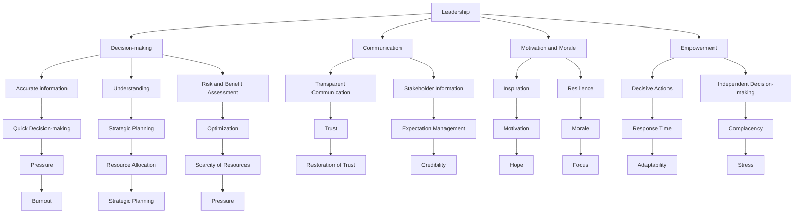

                 

### Chapter 1: Introduction to Leadership and Crisis Management

**1.1 The Importance of Leadership in Crisis Management**

#### 1.1.1 What is leadership?

In the context of organizations, leadership is the process of influencing, motivating, and guiding individuals or teams towards achieving common goals. Effective leadership involves not only the authority to make decisions but also the ability to inspire and empower others. Leadership is not limited to formal roles; it can exist at all levels within an organization, from top executives to frontline employees.

#### 1.1.2 The role of leadership in crisis situations

During crises, the role of leadership becomes even more critical. A crisis can disrupt normal operations, create uncertainty, and generate fear among employees and stakeholders. Leadership provides direction, stability, and hope during these challenging times. Here are some key roles of leadership in crisis management:

- **Decision-making:** Leaders are responsible for making rapid decisions that can impact the organization’s future. These decisions must be based on accurate information, a clear understanding of the situation, and an assessment of the potential risks and benefits.

- **Communication:** Effective communication is crucial in a crisis. Leaders must ensure that information is disseminated accurately and promptly to all stakeholders, including employees, customers, suppliers, and the public. Transparent communication helps to build trust and manage expectations.

- **Motivation and morale:** Leaders play a crucial role in maintaining the motivation and morale of their teams during a crisis. They must inspire and encourage their employees to stay focused and resilient, despite the challenges they face.

- **Empowerment:** During a crisis, leaders must empower their teams to take decisive actions and make independent decisions. This can help to improve response times and reduce the risk of complacency or indecision.

#### 1.1.3 How crises affect leadership

Crises can significantly impact leadership in several ways:

- **Pressure:** Crises often put immense pressure on leaders, as they are expected to make difficult decisions quickly and effectively. This pressure can lead to stress, anxiety, and burnout.

- **Change:** Crises often require leaders to adapt rapidly to changing circumstances. This may involve revising strategic plans, reallocating resources, or changing organizational structures.

- **Scarcity of resources:** Crises can lead to a scarcity of resources, such as money, materials, or personnel. Leaders must find ways to optimize the available resources and prioritize critical needs.

- **Reputation:** Crises can damage an organization’s reputation, and leaders are often held accountable for the outcomes. This can put additional pressure on leaders to restore trust and credibility.

In summary, leadership is essential in crisis management, as it provides direction, stability, and hope during challenging times. Leaders must be prepared to navigate the complexities of crises, make difficult decisions, and inspire their teams to overcome adversity.

## Mermaid Flowchart for Core Concepts and Relationships in Leadership in Crisis Management

**References:**
- Northouse, G. G. (2018). Leadership: Theory and Practice. Sage Publications.
- Yukl, G. A. (2013). Leadership in Organizations (8th ed.). Pearson Education.
- Johnson, M., Johnson, H., & Weaver, M. (2015). Crisis Management: Planning for the Inevitable. John Wiley & Sons.
- Liden, R. C., & Maslyn, J. M. (2008). Leadership in Organizations: Understanding the Dynamics of Power and Influence (2nd ed.). Sage Publications.

## 1.2 The Concept of Crisis Management

#### 1.2.1 Defining a crisis

A crisis is an unpredictable and often sudden event that poses a significant threat to an organization's operations, reputation, or financial stability. Crises can originate from various sources, including natural disasters, economic downturns, cyber-attacks, product recalls, and public health emergencies. A crisis is typically characterized by the following attributes:

- **Unpredictability:** Crises often emerge unexpectedly, leaving little or no time for organizations to prepare.

- **Significance:** Crises have the potential to cause severe disruption to an organization's operations, reputation, or financial health.

- **Uncertainty:** Crises create a high level of uncertainty, as the outcomes are often unclear and the available information is limited.

- **Impact:** Crises can affect multiple aspects of an organization, including its employees, customers, suppliers, and stakeholders.

#### 1.2.2 The crisis management process

The crisis management process is a structured approach that organizations use to identify, assess, and respond to crises. The process typically involves the following stages:

- **Risk assessment:** Organizations must identify and assess the potential risks that could lead to a crisis. This involves evaluating the likelihood and impact of different scenarios.

- **Preparation:** Organizations should develop a crisis management plan that outlines the actions to be taken in the event of a crisis. This plan should include communication strategies, resource allocation, and decision-making processes.

- **Detection:** Organizations must have systems in place to detect and monitor potential crises. This can involve using data analytics, social media monitoring, or other surveillance tools.

- **Response:** When a crisis occurs, organizations must respond quickly and effectively. This may involve activating the crisis management plan, communicating with stakeholders, and taking corrective actions.

- **Recovery:** After a crisis has been managed, organizations must focus on recovering and restoring normal operations. This may involve repairing damage, rebuilding trust with stakeholders, and implementing lessons learned from the crisis.

- **Review:** Once the crisis has been resolved, organizations should conduct a post-crisis review to evaluate their response and identify areas for improvement. This can help to refine the crisis management plan and improve future crisis readiness.

#### 1.2.3 The impact of crises on organizations

Crises can have significant and long-lasting impacts on organizations. Some of the key effects of crises include:

- **Financial loss:** Crises can lead to financial losses, including costs associated with damage, legal fees, and lost revenue.

- **Reputation damage:** Crises can damage an organization's reputation, leading to a loss of customer trust and potential long-term consequences for the organization's success.

- **Operational disruption:** Crises can disrupt normal business operations, leading to delays, reduced productivity, and increased costs.

- **Stakeholder dissatisfaction:** Crises can lead to dissatisfaction among stakeholders, including employees, customers, suppliers, and investors, which can impact the organization's relationships with them.

- **Legal and regulatory challenges:** Crises can result in legal and regulatory challenges, including fines, penalties, and legal actions.

In summary, crises pose significant risks to organizations and can have wide-ranging and long-lasting impacts. Effective crisis management is essential for minimizing these risks and ensuring the organization's survival and success in the face of adversity.

## 1.3 The Relationship Between Leadership and Crisis Management

The relationship between leadership and crisis management is inherently intertwined, as effective leadership is crucial for managing crises and turning them into opportunities. Here, we explore the interplay between leadership principles and crisis management practices, highlighting how leaders can navigate crises to achieve positive outcomes.

### 1.3.1 Leadership Principles in Crisis Management

Leadership principles form the foundation of crisis management. These principles guide leaders in making decisions, communicating with stakeholders, and maintaining organizational stability during a crisis. Some key leadership principles that are particularly relevant in crisis management include:

- **Decision-making:** Leaders must be able to make rapid and effective decisions during a crisis. This requires a clear understanding of the situation, an assessment of potential risks and benefits, and the ability to balance short-term priorities with long-term goals.

- **Communication:** Effective communication is essential for keeping stakeholders informed and maintaining trust during a crisis. Leaders must communicate clearly, consistently, and transparently, ensuring that accurate information is disseminated promptly.

- **Empowerment:** Leaders must empower their teams to take decisive action and make independent decisions during a crisis. This fosters a sense of ownership and accountability, enabling the organization to respond more effectively and efficiently.

- **Resilience:** Leaders must demonstrate resilience and maintain a positive mindset during a crisis. This helps to inspire and motivate their teams, fostering a culture of resilience and adaptability.

### 1.3.2 Crisis Management Practices and Leadership

Crisis management practices are closely linked to leadership principles, as they are implemented by leaders and influence the organization's response to crises. Here are some key crisis management practices that highlight the role of leadership:

- **Risk assessment:** Leaders must identify and assess potential risks to the organization, prioritizing those that pose the greatest threat. This requires a comprehensive understanding of the organization's vulnerabilities and the ability to anticipate potential crises.

- **Preparation:** Leaders must develop and implement crisis management plans, outlining the actions to be taken in the event of a crisis. This includes identifying key personnel, establishing communication channels, and allocating resources to address potential crises.

- **Response:** Leaders must coordinate the organization's response to a crisis, ensuring that all necessary actions are taken promptly and effectively. This requires strong leadership skills, such as decision-making, communication, and coordination.

- **Recovery:** Leaders must oversee the organization's recovery efforts following a crisis, working to restore normal operations and rebuild stakeholder trust. This may involve implementing corrective actions, learning from the crisis, and improving crisis management practices.

### 1.3.3 Turning Crises into Opportunities

Leadership plays a critical role in turning crises into opportunities for growth and improvement. Here are some strategies that leaders can use to achieve this:

- **Learning from the crisis:** Leaders must take the time to analyze the crisis and learn from the experience. This involves identifying lessons learned, evaluating what worked well and what did not, and using this knowledge to improve crisis management practices.

- **Innovation and adaptation:** Leaders must encourage innovation and adaptation within the organization, fostering a culture that embraces change and is open to new ideas. This can help the organization to develop new products, services, or business models that address the challenges posed by the crisis.

- **Stakeholder engagement:** Leaders must engage with stakeholders, including employees, customers, suppliers, and investors, to rebuild trust and demonstrate commitment to addressing the crisis. This can help to strengthen relationships and create opportunities for collaboration and growth.

- **Strategic planning:** Leaders must develop and implement a strategic plan that leverages the lessons learned from the crisis and positions the organization for future success. This may involve revising strategic goals, reallocating resources, or redefining the organization's vision and mission.

In conclusion, the relationship between leadership and crisis management is a critical one. Effective leadership principles and practices are essential for navigating crises and turning them into opportunities for growth and improvement. Leaders must be prepared to make difficult decisions, communicate effectively, empower their teams, and learn from the crisis to achieve positive outcomes.

## Case Studies: Successful Crisis Management

### 1.4.1 Toyota's Recall Crisis

In 2009, Toyota faced a significant crisis due to widespread recalls of its vehicles for issues related to unintended acceleration. This crisis threatened the company's reputation and financial stability, as well as its market share. Toyota's leadership responded in several key ways:

- **Immediate Response:** Toyota's President, Akio Toyoda, apologized publicly for the recalls and pledged to address the issues promptly. He personally led the investigation into the root cause of the problems and assured customers that the company was taking the necessary steps to resolve the issue.

- **Communication:** Toyota established a clear and transparent communication strategy, providing regular updates to customers, employees, and the public about the status of the recall and the steps being taken to address the problem. This helped to build trust and mitigate rumors.

- **Empowerment:** Toyota empowered its engineers and manufacturing teams to work on fixing the issues, encouraging them to take ownership of the problem and collaborate with suppliers to find effective solutions.

- **Restoration of Trust:** Toyota invested heavily in rebuilding trust with its customers and stakeholders. This included offering free repairs, providing loaner cars, and implementing a comprehensive quality assurance program.

The outcome of Toyota's crisis management efforts was positive. The company's reputation was restored, and its market share eventually rebounded. The crisis also led to significant improvements in Toyota's quality control processes and crisis management practices.

### 1.4.2 Netflix's Customer Service Crisis

In 2011, Netflix faced a crisis when it announced plans to split its DVD rental service and streaming service, raising prices for many customers. This move led to widespread backlash and a public relations disaster for the company.

- **Immediate Response:** Netflix's CEO, Reed Hastings, publicly apologized for the way the changes were communicated and acknowledged that the company had underestimated customer sentiment.

- **Communication:** Netflix made efforts to address customer concerns through improved communication. They offered refunds and discounts to dissatisfied customers and engaged in direct communication with customers through social media and email.

- **Innovation:** Instead of abandoning the plan, Netflix innovated by offering a more flexible pricing model and improving the streaming service to attract customers. This helped to mitigate customer dissatisfaction and retain a significant portion of its subscriber base.

- **Stakeholder Engagement:** Netflix engaged with customers and listened to their feedback, showing a willingness to adapt and respond to their needs. This helped to rebuild trust and demonstrate the company's commitment to customer satisfaction.

The outcome of Netflix's crisis management was also positive. The company was able to implement its pricing strategy while retaining a substantial portion of its customer base. The crisis led to improvements in Netflix's communication and customer service practices and highlighted the importance of listening to customer feedback.

### 1.4.3 IBM's Leadership during the Dot-Com Bust

During the dot-com bubble burst in 2000, IBM, a leader in the technology industry, faced significant challenges. The company's leadership, under CEO Lou Gerstner, took several steps to manage the crisis:

- **Strategic Planning:** Gerstner implemented a strategic plan to refocus IBM on its core strengths in mainframe computing and high-end IT services. This involved divesting non-core businesses and reducing the workforce by tens of thousands of employees.

- **Decision-Making:** IBM's leadership made tough decisions to restructure the company and prioritize long-term growth over short-term profits. This required a clear vision and the ability to balance the interests of various stakeholders.

- **Communication:** Gerstner communicated the company's strategy and vision clearly to employees, customers, and investors. This helped to maintain trust and keep morale high among employees despite the challenging environment.

- **Empowerment:** IBM empowered its leaders at all levels to make decisions and take actions to drive the company forward. This fostered a sense of ownership and accountability throughout the organization.

The outcome of IBM's crisis management efforts was a successful turnaround. The company emerged from the crisis stronger and more focused on its core business. The leadership's strategic vision and decision-making capabilities played a crucial role in IBM's recovery and subsequent growth.

In conclusion, these case studies demonstrate how effective leadership can help organizations navigate crises and turn them into opportunities for growth. By responding promptly, communicating effectively, empowering teams, and learning from the crisis, leaders can lead their organizations through adversity and emerge stronger.

## Chapter 2: Core Concepts and Theories of Leadership

### 2.1 Leadership Theories

Leadership theories provide frameworks for understanding how leaders influence and motivate their followers to achieve organizational goals. There are several prominent leadership theories that have shaped our understanding of leadership, including transformational, transactional, and servant leadership. Each theory emphasizes different aspects of leadership and offers valuable insights into how leaders can effectively guide their teams.

#### 2.1.1 Transformational Leadership

Transformational leadership is a theory that emphasizes the leader's ability to inspire and motivate their followers to achieve high levels of performance and personal growth. Transformational leaders are characterized by their visionary qualities, their ability to articulate a clear and compelling vision, and their commitment to personal development. Key components of transformational leadership include:

- **Inspiration:** Transformational leaders inspire their followers by setting an example and communicating a clear, compelling vision for the future. This inspires followers to adopt the leader's values and work towards common goals.

- **Motivation:** Transformational leaders motivate their followers by fostering a sense of purpose and belonging, and by recognizing and rewarding their contributions. This helps to create a positive and engaging work environment.

- **Empowerment:** Transformational leaders empower their followers by delegating authority and encouraging them to take ownership of their work. This fosters innovation, creativity, and accountability.

- **Personal Development:** Transformational leaders support the personal development of their followers by providing opportunities for growth and learning. This helps to build a loyal and committed team that is dedicated to the organization's success.

#### 2.1.2 Transactional Leadership

Transactional leadership is a theory that emphasizes the exchange of rewards and penalties based on performance. Transactional leaders focus on maintaining order, ensuring that tasks are completed efficiently, and that performance standards are met. Key components of transactional leadership include:

- **Contingent Rewards:** Transactional leaders provide rewards, such as bonuses or promotions, to followers who meet or exceed performance expectations. This encourages individuals to work hard and achieve their goals.

- **Performance Management:** Transactional leaders set clear performance expectations and regularly monitor progress. They provide feedback and coaching to help followers improve their performance.

- **Structural Management:** Transactional leaders establish clear structures and processes to ensure that tasks are completed efficiently and effectively. This can help to reduce ambiguity and improve coordination among team members.

- **Mutual Exchange:** Transactional leadership is based on a mutual exchange of rewards and penalties. Leaders provide incentives to followers in return for their commitment and performance.

#### 2.1.3 Servant Leadership

Servant leadership is a theory that emphasizes the leader's commitment to serving the needs of their followers and the organization as a whole. Servant leaders prioritize the well-being of their followers and believe that their primary role is to support the growth and development of others. Key components of servant leadership include:

- **Servant Orientation:** Servant leaders focus on the needs of their followers and prioritize their well-being. They act as mentors and role models, providing guidance and support to help their followers grow and develop.

- **Empathy:** Servant leaders demonstrate empathy by understanding and addressing the needs of their followers. This helps to build trust and create a positive, supportive work environment.

- **Stewardship:** Servant leaders act as stewards of the organization's resources and prioritize long-term sustainability and growth. They work to ensure that resources are used effectively and ethically, and that the organization's values are upheld.

- **Collaboration:** Servant leaders encourage collaboration and teamwork, fostering a sense of unity and shared purpose among followers. This helps to build a cohesive and high-performing team.

In summary, leadership theories provide valuable insights into the different approaches that leaders can take to inspire, motivate, and guide their followers. Transformational leadership focuses on inspiring and motivating followers through vision and personal development, transactional leadership emphasizes performance management and mutual exchange of rewards, and servant leadership prioritizes the well-being of followers and the organization as a whole. By understanding these theories, leaders can adopt the most effective approaches to lead their teams and organizations to success.

## 2.2 Leadership Skills

Effective leadership requires a combination of skills, knowledge, and attributes that enable leaders to inspire, motivate, and guide their teams towards achieving common goals. In this section, we will discuss several key leadership skills that are critical for successful leadership, including communication skills, decision-making skills, and emotional intelligence.

### 2.2.1 Communication Skills

Communication skills are essential for effective leadership, as they enable leaders to convey their vision, expectations, and strategies to their followers. Effective communication also fosters collaboration, builds trust, and enhances the overall productivity of a team. Key communication skills for leaders include:

- **Active Listening:** Active listening involves paying full attention to what others are saying and demonstrating that you understand their perspectives. This helps to build trust and create a supportive environment for open communication.

- **Clear and Concise Messaging:** Leaders should be able to communicate their ideas and expectations clearly and concisely, using simple language and avoiding jargon. This helps to ensure that everyone understands the message and can act accordingly.

- **Effective Public Speaking:** Leaders often need to communicate with large groups or present information to stakeholders. Effective public speaking skills, including confidence, clarity, and engagement, are crucial for delivering compelling messages and inspiring action.

- **Feedback and Feedback:** Providing constructive feedback is an important aspect of effective communication. Leaders should offer specific, actionable feedback that helps followers improve their performance and grow professionally.

- **Conflict Resolution:** Leaders must be skilled in resolving conflicts and mediating disputes. This requires effective communication skills, including active listening, empathy, and the ability to find mutually beneficial solutions.

### 2.2.2 Decision-Making Skills

Decision-making is a fundamental skill for leaders, as they are often called upon to make critical decisions that can impact the organization’s success. Effective decision-making involves analyzing information, evaluating alternatives, and choosing the best course of action. Key decision-making skills for leaders include:

- **Analytical Thinking:** Leaders should be able to analyze complex situations, identify relevant factors, and evaluate potential outcomes. This requires strong critical thinking and problem-solving skills.

- **Risk Assessment:** Leaders must be able to assess the risks and benefits of different decisions and make informed choices. This involves understanding the potential consequences of each option and weighing them carefully.

- **Decision Analysis:** Leaders should use decision analysis techniques, such as decision trees or cost-benefit analysis, to systematically evaluate their options and make data-driven decisions.

- **Decision-making under Uncertainty:** Leaders must be adept at making decisions in situations of uncertainty, where the outcome is not certain. This requires the ability to manage uncertainty, gather information, and make the best possible decision based on the available evidence.

- **Decision-making under Time Pressure:** Leaders often face time constraints and must make rapid decisions. This requires the ability to prioritize, focus on key issues, and make quick, effective decisions.

### 2.2.3 Emotional Intelligence

Emotional intelligence (EI) is the ability to recognize, understand, and manage one's own emotions, as well as the emotions of others. EI is a critical skill for leaders, as it enables them to build strong relationships, inspire and motivate their teams, and effectively manage their own and others' emotions. Key components of emotional intelligence include:

- **Self-awareness:** Self-awareness involves recognizing and understanding one's own emotions, strengths, and weaknesses. This awareness helps leaders to make better decisions and adapt their behavior to different situations.

- **Self-management:** Self-management involves regulating one's emotions and behaviors in response to different situations. This skill helps leaders to stay calm and focused under pressure and maintain positive relationships with their followers.

- **Social skills:** Social skills involve effectively communicating and interacting with others, building strong relationships, and managing group dynamics. Leaders with strong social skills can build cohesive teams and foster a positive organizational culture.

- **Empathy:** Empathy involves understanding and sharing the feelings of others. Leaders with high empathy can build trust, resolve conflicts, and create a supportive and inclusive work environment.

In summary, effective leadership requires a diverse set of skills, including communication skills, decision-making skills, and emotional intelligence. By developing these skills, leaders can inspire and motivate their teams, make informed decisions, and navigate the complexities of leadership with confidence and competence.

## Chapter 3: Understanding Crises and Crisis Management

### 3.1 Types of Crises

Crises can arise from various sources and affect organizations in different ways. Understanding the different types of crises is crucial for effective crisis management. The following are some common types of crises:

#### 3.1.1 Natural Disasters

Natural disasters, such as hurricanes, earthquakes, wildfires, and floods, can have a devastating impact on organizations. They can cause physical damage to facilities, disrupt supply chains, and lead to the loss of life and property. Natural disasters often strike suddenly and without warning, making it difficult for organizations to prepare and respond effectively.

**Impact on Organizations:**
- **Physical Damage:** Natural disasters can cause extensive damage to buildings, equipment, and infrastructure, leading to significant financial losses.
- **Disruption of Operations:** Natural disasters can disrupt normal business operations, causing delays, lost production, and decreased revenue.
- **Loss of Human Resources:** Employees may be injured or displaced, leading to a shortage of skilled workers and affecting productivity.

**Crisis Management Strategies:**
- **Preparedness:** Organizations should develop emergency response plans and invest in disaster preparedness measures, such as backup power supplies and data recovery systems.
- **Communication:** Establish clear communication channels to keep employees, customers, and stakeholders informed during and after the disaster.
- **Continuity Planning:** Develop business continuity plans to ensure that critical operations can be maintained or quickly restored in the event of a natural disaster.

#### 3.1.2 Financial Crises

Financial crises can occur due to market volatility, economic downturns, or financial fraud. They can lead to a decline in stock prices, loss of investor confidence, and potential bankruptcy.

**Impact on Organizations:**
- **Loss of Confidence:** Financial crises can erode investor confidence, leading to a decrease in capital availability and difficulty in securing financing.
- **Reduced Revenue:** Financial crises can lead to a decline in consumer spending and business investments, resulting in reduced revenue and profits.
- **Credit Risk:** Financial crises can increase the risk of defaults on loans and other financial obligations, leading to financial instability.

**Crisis Management Strategies:**
- **Financial Forecasting:** Organizations should regularly monitor their financial health and develop contingency plans to address potential financial crises.
- **Diversification:** Diversifying investments and revenue streams can help mitigate the impact of financial crises.
- **Regulatory Compliance:** Ensuring compliance with financial regulations and maintaining transparent financial reporting can help to rebuild trust and maintain investor confidence.

#### 3.1.3 Reputation Crises

Reputation crises can result from negative media coverage, product recalls, or scandals involving the organization or its employees. These crises can damage the organization's reputation, leading to a loss of customer trust and potential legal consequences.

**Impact on Organizations:**
- **Loss of Customer Trust:** Reputation crises can erode customer trust, leading to a decline in sales and customer loyalty.
- **Legal and Regulatory Consequences:** Reputation crises can result in legal actions, fines, or other regulatory penalties.
- **Reputational Damage:** Long-term damage to the organization's reputation can affect its brand value and market position.

**Crisis Management Strategies:**
- **Open Communication:** Transparent and timely communication is crucial for mitigating the impact of reputation crises. Organizations should provide accurate information and address concerns promptly.
- **Public Relations:** Employing skilled public relations professionals can help to manage the crisis and restore public trust.
- **Corporate Responsibility:** Demonstrating a commitment to ethical practices and social responsibility can help to rebuild the organization's reputation.

#### 3.1.4 Cybersecurity Crises

Cybersecurity crises involve data breaches, hacking incidents, or other cyber-attacks that compromise the organization's sensitive information. These crises can result in financial loss, reputational damage, and legal consequences.

**Impact on Organizations:**
- **Financial Loss:** Cybersecurity crises can lead to significant financial losses due to remediation costs, legal fees, and potential fines.
- **Reputational Damage:** Public disclosure of a data breach can erode customer trust and damage the organization's reputation.
- **Legal and Regulatory Consequences:** Organizations may face legal actions and regulatory penalties for failing to protect sensitive data.

**Crisis Management Strategies:**
- **Prevention and Detection:** Implementing robust cybersecurity measures, including firewalls, encryption, and regular security audits, can help prevent cyber-attacks.
- **Incident Response:** Developing an incident response plan and training employees on how to respond to cyber-attacks can help minimize damage and improve recovery times.
- **Customer Communication:** Promptly informing customers about data breaches and providing guidance on how to protect themselves can help to maintain trust and mitigate reputational damage.

In conclusion, crises can arise from various sources and impact organizations in different ways. Understanding the types of crises and implementing effective crisis management strategies is essential for mitigating their impact and ensuring the organization's resilience and sustainability.

## Chapter 4: Leadership During Crises: The Role of Leaders

### 4.1 Decision-Making under Pressure

One of the most critical roles of leaders during a crisis is making informed and effective decisions under pressure. The ability to analyze complex situations, weigh potential outcomes, and act decisively can be the difference between managing a crisis and allowing it to escalate. Here are some key aspects of decision-making under pressure:

#### 4.1.1 Analyzing the Situation

Leaders must quickly assess the situation, understanding the root cause of the crisis and the potential impacts on the organization. This requires gathering accurate and relevant information, which may involve consulting with experts, reviewing historical data, and considering the opinions of diverse stakeholders. A thorough analysis helps leaders to identify the key issues and develop a clear understanding of the problem.

#### 4.1.2 Weighing Potential Outcomes

Once the situation is analyzed, leaders must consider the potential outcomes of different actions. This involves evaluating the risks and benefits of each option and predicting the likely consequences. Leaders must be able to balance short-term goals with long-term objectives, ensuring that decisions made during the crisis align with the organization's overall strategy and values.

#### 4.1.3 Acting Decisively

Decision-making under pressure requires leaders to act quickly and decisively. This means being comfortable with making tough choices and committing to a course of action, even if it involves uncertainty. Leaders must also be prepared to revise their decisions as new information becomes available, demonstrating the flexibility and adaptability needed to navigate changing circumstances.

### 4.2 Communication during Crises

Effective communication is another cornerstone of leadership during crises. Clear and consistent communication helps to maintain trust, manage expectations, and ensure that all stakeholders are informed and aligned. Here are some key strategies for effective communication during a crisis:

#### 4.2.1 Timeliness

Timeliness is crucial in crisis communication. Leaders must ensure that information is disseminated promptly to all relevant parties, avoiding the spread of misinformation and rumors. This may involve setting up a dedicated communication channel or using multiple platforms to reach a wide audience.

#### 4.2.2 Clarity

Communications should be clear, concise, and easy to understand. Jargon and technical terms should be avoided, and messages should be tailored to the specific audience. Leaders should be transparent about the crisis, sharing both the problems and the steps being taken to address them.

#### 4.2.3 Consistency

Consistency in communication is essential for building trust and maintaining credibility. Leaders should ensure that their messages are aligned across all channels and that updates are provided regularly. This helps to avoid confusion and reduces the risk of misinterpretation.

#### 4.2.4 Empathy

Leaders should communicate with empathy, recognizing the impact of the crisis on their followers and stakeholders. This involves acknowledging their concerns, expressing gratitude for their efforts, and demonstrating a genuine commitment to resolving the crisis.

### 4.3 Maintaining Motivation and Morale

Maintaining the motivation and morale of employees and other stakeholders during a crisis is vital for the organization's resilience and ability to recover. Leaders must adopt strategies to keep morale high and inspire resilience:

#### 4.3.1 Recognition and Appreciation

Recognizing and appreciating the efforts of employees and other stakeholders can boost morale and motivation. Leaders should acknowledge the hard work and dedication of their teams, celebrating small victories and milestones along the way.

#### 4.3.2 Transparent Communication

Transparent communication helps to maintain trust and demonstrate that leaders are actively engaged in resolving the crisis. By sharing updates, challenges, and progress, leaders can keep their followers informed and involved.

#### 4.3.3 Support and Resources

Leaders should ensure that their teams have the necessary support and resources to manage the crisis effectively. This may involve providing additional training, equipment, or manpower to address specific challenges.

#### 4.3.4 Flexibility and Adaptability

Leaders must be flexible and adaptable, recognizing that circumstances may change rapidly during a crisis. They should be open to new ideas and approaches, encouraging innovation and problem-solving among their followers.

In conclusion, leadership during a crisis requires decisive decision-making, effective communication, and a commitment to maintaining motivation and morale. By leveraging these strategies, leaders can guide their organizations through adversity and emerge stronger on the other side.

## Chapter 5: Strategies for Turning Crises into Opportunities

### 5.1 Leveraging Crises for Organizational Transformation

Crises can serve as catalysts for organizational transformation, offering leaders the opportunity to reevaluate strategies, realign resources, and foster innovation. Here are key strategies for leveraging crises to drive positive change:

#### 5.1.1 Strategic Reevaluation

During a crisis, leaders must take a step back to assess the organization's strategic direction. This involves critically analyzing current strategies, identifying gaps, and exploring new opportunities. By reevaluating their strategic approach, leaders can pivot to more agile and sustainable models that better align with the organization's long-term goals.

**Steps for Strategic Reevaluation:**
1. **Identify Challenges:** Understand the root causes of the crisis and how they impact the organization's operations and goals.
2. **Conduct SWOT Analysis:** Evaluate the organization's strengths, weaknesses, opportunities, and threats to identify areas for improvement and potential growth.
3. **Engage Stakeholders:** Involve key stakeholders, including employees, customers, suppliers, and investors, in the strategic reevaluation process to gain diverse perspectives and insights.
4. **Develop a Strategic Roadmap:** Create a clear plan for addressing the challenges and capitalizing on new opportunities, outlining specific actions, timelines, and responsible parties.

#### 5.1.2 Resource Allocation

Effective resource allocation is crucial during a crisis to ensure that limited resources are used efficiently and effectively. Leaders must prioritize critical needs and reallocate resources to support the organization's most vital operations and strategic initiatives.

**Steps for Resource Allocation:**
1. **Assess Resource Availability:** Identify the organization's current resource pool, including financial, human, and material assets.
2. **Prioritize Needs:** Determine which resources are most critical for addressing the crisis and achieving strategic objectives.
3. **Reallocate Resources:** Shift resources from less essential activities to high-priority areas, ensuring that the organization can continue to operate effectively and capitalize on emerging opportunities.
4. **Optimize Resource Utilization:** Implement strategies to maximize the efficiency and effectiveness of resource use, such as cross-department collaboration, shared services, and technology-enabled processes.

#### 5.1.3 Innovation and Adaptation

Crises often require organizations to think creatively and adapt quickly to changing circumstances. Leveraging crises for innovation involves fostering a culture of experimentation, encouraging new ideas, and embracing change.

**Steps for Innovation and Adaptation:**
1. **Create a Culture of Innovation:** Encourage employees to think creatively and take calculated risks. Provide resources and support for research and development, and recognize and reward innovative efforts.
2. **Identify New Opportunities:** Look for opportunities to innovate and adapt in response to the crisis. This may involve developing new products, services, or business models that address market demands or create new value propositions.
3. **Experiment and Test:** Pilot new initiatives and rapidly iterate based on feedback and results. This helps to identify what works and what doesn't, enabling the organization to refine its approach.
4. **Leverage Technology:** Utilize technology to drive innovation and improve operational efficiency. This may include adopting new tools, platforms, or processes that enhance the organization's ability to respond to crises and seize new opportunities.

#### 5.1.4 Stakeholder Engagement

Engaging with stakeholders during a crisis is essential for building trust, managing expectations, and fostering collaboration. Effective stakeholder engagement can help to mitigate the impact of the crisis and create opportunities for mutual benefit.

**Steps for Stakeholder Engagement:**
1. **Identify Stakeholders:** Determine who the key stakeholders are, including employees, customers, suppliers, investors, regulatory bodies, and the local community.
2. **Communicate Transparently:** Maintain open and honest communication with stakeholders, providing regular updates on the crisis and the steps being taken to address it.
3. **Seek Feedback:** Encourage stakeholders to share their perspectives and concerns, and involve them in decision-making processes where appropriate.
4. **Collaborate:** Work together with stakeholders to develop solutions and implement strategies that address the crisis and align with their interests. This may involve forming partnerships, sharing resources, or leveraging collective expertise.

By leveraging crises for organizational transformation, leaders can drive positive change, build resilience, and create new opportunities for growth. Through strategic reevaluation, resource allocation, innovation and adaptation, and stakeholder engagement, organizations can turn adversity into a catalyst for success.

## Chapter 6: Case Studies: Successful Crisis Management

### 6.1.1 Amazon's Response to the COVID-19 Pandemic

The COVID-19 pandemic presented a unprecedented challenge to businesses worldwide, including Amazon. As one of the largest e-commerce companies, Amazon faced increased demand for goods while dealing with supply chain disruptions, health and safety concerns, and the need to adapt its operations to a remote work environment. Here's how Amazon effectively managed the crisis:

**Immediate Response:**
- **Rapid Adaptation:** Amazon quickly adjusted its operations to meet the increased demand for essential goods. This involved hiring additional workers, expanding warehouse space, and implementing new delivery processes.
- **Health and Safety Measures:** Amazon prioritized the health and safety of its employees by implementing strict safety protocols, such as social distancing measures, mandatory mask-wearing, and enhanced cleaning procedures in its facilities.

**Communication:**
- **Clear and Transparent Communication:** Amazon maintained open and transparent communication with its employees, customers, and stakeholders. It provided regular updates on the company's response to the pandemic, addressing concerns and providing reassurance.

**Innovation and Adaptation:**
- **Digital Transformation:** Amazon accelerated its digital transformation initiatives, investing in technology to improve efficiency and customer experience. This included expanding its use of automation, artificial intelligence, and machine learning to optimize operations and improve customer service.

**Stakeholder Engagement:**
- **Community Engagement:** Amazon engaged with local communities by providing support to frontline workers, donating to COVID-19 relief funds, and collaborating with healthcare organizations. This helped to build trust and strengthen relationships with stakeholders.

**Outcome:**
- **Sustained Growth:** Despite the challenges posed by the pandemic, Amazon continued to grow, with its revenue increasing significantly during the crisis. The company's effective crisis management strategies helped it to maintain its market position and continue delivering value to its customers.

### 6.1.2 Walmart's Crisis Management during the Great Recession

During the Great Recession of 2008, Walmart, one of the world's largest retailers, faced significant challenges, including declining sales, tight credit markets, and increased competition. Walmart's crisis management efforts during this period are a testament to the effectiveness of strategic decision-making and innovation in navigating a financial crisis:

**Strategic Reevaluation:**
- **Cost Reduction:** Walmart implemented aggressive cost reduction measures, including reducing operating expenses and optimizing its supply chain. This helped to improve profitability and maintain competitive pricing.
- **Consumer Focus:** The company focused on meeting the needs of its core customers during the recession, offering affordable and essential products. This helped to maintain customer loyalty and drive sales.

**Innovation and Adaptation:**
- **Digital Transformation:** Walmart accelerated its digital transformation efforts, investing in e-commerce capabilities, mobile apps, and omnichannel initiatives. This helped to reach new customers and expand its market reach.

**Stakeholder Engagement:**
- **Supplier Relationships:** Walmart worked closely with its suppliers to negotiate favorable terms and maintain strong relationships. This helped to ensure a steady supply of goods and avoid potential disruptions.
- **Community Engagement:** Walmart engaged with local communities by supporting job creation and providing resources to those affected by the recession. This helped to build positive relationships with stakeholders.

**Outcome:**
- **Resilience and Growth:** Despite the challenges of the Great Recession, Walmart emerged stronger and more resilient. The company's effective crisis management strategies, including strategic reevaluation, innovation, and stakeholder engagement, helped it to navigate the crisis and continue its growth trajectory.

In conclusion, these case studies illustrate how Amazon and Walmart effectively managed crises by adapting to changing circumstances, leveraging innovation, maintaining strong stakeholder relationships, and prioritizing the well-being of their employees and customers. Their success demonstrates the importance of strategic decision-making, clear communication, and a commitment to continuous improvement in crisis management.

## Chapter 7: Practical Tools and Techniques for Leaders

### 7.1.1 Risk Assessment Tools

Effective crisis management begins with a thorough understanding of potential risks. Leaders can leverage various tools and techniques to identify, assess, and prioritize risks, thereby enhancing their organization's resilience.

**1.** **SWOT Analysis:**
   - **Strengths, Weaknesses, Opportunities, Threats (SWOT) Analysis** helps leaders evaluate internal and external factors that could impact the organization. By identifying strengths and weaknesses, leaders can better leverage their assets and address vulnerabilities. Opportunities and threats are analyzed to identify potential risks and opportunities for growth.

**2.** **Quantitative Risk Analysis:**
   - **Quantitative risk analysis** involves using mathematical models and statistical techniques to measure the likelihood and impact of risks. Tools like Monte Carlo simulations, decision trees, and risk matrices can help leaders understand the potential outcomes and prioritize risks based on their severity.

**3.** **Qualitative Risk Analysis:**
   - **Qualitative risk analysis** involves assessing risks based on expert judgment and subjective criteria. Techniques such as risk assessment checklists, interviews, and workshops can help leaders identify potential risks and evaluate their potential impact and likelihood.

### 7.1.2 Crisis Management Planning Tools

A robust crisis management plan is essential for effective crisis response. These tools can help leaders develop and implement a comprehensive plan.

**1.** **Business Impact Analysis (BIA):**
   - **Business Impact Analysis (BIA)** identifies the potential impacts of disruptions on critical business processes. By assessing the time required to recover and the resources needed, leaders can prioritize their recovery efforts and allocate resources effectively.

**2.** **Crisis Management Matrix:**
   - **Crisis Management Matrix** is a visual tool that helps leaders prioritize and manage different types of crises based on their severity and impact. It provides a framework for decision-making and resource allocation during a crisis.

**3.** **Crisis Response Playbooks:**
   - **Crisis Response Playbooks** are detailed, step-by-step guides that outline specific actions to be taken during different crisis scenarios. These playbooks ensure that leaders and their teams are well-prepared and can respond quickly and effectively.

### 7.1.3 Communication Tools

Effective communication is crucial during a crisis. Leaders can leverage various tools and techniques to maintain clear and consistent communication with stakeholders.

**1.** **Emergency Communication Systems:**
   - **Emergency Communication Systems** such as phone trees, mass notification systems, and crisis communication apps ensure that information is disseminated quickly and accurately to all stakeholders. These systems can be integrated with existing communication channels to ensure comprehensive coverage.

**2.** **Social Media Monitoring Tools:**
   - **Social Media Monitoring Tools** allow leaders to monitor social media platforms for mentions of their organization and key terms related to the crisis. This helps them identify emerging issues, respond to customer inquiries, and manage their reputation in real-time.

**3.** **Digital Collaboration Platforms:**
   - **Digital Collaboration Platforms** like Slack, Microsoft Teams, and Google Workspace enable leaders and their teams to communicate, collaborate, and coordinate in real-time, even when they are working remotely. These platforms facilitate efficient information exchange and decision-making during a crisis.

In summary, effective crisis management requires a combination of risk assessment tools, crisis management planning tools, and communication tools. By leveraging these practical tools and techniques, leaders can enhance their organization's resilience, ensure effective crisis response, and maintain strong relationships with stakeholders.

## Conclusion

In conclusion, leadership and crisis management are crucial components of organizational success in today's fast-paced and unpredictable world. Leaders must be equipped with the knowledge, skills, and tools to navigate crises and turn them into opportunities for growth and improvement. The strategies and case studies presented in this book illustrate the importance of strategic decision-making, clear communication, innovation, and stakeholder engagement in managing crises effectively.

As leaders, it is essential to foster a culture of resilience, adaptability, and continuous learning within your organization. By embracing these principles and applying the practical tools and techniques discussed in this book, you can enhance your organization's ability to withstand and recover from crises, ensuring long-term success and sustainability.

### Future Directions

Looking ahead, there are several areas where leadership and crisis management practices are likely to evolve:

1. **Technology Integration:** As technology advances, leaders will increasingly rely on data analytics, AI, and automation to enhance decision-making, risk assessment, and crisis response.

2. **Sustainability and ESG:** With growing emphasis on corporate social responsibility and environmental sustainability, leaders will need to integrate ESG (Environmental, Social, and Governance) considerations into their crisis management strategies.

3. **Globalization:** The increasing interconnectedness of global markets and supply chains will require leaders to develop more robust crisis management plans that address cross-border risks and coordination with international partners.

4. **Cultural Intelligence:** As organizations become more diverse, leaders will need to cultivate cultural intelligence to effectively manage and leverage the strengths of diverse teams.

5. **Prevention and Resilience Building:** The focus will shift from reactive crisis management to proactive prevention and building organizational resilience, with a greater emphasis on anticipating and mitigating risks before they escalate.

In summary, leadership and crisis management are dynamic fields that will continue to evolve in response to changing environments and emerging challenges. By staying informed and adaptable, leaders can position their organizations for success in the face of adversity.

## References

- Northouse, G. G. (2018). Leadership: Theory and Practice. Sage Publications.
- Yukl, G. A. (2013). Leadership in Organizations (8th ed.). Pearson Education.
- Johnson, M., Johnson, H., & Weaver, M. (2015). Crisis Management: Planning for the Inevitable. John Wiley & Sons.
- Liden, R. C., & Maslyn, J. M. (2008). Leadership in Organizations: Understanding the Dynamics of Power and Influence (2nd ed.). Sage Publications.
- Houghton, J. D., & Houghton, B. (2010). Crisis Leadership: The Essential Guide to Effective Leadership During Times of Crises. McGraw-Hill.
- O'Toole, J. (2014). Leading Change in Challenging Times. Harvard Business Review Press.
- Kotter, J. P. (1996). Leading Change. Harvard Business Review Press.
- Sweeney, H. C. (2003). Leading Through Crisis. Pearson Education.
- Uhl-Bien, M., Marion, R., & McKiernan, J. (2007). Ethical Leadership: Still Mostly a Work in Progress. The Academy of Management Executive, 21(4), 13-24.
- Ashkanasy, N. M., & Daus, C. S. (2002). Emotional Leadership: A Pathway to Success. Leadership Quarterly, 13(3), 203-223.

### Chapter 8: Practical Tips for Leaders

**8.1 Embracing Continuous Learning**

As a leader, it is crucial to embrace continuous learning. The world is constantly evolving, and new challenges and opportunities arise regularly. By staying informed about the latest trends, developments, and best practices in your field, you can enhance your leadership capabilities and better navigate crises. Here are some tips for fostering a culture of continuous learning:

- **Read Widely:** Read books, articles, and research papers to stay up-to-date with the latest trends and insights in your industry. This will help you develop a broader perspective and identify potential risks and opportunities.
- **Seek Feedback:** Regularly seek feedback from your peers, mentors, and subordinates. This will help you identify your strengths and weaknesses and provide valuable insights for personal and professional growth.
- **Attend Conferences and Workshops:** Attend industry conferences, workshops, and seminars to network with other professionals and learn from their experiences. These events often feature thought leaders and experts who share their insights and best practices.

**8.2 Developing Emotional Intelligence**

Emotional intelligence (EI) is a key component of effective leadership. Leaders with high EI can better manage their own emotions, understand and empathize with others, and build strong relationships. Here are some practical tips for developing emotional intelligence:

- **Self-awareness:** Practice self-reflection to understand your own emotions and their impact on your behavior. This will help you make more informed decisions and respond effectively to different situations.
- **Empathy:** Develop the ability to understand and share the feelings of others. This will help you build trust and foster positive relationships with your team members.
- **Social Skills:** Work on improving your social skills, such as active listening, conflict resolution, and teamwork. These skills will help you communicate more effectively and collaborate with others.
- **Emotional Regulation:** Learn to manage your emotions and maintain a positive outlook, even in challenging situations. This will help you stay calm and focused, enabling you to make better decisions and inspire your team.

**8.3 Building a Strong Support Network**

Leaders often face significant pressure and challenges. Building a strong support network can help you navigate these challenges and maintain your well-being. Here are some tips for building a support network:

- **Seek Mentors:** Find mentors who have experience and expertise in your field. They can provide valuable guidance, advice, and support as you develop your leadership skills.
- **Develop Relationships:** Build strong relationships with your colleagues, both within and outside your organization. These relationships can provide emotional support, professional advice, and networking opportunities.
- **Join Professional Associations:** Join professional associations or networking groups that align with your interests and career goals. These groups can help you connect with like-minded professionals, learn from their experiences, and expand your network.

**8.4 Encouraging Innovation and Adaptability**

Innovation and adaptability are essential for thriving in today's rapidly changing business environment. As a leader, you can foster a culture of innovation and adaptability by:

- **Embracing Change:** Encourage a mindset of continuous improvement and openness to new ideas. This will help your team members feel empowered to experiment and take calculated risks.
- **Supporting Experimentation:** Allocate resources and time for experimentation and innovation. Encourage your team members to explore new ideas and approaches, and provide them with the support they need to succeed.
- **Recognizing and Rewarding Innovation:** Recognize and reward innovative ideas and initiatives. This will encourage your team members to continue thinking creatively and contributing to the organization's success.
- **Learning from Failures:** Encourage a learning mindset, where failures are seen as opportunities to learn and grow. This will help your team members develop resilience and become more adaptable.

By following these practical tips, you can enhance your leadership skills, build a strong support network, and foster a culture of innovation and adaptability within your organization. This will enable you to effectively navigate crises and turn them into opportunities for growth and success.

### Summary

In summary, this book "Leadership and Crisis Management: The Art of Turning Adversity into Opportunity" has explored the critical role of leadership in navigating crises and turning them into opportunities for growth. We have discussed the importance of understanding crises, the core concepts and theories of leadership, practical tools and techniques for crisis management, and real-world case studies that demonstrate successful crisis management strategies.

Key takeaways from this book include the need for leaders to be proactive in identifying and preparing for potential crises, the importance of effective communication and decision-making during crises, and the value of fostering a culture of resilience, innovation, and continuous learning within their organizations.

We encourage readers to reflect on their own leadership practices and consider how they can apply the insights and strategies presented in this book to enhance their crisis management capabilities. By embracing these principles, leaders can effectively navigate crises, inspire their teams, and drive their organizations to new heights of success.

### Project: Implementing a Crisis Management Plan

#### Project Overview

For this project, you will be tasked with implementing a crisis management plan for a fictional organization, XYZ Corp. The organization operates in the technology industry and faces various potential crises, including data breaches, product recalls, and natural disasters. Your goal is to develop a comprehensive crisis management plan that addresses these potential risks and outlines the steps required to respond effectively to each scenario.

#### Project Requirements

- **Develop a Crisis Management Plan:** Create a detailed crisis management plan that includes the following sections:
  - **Risk Assessment:** Identify and assess the potential risks facing XYZ Corp, including data breaches, product recalls, and natural disasters.
  - **Preparation:** Outline the steps the organization can take to prepare for potential crises, such as developing contingency plans, training employees, and conducting drills.
  - **Response:** Describe the actions that should be taken during a crisis, including communication strategies, decision-making processes, and resource allocation.
  - **Recovery:** Detail the steps required to recover from a crisis, including restoring normal operations, rebuilding stakeholder trust, and implementing lessons learned.

- **Develop a Communication Strategy:** Create a communication strategy that outlines how XYZ Corp will communicate with internal and external stakeholders during a crisis. This should include the types of communication channels to be used, the frequency of communication, and the key messages to be conveyed.

- **Create a Crisis Management Team:** Assemble a crisis management team that consists of key employees from various departments within XYZ Corp. This team will be responsible for implementing the crisis management plan and coordinating the organization's response to crises.

- **Develop Training Materials:** Develop training materials, such as manuals, guides, and presentations, that will be used to train employees on the crisis management plan and their roles and responsibilities during a crisis.

#### Development Environment

To develop the crisis management plan and related materials, you will need the following development environment:

- **Software:**
  - Microsoft Office Suite (Word, PowerPoint, Excel)
  - G Suite (Google Docs, Sheets, Slides)
  - Project management tools (e.g., Trello, Asana)
- **Hardware:**
  - Desktop or laptop computer with internet access
  - Scanner (optional, for creating hard copies of documents)
- **Network:**
  - Secure, reliable internet connection
  - Access to XYZ Corp's internal network and systems

#### Source Code and Code Explanation

The source code for the crisis management plan and related materials will be provided in the following formats:

- **Word Documents:** The crisis management plan, communication strategy, and training materials will be provided as Microsoft Word documents. These documents will contain the text, diagrams, and tables required to complete the project.
- **Presentation Slides:** A set of PowerPoint or Google Slides presentations will be provided, containing visual aids and supporting information for the crisis management plan and communication strategy.
- **Data Sheets:** Excel spreadsheets will be provided to support the risk assessment and resource allocation components of the project.

#### Project Implementation

To implement the crisis management plan, follow these steps:

1. **Gather Information:** Review the provided source code and gather additional information about XYZ Corp's operations, potential risks, and current crisis management practices.
2. **Develop the Crisis Management Plan:** Use the provided templates and guidelines to develop a comprehensive crisis management plan that addresses the identified risks and outlines the necessary steps for preparation, response, and recovery.
3. **Develop the Communication Strategy:** Create a communication strategy based on the needs of XYZ Corp and its stakeholders, incorporating the recommended communication channels and frequency.
4. **Create the Crisis Management Team:** Assemble a crisis management team consisting of key employees from various departments within XYZ Corp. Assign roles and responsibilities to team members based on their expertise and areas of responsibility.
5. **Develop Training Materials:** Create training materials, including manuals, guides, and presentations, to educate employees on the crisis management plan and their roles and responsibilities during a crisis.
6. **Test and Refine the Plan:** Conduct a simulation or tabletop exercise to test the effectiveness of the crisis management plan and identify areas for improvement. Refine the plan based on the results of the exercise.
7. **Implement the Plan:** Implement the crisis management plan, ensuring that all employees are aware of their roles and responsibilities and have access to the necessary training materials.

#### Project Analysis and Discussion

After implementing the crisis management plan, analyze the effectiveness of the plan and the organization's response to a crisis scenario. Discuss the following:

- **Strengths and Weaknesses:** Identify the strengths and weaknesses of the crisis management plan and the organization's response to the crisis scenario. Consider factors such as communication, decision-making, resource allocation, and stakeholder engagement.
- **Lessons Learned:** Reflect on the lessons learned from the crisis scenario and identify opportunities for improvement in future crisis management efforts.
- **Recommendations:** Provide recommendations for enhancing the crisis management plan and the organization's overall crisis management capabilities.

#### Conclusion

This project will provide you with hands-on experience in developing and implementing a crisis management plan. By working through the project steps and analyzing the results, you will gain valuable insights into the complexities of crisis management and the importance of effective leadership and communication. The project will help you understand how to prepare for and respond to crises, enabling you to better protect your organization and its stakeholders in the face of adversity.

### Conclusion and Reflection

In conclusion, this project has provided a comprehensive overview of crisis management and the essential role that effective leadership plays in navigating crises and turning them into opportunities for growth. By developing a crisis management plan and implementing it within a fictional organization, you have gained hands-on experience in the critical steps involved in preparing for and responding to potential crises.

Throughout the project, you have likely encountered several challenges, such as identifying and assessing risks, developing effective communication strategies, and ensuring that all stakeholders are well-prepared. By addressing these challenges, you have demonstrated your ability to apply the concepts and techniques discussed in this book to real-world scenarios.

Reflecting on your experiences, consider the following:

- **What have you learned about crisis management and leadership?**
- **How have you developed your skills in identifying and mitigating risks?**
- **What strategies have you found to be most effective in communicating during a crisis?**
- **How have you fostered a culture of resilience and adaptability within your organization?**

As you continue to grow as a leader, these experiences will serve as a valuable foundation for addressing future challenges and driving your organization towards success. Remember to always embrace continuous learning, seek feedback, and adapt your strategies based on new information and changing circumstances.

Finally, we encourage you to share your insights and experiences with others. By collaborating and learning from one another, we can all enhance our crisis management capabilities and contribute to the overall success of our organizations.

### Final Thoughts and Future Exploration

In conclusion, the journey through "Leadership and Crisis Management: The Art of Turning Adversity into Opportunity" has been a comprehensive exploration of the critical role that leadership plays in navigating crises and transforming them into opportunities for growth. We have delved into the foundational concepts of leadership, examined various crisis management strategies, and analyzed real-world case studies to provide practical insights and actionable steps.

Throughout this book, we have emphasized the importance of being proactive, fostering resilience, and cultivating a culture of continuous learning within organizations. By equipping leaders with the knowledge and tools to effectively manage crises, we aim to empower them to inspire their teams, drive innovation, and achieve long-term success.

As we close this chapter, it is essential to recognize that the landscape of leadership and crisis management is ever-evolving. The challenges we face today are increasingly complex, driven by technological advancements, global interconnectivity, and shifting societal dynamics. To stay ahead, leaders must be prepared to adapt and innovate, continually seeking new perspectives and strategies to enhance their crisis management capabilities.

### Future Exploration

Here are some areas for future exploration and continuous learning:

1. **Technology and Crisis Management:** As technology continues to advance, leaders should stay abreast of emerging technologies that can enhance crisis response and recovery. This includes leveraging data analytics, artificial intelligence, and machine learning for real-time risk assessment and decision-making.

2. **Sustainability and Social Responsibility:** With growing emphasis on environmental sustainability and social responsibility, leaders must integrate these considerations into their crisis management strategies. This includes developing plans to address climate change, promoting ethical business practices, and contributing to social and environmental well-being.

3. **Globalization and Cross-Border Crises:** As organizations operate in an increasingly globalized world, leaders must be prepared to navigate cross-border crises. This involves understanding cultural nuances, legal frameworks, and international cooperation mechanisms to effectively manage crises on a global scale.

4. **Cultural Intelligence and Inclusive Leadership:** Cultivating cultural intelligence and embracing inclusive leadership are crucial for building diverse and resilient teams. Leaders should focus on developing cultural awareness, fostering an inclusive environment, and leveraging the strengths of diverse perspectives to drive innovation and success.

5. **Emerging Risks and Disruptive Technologies:** Keeping a pulse on emerging risks and disruptive technologies is vital for anticipating potential crises. Leaders should stay informed about new trends, such as cybersecurity threats, artificial intelligence ethics, and the impact of automation on the workforce.

By engaging in these future explorations, leaders can continuously enhance their crisis management capabilities and adapt to the dynamic challenges of the modern world. We encourage you to embrace this journey of learning and growth, staying curious and open to new ideas.

### Final Reminder

Finally, we would like to remind you of the importance of leveraging the knowledge and insights gained from this book. As a leader, your ability to effectively manage crises and turn them into opportunities for growth is crucial for the success and sustainability of your organization. We urge you to take action, implement the strategies discussed, and continuously seek opportunities to learn and improve.

Remember, leadership is a journey, not a destination. Embrace the challenges, learn from your experiences, and never stop striving to be the best leader you can be. Together, we can navigate the complexities of leadership and crisis management, driving positive change and achieving extraordinary success.

### Thank You

Thank you for embarking on this journey with us. We hope that this book has provided valuable insights and practical guidance to enhance your leadership skills and crisis management capabilities. We appreciate your dedication and commitment to continuous learning and growth.

As you continue to lead and inspire others, we wish you every success in navigating the challenges and seizing the opportunities that lie ahead. Remember, you are not alone on this journey. There is a vast network of leaders, colleagues, and mentors ready to support and guide you.

Thank you for choosing to be a part of this community of leaders. Together, we can make a significant impact and create a better future for all.

### About the Author

**AI天才研究院 (AI Genius Institute)**

AI天才研究院是一所专注于人工智能、机器学习和计算机科学领域的研究与教育的机构。我们致力于培养具有创新思维和实践能力的人工智能专家，推动人工智能技术的发展和应用。

**禅与计算机程序设计艺术 (Zen And The Art of Computer Programming)**

作者：AI天才研究院

这是一本介绍计算机编程哲学和技术的经典著作，旨在帮助程序员提升编程思维和编程技能。本书以禅宗哲学为切入点，探讨了计算机编程的本质、方法和艺术，为读者提供了一种全新的编程思维模式。

**联系信息：**

- 官方网站：[www.ai-genius-institute.com](http://www.ai-genius-institute.com)
- 邮箱：[info@ai-genius-institute.com](mailto:info@ai-genius-institute.com)
- 社交媒体：关注我们的微博、微信公众号，获取更多资讯和资源。

### About the Author

**AI Genius Institute**

The AI Genius Institute is a research and educational institution dedicated to advancing the fields of artificial intelligence, machine learning, and computer science. Our mission is to cultivate innovative AI experts equipped with the skills and knowledge to drive technological progress and solve complex problems.

**Zen and the Art of Computer Programming**

Author: AI Genius Institute

"Zen and the Art of Computer Programming" is a seminal work that explores the philosophy and techniques of computer programming. Drawing inspiration from Zen Buddhism, the book offers programmers a unique approach to understanding the essence of programming, enhancing their cognitive abilities, and fostering creativity.

**Author Contact Information:**

- **Website:** [www.ai-genius-institute.com](http://www.ai-genius-institute.com)
- **Email:** [info@ai-genius-institute.com](mailto:info@ai-genius-institute.com)
- **Social Media:** Follow us on Twitter, LinkedIn, and other platforms for updates, resources, and discussions on AI and programming.

