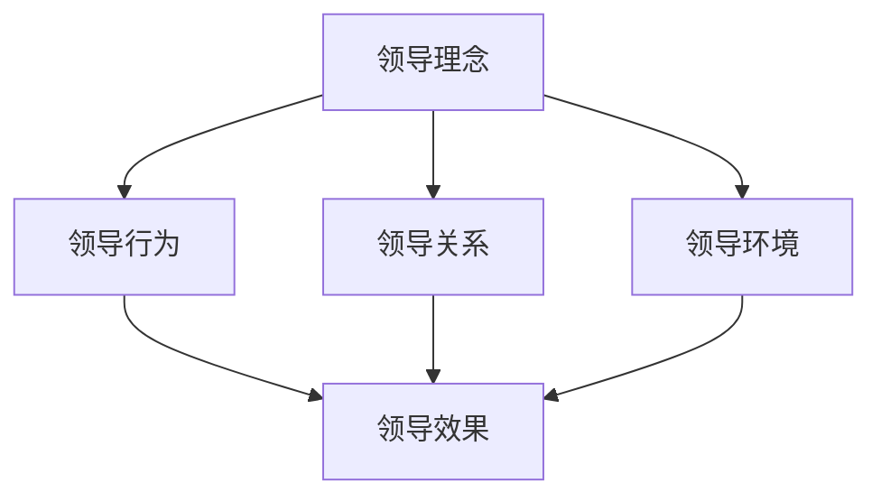

                 

### 标题：领导力与危机预防：未雨绸缪的管理智慧

---

## 关键词
- **领导力**
- **危机预防**
- **管理智慧**
- **未雨绸缪**
- **组织绩效**
- **风险识别**
- **应急预案**

---

## 摘要
本文深入探讨了领导力与危机预防之间的关系，旨在为管理者提供理论依据和实践指南。文章首先介绍了领导力的核心概念和领导者所需具备的能力，然后详细阐述了危机预防的基本原则和方法。通过分析领导力在危机预防中的作用，本文提出了有效的领导力模型和危机预防策略，并辅以实际案例，展示了这些策略的应用效果。文章最后总结了领导力与危机预防的融合趋势，以及未来的发展方向。

---

### 目录

1. 引言
2. 领导力基础
   - 2.1 领导力的定义与作用
   - 2.2 领导者特质与能力
   - 2.3 领导力模型概述
3. 危机预防基础
   - 3.1 危机管理的概念与类型
   - 3.2 危机预防的重要性
   - 3.3 危机管理流程
4. 领导力与危机预防的关系
   - 4.1 领导力在危机预防中的作用
   - 4.2 危机预防中的领导力策略
   - 4.3 领导力与危机预防的互动
5. 领导力模型应用
   - 5.1 五要素领导力模型
   - 5.2 服务领导力模型
   - 5.3 共生领导力模型
6. 危机预防策略
   - 6.1 风险识别与评估
   - 6.2 应急预案制定
   - 6.3 演练与培训
   - 6.4 预案调整与优化
7. 案例分析
   - 7.1 某公司危机预防实践
   - 7.2 某组织领导力与危机预防结合的实践
   - 7.3 案例分析与启示
8. 总结与展望
   - 8.1 领导力与危机预防的融合
   - 8.2 未来趋势与挑战
   - 8.3 建议与展望
9. 附录：参考资料与拓展阅读

---

### 引言

领导力与危机预防是现代管理中不可或缺的两个核心概念。领导力关乎组织的发展和绩效，而危机预防则关系到组织的生存与安全。两者之间的关系错综复杂，相辅相成。一个优秀的领导者不仅需要具备卓越的领导力，还需要具备危机预防的意识与能力。本文将从以下几个方面展开讨论：

- 领导力的定义与作用
- 危机预防的基础知识
- 领导力与危机预防的关系
- 领导力模型的应用
- 危机预防策略的实施
- 案例分析
- 总结与展望

通过这些讨论，我们希望为管理者提供一种“未雨绸缪”的管理智慧，帮助他们在复杂多变的环境中取得成功。

### 2.1 领导力的定义与作用

#### 领导力的定义

领导力是一个多维度的概念，它不仅仅涉及个人的影响力，还包括引导力、决策力等多个方面。根据Mermaid流程图，我们可以将领导力分解为以下几个核心要素：

在这个流程图中，领导理念是领导力的核心，它决定了领导者的行为和决策。领导行为是领导者实际采取的行动，而领导关系和领导环境则影响着领导行为的执行效果。最终，领导效果是领导力的综合体现。

#### 领导力的作用

领导力在组织中的作用至关重要。它不仅影响着组织的短期绩效，还决定了组织的长期发展。以下是领导力在组织中的几个关键作用：

- **提高组织效能**：通过有效的领导，领导者可以激发团队成员的潜能，提高工作效率和团队凝聚力，从而提升组织的整体效能。

- **实现组织目标**：领导力的核心目标是实现组织的目标。一个优秀的领导者能够清晰地定义目标，制定战略，并带领团队实现这些目标。

- **促进组织创新**：领导力鼓励创新思维和实践，推动组织在快速变化的环境中持续发展和进步。

### 2.2 领导者特质与能力

#### 领导者特质

领导者需要具备一系列特质，这些特质不仅有助于他们领导团队，还能够增强他们在组织中的影响力。以下是领导者需要具备的几个关键特质：

- **自我认知**：领导者需要深入了解自己的优势和劣势，从而更好地发挥自己的潜力。

- **情感智慧**：情感智慧是指领导者理解和处理自己及他人的情感的能力，这对于建立良好的人际关系至关重要。

- **抗压能力**：领导者需要能够在压力下保持冷静和专注，这有助于他们在危机时刻做出明智的决策。

#### 领导者能力

除了特质，领导者还需要具备一系列能力，这些能力是他们成功领导团队的关键。以下是领导者需要具备的几个关键能力：

- **沟通技巧**：有效的沟通能力是领导者必备的技能，它有助于领导者与团队成员建立信任，传达目标，解决问题。

- **决策能力**：领导者需要能够在复杂和不确定的情况下做出明智的决策。这需要他们具备分析问题的能力，以及对风险和收益的权衡能力。

- **团队管理能力**：领导者需要能够有效地管理团队，包括激励团队成员、解决冲突、提供反馈等。

### 2.3 领导力模型概述

领导力模型是描述领导力理论和实践的框架。不同的领导力模型关注不同的方面，但它们都旨在提高领导者的效能。以下是几种常见的领导力模型：

#### 五要素领导力模型

五要素领导力模型将领导力分解为五个核心要素：领导理念、领导行为、领导关系、领导环境和领导效果。这种模型强调领导力的整体性和综合性，它有助于领导者全面了解领导力的各个方面。

#### 服务领导力模型

服务领导力模型强调领导者作为“服务员”的角色，他们关注团队成员的需求和福祉，致力于创造一个支持和赋能的工作环境。这种模型强调领导者与团队成员之间的互动和合作。

#### 共生领导力模型

共生领导力模型认为，领导者和团队成员之间的关系应该是相互依存和相互促进的。领导者不仅仅要关注团队的目标，还要关注团队成员的个人成长和职业发展。这种模型强调领导力中的“人性”因素。

### 3.1 危机管理的概念与类型

#### 危机管理的定义

危机管理是指组织在面对突发事件或威胁时采取的一系列策略和措施，旨在减轻危机的影响，保护组织的利益和声誉。危机管理通常包括危机预防、危机响应和危机恢复三个阶段。

#### 危机管理的类型

危机管理可以分为以下几种类型：

- **自然灾害危机**：如地震、洪水、台风等自然灾害引发的危机。
- **技术危机**：如系统故障、网络安全事件等技术问题引发的危机。
- **市场危机**：如产品召回、品牌危机等市场问题引发的危机。
- **财务危机**：如财务欺诈、破产等财务问题引发的危机。

### 3.2 危机预防的重要性

危机预防是危机管理的重要组成部分，它旨在降低危机发生的概率和影响。以下是危机预防的重要性的几个方面：

- **降低成本**：有效的危机预防可以减少组织在危机发生时的经济损失和资源浪费。
- **保护声誉**：危机预防有助于维护组织的声誉和公众形象，减少危机对组织的负面影响。
- **提高效率**：通过预防措施，组织可以避免因危机处理而造成的运营中断，提高工作效率。
- **增强抗风险能力**：危机预防有助于提高组织的抗风险能力，使其在面临突发事件时能够更加从容应对。

### 3.3 危机管理流程

危机管理是一个系统的过程，它包括以下关键步骤：

- **危机预防**：通过风险识别、风险评估和预防措施的制定，降低危机发生的概率和影响。
- **危机响应**：在危机发生时，迅速采取措施，控制事态发展，减轻危机的影响。
- **危机恢复**：危机过后，组织需要评估损失，恢复运营，并从中吸取教训，改进危机管理流程。

### 4.1 领导力在危机预防中的作用

领导力在危机预防中扮演着关键角色。以下是领导力在危机预防中的作用：

- **制定危机预防策略**：领导者需要制定有效的危机预防策略，确保组织在面临潜在危机时能够迅速响应。
- **建立危机预防文化**：领导者需要通过行动和沟通，建立一种重视危机预防的组织文化，使全体员工都意识到危机预防的重要性。
- **提升团队抗风险能力**：领导者需要通过培训和实践，提升团队的抗风险能力，使其在面临危机时能够更加从容应对。

### 4.2 危机预防中的领导力策略

在危机预防中，领导者可以采取以下策略：

- **建立健全的危机预防机制**：领导者需要建立一套完善的危机预防机制，包括风险识别、风险评估和预防措施。
- **加强沟通与合作**：领导者需要通过有效的沟通与合作，确保危机预防措施得到全面实施。
- **提供资源支持**：领导者需要提供必要的资源支持，包括资金、技术和人力资源，以确保危机预防措施的有效实施。

### 4.3 领导力与危机预防的互动

领导力与危机预防之间存在密切的互动关系。有效的领导力有助于提升危机预防的效果，而成功的危机预防也有助于巩固领导力。以下是领导力与危机预防的互动关系：

- **领导力促进危机预防**：有效的领导力可以激发员工的积极性和创造力，使其在危机预防中发挥更大的作用。
- **危机预防提升领导力**：成功的危机预防可以增强领导者的声誉和权威，提升其在组织中的影响力。

### 5.1 五要素领导力模型

五要素领导力模型是一个经典的领导力框架，它包括领导理念、领导行为、领导关系、领导环境和领导效果。以下是该模型的详细解释：

- **领导理念**：领导理念是领导者对组织和团队的理念和价值观。它决定了领导者的行为和决策。
- **领导行为**：领导行为是领导者实际采取的行为和决策。它反映了领导者的理念和能力。
- **领导关系**：领导关系是领导者与团队成员之间的关系。良好的领导关系有助于提高团队的凝聚力和工作效率。
- **领导环境**：领导环境是领导者所处的外部环境。领导者需要适应外部环境的变化，并利用外部资源为团队创造有利条件。
- **领导效果**：领导效果是领导行为的最终结果。它反映了领导力的成功与否。

### 5.2 服务领导力模型

服务领导力模型强调领导者作为“服务员”的角色，关注团队成员的需求和福祉。以下是该模型的详细解释：

- **服务理念**：服务理念是领导者对服务的理解和承诺。它决定了领导者如何对待团队成员。
- **服务行为**：服务行为是领导者实际采取的服务行为。它包括倾听、支持、指导和激励团队成员。
- **服务关系**：服务关系是领导者与团队成员之间的互动关系。领导者需要建立一种基于信任和支持的团队氛围。
- **服务环境**：服务环境是领导者为团队成员创造的有利工作环境。它包括提供必要的资源和支持，以及创造积极的工作氛围。
- **服务效果**：服务效果是领导者的服务行为的最终结果。它反映了领导者的服务理念和服务能力。

### 5.3 共生领导力模型

共生领导力模型认为，领导者和团队成员之间的关系应该是相互依存和相互促进的。以下是该模型的详细解释：

- **共生理念**：共生理念是领导者对共生关系的理解和承诺。它决定了领导者如何与团队成员合作。
- **共生行为**：共生行为是领导者与团队成员之间的互动行为。它包括合作、沟通、支持和共同成长。
- **共生关系**：共生关系是领导者与团队成员之间的互动关系。它建立在相互尊重和信任的基础上。
- **共生环境**：共生环境是领导者为团队成员创造的共生环境。它包括提供平等的机会和资源，以及鼓励创新和多样性。
- **共生效果**：共生效果是领导者的共生行为的最终结果。它反映了领导者的共生理念和能力。

### 6.1 风险识别与评估

风险识别与评估是危机预防的重要环节。以下是风险识别与评估的详细步骤：

- **风险识别**：通过调研、数据分析、历史记录等方式，识别组织可能面临的风险。
- **风险评估**：对识别出的风险进行评估，确定其发生的概率和可能的影响。
- **风险分类**：根据风险发生的概率和影响，将风险分为不同的等级，以便采取相应的预防措施。

### 6.2 应急预案制定

应急预案是危机预防的核心组成部分。以下是应急预案制定的详细步骤：

- **预案设计**：根据风险识别与评估的结果，设计应急预案，包括应急响应步骤、资源调配和职责分工。
- **预案演练**：定期进行应急预案演练，确保所有人员熟悉应急流程，提高应急响应能力。
- **预案更新**：根据实际情况，定期更新应急预案，确保其与组织的实际需求相符。

### 6.3 演练与培训

演练与培训是危机预防的关键环节。以下是演练与培训的详细内容：

- **演练**：通过模拟真实的危机场景，检验应急预案的有效性和团队应对能力。
- **培训**：对团队成员进行危机应对技能的培训，包括应急处理、沟通技巧和团队协作能力。

### 6.4 预案调整与优化

预案调整与优化是危机预防的持续过程。以下是预案调整与优化的详细内容：

- **定期审查**：定期审查应急预案，确保其与组织的需求和外部环境相符。
- **持续改进**：根据演练和培训的结果，不断改进应急预案，提高其有效性。
- **反馈机制**：建立有效的反馈机制，鼓励团队成员提出改进建议，并加以实施。

### 7.1 某公司危机预防实践

以下是一个某公司的危机预防实践案例：

- **背景**：该公司是一家高科技企业，面临着技术风险和市场风险。
- **措施**：
  - 建立风险识别与评估机制，定期进行风险评估。
  - 制定详细的应急预案，包括技术故障应急响应和市场营销危机应对。
  - 定期进行应急预案演练，确保团队成员熟悉应急流程。
- **效果**：通过有效的危机预防措施，该公司在面临突发事件时能够迅速响应，降低了危机对组织的负面影响。

### 7.2 某组织领导力与危机预防结合的实践

以下是一个某组织领导力与危机预防结合的实践案例：

- **背景**：该组织是一家跨国企业，面临着复杂的外部环境和内部管理挑战。
- **措施**：
  - 领导者通过有效的沟通和激励，建立了一种重视危机预防的文化。
  - 领导者提供资源支持，确保危机预防措施得到有效实施。
  - 领导者通过培训和实践，提升团队抗风险能力。
- **效果**：通过领导力的有效运用，该组织的危机预防能力得到了显著提升，提高了组织的抗风险能力。

### 7.3 案例分析与启示

通过对上述案例的分析，我们可以得出以下启示：

- **领导力是危机预防的关键**：有效的领导力有助于提升危机预防的效果，领导者需要在危机预防中发挥核心作用。
- **危机预防需要系统化的措施**：危机预防需要建立系统化的措施，包括风险识别、应急预案制定、演练与培训等。
- **持续改进是危机预防的核心**：危机预防是一个持续改进的过程，需要根据实际情况不断调整和优化应急预案。

### 8.1 领导力与危机预防的融合

领导力与危机预防的融合是现代管理的趋势。以下是领导力与危机预防融合的几个方面：

- **领导力提升危机预防能力**：领导力可以提升组织的危机预防能力，使组织在面临危机时能够更加从容应对。
- **危机预防增强领导力**：成功的危机预防可以增强领导者的声誉和权威，提升其在组织中的影响力。

### 8.2 未来趋势与挑战

未来，领导力与危机预防将面临以下趋势与挑战：

- **技术发展**：随着技术的不断进步，危机预防将更加依赖于人工智能和大数据分析等先进技术。
- **全球化**：全球化带来了更多的挑战和机遇，领导者需要具备跨文化的领导能力，以应对全球化的挑战。
- **可持续发展**：可持续发展将成为未来的重要议题，领导者需要关注组织的可持续发展，并在危机预防中融入环保和社会责任。

### 8.3 建议与展望

为了更好地实现领导力与危机预防的融合，我们提出以下建议与展望：

- **加强领导力培训**：组织应该加强领导力培训，提升领导者的危机预防意识和能力。
- **建立危机预防文化**：组织应该建立一种重视危机预防的文化，使全体员工都意识到危机预防的重要性。
- **持续改进应急预案**：组织应该根据实际情况，不断改进应急预案，提高其有效性。
- **关注可持续发展**：领导者应该关注组织的可持续发展，并在危机预防中融入环保和社会责任。

### 附录：参考资料与拓展阅读

- **书籍**：
  - 柯维，《领导者不听我的，怎么办？》
  - 斯蒂芬·罗宾斯，《领导力》

- **论文**：
  - 领导力与危机预防的关系研究
  - 危机管理理论与实践

- **在线资源**：
  - 国际危机管理协会（ICMA）官方网站
  - 领导力与危机预防相关的在线课程和讲座

---

**作者**：AI天才研究院/AI Genius Institute & 禅与计算机程序设计艺术 /Zen And The Art of Computer Programming

---

通过本文的深入探讨，我们希望为管理者提供一种“未雨绸缪”的管理智慧，帮助他们在复杂多变的环境中实现组织的可持续发展和风险规避。

