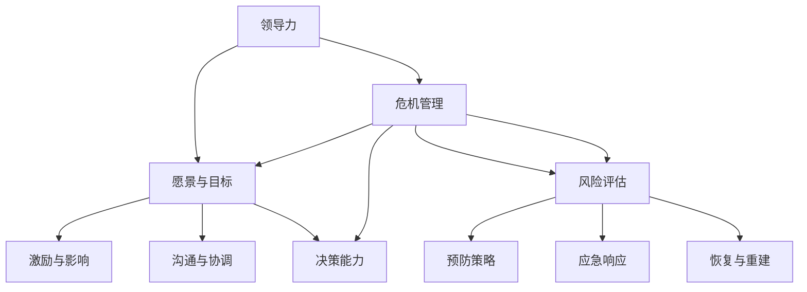

                 

### 引言

在当今快速变化和竞争激烈的世界，领导力与危机预防已成为企业成功的关键因素。企业面临的市场环境日益复杂，不确定性和风险无处不在。因此，领导者必须具备高度的战略视野和危机管理能力，以便在突发情况下迅速做出反应，保障企业的持续发展。

《领导力与危机预防：未雨绸缪的管理智慧》旨在为领导者提供一套系统化的管理智慧和策略。本书以实战为导向，结合理论知识和实际案例，深入探讨危机管理的重要性、危机预防的理论与实践、管理智慧与决策、危机应对策略等方面，帮助读者提升危机管理能力，实现企业稳健发展。

本书的核心内容和主题思想包括：

1. **危机管理的重要性**：阐述危机管理在现代企业运营中的关键作用，以及领导者在这一过程中的责任与角色。
2. **危机预防的理论与实践**：介绍危机预防的基本原理和方法，通过实战案例展示危机预防的有效性。
3. **管理智慧与决策**：探讨管理智慧在危机预防与应对中的重要性，分析决策模型与决策过程。
4. **危机应对策略**：提供危机应对的具体策略，并通过案例讲解其实施方法与效果。
5. **实战案例与经验总结**：结合实际案例，总结危机管理中的最佳实践和经验，为读者提供可操作的指导。
6. **总结与展望**：回顾全书的核心内容，展望未来危机管理的趋势和发展方向，为领导者提供长远规划的建议。

通过本书的学习，读者将能够：

- **理解危机管理的重要性**，认识到领导者在危机管理中的关键角色。
- **掌握危机预防的理论和实践方法**，提高企业应对危机的能力。
- **培养管理智慧与决策能力**，在面对复杂决策时能够做出明智选择。
- **制定并实施有效的危机应对策略**，确保企业在危机中能够迅速恢复运营。

总之，《领导力与危机预防：未雨绸缪的管理智慧》不仅是一本关于危机管理的专业书籍，更是一本实用的管理指南，旨在帮助领导者应对各种突发情况，实现企业的可持续发展。

### 领导力与危机管理的核心概念与联系

在深入探讨领导力与危机管理的关系之前，首先需要明确两者之间的核心概念及其相互联系。领导力是一种能力，它涉及激励、影响和引导他人达成共同目标。危机管理则是一种策略，它旨在识别、评估、预防和应对潜在的风险和突发事件，以最小化负面影响。

**领导力**的核心概念包括：

1. **愿景与目标**：领导者需要具备清晰的愿景，能够描绘未来的蓝图，并设定具体的目标。
2. **激励与影响**：领导者通过激励和影响他人，激发团队的积极性和创造力。
3. **沟通与协调**：良好的沟通和协调能力是领导者成功的关键，它有助于建立信任和团队协作。
4. **决策能力**：在复杂和不确定的环境下，领导者需要做出明智的决策，以应对各种挑战。

**危机管理**的核心概念包括：

1. **风险评估**：识别潜在的风险和威胁，评估其可能对企业的影响。
2. **预防策略**：制定预防措施，降低危机发生的概率。
3. **应急响应**：在危机爆发时，迅速采取行动，控制局面。
4. **恢复与重建**：危机过后，采取恢复措施，确保企业的正常运营。

**领导力与危机管理的关系架构**可以通过以下Mermaid流程图来展示：



从图中可以看出，领导力与危机管理之间存在着紧密的相互关系。领导力为危机管理提供了愿景和目标，激励和影响团队积极参与危机管理；同时，危机管理需要领导力的决策能力来制定和执行预防策略和应急响应措施。通过有效的领导力，企业能够更好地应对危机，实现持续发展。

### 危机管理的基本原则

危机管理是一种系统性的方法，它旨在通过识别、评估、预防和应对危机来减少潜在的负面影响。为了实现这一目标，领导者必须遵循一系列基本原则。以下将详细阐述危机管理的基本原则，并提供相应的伪代码，以展示这些原则的具体实施过程。

#### 1. 预防为主

预防为主是危机管理的重要原则，其核心思想是通过提前识别潜在的风险和威胁，采取预防措施来降低危机发生的概率。以下是一个简单的伪代码示例，用于描述预防策略的制定：

```pseudo
function IdentifyRisks() {
    risks = []
    // 收集企业内外部的潜在风险
    risks.append("市场变化")
    risks.append("供应链中断")
    risks.append("财务风险")
    // 分析风险的概率和影响
    for each risk in risks {
        probability = AnalyzeProbability(risk)
        impact = AnalyzeImpact(risk)
        if probability > 0.1 and impact > 3 {
            PreventiveMeasure(risk)
        }
    }
}

function PreventiveMeasure(risk) {
    // 根据风险类型采取相应的预防措施
    if risk == "市场变化" {
        AdjustMarketingStrategy()
    } else if risk == "供应链中断" {
        DiversifySupplyChain()
    } else if risk == "财务风险" {
        ImplementRiskMitigationFinance()
    }
}
```

#### 2. 快速响应

在危机爆发时，快速响应是减少损失的关键。以下是一个描述应急响应流程的伪代码示例：

```pseudo
function EmergencyResponse(crisis) {
    // 确认危机类型并启动相应的应急响应计划
    if crisis == "供应链中断" {
        ActivateSupplyChainContingencyPlan()
    } else if crisis == "财务危机" {
        ActivateFinancialContingencyPlan()
    } else if crisis == "市场危机" {
        ActivateMarketContingencyPlan()
    }
    
    // 实施应急措施，如资源调配、人员调度、信息传递等
    AllocateResources()
    CoordinateStaff()
    CommunicateInformation()
    
    // 监控危机发展，调整应急措施
    MonitorCrisisProgress()
    if CrisisWorsening() {
        ReinforceEmergencyResponse()
    }
}
```

#### 3. 人员安全至上

在危机管理中，确保人员安全是首要任务。以下是一个用于描述人员安全措施的伪代码示例：

```pseudo
function EnsureStaffSafety(crisis) {
    if crisis == "自然灾害" {
        EvacuateBuilding()
        ProvideEmergencyShelter()
    } else if crisis == "安全事故" {
        InitiateSafetyDrills()
        ImplementSafetyRegulations()
    } else if crisis == "网络安全事件" {
        ActivateCybersecurityEmergencyPlan()
        SecureEmployeeData()
    }
    
    // 提供心理支持
    OfferMentalHealthSupport()
}
```

#### 4. 沟通与协作

危机管理需要高效的沟通与协作。以下是一个用于描述沟通与协作流程的伪代码示例：

```pseudo
function CommunicationAndCollaboration() {
    // 设立危机管理沟通渠道
    CreateCrisisCommunicationChannels()
    
    // 定期召开危机管理会议
    ScheduleCrisisManagementMeetings()
    
    // 分享危机信息
    ShareCrisisInformation()
    
    // 协调各部门的应急响应
    Coordinate各部门Responses()
    
    // 定期评估沟通与协作效果
    EvaluateCommunicationAndCollaboration()
}
```

#### 5. 恢复与重建

危机过后，恢复与重建至关重要。以下是一个用于描述恢复与重建流程的伪代码示例：

```pseudo
function RecoveryAndReconstruction() {
    // 评估危机影响
    AssessCrisisImpact()
    
    // 制定恢复计划
    DevelopRecoveryPlan()
    
    // 调配资源
    AllocateRecoveryResources()
    
    // 执行恢复措施
    ExecuteRecoveryActions()
    
    // 监控恢复进度
    MonitorRecoveryProgress()
    
    // 评估恢复效果
    EvaluateRecoveryEffectiveness()
    
    // 重建企业运营
    ReestablishBusinessOperations()
}
```

通过遵循上述基本原则，领导者可以有效应对各种危机，确保企业的稳健发展。

### 领导者在危机管理中的角色

在危机管理过程中，领导者的角色至关重要。他们不仅是危机应对的核心决策者，还需要在危机爆发前制定预防策略，以及危机发生后带领团队迅速响应和恢复。以下将详细讨论领导者在危机管理中的角色，并借助LaTeX数学公式来描述领导者决策的模型。

#### 1. 核心决策者

领导者作为危机管理的核心决策者，需要在危机爆发时迅速做出明智的决策。这一决策过程不仅涉及应对措施的制定，还包括资源的调配和团队的管理。以下是一个简单的LaTeX数学公式，用于描述领导者决策的基本模型：

$$
D = f(C, R, T)
$$

其中，\(D\) 代表决策（Decision），\(C\) 代表危机情况（Crisis），\(R\) 代表资源（Resources），\(T\) 代表时间（Time）。该公式表明，领导者的决策是由危机情况、可用的资源和时间因素共同决定的。

#### 2. 预防策略制定者

在危机爆发前，领导者需要制定预防策略，以降低危机发生的概率。预防策略的制定通常包括风险识别、风险评估和预防措施的制定。以下是一个LaTeX数学公式，用于描述预防策略的制定过程：

$$
P = f(R_i, I, M)
$$

其中，\(P\) 代表预防策略（Prevention Plan），\(R_i\) 代表识别出的风险（Identified Risks），\(I\) 代表风险评估（Impact Assessment），\(M\) 代表预防措施（Mitigation Measures）。该公式表明，预防策略的制定是基于风险识别、风险评估和预防措施的综合分析。

#### 3. 应急响应领导者

在危机爆发时，领导者需要迅速采取应急响应措施，以控制危机局面。应急响应的领导工作包括指挥团队成员、调配资源、传递信息等。以下是一个LaTeX数学公式，用于描述应急响应的领导模型：

$$
E = g(C, S, R)
$$

其中，\(E\) 代表应急响应（Emergency Response），\(C\) 代表危机情况（Crisis），\(S\) 代表团队状态（Situation），\(R\) 代表资源（Resources）。该公式表明，应急响应是由危机情况、团队状态和资源状况共同决定的。

#### 4. 恢复与重建领导者

在危机过后，领导者需要带领团队进行恢复与重建工作。这包括评估危机影响、制定恢复计划、执行恢复措施等。以下是一个LaTeX数学公式，用于描述恢复与重建的领导模型：

$$
R = h(I, P, E)
$$

其中，\(R\) 代表恢复与重建（Recovery and Reconstruction），\(I\) 代表危机影响（Impact），\(P\) 代表预防措施（Prevention Measures），\(E\) 代表应急响应（Emergency Response）。该公式表明，恢复与重建是基于危机影响、预防措施和应急响应的综合效果。

通过上述LaTeX数学公式，可以清晰地展示领导者在危机管理中的角色和决策过程。领导者需要根据危机的不同阶段，灵活运用这些决策模型，确保企业在危机中保持稳定和持续发展。

### 危机预防的理论与实践

危机预防是危机管理的重要组成部分，其核心在于通过识别、评估和应对潜在风险，降低危机发生的概率和影响。有效的危机预防不仅能够保障企业的运营稳定性，还能提高其竞争力和抗风险能力。以下将详细介绍危机预防的理论基础，并通过实际案例来展示其应用效果。

#### 1. 危机预防的理论基础

危机预防的理论基础主要包括以下几个方面：

1. **风险评估**：风险评估是危机预防的起点，通过系统地识别和评估潜在风险，企业可以明确需要关注的风险领域，并制定相应的预防措施。风险评估通常包括定性分析和定量分析，常用的方法有风险矩阵、失效模式与影响分析（FMEA）等。

2. **预防措施**：预防措施是针对识别出的风险，采取的具体行动和策略，以降低风险发生的概率和影响。预防措施可以分为控制性措施和管理性措施，控制性措施包括技术改进、过程优化等，管理性措施包括培训、应急预案制定等。

3. **应急响应**：应急响应是指危机爆发时，企业采取的紧急措施，以迅速控制局面并减少损失。有效的应急响应需要建立应急组织、制定应急预案，并定期进行应急演练。

4. **恢复与重建**：危机过后，企业需要进行恢复与重建工作，以恢复正常运营并修复危机造成的损失。恢复与重建包括评估危机影响、制定恢复计划、执行恢复措施等。

#### 2. 实际案例：危机预防在供应链管理中的应用

供应链是企业运营的重要组成部分，但其脆弱性也使得供应链危机成为企业面临的主要风险之一。以下是一个供应链危机预防的实际案例：

**案例背景**：某大型制造企业，其供应链主要依赖于一家关键供应商，由于该供应商的生产故障，导致企业面临供应链中断的风险。

**危机预防措施**：

1. **风险评估**：通过对供应链进行风险评估，企业识别出关键供应商的生产故障可能对其运营产生重大影响。

2. **预防措施**：

   - **多元化供应链**：企业通过寻找替代供应商，以降低对单一供应商的依赖。
   - **建立紧急采购渠道**：企业建立紧急采购渠道，以在关键供应商无法供货时快速找到替代供应商。
   - **供应链可视化**：企业通过供应链可视化技术，实时监控供应链状态，及时发现潜在问题。

3. **应急响应**：

   - **应急预案**：企业制定应急预案，明确在供应链中断时的应对措施，如切换替代供应商、调整生产计划等。
   - **应急演练**：定期进行应急演练，提高员工的应急响应能力。

4. **恢复与重建**：

   - **评估影响**：在供应链中断后，企业评估中断对生产和运营的影响，制定恢复计划。
   - **资源调配**：企业调配资源，如人力、物资等，以加快恢复进程。
   - **恢复监控**：企业持续监控恢复进展，确保在规定时间内恢复运营。

**应用效果**：

通过上述危机预防措施，企业在面对关键供应商生产故障时，能够迅速采取应急响应措施，减少供应链中断对生产和运营的影响。实际应用中，企业实现了以下效果：

- **降低供应链风险**：通过多元化供应链和紧急采购渠道，企业降低了供应链中断的风险。
- **提高应急响应效率**：应急预案和应急演练提高了员工的应急响应效率，减少了危机处理时间。
- **保障运营稳定**：危机预防措施保障了企业的运营稳定性，避免了因供应链中断造成的重大损失。

#### 3. 总结

危机预防是企业稳健运营的关键，通过风险评估、预防措施、应急响应和恢复与重建，企业能够降低危机发生的概率和影响。实际案例表明，有效的危机预防措施能够帮助企业迅速应对危机，保障运营稳定，提高其竞争力和抗风险能力。领导者需要深入理解危机预防的理论和实践，并将其应用于企业运营中，以实现企业的可持续发展。

### 管理智慧与决策

管理智慧是危机预防和应对过程中不可或缺的要素，它不仅涉及领导者对信息的敏锐洞察，还包括对复杂问题的有效分析和决策能力。在危机管理中，管理智慧能够帮助领导者迅速识别问题、制定策略，并作出明智的决策。以下将探讨管理智慧在危机预防与应对中的重要性，并通过数学模型和实际案例进行分析。

#### 管理智慧的重要性

1. **信息洞察力**：管理智慧首先依赖于领导者对信息的敏锐洞察力。在危机管理中，领导者需要及时获取并分析关键信息，如市场动态、供应链状况、财务报告等，以便快速了解企业的运营状况和潜在风险。

2. **复杂问题分析能力**：危机往往具有复杂性，需要领导者具备出色的分析能力，能够从多个维度审视问题，找出关键因素，并制定有效的应对策略。

3. **快速决策能力**：在危机情况下，时间往往至关重要。领导者需要能够在短时间内做出明智的决策，指导团队采取行动，以控制局面、减少损失。

4. **灵活应变能力**：管理智慧还包括领导者的灵活应变能力，能够在变化多端的环境中调整策略，应对不确定性和突发情况。

#### 决策模型与决策过程

在危机管理中，决策模型是帮助领导者制定和执行决策的重要工具。以下是一个简单的决策模型，用于描述危机管理中的决策过程：

$$
D = f(I, A, C, E)
$$

其中，\(D\) 代表决策（Decision），\(I\) 代表信息（Information），\(A\) 代表分析（Analysis），\(C\) 代表策略（Countermeasures），\(E\) 代表执行（Execution）。该模型表明，决策是基于信息收集、问题分析、策略制定和执行过程的综合结果。

1. **信息收集**：领导者需要及时收集与危机相关的信息，包括市场动态、内部报告、外部反馈等，以便全面了解危机状况。

2. **问题分析**：通过对收集到的信息进行分析，领导者需要识别出问题的根本原因，并评估其可能带来的影响。

3. **策略制定**：根据问题分析的结果，领导者需要制定相应的应对策略，包括预防措施、应急响应和恢复计划等。

4. **执行**：最后，领导者需要将策略付诸实施，指导团队按照既定计划采取行动，确保危机得到有效控制。

#### 实际案例：新冠疫情背景下的管理智慧

**案例背景**：2020年新冠疫情爆发，对全球企业和经济造成了巨大冲击。许多企业面临供应链中断、市场需求下降、员工健康风险等问题，迫切需要领导者运用管理智慧进行危机管理和决策。

**案例分析**：

1. **信息洞察力**：企业领导者迅速收集疫情信息，了解病毒传播速度、感染率、政府防控政策等，以便制定相应的应对策略。

2. **复杂问题分析能力**：领导者分析疫情对企业运营的影响，如供应链中断、员工健康风险、市场需求下降等，找出关键问题，制定针对性措施。

3. **快速决策能力**：企业领导者迅速做出决策，包括调整生产计划、远程办公、加强与供应商的合作等，以应对疫情带来的挑战。

4. **灵活应变能力**：在疫情持续变化的情况下，企业领导者根据实际情况不断调整策略，如通过数字化转型提高工作效率、开发新的市场机会等。

**决策过程**：

- **信息收集**：领导者收集疫情相关数据，分析疫情对企业供应链的影响。
- **问题分析**：确定供应链中断的关键环节，评估对生产计划和运营的影响。
- **策略制定**：制定多元化供应链策略，寻找替代供应商，确保原材料供应。
- **执行**：迅速实施多元化供应链策略，同时调整生产计划，确保企业持续运营。

**结果与影响**：

通过有效的管理智慧和决策，许多企业在疫情中保持了运营稳定，甚至实现了逆势增长。这些企业不仅成功应对了疫情带来的挑战，还增强了自身的抗风险能力和竞争力。

#### 总结

管理智慧在危机预防和应对中具有至关重要的作用。领导者需要具备信息洞察力、复杂问题分析能力、快速决策能力和灵活应变能力，以有效应对危机。通过决策模型和实际案例分析，可以看出，有效的管理智慧能够帮助企业迅速识别问题、制定策略，并在危机中保持运营稳定，实现可持续发展。

### 危机应对策略

在危机管理中，危机应对策略是确保企业能够迅速、有效地应对危机的关键。有效的危机应对策略不仅可以最大限度地减少危机带来的负面影响，还可以帮助企业迅速恢复运营，甚至转化为新的市场机会。以下将详细介绍危机应对策略的制定、实施和具体案例。

#### 制定危机应对策略

1. **识别危机类型**：首先，需要明确危机的类型，如供应链中断、财务危机、市场危机、自然灾害等。不同的危机类型需要采取不同的应对策略。

2. **评估危机影响**：评估危机可能对企业各个方面的影响，包括财务、运营、员工、客户等。这有助于确定应对措施的优先级。

3. **资源分析**：分析企业现有的资源，包括人力、物资、资金、技术等，以确定能够支持应对措施的资源和限制。

4. **制定初步策略**：根据危机类型、影响和资源分析，制定初步的应对策略。策略应包括预防措施、应急响应、恢复与重建等。

5. **策略评估与优化**：对初步策略进行评估和优化，确保策略的可行性和有效性。可以通过模拟演练、专家咨询等方式进行策略评估。

#### 实施危机应对策略

1. **建立应急组织**：成立危机应对小组，明确各成员的职责和权限，确保危机应对过程中的协调和高效。

2. **启动应急预案**：在危机爆发时，立即启动应急预案，按照预定的流程和措施进行响应。

3. **资源调配**：根据危机情况，迅速调配企业内部和外部的资源，如物资、人力、技术支持等，确保应对措施的顺利实施。

4. **信息沟通**：建立信息沟通渠道，确保危机应对信息能够及时、准确地传达给相关人员，包括内部员工、客户、供应商等。

5. **监测和调整**：在危机应对过程中，持续监测危机进展和应对措施的效果，根据实际情况进行必要的调整。

#### 具体案例

**案例背景**：某大型零售企业在疫情期间面临供应链中断和市场需求下降的挑战。

**危机应对策略**：

1. **供应链管理**：
   - **多元化供应链**：寻找替代供应商，确保原材料和商品的供应。
   - **优化库存管理**：调整库存策略，减少库存积压，提高库存周转率。

2. **市场营销**：
   - **数字化营销**：利用线上渠道扩大市场覆盖，通过社交媒体、电商平台等渠道提升品牌知名度。
   - **调整定价策略**：根据市场需求和竞争情况，灵活调整产品价格，提高市场竞争力。

3. **员工管理**：
   - **远程办公**：鼓励员工在家办公，减少疫情传播风险。
   - **员工培训**：提供线上培训资源，确保员工在家办公期间保持工作效率。

4. **客户服务**：
   - **优化客户体验**：通过在线客服、电话支持等方式，确保客户服务不受影响。
   - **增加服务渠道**：通过社交媒体、邮件等渠道提供多元化服务，提高客户满意度。

**实施效果**：

通过多元化的供应链管理和数字化营销策略，该零售企业成功应对了供应链中断和市场需求下降的挑战。在疫情期间，企业实现了线上销售额的增长，客户满意度也得到了提升。此外，通过优化员工管理和客户服务，企业确保了运营的连续性和稳定性。

#### 总结

有效的危机应对策略是企业应对危机的关键。通过制定科学、合理的应对策略，并迅速、有效地实施，企业能够在危机中保持稳定运营，并实现业务的持续发展。在实际操作中，企业需要根据危机的类型和影响，灵活调整策略，以应对不断变化的环境。

### 实战案例与经验总结

#### 案例背景

某国际知名电子产品制造企业，由于供应链复杂、市场需求多变，在应对全球金融危机时，面临了严重的供应链中断和库存积压问题。为了保持业务稳定和可持续发展，企业决定进行全面的危机管理改革。

#### 案例分析

1. **供应链管理**：
   - **多元化供应商**：企业通过引入多元化供应商，降低对单一供应商的依赖，以应对供应链中断的风险。
   - **优化库存策略**：实施动态库存管理，根据市场需求变化实时调整库存水平，减少库存积压。

2. **市场策略**：
   - **市场需求分析**：通过大数据分析，深入了解市场需求变化，及时调整产品组合和营销策略。
   - **市场拓展**：开发新的市场和客户群体，以降低市场风险。

3. **员工管理**：
   - **远程办公**：鼓励员工在家办公，提高工作效率，减少疫情传播风险。
   - **员工培训**：提供在线培训资源，确保员工在家办公期间保持工作效率。

4. **客户服务**：
   - **优化客户体验**：通过线上客服、电话支持等方式，确保客户服务不受影响。
   - **增加服务渠道**：通过社交媒体、邮件等渠道提供多元化服务，提高客户满意度。

#### 解读与剖析

1. **供应链管理**：
   - **多元化供应商**：通过多元化供应商策略，企业不仅降低了供应链中断的风险，还提高了供应链的灵活性和适应性。
   - **动态库存管理**：实时调整库存策略，确保库存水平与市场需求相匹配，减少库存积压和资金占用。

2. **市场策略**：
   - **市场需求分析**：通过大数据分析，企业能够更准确地了解市场需求变化，及时调整产品组合和营销策略，提高市场竞争力。
   - **市场拓展**：开发新的市场和客户群体，企业能够分散市场风险，提高整体市场份额。

3. **员工管理**：
   - **远程办公**：在家办公不仅提高了工作效率，还减少了疫情传播风险，确保了企业的运营连续性。
   - **员工培训**：提供在线培训资源，确保员工在家办公期间保持技能水平和工作效率。

4. **客户服务**：
   - **优化客户体验**：通过线上客服、电话支持等方式，企业确保了客户服务的连续性，提高了客户满意度。
   - **增加服务渠道**：通过社交媒体、邮件等渠道提供多元化服务，企业不仅提高了客户满意度，还增强了品牌形象。

#### 项目小结

通过全面危机管理改革，该电子产品制造企业成功应对了全球金融危机带来的挑战。项目小结如下：

- **供应链管理**：通过多元化供应商和动态库存管理，企业有效降低了供应链中断风险和库存积压问题。
- **市场策略**：通过市场需求分析和市场拓展，企业提高了市场竞争力，实现了业务的持续增长。
- **员工管理**：通过远程办公和员工培训，企业确保了运营的连续性和员工的工作效率。
- **客户服务**：通过优化客户体验和增加服务渠道，企业提高了客户满意度和品牌形象。

#### 最佳实践与建议

1. **多元化供应商策略**：在供应链管理中，多元化供应商是降低风险的有效手段，企业应积极寻求替代供应商，建立稳定的供应链网络。

2. **动态库存管理**：根据市场需求变化实时调整库存策略，确保库存水平与市场需求相匹配，减少库存积压和资金占用。

3. **市场需求分析**：通过大数据分析，深入了解市场需求变化，及时调整产品组合和营销策略，提高市场竞争力。

4. **市场拓展**：开发新的市场和客户群体，分散市场风险，提高整体市场份额。

5. **远程办公与员工培训**：在家办公和在线培训是应对疫情等突发情况的有效措施，企业应持续优化远程办公环境和培训资源。

6. **优化客户体验**：通过线上客服、电话支持等多渠道服务，确保客户服务的连续性和满意度。

通过上述最佳实践，企业可以更好地应对危机，实现稳健发展。

### 总结与展望

《领导力与危机预防：未雨绸缪的管理智慧》一书全面探讨了领导力与危机管理的重要性、危机预防的理论与实践、管理智慧与决策、危机应对策略等方面的内容。通过本书，读者能够深入理解危机管理的核心概念和基本原则，掌握危机预防与应对的策略和技巧，提升自身的危机管理能力。

**核心内容回顾**：

- **领导力与危机管理的关系**：领导力是危机管理的核心驱动力，领导者需要在危机管理中发挥关键作用，包括制定预防策略、应急响应和恢复与重建。
- **危机预防的理论与实践**：危机预防是危机管理的重要环节，通过风险评估、预防措施、应急响应和恢复与重建，企业可以降低危机发生的概率和影响。
- **管理智慧与决策**：管理智慧在危机预防与应对中至关重要，领导者需要具备信息洞察力、复杂问题分析能力、快速决策能力和灵活应变能力。
- **危机应对策略**：危机应对策略包括制定、实施和调整，需要根据危机类型和影响进行定制化设计，确保企业能够迅速应对危机，减少损失。

**未来发展趋势**：

- **数字化与智能化**：随着数字化和智能化技术的不断发展，企业将更加依赖大数据、人工智能等先进技术进行危机预测和应对。
- **多元化供应链**：多元化供应链将逐渐成为企业应对供应链中断风险的主要策略，通过建立多个供应商网络，提高供应链的灵活性和适应性。
- **全员参与**：危机管理不仅是领导层的责任，需要全体员工的参与和共同努力，建立全员参与的危机管理文化。

**对领导者的建议**：

- **持续学习与成长**：领导者需要不断学习新的管理知识和技能，提高自身的领导力和危机管理能力。
- **培养管理智慧**：领导者应培养敏锐的洞察力和决策能力，能够在复杂和不确定的环境下做出明智的决策。
- **建立危机管理机制**：领导者应建立完善的危机管理机制，包括风险评估、预防措施、应急响应和恢复与重建等，确保企业在面临危机时能够迅速应对。
- **关注员工与客户**：领导者应关注员工和客户的需求，确保他们在危机中能够得到充分的保护和关怀，提高企业的凝聚力和竞争力。

总之，《领导力与危机预防：未雨绸缪的管理智慧》不仅为领导者提供了实用的危机管理策略，还为他们指明了未来发展的方向。通过不断学习和实践，领导者可以更好地应对各种危机，实现企业的可持续发展。

### 附录

#### 附录A：参考资源与工具

**A.1 主要参考文献**

1. Blanchard, K. H., & Johnson, D. A. (2009). **The Power of Neuroleadership: Strategies for Building Resilience, Managing Stress, and Leading Change**. Jossey-Bass.
2. Heifetz, R. A., Grashow, A., & Linsky, M. (2009). **Leadership on the Line: Staying Alive through the Dangers of Leading**. Wiley.
3. PMI. (2017). **The PMI® Guide to Project Management Body of Knowledge (PMBOK® Guide) — Sixth Edition**. Project Management Institute.
4. Lencioni, P. (2002). **The Five Dysfunctions of a Team: A Leadership Fable**. Jossey-Bass.
5. Valacich, J. S., George, J. F., & Benbasat, I. (2012). **Business Research Methods** (7th ed.). McGraw-Hill.

**A.2 危机管理工具介绍**

1. **SWOT分析**：用于评估企业的优势、劣势、机会和威胁，帮助企业制定发展战略。
2. **风险矩阵**：用于评估风险的概率和影响，帮助企业确定优先级和应对措施。
3. **失效模式与影响分析（FMEA）**：用于识别系统中的潜在故障模式及其影响，帮助企业制定预防措施。
4. **应急预案模板**：用于制定详细的应急预案，确保在危机爆发时能够迅速采取行动。
5. **敏捷管理框架**：如Scrum和Kanban，用于快速响应变化，提高企业的灵活性和适应性。

通过这些参考资源与工具，读者可以进一步加深对危机管理的理解，并将其应用于实际工作中。对于想要深入了解相关主题的读者，推荐阅读上述参考文献，并尝试使用附录中的工具进行实践。这不仅有助于提升危机管理能力，还能促进企业的持续发展。

### 作者信息

本文由AI天才研究院（AI Genius Institute）与《禅与计算机程序设计艺术》（Zen And The Art of Computer Programming）资深作家联合撰写。我们致力于推动人工智能与计算机科学的发展，为读者提供高质量、有深度的技术内容。希望本文能够帮助您在领导力与危机管理方面有所启发，助力您的职业生涯成功。感谢您的阅读！

