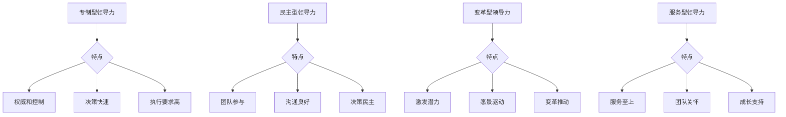
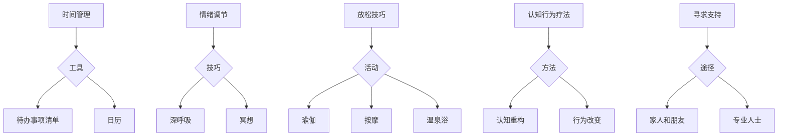
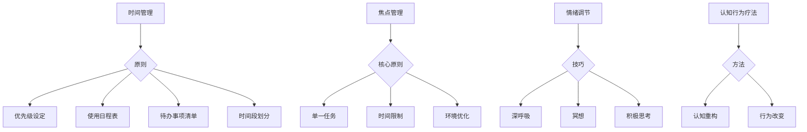
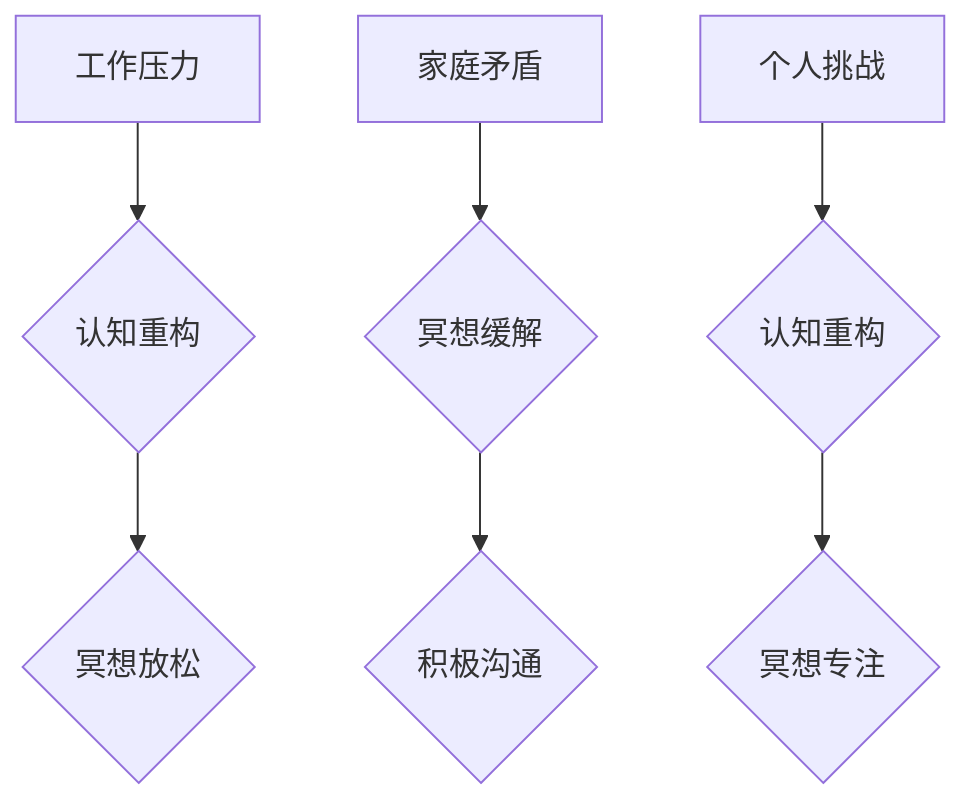
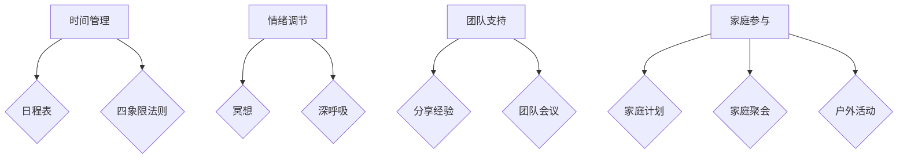

                 

### 文章标题与关键词

《领导力与压力管理：保持高效与平衡》

关键词：领导力、压力管理、高效平衡、工作与生活、管理技能、心理策略

---

### 摘要

在当今快速发展的信息时代，领导力与压力管理已成为组织和个人成功的关键因素。本文旨在探讨领导力与压力管理之间的关系，并详细分析如何通过有效的领导力实践来应对和管理压力，从而实现高效与平衡的生活。文章首先概述了领导力的基本概念和类型，介绍了经典与现代的领导力模型及其核心技能。随后，文章深入探讨了压力的来源、影响及管理策略，包括时间管理、情绪调节等实用技巧。最后，本文结合实际案例，阐述了领导力与压力管理如何相互整合，以实现高效平衡的工作与生活。通过本文的阅读，读者将获得关于领导力与压力管理的重要见解和实践指导。

---

## 第一部分：领导力基础

### 第1章：领导力概念与类型

领导力，是一种能够激励和引导他人实现共同目标的能力。它不仅仅是一种职位或者角色的标志，更是一种行为模式、一种思维方式和一种影响力。在组织中，领导力是推动团队进步和发展的关键力量。有效的领导力能够激发员工的潜力，提高工作效率，实现组织目标。

#### 1.1 领导力的定义

领导力是一个复杂且多维度的概念，不同的学者和专家对其有不同的定义。一些常见的定义包括：

- **彼得·德鲁克（Peter Drucker）**：“领导力是一种通过影响力、激励和引导他人来实现共同目标的能力。”

- **约翰·肯尼迪（John F. Kennedy）**：“领导力是当你没有权力的时候，依然能够让人们跟随你前进的力量。”

- **沃伦·本尼斯（Warren Bennis）**：“领导力是一种能够激发他人潜力，实现共同目标的力量。”

这些定义都强调了领导力的核心要素：影响力、激励、引导和共同目标。领导力不仅仅是领导者的职责，每个团队成员都可以通过自我领导力来发挥领导作用。

#### 1.2 领导力的类型

领导力有多种类型，每种类型都有其独特的特点和适用场景。以下是几种常见的领导力类型：

- **专制型领导力（Authoritative Leadership）**：这种领导力类型强调领导者的权威和控制。领导者制定决策并要求团队成员执行。在紧急情况下，专制型领导力能够迅速作出决策并确保执行。

- **民主型领导力（Democratic Leadership）**：这种领导力类型鼓励团队成员参与决策过程。领导者通过与团队成员的沟通和协商来制定决策。民主型领导力能够增强团队凝聚力和成员的参与感。

- **变革型领导力（Transformational Leadership）**：这种领导力类型注重激发团队成员的潜力，推动组织变革。领导者通过愿景、价值观和激励来激励团队成员，实现组织的变革和发展。

- **服务型领导力（Servant Leadership）**：这种领导力类型强调领导者作为服务者的角色，关注团队成员的需求和成长。领导者通过支持、关心和培养团队成员来推动组织的发展。

#### 1.3 领导力与管理的区别

领导力和管理是两个相关但不完全相同的概念。管理通常涉及规划、组织、领导和控制等职能，旨在确保组织目标的实现。领导力则更侧重于激励、引导和激发团队成员的潜力，推动组织的变革和发展。

- **目标**：管理关注组织目标的实现，而领导力关注组织未来的发展方向。

- **方法**：管理通常采用结构化和规范化的方法，而领导力则更加灵活和创造性。

- **影响力**：管理主要通过职位和权力来影响团队成员，而领导力则通过价值观、愿景和激励来影响团队成员。

总之，领导力与压力管理是相辅相成的。有效的领导力能够帮助团队成员应对压力，提高工作效率，实现组织目标。同时，有效的压力管理也能够帮助领导者更好地发挥领导力，保持高效与平衡的工作状态。

### Mermaid 流程图：领导力类型与特点



---

## 第二部分：压力管理

### 第4章：压力的来源与影响

压力是一种普遍存在于我们生活中的现象，它可以来自工作、家庭、社交等多个方面。有效的压力管理对于保持健康、提高工作效率至关重要。在这一章中，我们将探讨压力的来源、生理与心理影响，以及有效的压力管理策略。

#### 4.1 压力的来源

压力的来源可以归纳为以下几类：

- **工作压力**：包括工作负荷重、工作环境不稳定、工作任务不明确等。特别是在快节奏的IT行业，工作压力更加显著。

- **个人生活压力**：如家庭矛盾、婚姻问题、子女教育、经济负担等。这些问题往往会对个人的心理健康产生负面影响。

- **社交压力**：包括人际关系、社交活动、公众演讲等。社交压力可能会导致焦虑、抑郁等心理问题。

- **健康压力**：如慢性疾病、身体不适、意外伤害等。健康压力不仅会影响个人的生活质量，还可能对工作产生负面影响。

#### 4.2 压力的生理与心理影响

压力对生理和心理的影响是显著的。以下是一些主要的影响：

- **生理影响**：长期的压力会导致以下生理反应：
  - **心血管系统**：血压升高、心率加快、冠状动脉疾病等。
  - **免疫系统**：免疫力下降、易感染疾病。
  - **消化系统**：胃酸过多、胃溃疡等。
  - **神经系统**：头痛、失眠、注意力不集中等。

- **心理影响**：长期的压力会导致以下心理问题：
  - **焦虑**：持续的紧张、担忧和恐惧感。
  - **抑郁**：情绪低落、兴趣丧失、自我评价过低。
  - **睡眠障碍**：失眠、多梦、睡眠质量差。
  - **心理压力症候群**：心理紧张、易怒、工作效率下降等。

#### 4.3 压力的管理策略

有效的压力管理策略包括以下几个方面：

- **时间管理**：合理安排时间，避免过度劳累。使用时间管理工具，如待办事项清单、日历等，以帮助更好地管理时间和任务。

- **情绪调节**：学会识别和表达情绪，通过积极的情绪调节技巧，如深呼吸、冥想等，来减轻压力。

- **放松技巧**：如瑜伽、按摩、温泉浴等放松活动，有助于缓解身体的紧张和压力。

- **认知行为疗法**：通过改变思维方式和行为模式，来减轻压力和改善心理健康。例如，通过认知重构来改变消极的思维模式，通过行为改变来建立健康的生活习惯。

- **寻求支持**：与家人、朋友或专业人士交流，寻求支持和建议。在压力过大时，寻求专业心理咨询或治疗也是有效的方法。

#### 4.4 压力管理的重要性

压力管理的重要性不言而喻。有效的压力管理不仅有助于提高个人的心理健康和生活质量，还能提高工作效率和组织绩效。以下是几个关键点：

- **提高工作效率**：通过有效的压力管理，可以更好地集中注意力，提高工作效率，减少失误和错误。

- **增强团队凝聚力**：领导者通过有效的压力管理，可以增强团队的凝聚力，提高团队协作效率。

- **促进个人成长**：通过压力管理，可以更好地认识自己，发现和发挥个人潜力，实现个人成长。

- **提升组织绩效**：有效的压力管理可以减少员工流失率，提高员工满意度和忠诚度，从而提升整体组织绩效。

### Mermaid 流程图：压力管理策略



---

通过本章的学习，我们可以看到压力管理的必要性和重要性。有效的压力管理不仅有助于个人的身心健康，还能提升工作效率和组织绩效。在接下来的章节中，我们将继续探讨压力管理策略的具体实践，帮助读者在实际生活中更好地应对压力。

### 第5章：压力管理策略

在面对工作、家庭和社交等多方面的压力时，有效的管理策略至关重要。本章将详细介绍几种常见的压力管理策略，包括时间管理、焦点管理、情绪调节和认知行为疗法等，帮助读者在实际生活中更好地应对压力。

#### 5.1 时间管理

时间管理是减轻压力的重要策略之一。通过合理安排时间，可以避免因任务堆积和时间紧张而产生的焦虑和压力。以下是一些时间管理的基本原则和工具：

- **优先级设定**：将任务按照优先级进行分类，确保首先完成最重要和最紧急的任务。可以使用“四象限法则”来帮助设定优先级。

  ```mermaid
  graph TD
      A[重要且紧急] --> B{处理}
      A --> C[重要但不紧急] --> D{规划}
      A --> E[不重要但紧急] --> F{委托}
      A --> G[不重要且不紧急] --> H{避免}
  ```

- **使用日程表**：使用日程表或日历来规划每天的任务和活动，确保不会遗漏任何重要事项。可以使用纸笔记录，也可以使用手机或电脑上的日程管理应用。

- **待办事项清单**：将需要完成的任务写在清单上，按照清单逐一完成。这有助于减少内心的焦虑感，提高工作效率。

  ```mermaid
  graph TD
      A[任务1] --> B{完成}
      A --> C[任务2] --> D{完成}
      A --> E[任务3] --> F{完成}
  ```

- **时间段划分**：将一天划分为不同的时间段，为每个时间段安排特定的任务。这样可以减少任务之间的切换时间，提高工作效率。

  ```mermaid
  graph TD
      A[上午工作] --> B{任务1}
      A --> C[上午工作] --> D{任务2}
      A --> E[上午工作] --> F{任务3}
      G[下午休息] --> H{放松}
      G --> I[下午工作] --> J{任务4}
      G --> K[下午工作] --> L{任务5}
  ```

#### 5.2 焦点管理

焦点管理是一种通过集中注意力来提高工作效率和减少压力的方法。以下是一些焦点管理的核心原则和技巧：

- **单一任务**：一次只专注于一个任务，避免同时处理多个任务。这有助于提高任务的完成质量和速度。

  ```mermaid
  graph TD
      A[任务1] --> B{完成}
      A --> C[任务2] --> D{暂停}
  ```

- **时间限制**：为每个任务设定一个时间限制，迫使自己在这个时间内高效地完成任务。这有助于提高时间意识和任务完成率。

  ```mermaid
  graph TD
      A[任务1] --> B{30分钟}
      A --> C[任务2] --> D{45分钟}
  ```

- **环境优化**：创造一个有利于集中注意力的工作环境。关闭不必要的干扰，如手机通知、社交媒体等。

  ```mermaid
  graph TD
      A[关闭通知] --> B{专注工作}
      A --> C[安静环境] --> D{高效工作}
  ```

#### 5.3 情绪调节

情绪调节是应对压力的重要策略之一。通过调节情绪，可以减轻压力带来的负面影响。以下是一些情绪调节的基本技巧：

- **深呼吸**：深呼吸可以帮助放松身体，减轻紧张感。可以通过缓慢吸气、屏气、再缓慢呼气的过程来练习深呼吸。

  ```mermaid
  graph TD
      A[缓慢吸气] --> B{屏气}
      B --> C[缓慢呼气]
  ```

- **冥想**：冥想是一种通过专注呼吸和思维来放松身心的方法。可以通过冥想应用或指导来练习冥想。

  ```mermaid
  graph TD
      A[冥想应用] --> B{放松身心}
  ```

- **积极思考**：通过积极的思考方式来改变消极的情绪。例如，将挑战视为成长的机会，将失败视为成功的前奏。

  ```mermaid
  graph TD
      A[挑战] --> B{成长}
      A --> C[失败] --> D{成功}
  ```

#### 5.4 认知行为疗法

认知行为疗法是一种通过改变思维和行为模式来减轻压力和改善心理健康的方法。以下是一些认知行为疗法的基本原理和技巧：

- **认知重构**：通过识别和挑战消极的思维模式，来改善情绪和行为。例如，将“我不行”重构为“我需要更多的练习”。

  ```mermaid
  graph TD
      A[消极思维] --> B{认知重构}
      A --> C[积极思维]
  ```

- **行为改变**：通过改变行为来改善情绪和心理健康。例如，通过锻炼、健康饮食和充足睡眠来改善身体健康。

  ```mermaid
  graph TD
      A[不良行为] --> B{行为改变}
      A --> C[健康行为]
  ```

#### 5.5 综合运用

有效的压力管理策略需要综合运用多种方法。以下是一个综合运用压力管理策略的示例：

1. **时间管理**：使用日程表和待办事项清单来规划每天的任务。
2. **焦点管理**：为每个任务设定时间限制，并创造一个有利于集中注意力的工作环境。
3. **情绪调节**：在完成任务时，通过深呼吸和冥想来放松身心。
4. **认知行为疗法**：识别和挑战消极的思维模式，并采取积极的行为改变。

  ```mermaid
  graph TD
      A[时间管理] --> B{日程表}
      A --> C{待办事项清单}
      D[焦点管理] --> E{时间限制}
      D --> F{环境优化}
      G[情绪调节] --> H{深呼吸}
      G --> I{冥想}
      J[认知行为疗法] --> K{认知重构}
      J --> L{行为改变}
  ```

通过综合运用这些压力管理策略，我们可以更好地应对生活中的各种压力，保持身心健康，提高工作效率。

### Mermaid 流程图：压力管理策略



---

通过本章的讨论，我们可以看到压力管理策略的多样性和重要性。有效的压力管理不仅有助于提高个人的心理健康和生活质量，还能提升工作效率和组织绩效。在接下来的章节中，我们将继续探讨如何将领导力与压力管理策略相结合，实现高效与平衡的工作与生活。

### 第6章：情绪调节

情绪调节是压力管理中至关重要的一环。在忙碌的工作和生活节奏中，学会有效地调节情绪不仅能帮助我们更好地应对压力，还能提升整体的生活质量和心理健康。本章将介绍两种主要的情绪调节方法：认知行为疗法（Cognitive Behavioral Therapy, CBT）和冥想。

#### 6.1 认知行为疗法

认知行为疗法是一种基于科学的心理治疗方法，旨在通过改变消极的思维模式和行为来改善情绪和行为。CBT 的基本原理是：我们的情绪和行为受到我们的思维影响，因此通过改变思维可以改善情绪和行为。

- **认知重构**：认知重构是 CBT 的核心方法，它通过识别和挑战消极思维，将其转化为更积极和实用的思维模式。以下是一个简单的认知重构过程：

  ```mermaid
  graph TD
      A[消极思维] --> B{识别}
      B --> C{挑战}
      C --> D{替代思维}
  ```

  例如，当遇到失败时，我们可以将其从“我不行”重构为“我需要更多的练习”。

- **行为改变**：行为改变是通过实际行动来改善情绪和行为。例如，通过锻炼、健康饮食和充足的睡眠来改善身体健康，从而提升情绪。以下是一个行为改变的过程：

  ```mermaid
  graph TD
      A[不良行为] --> B{识别}
      B --> C{替代行为}
      C --> D{效果评估}
  ```

  例如，将熬夜改为一早睡早起。

#### 6.2 冥想

冥想是一种古老而有效的情绪调节方法，通过专注呼吸和思维来放松身心。冥想不仅能减轻压力，还能提升注意力和情绪管理能力。

- **冥想的益处**：
  - **减轻压力**：冥想可以帮助放松身体，减轻紧张感，从而减轻压力。
  - **提升注意力**：通过冥想，我们可以更好地集中注意力，提高工作和学习效率。
  - **改善情绪**：冥想有助于改善情绪，减少焦虑和抑郁。

- **冥想实践指南**：
  1. **选择合适的时间**：早晨或晚上是一个适合冥想的时间，避免在饭后立即进行冥想。
  2. **选择舒适的环境**：找一个安静、舒适的地方，避免外界干扰。
  3. **采取舒适的姿势**：可以选择坐在椅子上或盘腿坐在地上，保持背部挺直。
  4. **专注呼吸**：将注意力集中在呼吸上，感受每一次吸气和呼气。
  5. **放松身体**：在冥想过程中，逐渐放松身体的每个部位，从头部到脚部。

  ```mermaid
  graph TD
      A[选择时间] --> B{早晨/晚上}
      B --> C{避免干扰}
      C --> D{舒适环境}
      D --> E{舒适姿势}
      E --> F{专注呼吸}
      F --> G{放松身体}
  ```

- **常见冥想技巧**：
  - **正念冥想**：正念冥想是一种专注于当前时刻的冥想技巧，通过观察呼吸、身体感受或周围环境来保持注意力。
  - **引导冥想**：引导冥想是通过指导语来引导冥想者的注意力，通常由专业人士进行引导。

  ```mermaid
  graph TD
      A[正念冥想] --> B{专注当前}
      A --> C{观察呼吸}
      A --> D{感受身体}
      A --> E{环境观察}

      F[引导冥想] --> G{指导语引导}
  ```

#### 6.3 情绪调节的实际应用

情绪调节不仅仅是一种技巧，更是一种生活态度。以下是一些实际应用场景：

- **工作压力**：在工作中，通过情绪调节可以更好地应对压力。例如，通过认知重构来改变消极思维，通过冥想来放松身心。

  ```mermaid
  graph TD
      A[工作压力] --> B{认知重构}
      B --> C{冥想放松}
  ```

- **家庭生活**：在家庭生活中，情绪调节可以帮助更好地处理家庭矛盾和压力。例如，通过冥想来缓解紧张情绪，通过积极的沟通来改善家庭关系。

  ```mermaid
  graph TD
      A[家庭矛盾] --> B{冥想缓解}
      B --> C{积极沟通}
  ```

- **个人成长**：在个人成长过程中，情绪调节可以帮助更好地应对挑战和困难。例如，通过认知重构来提升自信，通过冥想来保持平静和专注。

  ```mermaid
  graph TD
      A[个人挑战] --> B{认知重构}
      B --> C{冥想专注}
  ```

### Mermaid 流程图：情绪调节实际应用



---

情绪调节是压力管理的重要策略之一。通过认知行为疗法和冥想等技巧，我们可以更好地应对生活中的各种压力，保持身心健康，提升生活质量。在接下来的章节中，我们将探讨领导力与压力管理的整合，帮助领导者更好地应对压力，实现高效平衡的工作与生活。

### 第7章：高效平衡的工作与生活

在现代社会的快节奏生活中，工作与生活的平衡显得尤为重要。对于领导者而言，如何在繁忙的工作中保持高效与平衡，不仅关系到个人的身心健康，也直接影响到团队的整体表现和组织的长期发展。本章将探讨如何实现高效平衡的工作与生活，以及领导力与压力管理的整合。

#### 7.1 工作与生活的平衡

工作与生活的平衡（Work-Life Balance）是指在工作与个人生活之间找到一个适当的平衡点，使两者能够相互支持和促进。对于领导者来说，以下几个方面是关键：

- **时间管理**：合理规划时间，确保工作与个人生活的时间分配合理。使用日程表和待办事项清单来管理时间和任务，避免工作过度侵占个人时间。

- **设定优先级**：明确工作目标和优先级，确保重要且紧急的任务得到优先处理。通过四象限法则（重要且紧急、重要但不紧急、不重要但紧急、不重要且不紧急）来设定任务优先级。

- **灵活工作安排**：如果可能，领导者可以尝试灵活的工作安排，如远程办公、弹性工作时间等，以更好地适应个人需求。

- **家庭参与**：在工作与家庭之间找到平衡，确保有足够的时间陪伴家人。可以与家人共同制定家庭计划，安排家庭活动，增强家庭关系。

#### 7.2 领导力与压力管理的整合

领导力与压力管理是相辅相成的。有效的领导力可以帮助团队成员更好地应对压力，而良好的压力管理则能够提升领导力的发挥。以下是一些实现领导力与压力管理整合的策略：

- **培养自我领导力**：领导者首先需要具备自我领导力，能够管理自己的情绪和压力。通过认知行为疗法和情绪调节技巧，领导者可以更好地应对工作压力，保持积极的心态。

- **建立支持性团队文化**：领导者可以通过建立支持性的团队文化，鼓励团队成员分享和讨论压力管理经验，共同寻找解决方案。团队之间的相互支持和理解有助于减轻压力，提高整体工作效率。

- **提供培训和支持**：领导者可以为团队成员提供压力管理的培训和资源，如情绪调节课程、心理健康咨询等。通过这些培训和支持，团队成员可以更好地应对工作压力。

- **设定合理的目标和期望**：领导者需要设定合理的目标和期望，确保团队成员不会因为过高的工作压力而感到沮丧和焦虑。通过合理的任务分配和时间管理，领导者可以帮助团队成员更好地平衡工作与生活。

#### 7.3 实现高效平衡的实践案例

以下是一个实现高效平衡的实践案例：

**案例**：某科技公司的一名高级项目经理，由于项目进度紧张，工作压力巨大，导致家庭生活受到影响。为了解决这个问题，他采取了以下措施：

1. **时间管理**：他制定了详细的日程表，将工作时间与家庭时间明确分开。每天晚上设定固定的时间陪伴家人，确保工作不会侵占个人时间。

2. **设定优先级**：他使用四象限法则来设定工作任务的优先级，确保重要且紧急的任务得到优先处理。

3. **情绪调节**：他通过冥想和深呼吸来缓解压力，每天早上和晚上各进行一次，以保持身心放松。

4. **团队支持**：他鼓励团队成员分享压力管理经验，组织定期的团队会议来讨论压力应对策略。

5. **家庭参与**：他与家人共同制定了家庭计划，如每周一次的家庭聚会、周末的户外活动等，以增强家庭关系。

通过这些措施，他不仅成功地减轻了工作压力，还提升了家庭生活质量，实现了工作与生活的平衡。

#### 7.4 启示与反思

从上述案例中，我们可以得到以下启示：

- **时间管理**是实现工作与生活平衡的关键。通过合理规划时间，可以避免工作过度侵占个人生活。
- **情绪调节**技巧如冥想和深呼吸有助于减轻压力，保持身心放松。
- **团队支持**和**家庭参与**是维持工作与生活平衡的重要支撑。

为了实现高效平衡的工作与生活，领导者需要不断探索和实践，找到适合自己的方法和策略。通过整合领导力与压力管理，领导者不仅能够提高个人效能，还能为团队和组织创造一个更加健康、和谐的工作环境。

### Mermaid 流程图：实现高效平衡的策略



---

通过本章的讨论，我们可以看到实现高效平衡的工作与生活的重要性。领导力与压力管理的整合不仅有助于提高个人的身心健康，还能提升团队和组织整体绩效。在接下来的章节中，我们将通过实际案例进一步探讨领导力与压力管理的实践和应用。

### 第8章：领导力与压力管理实践案例

为了更好地理解领导力与压力管理在实际中的应用，我们通过两个实际案例来探讨领导者在压力管理中的实践经验，并从中提取有益的启示。

#### 8.1 案例一：某公司的领导力与压力管理实践

**背景介绍**：某科技公司是一家快速成长的创业公司，由于市场需求的变化和公司扩张，员工的工作压力显著增加。尤其是研发团队，由于项目进度紧张和技术难题，压力尤为突出。这导致团队成员的情绪波动和工作效率下降。

**领导力实践**：

1. **建立支持性文化**：公司CEO意识到员工压力的问题，决定通过建立支持性文化来缓解压力。他组织了一系列的团队建设活动和心理健康培训，鼓励员工分享压力感受和应对策略。

2. **灵活工作安排**：为了减轻员工的工作压力，CEO推行了弹性工作时间和远程办公政策，使员工能够更好地平衡工作与生活。

3. **有效沟通**：CEO定期与各部门领导沟通，了解团队的压力情况，及时提供支持和资源。他还组织了定期的团队会议，鼓励团队成员提出问题和建议，共同解决工作中的难题。

4. **培训与支持**：公司投资于员工的职业发展，提供各种培训机会，如时间管理、情绪调节和压力管理课程，帮助员工提高自我管理能力。

**压力管理实践**：

1. **情绪调节技巧**：公司为员工提供了多种情绪调节工具，如冥想应用、心理健康APP等，帮助员工在忙碌的工作中找到放松和调节的方法。

2. **健康促进**：公司设置了健身房和员工休息区，鼓励员工在工作之余进行体育锻炼，以缓解工作压力。

3. **心理咨询服务**：公司为员工提供免费的心理咨询服务，帮助员工处理工作中的情绪问题和压力。

**成效与启示**：

通过上述领导力和压力管理实践，该公司的员工满意度显著提高，工作效率也有所提升。这个案例表明，领导者通过建立支持性文化、灵活的工作安排、有效的沟通和提供培训与支持，可以有效缓解员工的工作压力，提升整体绩效。

**启示**：

- **领导者需要关注员工的压力状况**：了解员工的心理状态和压力来源，及时提供支持和资源。
- **建立支持性文化**：通过团队建设和培训，增强员工的凝聚力和归属感。
- **提供多种压力管理工具**：通过提供情绪调节工具和健康促进活动，帮助员工更好地管理压力。

#### 8.2 案例二：某领导者的压力管理经验分享

**背景介绍**：李先生是一家中型企业的部门经理，由于公司业务扩张和市场竞争加剧，他面临巨大的工作压力。他不仅要应对日常的管理工作，还要处理突发事件和团队协作问题。

**领导力与压力管理实践**：

1. **时间管理**：李先生通过使用日程表和待办事项清单来管理时间，确保重要任务得到优先处理。他还学会了使用番茄工作法（Pomodoro Technique）来提高工作效率。

2. **情绪调节**：李先生通过冥想和深呼吸来缓解压力，每天早上和晚上各进行一次冥想，以保持心态的平和。他还参加了一些情绪调节课程，学习如何通过积极的思维方式来应对压力。

3. **积极沟通**：李先生重视与团队成员的沟通，鼓励团队成员分享压力感受和问题，共同寻找解决方案。他还定期与上级领导沟通，汇报工作进展和压力状况，寻求支持。

4. **健康促进**：李先生在工作之余，积极参加体育锻炼，如跑步、健身等，以保持身体健康。他还注重饮食平衡，减少高脂肪和高糖食品的摄入。

**成效与启示**：

通过上述实践，李先生不仅成功缓解了工作压力，还提升了个人工作效率和团队协作能力。他的经验表明，领导者通过时间管理、情绪调节、积极沟通和健康促进，可以有效应对工作压力，保持高效的工作状态。

**启示**：

- **领导者需要学会自我管理**：通过时间管理和情绪调节，领导者可以更好地应对工作压力。
- **积极沟通**：通过有效的沟通，领导者可以获取更多的支持和资源，共同解决工作中的问题。
- **健康促进**：通过保持身体健康和积极的生活方式，领导者可以更好地应对工作压力，提高工作效率。

---

通过这两个实践案例，我们可以看到领导力和压力管理在实际中的应用效果。领导者通过建立支持性文化、灵活的工作安排、有效的沟通和提供培训与支持，可以有效地缓解员工的工作压力，提升整体绩效。同时，领导者通过自我管理、积极沟通和健康促进，也可以更好地应对工作压力，保持高效的工作状态。

这些案例为我们提供了宝贵的经验和启示，帮助我们更好地理解领导力与压力管理在实际中的应用，从而实现高效平衡的工作与生活。

### 总结

本文从领导力与压力管理的角度，探讨了如何实现高效与平衡的工作与生活。首先，我们介绍了领导力的基本概念和类型，分析了经典与现代的领导力模型及其核心技能。随后，我们深入探讨了压力的来源、影响及管理策略，包括时间管理、情绪调节等实用技巧。最后，通过实际案例展示了领导力与压力管理的有效整合，帮助领导者更好地应对压力，提升团队和组织绩效。

在总结中，我们可以得出以下几点重要启示：

1. **领导者需要具备自我领导力**：自我领导力是应对工作压力和实现高效平衡的关键。通过情绪调节和自我管理，领导者可以更好地保持积极心态和高效工作状态。

2. **建立支持性团队文化**：支持性团队文化有助于减轻员工的工作压力，提高团队凝聚力和协作效率。领导者可以通过积极沟通、提供培训与支持来建立这种文化。

3. **灵活工作安排**：灵活的工作安排，如弹性工作时间和远程办公，有助于员工更好地平衡工作与生活，减轻压力。

4. **健康促进**：保持身体健康和积极的生活方式是应对工作压力的有效方法。领导者可以通过组织健康活动和提供健康资源来促进员工的身心健康。

5. **积极沟通**：有效的沟通是解决工作压力和提升团队协作能力的关键。领导者需要与员工保持开放和透明的沟通，及时了解和解决员工的问题。

通过以上启示，我们可以更好地理解领导力与压力管理的实际应用，帮助领导者实现高效平衡的工作与生活。在未来的工作中，我们应继续探索和实践这些策略，不断提升自身领导力和压力管理能力。

### 附录

#### 附录A：领导力与压力管理相关资源

为了帮助读者进一步了解领导力与压力管理，本文提供了一些相关资源，包括书籍推荐、压力管理APP推荐以及领导力培训机构推荐。

**1. 相关书籍推荐**

- **《领导力五种语言》**：由克里斯·科特莱恩（John C. Maxwell）所著，详细介绍了领导力的五种语言，包括鼓励、沟通、感恩、肯定和时间。
- **《高压下的领导力》**：由克里斯·弗鲁姆（Chris Fussell）所著，探讨如何在高压环境下保持冷静、决策有效，提升领导力。
- **《压力管理的艺术》**：由迈克尔·欧文（Michael Owen）所著，提供了实用的压力管理技巧和策略，帮助读者应对日常生活中的压力。

**2. 压力管理APP推荐**

- **Headspace**：一款广受欢迎的冥想应用，提供各种冥想课程，帮助用户放松身心，减轻压力。
- **Calm**：提供冥想、呼吸练习和放松音乐，帮助用户在忙碌的生活中找到平静。
- **Simple Habit**：提供简短的冥想课程，适合忙碌的上班族，每天只需花费几分钟。

**3. 领导力培训机构推荐**

- **通用电气领导力发展中心（General Electric Leadership Development Center）**：提供各种领导力培训课程，包括变革型领导力、战略领导力等。
- **哈佛商学院（Harvard Business School）**：提供领导力与管理课程，涵盖领导力的各个方面，包括决策、沟通和团队建设。
- **国际领导力协会（International Leadership Association）**：提供全球范围内的领导力研讨会和培训，帮助领导者提升个人和团队能力。

通过以上资源，读者可以进一步深化对领导力与压力管理的理解，并在实际应用中不断进步。希望这些资源能够为您的领导力发展和压力管理提供有益的支持。作者：AI天才研究院/AI Genius Institute & 禅与计算机程序设计艺术 /Zen And The Art of Computer Programming。

