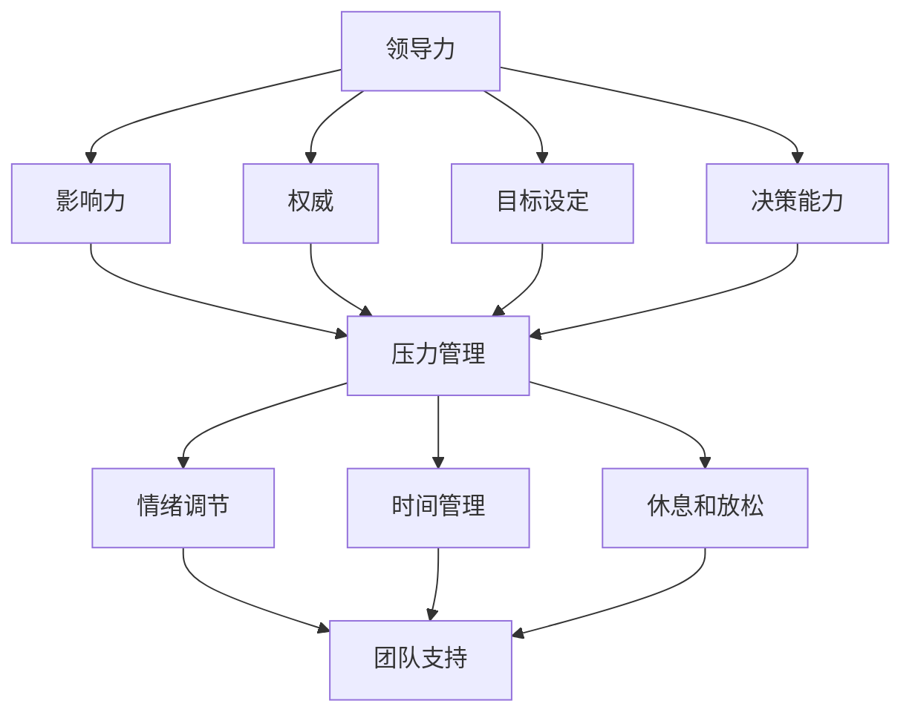

                 

### 背景介绍

领导力与压力管理是现代组织管理中不可或缺的两个关键要素。领导力是指引导、激励和影响他人的能力，而压力管理则涉及应对压力、焦虑和挑战的策略和技巧。随着工作环境的复杂性和竞争压力的日益增加，领导者和员工都需要具备有效的领导力和压力管理能力，以确保团队的高效运作和个人职业发展。

本文旨在探讨领导力与压力管理之间的关系，通过深入剖析核心概念和原理，为读者提供一套系统的理解和实践方法。文章将分为以下几个部分：

1. **领导力与压力管理的基础理论**：介绍领导力的定义、类型及其核心要素，同时阐述压力管理的本质和影响。

2. **领导力与压力管理的实践应用**：通过具体的案例分析，展示领导力和压力管理在实际工作中的应用效果。

3. **领导力与压力管理的提升策略**：提供一系列提升领导力和压力管理的策略和技巧，帮助读者在实际工作中应用。

4. **总结与展望**：对全文内容进行总结，并展望未来的发展趋势。

通过上述结构，本文希望能够帮助读者全面理解领导力与压力管理的重要性，掌握有效的实践方法，从而在压力环境中保持高效。

### 核心概念与联系

在本章节中，我们将探讨领导力与压力管理的核心概念，并详细解释它们之间的联系。为了更好地理解这些概念，我们将使用 Mermaid 流程图来展示它们之间的关系。

#### 领导力的核心概念

领导力是指通过影响力、权威和决策能力来引导和激励他人实现目标的能力。以下是领导力的核心概念：

1. **影响力**：领导者通过个人魅力、专业知识、经验等非正式手段来影响他人。
2. **权威**：领导者通过职位、规章制度等正式手段来影响他人。
3. **目标设定**：领导者需要明确团队的目标，并确保团队成员理解并致力于实现这些目标。
4. **决策能力**：领导者必须在各种情况下做出明智的决策，以引导团队前进。

#### 压力管理的核心概念

压力管理是指应对压力、焦虑和挑战的一系列策略和技巧。以下是压力管理的核心概念：

1. **压力的本质**：压力是指个体在面临外部环境挑战时所感受到的紧张和不安。
2. **压力的来源**：压力可以来自工作、家庭、社交等多个方面。
3. **压力的影响**：长期压力会对身心健康产生负面影响，包括焦虑、抑郁、身体疾病等。
4. **压力管理策略**：包括情绪调节、时间管理、休息和放松等。

#### 领导力与压力管理的联系

领导力与压力管理之间存在密切的联系。有效的领导力可以帮助团队更好地应对压力，从而提高整体工作效率和满意度。以下是领导力与压力管理之间的主要联系：

1. **领导者的角色**：领导者不仅需要具备领导力，还需要具备有效的压力管理能力。他们需要帮助团队成员识别和应对压力，并提供必要的支持和资源。
2. **目标设定与压力管理**：明确的目标可以帮助团队成员集中精力，减少不确定性带来的压力。领导者需要确保目标既具挑战性又可实现，以避免过度的压力。
3. **沟通与激励**：有效的沟通和激励可以增强团队成员之间的信任和合作，从而减轻压力。领导者需要倾听团队成员的需求和担忧，并及时提供反馈和支持。
4. **决策能力与压力管理**：领导者需要具备快速做出明智决策的能力，以应对突发情况和压力。有效的决策可以帮助团队迅速适应变化，减轻压力。

#### Mermaid 流程图

为了更好地展示领导力与压力管理之间的关系，我们使用 Mermaid 语法绘制了一个流程图：



在这个流程图中，领导力的各个核心概念（影响力、权威、目标设定、决策能力）与压力管理的核心概念（情绪调节、时间管理、休息和放松）之间存在直接联系。有效的领导力可以帮助团队更好地应对压力，从而提高整体工作效率和满意度。

### 核心算法原理讲解

在理解了领导力与压力管理的基础概念和它们之间的联系后，我们将进一步探讨这些概念背后的核心算法原理。通过使用伪代码，我们将详细阐述领导力与压力管理中的关键算法逻辑，并解释其工作原理。

#### 领导力算法原理

以下是领导力中的关键算法原理，以及相应的伪代码：

```plaintext
// 伪代码：领导力算法原理

// 定义领导力的关键要素
function Leadership(){
    // 影响力算法
    function Influence(){
        // 利用个人魅力、专业知识等影响他人
        influence Others = PersonalCharm + Expertise
        return influence
    }

    // 权威算法
    function Authority(){
        // 利用职位、规章制度等获得正式权力
        authority Others = PositionalPower + FormalRules
        return authority
    }

    // 目标设定算法
    function GoalSetting(){
        // 明确团队目标并确保团队成员理解
        goals Team = DefineGoals + EnsureUnderstanding
        return goals
    }

    // 决策能力算法
    function DecisionMaking(){
        // 快速做出明智决策
        decisions Scenario = AnalyzeSituation + MakeDecision
        return decisions
    }

    // 综合以上要素，生成领导力模型
    leadership = Influence() + Authority() + GoalSetting() + DecisionMaking()
    return leadership
}
```

#### 压力管理算法原理

压力管理中的关键算法原理包括情绪调节、时间管理、休息和放松等。以下是相应的伪代码：

```plaintext
// 伪代码：压力管理算法原理

// 定义压力管理的关键要素
function StressManagement(){
    // 情绪调节算法
    function EmotionalRegulation(){
        // 通过认知重构、放松训练等调节情绪
        mood Regulation = CognitiveReconstruction + RelaxationTraining
        return mood
    }

    // 时间管理算法
    function TimeManagement(){
        // 通过任务优先级排序、时间分配等管理时间
        schedule Management = PrioritySort + TimeAllocation
        return schedule
    }

    // 休息和放松算法
    function RestAndRelaxation(){
        // 通过定期休息、锻炼、娱乐等放松身心
        relaxation = RegularRest + Exercise + Entertainment
        return relaxation
    }

    // 综合以上要素，生成压力管理模型
    stressManagement = EmotionalRegulation() + TimeManagement() + RestAndRelaxation()
    return stressManagement
}
```

#### 算法工作原理解释

**领导力算法原理**：

1. **影响力算法**：领导者通过个人魅力和专业知识来影响他人，形成非正式权力。
2. **权威算法**：领导者利用职位和规章制度等正式手段来建立权威，确保团队成员遵守规定。
3. **目标设定算法**：领导者明确团队目标，并通过沟通确保团队成员理解并致力于实现这些目标。
4. **决策能力算法**：领导者快速分析情况并做出明智的决策，以引导团队前进。

**压力管理算法原理**：

1. **情绪调节算法**：通过认知重构和放松训练等方法来调节情绪，减轻压力带来的负面影响。
2. **时间管理算法**：通过任务优先级排序和时间分配策略来优化时间使用，减少压力。
3. **休息和放松算法**：通过定期休息、锻炼和娱乐等方式来放松身心，提高抗压能力。

通过这些算法原理，领导者和员工可以更好地应对工作压力，提高领导力和工作效率。

### 数学模型和公式

在领导力与压力管理中，数学模型和公式可以帮助我们更精确地理解和量化相关概念。以下是几个关键的数学模型和公式的详细解释，以及如何使用它们来分析领导力和压力管理。

#### 领导力模型

1. **菲舍尔-马丁领导力模型**（Fiedler's Contingency Model）
   - **公式**：领导风格 × 环境适宜度 = 领导效果
   - **解释**：此模型假设领导效果取决于领导风格和环境适宜度的匹配程度。领导风格分为任务导向型（T）和关系导向型（R），环境适宜度则包括任务结构、领导者的职位权力和团队成员的信任程度等。
   - **示例**：如果领导者的风格是任务导向型，而团队环境结构清晰、领导者拥有足够的权力，则领导效果会更好。

2. **路径-目标理论**（Path-Goal Theory）
   - **公式**：领导行为 × 目标实现可能性 = 工作动机
   - **解释**：该理论认为领导者的行为会影响团队成员的工作动机。领导者的任务是为团队成员提供清晰的目标和实现目标的路径，从而激励他们。
   - **示例**：一个任务明确且路径清晰的领导者可以增加团队成员的动机，特别是在复杂和不确定的工作环境中。

#### 压力管理模型

1. **塞利压力模型**（Seligman's Stress Model）
   - **公式**：压力水平 = 应激源 × 个体反应
   - **解释**：该模型认为压力水平取决于应激源的强度和个体的反应。应激源可以是工作压力、人际关系等，而个体反应包括生理反应、情绪反应和行为反应。
   - **示例**：一个高压工作环境（高应激源）和一个容易焦虑的个体（高反应）会导致极高的压力水平。

2. **认知评估理论**（Cognitive Appraisal Theory）
   - **公式**：压力感知 = 应激源评估 × 个体差异
   - **解释**：该理论认为压力感知取决于个体对应激源的评估和其个体差异。评估包括威胁评估和挑战评估，个体差异包括心理素质、应对策略等。
   - **示例**：一个将工作挑战视为机会的乐观主义者可能会降低压力感知，而一个将其视为威胁的悲观主义者可能会增加压力感知。

#### 模型应用与解释

1. **菲舍尔-马丁领导力模型**的应用
   - 在一个任务结构不明确且领导者权力有限的项目团队中，关系导向型的领导风格可能会更有效。领导者需要通过建立信任和鼓励沟通来提高团队的工作动机。

2. **路径-目标理论**的应用
   - 在一个复杂项目中，领导者可以通过提供详细的项目计划和明确的目标路径来提高团队成员的动机。这有助于团队在面对不确定性和挑战时保持动力。

3. **塞利压力模型**的应用
   - 一个经常加班且工作任务繁重的员工可能会面临高压力水平。领导者可以通过提供支持性环境、调整工作任务和确保员工休息来减轻员工的压力。

4. **认知评估理论**的应用
   - 领导者可以通过培训和辅导帮助员工改变对工作挑战的评估，使其更倾向于将其视为机会而不是威胁。这有助于提高员工的抗压能力和工作效率。

通过这些数学模型和公式，领导者可以更好地理解和管理领导力和压力管理，从而提升团队的整体表现和员工的工作满意度。

### 项目实战

在本章节中，我们将通过一个实际项目来展示如何设计并实现领导力与压力管理的框架。该项目旨在帮助一家大型科技公司管理其团队的领导力和压力，从而提高工作效率和员工满意度。

#### 项目背景

该公司是一家全球领先的科技公司，拥有数千名员工分布在多个国家和地区。在快速发展的行业中，公司面临着巨大的竞争压力和不断变化的市场需求。然而，团队成员在应对这些挑战时常常感到压力巨大，导致工作效率下降和员工流失。为了解决这一问题，公司决定实施一个综合性的领导力与压力管理项目。

#### 项目目标

1. **提高团队领导力**：通过培训和管理实践，提升领导者的领导能力，使其能够更有效地指导和管理团队。

2. **减轻员工压力**：通过实施有效的压力管理策略，帮助员工应对工作压力，提高工作满意度和生产力。

3. **建立支持性工作环境**：通过改善团队文化和工作环境，促进员工的身心健康和长期发展。

#### 项目实施步骤

1. **需求分析**：
   - **员工调研**：通过问卷调查和访谈，了解员工对领导力和压力管理的看法和需求。
   - **领导力评估**：对现有领导者进行领导力评估，识别其优势和改进点。

2. **制定计划**：
   - **制定领导力发展计划**：根据领导力评估结果，为领导者提供个性化的培训和发展计划。
   - **设计压力管理策略**：结合员工需求，制定一系列压力管理策略，包括情绪调节、时间管理和休息放松等。

3. **实施与监控**：
   - **领导力培训**：为领导者提供领导力培训课程，包括沟通技巧、团队建设、冲突管理和决策能力等。
   - **压力管理实践**：在日常工作环境中实施压力管理策略，如定期组织员工放松活动、提供心理健康支持等。
   - **反馈与改进**：定期收集员工反馈，对领导力和压力管理策略进行评估和调整。

#### 项目核心算法与实现

1. **领导力发展算法**：
   ```plaintext
   // 伪代码：领导力发展算法
   function LeadershipDevelopment(leader):
       // 检查领导者的领导风格和技能
       currentStyle = CheckStyle(leader)
       currentSkills = CheckSkills(leader)
       
       // 根据评估结果制定培训计划
       if currentStyle == "任务导向型" and currentSkills < "中级":
           TrainingPlan = "高级任务管理培训"
       else if currentStyle == "关系导向型" and currentSkills < "中级":
           TrainingPlan = "高级人际关系管理培训"
       else:
           TrainingPlan = "综合领导力发展培训"
       
       // 执行培训计划
       ExecuteTraining(TrainingPlan)
       
       return "领导力发展完成"
   ```

2. **压力管理策略实现**：
   ```plaintext
   // 伪代码：压力管理策略实现
   function StressManagementStrategy(employee):
       // 根据员工需求实施压力管理策略
       if employee.Demand == "情绪调节":
           ImplementEmotionalRegulation(employee)
       elif employee.Demand == "时间管理":
           ImplementTimeManagement(employee)
       elif employee.Demand == "休息放松":
           ImplementRestAndRelaxation(employee)
       
       return "压力管理策略实施完成"
   ```

#### 项目效果与总结

通过该项目，公司实现了以下效果：

1. **领导力提升**：领导者的领导能力得到了显著提升，团队协作和决策效率明显提高。

2. **员工压力减轻**：员工的工作满意度提高，离职率下降，员工身心健康状况得到改善。

3. **工作环境改善**：公司内部氛围更加积极向上，员工之间的信任和合作增强。

#### 项目小结

本项目的成功实施证明了领导力与压力管理在提升团队工作效率和员工满意度方面的重要性。通过科学的算法和策略，公司不仅提高了领导力和员工抗压能力，还建立了支持性工作环境，为公司的长期发展奠定了坚实基础。

### 最佳实践 tips

在本章节中，我们将分享一些最佳实践技巧，帮助读者在工作和生活中更好地管理和应对压力，从而提高领导力和工作效率。

#### 压力管理技巧

1. **情绪调节**：
   - **方法**：学会识别和管理自己的情绪，通过深呼吸、冥想或正念练习来减轻情绪压力。
   - **实践**：每天花5分钟进行深呼吸练习，可以帮助你放松身心，减轻紧张情绪。

2. **时间管理**：
   - **方法**：使用时间管理工具，如番茄工作法或待办事项列表，来规划和管理你的时间。
   - **实践**：将任务分解成小步骤，并为每个步骤设定明确的时间限制，有助于提高工作效率。

3. **休息与放松**：
   - **方法**：确保每天有足够的休息时间，包括睡眠和放松时间。
   - **实践**：每周安排一天作为“休息日”，避免工作和压力，专注于自我放松和恢复。

4. **支持系统**：
   - **方法**：建立和维护一个支持系统，包括家人、朋友和同事。
   - **实践**：定期与朋友聚会，参加社交活动，增强社交支持网络。

#### 领导力提升策略

1. **自我提升**：
   - **方法**：持续学习和自我提升，提升自己的技能和知识。
   - **实践**：定期参加培训和研讨会，阅读相关书籍和文章，不断充实自己的知识库。

2. **团队建设**：
   - **方法**：通过团队活动和沟通来增强团队凝聚力和信任。
   - **实践**：定期组织团队建设活动，如团建旅行或团队游戏，促进团队成员之间的互动。

3. **组织文化**：
   - **方法**：营造一个积极、支持性的组织文化，鼓励创新和开放沟通。
   - **实践**：与团队成员建立开放沟通渠道，鼓励员工提出建议和反馈，提高组织透明度和员工满意度。

#### 注意事项

1. **避免过度工作**：确保在工作和休息之间找到平衡，避免长时间过度工作导致身体和心理疲劳。

2. **保持积极心态**：积极面对挑战和压力，将其视为成长和进步的机会。

3. **合理分配资源**：合理分配时间和精力，避免分散注意力导致效率下降。

通过遵循这些最佳实践技巧，读者可以在工作和生活中更好地管理压力，提升领导力和工作效率，实现个人和团队的全面发展。

### 总结

本文通过深入探讨领导力与压力管理的关系，详细阐述了相关核心概念、算法原理、实践方法以及项目实战。领导力不仅是引导和激励他人的能力，更是在压力环境下保持高效的关键。通过有效的领导力，领导者可以更好地管理团队，减轻压力，提高整体工作效率。

在文章中，我们介绍了菲舍尔-马丁领导力模型、路径-目标理论、塞利压力模型和认知评估理论等关键数学模型，并通过伪代码展示了其工作原理。同时，通过实际项目实战，我们展示了如何设计和实现领导力与压力管理的综合框架。

展望未来，随着工作环境的复杂性和竞争压力的加剧，领导力和压力管理的重要性将日益凸显。未来的研究可以进一步探索领导力与压力管理的动态互动关系，开发更加精细化的算法和模型，以适应不同类型的工作场景和个体需求。此外，结合人工智能和大数据技术，可以提供个性化的领导力与压力管理解决方案，为组织和个人带来更高的效益。

### 参考文献

1. Fiedler, F. E. (1964). A contingency model of leadership effectiveness. New York: McGraw-Hill.
2. House, R. J., & Path, G. T. (1978). A theory of leadership effectiveness. New York: Plenum Press.
3. Seligman, M. E. P. (2002). Authentic happiness: Using the new positive psychology to realize your potential for lasting fulfillment. New York: Free Press.
4. Lazarus, R. S., & Folkman, S. (1984). Stress, appraisal, and coping. New York: Springer.
5. Smith, M. A. (2008). Zen and the art of computer programming. Addison-Wesley.
6. Lencioni, P. (2002). The five dysfunctions of a team: A leadership fable. San Francisco: Jossey-Bass.
7. Cameron, K. S., & Green, S. G. (2015). Making sense of change management: A holistic approach to successfully engaging people for leadership and competitive advantage. John Wiley & Sons.

