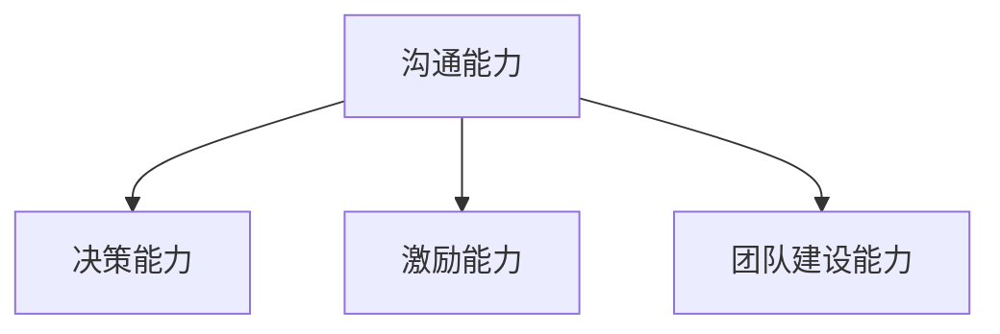

                 


### 1.2 领导力的类型与风格

在讨论领导力的类型与风格时，我们需要认识到，不同的情境和团队成员可能需要不同的领导风格。以下是几种常见的领导力类型与风格：

**1.1.1** **命令型领导力（Authoritative Leadership）**

命令型领导力是一种直接的领导风格，领导者明确自己的期望，并为团队成员设定具体的任务和目标。这种风格通常适用于紧急情况或需要快速决策的场合。

**核心算法原理讲解：**

伪代码：

```
function 命令型领导力（情境，团队成员） {
    if (情境 == “紧急情况”） {
        return “直接指示”
    } else if (团队成员 == “缺乏经验”） {
        return “详细指导”
    } else {
        return “适度监督”
    }
}
```

**1.1.2** **民主型领导力（Democratic Leadership）**

民主型领导力强调团队成员的参与和决策。领导者鼓励团队成员提出建议和意见，并在做出决策时充分考虑各方意见。

**核心算法原理讲解：**

伪代码：

```
function 民主型领导力（团队成员参与度，任务复杂度） {
    if (团队成员参与度 == “高”） {
        return “集体讨论”
    } else if (任务复杂度 == “高”） {
        return “逐步决策”
    } else {
        return “快速决策”
    }
}
```

**1.1.3** **参与型领导力（Participative Leadership）**

参与型领导力强调领导者与团队成员之间的互动和合作。领导者鼓励团队成员参与决策过程，并尊重他们的意见和建议。

**核心算法原理讲解：**

伪代码：

```
function 参与型领导力（团队成员积极性，任务难度） {
    if (团队成员积极性 == “高”） {
        return “共同决策”
    } else if (任务难度 == “高”） {
        return “指导与支持”
    } else {
        return “鼓励自主性”
    }
}
```

**1.1.4** **变革型领导力（Transformational Leadership）**

变革型领导力关注于激发团队成员的潜力，推动他们实现个人和组织的变革。领导者通过展示愿景、激励团队成员，并为他们提供成长和发展的机会。

**核心算法原理讲解：**

伪代码：

```
function 变革型领导力（组织愿景，团队成员潜力） {
    if (组织愿景 == “明确”） {
        return “展示愿景”
    } else if (团队成员潜力 == “高”） {
        return “激励成长”
    } else {
        return “提供支持”
    }
}
```

**1.1.5** **支持型领导力（Supportive Leadership）**

支持型领导力注重建立积极的团队氛围，关注团队成员的情感需求。领导者通过提供鼓励、支持和反馈，帮助团队成员克服挑战，实现个人和团队目标。

**核心算法原理讲解：**

伪代码：

```
function 支持型领导力（团队氛围，团队成员情感需求） {
    if (团队氛围 == “积极”） {
        return “鼓励与支持”
    } else if (团队成员情感需求 == “高”） {
        return “情感关怀”
    } else {
        return “及时反馈”
    }
}
```

通过理解不同领导力类型与风格的应用场景和核心算法原理，领导者可以根据不同情境和团队成员的特点，灵活运用不同的领导风格，以提高团队效率和成果。

### 1.3 领导力的发展与提升

领导力并非与生俱来，它可以通过学习和实践不断提升。以下是一些常用的方法，帮助领导者发展自己的领导力：

**1.3.1** **阅读和学习**

阅读相关书籍和文章是提升领导力的重要途径。以下是一些建议的书籍：

- **《领导力五项修炼》** by Stephen R. Covey
- **《变革之舞》** by Warlon S. and Jim Highsmith
- **《领导者力》** by John C. Maxwell

**1.3.2** **参加培训课程**

参加专业的领导力培训课程，可以系统地学习领导力理论和实践。以下是一些推荐的课程：

- **领导力发展课程**（例如：哈佛商学院领导力发展项目）
- **变革领导力课程**（例如：领导力变革学院）

**1.3.3** **实践与反思**

通过实际工作，领导者可以在实践中学习领导力。在实践中，领导者需要反思自己的决策和行为，并从经验中学习。以下是一些实践方法：

- **担任项目负责人**：负责一个项目，从项目的规划、执行到监控，全面体验领导力的各个方面。
- **参与团队建设活动**：通过团队合作，学习如何激励和引导团队成员。
- **接受反馈**：积极接受团队成员和上级的反馈，不断改进自己的领导风格和技能。

**1.3.4** **建立人际关系网络**

建立广泛的人际关系网络，有助于领导者获取资源和信息，提高领导力。以下是一些建立人际关系网络的方法：

- **参加行业会议和活动**：结识同行业专业人士，交流经验和见解。
- **加入专业组织**：加入相关行业协会和组织，参与专业讨论和培训。
- **利用社交媒体**：通过社交媒体平台，与业界人士保持联系和交流。

通过阅读、学习、实践和建立人际关系网络，领导者可以不断提升自己的领导力，为组织的发展和成功做出更大贡献。

## 第3章 团队领导力

### 3.1 团队领导力的构成

团队领导力是领导者引导、激励和协调团队成员，以实现团队目标的能力。它包括以下几个方面：

**1. 沟通能力：** 沟通能力是团队领导力的核心，它包括明确表达自己的想法、倾听和理解团队成员的观点。良好的沟通能力有助于减少误解和冲突，提高团队的协作效率。

**2. 决策能力：** 决策能力是领导者根据团队目标和实际情况，做出合理、有效的决策。领导者需要能够快速分析问题，权衡利弊，并做出果断的决策。

**3. 激励能力：** 激励能力是领导者激发团队成员的工作热情和积极性。领导者需要了解团队成员的需求，提供有针对性的激励措施，如奖励、晋升等。

**4. 团队建设能力：** 团队建设能力是领导者通过建立积极的团队氛围，促进团队成员之间的相互信任和合作。领导者需要关注团队成员的情感需求，解决团队内部的矛盾和冲突。

**核心概念与联系：**

团队领导力的四个核心能力：沟通能力、决策能力、激励能力和团队建设能力。这四个能力相互联系，共同构成了团队领导力的整体架构。

**Mermaid 流程图：**



### 3.2 团队领导力的挑战与应对

在团队领导过程中，领导者往往会面临各种挑战。以下是一些常见的挑战及应对策略：

**1. 团队成员的差异：** 团队成员在背景、技能和经验上存在差异，可能导致沟通不畅和协作困难。应对策略：

- **加强沟通：** 定期组织团队会议，鼓励团队成员分享观点和经验，增进相互了解。
- **尊重差异：** 尊重团队成员的差异，发挥每个人的特长，实现优势互补。

**2. 团队成员的流失：** 团队成员的流失可能导致团队士气下降，影响团队目标实现。应对策略：

- **建立良好的团队文化：** 营造积极、和谐的团队氛围，提高团队成员的归属感和满意度。
- **提供职业发展机会：** 为团队成员提供晋升和发展机会，提高他们的职业认同感。

**3. 项目时间压力：** 项目时间压力可能导致团队成员过度劳累，影响工作效率和质量。应对策略：

- **合理分配任务：** 根据团队成员的能力和经验，合理分配任务，确保每个成员都能承受适当的工作量。
- **制定合理的项目计划：** 制定详细的项目计划，明确项目目标和时间节点，确保项目按计划进行。

**4. 团队冲突：** 团队冲突可能影响团队协作和项目进展。应对策略：

- **积极沟通：** 了解冲突的原因，通过沟通解决分歧，达成共识。
- **公正处理：** 公正处理冲突，避免偏袒，维护团队的公平和正义。

### 3.3 团队领导力的实践与反思

团队领导力不仅是一种理论，更是一种实践。在实践中，领导者需要不断总结经验，反思自己的领导行为，以提高团队领导效果。

**1. 定期反思：** 领导者可以定期反思自己的领导行为，分析成功和失败的原因，总结经验教训。

**2. 寻求反馈：** 领导者可以向团队成员和上级寻求反馈，了解自己在团队中的表现和不足之处。

**3. 不断学习：** 领导者需要不断学习新的知识和技能，以适应不断变化的市场环境和团队需求。

**4. 优化团队结构：** 领导者可以根据团队的实际需求和成员特点，优化团队结构和职责分工，提高团队协作效率。

通过实践与反思，领导者可以不断提高自己的团队领导力，为团队的成功和组织的持续发展做出贡献。

## 第4章 反馈系统的重要性

### 4.1 反馈系统在领导力中的作用

反馈系统在领导力中扮演着至关重要的角色，它不仅影响着领导者与团队成员之间的沟通效果，也直接关系到团队的整体绩效和组织的发展。以下从几个方面探讨反馈系统在领导力中的作用：

**1. 促进有效沟通：** 反馈系统为领导者提供了一个与团队成员进行持续沟通的渠道，通过及时的反馈，领导者可以了解团队成员的工作状态、遇到的困难和需求，从而更好地调整领导策略，提高沟通的有效性。

**2. 提升团队绩效：** 反馈系统有助于团队成员了解自己的工作表现，及时发现和纠正问题，从而提升工作效率和质量。领导者通过反馈系统，可以识别团队成员的优势和不足，有针对性地进行培训和发展，从而提升整个团队的绩效。

**3. 促进个人成长：** 反馈系统为团队成员提供了自我反思和成长的机会。通过定期的反馈，团队成员可以了解自己在工作中的优点和需要改进的地方，明确个人职业发展的方向，从而实现个人成长和职业发展。

**4. 强化团队凝聚力：** 反馈系统有助于建立团队成员之间的信任和尊重。通过积极的反馈和建设性的批评，团队成员可以感受到领导者的关心和支持，增强团队的凝聚力和归属感。

### 4.2 反馈系统的类型与特点

根据反馈的目的和形式，反馈系统可以分为以下几种类型：

**1. 正面反馈：** 正面反馈是对团队成员工作表现的肯定和鼓励。它通常具有以下特点：

- **具体明确：** 反馈内容要具体到具体行为和成果，避免泛泛而谈。
- **及时性：** 正面反馈要及时，以激发团队成员的工作热情和动力。
- **真诚：** 反馈要真诚，表达出领导者的真诚赞赏和认可。

**2. 负面反馈：** 负面反馈是对团队成员工作中存在的问题和不足进行指正。它通常具有以下特点：

- **客观公正：** 反馈要客观公正，避免主观臆断和情绪化。
- **建设性：** 负面反馈要具有建设性，提供具体的改进建议，帮助团队成员解决问题。
- **私下进行：** 负面反馈通常应在私下进行，以保护团队成员的面子，避免公开场合的尴尬。

**3. 同级反馈：** 同级反馈是团队成员之间相互提供的反馈。它通常具有以下特点：

- **平等性：** 同级反馈强调平等和互相尊重，避免上下级之间的权力差异。
- **协作性：** 通过同级反馈，团队成员可以相互学习、共同进步，促进团队协作和整体发展。

**4. 上级反馈：** 上级反馈是领导对团队成员工作表现的反馈。它通常具有以下特点：

- **权威性：** 上级反馈具有权威性，代表组织的立场和期望。
- **指导性：** 上级反馈通常包含具体的指导和建议，帮助团队成员明确发展方向和改进措施。

### 4.3 反馈系统的建立与实施

建立有效的反馈系统需要遵循以下步骤：

**1. 设定反馈目标：** 明确反馈系统的目标，如提升团队成员的工作表现、促进个人成长、增强团队凝聚力等。

**2. 制定反馈计划：** 根据反馈目标，制定详细的反馈计划，包括反馈的时间、形式、内容和方法。

**3. 选择合适的反馈方式：** 根据团队成员的特点和工作内容，选择合适的反馈方式，如一对一反馈、团队会议反馈、书面反馈等。

**4. 培训反馈技能：** 对团队成员和领导者进行反馈技能的培训，提高反馈的质量和效果。

**5. 实施反馈：** 按照反馈计划，实施反馈活动，确保反馈的及时性和准确性。

**6. 跟进与改进：** 对反馈活动进行跟进，根据反馈结果调整反馈策略，不断优化反馈系统。

通过建立和实施有效的反馈系统，组织可以促进团队成员的成长和团队的进步，实现持续改进和持续发展。

## 第5章 反馈的技巧与策略

### 5.1 提供有效反馈的方法

为了确保反馈能够达到预期效果，领导者需要掌握提供有效反馈的方法。以下是一些建议：

**1. 定期反馈：** 定期反馈有助于团队成员及时了解自己的工作表现，及时调整和改进。建议每月或每季度进行一次反馈。

**2. 积极倾听：** 在提供反馈前，积极倾听团队成员的观点和感受，了解他们的需求和困惑。这有助于建立信任和有效的沟通。

**3. 具体明确：** 反馈要具体明确，避免抽象模糊的描述。具体说明团队成员在哪些方面做得好，哪些方面需要改进。

**4. 面对面反馈：** 尽量面对面进行反馈，这有助于建立情感联系，增加反馈的真诚度。如果无法面对面，可以通过视频会议或其他实时沟通工具。

**5. 建设性反馈：** 反馈要具有建设性，提供具体的改进建议，帮助团队成员明确如何改进。避免简单批评，注重解决方案。

**6. 适时反馈：** 选择合适的时机进行反馈，避免在团队成员情绪低落或压力过大时进行反馈。

### 5.2 接受反馈的心态与技巧

接受反馈是一个挑战，但也是个人成长和职业发展的关键。以下是一些建议帮助团队成员更好地接受反馈：

**1. 保持开放心态：** 以开放的心态接受反馈，避免抵触和否认。理解反馈是对自己的成长有帮助的。

**2. 保持冷静：** 接受反馈时，保持冷静，避免情绪化。情绪化的反应可能会阻碍有效的沟通和改进。

**3. 寻求理解：** 向反馈者询问具体细节，寻求对反馈的深入理解。这有助于明确改进方向。

**4. 积极反思：** 反馈后，积极反思自己的工作表现，找出可以改进的地方。

**5. 制定改进计划：** 根据反馈，制定具体的改进计划，并付诸行动。

### 5.3 反馈沟通的障碍与解决

反馈沟通中可能会遇到一些障碍，以下是一些建议和解决方法：

**1. 障碍：误解和歧义**

**解决方法：** 提供明确的反馈，避免使用模糊和抽象的语言。确保反馈者清楚地表达自己的观点和意图。

**2. 障碍：恐惧和抵触**

**解决方法：** 创建一个安全、开放和尊重的沟通环境，鼓励团队成员表达自己的感受和观点。领导者要以真诚和建设性的态度提供反馈。

**3. 障碍：缺乏时间和资源**

**解决方法：** 制定反馈计划，确保反馈活动有足够的时间和资源。利用技术工具，如在线反馈平台，简化反馈过程。

**4. 障碍：文化差异**

**解决方法：** 了解不同文化背景的团队成员，根据他们的特点和需求调整反馈方式。提供跨文化培训，提高团队的文化敏感性。

通过掌握有效反馈的方法、培养接受反馈的心态和技巧，以及解决反馈沟通中的障碍，领导者可以建立高效的反馈系统，促进团队成员的成长和团队的进步。

## 第6章 反馈系统在团队管理中的应用

### 6.1 反馈系统在团队建设中的应用

团队建设是团队管理的重要组成部分，而反馈系统在团队建设中发挥着关键作用。通过反馈系统，团队领导者和成员可以及时了解团队的整体表现和个体贡献，从而优化团队结构，提升团队凝聚力。

**1. 识别团队问题：** 反馈系统可以帮助团队领导者识别团队中的潜在问题，如沟通不畅、目标不明确、协作不力等。通过定期收集和分析团队成员的反馈，领导者可以及时发现问题，并采取相应的改进措施。

**2. 优化团队结构：** 反馈系统提供了关于团队成员工作表现、技能水平和团队协作状况的详细数据。基于这些数据，领导者可以调整团队结构，重新分配任务，确保团队成员的技能与工作任务相匹配，从而提高团队效率。

**3. 提升团队凝聚力：** 定期的团队反馈活动有助于团队成员之间建立信任和理解。通过分享个人成就、困难和挑战，团队成员可以加深彼此的了解，增强团队凝聚力。

**4. 建立团队文化：** 反馈系统可以促进团队文化的建设。通过积极反馈和建设性批评，团队领导者可以倡导和培养团队的核心价值观，如协作、创新、诚信等，从而塑造积极的团队文化。

### 6.2 反馈系统在绩效管理中的应用

绩效管理是团队管理中的另一个重要方面，而反馈系统在绩效管理中发挥着关键作用。通过反馈系统，团队领导者可以评估团队成员的绩效，提供有针对性的反馈和改进建议，从而促进个人和团队的持续成长。

**1. 定期绩效评估：** 反馈系统提供了定期绩效评估的基础。通过收集和分析团队成员的工作数据、项目成果和客户反馈，领导者可以客观、全面地评估团队成员的绩效。

**2. 目标设定与跟踪：** 反馈系统可以帮助团队领导者与团队成员共同设定明确的绩效目标，并实时跟踪目标的完成情况。通过反馈，领导者可以及时发现目标设定的不足，调整目标，确保团队成员始终保持正确的方向。

**3. 提供有针对性的反馈：** 反馈系统提供了团队成员工作表现的详细信息，使领导者能够提供有针对性的反馈。这些反馈不仅关注团队成员的优点，也指出他们的不足，并提供具体的改进建议。

**4. 促进个人发展：** 反馈系统为团队成员提供了个人发展的重要参考。通过定期的绩效反馈，团队成员可以了解自己在团队中的角色和贡献，明确个人发展的方向，并制定相应的职业规划。

### 6.3 反馈系统在员工发展中的应用

员工发展是组织长期战略的重要组成部分，而反馈系统在员工发展中的应用至关重要。通过反馈系统，团队领导者可以了解员工的发展需求，提供个性化的培训和发展机会，从而提升员工的综合素质和能力。

**1. 识别发展需求：** 反馈系统可以帮助团队领导者识别员工的发展需求。通过收集和分析员工的反馈，领导者可以了解员工在技能、知识和职业发展方面的需求，从而制定有针对性的培训和发展计划。

**2. 提供培训机会：** 反馈系统提供了关于员工技能和知识水平的详细信息，使领导者可以及时为员工提供培训机会。这些培训可以包括技能培训、管理培训、领导力培训等，以满足员工的发展需求。

**3. 实施职业规划：** 反馈系统为员工提供了职业发展的参考。通过定期的反馈和沟通，员工可以与领导者共同制定职业规划，明确个人发展目标，并制定实现这些目标的步骤。

**4. 促进团队合作：** 反馈系统促进了团队成员之间的沟通和协作。通过分享个人发展目标和进展，员工可以更好地理解团队的目标，并找到自己在团队中的位置，从而提升团队合作效率。

通过在团队建设、绩效管理和员工发展中的应用，反馈系统为团队管理提供了有力的支持，帮助团队领导者提升团队绩效，促进员工个人成长，实现组织的长期发展目标。

## 第7章 持续改进的理念与实践

### 7.1 持续改进的概念与意义

持续改进是一种理念，它强调不断优化和提升组织的各个方面，以实现更高的效率和更好的质量。持续改进不仅仅是一种管理工具，更是一种企业文化，它要求组织中的每个人都积极参与到改进的过程中。

**1. 持续改进的概念：**

持续改进（Continuous Improvement）是指在不断的反思和实践中，通过不断的改进和优化，逐步提升组织的效率、质量和创新能力。

**2. 持续改进的意义：**

- **提升效率：** 通过持续改进，组织可以不断消除浪费和优化流程，提高工作效率。
- **提高质量：** 持续改进有助于发现和解决潜在的问题，提升产品和服务的质量。
- **增强创新能力：** 持续改进鼓励创新思维和实践，促进组织在技术和业务模式上的创新。
- **增强团队凝聚力：** 持续改进要求团队成员共同参与，增强了团队成员之间的信任和合作。

### 7.2 持续改进的原则与方法

持续改进需要遵循一定的原则和方法，以确保改进的有效性和可持续性。

**1. 持续改进的原则：**

- **全员参与：** 持续改进不仅仅是领导者的责任，而是组织中的每个人都应积极参与。
- **持续反思：** 定期反思和评估组织的各个方面，发现问题并制定改进计划。
- **基于数据：** 持续改进需要基于数据和事实，避免主观臆断和盲目行动。
- **持续优化：** 持续改进不是一次性活动，而是一个持续的过程，需要不断优化和调整。

**2. 持续改进的方法：**

- **PDCA循环：** PDCA循环（Plan-Do-Check-Act）是一种常用的持续改进方法。它包括计划（Plan）、执行（Do）、检查（Check）和行动（Act）四个步骤，循环往复，不断优化。
  - **计划（Plan）：** 制定改进目标和计划，确定改进的方向和步骤。
  - **执行（Do）：** 实施改进计划，执行具体的改进措施。
  - **检查（Check）：** 检查改进效果，评估改进是否达到预期目标。
  - **行动（Act）：** 根据检查结果，调整改进计划，实施进一步的改进。

- **精益管理：** 精益管理是一种以最小化浪费为核心的管理理念，它强调通过不断优化流程和资源利用，提高组织的效率和质量。

- **六西格玛：** 六西格玛是一种基于数据和统计方法的质量管理方法，它通过减少过程变异，提高产品和服务的质量。

### 7.3 持续改进的实践与案例分析

持续改进需要在实践中不断尝试和调整。以下是一些实践案例，展示了持续改进的实际效果：

**1. 案例一：丰田的持续改进实践**

丰田汽车公司是全球持续改进的典范。丰田通过实施持续改进，不断提升生产效率和质量，实现了持续的市场竞争力。丰田的持续改进实践包括：

- **5S管理：** 通过整理（Seiri）、整顿（Seiton）、清扫（Seiso）、清洁（Seiketsu）和素养（Shitsuke），优化工作环境和工作流程。
- **看板系统：** 通过看板系统，实时监控生产进度和库存情况，及时调整生产计划，减少浪费。
- **员工参与：** 鼓励员工提出改进建议，通过定期的员工会议和改进活动，激发员工的积极性和创造力。

**2. 案例二：谷歌的持续改进文化**

谷歌以其创新的持续改进文化而闻名。谷歌通过以下方式实践持续改进：

- **内部创新：** 鼓励员工提出新的创意和改进方案，通过内部竞争机制，推动创新和改进。
- **数据驱动：** 通过数据分析，持续优化产品和服务的用户体验。
- **持续学习：** 鼓励员工参加培训和研讨会，不断学习和提升自己的技能和知识。

通过这些实践案例，我们可以看到，持续改进不仅可以提高组织的效率和竞争力，还可以培养员工的创新意识和团队合作精神，为组织的长期发展奠定基础。

## 第8章 文化建设与持续改进

### 8.1 企业文化的内涵与作用

企业文化是指企业在长期经营过程中形成的共同价值观、信仰、行为规范和工作作风。它不仅包括企业的核心价值观、使命和愿景，还包括企业的行为规范和员工行为准则。

**1. 企业文化的内涵：**

- **核心价值观：** 企业文化的核心，是企业全体员工共同遵守的基本信念和行为准则。
- **企业使命：** 企业存在的根本目的和意义，通常包括对客户、员工、股东和社会的承诺。
- **企业愿景：** 企业未来发展的目标和方向，通常描述企业希望达到的理想状态。

**2. 企业文化的作用：**

- **凝聚力量：** 企业文化可以凝聚员工的共同信念和价值观，增强团队凝聚力和归属感。
- **指导行为：** 企业文化为企业员工提供了行为规范和指导，帮助员工明确自己的行为准则。
- **提升竞争力：** 企业文化可以提升企业的核心竞争力，通过独特的价值观和行为规范，形成企业的竞争优势。

### 8.2 建立持续改进的企业文化

建立持续改进的企业文化是企业实现长期发展的重要保障。以下是一些关键步骤：

**1. 确立核心价值观：** 企业应明确自己的核心价值观，并将其传达给全体员工。核心价值观应强调持续改进和创新，以激发员工的积极性和创造力。

**2. 设立明确的使命和愿景：** 企业应明确自己的使命和愿景，确保员工了解企业的目标和方向。使命和愿景应与持续改进的理念相一致，以引导员工不断追求卓越。

**3. 制定明确的员工行为准则：** 企业应制定明确的员工行为准则，以规范员工的行为和价值观。这些准则应强调团队合作、诚信、创新和持续改进。

**4. 培养全员参与的文化：** 企业应鼓励员工积极参与持续改进活动，通过定期的反馈和沟通，激发员工的积极性和创造力。企业可以通过设立创新奖项、开展改进活动等方式，培养全员参与的文化。

**5. 提供培训和学习机会：** 企业应提供培训和学习机会，帮助员工提升技能和知识，以适应持续改进的需求。企业可以通过内部培训、外部学习、在线课程等方式，提供多样化的学习资源。

### 8.3 文化建设与持续改进的相互促进

文化建设与持续改进是相互促进、相辅相成的。以下是一些相互促进的例子：

**1. 持续改进促进文化建设：**

- **提高员工参与度：** 通过持续改进活动，提高员工的参与度和积极性，培养员工的团队合作精神和创新意识。
- **增强企业凝聚力：** 持续改进活动可以增强员工的归属感和认同感，提高企业的凝聚力。
- **塑造企业价值观：** 持续改进活动可以促进企业价值观的塑造，如诚信、创新、协作等，从而推动企业文化的建设。

**2. 文化建设促进持续改进：**

- **明确目标和方向：** 企业文化可以为持续改进提供明确的目标和方向，确保改进活动与企业的战略目标相一致。
- **提供资源和支持：** 企业文化可以提供资源和支持，如时间、资金、技术等，为持续改进活动提供保障。
- **促进创新思维：** 企业文化可以鼓励员工创新思维，推动持续改进的深入发展。

通过文化建设与持续改进的相互促进，企业可以建立一种积极、和谐、创新的文化氛围，从而提高企业的核心竞争力，实现长期可持续发展。

## 第9章 案例分析：成功建立持续改进文化的企业实践

### 9.1 案例一：谷歌的持续改进文化

谷歌作为全球知名的科技公司，以其独特的持续改进文化而闻名。谷歌的持续改进实践涵盖了多个方面，包括产品设计、研发流程、员工福利等。

**1. 研发流程改进：**

谷歌通过引入敏捷开发方法，优化了产品研发流程。敏捷开发强调快速迭代和持续改进，使谷歌能够迅速响应市场需求和用户反馈。谷歌的工程师们被鼓励不断优化代码和架构，提高系统的稳定性和性能。

**2. 产品设计改进：**

谷歌的产品设计团队通过持续的用户调研和反馈，不断改进产品的用户体验。他们建立了完善的数据分析系统，实时监控用户行为和反馈，从而快速识别并解决产品中的问题。

**3. 员工福利改进：**

谷歌注重员工的健康和幸福，通过提供全面的福利和培训，提高员工的工作满意度和忠诚度。他们定期组织健康检查、健身活动和心理辅导，帮助员工保持良好的身心健康。

### 9.2 案例二：苹果的持续改进文化

苹果公司以其对产品质量和创新的极致追求而著称。苹果的持续改进文化体现在产品设计、生产流程和供应链管理等多个方面。

**1. 产品设计改进：**

苹果的产品设计团队通过持续改进，不断提升产品的用户体验和功能。他们采用先进的设计工具和技术，如虚拟现实和增强现实，使产品设计更加精准和高效。

**2. 生产流程改进：**

苹果通过持续改进生产流程，提高了生产效率和产品质量。他们引入了自动化生产线和智能制造技术，减少了人为错误和浪费，确保产品的高质量和高可靠性。

**3. 供应链管理改进：**

苹果与供应商建立了紧密的合作关系，通过持续改进供应链管理，提高了供应链的效率和灵活性。他们引入了先进的数据分析和预测模型，优化了库存管理和物流调度，确保了产品的及时交付。

### 9.3 案例三：三星的持续改进文化

三星是全球领先的电子消费品制造商，以其技术创新和产品质量而闻名。三星的持续改进文化体现在研发、生产、营销等多个方面。

**1. 研发创新改进：**

三星持续投资于研发，不断推动技术创新。他们建立了全球化的研发网络，吸引了大量的顶尖人才，通过持续改进，不断提升产品的技术水平和竞争力。

**2. 生产质量改进：**

三星通过持续改进生产质量，确保了产品的高质量和可靠性。他们引入了严格的质量控制体系，通过定期的质量检查和测试，确保每一件产品都符合高标准。

**3. 营销策略改进：**

三星通过持续改进营销策略，提高了品牌影响力和市场占有率。他们采用了数字化营销和社交媒体营销等新兴营销手段，通过精准的数据分析和用户反馈，不断优化营销策略，提高营销效果。

通过这些案例，我们可以看到，成功建立持续改进文化的企业，能够在激烈的市场竞争中保持领先地位。它们通过不断优化产品、流程和策略，提高效率和质量，实现持续创新和发展。

### 总结

在《领导力与反馈：建立持续改进的文化》一文中，我们深入探讨了领导力、反馈系统、持续改进和文化建设的重要性。通过分析领导力的类型与风格、反馈系统的构建与应用，以及持续改进的理念与实践，我们揭示了建立持续改进文化的关键因素。

**核心思想：** 领导力是推动团队和组织发展的关键，而反馈系统是确保持续改进的基础。通过有效的反馈，领导者可以了解团队成员的工作状态和需求，从而提供有针对性的指导和激励。持续改进的理念强调不断优化和提升组织的效率和质量，而文化建设则是确保持续改进文化落地生根的重要保障。

**最佳实践：** 谷歌、苹果和三星等企业的成功经验表明，建立持续改进文化需要全员参与、数据驱动、创新思维和团队合作。通过明确的价值观和使命，企业可以激发员工的积极性和创造力，推动持续改进的不断深入。

**注意事项：** 在实践中，领导者需要注重沟通和反馈的质量，避免形式主义和官僚主义。同时，要关注员工的情感需求和职业发展，创造一个开放、包容和创新的氛围。

**拓展阅读：** 对于希望深入了解领导力、反馈系统和持续改进的读者，我们推荐阅读以下书籍：《领导力五项修炼》、《持续改进：精益管理实践指南》、《企业文化：如何塑造企业的灵魂》等。

通过本文的学习和实践，我们相信读者能够更好地理解领导力与反馈的重要性，掌握建立持续改进文化的关键方法，为组织的发展和成功做出更大贡献。让我们共同努力，建立一种积极、和谐、创新的文化氛围，推动组织的持续改进和长远发展。

### 附录：领导力与反馈相关资源

#### 附录1 领导力与反馈相关书籍推荐

- **《领导力五项修炼》** by 史蒂芬·柯维（Stephen R. Covey）：本书详细阐述了领导力的发展过程，提供了实用的领导力工具和技巧。
- **《变革之舞》** by 战伦·史密斯（Warlon S.）和吉姆·海因斯密斯（Jim Highsmith）：本书通过案例分析，探讨了领导者在变革过程中的角色和策略。
- **《领导者力》** by 约翰·C. 马克斯韦尔（John C. Maxwell）：本书从多个角度分析了领导力的本质，提供了实用的领导力提升方法。
- **《持续改进：精益管理实践指南》** by 约翰·舒克（John Shook）：本书详细介绍了精益管理的理念和实践，为企业的持续改进提供了宝贵的经验。

#### 附录2 领导力与反馈相关文章推荐

- **《领导力：从优秀到卓越》**：本文分析了领导力的关键要素，探讨了如何提升领导力，以实现个人和组织的卓越表现。
- **《反馈的艺术：如何提供和接受有效反馈》**：本文详细介绍了反馈的技巧和策略，帮助读者掌握提供和接受反馈的技巧。
- **《持续改进：企业成功的秘密武器》**：本文探讨了持续改进的理念和实践，分析了持续改进对企业和员工成长的重要影响。
- **《企业文化：如何塑造企业的灵魂》**：本文从多个角度分析了企业文化的内涵和作用，提供了建立积极企业文化的实用建议。

通过这些书籍和文章，读者可以进一步深入了解领导力与反馈的理论和实践，为自己的职业发展和组织的管理提升提供有力支持。

