                 


### 文章标题：领导力与变革沟通：赢得变革支持

关键词：领导力，变革沟通，变革支持，组织变革，领导风格

摘要：
本文深入探讨领导力与变革沟通的关系，分析如何通过有效的领导力和变革沟通策略，赢得组织内部的变革支持。文章将分章节介绍变革沟通的重要性、领导力的基本理论、变革沟通的理论基础，以及领导力与变革沟通的实践应用。通过案例分析和最佳实践分享，为读者提供实用的变革领导力和沟通技巧。

---

### 引言与背景

#### 1.1 变革沟通的重要性

在当今快速变化的商业环境中，组织变革已成为企业保持竞争力的关键。变革沟通作为组织变革的核心组成部分，对于变革的成功至关重要。有效的变革沟通能够确保信息准确传达，减少误解和恐慌，增强员工对变革的理解和支持。

**核心概念与联系：**

变革沟通涉及以下核心概念：

1. **信息传递**：确保信息准确、及时地传达给所有相关人员。
2. **参与感**：让员工感受到他们在变革中的参与和贡献，增强归属感和责任感。
3. **透明度**：提高决策过程的透明度，增加员工的信任。
4. **反馈机制**：建立有效的反馈渠道，收集员工的意见和建议，及时调整变革策略。

**Mermaid 流程图：**

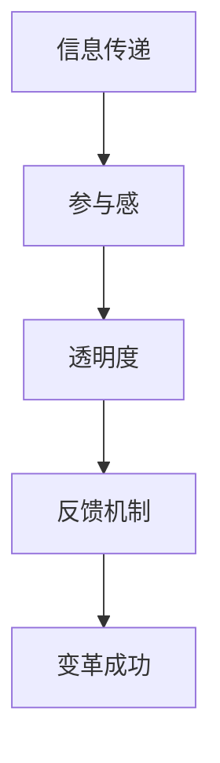

#### 1.2 领导力在变革中的作用

领导力是推动组织变革的关键因素。领导者在变革过程中需要承担多重角色，如变革的倡导者、沟通者、激励者和协调者。有效的领导力能够为变革提供方向，激励员工积极参与，并克服变革过程中遇到的挑战。

**核心概念与联系：**

1. **变革倡导者**：领导者需要积极倡导变革，为变革设定明确的目标和愿景。
2. **沟通者**：领导者需要有效传达变革的信息，确保员工理解变革的必要性和重要性。
3. **激励者**：领导者需要激励员工，鼓励他们积极参与变革。
4. **协调者**：领导者需要协调各方资源，确保变革顺利进行。

**Mermaid 流程图：**

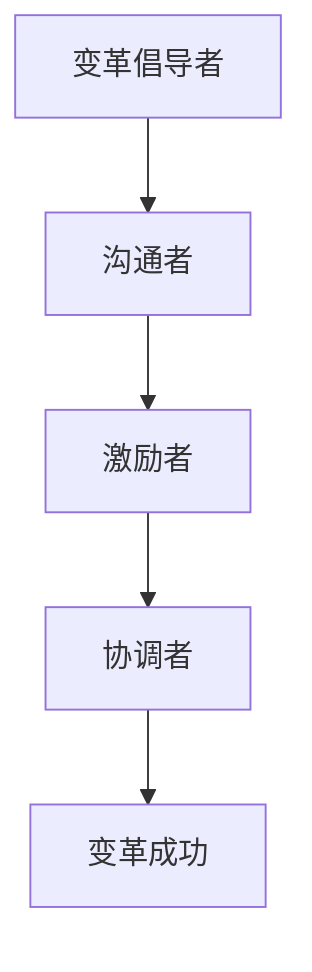

#### 1.3 变革沟通的理论框架

变革沟通的理论框架包括沟通模型、变革过程和沟通策略。这些理论为领导者提供了指导，帮助他们制定有效的变革沟通计划。

**核心概念与联系：**

1. **沟通模型**：如沟通障碍模型、沟通反馈模型等，帮助领导者理解和克服沟通中的问题。
2. **变革过程**：包括变革的不同阶段，如动员阶段、规划阶段、实施阶段和评估阶段。
3. **沟通策略**：如信息发布策略、互动沟通策略、反馈收集策略等，帮助领导者选择合适的沟通方式。

**Mermaid 流程图：**

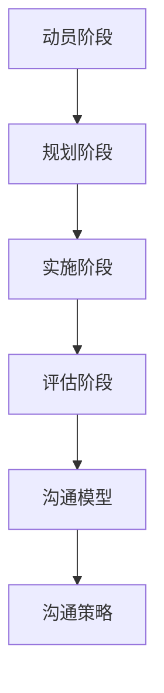

---

在接下来的章节中，我们将深入探讨领导力的基本理论、变革沟通的理论基础，以及领导力与变革沟通的实践应用。通过案例分析和最佳实践分享，我们将帮助读者掌握赢得变革支持的关键技能。敬请期待！

### 领导力的基本理论

领导力是推动组织变革的核心动力，其基本理论涵盖了领导力的定义、特征、模型以及领导风格。理解这些理论有助于领导者更好地应对变革过程中的各种挑战，从而赢得组织内部的变革支持。

#### 2.1 领导力的定义与特征

领导力是一种通过影响他人来实现共同目标的能力。它不仅涉及管理技能，还包括领导者的品格、价值观和愿景。领导力的特征包括：

1. **洞察力**：领导者需要具备深刻的洞察力，能够预见未来的趋势和潜在的风险。
2. **影响力**：领导者需要能够影响他人的行为和决策，激励他们为实现共同目标而努力。
3. **适应性**：领导者需要具备适应变化的能力，能够根据不同情况调整自己的领导风格。
4. **沟通能力**：领导者需要具备出色的沟通能力，能够清晰传达愿景和目标，减少误解和冲突。

**核心概念与联系：**

领导力涉及以下核心概念：

- **愿景**：领导者需要设定明确的愿景，为组织指明方向。
- **价值观**：领导者的价值观需要与组织的价值观保持一致，以增强团队的凝聚力。
- **信任**：领导者需要建立信任，让团队成员感到安全和被尊重。

**Mermaid 流程图：**

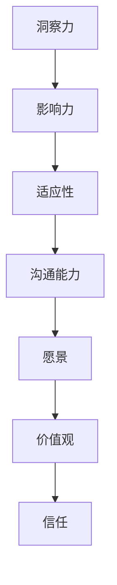

#### 2.2 领导力模型概览

领导力模型提供了不同的视角，帮助领导者理解和管理变革过程中的挑战。以下是一些常见的领导力模型：

1. **情境领导模型**：由赫塞和布兰查德提出，认为领导风格应该根据下属的能力和动机进行调整。
2. **路径-目标模型**：由豪斯提出，认为领导者的任务是明确目标和路径，并帮助下属克服障碍。
3. **变革领导模型**：由库克和威尔斯提出，强调领导者在变革过程中的角色和职责。

**核心概念与联系：**

- **情境领导模型**：领导者应根据情境调整领导风格。
- **路径-目标模型**：领导者应设定目标和路径，帮助下属实现目标。
- **变革领导模型**：领导者应在变革过程中发挥核心作用。

**Mermaid 流程图：**

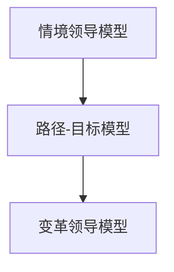

#### 2.3 领导风格与变革沟通

领导风格对变革沟通的效果有着重要影响。不同的领导风格适用于不同的变革情境。以下是一些常见的领导风格：

1. **授权型领导风格**：领导者鼓励下属自主决策，提高团队的创新能力和适应性。
2. **民主型领导风格**：领导者鼓励团队成员参与决策，提高团队的参与感和归属感。
3. **任务型领导风格**：领导者强调任务完成，确保变革目标的实现。

**核心概念与联系：**

- **授权型领导风格**：适用于需要创新和灵活性的变革情境。
- **民主型领导风格**：适用于需要团队参与和合作的变革情境。
- **任务型领导风格**：适用于需要高效执行和控制的变革情境。

**Mermaid 流程图：**

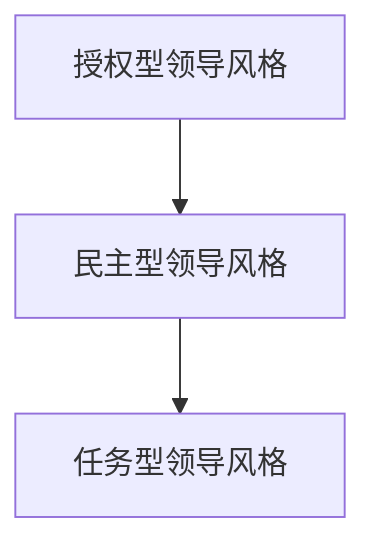

在变革沟通中，领导者需要根据变革情境选择合适的领导风格，同时保持沟通的透明度和参与感，以赢得员工的信任和支持。

### 变革沟通的理论基础

变革沟通是组织变革成功的关键因素。了解变革沟通的理论基础有助于领导者制定有效的沟通策略，确保变革信息准确传达，减少误解和抵制。变革沟通的理论基础主要包括沟通理论、变革过程模型和沟通策略。

#### 3.1 沟通理论概述

沟通理论为变革沟通提供了理论基础。以下是一些重要的沟通理论：

1. **信息传播理论**：强调信息的传递和接收过程，关注信息如何在不同层级和个体之间传递。
2. **传播模式理论**：分析信息在不同媒介和受众之间的传播过程，帮助领导者选择合适的沟通渠道。
3. **沟通障碍理论**：研究沟通中的障碍和解决策略，帮助领导者克服沟通难题。

**核心概念与联系：**

- **信息传播理论**：关注信息在组织中的流动。
- **传播模式理论**：关注不同媒介和受众对信息传播的影响。
- **沟通障碍理论**：关注沟通中的障碍和解决方法。

**Mermaid 流程图：**

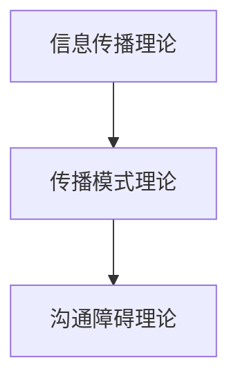

#### 3.2 变革沟通的过程模型

变革沟通的过程模型描述了变革沟通的各个阶段，帮助领导者理解变革沟通的动态过程。以下是一些常见的变革沟通过程模型：

1. **变革阶段模型**：由库克和威尔斯提出，认为变革沟通包括动员、规划、实施和评估四个阶段。
2. **沟通循环模型**：由波金斯和史密斯提出，强调沟通的循环性和互动性，认为沟通是一个持续的过程。
3. **整合模型**：将多个变革沟通理论整合在一起，提供一个全面的变革沟通框架。

**核心概念与联系：**

- **变革阶段模型**：关注变革的不同阶段和沟通的重点。
- **沟通循环模型**：强调沟通的互动性和持续性。
- **整合模型**：提供多个理论的综合视角。

**Mermaid 流程图：**

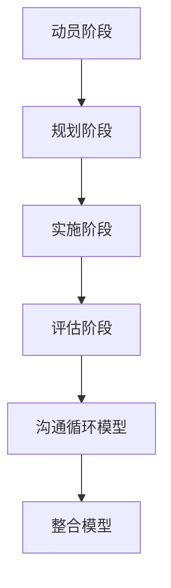

#### 3.3 变革沟通中的障碍与解决策略

变革沟通中存在多种障碍，如信息过载、沟通渠道不畅、文化差异等。理解这些障碍并采取相应的解决策略，是确保变革沟通有效性的关键。

**核心概念与联系：**

- **信息过载**：解决策略包括简化信息、突出关键点。
- **沟通渠道不畅**：解决策略包括优化沟通渠道、增加沟通频率。
- **文化差异**：解决策略包括文化培训、建立跨文化团队。

**Mermaid 流程图：**

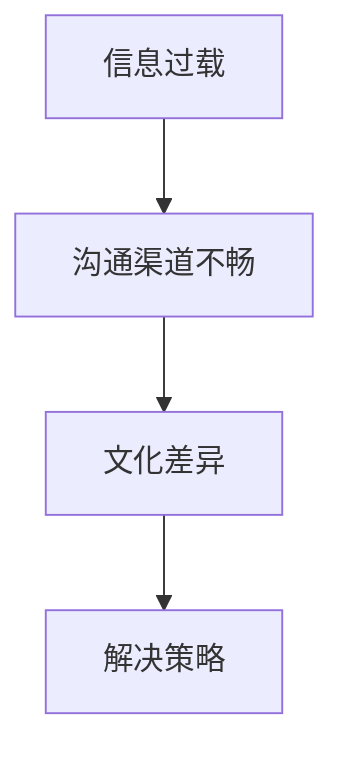

通过理解变革沟通的理论基础，领导者可以更好地制定沟通策略，确保变革信息的有效传达，减少误解和抵制，从而赢得变革支持。

### 领导力与变革沟通的实践应用

领导力在变革过程中扮演着至关重要的角色，而有效的变革沟通则是确保变革成功的关键。为了更好地理解和应用这些理念，以下将详细讨论变革领导力实践、变革沟通策略，并通过具体案例进行分析。

#### 4.1 变革领导力实践

变革领导力实践涉及领导者如何在实际操作中应用领导力理论和沟通策略。以下是一些关键步骤和策略：

**4.1.1 变革领导力模型**

变革领导力模型包括以下几个关键要素：

1. **倡导者**：领导者需要作为变革的倡导者，明确变革的愿景和目标，为变革提供方向。
2. **沟通者**：领导者需要作为变革的沟通者，确保信息准确、及时地传达给所有相关人员。
3. **激励者**：领导者需要作为变革的激励者，鼓励员工积极参与变革，克服变革过程中可能遇到的困难和挑战。
4. **协调者**：领导者需要作为变革的协调者，协调各方资源，确保变革顺利进行。

**核心概念与联系：**

- **倡导者**：确保变革的愿景和目标明确，为变革提供方向。
- **沟通者**：确保信息准确、及时地传达，减少误解和恐慌。
- **激励者**：激励员工积极参与变革，增强归属感和责任感。
- **协调者**：协调各方资源，确保变革顺利进行。

**Mermaid 流程图：**

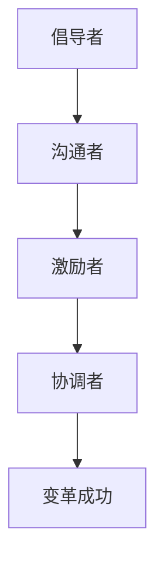

**4.1.2 变革中的角色定位**

在变革过程中，领导者需要明确自己的角色定位，以确保能够有效地推动变革。以下是一些关键角色：

1. **变革发起者**：负责提出变革的初步构想，为变革提供方向。
2. **变革推动者**：负责推动变革的实施，协调各方资源，解决变革过程中的问题。
3. **变革支持者**：负责为变革提供支持和资源，帮助变革顺利进行。
4. **变革反馈者**：负责收集变革过程中的反馈信息，及时调整变革策略。

**核心概念与联系：**

- **变革发起者**：提出变革的初步构想，为变革提供方向。
- **变革推动者**：推动变革的实施，解决变革过程中的问题。
- **变革支持者**：为变革提供支持和资源，确保变革顺利进行。
- **变革反馈者**：收集变革过程中的反馈信息，及时调整变革策略。

**Mermaid 流程图：**

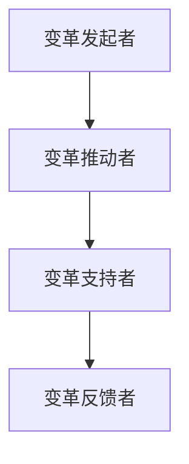

**4.1.3 变革领导力的关键技能**

有效的变革领导力需要具备一系列关键技能，包括：

1. **愿景设定能力**：领导者需要能够清晰地设定变革的愿景和目标，为变革提供方向。
2. **沟通能力**：领导者需要具备出色的沟通能力，确保变革信息准确传达，减少误解和恐慌。
3. **激励能力**：领导者需要能够激励员工，鼓励他们积极参与变革，克服变革过程中的困难。
4. **协调能力**：领导者需要具备协调各方资源的能力，确保变革顺利进行。

**核心概念与联系：**

- **愿景设定能力**：确保变革的愿景和目标明确，为变革提供方向。
- **沟通能力**：确保信息准确传达，减少误解和恐慌。
- **激励能力**：激励员工积极参与变革，增强归属感和责任感。
- **协调能力**：协调各方资源，确保变革顺利进行。

**Mermaid 流�程图：**

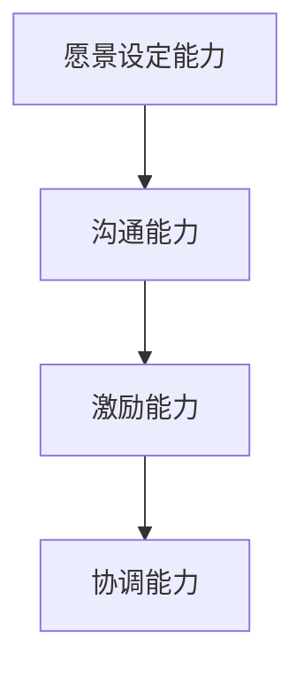

#### 4.2 变革沟通策略

有效的变革沟通策略是确保变革成功的关键。以下是一些关键策略：

**4.2.1 沟通策略与工具**

1. **信息发布策略**：确保信息准确、及时地发布，减少信息偏差。
2. **互动沟通策略**：鼓励员工参与变革讨论，提高他们的参与感和归属感。
3. **反馈收集策略**：建立有效的反馈渠道，收集员工的意见和建议，及时调整变革策略。

**核心概念与联系：**

- **信息发布策略**：确保信息准确、及时地发布。
- **互动沟通策略**：鼓励员工参与变革讨论。
- **反馈收集策略**：收集员工的意见和建议，及时调整变革策略。

**Mermaid 流程图：**

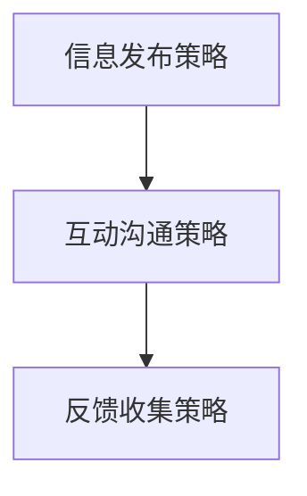

**4.2.2 变革中的有效演讲技巧**

演讲是变革沟通的重要工具。以下是一些有效演讲技巧：

1. **明确目标**：确保演讲目标明确，有助于听众理解和记住关键信息。
2. **简洁有力**：避免冗长的演讲，突出关键点，提高信息传递的效率。
3. **互动与参与**：鼓励听众提问和参与讨论，增加演讲的互动性和参与感。

**核心概念与联系：**

- **明确目标**：确保演讲目标明确。
- **简洁有力**：突出关键点，提高信息传递的效率。
- **互动与参与**：增加演讲的互动性和参与感。

**Mermaid 流程图：**

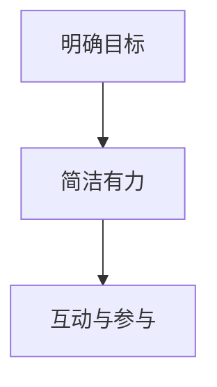

**4.2.3 变革沟通中的反馈与评估**

变革沟通的有效性需要通过反馈和评估来验证。以下是一些关键步骤：

1. **反馈收集**：建立有效的反馈渠道，收集员工的意见和建议。
2. **反馈分析**：对收集到的反馈进行分析，识别沟通中的问题和改进点。
3. **评估与调整**：根据反馈结果进行评估和调整，确保变革沟通的有效性。

**核心概念与联系：**

- **反馈收集**：收集员工的意见和建议。
- **反馈分析**：分析反馈，识别问题和改进点。
- **评估与调整**：根据反馈结果进行评估和调整。

**Mermaid 流程图：**

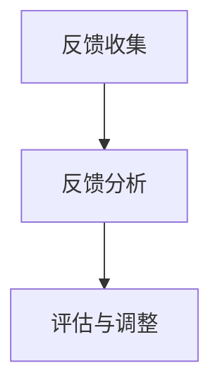

#### 4.3 变革沟通案例分析

为了更好地理解领导力与变革沟通的实践应用，以下将分析一个具体的案例。

**案例背景：**

某大型企业决定进行数字化转型，以提升其市场竞争力。然而，数字化转型涉及到多个部门和岗位的变革，因此需要领导者和团队成员共同参与。

**案例分析与评估：**

1. **领导力实践**：

   - 领导者作为变革的倡导者，明确了数字化转型的愿景和目标，为变革提供了方向。
   - 领导者作为变革的沟通者，通过会议、邮件和内部网络等渠道，确保信息准确、及时地传达给所有相关人员。
   - 领导者作为变革的激励者，鼓励员工积极参与变革，提供培训和支持，帮助员工克服变革过程中的困难和挑战。
   - 领导者作为变革的协调者，协调各方资源，确保变革顺利进行。

2. **变革沟通策略**：

   - 采用信息发布策略，确保信息准确、及时地发布，减少信息偏差。
   - 采用互动沟通策略，鼓励员工参与变革讨论，提高他们的参与感和归属感。
   - 采用反馈收集策略，建立有效的反馈渠道，收集员工的意见和建议，及时调整变革策略。

**案例中的领导力与沟通策略：**

- 领导者通过明确愿景、确保信息传达、激励员工和协调资源等领导力实践，赢得了员工的信任和支持。
- 通过采用有效的变革沟通策略，确保了变革信息的准确传达，减少了误解和恐慌，增强了员工的参与感和归属感。

**案例小结：**

该案例表明，通过有效的领导力和变革沟通策略，企业可以成功推动数字化转型，提升市场竞争力。领导者需要积极倡导变革，确保信息准确传达，激励员工积极参与，并协调各方资源，确保变革顺利进行。

#### 4.4 最佳实践分享

为了帮助读者更好地应用领导力和变革沟通策略，以下分享一些最佳实践：

1. **持续沟通**：变革过程中，领导者需要保持持续的沟通，确保信息准确传达，减少误解和恐慌。
2. **个性化沟通**：针对不同部门和岗位的员工，领导者需要采用个性化的沟通策略，确保他们能够理解并支持变革。
3. **透明化决策**：提高决策过程的透明度，增加员工的信任，让他们感受到变革的公平性和合理性。
4. **反馈机制**：建立有效的反馈机制，及时收集员工的意见和建议，并根据反馈结果进行评估和调整。
5. **培训与支持**：提供必要的培训和支持，帮助员工掌握新技能和知识，增强他们的变革适应能力。

通过这些最佳实践，领导者可以更好地应用领导力和变革沟通策略，赢得变革支持，推动组织变革的成功。

### 构建变革支持系统

赢得变革支持是组织成功实施变革的关键。构建一个有效的变革支持系统，可以帮助组织在变革过程中克服阻力，确保变革顺利进行。以下将探讨变革支持系统的构建原则、组织机制以及领导力实践。

#### 7.1 变革支持的构建原则

构建变革支持系统时，需要遵循以下原则：

1. **透明度**：提高变革过程的透明度，让员工了解变革的原因、目标和方法，增加他们的信任和支持。
2. **参与感**：鼓励员工参与变革的讨论和决策过程，让他们感受到自己在变革中的角色和贡献。
3. **反馈机制**：建立有效的反馈渠道，收集员工的意见和建议，及时调整变革策略。
4. **资源支持**：提供必要的资源和支持，帮助员工克服变革过程中的困难和挑战。
5. **持续沟通**：保持持续的沟通，确保变革信息准确传达，减少误解和恐慌。

**核心概念与联系：**

- **透明度**：提高变革过程的透明度。
- **参与感**：鼓励员工参与变革的讨论和决策过程。
- **反馈机制**：建立有效的反馈渠道。
- **资源支持**：提供必要的资源和支持。
- **持续沟通**：保持持续的沟通。

**Mermaid 流程图：**

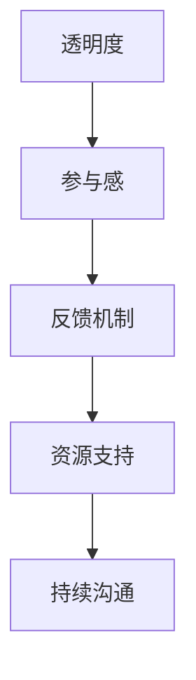

#### 7.2 变革支持的组织机制

为了有效构建变革支持系统，组织需要建立以下组织机制：

1. **变革管理办公室**：负责变革的规划、协调和评估，确保变革的顺利进行。
2. **变革指导委员会**：由高层管理者组成，负责制定变革策略和决策，提供资源支持。
3. **变革实施团队**：由各部门的代表组成，负责具体变革任务的执行和协调。
4. **变革支持小组**：由专业顾问和技术人员组成，为变革提供技术支持和培训。

**核心概念与联系：**

- **变革管理办公室**：负责变革的规划、协调和评估。
- **变革指导委员会**：负责制定变革策略和决策，提供资源支持。
- **变革实施团队**：负责具体变革任务的执行和协调。
- **变革支持小组**：为变革提供技术支持和培训。

**Mermaid 流程图：**

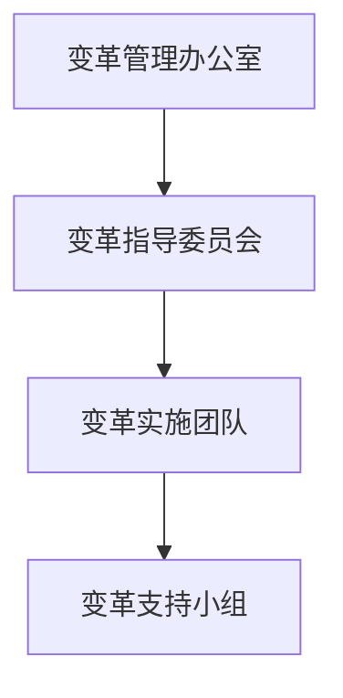

#### 7.3 变革支持中的领导力实践

在变革支持系统中，领导力实践至关重要。以下是一些关键的领导力实践：

1. **领导力培训**：为领导者提供变革管理的培训，提高他们的变革管理能力。
2. **领导力支持**：为领导者提供必要的资源和支持，帮助他们克服变革过程中的挑战。
3. **领导力激励**：通过激励措施，如奖励和晋升机会，激励领导者积极参与变革。
4. **领导力沟通**：领导者需要保持与员工的高效沟通，确保变革信息准确传达，减少误解和恐慌。

**核心概念与联系：**

- **领导力培训**：提高变革管理能力。
- **领导力支持**：提供必要的资源和支持。
- **领导力激励**：通过激励措施，激励领导者参与变革。
- **领导力沟通**：确保变革信息准确传达。

**Mermaid 流程图：**

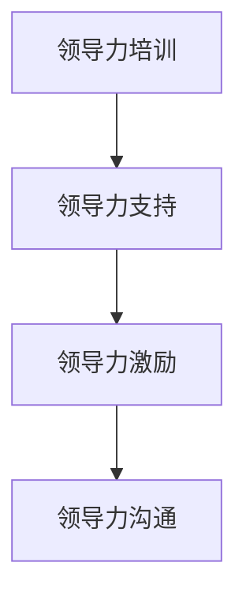

通过构建一个有效的变革支持系统，组织可以更好地应对变革过程中的挑战，赢得员工的信任和支持，确保变革的成功实施。

### 变革支持的评估与调整

在变革过程中，评估和调整变革支持系统至关重要。这有助于确保变革支持的有效性，及时识别和解决变革中的问题，从而推动变革的成功实施。以下将探讨变革支持的评估指标、反馈机制以及动态调整策略。

#### 8.1 变革支持的评估指标

为了有效评估变革支持系统，组织需要设定一系列评估指标，这些指标应涵盖变革的不同方面。以下是一些关键评估指标：

1. **变革接受度**：评估员工对变革的接受程度，包括变革的参与度、员工的满意度和支持度。
2. **变革效果**：评估变革的实际效果，包括业务绩效的改进、员工工作效率的提升等。
3. **沟通效率**：评估变革沟通的效率，包括信息的准确传达、沟通渠道的畅通程度等。
4. **资源利用**：评估变革过程中资源的利用效率，包括人力资源、财务资源等。
5. **员工满意度**：评估员工对变革过程的满意度，包括对领导力实践的认可程度、对变革沟通的满意度等。

**核心概念与联系：**

- **变革接受度**：评估员工对变革的接受程度。
- **变革效果**：评估变革的实际效果。
- **沟通效率**：评估变革沟通的效率。
- **资源利用**：评估资源利用效率。
- **员工满意度**：评估员工对变革过程的满意度。

**Mermaid 流程图：**

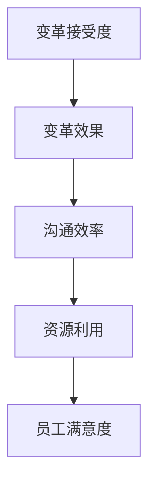

#### 8.2 变革支持中的反馈机制

建立有效的反馈机制是评估变革支持的重要手段。以下是一些关键步骤：

1. **反馈渠道**：确保员工有多个渠道可以提供反馈，如匿名调查、在线问卷、面对面访谈等。
2. **反馈收集**：定期收集员工的反馈，包括对变革接受度、变革效果、沟通效率等方面的意见和建议。
3. **反馈分析**：对收集到的反馈进行分析，识别变革过程中的问题和改进点。
4. **反馈报告**：定期发布反馈报告，向管理层和员工展示反馈结果，促进透明度和信任。

**核心概念与联系：**

- **反馈渠道**：确保员工有多个渠道可以提供反馈。
- **反馈收集**：定期收集员工的反馈。
- **反馈分析**：对反馈进行分析。
- **反馈报告**：发布反馈报告。

**Mermaid 流程图：**

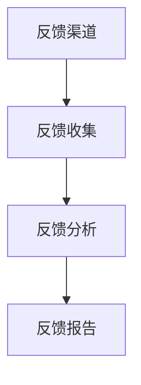

#### 8.3 变革支持的动态调整策略

基于评估指标和反馈机制的结果，组织需要采取动态调整策略，以持续优化变革支持系统。以下是一些关键步骤：

1. **问题识别**：根据反馈结果，识别变革过程中的问题和瓶颈。
2. **优先级排序**：根据问题的重要性和紧急程度，对问题进行优先级排序。
3. **解决方案制定**：制定具体的解决方案，包括改进措施、资源调配等。
4. **实施方案**：实施改进措施，确保解决方案的有效执行。
5. **监控与评估**：监控改进措施的实施效果，评估是否达到预期目标，并根据评估结果进行进一步调整。

**核心概念与联系：**

- **问题识别**：识别变革过程中的问题和瓶颈。
- **优先级排序**：根据问题的重要性和紧急程度进行排序。
- **解决方案制定**：制定具体的解决方案。
- **实施方案**：确保解决方案的有效执行。
- **监控与评估**：监控实施效果。

**Mermaid 流程图：**

```mermaid
graph TD
    A[问题识别] --> B[优先级排序]
    B --> C[解决方案制定]
    C --> D[实施方案]
    D --> E[监控与评估]
```

通过有效的评估和动态调整策略，组织可以持续优化变革支持系统，确保变革顺利进行，赢得员工的信任和支持。

### 变革沟通与领导力的未来趋势

随着科技的快速发展和商业环境的不断变化，变革沟通和领导力将面临新的挑战和机遇。以下是变革沟通与领导力的未来趋势：

#### 9.1 变革环境的变化趋势

1. **数字化变革**：数字化技术正在加速变革的进程，领导者需要适应数字化环境，利用数据分析和人工智能等工具提高变革沟通的效率。
2. **全球化变革**：全球化使得组织面临更多文化差异和复杂环境，领导者需要具备跨文化沟通能力，以更好地管理多元化的团队。
3. **快速变革**：随着市场变化速度加快，领导者需要具备快速响应变革的能力，通过敏捷管理和灵活的领导风格推动组织的持续发展。

#### 9.2 领导力发展的新方向

1. **赋能型领导**：领导者逐渐从控制者转变为赋能者，鼓励员工自主学习和创新，提升组织的适应性和创新能力。
2. **情景型领导**：领导者需要根据不同的情境选择合适的领导风格，灵活应对复杂多变的环境。
3. **领导力共创**：领导者与员工共同参与决策和变革过程，通过协作和共创推动组织发展。

#### 9.3 变革沟通的挑战与机遇

1. **沟通障碍**：随着沟通渠道的多样化和信息过载，领导者需要更有效地管理和过滤信息，确保关键信息准确传达。
2. **员工参与**：如何激发员工参与变革，提升他们的参与感和归属感，是变革沟通的重要挑战。
3. **透明度和信任**：在信息透明度要求日益提高的今天，领导者需要建立信任，提高决策过程的透明度，以赢得员工的信任和支持。

面对这些趋势和挑战，领导者需要不断学习和适应，掌握新的领导力和变革沟通技巧，以推动组织的持续发展和变革成功。

### 总结与展望

本文系统地探讨了领导力与变革沟通的关系，分析了变革沟通的重要性、领导力的基本理论、变革沟通的理论基础以及领导力与变革沟通的实践应用。通过案例分析，我们看到了领导力与变革沟通在实践中的有效结合。最后，本文总结了变革支持的构建原则、组织机制、评估与调整策略，以及变革沟通与领导力的未来趋势。

**核心概念回顾：**

- **变革沟通**：确保信息准确传达，提高员工参与感和透明度。
- **领导力**：通过影响他人实现共同目标的能力，包括愿景设定、沟通能力、激励能力和协调能力。
- **变革支持**：构建有效的支持系统，包括透明度、参与感、反馈机制和资源支持。

**最佳实践建议：**

1. **持续沟通**：保持与员工的持续沟通，确保变革信息准确传达。
2. **个性化沟通**：根据不同部门和岗位的员工特点，采用个性化的沟通策略。
3. **透明化决策**：提高决策过程的透明度，增加员工的信任。
4. **反馈机制**：建立有效的反馈渠道，收集员工的意见和建议。
5. **培训与支持**：提供必要的培训和支持，帮助员工克服变革过程中的困难。

**注意事项：**

- 变革过程中，领导者需要保持灵活性和适应性，及时调整领导风格和沟通策略。
- 建立跨部门团队，促进沟通和协作，共同应对变革挑战。

**拓展阅读：**

- 《变革之心》：探讨组织变革的心理机制和策略。
- 《领导力与战略管理》：分析领导力在战略管理中的关键作用。
- 《敏捷变革管理》：介绍敏捷方法在变革管理中的应用。

通过本文的学习，读者可以更好地理解领导力与变革沟通的关系，掌握赢得变革支持的关键技能，为组织变革的成功实施提供有力支持。

### 作者信息

- 作者：AI天才研究院/AI Genius Institute & 禅与计算机程序设计艺术 /Zen And The Art of Computer Programming

