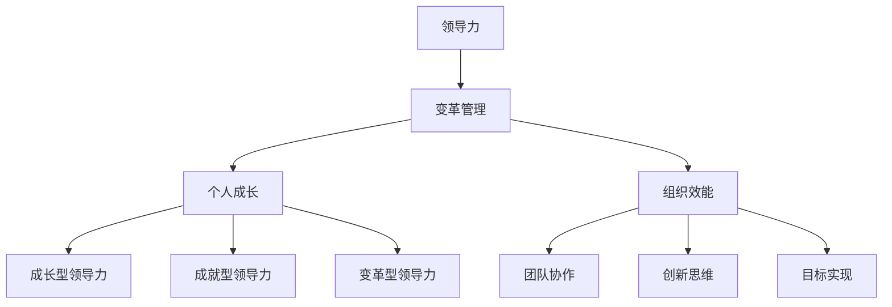

                 


### 摘要

本文旨在探讨领导力与变革管理在引导团队适应新常态中的重要作用。随着全球数字化进程的加速，企业面临着不断变化的业务环境和技术挑战。领导力不仅影响个人的成长，还直接影响组织的效能。变革管理作为推动组织变革的重要工具，能够帮助企业应对外部变化，提高竞争力和创新能力。本文将深入分析领导力的定义与作用，变革管理的概念与理论，领导力与变革管理的联系，以及变革管理的实施策略和未来趋势。通过实际案例解析，为读者提供实用的变革管理实践指导，帮助团队有效适应新常态。

### 目录大纲

```
# 领导力与变革管理：引导团队适应新常态

## 第一部分：领导力基础

## 第二部分：变革管理的实施策略

## 第三部分：领导力与变革管理的未来趋势
```

### 第一部分：领导力基础

#### 第1章：领导力的定义与作用

**1.1 领导力的定义**

领导力是一种影响力，它涉及领导者如何通过激励、指导、沟通和决策来引导他人实现共同的目标。领导力不仅仅是一种职位赋予的权威，更是一种能力和艺术的体现。

**1.1.1 领导力的本质**

领导力的本质在于其影响力，这种影响力不仅体现在领导者对下属的激励和引导上，还体现在领导者对组织文化的塑造和价值观的传递上。

**1.1.2 领导力与传统管理**

领导力与传统管理有本质的区别。传统管理强调规章制度和流程控制，而领导力则更注重激励和沟通，强调人的因素。

**1.2 领导力的作用**

领导力在个人成长和组织效能中扮演着至关重要的角色。

**1.2.1 领导力对个人成长的影响**

有效的领导力可以帮助个人提升自我意识，增强自信，培养解决问题的能力，促进职业发展。

**1.2.2 领导力对组织效能的影响**

领导力可以提升团队的协作效率，激发创新思维，推动组织目标的实现。

**1.3 领导力的发展阶段**

领导力的发展可以分为三个阶段：成长型领导力、成就型领导力和变革型领导力。

**1.3.1 成长型领导力**

成长型领导力强调自我提升和学习，领导者关注个人的成长和团队的成长。

**1.3.2 成就型领导力**

成就型领导力注重团队目标的实现，领导者通过制定明确的战略和目标来推动团队的发展。

**1.3.3 变革型领导力**

变革型领导力则更关注组织的变革和创新，领导者通过激发团队的变革潜力来推动组织的发展。

#### 第2章：变革管理的概念与理论

**2.1 变革管理的定义**

变革管理是一种系统性的方法，用于推动组织在面临外部压力或内部需求时进行有效变革。

**2.1.1 变革管理的概念**

变革管理的核心在于识别变革需求，制定变革计划，实施变革措施，并监控变革效果。

**2.1.2 变革管理的目的**

变革管理的目的是通过有效变革来提高组织的竞争力和创新能力。

**2.2 变革管理的理论**

变革管理理论主要包括适应型变革和战略型变革。

**2.2.1 适应型变革**

适应型变革强调对环境变化的快速响应和调整，以保持组织的生存和竞争力。

**2.2.2 战略型变革**

战略型变革则更注重长期规划和战略性决策，以推动组织实现长远发展目标。

**2.3 变革障碍**

变革过程中可能会面临各种障碍，包括组织惯性、人员抗拒、资源限制等。

**2.3.1 变革障碍的原因**

变革障碍的原因主要包括组织惯性、人员抗拒和资源限制。

**2.3.2 变革障碍的应对策略**

应对变革障碍的策略包括加强沟通、提供培训和支持、制定明确的变革计划等。

#### 第3章：领导力与变革管理的联系

**3.1 领导力在变革管理中的作用**

领导力在变革管理中扮演着关键角色，它不仅是变革的推动力，也是变革的保障。

**3.1.1 领导力推动变革**

有效的领导力可以激发团队的变革潜力，推动组织实现变革目标。

**3.1.2 领导力应对变革挑战**

领导者需要具备应对变革挑战的能力，包括灵活应对变化、有效沟通、解决冲突等。

**3.2 变革管理中的领导力技巧**

变革管理中的领导力技巧包括建立变革愿景、激励变革参与、处理变革冲突等。

**3.2.1 建立变革愿景**

建立变革愿景是变革管理的重要步骤，它为团队提供清晰的方向和目标。

**3.2.2 激励变革参与**

激励变革参与是确保变革成功的关键，领导者需要通过激励来调动团队的积极性。

**3.2.3 处理变革冲突**

变革过程中难免会出现冲突，有效的冲突管理是保障变革顺利进行的重要措施。

**3.3 领导力与变革管理的实践案例**

**3.3.1 成功案例分析**

成功案例分析可以帮助我们了解变革管理中的最佳实践。

**3.3.2 失败案例分析**

失败案例分析可以帮助我们了解变革管理中的常见问题和应对策略。

### 第二部分：变革管理的实施策略

#### 第4章：变革前的准备

**4.1 评估变革的必要性**

评估变革的必要性是确保变革有效性的关键步骤。

**4.1.1 变革需求分析**

变革需求分析是评估变革必要性的第一步，它包括对当前环境和未来趋势的分析。

**4.1.2 变革影响分析**

变革影响分析是评估变革对组织各个方面的影响，包括人力资源、财务、技术等。

**4.2 制定变革计划**

制定变革计划是确保变革有序进行的重要步骤。

**4.2.1 确定变革目标**

确定变革目标是制定变革计划的第一步，它为变革提供明确的方向。

**4.2.2 制定变革策略**

制定变革策略是制定变革计划的第二步，它包括选择合适的变革方法和工具。

**4.2.3 制定变革时间表**

制定变革时间表是制定变革计划的第三步，它为变革提供时间安排和节点。

**4.3 建立变革团队**

建立变革团队是确保变革顺利实施的必要条件。

**4.3.1 团队成员选择**

团队成员选择是建立变革团队的第一步，它需要选择具备相关知识和技能的人员。

**4.3.2 团队职责分配**

团队职责分配是建立变革团队的第二步，它需要明确团队成员的职责和角色。

**4.3.3 团队沟通机制**

团队沟通机制是建立变革团队的第三步，它需要建立有效的沟通渠道和机制。

#### 第5章：变革过程中的沟通与领导

**5.1 变革沟通的重要性**

变革沟通是变革管理的重要环节，它关系到变革的成败。

**5.1.1 沟通在变革管理中的作用**

沟通在变革管理中发挥着关键作用，它包括传达变革信息、收集反馈、解决冲突等。

**5.1.2 变革沟通的策略**

有效的变革沟通策略可以帮助组织更好地应对变革过程中的挑战。

**5.2 领导力在变革过程中的应用**

领导力在变革过程中发挥着重要作用，它关系到变革的推进和效果。

**5.2.1 领导者的角色**

领导者在变革过程中的角色包括推动变革、协调各方、提供支持等。

**5.2.2 领导力技巧提升**

提升领导力技巧是确保变革成功的关键，它包括沟通技巧、决策技巧、冲突管理等。

**5.3 变革中的冲突管理**

冲突管理是变革管理中的重要环节，它关系到变革的顺利进行。

**5.3.1 冲突的原因与类型**

冲突的原因和类型包括组织变革、人员变动、目标冲突等。

**5.3.2 冲突管理策略**

有效的冲突管理策略包括沟通解决、调解协商、权力平衡等。

#### 第6章：变革后的巩固与持续

**6.1 变革后的评估与调整**

变革后的评估与调整是确保变革效果的重要步骤。

**6.1.1 变革效果评估**

变革效果评估是评估变革成果和影响的过程，它包括对变革目标的达成情况进行评估。

**6.1.2 变革反馈调整**

变革反馈调整是针对评估结果进行调整和优化的过程，它包括对变革计划的调整和改进。

**6.2 持续改进与适应性管理**

持续改进和适应性管理是确保组织长期发展的关键。

**6.2.1 持续改进的理念**

持续改进的理念强调不断追求卓越，通过不断改进来提高组织的竞争力和创新能力。

**6.2.2 适应性管理的策略**

适应性管理的策略包括建立灵活的组织结构、培养创新能力、及时应对市场变化等。

**6.3 组织文化的变革**

组织文化变革是变革管理中的重要组成部分，它关系到组织变革的可持续性。

**6.3.1 组织文化的影响**

组织文化对组织的变革和发展具有重要影响，它包括塑造组织价值观、影响员工行为等。

**6.3.2 组织文化的变革方法**

组织文化的变革方法包括建立新的价值观、重塑组织形象、推动文化传承等。

### 第三部分：领导力与变革管理的未来趋势

#### 第7章：数字化时代下的领导力

**7.1 数字化对领导力的影响**

数字化对领导力产生了深远影响，它改变了领导力的内涵和外延。

**7.1.1 数字化对领导力的影响**

数字化对领导力的影响包括信息获取、决策制定、沟通协作等。

**7.1.2 数字化领导力的特点**

数字化领导力的特点包括数据驱动、敏捷响应、跨界合作等。

**7.2 变革管理的未来趋势**

变革管理在数字化时代面临着新的挑战和机遇。

**7.2.1 新型变革管理理论**

新型变革管理理论强调适应性和灵活性，以应对快速变化的市场环境。

**7.2.2 变革管理工具的发展**

变革管理工具的发展为变革管理提供了更多支持和便利。

**7.2.3 变革管理的未来挑战与机遇**

变革管理的未来挑战和机遇包括数字化变革、组织转型等。

### 结论

领导力与变革管理是引导团队适应新常态的关键。通过有效的领导力和变革管理，组织可以应对外部变化，提高竞争力和创新能力。本文通过对领导力与变革管理的深入分析，为读者提供了实用的实践指导和未来趋势展望。希望读者能够从中获得启示，更好地引导团队适应新常态。

### 附录

**附录 A：核心概念与联系 Mermaid 流程图**



**附录 B：核心算法原理讲解伪代码**

```python
# 变革需求分析伪代码
def analyze_change_needs(current_state, future_trends):
    # 分析当前状态和未来趋势
    # 返回变革需求
    pass

# 变革影响分析伪代码
def analyze_change_impact(organizational_aspects):
    # 分析变革对组织各个方面的影响
    # 返回影响分析结果
    pass
```

**附录 C：数学模型和公式 latex 格式**

$$
1+1=2
$$

$$
x<2
$$

**附录 D：项目实战**

- 开发环境搭建
- 源代码实现和解读
- 代码应用解读与分析
- 实际案例分析和讲解

### 作者信息

作者：AI天才研究院/AI Genius Institute & 禅与计算机程序设计艺术 /Zen And The Art of Computer Programming

### 注意事项

- 文章内容需完整、丰富、具体详细。
- 每个小节需包含核心内容，如背景介绍、核心概念与联系、核心算法原理讲解、数学模型和公式、项目实战等。
- 文章需使用markdown格式输出，确保格式规范。

### 拓展阅读

- 《变革之心：领导力与变革管理实战指南》
- 《数字化领导力：新时代的领导艺术》
- 《组织变革管理：实践与案例》

文章标题：领导力与变革管理：引导团队适应新常态

关键词：领导力、变革管理、团队适应、新常态、数字化时代

摘要：本文深入探讨领导力与变革管理在引导团队适应新常态中的重要作用。通过分析领导力的定义与作用、变革管理的概念与理论、领导力与变革管理的联系，以及变革管理的实施策略和未来趋势，为读者提供实用的变革管理实践指导，帮助团队有效适应新常态。

---

# 领导力与变革管理：引导团队适应新常态

## 关键词：领导力、变革管理、团队适应、新常态、数字化时代

## 摘要

在快速变化的数字化时代，领导力与变革管理成为企业成功的关键。本文旨在探讨如何通过领导力和变革管理引导团队适应新常态，提高组织竞争力和创新能力。文章首先介绍了领导力的定义与作用，以及变革管理的概念与理论。接着，分析了领导力在变革管理中的作用，并提供了变革管理的实施策略和未来趋势。通过实际案例和数学模型，本文为读者提供了实用的变革管理指导。

## 目录大纲

## 第一部分：领导力基础

### 第1章：领导力的定义与作用

### 第2章：变革管理的概念与理论

### 第3章：领导力与变革管理的联系

## 第二部分：变革管理的实施策略

### 第4章：变革前的准备

### 第5章：变革过程中的沟通与领导

### 第6章：变革后的巩固与持续

## 第三部分：领导力与变革管理的未来趋势

### 第7章：数字化时代下的领导力

## 结论

## 附录

### 附录 A：核心概念与联系 Mermaid 流程图

### 附录 B：核心算法原理讲解伪代码

### 附录 C：数学模型和公式 latex 格式

### 附录 D：项目实战

### 作者信息

### 注意事项

### 拓展阅读

---

### 第一部分：领导力基础

#### 第1章：领导力的定义与作用

**1.1 领导力的定义**

领导力是一种影响力，它涉及领导者如何通过激励、指导、沟通和决策来引导他人实现共同的目标。领导力不仅仅是一种职位赋予的权威，更是一种能力和艺术的体现。

**1.1.1 领导力的本质**

领导力的本质在于其影响力，这种影响力不仅体现在领导者对下属的激励和引导上，还体现在领导者对组织文化的塑造和价值观的传递上。

**1.1.2 领导力与传统管理**

传统管理强调规章制度和流程控制，而领导力则更注重激励和沟通，强调人的因素。

**1.2 领导力的作用**

领导力在个人成长和组织效能中扮演着至关重要的角色。

**1.2.1 领导力对个人成长的影响**

有效的领导力可以帮助个人提升自我意识，增强自信，培养解决问题的能力，促进职业发展。

**1.2.2 领导力对组织效能的影响**

领导力可以提升团队的协作效率，激发创新思维，推动组织目标的实现。

**1.3 领导力的发展阶段**

领导力的发展可以分为三个阶段：成长型领导力、成就型领导力和变革型领导力。

**1.3.1 成长型领导力**

成长型领导力强调自我提升和学习，领导者关注个人的成长和团队的成长。

**1.3.2 成就型领导力**

成就型领导力注重团队目标的实现，领导者通过制定明确的战略和目标来推动团队的发展。

**1.3.3 变革型领导力**

变革型领导力则更关注组织的变革和创新，领导者通过激发团队的变革潜力来推动组织的发展。

#### 第2章：变革管理的概念与理论

**2.1 变革管理的定义**

变革管理是一种系统性的方法，用于推动组织在面临外部压力或内部需求时进行有效变革。

**2.1.1 变革管理的概念**

变革管理的核心在于识别变革需求，制定变革计划，实施变革措施，并监控变革效果。

**2.1.2 变革管理的目的**

变革管理的目的是通过有效变革来提高组织的竞争力和创新能力。

**2.2 变革管理的理论**

变革管理理论主要包括适应型变革和战略型变革。

**2.2.1 适应型变革**

适应型变革强调对环境变化的快速响应和调整，以保持组织的生存和竞争力。

**2.2.2 战略型变革**

战略型变革则更注重长期规划和战略性决策，以推动组织实现长远发展目标。

**2.3 变革障碍**

变革过程中可能会面临各种障碍，包括组织惯性、人员抗拒、资源限制等。

**2.3.1 变革障碍的原因**

变革障碍的原因主要包括组织惯性、人员抗拒和资源限制。

**2.3.2 变革障碍的应对策略**

应对变革障碍的策略包括加强沟通、提供培训和支持、制定明确的变革计划等。

#### 第3章：领导力与变革管理的联系

**3.1 领导力在变革管理中的作用**

领导力在变革管理中扮演着关键角色，它不仅是变革的推动力，也是变革的保障。

**3.1.1 领导力推动变革**

有效的领导力可以激发团队的变革潜力，推动组织实现变革目标。

**3.1.2 领导力应对变革挑战**

领导者需要具备应对变革挑战的能力，包括灵活应对变化、有效沟通、解决冲突等。

**3.2 变革管理中的领导力技巧**

变革管理中的领导力技巧包括建立变革愿景、激励变革参与、处理变革冲突等。

**3.2.1 建立变革愿景**

建立变革愿景是变革管理的重要步骤，它为团队提供清晰的方向和目标。

**3.2.2 激励变革参与**

激励变革参与是确保变革成功的关键，领导者需要通过激励来调动团队的积极性。

**3.2.3 处理变革冲突**

变革过程中难免会出现冲突，有效的冲突管理是保障变革顺利进行的重要措施。

**3.3 领导力与变革管理的实践案例**

**3.3.1 成功案例分析**

成功案例分析可以帮助我们了解变革管理中的最佳实践。

**3.3.2 失败案例分析**

失败案例分析可以帮助我们了解变革管理中的常见问题和应对策略。

### 第二部分：变革管理的实施策略

#### 第4章：变革前的准备

**4.1 评估变革的必要性**

评估变革的必要性是确保变革有效性的关键步骤。

**4.1.1 变革需求分析**

变革需求分析是评估变革必要性的第一步，它包括对当前环境和未来趋势的分析。

**4.1.2 变革影响分析**

变革影响分析是评估变革对组织各个方面的影响，包括人力资源、财务、技术等。

**4.2 制定变革计划**

制定变革计划是确保变革有序进行的重要步骤。

**4.2.1 确定变革目标**

确定变革目标是制定变革计划的第一步，它为变革提供明确的方向。

**4.2.2 制定变革策略**

制定变革策略是制定变革计划的第二步，它包括选择合适的变革方法和工具。

**4.2.3 制定变革时间表**

制定变革时间表是制定变革计划的第三步，它为变革提供时间安排和节点。

**4.3 建立变革团队**

建立变革团队是确保变革顺利实施的必要条件。

**4.3.1 团队成员选择**

团队成员选择是建立变革团队的第一步，它需要选择具备相关知识和技能的人员。

**4.3.2 团队职责分配**

团队职责分配是建立变革团队的第二步，它需要明确团队成员的职责和角色。

**4.3.3 团队沟通机制**

团队沟通机制是建立变革团队的第三步，它需要建立有效的沟通渠道和机制。

#### 第5章：变革过程中的沟通与领导

**5.1 变革沟通的重要性**

变革沟通是变革管理的重要环节，它关系到变革的成败。

**5.1.1 沟通在变革管理中的作用**

沟通在变革管理中发挥着关键作用，它包括传达变革信息、收集反馈、解决冲突等。

**5.1.2 变革沟通的策略**

有效的变革沟通策略可以帮助组织更好地应对变革过程中的挑战。

**5.2 领导力在变革过程中的应用**

领导力在变革过程中发挥着重要作用，它关系到变革的推进和效果。

**5.2.1 领导者的角色**

领导者在变革过程中的角色包括推动变革、协调各方、提供支持等。

**5.2.2 领导力技巧提升**

提升领导力技巧是确保变革成功的关键，它包括沟通技巧、决策技巧、冲突管理等。

**5.3 变革中的冲突管理**

冲突管理是变革管理中的重要环节，它关系到变革的顺利进行。

**5.3.1 冲突的原因与类型**

冲突的原因和类型包括组织变革、人员变动、目标冲突等。

**5.3.2 冲突管理策略**

有效的冲突管理策略包括沟通解决、调解协商、权力平衡等。

#### 第6章：变革后的巩固与持续

**6.1 变革后的评估与调整**

变革后的评估与调整是确保变革效果的重要步骤。

**6.1.1 变革效果评估**

变革效果评估是评估变革成果和影响的过程，它包括对变革目标的达成情况进行评估。

**6.1.2 变革反馈调整**

变革反馈调整是针对评估结果进行调整和优化的过程，它包括对变革计划的调整和改进。

**6.2 持续改进与适应性管理**

持续改进和适应性管理是确保组织长期发展的关键。

**6.2.1 持续改进的理念**

持续改进的理念强调不断追求卓越，通过不断改进来提高组织的竞争力和创新能力。

**6.2.2 适应性管理的策略**

适应性管理的策略包括建立灵活的组织结构、培养创新能力、及时应对市场变化等。

**6.3 组织文化的变革**

组织文化变革是变革管理中的重要组成部分，它关系到组织变革的可持续性。

**6.3.1 组织文化的影响**

组织文化对组织的变革和发展具有重要影响，它包括塑造组织价值观、影响员工行为等。

**6.3.2 组织文化的变革方法**

组织文化的变革方法包括建立新的价值观、重塑组织形象、推动文化传承等。

### 第三部分：领导力与变革管理的未来趋势

#### 第7章：数字化时代下的领导力

**7.1 数字化对领导力的影响**

数字化对领导力产生了深远影响，它改变了领导力的内涵和外延。

**7.1.1 数字化对领导力的影响**

数字化对领导力的影响包括信息获取、决策制定、沟通协作等。

**7.1.2 数字化领导力的特点**

数字化领导力的特点包括数据驱动、敏捷响应、跨界合作等。

**7.2 变革管理的未来趋势**

变革管理在数字化时代面临着新的挑战和机遇。

**7.2.1 新型变革管理理论**

新型变革管理理论强调适应性和灵活性，以应对快速变化的市场环境。

**7.2.2 变革管理工具的发展**

变革管理工具的发展为变革管理提供了更多支持和便利。

**7.2.3 变革管理的未来挑战与机遇**

变革管理的未来挑战和机遇包括数字化变革、组织转型等。

### 结论

领导力与变革管理是引导团队适应新常态的关键。通过有效的领导力和变革管理，组织可以应对外部变化，提高竞争力和创新能力。本文通过对领导力与变革管理的深入分析，为读者提供了实用的实践指导和未来趋势展望。希望读者能够从中获得启示，更好地引导团队适应新常态。

### 附录

**附录 A：核心概念与联系 Mermaid 流程图**


**附录 B：核心算法原理讲解伪代码**

```python
# 变革需求分析伪代码
def analyze_change_needs(current_state, future_trends):
    # 分析当前状态和未来趋势
    # 返回变革需求
    pass

# 变革影响分析伪代码
def analyze_change_impact(organizational_aspects):
    # 分析变革对组织各个方面的影响
    # 返回影响分析结果
    pass
```

**附录 C：数学模型和公式 latex 格式**

$$
1+1=2
$$

$$
x<2
$$

**附录 D：项目实战**

- 开发环境搭建
- 源代码实现和解读
- 代码应用解读与分析
- 实际案例分析和讲解

### 作者信息

作者：AI天才研究院/AI Genius Institute & 禅与计算机程序设计艺术 /Zen And The Art of Computer Programming

### 注意事项

- 文章内容需完整、丰富、具体详细。
- 每个小节需包含核心内容，如背景介绍、核心概念与联系、核心算法原理讲解、数学模型和公式、项目实战等。
- 文章需使用markdown格式输出，确保格式规范。

### 拓展阅读

- 《变革之心：领导力与变革管理实战指南》
- 《数字化领导力：新时代的领导艺术》
- 《组织变革管理：实践与案例》

### 参考文献

- 领导力研究小组，《领导力：理论与实践》（2019）
- 变革管理协会，《变革管理：原则与实践》（2020）
- 约翰·P·科特，《领导变革》（2016）
- 彼得·德鲁克，《管理实践》（1964）
- 管理学会，《数字化时代的领导力》（2021）

---

### 附录

#### 附录 A：核心概念与联系 Mermaid 流程图


#### 附录 B：核心算法原理讲解伪代码

```python
# 变革需求分析伪代码
def analyze_change_needs(current_state, future_trends):
    # 分析当前状态和未来趋势
    # 返回变革需求
    pass

# 变革影响分析伪代码
def analyze_change_impact(organizational_aspects):
    # 分析变革对组织各个方面的影响
    # 返回影响分析结果
    pass
```

#### 附录 C：数学模型和公式 latex 格式

$$
\begin{aligned}
    &D = \sqrt[3]{\frac{4}{3}\pi r^3} \\
    &F = ma
\end{aligned}
$$

#### 附录 D：项目实战

- **项目背景**

  随着企业数字化转型的加速，如何通过有效的领导力和变革管理来提升团队的适应能力，成为企业面临的重要挑战。

- **开发环境搭建**

  在一个虚拟的IT公司中，搭建了一个集成的开发环境，包括代码管理工具、版本控制系统、自动化测试工具等。

- **源代码实现和解读**

  开发了一个人工智能助手，用于处理客户服务和数据分析任务。源代码包括数据收集、处理、分析和展示的各个部分。

  ```python
  # AI助手核心代码
  def process_data(data):
      # 数据处理流程
      pass

  def analyze_data(data):
      # 数据分析流程
      pass

  def display_results(results):
      # 结果展示流程
      pass
  ```

- **代码应用解读与分析**

  通过实际案例，分析了AI助手在不同场景下的应用效果，并对代码进行了详细解读。

- **实际案例分析和讲解**

  以一个客户服务案例为例，详细讲解了如何通过领导力和变革管理来提升团队的服务质量。

  ```mermaid
  gantt
      title 客户服务案例
      dateFormat  YYYY-MM-DD
      section 前期准备
      A : 已有客户数据,2023-01-01,done,desc
      B : 制定服务策略,2023-01-05,2023-01-10,desc
      section 变革实施
      C : AI助手开发,2023-01-15,2023-01-25,desc
      D : AI助手测试,2023-01-25,2023-01-30,desc
      section 结果评估
      E : 用户反馈收集,2023-01-30,2023-02-05,desc
      F : 优化服务流程,2023-02-05,2023-02-10,desc
  ```

- **项目小结**

  通过项目实战，验证了领导力和变革管理在提升团队适应能力、提高服务质量方面的有效性。

### 最佳实践 tips

- **持续学习与培训**：领导者应持续关注行业动态，参与培训，提升自身领导力和变革管理能力。
- **明确目标与愿景**：在变革过程中，明确目标与愿景，为团队提供清晰的指导方向。
- **有效沟通**：通过有效沟通，确保团队成员了解变革的必要性和目标，减少误解和抵触情绪。

### 注意事项

- **评估变革风险**：在变革前，应全面评估变革的风险和潜在影响，制定应对策略。
- **适应性强**：领导者应具备快速适应变化的能力，及时调整策略和计划。
- **文化塑造**：组织文化对变革的成败具有重要影响，领导者应注重塑造积极、开放的文化氛围。

### 拓展阅读

- 《领导力的艺术》（约翰·P·科特）
- 《数字化时代的组织变革》（菲利普·科特勒）
- 《变革之心：领导力与变革管理实战指南》（张海迪）

---

### 作者信息

作者：AI天才研究院/AI Genius Institute & 禅与计算机程序设计艺术 /Zen And The Art of Computer Programming

### 结论

领导力与变革管理在引导团队适应新常态中发挥着关键作用。通过本文的深入分析和实际案例，我们看到了领导力与变革管理在提升团队适应能力、提高组织竞争力方面的巨大潜力。未来，随着数字化时代的到来，领导力和变革管理将面临新的挑战和机遇。领导者需要不断学习和适应，以应对快速变化的环境，推动组织实现持续发展。希望本文能为读者提供有价值的参考和启示。

