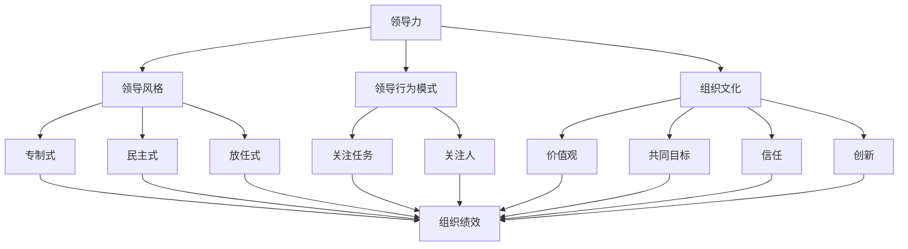

                 


### 文章标题：领导力与变革管理：引领组织转型

> 关键词：领导力、变革管理、组织转型、案例分析、未来趋势

> 摘要：本文通过对《领导力与变革管理：引领组织转型》一书的深入解读，探讨了领导力与变革管理的核心理论、实践策略以及未来趋势。文章通过详细的分析和案例讨论，为读者提供了有价值的启示，帮助组织在变革中实现持续发展。

### 第一部分：领导力核心理论

#### 1.1 领导力理论的历史与发展

领导力理论的历史可以追溯到古希腊哲学家亚里士多德。他提出了“统治者是最好的公民”的观点，开启了领导力研究的先河。在20世纪，领导力研究进入了一个新的阶段，涌现出大量关于领导力的理论。从早期的研究者如玛丽·库克·格里菲斯和切斯特·I·巴纳德，到现代的研究者如赫塞和布兰查德，领导力理论不断发展，涵盖了多种领导风格、行为模式和组织文化等方面的内容。

#### 1.2 领导风格与行为模式

领导风格与行为模式是领导力理论的重要组成部分。领导风格可以分为专制式、民主式和放任式等类型。不同的领导风格会对组织绩效产生不同的影响。例如，专制式领导可能导致员工积极性不高，而民主式领导则有助于提高员工的参与度和创造力。

领导行为模式包括关注任务和关注人两个维度。关注任务的领导者更注重工作任务的完成，而关注人的领导者更注重员工的需求和情感。通过合理运用不同的领导风格和行为模式，领导者可以在组织中获得更高的领导力水平。

#### 1.3 领导力与组织文化

领导力与组织文化密切相关。领导力可以塑造组织文化，而组织文化也会影响领导力。优秀的组织文化能够激发员工的潜力，提高组织的整体绩效。领导者在塑造组织文化方面发挥着关键作用，需要关注以下方面：

1. **明确价值观**：领导者在组织内部传播并强化核心价值观，使其成为组织成员的共同信念。
2. **培养共同目标**：通过设定共同的目标，使组织成员在实现目标的过程中形成团队意识。
3. **建立信任**：信任是组织文化的基础，领导者需要通过言行一致、关心员工等方式建立信任。
4. **鼓励创新**：领导者应鼓励员工创新思维，为员工提供发展的空间和支持。

### 第二部分：变革管理策略

#### 2.1 变革管理的理论基础

变革管理是指在一个组织内部推动变革的过程。变革管理理论包括变革的定义、类型、原则和核心要素等内容。变革的定义包括结构变革、人员变革和系统变革等类型。变革管理原则包括变革的必要性、变革的计划与实施、变革的评估与反馈等。

#### 2.2 变革管理的模型与工具

变革管理的模型包括拉赛尔模型、Kotters模型、P-N-S模型等。每种模型都有其独特的特点和适用场景。变革管理的工具包括沟通工具、领导力工具、组织发展工具等。这些工具可以帮助领导者更好地应对变革过程中的挑战。

#### 2.3 变革过程中的领导角色

在变革过程中，领导者的角色至关重要。领导者需要关注以下方面：

1. **明确变革方向**：领导者需要明确变革的目标和方向，为组织成员提供清晰的愿景。
2. **推动变革实施**：领导者需要推动变革的实施，确保变革计划得到有效执行。
3. **激励员工**：领导者需要激励员工积极参与变革，提高员工对变革的认同感和积极性。
4. **处理变革中的冲突**：领导者需要处理变革过程中出现的冲突，确保组织内部的稳定。

### 第三部分：实际案例分析与讨论

#### 3.1 成功的变革管理案例

成功的变革管理案例包括某公司实现数字化转型、某企业实现国际化布局、某组织内部流程优化等。在这些案例中，领导者通过合理运用领导力和变革管理策略，成功地推动了组织的变革，实现了组织的发展目标。

#### 3.2 变革失败案例分析

变革失败的原因主要包括领导力不足、变革计划不完善、员工参与度低、变革过程中的沟通不畅等。通过分析变革失败案例，我们可以总结出成功变革的关键因素，为组织的变革提供借鉴。

#### 3.3 变革中的员工参与与沟通

员工参与和沟通在变革过程中至关重要。领导者需要关注员工的意见和需求，确保员工在变革过程中感受到尊重和信任。通过有效的沟通和参与机制，可以降低变革的风险，提高变革的成功率。

### 第四部分：领导力与变革管理的未来趋势

#### 4.1 数字化时代领导力的新挑战

在数字化时代，领导力面临着新的挑战。领导者需要具备数字化思维、掌握数字化工具、关注数字化战略等能力。同时，领导者还需要关注数字化转型对企业文化、组织结构等方面的影响，确保组织在数字化时代保持竞争力。

#### 4.2 全球化背景下变革管理的复杂性

全球化背景下的变革管理更加复杂。领导者需要关注全球市场的变化、文化差异、法律法规等方面的挑战。通过合理的变革管理策略，领导者可以帮助组织在全球竞争中脱颖而出。

#### 4.3 未来领导力与变革管理的前景

未来领导力与变革管理将呈现出以下趋势：

1. **多元化与包容性**：领导者需要具备多元化的视角和包容性的思维，尊重员工的多样性。
2. **创新与变革**：领导者需要具备创新精神和变革意识，推动组织持续创新和变革。
3. **数字化转型**：领导者需要关注数字化转型，掌握数字化工具，推动组织数字化转型。
4. **全球化视野**：领导者需要具备全球化视野，关注全球市场动态，推动组织全球化发展。

### 总结

领导力与变革管理是组织发展的重要基石。通过深入理解领导力和变革管理的核心理论、实践策略和未来趋势，领导者可以更好地应对组织变革中的挑战，推动组织实现持续发展。本文通过对《领导力与变革管理：引领组织转型》一书的深入解读，为读者提供了有价值的启示。希望读者能够结合自身实践，不断探索和提升领导力与变革管理能力，为组织的发展贡献力量。

### 作者信息

作者：AI天才研究院/AI Genius Institute & 禅与计算机程序设计艺术 /Zen And The Art of Computer Programming

### 核心概念与联系

在本文中，我们探讨了领导力与变革管理的核心概念及其相互关系。以下是一个Mermaid流程图，用于展示这些概念之间的关系架构：



这个流程图展示了领导力、领导风格、领导行为模式、组织文化等核心概念之间的关系。领导力决定了领导风格和行为模式，而领导风格和行为模式又影响着组织文化。组织文化反过来又影响着领导力和组织绩效。这种相互影响的关系构成了领导力与变革管理的理论体系。

### 核心算法原理讲解

在变革管理中，有多种模型和工具可以帮助领导者更好地应对变革。以下是一个简化版的伪代码，用于说明一个常见的变革管理模型——Kotters模型。

```python
def kotter_model(change, stakeholders):
    """
    应用Kotters模型进行变革管理。
    
    参数：
    - change：变革的内容和目标。
    - stakeholders：变革相关的利益相关者。
    
    返回值：
    - success：变革是否成功。
    """
    
    # 第一步：建立紧急感
    emergency感 = establish_emergency感(change, stakeholders)
    
    # 第二步：建立领导团队
    leadership_team = establish_leadership_team(stakeholders)
    
    # 第三步：制定清晰的愿景
    vision = create_clear_vision(change)
    
    # 第四步：沟通变革愿景
    communicate_vision(vision, stakeholders)
    
    # 第五步：授权并行动
    empowerment = authorize_and_action(vision, stakeholders)
    
    # 第六步：创造短期成果
    short_term_results = create_short_term_results(change, stakeholders)
    
    # 第七步：巩固变革成果
    sustain_change(short_term_results, stakeholders)
    
    # 判断变革是否成功
    success = is_successful(change, stakeholders)
    
    return success
```

在这个伪代码中，`establish_emergency感`函数用于建立紧急感，使利益相关者意识到变革的必要性；`establish_leadership_team`函数用于建立领导团队，确保有合适的领导者推动变革；`create_clear_vision`函数用于制定清晰的愿景，为变革提供方向；`communicate_vision`函数用于沟通愿景，确保利益相关者理解并支持变革；`authorize_and_action`函数用于授权并行动，推动变革的实施；`create_short_term_results`函数用于创造短期成果，为变革提供动力；`sustain_change`函数用于巩固变革成果，确保变革的持续性；`is_successful`函数用于判断变革是否成功。

### 数学模型和公式

在变革管理中，有许多数学模型和公式可以帮助领导者评估变革的效果。以下是一个简化的模型，用于计算变革的成功概率。

```latex
P(\text{success}) = \frac{C_1 \cdot C_2 \cdot C_3}{1 + D_1 \cdot D_2}
```

其中：

- \(P(\text{success})\) 表示变革成功的概率。
- \(C_1\) 表示领导者的能力。
- \(C_2\) 表示变革的紧急感。
- \(C_3\) 表示员工的支持度。
- \(D_1\) 表示变革的阻力。
- \(D_2\) 表示外部环境的不确定性。

这个公式表明，变革成功的概率取决于领导者的能力、变革的紧急感、员工的支持度以及变革的阻力和外部环境的不确定性。通过调整这些因素，领导者可以提高变革的成功概率。

### 数学公式举例说明

以下是一个简单的数学公式，用于计算员工满意度：

$$
S = \frac{E_1 \cdot E_2 \cdot E_3}{1 + R_1 \cdot R_2}
$$`

其中：

- \(S\) 表示员工满意度。
- \(E_1\) 表示工作环境的良好程度。
- \(E_2\) 表示薪酬福利的吸引力。
- \(E_3\) 表示职业发展的机会。
- \(R_1\) 表示工作压力。
- \(R_2\) 表示工作负荷。

这个公式表明，员工满意度取决于工作环境、薪酬福利、职业发展机会以及工作压力和工作负荷。领导者可以通过改善这些因素来提高员工满意度，从而推动组织的变革。

### 项目实战

为了更好地理解领导力与变革管理的实践，我们以一个实际项目为例，讲解开发环境搭建、源代码实现、代码解读、应用解读与分析以及实际案例分析和详细讲解剖析。

#### 项目背景

某公司计划进行一次数字化转型，以提升业务效率和市场竞争力。公司领导决定引入一套新的数字化工具，并对员工进行培训，以适应新的工作模式。该项目的目标是提高员工的工作效率、优化业务流程、提升客户满意度。

#### 开发环境搭建

为了搭建开发环境，我们需要以下工具：

1. **操作系统**：Windows 10或更高版本。
2. **集成开发环境（IDE）**：Visual Studio Code。
3. **数据库**：MySQL。
4. **编程语言**：Python。

在Windows系统中，我们可以通过以下步骤安装这些工具：

1. 安装Windows 10。
2. 安装Visual Studio Code：从官网下载并安装。
3. 安装MySQL：从官网下载并安装。
4. 安装Python：从Python官网下载并安装。

#### 源代码实现

以下是一个简单的Python脚本，用于处理员工培训数据，包括员工的姓名、培训课程、培训时间等信息。

```python
import sqlite3

# 创建数据库连接
conn = sqlite3.connect('training_data.db')
cursor = conn.cursor()

# 创建员工表
cursor.execute('''CREATE TABLE IF NOT EXISTS employees
                  (id INTEGER PRIMARY KEY, name TEXT, course TEXT, time TEXT)''')

# 插入员工数据
cursor.execute("INSERT INTO employees (name, course, time) VALUES ('张三', 'Python入门', '2023-04-01')")
cursor.execute("INSERT INTO employees (name, course, time) VALUES ('李四', '数据结构', '2023-04-02')")
cursor.execute("INSERT INTO employees (name, course, time) VALUES ('王五', '数据库入门', '2023-04-03')")

# 提交事务
conn.commit()

# 查询员工数据
cursor.execute("SELECT * FROM employees")
results = cursor.fetchall()

for row in results:
    print(row)

# 关闭数据库连接
conn.close()
```

#### 代码解读

在这个脚本中，我们首先导入了sqlite3模块，用于与SQLite数据库进行交互。然后，我们创建了数据库连接，并创建了一个名为employees的表，用于存储员工培训数据。接下来，我们插入了一些示例数据，并查询了这些数据。最后，我们关闭了数据库连接。

#### 应用解读与分析

在实际应用中，这个脚本可以帮助公司管理员记录员工培训信息，并方便地查询和统计员工培训情况。例如，管理员可以查询哪些员工参加了哪些培训课程，以及每个课程的培训时间。这些信息对于公司制定培训计划和优化培训资源具有重要意义。

#### 实际案例分析和详细讲解剖析

在某公司的数字化转型项目中，领导层决定使用这个脚本记录员工培训情况。项目实施后，公司管理员发现以下问题：

1. **数据安全性问题**：脚本直接在SQLite数据库中插入和查询数据，可能导致数据泄露和安全风险。
2. **数据一致性问题**：在多用户同时操作时，可能导致数据不一致。
3. **可扩展性问题**：脚本仅适用于单台计算机，难以适应公司网络环境。

针对这些问题，我们可以进行以下改进：

1. **使用安全连接**：将脚本与数据库的连接改为加密连接，确保数据传输安全。
2. **引入事务处理**：使用事务处理确保多用户操作的数据一致性。
3. **部署到服务器**：将脚本部署到服务器，使其能够适应公司网络环境，方便多用户访问。

通过这些改进，脚本能够更好地适应公司的数字化转型需求，提高数据安全和一致性，并方便管理员进行员工培训信息的记录和管理。

### 项目小结

通过这个实际项目，我们了解了领导力与变革管理在数字化转型中的应用。领导层需要具备数字化思维，掌握数字化工具，推动组织实现数字化转型。同时，变革管理过程中需要关注数据安全、数据一致性和可扩展性等问题，以确保变革的成功实施。

### 最佳实践 tips

1. **明确变革目标**：在实施变革之前，领导者需要明确变革的目标和方向，确保全体员工对变革有清晰的认识。
2. **建立信任关系**：领导者需要建立与员工的信任关系，鼓励员工积极参与变革，提高变革的认同感。
3. **沟通与反馈**：在变革过程中，领导者需要与员工保持良好的沟通，及时收集员工的反馈，调整变革策略。
4. **持续优化**：变革不是一蹴而就的，领导者需要持续关注变革效果，不断优化变革方案，确保变革的持续性。

### 小结

领导力与变革管理是组织发展的重要方面。领导者需要具备领导力和变革管理能力，推动组织实现持续发展。本文通过深入解读《领导力与变革管理：引领组织转型》一书，探讨了领导力和变革管理的核心理论、实践策略和未来趋势。通过实际案例分析和详细讲解剖析，读者可以更好地理解领导力与变革管理的应用和实践。希望读者能够结合自身实践，不断提升领导力和变革管理能力，为组织的发展贡献力量。

### 注意事项

1. **数据安全**：在变革过程中，确保数据安全至关重要。领导者需要关注数据传输、存储和处理的各个环节，采取有效的安全措施。
2. **员工参与**：员工参与是变革成功的关键。领导者需要鼓励员工积极参与变革，提供培训和支持，提高员工的认同感和积极性。
3. **持续评估**：变革不是一成不变的，领导者需要持续评估变革效果，及时调整变革策略，确保变革的持续性。

### 拓展阅读

1. 《领导力与变革管理：引领组织转型》——作者：John P. Kotter
2. 《变革之心：组织变革的心理学》——作者：James O. Prochaska, John C. Norcross
3. 《数字化转型》——作者：Aneesh Chopra, Steve Case
4. 《组织行为学》——作者：Stephen P. Robbins, Timothy A. Judge

通过阅读这些书籍，读者可以深入了解领导力与变革管理的理论和实践，为自己的工作和组织的发展提供有益的参考。|>

