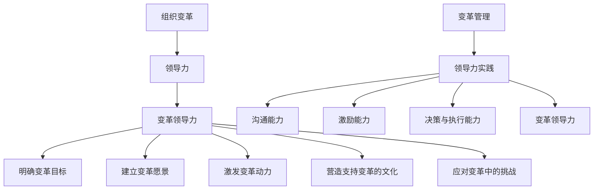

                 

### 领导力与变革管理：引言与背景

#### 组织变革的必要性

在当今快速变化的商业环境中，组织变革已经成为企业保持竞争力、实现持续发展的关键。随着技术进步、市场需求变化和全球竞争加剧，企业必须不断调整战略、优化流程、改进产品和服务，以适应新的商业环境。因此，组织变革不再是一种选择，而是一种必然。

组织变革的必要性体现在以下几个方面：

1. **适应市场变化**：市场环境的快速变化要求企业具备敏捷性，能够迅速响应市场动态，调整经营策略。通过组织变革，企业可以优化内部结构，提高响应速度。

2. **提升竞争力**：变革可以帮助企业打破旧有思维定式，引入新的管理理念和技术手段，从而提高生产效率、降低成本、提升产品和服务质量。

3. **创新驱动**：创新是推动企业持续发展的动力。组织变革有助于营造创新氛围，激发员工创造力，推动技术和管理创新。

4. **应对外部压力**：如宏观经济波动、行业政策调整、竞争对手的挑战等，都可能对企业的生存和发展造成压力。通过变革，企业可以增强自身的抗风险能力。

#### 领导力在变革中的作用

领导力在组织变革中起着至关重要的作用。领导者不仅是变革的发起者和推动者，也是变革过程中的核心力量。领导力在变革中的作用主要体现在以下几个方面：

1. **设定变革方向**：领导者需要明确变革的目标和方向，确保变革与企业的长期战略相一致。通过设定清晰的变革愿景，领导者可以引导员工理解变革的重要性，并积极参与其中。

2. **激发变革动力**：领导者需要激发员工的变革动力，鼓励他们接受变革，积极参与变革的实施。这要求领导者具备良好的沟通能力和激励能力，能够有效地传达变革信息，消除员工的疑虑和抵触情绪。

3. **建立变革文化**：领导者的变革领导力不仅体现在个人行为上，更体现在组织文化的塑造上。领导者需要通过自身行为和言行，树立变革的榜样，营造支持变革的组织氛围。

4. **协调变革过程**：领导者在变革过程中需要扮演多重角色，包括协调各部门的工作、解决变革中的冲突、确保变革计划的顺利实施。领导者需要具备系统思维和问题解决能力，能够应对变革过程中出现的各种挑战。

#### 变革的影响与挑战

组织变革不仅对组织本身产生深远影响，也对员工个人产生重要影响。变革的影响和挑战主要体现在以下几个方面：

1. **组织层面**：变革可能导致组织结构、流程、文化和战略的调整。这些调整可能会带来新的挑战，如资源分配不均、权力结构变化、沟通困难等。

2. **员工层面**：变革可能对员工的职位、工作内容、工作方式产生影响，甚至可能导致员工失业或岗位变动。员工可能会面临职业发展的不确定性，产生焦虑和抵触情绪。

3. **文化层面**：变革可能触及组织的核心价值观和文化传统，引发文化冲突和变革阻力。领导者需要通过有效沟通和文化引导，解决文化层面的挑战。

4. **技术层面**：变革可能引入新技术、新工具和新方法，要求员工具备新的技能和知识。这需要企业提供培训和支持，帮助员工适应新技术。

综上所述，组织变革是一项复杂而艰巨的任务，需要领导者具备卓越的领导力和变革管理能力。通过深入理解变革的必要性、领导力在变革中的作用以及变革的影响和挑战，领导者可以更好地引领组织实现成功的变革。

### 领导力与变革管理的关系

领导力在变革管理中扮演着至关重要的角色，它是推动组织变革、实现组织目标的关键力量。领导力不仅影响变革的进程，也决定变革的成败。为了深入探讨领导力与变革管理的关系，我们需要从以下几个方面进行分析：

#### 领导力定义与核心要素

首先，我们需要明确领导力的定义和核心要素。领导力是一种影响力，是一种激励和引导他人朝着共同目标努力的能力。领导力的核心要素包括：

1. **愿景与目标**：领导者需要具备清晰、远大的愿景，并设定具体的目标，使组织成员明确变革的方向和意义。
2. **沟通能力**：有效的沟通是领导力的重要组成部分，领导者需要能够清晰地传达变革信息，获得员工的认同和支持。
3. **激励与激励能力**：领导者需要能够激发员工的内在动力，鼓励他们积极参与变革，克服变革过程中的困难和挑战。
4. **决策与执行能力**：领导者需要在变革过程中做出正确的决策，并确保决策能够得到有效执行。
5. **变革领导力**：领导者需要具备特殊的变革领导力，能够引导组织穿越变革过程中的障碍，实现变革目标。

#### 变革领导力的特征与实践方法

变革领导力是领导力的一种特殊形式，它针对组织变革的特殊需求，强调领导者需要具备以下特征和实践方法：

1. **明确变革目标**：领导者需要明确变革的目标和方向，确保变革与组织的长期战略相一致。这可以通过设定具体的变革目标、制定详细的变革计划来实现。
   
2. **建立变革愿景**：领导者需要建立变革愿景，激发员工的热情和信心。愿景应该具有吸引力，能够激发员工的认同感和归属感。

3. **激发变革动力**：领导者需要通过各种激励手段，激发员工的变革动力。这包括提供培训机会、设立激励机制、开展团队建设活动等。

4. **营造支持变革的文化**：领导者需要通过自身行为和言行，树立变革的榜样，营造支持变革的文化氛围。这可以通过建立开放、透明、信任的沟通机制，鼓励员工提出改进建议，共同推动变革。

5. **应对变革中的挑战**：领导者需要具备应对变革中各种挑战的能力，包括解决变革过程中的冲突、克服变革阻力、确保变革计划的顺利实施。

#### 领导力与变革管理的关系架构

为了更清晰地理解领导力与变革管理的关系，我们可以使用Mermaid流程图来展示它们之间的核心概念和联系：

在这个流程图中，我们可以看到领导力与变革管理之间的紧密联系。领导力是变革管理的基础，而变革领导力是领导力在变革中的具体体现。通过明确变革目标、建立变革愿景、激发变革动力、营造支持变革的文化以及应对变革中的挑战，领导者可以有效地推动组织变革，实现组织的长期目标。

总之，领导力与变革管理密切相关，领导者的变革领导力决定了变革的成败。只有通过卓越的领导力，领导者才能引领组织穿越变革的障碍，实现组织目标。

#### 明确变革目标

在变革管理中，明确变革目标是至关重要的一步。变革目标的设定不仅决定了变革的方向和范围，也影响着变革的进程和成效。为了确保变革目标的科学性、合理性和可执行性，我们需要从以下几个方面进行详细探讨：

##### 设定变革目标的步骤

1. **确定变革需求**：首先，需要明确组织为什么要进行变革。这可能源于外部环境的压力，如市场变化、竞争加剧、政策调整；也可能是内部需求的驱动，如提升效率、优化流程、提高员工满意度等。通过分析组织内外部的需求，可以明确变革的必要性和紧迫性。

2. **收集相关信息**：在确定变革需求后，需要广泛收集相关数据和资料，包括市场研究、客户反馈、竞争对手分析、内部绩效数据等。这些信息将帮助领导者更全面地了解组织当前存在的问题和未来发展的方向。

3. **分析变革可能性**：基于收集到的信息，分析组织是否具备实施变革的条件和能力。这包括评估组织的资源、技术、文化、员工素质等方面的现状。如果发现组织在某个方面存在短板，需要提前制定相应的改善计划。

4. **制定变革目标**：在分析变革可能性的基础上，制定具体的变革目标。这些目标应具有可度量性、具体性、可实现性和时效性。例如，可以将目标设定为“提高生产效率20%”、“降低成本10%”、“提升客户满意度30%”等。

5. **目标分解**：将总目标分解为一系列具体的子目标，以便更好地组织和实施变革。这些子目标应相互关联，共同支持总目标的实现。同时，确保每个子目标都有明确的责任人和完成时间。

##### 设定目标的重要性

设定变革目标的重要性体现在以下几个方面：

1. **明确方向**：目标为变革提供了清晰的方向，使组织成员知道变革的方向和重点，避免盲目行动。

2. **激励员工**：明确的目标可以激发员工的积极性和参与感，使他们更有动力投入到变革过程中。

3. **评估成效**：目标为变革成效的评估提供了依据，可以帮助领导者判断变革是否达到预期效果，及时进行调整和优化。

4. **资源分配**：目标明确后，可以更科学地分配资源，确保资源投入到最需要的地方，提高变革的效率。

##### 目标设定的注意事项

1. **目标要具体**：目标应具体、明确，避免模糊和抽象。例如，“提高效率”不如“将生产周期缩短30天”具体。

2. **目标要可实现**：目标应具有可实现性，避免设定过高或过低的目标。过高可能导致失败和挫败感，过低则可能无法激发员工的积极性和创造力。

3. **目标要可度量**：目标应具有可度量性，以便于评估和监控。例如，“提升客户满意度”不如“将客户满意度评分提高5分”具体。

4. **目标要有时效性**：目标应具有明确的完成时间，以便于跟踪和评估。例如，“明年实现”不如“第三季度实现”具体。

5. **目标要反映整体利益**：目标应不仅关注短期利益，也要关注长期利益，确保变革符合组织的整体发展战略。

总之，明确变革目标是变革管理的重要一环，它为变革提供了方向、激励、评估和资源分配的依据。通过科学、合理地设定目标，可以确保变革顺利推进，实现组织的长期目标。

### 建立变革愿景

在变革管理中，建立变革愿景是激发员工参与变革的重要步骤。一个清晰、有吸引力的变革愿景不仅能够指导变革的方向，还能够激发员工的热情和动力，使他们愿意主动参与到变革过程中。以下将详细探讨如何建立变革愿景，包括其内涵、构建方法和实际案例。

#### 变革愿景的内涵

变革愿景是指领导者对未来组织状态的美好设想，是变革的核心驱动力。它应该具有以下特点：

1. **吸引力**：变革愿景应该能够激发员工的兴趣和热情，使他们愿意为之努力奋斗。
2. **明确性**：愿景应该具体、清晰，使员工能够直观地理解变革的目标和方向。
3. **激励性**：变革愿景应该具有激励作用，使员工在面临变革挑战时保持积极的心态。
4. **可实现性**：愿景应具备可实现性，使员工看到实现愿景的希望，从而增强信心。

#### 如何构建变革愿景

1. **与组织战略相结合**：变革愿景应与组织的长期战略相一致，确保变革的方向与组织的目标保持一致。这可以通过将变革愿景与组织使命、愿景和价值观相结合来实现。

2. **明确变革目的**：明确变革的目的是构建变革愿景的重要步骤。领导者需要分析变革的原因和目标，确保愿景能够准确反映变革的核心目的。

3. **激发员工的参与感**：在构建变革愿景时，领导者应积极听取员工的意见和建议，让他们参与到愿景的制定过程中。这不仅可以增加员工的认同感和归属感，还可以使愿景更具实用性和可行性。

4. **使用积极的语言和形象**：变革愿景应使用积极、鼓舞人心的语言和形象，使员工能够直观地感受到变革带来的积极影响。例如，可以使用“共同创造更美好的未来”等语言。

5. **设定具体的里程碑**：为了使变革愿景更具激励性，可以设定一系列具体的里程碑，使员工能够看到变革的进展和成果。例如，“在未来三年内，我们将实现客户满意度提升30%”等。

#### 实际案例

以下是一个企业建立变革愿景的实际案例：

某家企业面临着市场竞争加剧、客户需求变化等外部压力，决定进行组织变革。在构建变革愿景时，该企业的领导者采取了以下步骤：

1. **与组织战略相结合**：领导者将变革愿景与企业的长期战略相结合，确保变革的目标与企业的整体发展方向一致。

2. **明确变革目的**：领导者明确了变革的目的是提升企业的竞争力、优化内部流程、提高客户满意度。

3. **激发员工的参与感**：领导者组织了多次员工座谈会，听取员工的意见和建议，使员工感受到自己的声音被听到，并积极参与到变革愿景的制定过程中。

4. **使用积极的语言和形象**：领导者使用了“共创未来”、“走向卓越”等积极的语言，使员工感受到变革的积极影响。

5. **设定具体的里程碑**：领导者设定了一系列具体的里程碑，如“在未来一年内，实现生产效率提升20%”、“在未来两年内，实现客户满意度提升30%”等。

通过以上步骤，该企业成功地建立了变革愿景，并激发了员工的热情和动力，使他们在变革过程中积极参与，共同推动组织变革的顺利进行。

总之，建立变革愿景是变革管理的重要一步，它能够激发员工的热情和动力，推动变革的顺利进行。通过明确变革愿景的内涵、构建方法和实际案例，领导者可以有效地建立变革愿景，为组织变革提供强有力的支持。

### 激发变革动力

在组织变革过程中，激发员工的动力是确保变革顺利推进的关键。员工的态度和积极性直接影响变革的成效。以下将详细探讨如何通过激励手段来激发变革动力，包括激发动力的重要性、激励策略以及实际案例。

#### 激发动力的重要性

激发变革动力的重要性体现在以下几个方面：

1. **员工参与**：员工的积极参与是变革成功的重要保障。只有当员工愿意并积极投入到变革过程中，变革才能真正实现。

2. **创新思维**：激发员工的动力可以激发他们的创新思维，推动组织在变革过程中不断探索新的思路和方法。

3. **执行力**：员工积极的态度和高度的动力可以增强变革的执行力，使变革计划能够顺利实施。

4. **组织文化**：通过激发员工动力，可以营造积极向上的组织文化，促进组织整体氛围的提升。

#### 激励策略

1. **明确目标与期望**：首先，领导者需要明确变革的目标和期望，使员工了解变革的重要性和预期成果。这可以通过定期的沟通和会议来实现。

2. **提供培训与支持**：为员工提供必要的培训和支持，帮助他们适应变革带来的新挑战。这包括技能培训、知识分享和辅导等。

3. **认可与奖励**：通过认可和奖励来激励员工。这可以是对员工的个人表彰，也可以是对团队的集体奖励。奖励的方式可以多样化，如奖金、晋升、表彰等。

4. **建立沟通机制**：建立开放的沟通机制，鼓励员工提出意见和建议，使他们感到自己的声音被听到。这可以通过定期的团队会议、反馈渠道和员工调查等方式实现。

5. **树立榜样**：领导者需要通过自身行为树立榜样，表现出对变革的积极态度和坚定的决心，激励员工跟随领导者的步伐。

#### 实际案例

以下是一个企业通过激励手段激发变革动力的实际案例：

某家企业正在进行数字化转型，面临着巨大的变革挑战。为了激发员工的动力，该企业采取了以下措施：

1. **明确目标与期望**：领导者明确了数字化转型的目标和期望，使员工了解数字化转型的重要性。他们通过内部培训和会议，传达变革的愿景和计划。

2. **提供培训与支持**：为了帮助员工适应数字化转型，该企业提供了多种培训课程，包括技术培训、项目管理培训和跨部门协作培训等。此外，还设立了内部辅导团队，为员工提供技术支持和帮助。

3. **认可与奖励**：企业设立了“数字化转型先锋”奖项，每季度评选出在数字化转型中表现突出的员工，并给予奖金和晋升机会。这一措施极大地激发了员工的积极性。

4. **建立沟通机制**：企业建立了开放的沟通机制，鼓励员工提出意见和建议。他们定期组织团队会议，收集员工对数字化转型的反馈和想法。

5. **树立榜样**：企业领导层以身作则，积极参与数字化转型的项目，通过自己的行动激励员工。

通过以上措施，该企业成功地激发了员工的动力，使他们积极参与到数字化转型过程中，推动了变革的顺利进行。

总之，通过明确的激励策略和实际案例，领导者可以有效地激发变革动力，推动组织变革的成功。激发动力不仅能够提高员工的参与度和执行力，还能促进组织的整体发展和进步。

### 变革领导力实践

变革领导力实践是确保变革成功的关键步骤。领导者需要在变革过程中运用各种策略和技巧，以克服障碍、引导变革方向、确保变革目标的实现。以下将详细探讨变革领导力实践的方法和具体步骤。

#### 变革领导力实践的方法

1. **构建变革团队**：构建一个高效、多元化的变革团队是变革领导力的核心。团队成员应包括各部门的负责人、关键利益相关者和变革推动者。通过建立强大的团队，可以确保变革的全面性和协调性。

2. **明确变革路线图**：制定详细的变革路线图，包括时间表、里程碑和关键任务。这有助于确保变革过程的有序推进，使团队成员对变革过程有清晰的认识。

3. **沟通与协调**：建立有效的沟通机制，确保变革信息在组织内部得到及时、准确的传达。领导者需要定期与团队成员沟通，解决变革过程中的问题和挑战，确保变革计划得到有效执行。

4. **激励与赋能**：通过激励和赋能，激发团队成员的积极性和创造力。领导者可以通过认可和奖励、培训和支持等手段，帮助团队成员克服变革中的困难，增强他们的信心和动力。

5. **解决变革阻力**：识别和解决变革阻力是变革领导力的重要任务。领导者需要倾听员工的意见和担忧，通过沟通和理解来消除他们的抵触情绪。同时，领导者需要明确变革的必要性和益处，使员工认识到变革的积极影响。

6. **持续监控与评估**：在变革过程中，领导者需要持续监控变革的进展，评估变革的成效。通过定期的检查和反馈，可以及时发现和解决问题，确保变革目标的实现。

#### 变革领导力实践的具体步骤

1. **启动阶段**：
   - **组建变革团队**：选择合适的人员组建变革团队，明确各自的职责和任务。
   - **明确变革目标**：与团队成员共同讨论并明确变革的目标和期望，确保团队成员对变革方向有共同的认识。
   - **制定变革路线图**：根据变革目标和预期成果，制定详细的变革路线图，包括时间表、里程碑和关键任务。

2. **执行阶段**：
   - **沟通与协调**：定期召开团队会议，讨论变革过程中的问题和挑战，确保团队成员之间的沟通和协作。
   - **激励与赋能**：通过认可和奖励、培训和支持等手段，激发团队成员的积极性和创造力。
   - **解决变革阻力**：积极倾听员工的意见和担忧，通过沟通和理解来消除他们的抵触情绪。

3. **监控与调整阶段**：
   - **持续监控**：通过定期的检查和反馈，监控变革的进展情况，确保变革计划的顺利执行。
   - **评估成效**：评估变革的成效，包括变革目标的达成情况和员工对变革的满意度。根据评估结果，调整变革策略和计划。

4. **总结与反思**：
   - **总结经验**：对整个变革过程进行总结，识别成功的经验和不足之处，为未来的变革提供参考。
   - **持续改进**：基于总结的经验和教训，持续改进变革策略和实践，提高组织的变革能力。

通过以上变革领导力实践的具体步骤，领导者可以有效地推动组织变革，实现变革目标。变革领导力不仅要求领导者具备战略思维和执行能力，还需要他们具备强大的沟通技巧和团队领导力。只有通过卓越的变革领导力，组织才能在快速变化的商业环境中保持竞争力，实现持续发展。

### 变革管理的理论基础

变革管理作为组织应对外部环境变化和内部发展需求的必要手段，其理论基础涵盖了多种模型和方法。这些理论为变革管理提供了系统性的框架和指导原则，帮助组织更有效地规划和实施变革。以下将介绍几种常见的变革管理模型，并分析其适用性。

#### 1. 变革管理模型

1. **Kotter的八个步骤模型**：
   - **建立紧急感**：通过沟通和展示紧迫性，让组织成员认识到变革的必要性。
   - **组建领导团队**：建立一支由高层领导和其他关键人员组成的变革领导团队。
   - **制定清晰的愿景和策略**：明确变革的目标和方向，制定具体的行动计划。
   - **沟通与宣传**：通过多渠道沟通，确保变革愿景和策略在组织内得到广泛传播和认同。
   - **授权员工**：鼓励员工参与变革，提供必要的支持和资源。
   - **创造短期的胜利**：通过实现短期目标，增强变革的信心和动力。
   - **巩固变革成果**：通过持续监控和调整，确保变革成果得到巩固。
   - **使变革成为文化的一部分**：将变革融入组织的日常运营和文化中，确保变革的持续性。

2. **勒温的三阶段模型**：
   - **解冻**：打破现有的思维和行为模式，激发员工的变革意愿。
   - **转变**：实施变革措施，培养新的思维和行为模式。
   - **再冻结**：通过强化和巩固新思维和行为模式，确保变革的持续性和稳定性。

3. **麦克格雷戈的变革管理模型**：
   - **X理论和Y理论**：X理论认为员工需要强制和激励才能工作，而Y理论认为员工具有自我驱动力，能够自发地参与变革。
   - **变革策略**：基于员工的态度和行为，选择合适的变革策略，如强制、激励、参与等。

#### 2. 变革管理步骤

1. **评估现状**：评估组织当前的状态，包括结构、流程、文化等方面，了解变革的必要性。

2. **确定变革目标**：明确变革的目标和预期成果，确保变革与组织的长期战略相一致。

3. **制定变革计划**：制定详细的变革计划，包括时间表、里程碑、关键任务和资源分配。

4. **沟通与宣传**：通过多种渠道和方式，确保变革信息在组织内得到广泛传播和认同。

5. **实施变革措施**：根据变革计划，逐步实施变革措施，解决变革过程中遇到的问题和挑战。

6. **监控与评估**：持续监控变革的进展和成效，及时调整变革策略和计划。

7. **巩固变革成果**：通过持续监控和反馈，确保变革成果得到巩固和延续。

#### 3. 变革中的组织行为

1. **个体行为**：变革过程中，员工的个体行为直接影响变革的成效。领导者需要了解员工的态度和行为，通过激励和赋能，激发员工的变革动力。

2. **团队行为**：变革需要团队协作，领导者需要建立高效的变革团队，确保团队成员之间的沟通和协作。

3. **组织文化**：组织文化对变革的接受和实施具有重要影响。领导者需要营造支持变革的文化氛围，促进变革的顺利进行。

#### 4. 变革管理的理论基础适用性分析

1. **Kotter的八个步骤模型**：
   - **适用性**：适用于大规模、复杂性的组织变革，具有明确的步骤和指导原则。
   - **局限性**：对领导者的沟通和执行能力要求较高，需要较长时间才能看到变革成果。

2. **勒温的三阶段模型**：
   - **适用性**：适用于需要打破旧有思维和行为模式的变革，强调变革的心理过程。
   - **局限性**：对变革过程中可能出现的心理阻力和行为变化缺乏具体指导。

3. **麦克格雷戈的变革管理模型**：
   - **适用性**：适用于不同类型和阶段的组织变革，强调根据员工态度和行为选择合适的变革策略。
   - **局限性**：对领导者的变革策略选择和实施能力要求较高。

总之，变革管理的理论基础为组织变革提供了系统性的框架和指导原则。领导者需要根据组织的实际情况和变革目标，选择合适的模型和策略，确保变革的顺利实施和持续发展。

### 变革实施步骤

在变革管理过程中，实施变革是关键的一步。为了确保变革能够顺利推进并取得预期成果，我们需要明确变革的实施步骤，并详细介绍每个阶段的重点任务和策略。以下将详细探讨变革实施的四个主要阶段：准备阶段、启动阶段、执行阶段和监控与调整阶段。

#### 准备阶段

准备阶段是变革实施的基础，其关键任务是建立变革的共识和制定详细的变革计划。

1. **建立变革团队**：组建一支由高层领导、关键利益相关者和变革推动者组成的变革团队。确保团队成员具有多样化的背景和技能，以全面应对变革中的各种挑战。

2. **明确变革目标**：与团队成员共同讨论并明确变革的目标和预期成果，确保变革方向与组织的长期战略相一致。

3. **制定变革计划**：制定详细的变革计划，包括时间表、里程碑、关键任务和资源分配。确保变革计划具有可执行性和灵活性，能够适应变革过程中可能出现的变化。

4. **沟通与宣传**：通过多渠道和方式，向组织内外部传达变革的目标、理由和计划。建立开放的沟通机制，鼓励员工提问和反馈，确保变革信息在组织内得到广泛传播和认同。

#### 启动阶段

启动阶段是变革实施的开始，关键任务是激发员工的参与感和积极态度，确保变革能够顺利启动。

1. **召开启动会议**：组织一场正式的启动会议，向全体员工宣布变革计划，明确变革的目标、理由和预期成果。通过会议的形式，增强员工的参与感和责任感。

2. **建立激励机制**：通过设立奖励和激励机制，鼓励员工积极参与变革。例如，可以设立“变革先锋”奖项，对在变革中表现突出的员工进行表彰和奖励。

3. **提供培训和支持**：为员工提供必要的培训和指导，帮助他们适应变革带来的新挑战。这包括技术培训、工作流程培训和心理辅导等。

4. **建立反馈机制**：建立反馈渠道，鼓励员工在变革过程中提出意见和建议。通过定期收集员工的反馈，及时调整变革计划，确保变革的顺利进行。

#### 执行阶段

执行阶段是变革实施的主体，关键任务是确保变革措施得到有效执行，并解决变革过程中出现的问题和挑战。

1. **分解任务和责任**：将变革计划分解为具体的任务和责任，明确每个任务的责任人和完成时间。通过明确的任务分配，确保变革计划得到有效执行。

2. **实施变革措施**：根据变革计划，逐步实施变革措施。在实施过程中，保持与员工的沟通，及时解决变革过程中出现的问题和挑战。

3. **监控进展**：通过定期监控和评估变革进展，了解变革的实施情况，及时调整变革策略和计划。建立监控指标，如进度表、质量标准和成本控制等。

4. **激励与赋能**：持续激励员工，保持他们的积极性和动力。通过认可和奖励、培训和支持等手段，激发员工的变革动力，确保他们能够持续投入到变革过程中。

#### 监控与调整阶段

监控与调整阶段是变革实施的收尾阶段，关键任务是评估变革成效，确保变革成果得到巩固和延续。

1. **评估变革成效**：通过定期的评估和反馈，评估变革的成效，包括变革目标的达成情况和员工对变革的满意度。根据评估结果，识别成功经验和不足之处，为未来的变革提供参考。

2. **调整变革策略**：根据评估结果，对变革策略和计划进行必要的调整和优化。例如，如果发现变革进度较慢，可以加强培训和激励措施；如果发现变革过程中存在瓶颈，可以调整资源分配和任务分工。

3. **巩固变革成果**：通过持续监控和反馈，确保变革成果得到巩固和延续。建立长效机制，将变革成果融入组织的日常运营和文化中，确保变革的持续性。

4. **总结与反思**：对整个变革过程进行总结和反思，识别成功经验和不足之处，为未来的变革提供借鉴和参考。

通过以上变革实施的四个主要阶段，领导者可以确保变革顺利推进，实现组织的持续发展和进步。

### 变革管理的挑战与解决方案

在变革管理过程中，领导者经常会面临各种挑战和障碍，这些挑战可能会对变革的顺利进行产生重大影响。以下将详细探讨变革管理中常见的挑战，包括变革阻力、变革失败的原因以及应对策略和最佳实践。

#### 变革阻力

变革阻力是指员工或组织内部对变革的抵触情绪和行为。变革阻力可能来源于以下几个方面：

1. **惯性思维**：员工习惯于现有的工作方式和流程，对新事物和新方法持怀疑态度，不愿意接受变革。

2. **不确定感**：变革可能导致员工的工作岗位、职责和收入发生变化，产生不确定感和焦虑。

3. **文化阻力**：组织文化可能不支持变革，员工担心变革会破坏现有的组织关系和价值观。

4. **资源限制**：变革需要投入大量的人力、物力和财力，组织可能面临资源不足的问题。

#### 变革失败的原因

变革失败的原因多种多样，以下是一些常见的因素：

1. **缺乏明确的目标和计划**：没有明确的目标和详细的变革计划，导致变革缺乏方向和指导。

2. **沟通不畅**：变革信息传递不充分或不准确，导致员工对变革的理解和认同度较低。

3. **激励机制不足**：缺乏有效的激励机制，无法充分调动员工的积极性和参与度。

4. **领导力不足**：领导者缺乏变革领导力，无法有效地引导和组织变革。

5. **变革速度过快或过慢**：变革速度过快可能导致员工无法适应，变革速度过慢可能导致员工失去信心。

#### 应对策略和最佳实践

1. **建立变革领导力**：领导者需要具备卓越的变革领导力，明确变革目标，制定详细的变革计划，并通过沟通、激励和赋能等方式引导员工参与变革。

2. **加强沟通和宣传**：通过多渠道、多形式的沟通，确保变革信息在组织内得到广泛传播和认同。建立开放的沟通机制，鼓励员工提出意见和建议。

3. **提供培训和支持**：为员工提供必要的培训和支持，帮助他们适应新环境和新的工作要求。通过技能培训、知识分享和心理辅导等方式，提高员工的适应能力和变革动力。

4. **制定激励机制**：通过设立奖励和激励机制，鼓励员工积极参与变革。例如，可以设立“变革先锋”奖项，对在变革中表现突出的员工进行表彰和奖励。

5. **建立变革团队**：建立一支由多元化背景和技能的员工组成的变革团队，确保变革的全面性和协调性。通过团队协作，解决变革过程中遇到的各种问题。

6. **监控与调整**：通过定期的监控和评估，了解变革的进展和成效，及时调整变革策略和计划。建立反馈机制，收集员工的反馈和建议，确保变革过程的持续改进。

7. **巩固变革成果**：通过持续监控和反馈，确保变革成果得到巩固和延续。建立长效机制，将变革成果融入组织的日常运营和文化中，确保变革的持续性。

总之，变革管理是一项复杂而艰巨的任务，需要领导者具备卓越的变革领导力和有效的变革管理能力。通过应对变革阻力、克服变革失败的原因以及实施有效的策略和最佳实践，领导者可以确保变革顺利推进，实现组织的持续发展和进步。

### 实践案例与分析

为了更好地理解领导力在变革管理中的应用，以下将介绍两个实际案例：一个来自企业领域的变革案例，另一个来自公共部门。

#### 案例一：企业变革——数字化转型

**背景**：
某大型制造企业在市场竞争中逐渐感受到压力，为了提升竞争力，企业决定进行数字化转型。这一变革涉及多个部门，包括生产、销售、人力资源和IT等。

**变革过程**：

1. **明确变革目标**：企业领导层首先明确了数字化转型的主要目标，包括提高生产效率、优化供应链管理、提升客户体验等。

2. **建立变革团队**：企业组建了由高层领导、各部门负责人和IT专家组成的变革团队。团队成员共同制定了详细的变革计划，包括时间表、里程碑和关键任务。

3. **沟通与宣传**：通过内部会议、培训和邮件等方式，企业领导层向全体员工传达了数字化转型的重要性和目标。同时，设立了专门的沟通渠道，鼓励员工提出意见和建议。

4. **提供培训和支持**：为了帮助员工适应新的工作环境和要求，企业提供了全面的培训课程，包括云计算、大数据分析、智能制造等。

5. **激励与赋能**：企业设立了“数字化转型先锋”奖项，对在变革过程中表现突出的员工进行表彰和奖励，激发了员工的积极性和参与度。

6. **监控与调整**：通过定期的监控和评估，企业及时调整变革计划，确保变革按计划推进。同时，建立了反馈机制，收集员工的反馈和建议，不断优化变革过程。

**成效**：
数字化转型取得了显著成效，生产效率提高了20%，供应链管理更加高效，客户满意度显著提升。员工对变革的认同感和参与度也大幅提高，企业的竞争力得到了显著提升。

#### 案例二：公共部门变革——政府流程优化

**背景**：
某市政府部门在面临日益增加的公共服务需求时，意识到现有的政府流程和信息系统无法满足市民的需求。为了提升政府的服务效率和透明度，市政府决定进行流程优化和信息系统升级。

**变革过程**：

1. **明确变革目标**：市政府明确了流程优化和信息系统升级的主要目标，包括提高服务效率、减少市民等待时间、提升政府透明度等。

2. **组建变革团队**：市政府组建了由部门负责人、IT专家和市民代表组成的变革团队，确保变革的广泛参与和多元化视角。

3. **评估现状**：变革团队对现有的政府流程和信息系统进行了详细的评估，识别出存在的问题和改进机会。

4. **制定变革计划**：基于评估结果，变革团队制定了详细的变革计划，包括流程优化方案、信息系统升级方案和时间表。

5. **沟通与宣传**：通过新闻发布会、社交媒体和政府网站等渠道，市政府向市民传达了流程优化和信息系统升级的重要性和目标。

6. **试点实施**：在全面实施前，市政府选择了部分部门进行试点，通过试点发现和解决问题，积累经验。

7. **全面推广**：在试点成功后，市政府将变革方案全面推广到所有相关部门，确保变革的全面实施。

**成效**：
流程优化和信息系统升级取得了显著成效，市民的满意度大幅提升，政府的服务效率和透明度得到了显著提高。市民办事流程简化，等待时间缩短，政府部门的运营成本也得到有效控制。

#### 案例中的领导力应用

在上述案例中，领导力的应用贯穿于整个变革过程。以下是几个关键点：

1. **明确目标与愿景**：领导者通过明确变革的目标和愿景，引导员工理解变革的重要性和方向。

2. **建立支持变革的文化**：领导者通过建立支持变革的文化氛围，鼓励员工积极参与变革。

3. **有效的沟通**：领导者通过多种渠道和方式与员工进行有效沟通，确保变革信息得到广泛传播和认同。

4. **激励与赋能**：领导者通过设立激励机制和提供培训支持，激发员工的积极性和创造力。

5. **监控与调整**：领导者通过持续监控和反馈，及时调整变革策略和计划，确保变革按计划推进。

总之，通过实际案例的分析，我们可以看到领导力在变革管理中的关键作用。领导者需要具备卓越的变革领导力，通过有效的策略和措施，引导组织成功实现变革目标。

### 变革成果评估

在变革管理过程中，对变革成果进行评估是确保变革成效的重要环节。通过评估，领导者可以了解变革的实际效果，识别成功的经验和不足之处，为未来的变革提供有力依据。以下将介绍评估变革成果的方法、关键指标、实际案例以及评估结果的重要性。

#### 评估变革成果的方法

1. **定量评估**：通过量化的数据指标来评估变革成果。例如，可以评估生产效率、成本降低、客户满意度等关键指标。定量评估能够提供具体的、可度量的数据，帮助领导者准确判断变革成效。

2. **定性评估**：通过定性的方式，如员工调查、访谈和观察，收集员工的反馈和意见。定性评估能够深入了解员工的感受和态度，发现变革过程中的潜在问题和改进点。

3. **综合评估**：结合定量和定性评估方法，进行全面、系统的评估。综合评估可以提供更全面的变革成效分析，帮助领导者从不同角度了解变革效果。

#### 关键指标

1. **效益指标**：包括成本节约、利润提升、市场份额增加等，反映变革对组织经济效益的影响。

2. **效率指标**：包括生产效率、运营效率、流程优化等，反映变革对组织运营效能的影响。

3. **效果指标**：包括员工满意度、客户满意度、市场反应等，反映变革对组织外部关系和内部氛围的影响。

4. **学习指标**：包括员工技能提升、知识积累、创新能力等，反映变革对组织知识管理和创新能力的影响。

#### 实际案例

以下是一个企业变革成果评估的实际案例：

某企业在数字化转型后，对变革成果进行了全面评估。

1. **定量评估**：
   - **效益指标**：通过数据分析，发现生产成本降低了15%，利润提升了10%。
   - **效率指标**：生产效率提高了20%，运营流程简化，员工工作量减轻。
   - **效果指标**：客户满意度提升了15%，市场反应迅速，订单量增加。

2. **定性评估**：
   - **员工调查**：通过员工调查，发现大多数员工对数字化转型的接受度较高，认为变革提高了工作效率，降低了工作压力。
   - **访谈**：在访谈中，员工分享了他们在变革过程中的心得和感受，提供了对变革策略和过程的改进建议。

#### 评估结果的重要性

1. **验证变革成效**：评估结果能够验证变革的实际成效，帮助领导者判断变革是否达到了预期目标。

2. **识别成功经验**：通过评估，领导者可以识别出变革过程中的成功经验，为未来的变革提供借鉴和参考。

3. **发现不足之处**：评估结果能够揭示变革过程中的问题和不足，帮助领导者制定改进措施，优化变革策略。

4. **持续改进**：通过定期评估，领导者可以持续监控变革成效，确保变革成果得到巩固和延续。

总之，对变革成果进行评估是变革管理不可或缺的一环。通过科学、系统的评估方法，领导者可以全面了解变革成效，为组织的持续发展提供有力支持。

### 变革管理工具与方法

在变革管理过程中，使用适当的工具和方法可以显著提高变革的成功率。以下将介绍几种常用的变革管理工具与方法，包括其在实际应用中的案例和效果。

#### 1. 变革管理工具

1. **SWOT分析**：SWOT分析是一种用于评估变革机遇和挑战的工具，通过分析组织的优势（Strengths）、劣势（Weaknesses）、机会（Opportunities）和威胁（Threats），帮助领导者制定科学的变革策略。

   **应用案例**：某企业在进行市场扩张时，使用了SWOT分析来评估市场机会和内部能力，制定了具体的营销策略和改进计划，成功开拓了新市场。

2. **变革地图**：变革地图是一种可视化工具，用于展示变革的各个阶段、关键任务和利益相关者，帮助领导者了解变革的整体情况。

   **应用案例**：某企业在进行企业重组时，使用了变革地图来规划变革流程，明确各阶段的任务和时间表，确保变革顺利推进。

3. **变革日志**：变革日志是一种记录变革过程和进展的工具，帮助领导者跟踪变革的进展情况，及时发现和解决问题。

   **应用案例**：某企业在进行IT系统升级时，使用了变革日志来记录每个阶段的进展和问题，通过日志分析，及时调整升级计划，确保系统顺利上线。

#### 2. 变革管理方法

1. **Kotter的八个步骤模型**：这是一种系统化的变革管理方法，通过八个步骤（建立紧急感、组建领导团队、制定愿景和策略、沟通与宣传、授权员工、创造短期胜利、巩固变革成果、使变革成为文化的一部分）来指导变革过程。

   **应用案例**：某企业在进行组织文化变革时，采用了Kotter的八个步骤模型。通过建立变革愿景、组建领导团队、创造短期胜利等措施，成功推动了企业文化的转变。

2. **平衡计分卡**：平衡计分卡是一种绩效管理工具，用于评估组织的战略执行情况，帮助领导者制定和实施变革策略。

   **应用案例**：某企业在进行战略调整时，使用了平衡计分卡来评估各业务部门和职能部门的绩效，通过数据分析和反馈，优化了资源配置和业务流程。

3. **六西格玛管理方法**：六西格玛是一种追求卓越的管理方法，通过减少过程变异，提高过程质量和效率，帮助组织实现持续改进。

   **应用案例**：某企业在进行生产流程改进时，采用了六西格玛管理方法。通过项目实施，成功降低了生产成本，提高了生产效率和产品质量。

#### 3. 变革管理效果

通过上述工具和方法的应用，变革管理效果得到了显著提升：

1. **提高变革成功率**：使用科学的工具和方法，可以确保变革计划更具针对性和可操作性，从而提高变革成功率。

2. **增强员工参与度**：通过透明、系统的变革过程，员工能够更好地理解变革的必要性和目标，增强他们的参与度和积极性。

3. **确保变革持续改进**：定期的评估和反馈机制，可以帮助组织持续监控变革成效，及时调整和优化变革策略，确保变革的持续性和有效性。

总之，变革管理工具与方法在提升变革管理效果方面发挥了重要作用。通过科学的选择和应用，领导者可以更好地应对变革挑战，推动组织实现持续发展。

### 附录

#### 附录 A：变革管理工具与方法

**A.1 变革管理工具介绍**

1. **SWOT分析**：
   - **定义**：SWOT分析是一种战略规划工具，用于评估组织的优势、劣势、机会和威胁。
   - **使用方法**：通过分析组织的内部和外部环境，制定针对性的变革策略。

2. **变革地图**：
   - **定义**：变革地图是一种可视化工具，用于展示变革的各个阶段、关键任务和利益相关者。
   - **使用方法**：通过绘制变革地图，明确变革的流程和关键节点，确保变革有序进行。

3. **变革日志**：
   - **定义**：变革日志是一种记录变革过程和进展的工具，用于跟踪变革的进展情况和问题。
   - **使用方法**：通过记录和整理变革日志，及时调整变革策略和计划。

**A.2 变革管理案例分析**

1. **案例一**：某企业在市场扩张中使用SWOT分析，评估市场机会和内部能力，成功制定了市场进入策略。

2. **案例二**：某企业在进行企业重组时，通过绘制变革地图，明确了重组流程和关键任务，确保重组顺利进行。

3. **案例三**：某企业在IT系统升级过程中，使用变革日志记录进展和问题，及时调整升级计划，成功实现系统上线。

#### 附录 B：领导力与变革管理资源

**B.1 相关书籍推荐**

1. **《领导力与变革管理》**：约翰·P·科特（John P. Kotter）著，介绍变革领导力的理论和实践方法。

2. **《变革之舞》**：威廉·H·布鲁姆（William H. Brumaghin）和丹尼斯·T·布拉姆利（Dennis T. Wack）著，探讨变革过程中的文化挑战和解决方案。

3. **《领导者的五项修炼》**：史蒂芬·R·柯维（Stephen R. Covey）著，介绍领导力的核心素质和领导方法。

**B.2 学术论文与研究报告**

1. **《领导力与组织变革：理论与实践》**：陈永明著，探讨领导力在组织变革中的关键作用。

2. **《变革管理：理论与实践》**：张祥著，分析变革管理的理论基础和实践方法。

3. **《企业变革中的领导力》**：赵曙明著，研究领导力在企业管理变革中的应用。

**B.3 在线课程与培训资源**

1. **哈佛大学公开课《领导力与变革管理》**：通过在线学习，了解领导力在组织变革中的核心理论和实践方法。

2. **Coursera《变革领导力》**：提供系统的变革领导力培训课程，涵盖变革管理的各个阶段。

3. **edX《组织变革与管理》**：学习组织变革的理论基础和实践技巧，提高变革领导力。

通过以上附录，读者可以深入了解变革管理和领导力的相关理论和实践方法，为组织变革提供有力支持。

### 总结与展望

领导力与变革管理是组织持续发展的关键。本文通过详细探讨领导力在变革中的作用、明确变革目标、建立变革愿景、激发变革动力、变革领导力实践、变革管理的理论基础、变革实施步骤、变革管理的挑战与解决方案、实践案例以及变革成果评估，全面阐述了领导力与变革管理的重要性和具体实践方法。

首先，领导力在变革中起着核心作用，它不仅是变革的推动者，也是变革成功的关键。领导者需要具备明确的变革目标、建立变革愿景、激发变革动力，并通过有效的沟通和激励手段，引导组织成员积极参与变革。

其次，明确变革目标和建立变革愿景是变革管理的重要环节。明确的目标为变革提供了方向和依据，而变革愿景则激发了员工的热情和动力，使变革具有实际的可操作性。

在激发变革动力方面，领导者需要通过多种激励手段，如培训、支持、认可和奖励，激发员工的积极性和参与感。通过建立开放的沟通机制，鼓励员工提出建议和反馈，可以进一步推动变革的顺利进行。

变革领导力实践是确保变革成功的关键步骤。通过构建变革团队、制定详细的变革计划、实施有效的变革措施和持续监控与调整，领导者可以确保变革按计划推进并取得预期成效。

在变革管理的理论基础方面，本文介绍了Kotter的八个步骤模型、勒温的三阶段模型和麦克格雷戈的变革管理模型等，为领导者提供了科学的理论指导。

在变革实施步骤中，本文详细探讨了准备阶段、启动阶段、执行阶段和监控与调整阶段，提供了具体的方法和策略，帮助领导者有效地推进变革。

最后，变革管理的挑战与解决方案、实践案例以及变革成果评估部分，通过实际案例和分析，展示了领导力在变革管理中的具体应用和变革成效的评估方法。

展望未来，随着全球化和技术进步的不断推进，组织变革将成为企业持续发展的必然选择。领导者需要不断提升自己的变革领导力，以应对快速变化的环境和挑战。同时，通过引入先进的管理工具和方法，如SWOT分析、变革地图和六西格玛等，可以提高变革管理的效率和质量。

总之，领导力与变革管理是组织实现长期发展的关键。通过深入理解和应用领导力和变革管理的理论和方法，领导者可以引领组织穿越变革的障碍，实现组织的持续发展。希望本文能够为读者提供有价值的参考和启示，助力他们在变革管理中取得成功。

### 作者信息

**作者：AI天才研究院/AI Genius Institute & 禅与计算机程序设计艺术 /Zen And The Art of Computer Programming**

