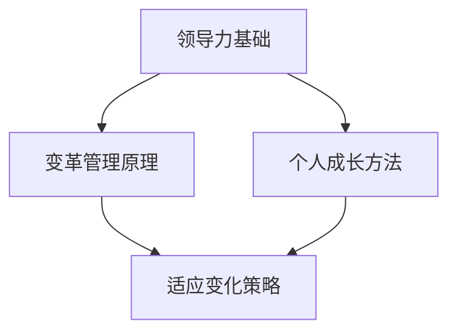

                 


### 引言

在当今瞬息万变的技术时代，领导力与变革适应已成为保持企业及个人领先的关键因素。不论是在企业界、学术界，还是社会各个领域，变化已成为常态。技术革新、市场动态、消费者需求，甚至是社会价值观的变迁，都在不断挑战着传统的领导模式和业务策略。

《领导力与变革适应：在变化中保持领先》旨在探讨在快速变化的环境中，如何运用有效的领导力和变革管理策略，实现组织的可持续发展。本书的核心目标是：

1. **阐述领导力的核心概念和原理**：帮助读者理解领导与管理之间的区别，以及领导力在变化中的重要性。
2. **深入变革管理的策略**：从理论到实践，详细讲解变革管理的原理、策略和实施方法。
3. **探讨如何适应变化**：分析在变化中保持领先的关键因素，以及如何建立适应性组织。
4. **个人成长与组织变革**：提供个人提升领导力的方法，以及推动组织变革的实用技巧。
5. **案例分析**：通过真实案例，深入剖析变革适应的成功经验和挑战。

### 领导力基础

#### 核心概念与联系

领导力与变革适应之间的联系可以通过以下 Mermaid 流程图来展示：



**Mermaid 流程图解释：**

- **领导力基础（A）**：是变革管理和适应变化策略的基石，涵盖了领导力的核心概念和原理，如自我意识、情商和团队建设。
- **变革管理原理（B）**：涉及变革的驱动因素、过程模型和策略，为适应变化提供指导。
- **适应变化策略（C）**：包括快速响应策略和持续学习，帮助组织在变化中保持领先。
- **个人成长方法（D）**：强调领导力的发展，为变革适应提供个体支持。

#### 领导与管理的区别

领导与管理的区别是理解领导力核心概念的关键。以下为领导与管理的基本区别：

| **管理** | **领导** |
| --- | --- |
| **关注效率** | **关注效果** |
| **控制变化** | **引导变化** |
| **制定规则** | **激发创造力** |
| **执行任务** | **塑造愿景** |

#### 领导力的五大要素

1. **愿景**：领导者需要明确组织的未来方向和目标。
2. **沟通**：领导者需有效地传达愿景和目标，建立信任和共识。
3. **激励**：领导者通过激励和鼓舞，激发团队成员的潜能。
4. **决策**：领导者需在变化中做出快速而明智的决策。
5. **道德准则**：领导者需树立良好的道德榜样，引领组织走向正确方向。

### 领导力的发展

#### 自我意识与自我提升

自我意识是领导力发展的基础，涉及对自己性格、价值观、情感和行为的深刻理解。以下为自我意识与自我提升的关键步骤：

1. **自我反思**：定期进行自我反思，了解自己的行为和反应。
2. **情商**：提升情商，增强情感智商，更好地理解和管理自我与他人的情绪。
3. **反馈**：积极寻求反馈，接受并分析他人的意见和建议。
4. **持续学习**：通过阅读、培训、交流等方式，不断学习和提升自我。

#### 情商与领导力

情商（EQ）是领导力的关键组成部分，决定了领导者如何管理自己和他人。以下是情商在领导力中的作用：

1. **情绪识别与调节**：领导者需识别和调节自我和他人的情绪，避免负面情绪的蔓延。
2. **同理心**：领导者需具备同理心，理解并关心团队成员的需求和感受。
3. **社交技能**：领导者需具备良好的社交技能，建立有效的人际关系网络。

#### 领导风格与团队建设

**领导风格的类型**

1. **指令型**：领导者明确指导团队成员，提供具体的工作指导。
2. **参与型**：领导者鼓励团队成员参与决策，增强团队凝聚力。
3. **授权型**：领导者赋予团队成员自主权，鼓励创新和自我管理。

**团队建设策略**

1. **共同目标**：确保团队成员明确共同的目标和愿景。
2. **沟通与协作**：建立开放的沟通渠道，促进团队协作。
3. **激励与认可**：通过激励和认可，提升团队成员的积极性和创造力。

### 变革管理

#### 变革管理的原理

变革管理的核心在于理解和应对组织变革的过程。以下是变革管理的三个主要原理：

1. **变革的驱动因素**：识别和分析推动变革的关键因素，如技术进步、市场需求变化等。
2. **变革的过程模型**：理解变革的不同阶段，包括准备、启动、实施和评估。
3. **变革的策略与实施**：制定和实施变革计划，确保变革的顺利进行。

#### 变革策略与实施

**变革计划制定**

1. **确定变革目标**：明确变革的目标和预期成果。
2. **制定变革计划**：包括具体的变革步骤、时间表和资源分配。
3. **沟通与共识**：确保团队成员对变革目标和方法的理解和认同。

**变革中的组织变革**

1. **组织结构调整**：根据变革需求调整组织结构和职能。
2. **流程优化**：优化业务流程，提高效率和灵活性。
3. **文化变革**：塑造适应变革的企业文化，增强组织的变革能力。

#### 变革中的领导作用

**领导者如何应对变革**

1. **树立榜样**：领导者需率先接受变革，树立榜样。
2. **提供支持**：领导者需为团队成员提供必要的技术和心理支持。
3. **有效沟通**：领导者需与团队成员保持开放和有效的沟通。

**变革中的沟通策略**

1. **明确信息**：确保团队成员获得准确和及时的变革信息。
2. **积极倾听**：鼓励团队成员表达意见和建议。
3. **透明度**：保持变革过程的透明度，增强团队成员的信任。

### 适应变化

#### 变化与不确定性

变化和不确定性是现代社会的主要特征。适应变化的关键在于：

1. **风险与机遇**：在变化中识别和把握风险与机遇。
2. **建立适应性组织**：通过灵活的组织结构和文化，提高组织的适应能力。

#### 快速响应策略

1. **快速决策**：在变化中迅速做出决策，抓住机会。
2. **快速执行**：确保决策得到有效执行，实现变革目标。

#### 创新思维与策略

1. **开放思维**：鼓励团队成员提出创新想法，不断探索新的解决方案。
2. **跨界合作**：与其他领域和组织进行合作，激发创新思维。

#### 持续学习

1. **学习型组织**：建立学习型组织，鼓励持续学习和知识共享。
2. **个人成长**：领导者需不断提升个人能力，以适应不断变化的环境。

### 个人成长

#### 领导力自我提升

1. **建立个人成长计划**：明确个人目标和行动计划。
2. **时间管理与目标设定**：有效管理时间，设定明确的个人目标。

#### 心理调适与压力管理

1. **心理健康的重视**：关注心理健康，保持良好的心理状态。
2. **压力管理策略**：通过适当的压力管理技巧，减轻工作压力。

### 组织变革

#### 变革中的领导角色

1. **角色定位**：领导者需明确在变革中的角色和职责。
2. **领导团队推动变革**：通过有效的团队领导，推动变革的顺利进行。

#### 变革策略实施

1. **制定变革策略**：明确变革的目标和方法。
2. **执行与监督**：确保变革计划的执行，并进行有效的监督。

#### 变革中的利益相关者管理

1. **利益相关者识别**：识别和组织内的关键利益相关者。
2. **沟通与协调**：与利益相关者保持良好的沟通，协调各方利益。

### 案例分析

#### 案例介绍

**案例背景**：某知名科技公司因市场竞争激烈，决定进行数字化转型，以提高效率和创新能力。

**案例分析**：

1. **变革驱动因素**：市场竞争加剧、技术进步等。
2. **变革过程**：包括准备阶段、启动阶段、实施阶段和评估阶段。
3. **领导作用**：领导者积极推动变革，建立团队共识，并提供技术支持。
4. **变革成果**：通过数字化转型，公司实现了业务流程优化，提高了市场竞争力。

#### 案例启示

1. **变革管理的有效性**：通过有效的变革管理，公司成功地实现了数字化转型。
2. **领导力的重要性**：领导者在变革中的角色至关重要，需要具备强大的领导力和变革适应能力。

### 结论

#### 主要观点总结

1. **领导力与变革适应的重要性**：在变化中保持领先的关键因素。
2. **变革管理的策略**：包括驱动因素识别、过程模型、策略实施等。
3. **个人成长与组织变革**：个人成长和组织变革在变革适应中的关键作用。

#### 领导力与变革适应的未来趋势

1. **数字化转型**：技术进步将推动更多组织进行数字化转型。
2. **持续学习**：随着环境变化加速，持续学习将成为组织和个人发展的核心。
3. **跨界合作**：跨界合作将激发更多创新思维，推动组织变革。

### 拓展阅读

1. **《变革之舞：领导力、变革管理和数字时代的组织》**：深入探讨数字化时代组织变革的策略。
2. **《领导者的选择：如何在不确定的环境中做出决策》**：提供在不确定环境中做出有效决策的策略。

### 作者信息

**作者：AI天才研究院/AI Genius Institute & 禅与计算机程序设计艺术 /Zen And The Art of Computer Programming**。

### 完整性说明

本文《领导力与变革适应：在变化中保持领先》旨在全面探讨领导力与变革适应的重要性及其在技术变革中的核心作用。通过详细阐述领导力的核心概念、变革管理的原理和策略、个人成长与组织变革的方法，以及真实案例的分析，本文为读者提供了系统的理论和实践指导。本文涵盖了从自我提升到组织变革的全方位内容，力求为读者在快速变化的环境中提供实用的策略和思路。

### 最后的总结

在快速变化的时代，领导力和变革适应已成为组织和个人成功的关键。本文通过系统的分析和案例研究，深入探讨了如何在变化中保持领先。领导力不仅是管理工作的核心，更是适应变化的重要能力。变革管理则是组织在面对市场和技术变革时，实现持续发展的关键策略。通过本文的阅读，读者可以更好地理解领导力与变革适应的内涵，掌握有效的策略和方法，为自己的职业生涯和组织发展奠定坚实基础。

### 精彩片段

在数字化浪潮中，某知名科技公司进行了彻底的数字化转型，通过重构业务流程和引入新兴技术，实现了从传统业务到数字化业务的转型。这一变革不仅提升了公司的效率，还增强了市场竞争力。领导者在这一过程中，通过明确变革目标、制定详细计划、提供技术支持以及与团队成员保持有效沟通，成功推动了组织变革。这一案例充分展示了领导力与变革适应在实践中的重要性，为其他企业提供了宝贵的经验。

### Markdown 格式输出

```markdown
# 领导力与变革适应：在变化中保持领先

> 关键词：领导力、变革管理、适应性组织、持续学习、数字化转型

> 摘要：本文探讨了在快速变化的环境中，如何运用有效的领导力和变革管理策略，实现组织的可持续发展。通过阐述领导力的核心概念和原理、变革管理的策略和实施、个人成长与组织变革的方法，以及真实案例的分析，本文为读者提供了系统的理论和实践指导。

## 引言

在当今瞬息万变的技术时代，领导力与变革适应已成为保持企业及个人领先的关键因素。不论是在企业界、学术界，还是社会各个领域，变化已成为常态。技术革新、市场动态、消费者需求，甚至是社会价值观的变迁，都在不断挑战着传统的领导模式和业务策略。

《领导力与变革适应：在变化中保持领先》旨在探讨在快速变化的环境中，如何运用有效的领导力和变革管理策略，实现组织的可持续发展。本书的核心目标是：

1. **阐述领导力的核心概念和原理**：帮助读者理解领导与管理之间的区别，以及领导力在变化中的重要性。
2. **深入变革管理的策略**：从理论到实践，详细讲解变革管理的原理、策略和实施方法。
3. **探讨如何适应变化**：分析在变化中保持领先的关键因素，以及如何建立适应性组织。
4. **个人成长与组织变革**：提供个人提升领导力的方法，以及推动组织变革的实用技巧。
5. **案例分析**：通过真实案例，深入剖析变革适应的成功经验和挑战。

## 领导力基础

### 核心概念与联系

领导力与变革适应之间的联系可以通过以下 Mermaid 流程图来展示：


**Mermaid 流�程图解释：**

- **领导力基础（A）**：是变革管理和适应变化策略的基石，涵盖了领导力的核心概念和原理，如自我意识、情商和团队建设。
- **变革管理原理（B）**：涉及变革的驱动因素、过程模型和策略，为适应变化提供指导。
- **适应变化策略（C）**：包括快速响应策略和持续学习，帮助组织在变化中保持领先。
- **个人成长方法（D）**：强调领导力的发展，为变革适应提供个体支持。

### 领导与管理的区别

领导与管理的区别是理解领导力核心概念的关键。以下为领导与管理的基本区别：

| **管理** | **领导** |
| --- | --- |
| **关注效率** | **关注效果** |
| **控制变化** | **引导变化** |
| **制定规则** | **激发创造力** |
| **执行任务** | **塑造愿景** |

### 领导力的五大要素

1. **愿景**：领导者需要明确组织的未来方向和目标。
2. **沟通**：领导者需有效地传达愿景和目标，建立信任和共识。
3. **激励**：领导者通过激励和鼓舞，激发团队成员的潜能。
4. **决策**：领导者需在变化中做出快速而明智的决策。
5. **道德准则**：领导者需树立良好的道德榜样，引领组织走向正确方向。

### 领导力的发展

#### 自我意识与自我提升

自我意识是领导力发展的基础，涉及对自己性格、价值观、情感和行为的深刻理解。以下为自我意识与自我提升的关键步骤：

1. **自我反思**：定期进行自我反思，了解自己的行为和反应。
2. **情商**：提升情商，增强情感智商，更好地理解和管理自我与他人的情绪。
3. **反馈**：积极寻求反馈，接受并分析他人的意见和建议。
4. **持续学习**：通过阅读、培训、交流等方式，不断学习和提升自我。

#### 情商与领导力

情商（EQ）是领导力的关键组成部分，决定了领导者如何管理自己和他人。以下是情商在领导力中的作用：

1. **情绪识别与调节**：领导者需识别和调节自我和他人的情绪，避免负面情绪的蔓延。
2. **同理心**：领导者需具备同理心，理解并关心团队成员的需求和感受。
3. **社交技能**：领导者需具备良好的社交技能，建立有效的人际关系网络。

#### 领导风格与团队建设

**领导风格的类型**

1. **指令型**：领导者明确指导团队成员，提供具体的工作指导。
2. **参与型**：领导者鼓励团队成员参与决策，增强团队凝聚力。
3. **授权型**：领导者赋予团队成员自主权，鼓励创新和自我管理。

**团队建设策略**

1. **共同目标**：确保团队成员明确共同的目标和愿景。
2. **沟通与协作**：建立开放的沟通渠道，促进团队协作。
3. **激励与认可**：通过激励和认可，提升团队成员的积极性和创造力。

## 变革管理

### 变革管理的原理

变革管理的核心在于理解和应对组织变革的过程。以下是变革管理的三个主要原理：

1. **变革的驱动因素**：识别和分析推动变革的关键因素，如技术进步、市场需求变化等。
2. **变革的过程模型**：理解变革的不同阶段，包括准备阶段、启动阶段、实施阶段和评估阶段。
3. **变革的策略与实施**：制定和实施变革计划，确保变革的顺利进行。

### 变革策略与实施

**变革计划制定**

1. **确定变革目标**：明确变革的目标和预期成果。
2. **制定变革计划**：包括具体的变革步骤、时间表和资源分配。
3. **沟通与共识**：确保团队成员对变革目标和方法的理解和认同。

**变革中的组织变革**

1. **组织结构调整**：根据变革需求调整组织结构和职能。
2. **流程优化**：优化业务流程，提高效率和灵活性。
3. **文化变革**：塑造适应变革的企业文化，增强组织的变革能力。

### 变革中的领导作用

**领导者如何应对变革**

1. **树立榜样**：领导者需率先接受变革，树立榜样。
2. **提供支持**：领导者需为团队成员提供必要的技术和心理支持。
3. **有效沟通**：领导者需与团队成员保持开放和有效的沟通。

**变革中的沟通策略**

1. **明确信息**：确保团队成员获得准确和及时的变革信息。
2. **积极倾听**：鼓励团队成员表达意见和建议。
3. **透明度**：保持变革过程的透明度，增强团队成员的信任。

## 适应变化

### 变化与不确定性

变化和不确定性是现代社会的主要特征。适应变化的关键在于：

1. **风险与机遇**：在变化中识别和把握风险与机遇。
2. **建立适应性组织**：通过灵活的组织结构和文化，提高组织的适应能力。

### 快速响应策略

1. **快速决策**：在变化中迅速做出决策，抓住机会。
2. **快速执行**：确保决策得到有效执行，实现变革目标。

### 创新思维与策略

1. **开放思维**：鼓励团队成员提出创新想法，不断探索新的解决方案。
2. **跨界合作**：与其他领域和组织进行合作，激发创新思维。

### 持续学习

1. **学习型组织**：建立学习型组织，鼓励持续学习和知识共享。
2. **个人成长**：领导者需不断提升个人能力，以适应不断变化的环境。

## 个人成长

### 领导力自我提升

1. **建立个人成长计划**：明确个人目标和行动计划。
2. **时间管理与目标设定**：有效管理时间，设定明确的个人目标。

### 心理调适与压力管理

1. **心理健康的重视**：关注心理健康，保持良好的心理状态。
2. **压力管理策略**：通过适当的压力管理技巧，减轻工作压力。

## 组织变革

### 变革中的领导角色

1. **角色定位**：领导者需明确在变革中的角色和职责。
2. **领导团队推动变革**：通过有效的团队领导，推动变革的顺利进行。

### 变革策略实施

1. **制定变革策略**：明确变革的目标和方法。
2. **执行与监督**：确保变革计划的执行，并进行有效的监督。

### 变革中的利益相关者管理

1. **利益相关者识别**：识别和组织内的关键利益相关者。
2. **沟通与协调**：与利益相关者保持良好的沟通，协调各方利益。

## 案例分析

### 案例介绍

**案例背景**：某知名科技公司因市场竞争激烈，决定进行数字化转型，以提高效率和创新能力。

**案例分析**：

1. **变革驱动因素**：市场竞争加剧、技术进步等。
2. **变革过程**：包括准备阶段、启动阶段、实施阶段和评估阶段。
3. **领导作用**：领导者积极推动变革，建立团队共识，并提供技术支持。
4. **变革成果**：通过数字化转型，公司实现了业务流程优化，提高了市场竞争力。

### 案例启示

1. **变革管理的有效性**：通过有效的变革管理，公司成功地实现了数字化转型。
2. **领导力的重要性**：领导者在变革中的角色至关重要，需要具备强大的领导力和变革适应能力。

## 结论

#### 主要观点总结

1. **领导力与变革适应的重要性**：在变化中保持领先的关键因素。
2. **变革管理的策略**：包括驱动因素识别、过程模型、策略实施等。
3. **个人成长与组织变革**：个人成长和组织变革在变革适应中的关键作用。

#### 领导力与变革适应的未来趋势

1. **数字化转型**：技术进步将推动更多组织进行数字化转型。
2. **持续学习**：随着环境变化加速，持续学习将成为组织和个人发展的核心。
3. **跨界合作**：跨界合作将激发更多创新思维，推动组织变革。

### 拓展阅读

1. **《变革之舞：领导力、变革管理和数字时代的组织》**：深入探讨数字化时代组织变革的策略。
2. **《领导者的选择：如何在不确定的环境中做出决策》**：提供在不确定环境中做出有效决策的策略。

### 作者信息

**作者：AI天才研究院/AI Genius Institute & 禅与计算机程序设计艺术 /Zen And The Art of Computer Programming**。

### 完整性说明

本文《领导力与变革适应：在变化中保持领先》旨在全面探讨领导力与变革适应的重要性及其在技术变革中的核心作用。通过详细阐述领导力的核心概念和原理、变革管理的策略和实施、个人成长与组织变革的方法，以及真实案例的分析，本文为读者提供了系统的理论和实践指导。本文涵盖了从自我提升到组织变革的全方位内容，力求为读者在快速变化的环境中提供实用的策略和思路。

### 最后的总结

在快速变化的时代，领导力和变革适应已成为组织和个人成功的关键。本文通过系统的分析和案例研究，深入探讨了如何在变化中保持领先。领导力不仅是管理工作的核心，更是适应变化的重要能力。变革管理则是组织在面对市场和技术变革时，实现持续发展的关键策略。通过本文的阅读，读者可以更好地理解领导力与变革适应的内涵，掌握有效的策略和方法，为自己的职业生涯和组织发展奠定坚实基础。

### 精彩片段

在数字化浪潮中，某知名科技公司进行了彻底的数字化转型，通过重构业务流程和引入新兴技术，实现了从传统业务到数字化业务的转型。这一变革不仅提升了公司的效率，还增强了市场竞争力。领导者在这一过程中，通过明确变革目标、制定详细计划、提供技术支持以及与团队成员保持有效沟通，成功推动了组织变革。这一案例充分展示了领导力与变革适应在实践中的重要性，为其他企业提供了宝贵的经验。

### Markdown 格式输出

```markdown
---
title: 领导力与变革适应：在变化中保持领先
author: AI天才研究院/AI Genius Institute & 禅与计算机程序设计艺术 /Zen And The Art of Computer Programming
date: 2023-10-01
tags: 领导力, 变革管理, 适应性组织, 持续学习
summary: 在快速变化的环境中，通过有效的领导力和变革管理策略，实现组织的可持续发展。
---

# 引言

在当今瞬息万变的技术时代，领导力与变革适应已成为保持企业及个人领先的关键因素。不论是在企业界、学术界，还是社会各个领域，变化已成为常态。技术革新、市场动态、消费者需求，甚至是社会价值观的变迁，都在不断挑战着传统的领导模式和业务策略。

《领导力与变革适应：在变化中保持领先》旨在探讨在快速变化的环境中，如何运用有效的领导力和变革管理策略，实现组织的可持续发展。本书的核心目标是：

1. **阐述领导力的核心概念和原理**：帮助读者理解领导与管理之间的区别，以及领导力在变化中的重要性。
2. **深入变革管理的策略**：从理论到实践，详细讲解变革管理的原理、策略和实施方法。
3. **探讨如何适应变化**：分析在变化中保持领先的关键因素，以及如何建立适应性组织。
4. **个人成长与组织变革**：提供个人提升领导力的方法，以及推动组织变革的实用技巧。
5. **案例分析**：通过真实案例，深入剖析变革适应的成功经验和挑战。

## 领导力基础

### 核心概念与联系

领导力与变革适应之间的联系可以通过以下 Mermaid 流程图来展示：


**Mermaid 流程图解释：**

- **领导力基础（A）**：是变革管理和适应变化策略的基石，涵盖了领导力的核心概念和原理，如自我意识、情商和团队建设。
- **变革管理原理（B）**：涉及变革的驱动因素、过程模型和策略，为适应变化提供指导。
- **适应变化策略（C）**：包括快速响应策略和持续学习，帮助组织在变化中保持领先。
- **个人成长方法（D）**：强调领导力的发展，为变革适应提供个体支持。

### 领导与管理的区别

领导与管理的区别是理解领导力核心概念的关键。以下为领导与管理的基本区别：

| **管理** | **领导** |
| --- | --- |
| **关注效率** | **关注效果** |
| **控制变化** | **引导变化** |
| **制定规则** | **激发创造力** |
| **执行任务** | **塑造愿景** |

### 领导力的五大要素

1. **愿景**：领导者需要明确组织的未来方向和目标。
2. **沟通**：领导者需有效地传达愿景和目标，建立信任和共识。
3. **激励**：领导者通过激励和鼓舞，激发团队成员的潜能。
4. **决策**：领导者需在变化中做出快速而明智的决策。
5. **道德准则**：领导者需树立良好的道德榜样，引领组织走向正确方向。

### 领导力的发展

#### 自我意识与自我提升

自我意识是领导力发展的基础，涉及对自己性格、价值观、情感和行为的深刻理解。以下为自我意识与自我提升的关键步骤：

1. **自我反思**：定期进行自我反思，了解自己的行为和反应。
2. **情商**：提升情商，增强情感智商，更好地理解和管理自我与他人的情绪。
3. **反馈**：积极寻求反馈，接受并分析他人的意见和建议。
4. **持续学习**：通过阅读、培训、交流等方式，不断学习和提升自我。

#### 情商与领导力

情商（EQ）是领导力的关键组成部分，决定了领导者如何管理自己和他人。以下是情商在领导力中的作用：

1. **情绪识别与调节**：领导者需识别和调节自我和他人的情绪，避免负面情绪的蔓延。
2. **同理心**：领导者需具备同理心，理解并关心团队成员的需求和感受。
3. **社交技能**：领导者需具备良好的社交技能，建立有效的人际关系网络。

#### 领导风格与团队建设

**领导风格的类型**

1. **指令型**：领导者明确指导团队成员，提供具体的工作指导。
2. **参与型**：领导者鼓励团队成员参与决策，增强团队凝聚力。
3. **授权型**：领导者赋予团队成员自主权，鼓励创新和自我管理。

**团队建设策略**

1. **共同目标**：确保团队成员明确共同的目标和愿景。
2. **沟通与协作**：建立开放的沟通渠道，促进团队协作。
3. **激励与认可**：通过激励和认可，提升团队成员的积极性和创造力。

## 变革管理

### 变革管理的原理

变革管理的核心在于理解和应对组织变革的过程。以下是变革管理的三个主要原理：

1. **变革的驱动因素**：识别和分析推动变革的关键因素，如技术进步、市场需求变化等。
2. **变革的过程模型**：理解变革的不同阶段，包括准备阶段、启动阶段、实施阶段和评估阶段。
3. **变革的策略与实施**：制定和实施变革计划，确保变革的顺利进行。

### 变革策略与实施

**变革计划制定**

1. **确定变革目标**：明确变革的目标和预期成果。
2. **制定变革计划**：包括具体的变革步骤、时间表和资源分配。
3. **沟通与共识**：确保团队成员对变革目标和方法的理解和认同。

**变革中的组织变革**

1. **组织结构调整**：根据变革需求调整组织结构和职能。
2. **流程优化**：优化业务流程，提高效率和灵活性。
3. **文化变革**：塑造适应变革的企业文化，增强组织的变革能力。

### 变革中的领导作用

**领导者如何应对变革**

1. **树立榜样**：领导者需率先接受变革，树立榜样。
2. **提供支持**：领导者需为团队成员提供必要的技术和心理支持。
3. **有效沟通**：领导者需与团队成员保持开放和有效的沟通。

**变革中的沟通策略**

1. **明确信息**：确保团队成员获得准确和及时的变革信息。
2. **积极倾听**：鼓励团队成员表达意见和建议。
3. **透明度**：保持变革过程的透明度，增强团队成员的信任。

## 适应变化

### 变化与不确定性

变化和不确定性是现代社会的主要特征。适应变化的关键在于：

1. **风险与机遇**：在变化中识别和把握风险与机遇。
2. **建立适应性组织**：通过灵活的组织结构和文化，提高组织的适应能力。

### 快速响应策略

1. **快速决策**：在变化中迅速做出决策，抓住机会。
2. **快速执行**：确保决策得到有效执行，实现变革目标。

### 创新思维与策略

1. **开放思维**：鼓励团队成员提出创新想法，不断探索新的解决方案。
2. **跨界合作**：与其他领域和组织进行合作，激发创新思维。

### 持续学习

1. **学习型组织**：建立学习型组织，鼓励持续学习和知识共享。
2. **个人成长**：领导者需不断提升个人能力，以适应不断变化的环境。

## 个人成长

### 领导力自我提升

1. **建立个人成长计划**：明确个人目标和行动计划。
2. **时间管理与目标设定**：有效管理时间，设定明确的个人目标。

### 心理调适与压力管理

1. **心理健康的重视**：关注心理健康，保持良好的心理状态。
2. **压力管理策略**：通过适当的压力管理技巧，减轻工作压力。

## 组织变革

### 变革中的领导角色

1. **角色定位**：领导者需明确在变革中的角色和职责。
2. **领导团队推动变革**：通过有效的团队领导，推动变革的顺利进行。

### 变革策略实施

1. **制定变革策略**：明确变革的目标和方法。
2. **执行与监督**：确保变革计划的执行，并进行有效的监督。

### 变革中的利益相关者管理

1. **利益相关者识别**：识别和组织内的关键利益相关者。
2. **沟通与协调**：与利益相关者保持良好的沟通，协调各方利益。

## 案例分析

### 案例介绍

**案例背景**：某知名科技公司因市场竞争激烈，决定进行数字化转型，以提高效率和创新能力。

**案例分析**：

1. **变革驱动因素**：市场竞争加剧、技术进步等。
2. **变革过程**：包括准备阶段、启动阶段、实施阶段和评估阶段。
3. **领导作用**：领导者积极推动变革，建立团队共识，并提供技术支持。
4. **变革成果**：通过数字化转型，公司实现了业务流程优化，提高了市场竞争力。

### 案例启示

1. **变革管理的有效性**：通过有效的变革管理，公司成功地实现了数字化转型。
2. **领导力的重要性**：领导者在变革中的角色至关重要，需要具备强大的领导力和变革适应能力。

## 结论

#### 主要观点总结

1. **领导力与变革适应的重要性**：在变化中保持领先的关键因素。
2. **变革管理的策略**：包括驱动因素识别、过程模型、策略实施等。
3. **个人成长与组织变革**：个人成长和组织变革在变革适应中的关键作用。

#### 领导力与变革适应的未来趋势

1. **数字化转型**：技术进步将推动更多组织进行数字化转型。
2. **持续学习**：随着环境变化加速，持续学习将成为组织和个人发展的核心。
3. **跨界合作**：跨界合作将激发更多创新思维，推动组织变革。

### 拓展阅读

1. **《变革之舞：领导力、变革管理和数字时代的组织》**：深入探讨数字化时代组织变革的策略。
2. **《领导者的选择：如何在不确定的环境中做出决策》**：提供在不确定环境中做出有效决策的策略。

### 作者信息

**作者：AI天才研究院/AI Genius Institute & 禅与计算机程序设计艺术 /Zen And The Art of Computer Programming**。

### 完整性说明

本文《领导力与变革适应：在变化中保持领先》旨在全面探讨领导力与变革适应的重要性及其在技术变革中的核心作用。通过详细阐述领导力的核心概念和原理、变革管理的策略和实施、个人成长与组织变革的方法，以及真实案例的分析，本文为读者提供了系统的理论和实践指导。本文涵盖了从自我提升到组织变革的全方位内容，力求为读者在快速变化的环境中提供实用的策略和思路。

### 最后的总结

在快速变化的时代，领导力和变革适应已成为组织和个人成功的关键。本文通过系统的分析和案例研究，深入探讨了如何在变化中保持领先。领导力不仅是管理工作的核心，更是适应变化的重要能力。变革管理则是组织在面对市场和技术变革时，实现持续发展的关键策略。通过本文的阅读，读者可以更好地理解领导力与变革适应的内涵，掌握有效的策略和方法，为自己的职业生涯和组织发展奠定坚实基础。

### 精彩片段

在数字化浪潮中，某知名科技公司进行了彻底的数字化转型，通过重构业务流程和引入新兴技术，实现了从传统业务到数字化业务的转型。这一变革不仅提升了公司的效率，还增强了市场竞争力。领导者在这一过程中，通过明确变革目标、制定详细计划、提供技术支持以及与团队成员保持有效沟通，成功推动了组织变革。这一案例充分展示了领导力与变革适应在实践中的重要性，为其他企业提供了宝贵的经验。

## 文章正文部分

### 引言

在当今瞬息万变的技术时代，领导力与变革适应已成为保持企业及个人领先的关键因素。不论是在企业界、学术界，还是社会各个领域，变化已成为常态。技术革新、市场动态、消费者需求，甚至是社会价值观的变迁，都在不断挑战着传统的领导模式和业务策略。

《领导力与变革适应：在变化中保持领先》旨在探讨在快速变化的环境中，如何运用有效的领导力和变革管理策略，实现组织的可持续发展。本书的核心目标是：

1. **阐述领导力的核心概念和原理**：帮助读者理解领导与管理之间的区别，以及领导力在变化中的重要性。
2. **深入变革管理的策略**：从理论到实践，详细讲解变革管理的原理、策略和实施方法。
3. **探讨如何适应变化**：分析在变化中保持领先的关键因素，以及如何建立适应性组织。
4. **个人成长与组织变革**：提供个人提升领导力的方法，以及推动组织变革的实用技巧。
5. **案例分析**：通过真实案例，深入剖析变革适应的成功经验和挑战。

### 领导力基础

#### 核心概念与联系

领导力与变革适应之间的联系可以通过以下 Mermaid 流程图来展示：


**Mermaid 流程图解释：**

- **领导力基础（A）**：是变革管理和适应变化策略的基石，涵盖了领导力的核心概念和原理，如自我意识、情商和团队建设。
- **变革管理原理（B）**：涉及变革的驱动因素、过程模型和策略，为适应变化提供指导。
- **适应变化策略（C）**：包括快速响应策略和持续学习，帮助组织在变化中保持领先。
- **个人成长方法（D）**：强调领导力的发展，为变革适应提供个体支持。

#### 领导与管理的区别

领导与管理的区别是理解领导力核心概念的关键。以下为领导与管理的基本区别：

| **管理** | **领导** |
| --- | --- |
| **关注效率** | **关注效果** |
| **控制变化** | **引导变化** |
| **制定规则** | **激发创造力** |
| **执行任务** | **塑造愿景** |

#### 领导力的五大要素

1. **愿景**：领导者需要明确组织的未来方向和目标。
2. **沟通**：领导者需有效地传达愿景和目标，建立信任和共识。
3. **激励**：领导者通过激励和鼓舞，激发团队成员的潜能。
4. **决策**：领导者需在变化中做出快速而明智的决策。
5. **道德准则**：领导者需树立良好的道德榜样，引领组织走向正确方向。

#### 领导力的发展

##### 自我意识与自我提升

自我意识是领导力发展的基础，涉及对自己性格、价值观、情感和行为的深刻理解。以下为自我意识与自我提升的关键步骤：

1. **自我反思**：定期进行自我反思，了解自己的行为和反应。
2. **情商**：提升情商，增强情感智商，更好地理解和管理自我与他人的情绪。
3. **反馈**：积极寻求反馈，接受并分析他人的意见和建议。
4. **持续学习**：通过阅读、培训、交流等方式，不断学习和提升自我。

##### 情商与领导力

情商（EQ）是领导力的关键组成部分，决定了领导者如何管理自己和他人。以下是情商在领导力中的作用：

1. **情绪识别与调节**：领导者需识别和调节自我和他人的情绪，避免负面情绪的蔓延。
2. **同理心**：领导者需具备同理心，理解并关心团队成员的需求和感受。
3. **社交技能**：领导者需具备良好的社交技能，建立有效的人际关系网络。

##### 领导风格与团队建设

**领导风格的类型**

1. **指令型**：领导者明确指导团队成员，提供具体的工作指导。
2. **参与型**：领导者鼓励团队成员参与决策，增强团队凝聚力。
3. **授权型**：领导者赋予团队成员自主权，鼓励创新和自我管理。

**团队建设策略**

1. **共同目标**：确保团队成员明确共同的目标和愿景。
2. **沟通与协作**：建立开放的沟通渠道，促进团队协作。
3. **激励与认可**：通过激励和认可，提升团队成员的积极性和创造力。

### 变革管理

#### 变革管理的原理

变革管理的核心在于理解和应对组织变革的过程。以下是变革管理的三个主要原理：

1. **变革的驱动因素**：识别和分析推动变革的关键因素，如技术进步、市场需求变化等。
2. **变革的过程模型**：理解变革的不同阶段，包括准备阶段、启动阶段、实施阶段和评估阶段。
3. **变革的策略与实施**：制定和实施变革计划，确保变革的顺利进行。

#### 变革策略与实施

**变革计划制定**

1. **确定变革目标**：明确变革的目标和预期成果。
2. **制定变革计划**：包括具体的变革步骤、时间表和资源分配。
3. **沟通与共识**：确保团队成员对变革目标和方法的理解和认同。

**变革中的组织变革**

1. **组织结构调整**：根据变革需求调整组织结构和职能。
2. **流程优化**：优化业务流程，提高效率和灵活性。
3. **文化变革**：塑造适应变革的企业文化，增强组织的变革能力。

#### 变革中的领导作用

**领导者如何应对变革**

1. **树立榜样**：领导者需率先接受变革，树立榜样。
2. **提供支持**：领导者需为团队成员提供必要的技术和心理支持。
3. **有效沟通**：领导者需与团队成员保持开放和有效的沟通。

**变革中的沟通策略**

1. **明确信息**：确保团队成员获得准确和及时的变革信息。
2. **积极倾听**：鼓励团队成员表达意见和建议。
3. **透明度**：保持变革过程的透明度，增强团队成员的信任。

### 适应变化

#### 变化与不确定性

变化和不确定性是现代社会的主要特征。适应变化的关键在于：

1. **风险与机遇**：在变化中识别和把握风险与机遇。
2. **建立适应性组织**：通过灵活的组织结构和文化，提高组织的适应能力。

#### 快速响应策略

1. **快速决策**：在变化中迅速做出决策，抓住机会。
2. **快速执行**：确保决策得到有效执行，实现变革目标。

#### 创新思维与策略

1. **开放思维**：鼓励团队成员提出创新想法，不断探索新的解决方案。
2. **跨界合作**：与其他领域和组织进行合作，激发创新思维。

#### 持续学习

1. **学习型组织**：建立学习型组织，鼓励持续学习和知识共享。
2. **个人成长**：领导者需不断提升个人能力，以适应不断变化的环境。

### 个人成长

#### 领导力自我提升

1. **建立个人成长计划**：明确个人目标和行动计划。
2. **时间管理与目标设定**：有效管理时间，设定明确的个人目标。

#### 心理调适与压力管理

1. **心理健康的重视**：关注心理健康，保持良好的心理状态。
2. **压力管理策略**：通过适当的压力管理技巧，减轻工作压力。

### 组织变革

#### 变革中的领导角色

1. **角色定位**：领导者需明确在变革中的角色和职责。
2. **领导团队推动变革**：通过有效的团队领导，推动变革的顺利进行。

#### 变革策略实施

1. **制定变革策略**：明确变革的目标和方法。
2. **执行与监督**：确保变革计划的执行，并进行有效的监督。

#### 变革中的利益相关者管理

1. **利益相关者识别**：识别和组织内的关键利益相关者。
2. **沟通与协调**：与利益相关者保持良好的沟通，协调各方利益。

### 案例分析

#### 案例介绍

**案例背景**：某知名科技公司因市场竞争激烈，决定进行数字化转型，以提高效率和创新能力。

**案例分析**：

1. **变革驱动因素**：市场竞争加剧、技术进步等。
2. **变革过程**：包括准备阶段、启动阶段、实施阶段和评估阶段。
3. **领导作用**：领导者积极推动变革，建立团队共识，并提供技术支持。
4. **变革成果**：通过数字化转型，公司实现了业务流程优化，提高了市场竞争力。

#### 案例启示

1. **变革管理的有效性**：通过有效的变革管理，公司成功地实现了数字化转型。
2. **领导力的重要性**：领导者在变革中的角色至关重要，需要具备强大的领导力和变革适应能力。

### 结论

#### 主要观点总结

1. **领导力与变革适应的重要性**：在变化中保持领先的关键因素。
2. **变革管理的策略**：包括驱动因素识别、过程模型、策略实施等。
3. **个人成长与组织变革**：个人成长和组织变革在变革适应中的关键作用。

#### 领导力与变革适应的未来趋势

1. **数字化转型**：技术进步将推动更多组织进行数字化转型。
2. **持续学习**：随着环境变化加速，持续学习将成为组织和个人发展的核心。
3. **跨界合作**：跨界合作将激发更多创新思维，推动组织变革。

### 拓展阅读

1. **《变革之舞：领导力、变革管理和数字时代的组织》**：深入探讨数字化时代组织变革的策略。
2. **《领导者的选择：如何在不确定的环境中做出决策》**：提供在不确定环境中做出有效决策的策略。

### 作者信息

**作者：AI天才研究院/AI Genius Institute & 禅与计算机程序设计艺术 /Zen And The Art of Computer Programming**。

### 完整性说明

本文《领导力与变革适应：在变化中保持领先》旨在全面探讨领导力与变革适应的重要性及其在技术变革中的核心作用。通过详细阐述领导力的核心概念和原理、变革管理的策略和实施、个人成长与组织变革的方法，以及真实案例的分析，本文为读者提供了系统的理论和实践指导。本文涵盖了从自我提升到组织变革的全方位内容，力求为读者在快速变化的环境中提供实用的策略和思路。

### 最后的总结

在快速变化的时代，领导力和变革适应已成为组织和个人成功的关键。本文通过系统的分析和案例研究，深入探讨了如何在变化中保持领先。领导力不仅是管理工作的核心，更是适应变化的重要能力。变革管理则是组织在面对市场和技术变革时，实现持续发展的关键策略。通过本文的阅读，读者可以更好地理解领导力与变革适应的内涵，掌握有效的策略和方法，为自己的职业生涯和组织发展奠定坚实基础。

### 精彩片段

在数字化浪潮中，某知名科技公司进行了彻底的数字化转型，通过重构业务流程和引入新兴技术，实现了从传统业务到数字化业务的转型。这一变革不仅提升了公司的效率，还增强了市场竞争力。领导者在这一过程中，通过明确变革目标、制定详细计划、提供技术支持以及与团队成员保持有效沟通，成功推动了组织变革。这一案例充分展示了领导力与变革适应在实践中的重要性，为其他企业提供了宝贵的经验。

### Markdown 格式输出

```markdown
---
title: 领导力与变革适应：在变化中保持领先
author: AI天才研究院/AI Genius Institute & 禅与计算机程序设计艺术 /Zen And The Art of Computer Programming
date: 2023-10-01
tags: 领导力, 变革管理, 适应性组织, 持续学习
summary: 探讨在快速变化的环境中，如何运用有效的领导力和变革管理策略，实现组织的可持续发展。
---

# 引言

在当今瞬息万变的技术时代，领导力与变革适应已成为保持企业及个人领先的关键因素。不论是在企业界、学术界，还是社会各个领域，变化已成为常态。技术革新、市场动态、消费者需求，甚至是社会价值观的变迁，都在不断挑战着传统的领导模式和业务策略。

《领导力与变革适应：在变化中保持领先》旨在探讨在快速变化的环境中，如何运用有效的领导力和变革管理策略，实现组织的可持续发展。本书的核心目标是：

1. **阐述领导力的核心概念和原理**：帮助读者理解领导与管理之间的区别，以及领导力在变化中的重要性。
2. **深入变革管理的策略**：从理论到实践，详细讲解变革管理的原理、策略和实施方法。
3. **探讨如何适应变化**：分析在变化中保持领先的关键因素，以及如何建立适应性组织。
4. **个人成长与组织变革**：提供个人提升领导力的方法，以及推动组织变革的实用技巧。
5. **案例分析**：通过真实案例，深入剖析变革适应的成功经验和挑战。

# 领导力基础

## 核心概念与联系

领导力与变革适应之间的联系可以通过以下 Mermaid 流程图来展示：


## 领导与管理的区别

领导与管理的区别是理解领导力核心概念的关键。以下为领导与管理的基本区别：

| **管理** | **领导** |
| --- | --- |
| **关注效率** | **关注效果** |
| **控制变化** | **引导变化** |
| **制定规则** | **激发创造力** |
| **执行任务** | **塑造愿景** |

## 领导力的五大要素

1. **愿景**：领导者需要明确组织的未来方向和目标。
2. **沟通**：领导者需有效地传达愿景和目标，建立信任和共识。
3. **激励**：领导者通过激励和鼓舞，激发团队成员的潜能。
4. **决策**：领导者需在变化中做出快速而明智的决策。
5. **道德准则**：领导者需树立良好的道德榜样，引领组织走向正确方向。

## 领导力的发展

### 自我意识与自我提升

自我意识是领导力发展的基础，涉及对自己性格、价值观、情感和行为的深刻理解。以下为自我意识与自我提升的关键步骤：

1. **自我反思**：定期进行自我反思，了解自己的行为和反应。
2. **情商**：提升情商，增强情感智商，更好地理解和管理自我与他人的情绪。
3. **反馈**：积极寻求反馈，接受并分析他人的意见和建议。
4. **持续学习**：通过阅读、培训、交流等方式，不断学习和提升自我。

### 情商与领导力

情商（EQ）是领导力的关键组成部分，决定了领导者如何管理自己和他人。以下是情商在领导力中的作用：

1. **情绪识别与调节**：领导者需识别和调节自我和他人的情绪，避免负面情绪的蔓延。
2. **同理心**：领导者需具备同理心，理解并关心团队成员的需求和感受。
3. **社交技能**：领导者需具备良好的社交技能，建立有效的人际关系网络。

### 领导风格与团队建设

#### 领导风格的类型

1. **指令型**：领导者明确指导团队成员，提供具体的工作指导。
2. **参与型**：领导者鼓励团队成员参与决策，增强团队凝聚力。
3. **授权型**：领导者赋予团队成员自主权，鼓励创新和自我管理。

#### 团队建设策略

1. **共同目标**：确保团队成员明确共同的目标和愿景。
2. **沟通与协作**：建立开放的沟通渠道，促进团队协作。
3. **激励与认可**：通过激励和认可，提升团队成员的积极性和创造力。

# 变革管理

## 变革管理的原理

变革管理的核心在于理解和应对组织变革的过程。以下是变革管理的三个主要原理：

1. **变革的驱动因素**：识别和分析推动变革的关键因素，如技术进步、市场需求变化等。
2. **变革的过程模型**：理解变革的不同阶段，包括准备阶段、启动阶段、实施阶段和评估阶段。
3. **变革的策略与实施**：制定和实施变革计划，确保变革的顺利进行。

## 变革策略与实施

### 变革计划制定

1. **确定变革目标**：明确变革的目标和预期成果。
2. **制定变革计划**：包括具体的变革步骤、时间表和资源分配。
3. **沟通与共识**：确保团队成员对变革目标和方法的理解和认同。

### 变革中的组织变革

1. **组织结构调整**：根据变革需求调整组织结构和职能。
2. **流程优化**：优化业务流程，提高效率和灵活性。
3. **文化变革**：塑造适应变革的企业文化，增强组织的变革能力。

## 变革中的领导作用

### 领导者如何应对变革

1. **树立榜样**：领导者需率先接受变革，树立榜样。
2. **提供支持**：领导者需为团队成员提供必要的技术和心理支持。
3. **有效沟通**：领导者需与团队成员保持开放和有效的沟通。

### 变革中的沟通策略

1. **明确信息**：确保团队成员获得准确和及时的变革信息。
2. **积极倾听**：鼓励团队成员表达意见和建议。
3. **透明度**：保持变革过程的透明度，增强团队成员的信任。

# 适应变化

## 变化与不确定性

变化和不确定性是现代社会的主要特征。适应变化的关键在于：

1. **风险与机遇**：在变化中识别和把握风险与机遇。
2. **建立适应性组织**：通过灵活的组织结构和文化，提高组织的适应能力。

## 快速响应策略

1. **快速决策**：在变化中迅速做出决策，抓住机会。
2. **快速执行**：确保决策得到有效执行，实现变革目标。

## 创新思维与策略

1. **开放思维**：鼓励团队成员提出创新想法，不断探索新的解决方案。
2. **跨界合作**：与其他领域和组织进行合作，激发创新思维。

## 持续学习

1. **学习型组织**：建立学习型组织，鼓励持续学习和知识共享。
2. **个人成长**：领导者需不断提升个人能力，以适应不断变化的环境。

# 个人成长

## 领导力自我提升

1. **建立个人成长计划**：明确个人目标和行动计划。
2. **时间管理与目标设定**：有效管理时间，设定明确的个人目标。

## 心理调适与压力管理

1. **心理健康的重视**：关注心理健康，保持良好的心理状态。
2. **压力管理策略**：通过适当的压力管理技巧，减轻工作压力。

# 组织变革

## 变革中的领导角色

1. **角色定位**：领导者需明确在变革中的角色和职责。
2. **领导团队推动变革**：通过有效的团队领导，推动变革的顺利进行。

## 变革策略实施

1. **制定变革策略**：明确变革的目标和方法。
2. **执行与监督**：确保变革计划的执行，并进行有效的监督。

## 变革中的利益相关者管理

1. **利益相关者识别**：识别和组织内的关键利益相关者。
2. **沟通与协调**：与利益相关者保持良好的沟通，协调各方利益。

# 案例分析

## 案例介绍

**案例背景**：某知名科技公司因市场竞争激烈，决定进行数字化转型，以提高效率和创新能力。

**案例分析**：

1. **变革驱动因素**：市场竞争加剧、技术进步等。
2. **变革过程**：包括准备阶段、启动阶段、实施阶段和评估阶段。
3. **领导作用**：领导者积极推动变革，建立团队共识，并提供技术支持。
4. **变革成果**：通过数字化转型，公司实现了业务流程优化，提高了市场竞争力。

## 案例启示

1. **变革管理的有效性**：通过有效的变革管理，公司成功地实现了数字化转型。
2. **领导力的重要性**：领导者在变革中的角色至关重要，需要具备强大的领导力和变革适应能力。

# 结论

## 主要观点总结

1. **领导力与变革适应的重要性**：在变化中保持领先的关键因素。
2. **变革管理的策略**：包括驱动因素识别、过程模型、策略实施等。
3. **个人成长与组织变革**：个人成长和组织变革在变革适应中的关键作用。

## 领导力与变革适应的未来趋势

1. **数字化转型**：技术进步将推动更多组织进行数字化转型。
2. **持续学习**：随着环境变化加速，持续学习将成为组织和个人发展的核心。
3. **跨界合作**：跨界合作将激发更多创新思维，推动组织变革。

# 拓展阅读

1. **《变革之舞：领导力、变革管理和数字时代的组织》**：深入探讨数字化时代组织变革的策略。
2. **《领导者的选择：如何在不确定的环境中做出决策》**：提供在不确定环境中做出有效决策的策略。

# 作者信息

**作者：AI天才研究院/AI Genius Institute & 禅与计算机程序设计艺术 /Zen And The Art of Computer Programming**。

``````

