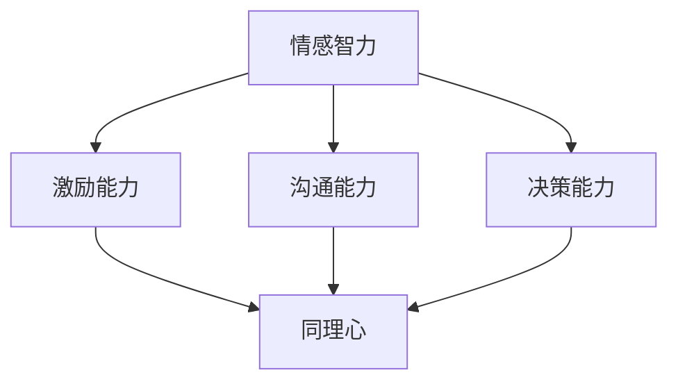

                 

### 文章标题：领导力与同理心：建立情感联系的重要性

**关键词：领导力、同理心、情感联系、团队建设、沟通技巧**

**摘要：本文探讨了领导力与同理心的关系，以及如何通过建立情感联系来提升领导力。文章首先定义了领导力与同理心的核心概念，随后阐述了它们在团队建设、沟通和决策中的应用，并通过案例分析提供了实践指导。**

---

## 引言

领导力是一种复杂的能力，它不仅涉及战略规划和决策，还涉及人际关系的处理。同理心作为情感智力的一部分，是领导者建立情感联系、增强团队凝聚力、提高沟通效率和做出更明智决策的关键因素。本文将从以下几个方面展开讨论：

1. 领导力的定义与特质
2. 同理心的重要性
3. 同理心在沟通与团队建设中的应用
4. 情感联系与领导力发展
5. 领导力与同理心的持续发展

通过一步步的分析和推理，我们将深入理解领导力与同理心的本质，并探讨如何在实践中运用这些概念来提升个人的领导能力。

---

## 第1章：领导力的定义与特质

### 1.1 领导力的定义

领导力是一种激发和引导他人实现目标的能力。它的核心在于影响力，而影响力可以通过多种方式实现，包括权威、魅力、感性和理性。领导力不仅仅与职位相关，更与个人素质和领导风格密切相关。

**起源：** 领导力这一概念最早可以追溯到古希腊哲学家亚里士多德的著作中。亚里士多德认为，领导力是一种基于品德和智慧的能力。

**定义演变：** 随着时间的推移，领导力的定义不断演变。传统的领导力理论强调权威和权力，而现代领导力理论则更加注重领导者与团队成员之间的互动和关系。

**基本要素：**
1. **影响力：** 领导者的核心在于其影响力，即能够引导和影响他人。
2. **目标导向：** 领导者需要明确团队的目标，并激励团队成员为实现这些目标而努力。
3. **沟通能力：** 领导者需要具备良好的沟通能力，以便有效地传达信息、解决问题和激励团队成员。
4. **决策能力：** 领导者需要能够做出明智的决策，并在面对不确定性时保持冷静和果断。

### 1.2 领导力的特质

**情感智力与领导力：** 情感智力是领导力的关键组成部分，它包括自我意识、自我调节、社交意识和同理心。领导者的高情感智力有助于建立信任、增强团队凝聚力和提高沟通效率。

**激励能力：** 领导者需要具备激励团队成员的能力，包括认可员工的贡献、设定合理的期望和提供成长机会。

**沟通能力：** 领导者需要能够有效地传达信息，包括倾听、表达和解释。

**决策能力：** 领导者需要能够做出明智的决策，并在面对不确定性时保持冷静和果断。

### 1.3 领导力与管理的区别

**定义：** 领导力是关于引领和激励他人，而管理则是关于组织和协调资源以实现目标。

**区别：** 领导力更侧重于个人素质和人际互动，而管理则更侧重于流程和制度。

**重要性：** 领导力是管理的基础，没有有效的领导力，管理将难以实施。

---

### Mermaid 流程图：领导力的核心特质与关系



---

## 第2章：同理心的重要性

### 2.1 同理心的定义与作用

**定义：** 同理心是指能够理解并感受他人情感的能力。它是情感智力的重要组成部分，对于建立情感联系和提升人际关系至关重要。

**作用：** 同理心在人际交往中具有重要作用，它可以帮助我们更好地理解他人、建立信任和增强团队合作。

### 2.2 同理心与情感智力

**情感智力：** 情感智力是指一个人理解、管理自己和他人的情感，以及使用情感信息来做出决策的能力。

**关系：** 同理心是情感智力的一部分，它与自我意识、自我调节和社交意识紧密相关。

### 2.3 培养同理心的重要性

**益处：** 培养同理心可以提升人际交往能力、增强团队合作和提升领导力。

**方法：** 培养同理心的方法包括自我反思、观察他人、设身处地和实践活动。

### 伪代码：同理心的培养步骤

```mermaid
function 培养同理心(个体) {
    输入：个体
    输出：增强的同理心能力
    
    1. 自我反思：个体识别并理解自己的情感
    2. 观察他人：个体通过观察和倾听他人，理解他人的情感
    3. 设身处地：个体通过模拟他人经历，培养对他人情感的理解
    4. 实践：个体通过实践活动，如角色扮演和模拟情境，加强同理心
    5. 反馈：个体获取反馈，调整和优化同理心培养方法
    
    return 增强的同理心能力
}
```

---

## 第3章：同理心在沟通中的应用

### 3.1 同理心沟通技巧

**有效倾听：** 有效倾听是同理心沟通技巧的核心。它要求领导者不仅仅是听到对方说的话，还要理解对方的情感和需求。

**非言语沟通：** 非言语沟通在同理心沟通中起着重要作用。领导者需要通过肢体语言、面部表情和语调来传递同理心。

**建立情感连接：** 建立情感连接可以增强团队合作和信任。领导者可以通过表达关心和支持来建立情感联系。

---

### 3.2 有效倾听

**倾听的层次：** 有效倾听可以分为三个层次：表面倾听、专注倾听和同理心倾听。

**倾听的障碍：** 倾听的障碍包括注意力分散、缺乏耐心和预先设定的观点。

**解决方法：** 解决倾听障碍的方法包括保持专注、提高耐心和开放心态。

---

### 3.3 情感表达的技巧

**表达情感的重要性：** 情感表达对于建立信任和增强团队合作至关重要。

**正面情感表达的技巧：** 包括表达感激、认可和鼓励。

**负面情感表达的技巧：** 包括以建设性和理解的方式表达不满和批评。

---

## 第4章：同理心在团队建设中的应用

### 4.1 建立信任的团队文化

**信任在团队中的作用：** 信任是团队合作的基础，它有助于提高团队效率、减少冲突和增强凝聚力。

**建立信任的团队文化：** 包括开放沟通、诚实和透明、互相尊重和认可。

---

### 4.2 多样性与包容性

**多样性的重要性：** 多样性可以带来新的观点和创新，有助于团队取得更好的成果。

**包容性的实践：** 包括尊重不同的观点、鼓励多样性思维和建立包容性的团队环境。

---

### 4.3 团队成员的情感支持

**情感支持的作用：** 情感支持可以增强团队成员的归属感和幸福感，提高团队的整体绩效。

**提供情感支持的方法：** 包括倾听、鼓励、提供反馈和庆祝成就。

---

## 第5章：同理心与决策

### 5.1 同理心在决策中的角色

**同理心在决策中的角色：** 同理心可以帮助领导者理解团队成员的需求和情感，从而做出更明智的决策。

**基于同理心的决策过程：** 基于同理心的决策过程包括理解团队成员的情感、考虑多种可能性并做出平衡的决策。

---

### 5.2 决策中的情感因素

**情感因素在决策中的重要性：** 情感因素可以影响决策的质量和团队成员的满意度。

**管理情感因素的方法：** 包括情感管理和情感智力培训。

---

## 第6章：情感联系与领导魅力

### 6.1 情感联系与领导力

**情感联系与领导力：** 情感联系是提升领导力的关键因素，它可以帮助领导者建立信任、增强团队凝聚力和提高沟通效率。

---

### 6.2 建立情感联系的方法

**建立情感联系的方法：** 包括倾听、关心、支持和认可。

---

### 6.3 提升领导魅力的策略

**提升领导魅力的策略：** 包括展现自信、传递正能量、提供清晰愿景和激励团队成员。

---

## 第7章：领导力与同理心的持续发展

### 7.1 领导力与同理心的自我评估

**自我评估的重要性：** 自我评估可以帮助领导者了解自己在领导力和同理心方面的优势和不足。

**评估方法：** 包括自我反思、360度反馈和领导力发展工具。

---

### 7.2 终身学习与持续发展

**终身学习的重要性：** 终身学习可以帮助领导者不断提升自己的领导力和同理心。

**持续发展的方法：** 包括参加培训、阅读相关书籍、参与实践和寻求反馈。

---

### 7.3 领导力与同理心的未来趋势

**未来趋势：** 随着人工智能和科技的发展，领导力和同理心的结合将成为未来领导力发展的关键。

**发展趋势：** 包括情感智能的培养、个性化领导力的发展和领导力的数字化转型。

---

## 附录

### 附录A：案例分析

**案例一：同理心在危机管理中的应用**

**案例二：领导力与同理心在跨国企业中的实践**

---

### 附录B：参考资料与进一步阅读

**参考资料：** 本文所引用的相关研究和文献。

**进一步阅读：** 推荐阅读的书籍、论文和网络资源。

---

## 结语

领导力与同理心是领导者成功的关键因素。通过建立情感联系，领导者可以增强团队凝聚力、提高沟通效率和做出更明智的决策。本文探讨了领导力与同理心的核心概念、应用和实践，希望对读者有所启发。在未来的领导力发展中，情感联系将继续发挥重要作用。

---

### 作者信息

**作者：** AI天才研究院/AI Genius Institute & 禅与计算机程序设计艺术 /Zen And The Art of Computer Programming

---

本文为原创内容，未经授权禁止转载。如需转载，请联系作者获取授权。版权所有，侵权必究。

