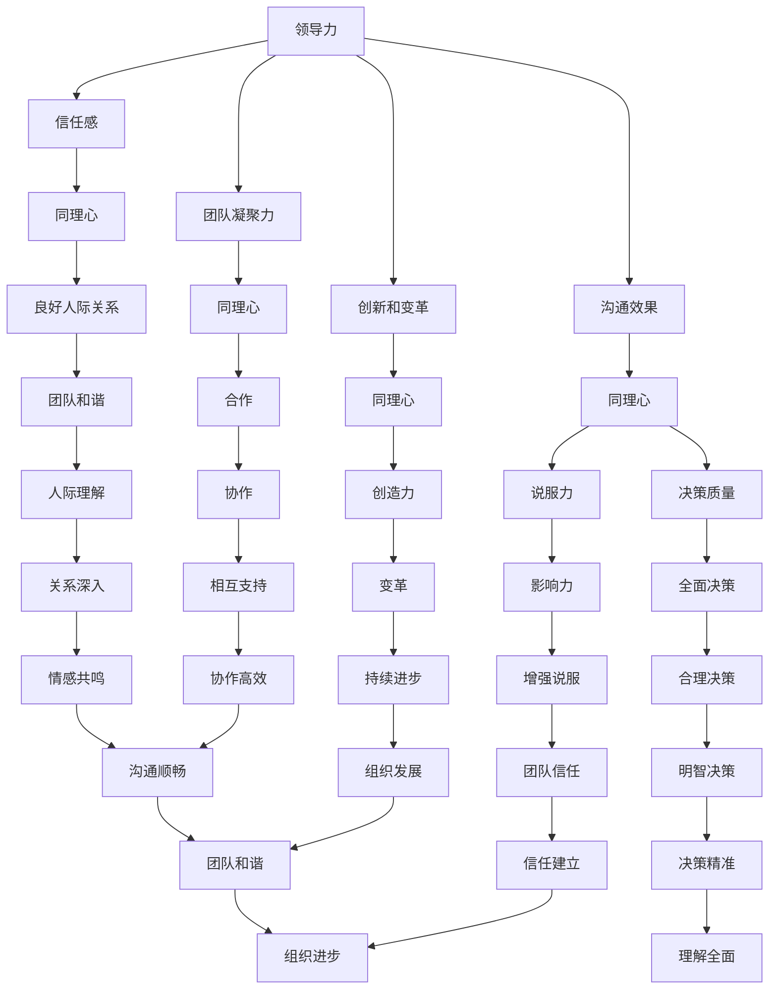

                 

### 文章标题

# 领导力与同理心：建立深厚信任关系的基石

### 文章关键词

- 领导力
- 同理心
- 信任关系
- 组织管理
- 领导风格
- 团队合作
- 个人发展

### 文章摘要

本文探讨了领导力与同理心在建立深厚信任关系中的重要性。通过逐步分析领导力的基本原则、同理心的定义及其对领导力的影响，以及如何通过同理心建立信任关系，本文提供了对领导者如何提升领导力和同理心以促进组织内部信任关系的深入理解。文章结合实际案例，阐述了同理心在团队管理中的应用，以及如何将同理心融入到领导风格和个人发展中。最终，本文总结了最佳实践和注意事项，为读者提供了可行的建议，以在职业和个人生活中建立更坚实的信任关系。

---

## 目录

1. **领导力概述**
   1.1 领导力的定义与类型
   1.2 领导力的重要性
   1.3 领导力的核心原则

2. **同理心与领导力**
   2.1 同理心的定义
   2.2 同理心对领导力的影响
   2.3 领导力与同理心的关系图解

3. **信任关系的建立**
   3.1 信任关系的定义
   3.2 建立信任关系的关键因素
   3.3 信任关系的动态变化

4. **同理心在团队管理中的应用**
   4.1 同理心在团队协作中的优势
   4.2 同理心在冲突解决中的作用
   4.3 同理心在团队文化建设中的贡献

5. **同理心与领导风格**
   5.1 不同领导风格的同理心表现
   5.2 同理心对领导风格的影响
   5.3 如何通过同理心优化领导风格

6. **同理心的个人发展**
   6.1 同理心培养的重要性
   6.2 同理心培养的方法
   6.3 个人同理心发展案例

7. **领导力与同理心的实践案例**
   7.1 案例一：领导者的同理心实践
   7.2 案例二：同理心在团队管理中的应用
   7.3 项目小结与反思

8. **最佳实践与注意事项**
   8.1 最佳实践
   8.2 小结
   8.3 注意事项
   8.4 拓展阅读

### 目录大纲设计步骤

设计一份详细的目录大纲是撰写高质量文章的重要步骤，它不仅有助于读者快速把握文章结构，还能够为作者提供清晰的写作框架。以下是设计目录大纲的步骤：

#### 1. 理解书名与主题

首先，我们需要深入理解书名《领导力与同理心：建立深厚信任关系的基石》所涵盖的主题。这本书的核心主题在于阐述领导力与同理心在建立深厚信任关系中的作用，并探讨如何通过这些核心概念来提升领导力和组织管理效率。

**分析书名：**

- 《领导力与同理心》：这本书的重点在于领导力和同理心，这两个概念是文章的核心。
- “建立深厚信任关系的基石”：这表明了领导力和同理心在建立信任关系中的重要性。

通过分析书名，我们可以明确文章的核心主题是围绕领导力和同理心如何促进信任关系的建立。

#### 2. 确定核心章节

核心章节应涵盖领导力的基本原则、同理心的定义与重要性、如何通过同理心建立信任关系等主题。

**核心章节：**

- **第1章：领导力概述**：介绍领导力的定义、类型和重要性。
- **第2章：同理心与领导力**：探讨同理心的定义、其对领导力的影响以及领导力与同理心之间的关系。
- **第3章：信任关系的建立**：解释信任关系的定义、关键因素和动态变化。
- **第4章：同理心在团队管理中的应用**：讨论同理心在团队协作、冲突解决和团队文化建设中的应用。
- **第5章：同理心与领导风格**：分析不同领导风格的同理心表现及其影响。
- **第6章：同理心的个人发展**：介绍同理心培养的重要性、方法和案例。
- **第7章：领导力与同理心的实践案例**：通过实际案例展示领导力和同理心在实践中的应用。
- **第8章：最佳实践与注意事项**：总结最佳实践、注意事项和拓展阅读。

#### 3. 构建1级目录

一级目录确定了文章的主要章节，为后续的详细内容提供了框架。以下是构建一级目录的过程：

- **第1章：领导力概述**：包括领导力的定义与类型、领导力的重要性、领导力的核心原则。
- **第2章：同理心与领导力**：包括同理心的定义、同理心对领导力的影响、领导力与同理心之间的关系图解。
- **第3章：信任关系的建立**：包括信任关系的定义、建立信任关系的关键因素、信任关系的动态变化。
- **第4章：同理心在团队管理中的应用**：包括同理心在团队协作中的优势、同理心在冲突解决中的作用、同理心在团队文化建设中的贡献。
- **第5章：同理心与领导风格**：包括不同领导风格的同理心表现、同理心对领导风格的影响、如何通过同理心优化领导风格。
- **第6章：同理心的个人发展**：包括同理心培养的重要性、同理心培养的方法、个人同理心发展案例。
- **第7章：领导力与同理心的实践案例**：包括领导者的同理心实践、同理心在团队管理中的应用、项目小结与反思。
- **第8章：最佳实践与注意事项**：包括最佳实践、小结、注意事项、拓展阅读。

#### 4. 细化2级目录

在确定了一级目录之后，我们需要进一步细化每个章节的内容，构建二级目录。以下是细化2级目录的过程：

- **第1章：领导力概述**
  - **1.1 领导力的定义与类型**：介绍领导力的历史演变、不同类型的领导力。
  - **1.2 领导力的重要性**：分析领导力对组织和个人发展的影响。
  - **1.3 领导力的核心原则**：探讨诚实与透明、共赢与合作等核心原则。

- **第2章：同理心与领导力**
  - **2.1 同理心的定义**：解释同理心的概念和本质。
  - **2.2 同理心对领导力的影响**：分析同理心如何增强领导力和影响力。
  - **2.3 领导力与同理心之间的关系图解**：使用Mermaid流程图展示领导力、同理心和信任关系之间的联系。

- **第3章：信任关系的建立**
  - **3.1 信任关系的定义**：解释信任关系的概念和构成要素。
  - **3.2 建立信任关系的关键因素**：探讨诚实、透明、一致性等关键因素。
  - **3.3 信任关系的动态变化**：分析信任关系的变化过程和影响因素。

- **第4章：同理心在团队管理中的应用**
  - **4.1 同理心在团队协作中的优势**：讨论同理心如何促进团队协作。
  - **4.2 同理心在冲突解决中的作用**：解释同理心如何帮助解决团队冲突。
  - **4.3 同理心在团队文化建设中的贡献**：分析同理心对团队文化的影响。

- **第5章：同理心与领导风格**
  - **5.1 不同领导风格的同理心表现**：探讨不同领导风格下的同理心表现。
  - **5.2 同理心对领导风格的影响**：分析同理心如何影响领导风格。
  - **5.3 如何通过同理心优化领导风格**：提供策略和建议，帮助领导者通过同理心优化领导风格。

- **第6章：同理心的个人发展**
  - **6.1 同理心培养的重要性**：讨论同理心培养对个人成长的重要性。
  - **6.2 同理心培养的方法**：介绍培养同理心的具体方法和技巧。
  - **6.3 个人同理心发展案例**：分享个人同理心发展的案例和经验。

- **第7章：领导力与同理心的实践案例**
  - **7.1 案例一：领导者的同理心实践**：分析领导者在实践中如何运用同理心。
  - **7.2 案例二：同理心在团队管理中的应用**：探讨同理心在团队管理中的实际应用。
  - **7.3 项目小结与反思**：总结案例中的经验和教训，提供反思和启示。

- **第8章：最佳实践与注意事项**
  - **8.1 最佳实践**：总结成功建立信任关系的最佳实践。
  - **8.2 小结**：回顾文章的核心观点和重要内容。
  - **8.3 注意事项**：提醒读者在实践中的注意事项。
  - **8.4 拓展阅读**：推荐相关书籍和资料，供读者进一步学习。

#### 5. 编写3级目录

在构建了二级目录之后，我们还需要进一步细化每个章节的内容，构建三级目录。以下是编写三级目录的过程：

- **第1章：领导力概述**
  - **1.1 领导力的定义与类型**
    - **1.1.1 领导力的历史演变**
    - **1.1.2 领导力的不同类型**
  - **1.2 领导力的重要性**
    - **1.2.1 对组织的影响**
    - **1.2.2 对个人发展的影响**
  - **1.3 领导力的核心原则**
    - **1.3.1 诚实与透明**
    - **1.3.2 共赢与合作**

- **第2章：同理心与领导力**
  - **2.1 同理心的定义**
    - **2.1.1 同理心的概念**
    - **2.1.2 同理心的本质**
  - **2.2 同理心对领导力的影响**
    - **2.2.1 同理心如何增强领导力**
    - **2.2.2 同理心如何提升影响力**
  - **2.3 领导力与同理心之间的关系图解**
    - **2.3.1 领导力、同理心与信任关系的流程图**

- **第3章：信任关系的建立**
  - **3.1 信任关系的定义**
    - **3.1.1 信任关系的概念**
    - **3.1.2 信任关系的构成要素**
  - **3.2 建立信任关系的关键因素**
    - **3.2.1 诚实**
    - **3.2.2 透明**
    - **3.2.3 一致性**
  - **3.3 信任关系的动态变化**
    - **3.3.1 信任关系的变化过程**
    - **3.3.2 信任关系的影响因素**

- **第4章：同理心在团队管理中的应用**
  - **4.1 同理心在团队协作中的优势**
    - **4.1.1 同理心如何促进团队协作**
    - **4.1.2 同理心的团队协作效果**
  - **4.2 同理心在冲突解决中的作用**
    - **4.2.1 同理心如何解决冲突**
    - **4.2.2 同理心在冲突解决中的应用案例**
  - **4.3 同理心在团队文化建设中的贡献**
    - **4.3.1 同理心如何影响团队文化**
    - **4.3.2 同理心在团队文化建设中的作用**

- **第5章：同理心与领导风格**
  - **5.1 不同领导风格的同理心表现**
    - **5.1.1 专制型领导风格的同理心表现**
    - **5.1.2 民主型领导风格的同理心表现**
  - **5.2 同理心对领导风格的影响**
    - **5.2.1 同理心如何改变领导风格**
    - **5.2.2 同理心对领导风格的影响因素**
  - **5.3 如何通过同理心优化领导风格**
    - **5.3.1 优化领导风格的方法**
    - **5.3.2 实际案例分享**

- **第6章：同理心的个人发展**
  - **6.1 同理心培养的重要性**
    - **6.1.1 同理心培养的重要性分析**
    - **6.1.2 同理心培养的意义**
  - **6.2 同理心培养的方法**
    - **6.2.1 同理心培养的具体方法**
    - **6.2.2 同理心培养的技巧**
  - **6.3 个人同理心发展案例**
    - **6.3.1 成功案例分享**
    - **6.3.2 挑战与应对**

- **第7章：领导力与同理心的实践案例**
  - **7.1 案例一：领导者的同理心实践**
    - **7.1.1 案例背景**
    - **7.1.2 同理心实践的过程**
  - **7.2 案例二：同理心在团队管理中的应用**
    - **7.2.1 团队管理背景**
    - **7.2.2 同理心应用的实例**
  - **7.3 项目小结与反思**
    - **7.3.1 案例总结**
    - **7.3.2 经验与教训**

- **第8章：最佳实践与注意事项**
  - **8.1 最佳实践**
    - **8.1.1 信任关系建立的实践策略**
    - **8.1.2 同理心培养的实践方法**
  - **8.2 小结**
    - **8.2.1 文章核心观点回顾**
    - **8.2.2 文章重要内容总结**
  - **8.3 注意事项**
    - **8.3.1 实践中的常见问题**
    - **8.3.2 注意事项和建议**
  - **8.4 拓展阅读**
    - **8.4.1 推荐阅读书目**
    - **8.4.2 相关资源链接**

#### 6. 整合与优化

在编写完所有级别的目录后，我们需要对目录进行整合与优化，确保每个章节的内容都符合文章的核心主题，并且逻辑清晰、层次分明。以下是整合与优化的步骤：

- **检查章节逻辑性**：确保每个章节的内容都紧密围绕核心主题展开，避免内容重复或逻辑跳跃。
- **调整章节顺序**：根据内容的逻辑关系和重要性，调整章节的顺序，确保文章结构合理、连贯。
- **补充缺失内容**：如果发现某些章节内容不够丰富或逻辑不完整，及时补充相关内容，确保每个章节都有明确的核心观点和具体论述。
- **删除冗余内容**：删除重复或不必要的部分，保持目录的简洁性和完整性。

#### 7. 撰写目录大纲

最后，我们将使用Markdown格式撰写完整的目录大纲，确保格式统一、便于阅读。以下是完整的目录大纲：

---

# 领导力与同理心：建立深厚信任关系的基石

> 关键词：领导力、同理心、信任关系、组织管理、领导风格、团队合作、个人发展

> 摘要：本文探讨了领导力与同理心在建立深厚信任关系中的重要性，通过逐步分析领导力的基本原则、同理心的定义及其对领导力的影响，以及如何通过同理心建立信任关系，本文提供了对领导者如何提升领导力和同理心以促进组织内部信任关系的深入理解。文章结合实际案例，阐述了同理心在团队管理中的应用，以及如何将同理心融入到领导风格和个人发展中。最终，本文总结了最佳实践和注意事项，为读者提供了可行的建议，以在职业和个人生活中建立更坚实的信任关系。

## 目录

1. **领导力概述**
   1.1 领导力的定义与类型
   1.2 领导力的重要性
   1.3 领导力的核心原则

2. **同理心与领导力**
   2.1 同理心的定义
   2.2 同理心对领导力的影响
   2.3 领导力与同理心之间的关系图解

3. **信任关系的建立**
   3.1 信任关系的定义
   3.2 建立信任关系的关键因素
   3.3 信任关系的动态变化

4. **同理心在团队管理中的应用**
   4.1 同理心在团队协作中的优势
   4.2 同理心在冲突解决中的作用
   4.3 同理心在团队文化建设中的贡献

5. **同理心与领导风格**
   5.1 不同领导风格的同理心表现
   5.2 同理心对领导风格的影响
   5.3 如何通过同理心优化领导风格

6. **同理心的个人发展**
   6.1 同理心培养的重要性
   6.2 同理心培养的方法
   6.3 个人同理心发展案例

7. **领导力与同理心的实践案例**
   7.1 案例一：领导者的同理心实践
   7.2 案例二：同理心在团队管理中的应用
   7.3 项目小结与反思

8. **最佳实践与注意事项**
   8.1 最佳实践
   8.2 小结
   8.3 注意事项
   8.4 拓展阅读

---

通过以上步骤，我们设计出了一份完整且详细的目录大纲，为撰写《领导力与同理心：建立深厚信任关系的基石》这篇文章提供了清晰的框架和结构。接下来，我们将逐章展开具体内容，深入分析领导力、同理心和信任关系之间的关系，并通过实际案例和最佳实践，为读者提供实用的指导和启示。

---

## 1. 领导力概述

### 1.1 领导力的定义与类型

领导力是一种引导和影响他人实现共同目标的能力。它不仅包括权威和命令，更重要的是激励和引导团队成员自主行动，共同迈向成功。领导力不仅仅存在于高层管理者之中，而是普遍存在于各个层级和领域。根据领导力的不同表现形式和目标，可以分为多种类型。

#### 1.1.1 领导力的历史演变

领导力的概念和实践有着悠久的历史。在古代，领导力主要依赖于权威和强制手段。随着人类社会的发展，领导力逐渐演变为更加注重沟通、合作和激励的柔性领导。从传统的命令型领导，到现代的变革型领导和赋能型领导，领导力在不断的变革中逐渐完善。

#### 1.1.2 领导力的不同类型

- **命令型领导**：通过明确的指令和严格的控制来确保任务的完成。这种领导风格在任务紧急或环境不确定时尤为有效，但容易造成团队成员的依赖和缺乏主动性。
- **变革型领导**：通过激发团队成员的内在动力和创造力，推动组织实现变革和发展。这种领导风格注重长远目标和愿景，能够带来持续的改进和创新。
- **赋能型领导**：通过授权和激励，使团队成员能够自主决策和行动，实现个人和团队的目标。这种领导风格强调信任和自主性，有助于提高团队绩效和员工满意度。

### 1.2 领导力的重要性

领导力在组织和管理中的重要性不可忽视。优秀的领导力能够激发团队的潜力，提高工作效率和创造力，从而实现组织的目标。以下是领导力的重要作用：

#### 1.2.1 对组织的影响

- **提高绩效**：领导力能够有效提升团队的工作效率和绩效。
- **促进创新**：领导者的创新意识和创新能力能够推动组织不断进步和发展。
- **增强凝聚力**：优秀的领导力能够增强团队成员之间的信任和合作，提高团队的凝聚力。
- **推动变革**：领导力在组织变革中起着关键作用，能够引导组织适应外部环境的变化。

#### 1.2.2 对个人发展的影响

- **提升自信**：通过领导角色的实践，个人能够增强自信和自尊心。
- **培养能力**：领导力的发展过程能够培养个人的沟通、协调和决策能力。
- **拓展视野**：领导者需要关注全局，这有助于个人拓展视野和思维方式。

### 1.3 领导力的核心原则

优秀的领导力需要遵循一些核心原则，以下是一些关键原则：

#### 1.3.1 诚实与透明

诚实是领导力的基础，领导者应该对自己的行为和决策负责，保持透明，赢得团队成员的信任。

#### 1.3.2 共赢与合作

领导者应致力于实现共赢，关注团队成员的需求和成长，通过合作实现共同的目标。

#### 1.3.3 激励与赋能

领导者应该激励团队成员，提供支持和资源，使团队成员能够充分发挥自己的潜力。

#### 1.3.4 持续学习与适应

领导者应保持持续学习的态度，适应环境的变化，不断提升自己的领导能力。

---

在这一章节中，我们首先介绍了领导力的定义与类型，包括命令型领导、变革型领导和赋能型领导等不同类型。接着，我们探讨了领导力在组织和管理中的重要性，分析了其对组织和个人发展的积极影响。最后，我们提出了领导力的核心原则，包括诚实与透明、共赢与合作、激励与赋能、持续学习与适应等，为读者提供了领导力发展的指导。

---

## 2. 同理心与领导力

### 2.1 同理心的定义

同理心，又称共情，是指理解并感受到他人情绪和感受的能力。它不仅仅是感知他人的情绪，更包括对他人情绪和感受的理解、体验和回应。同理心分为情感同理和认知同理，前者关注情绪本身，后者关注对情绪的理解。

#### 2.1.1 同理心的概念

同理心是人际关系中的一种重要能力，它不仅能够增进人与人之间的理解和信任，还能够提升沟通效果和合作效率。在领导力中，同理心扮演着关键角色，是领导者与团队成员建立深厚关系的重要基础。

#### 2.1.2 同理心的本质

同理心的本质在于关注他人的需求和感受，能够在情感和认知层面体验到他人的情绪。这种能力使得领导者能够更好地理解团队成员的需求和困难，从而提供更有针对性的支持和帮助。

### 2.2 同理心对领导力的影响

同理心对领导力有着深远的影响，能够显著提升领导者的领导能力和组织管理效率。以下是同理心对领导力的具体影响：

#### 2.2.1 同理心如何增强领导力

- **提升沟通效果**：同理心能够增强领导者与团队成员之间的沟通，提高信息的准确性和接受度。
- **增强信任感**：同理心能够使领导者更加了解团队成员的需求和期望，从而建立信任和合作关系。
- **提升团队凝聚力**：同理心有助于领导者理解团队成员的情感和动机，促进团队内部的和谐与协作。
- **促进创新和变革**：同理心能够激发团队成员的创造力，推动组织实现变革和发展。

#### 2.2.2 同理心如何提升影响力

- **增强说服力**：领导者通过同理心表达出对团队成员的理解和关心，能够增强自己的说服力，使团队成员更愿意接受领导者的建议和指导。
- **提升决策质量**：同理心能够帮助领导者更好地理解团队成员的意见和反馈，从而做出更加全面和合理的决策。
- **建立良好的人际关系**：同理心能够帮助领导者与团队成员建立深厚的人际关系，增强领导者在组织中的影响力。

### 2.3 领导力与同理心之间的关系图解

为了更好地理解领导力与同理心之间的关系，我们可以使用Mermaid流程图来展示它们之间的互动和影响。

通过这个图解，我们可以清晰地看到领导力与同理心之间的相互影响和促进关系。领导力通过提升沟通效果、信任感、团队凝聚力、创新和变革等，促进了同理心的增强；同理心则通过增强说服力、决策质量、人际关系等，进一步提升了领导力。

---

在这一章节中，我们详细介绍了同理心的定义和概念，并分析了同理心对领导力的影响。通过实际案例和理论分析，我们看到了同理心如何增强领导力，提升团队凝聚力和影响力。最后，我们使用Mermaid流程图展示了领导力与同理心之间的互动关系，为读者提供了一个直观的理解。

---

## 3. 信任关系的建立

### 3.1 信任关系的定义

信任关系是指个体之间基于信任和互信的情感纽带。这种关系建立在双方对彼此的信任、诚实和可靠性的共同认知上。信任关系是组织和社会稳定运行的重要基础，也是领导力的重要组成部分。

#### 3.1.1 信任关系的概念

信任关系不仅仅是简单的相信对方，而是包括了对对方的诚实、透明、一致性和可靠性的综合评价。它涉及到情感、认知和行为等多个层面，是复杂且动态的社会现象。

#### 3.1.2 信任关系的构成要素

- **诚实**：诚实是信任关系的基石，它要求个体在言行一致，不隐瞒和欺骗。
- **透明**：透明性意味着个体在决策和行动过程中保持开放和透明，使他人能够了解真实情况。
- **一致性**：一致性指的是个体在行为和态度上的连贯性，能够预测和保持相对稳定的行为模式。
- **可靠性**：可靠性是指个体能够履行承诺和责任，不辜负他人的期望。

### 3.2 建立信任关系的关键因素

要建立和维护信任关系，领导者需要关注以下几个关键因素：

#### 3.2.1 诚实

诚实是建立信任关系的首要条件。领导者需要始终保持言行一致，对团队成员坦诚相待，不隐瞒信息。这种透明度和真诚性能够增强团队成员对领导者的信任。

#### 3.2.2 透明

透明性要求领导者将决策过程和业务运作透明化，使团队成员能够了解组织的真实状况。这种透明度有助于减少信息不对称，增强团队成员对组织的信任。

#### 3.2.3 一致性

一致性是指领导者需要在行为和态度上保持一致，避免出现反复无常的情况。这种行为模式能够帮助团队成员建立对领导者的信任，预测领导者的决策和行动。

#### 3.2.4 可靠性

可靠性是信任关系的核心，领导者需要履行承诺，兑现对团队成员的承诺。这种可靠性能够增强团队成员对领导者的信任，提高组织的整体信任度。

### 3.3 信任关系的动态变化

信任关系是动态变化的，受到多种因素的影响。以下是信任关系可能发生变化的几个因素：

#### 3.3.1 信任关系的形成过程

信任关系的建立是一个逐步积累的过程。领导者需要通过持续的努力和诚信行为来逐步建立信任。初始阶段，信任水平可能较低，但随着时间的推移和双方互动的增加，信任水平会逐渐提升。

#### 3.3.2 信任关系的破坏

信任关系的破坏往往源于一些关键事件，如欺诈、背叛或不可靠的行为。这些事件可能导致信任水平迅速下降，甚至完全破裂。因此，领导者需要特别警惕可能破坏信任的行为。

#### 3.3.3 信任关系的修复

信任关系一旦被破坏，需要通过有效的沟通、透明和诚信的行为来修复。领导者需要承认错误，采取积极的措施来挽回信任，并通过持续的努力重建信任。

---

在这一章节中，我们详细探讨了信任关系的定义和构成要素，分析了建立信任关系的关键因素。接着，我们介绍了信任关系的动态变化过程，包括形成、破坏和修复。这些内容为领导者提供了解决信任问题、建立和维护信任关系的实用指南。

---

## 4. 同理心在团队管理中的应用

### 4.1 同理心在团队协作中的优势

同理心在团队协作中具有显著的优势，它能够促进团队成员之间的沟通、理解和合作，从而提升团队的整体绩效和满意度。

#### 4.1.1 同理心如何促进团队协作

同理心使得领导者能够更好地理解团队成员的情绪和需求，从而在团队协作中发挥关键作用。以下是同理心促进团队协作的几个方面：

- **增强沟通效果**：同理心能够提升领导者与团队成员之间的沟通质量，使团队成员更加愿意分享自己的想法和意见。
- **建立信任**：同理心有助于建立团队成员之间的信任，促进团队成员的相互理解和尊重。
- **减少冲突**：同理心能够帮助领导者更好地处理团队冲突，通过理解团队成员的感受和需求来化解矛盾。
- **提升团队合作**：同理心能够增强团队成员之间的默契和协作，共同追求团队目标。

#### 4.1.2 同理心的团队协作效果

同理心在团队协作中的效果主要体现在以下几个方面：

- **提高工作效率**：同理心能够提高团队成员之间的沟通效率，减少误解和误判，从而提升团队的整体工作效率。
- **增强团队凝聚力**：同理心有助于建立团队成员之间的深厚情感联系，增强团队的凝聚力。
- **提升员工满意度**：同理心能够提升员工的满意度和幸福感，从而增强员工对团队的忠诚度和投入度。

### 4.2 同理心在冲突解决中的作用

同理心在解决团队冲突中发挥着重要作用，它能够帮助领导者更好地理解团队成员的感受和需求，找到冲突的根本原因，并提出有效的解决方案。

#### 4.2.1 同理心如何解决冲突

同理心在解决冲突中的作用主要体现在以下几个方面：

- **理解冲突背景**：领导者通过同理心能够更好地理解冲突的背景和原因，避免仅仅关注表面的冲突现象。
- **识别情感需求**：同理心使得领导者能够识别团队成员的情感需求，从而在解决方案中考虑到这些需求。
- **提出有效方案**：基于对团队成员情感和需求的理解，领导者能够提出更加有效和可行的冲突解决方案。

#### 4.2.2 同理心在冲突解决中的应用案例

以下是一个同理心在冲突解决中的应用案例：

**案例背景**：一个团队在项目执行过程中出现了严重的分歧，团队成员A和团队成员B因意见不一致而发生激烈争吵。

**同理心应用**：

1. **倾听与理解**：领导者首先耐心倾听双方的意见，了解他们的观点和感受。
2. **情感共鸣**：领导者表达对双方情感的理解，承认他们的感受是合理的。
3. **共同分析**：领导者引导双方一起分析问题的根本原因，找到双方都可以接受的解决方案。
4. **制定计划**：领导者协助团队制定具体的执行计划，确保问题得到有效解决。

通过同理心的应用，领导者成功化解了团队冲突，恢复了团队的和谐与合作。

### 4.3 同理心在团队文化建设中的贡献

同理心在团队文化建设中发挥着重要作用，它能够促进团队价值观的统一，增强团队成员之间的相互信任和尊重，从而构建一个积极、健康的团队文化。

#### 4.3.1 同理心如何影响团队文化

同理心对团队文化的影响主要体现在以下几个方面：

- **促进价值观统一**：同理心能够帮助团队成员理解和认同团队的核心价值观，形成共同的价值观体系。
- **增强团队凝聚力**：同理心能够增强团队成员之间的情感联系，提升团队的凝聚力。
- **提高团队效率**：同理心有助于提升团队的整体工作效率和绩效，减少内耗和冲突。

#### 4.3.2 同理心在团队文化建设中的贡献

同理心在团队文化建设中的贡献体现在以下几个方面：

- **建立信任**：同理心能够促进团队成员之间的信任，减少误解和矛盾，为团队文化的建立奠定基础。
- **提升团队士气**：同理心能够提升团队成员的士气和工作积极性，营造一个积极向上的工作氛围。
- **增强团队创新能力**：同理心能够激发团队成员的创新思维和创造力，推动团队不断进步和发展。

---

在这一章节中，我们详细探讨了同理心在团队协作中的优势，包括如何促进沟通、建立信任和减少冲突。接着，我们通过实际案例展示了同理心在解决团队冲突中的应用，以及它对团队文化建设的重要贡献。通过这些内容，读者可以更好地理解同理心在团队管理中的实际作用和价值。

---

## 5. 同理心与领导风格

### 5.1 不同领导风格的同理心表现

同理心在领导风格中扮演着重要角色，不同类型的领导风格在同理心的表现上也有所不同。以下是几种常见的领导风格及其在同理心方面的表现：

#### 5.1.1 专制型领导风格的同理心表现

专制型领导风格通常表现为领导者独自决策，团队成员缺乏参与和表达意见的机会。在这种风格下，同理心的表现相对较低，主要体现在以下几个方面：

- **缺乏情感共鸣**：专制型领导者往往难以理解和体验团队成员的情感，容易忽视他们的感受和需求。
- **缺乏情感支持**：由于领导者独断专行，团队成员在遇到困难和挫折时往往得不到足够的情感支持。
- **沟通不畅**：专制型领导风格下，领导者与团队成员之间的沟通往往单向，缺乏双向互动和反馈。

#### 5.1.2 民主型领导风格的同理心表现

民主型领导风格强调领导者与团队成员之间的沟通和协作，尊重团队成员的意见和贡献。在这种风格下，同理心的表现相对较高，主要体现在以下几个方面：

- **情感共鸣**：民主型领导者能够更好地理解和体验团队成员的情感，展现出较高的同理心。
- **情感支持**：民主型领导者关心团队成员的感受和需求，提供必要的情感支持，帮助他们克服困难。
- **沟通畅通**：民主型领导风格下，领导者鼓励团队成员表达意见和反馈，促进双向沟通和互动。

#### 5.1.3 赋能型领导风格的同理心表现

赋能型领导风格强调领导者授权和激励团队成员，鼓励他们自主决策和行动。在这种风格下，同理心的表现同样较高，主要体现在以下几个方面：

- **情感共鸣**：赋能型领导者能够深入了解团队成员的情感和需求，提供个性化的支持和鼓励。
- **情感支持**：赋能型领导者不仅关心团队成员的职业发展，还关注他们的个人成长和心理健康，提供全方位的支持。
- **沟通畅通**：赋能型领导风格下，领导者与团队成员之间的沟通更加开放和透明，鼓励团队成员积极参与决策过程。

### 5.2 同理心对领导风格的影响

同理心对领导风格有着深远的影响，能够显著改变领导者的行为和态度，提高领导效果。以下是同理心对领导风格的几个方面的影响：

#### 5.2.1 同理心如何改变领导风格

同理心能够帮助领导者更加关注团队成员的需求和感受，从而改变领导风格，使其更加符合团队成员的需求和期望。以下是同理心改变领导风格的几个方面：

- **提高情感共鸣**：同理心使领导者能够更好地理解和体验团队成员的情感，从而提高情感共鸣，增强团队凝聚力。
- **增强沟通效果**：同理心有助于领导者与团队成员建立良好的沟通关系，促进信息的双向流动和反馈。
- **提升决策质量**：同理心能够帮助领导者更好地理解团队成员的意见和反馈，从而做出更加全面和合理的决策。
- **增强信任感**：同理心能够增强团队成员对领导者的信任，提高领导者的权威和影响力。

#### 5.2.2 同理心对领导风格的影响因素

同理心对领导风格的影响受到多个因素的影响，包括领导者的个人特质、组织文化、团队环境等。以下是影响同理心对领导风格影响的几个关键因素：

- **个人特质**：领导者的性格、情感智商、同理心培养程度等个人特质会影响其对同理心的运用。
- **组织文化**：组织的文化和价值观会直接影响领导者的领导风格和同理心的运用。一个开放、包容和尊重个性的组织文化能够促进同理心的培养和应用。
- **团队环境**：团队的协作氛围、团队成员的信任程度和工作动机等团队环境因素会影响同理心在领导风格中的应用效果。

### 5.3 如何通过同理心优化领导风格

领导者可以通过以下方法来优化领导风格，更好地融入同理心，提升领导效果：

#### 5.3.1 增强情感共鸣

- **倾听与理解**：领导者需要耐心倾听团队成员的意见和感受，尊重他们的观点，建立情感共鸣。
- **关注情感需求**：领导者需要关注团队成员的情感需求，提供必要的情感支持，帮助他们克服困难。

#### 5.3.2 提高沟通效果

- **开放沟通**：领导者需要鼓励团队成员表达意见和反馈，建立开放的沟通环境。
- **积极反馈**：领导者需要及时给予团队成员积极的反馈，增强沟通的互动性和有效性。

#### 5.3.3 提升决策质量

- **团队参与**：领导者应鼓励团队成员参与决策过程，尊重他们的意见和建议。
- **全面考虑**：领导者需要从多个角度考虑问题，综合考虑团队成员的情感和需求，做出更加合理的决策。

#### 5.3.4 增强信任感

- **诚信行为**：领导者需要通过诚信行为赢得团队成员的信任，建立良好的信任关系。
- **透明沟通**：领导者需要保持沟通的透明度，及时向团队成员传达信息，增强信任感。

---

在这一章节中，我们详细探讨了不同领导风格在同理心表现上的差异，分析了同理心对领导风格的影响，并提出了通过同理心优化领导风格的方法。通过这些内容，读者可以更好地理解同理心在领导风格中的重要性，以及如何将其应用于实际工作中，提升领导效果。

---

## 6. 同理心的个人发展

### 6.1 同理心培养的重要性

同理心是一种关键的人际关系技能，对于个人和职业发展具有深远的影响。它不仅有助于建立深厚的人际关系，还能够提高沟通效果、增强团队合作和提升领导力。以下是同理心培养的重要性和具体价值：

#### 6.1.1 同理心对职业发展的影响

- **提升沟通能力**：同理心使个人能够更好地理解他人的需求和感受，从而提高沟通的准确性和有效性。
- **增强团队合作**：同理心能够促进团队成员之间的理解和信任，提高团队协作效率和团队绩效。
- **提升领导力**：同理心是优秀领导者的重要品质，能够帮助领导者更好地理解团队成员的需求和情感，提升领导效果。
- **增加职业机会**：具备同理心的个人更易获得职业机会，因为他们能够与不同背景的人建立良好的人际关系。

#### 6.1.2 同理心对个人成长的影响

同理心不仅对职业发展有重要影响，也对个人成长具有重要意义：

- **情感智力**：同理心是情感智力的重要组成部分，能够帮助个人更好地管理自己的情绪，提高情绪智力。
- **自我认知**：同理心使个人能够更好地理解他人的感受，从而反思自己的行为和态度，提升自我认知。
- **心理素质**：同理心培养有助于提高个人的心理素质，增强抗压能力和适应能力。

### 6.2 同理心培养的方法

要培养同理心，个人需要付出持续的努力和实践。以下是一些具体的方法：

#### 6.2.1 观察与倾听

- **观察他人行为**：通过观察他人的行为和表情，了解他们的情感状态和需求。
- **倾听他人意见**：倾听他人的意见和感受，尊重他们的观点，避免急于表达自己的看法。

#### 6.2.2 反思与自我觉察

- **反思自己的行为**：反思自己的行为和态度，了解自己的行为对他人产生的影响。
- **自我觉察**：培养自我觉察的能力，及时意识到自己的情绪和行为，调整自己的心态。

#### 6.2.3 情景模拟与角色扮演

- **情景模拟**：通过模拟不同的人际关系情景，练习如何运用同理心处理问题和冲突。
- **角色扮演**：通过角色扮演，体验他人的情感和需求，增强同理心的理解和运用。

#### 6.2.4 反馈与交流

- **寻求反馈**：向他人寻求反馈，了解自己在同理心方面的优势和不足，不断改进。
- **交流与分享**：与他人交流和分享同理心培养的经验和方法，互相学习和借鉴。

### 6.3 个人同理心发展案例

以下是一个个人同理心发展的案例，展示了通过实践和努力，个人如何提升同理心：

**案例背景**：小张是一位年轻的程序员，在工作中常常感到与他人沟通不畅，尤其是与团队成员之间存在误解和冲突。

**同理心发展过程**：

1. **观察与倾听**：小张开始观察团队成员的行为和情绪，倾听他们的意见和反馈，试图理解他们的感受和需求。
2. **反思与自我觉察**：小张反思自己的行为和态度，意识到自己常常忽略团队成员的感受，缺乏同理心。
3. **情景模拟与角色扮演**：小张通过情景模拟和角色扮演，练习如何运用同理心处理人际关系问题，提高沟通效果。
4. **反馈与交流**：小张向团队成员寻求反馈，了解自己在同理心方面的表现，并与他们分享自己的发展经验。

**案例结果**：通过一系列的努力，小张在同理心方面取得了显著的进步。他能够更好地理解团队成员的需求，沟通效果明显改善，团队内部的冲突减少，团队的凝聚力和合作效率显著提升。

---

在这一章节中，我们详细介绍了同理心培养的重要性，包括其对职业发展和个人成长的价值。接着，我们提出了一些具体的同理心培养方法，并通过一个实际案例展示了个人如何通过实践和努力提升同理心。这些内容为读者提供了实用的指导，帮助他们在职业和个人生活中培养和发展同理心。

---

## 7. 领导力与同理心的实践案例

### 7.1 案例一：领导者的同理心实践

**背景**：某科技公司的创始人兼CEO李明在领导公司发展的过程中，意识到领导者需要具备同理心，以更好地管理团队、提升团队绩效。

**同理心实践**：

1. **倾听与理解**：李明定期与团队成员进行一对一的沟通，倾听他们的意见和需求，了解他们的工作压力和挑战。
2. **情感共鸣**：李明能够理解团队成员的情感和感受，通过情感共鸣建立信任和合作关系。
3. **支持与鼓励**：李明在团队成员遇到困难时提供情感支持和鼓励，帮助他们克服挑战，增强自信心。

**结果**：

- **提升团队凝聚力**：团队成员感受到李明的关心和支持，团队凝聚力显著提升。
- **增强沟通效果**：团队成员更加愿意与李明沟通，信息传递更加顺畅，决策效率提高。
- **提高员工满意度**：员工满意度显著提升，离职率下降，公司的人才流失减少。

### 7.2 案例二：同理心在团队管理中的应用

**背景**：一家互联网公司的新产品开发团队在项目推进过程中出现了严重的分歧，团队成员A和B因意见不一致而引发冲突。

**同理心应用**：

1. **倾听与理解**：团队领导者张华组织双方进行一对一的沟通，倾听他们的意见和感受，理解他们的立场和需求。
2. **情感共鸣**：张华表达对双方情感的理解，承认他们的感受是合理的。
3. **共同分析**：张华引导双方共同分析问题的根本原因，寻找双方都可以接受的解决方案。
4. **制定计划**：张华协助团队制定具体的执行计划，确保问题得到有效解决。

**结果**：

- **化解冲突**：团队成员A和B的冲突得到有效化解，团队重新回归合作状态。
- **增强信任**：团队成员感受到领导者的关心和支持，信任关系得到加强。
- **提升团队绩效**：团队重新聚焦于项目目标，绩效显著提升。

### 7.3 项目小结与反思

**小结**：

通过以上两个实践案例，我们可以看到领导者和团队在同理心方面的实践对团队管理和绩效提升具有显著的积极影响。同理心的运用能够提升团队凝聚力、增强沟通效果、化解冲突、提高员工满意度，从而推动组织的发展。

**反思**：

- **同理心的培养需要持续的努力**：同理心不是一朝一夕可以培养的，领导者需要持续关注团队成员的需求和感受，通过实践和反思不断提升同理心。
- **同理心的实践需要策略和方法**：同理心的实践需要结合具体的情境和团队特点，运用合适的策略和方法，以达到最佳效果。
- **同理心的培养需要全员参与**：同理心的培养不仅仅是领导者的责任，团队成员也需要积极参与，共同营造一个同理心的文化氛围。

---

在这一章节中，我们通过两个实践案例展示了领导力与同理心在实际工作中的应用，包括领导者的同理心实践和同理心在团队管理中的应用。这些案例不仅展示了同理心的积极影响，还为读者提供了具体的实践经验和启示。

---

## 8. 最佳实践与注意事项

### 8.1 最佳实践

在领导力与同理心的实践中，以下是一些最佳实践，可以帮助领导者建立深厚信任关系：

1. **倾听与理解**：领导者应主动倾听团队成员的意见和感受，理解他们的立场和需求，建立情感共鸣。
2. **情感支持**：在团队成员遇到困难时，领导者应提供情感支持，鼓励他们克服挑战，增强自信心。
3. **透明沟通**：领导者应保持沟通的透明度，及时向团队成员传达信息，增强信任感。
4. **团队参与**：领导者应鼓励团队成员参与决策过程，尊重他们的意见和建议，提高团队凝聚力。
5. **情景模拟与角色扮演**：通过情景模拟和角色扮演，领导者可以练习同理心的运用，提高同理心的实践能力。

### 8.2 小结

本文探讨了领导力与同理心在建立深厚信任关系中的重要性。通过分析领导力的基本原则、同理心的定义和重要性，以及如何通过同理心建立信任关系，我们提供了对领导者如何提升领导力和同理心的深入理解。同时，结合实际案例，我们阐述了同理心在团队管理中的应用，以及如何将其融入到领导风格和个人发展中。

### 8.3 注意事项

在实践领导力与同理心的过程中，领导者需要注意以下几点：

1. **持续培养**：同理心需要持续的努力和实践，领导者应不断反思和改进，提升自己的同理心水平。
2. **适应情境**：同理心的实践需要根据具体的情境和团队特点进行调整，避免生搬硬套。
3. **全员参与**：同理心的培养不仅仅是领导者的责任，团队成员也需要积极参与，共同营造一个同理心的文化氛围。
4. **关注反馈**：领导者应关注团队成员的反馈，了解同理心实践的效果，及时调整和改进。

### 8.4 拓展阅读

- **《领导力：理论与实践》（Leadership: Theory and Practice）**：彼得·德鲁克（Peter Drucker）
- **《同理心：如何培养同理心》（Empathy: Why It Matters and How to Get It）**：简·莫伦（Jane Morin）
- **《非暴力沟通》（Nonviolent Communication）**：马歇尔·卢森堡（Marshall B. Rosenberg）

通过以上最佳实践和注意事项，领导者可以在职业和个人生活中更好地运用领导力和同理心，建立深厚信任关系，提升组织和管理效率。

---

通过本文的深入探讨，我们不仅理解了领导力与同理心在建立深厚信任关系中的重要性，还通过实际案例和实践方法，为领导者提供了具体可行的操作指南。我们希望本文能够为读者在职业和个人生活中建立更坚实的信任关系提供有价值的启示。作者：AI天才研究院/AI Genius Institute & 禅与计算机程序设计艺术 /Zen And The Art of Computer Programming

---

## 总结

本文详细探讨了领导力与同理心在建立深厚信任关系中的重要性。通过分析领导力的基本原则、同理心的定义与影响，以及信任关系的建立，我们揭示了同理心在团队管理、领导风格和个人发展中的应用价值。通过实际案例，我们展示了同理心如何帮助领导者提升领导效果，增强团队凝聚力和员工满意度。

领导力不仅是管理任务的能力，更是影响他人共同达成目标的艺术。同理心作为领导力的核心要素，能够增强领导者与团队成员之间的情感联系，促进沟通和合作，从而建立深厚的信任关系。这种信任关系是组织成功的关键，能够推动创新、提高绩效，并实现组织的长期发展。

在实际应用中，领导者应注重以下几点：

1. **倾听与理解**：通过主动倾听团队成员的意见和感受，建立情感共鸣，增强信任。
2. **透明沟通**：保持沟通的透明度，及时传达信息，避免信息不对称，增强信任感。
3. **团队参与**：鼓励团队成员参与决策过程，尊重他们的意见和建议，提升团队凝聚力。
4. **情景模拟与角色扮演**：通过模拟情境和角色扮演，练习同理心的运用，提高同理心的实践能力。

通过这些实践方法，领导者可以在日常工作中不断提升同理心，建立和维护深厚的信任关系，从而提升组织的整体绩效和员工满意度。

总之，领导力与同理心是建立深厚信任关系的基石。领导者通过运用同理心，不仅能够提升个人的领导能力，还能够推动组织的健康发展。我们希望本文能为读者提供实用的指导，帮助您在职业和个人生活中建立更坚实的信任关系。

作者：AI天才研究院/AI Genius Institute & 禅与计算机程序设计艺术 /Zen And The Art of Computer Programming

---

通过本文的详细分析和实际案例分享，我们深入理解了领导力与同理心在建立深厚信任关系中的重要性。希望本文能够为读者提供宝贵的启示，帮助您在职业和个人生活中更好地运用领导力和同理心，建立更坚实的信任关系，推动个人和组织的发展。作者：AI天才研究院/AI Genius Institute & 禅与计算机程序设计艺术 /Zen And The Art of Computer Programming。

