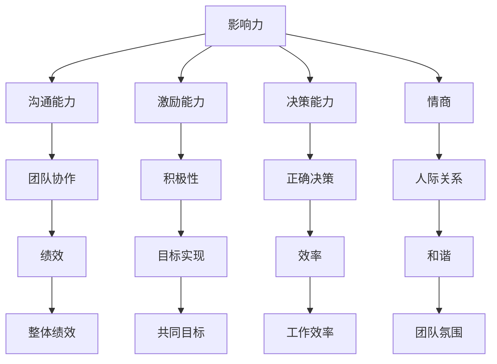
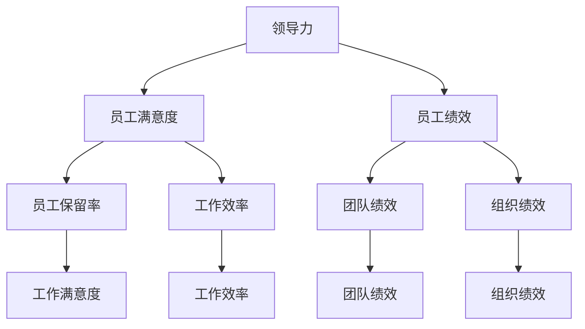

                 

### 文章标题

# 领导力与员工发展：助力团队成员职业成长

---

关键词：领导力、员工发展、职业成长、领导力提升、组织文化

---

摘要：本文旨在探讨领导力在员工发展和职业成长中的重要作用，通过分析领导力与员工发展的核心概念和关系架构，详细讲解领导力提升的方法和策略，并探讨领导力在组织文化和变革中的应用。通过实际案例分析和最佳实践，本文为企业和团队领导者提供了实用的指导，助力团队成员实现职业成长。

---

### 引言

在现代企业中，领导力与员工发展已成为组织成功的关键因素。有效的领导力不仅可以提高员工的工作满意度和绩效，还能促进团队成员的职业成长，进而提升整个组织的竞争力。因此，本文将从以下几个方面进行探讨：

1. **领导力基础**：介绍领导力的定义、核心要素和理论概述，以及领导风格与影响力的关系。
2. **领导力与员工发展**：探讨领导力在员工职业发展中的角色和作用，分析员工发展策略与工具，以及领导力与员工满意度和绩效的关系。
3. **团队成员职业成长**：分析团队成员的职业成长路径和职业规划，探讨职业技能提升的方法和策略，以及职业发展中的挑战与应对。
4. **领导力提升方法**：介绍自我领导力提升、领导力训练与发展，以及领导力评估与反馈的方法和策略。
5. **实战案例与应用**：通过成功领导力案例、员工发展实际应用案例和团队职业成长的实践经验，提供具体的指导和建议。
6. **领导力与组织发展**：探讨领导力在组织中的作用、组织文化与领导力的互动，以及领导力与组织变革的关系。
7. **未来领导力趋势**：分析新时代领导力的特点、数字化转型与领导力的关系，以及领导力的可持续发展。

通过以上分析，本文旨在为企业和团队领导者提供一套完整的领导力与员工发展策略，助力团队成员实现职业成长，提升组织整体竞争力。

### 1. 领导力基础

#### 1.1 领导力的定义

领导力是一个复杂而广泛的概念，不同的学者和专家对其有不同的定义和理解。通常来说，领导力可以被定义为一种能力，即引导和激励他人共同实现目标的过程。这种能力不仅仅包括对任务的管理和协调，更重要的是对人的关注和激励。

定义领导力的一个重要维度是领导力与管理的区别。管理学侧重于组织结构、流程优化和资源分配，而领导力则更关注人的发展和激励。一个有效的领导者需要具备管理能力，但更重要的是具备领导能力，能够激励和引导团队成员共同实现目标。

#### 1.2 领导力的核心要素

领导力由多个核心要素构成，这些要素共同作用，决定了领导力的有效性和影响力。以下是几个关键要素：

1. **影响力**：领导力依赖于影响力，即领导者如何通过自身的行为、决策和沟通来影响他人。这种影响力可以是正式的（如职位权力），也可以是非正式的（如个人魅力和专业知识）。

2. **沟通能力**：领导者需要具备良好的沟通能力，能够清晰、准确地传达信息，并倾听和理解团队成员的意见和需求。有效的沟通有助于建立信任和共识，促进团队协作。

3. **激励能力**：领导者需要能够激发团队成员的内在动力和积极性，使其为实现共同目标而努力。这可以通过设定明确的目标、提供反馈和支持、认可和奖励等方式实现。

4. **决策能力**：领导者需要具备果断和明智的决策能力，能够在复杂和不确定的环境中做出正确的决策。良好的决策能力有助于减少团队中的不确定性，提高团队的工作效率。

5. **情商**：情商是指领导者对自己和他人情感的理解和管理能力。高情商的领导者能够更好地理解团队成员的情感和需求，从而建立和谐的人际关系，提高团队的整体绩效。

#### 1.3 领导力的Mermaid流程图

为了更好地理解领导力的核心要素和它们之间的关系，我们可以使用Mermaid流程图来展示。以下是一个简单的Mermaid流程图示例：

这个流程图展示了领导力的核心要素及其相互关系，有助于我们更清晰地理解领导力的本质和如何在实际工作中应用。

### 2. 领导力与员工发展

#### 2.1 领导力在员工职业发展中的角色

领导力在员工职业发展中扮演着至关重要的角色。一个有效的领导者不仅能够指导和管理团队成员，还能在员工的职业成长过程中提供必要的支持和帮助。以下是领导力在员工职业发展中的几个关键角色：

1. **导师**：领导者可以作为员工的导师，提供职业指导和建议。他们可以分享自己的经验和知识，帮助员工更好地理解职业发展的方向和策略。

2. **教练**：领导者可以作为员工的教练，帮助他们在工作中不断进步和成长。通过设定明确的目标、提供反馈和指导，领导者可以激励员工克服困难，提升技能。

3. **支持者**：领导者需要成为员工的支持者，在员工面临挑战和困难时给予鼓励和帮助。这种支持可以增强员工的信心和动力，促进职业发展。

4. **榜样**：领导者通过自己的行为和决策树立榜样，影响员工的价值观和行为方式。一个有担当、有责任心的领导者可以激励员工追求更高的目标，实现职业成长。

#### 2.2 员工发展策略与工具

为了有效推动员工的职业发展，领导者可以采用一系列策略和工具。以下是几个关键的员工发展策略：

1. **职业规划**：领导者可以帮助员工制定职业规划，明确职业目标和实现路径。这包括设定短期和长期目标，制定行动计划，并提供必要的资源和支持。

2. **培训与发展**：领导者可以组织培训课程和工作坊，提升员工的技能和知识。这些培训可以是内部的，也可以是与外部专家合作进行的。

3. **反馈与评估**：领导者需要定期与员工进行沟通，提供反馈和评估。这有助于员工了解自己的表现，找到改进的方向。

4. **激励机制**：领导者可以通过奖励和激励措施，鼓励员工在职业发展过程中取得进步。这些激励可以是金钱的，也可以是荣誉和认可的。

5. **个性化发展**：领导者需要关注每个员工的个性化需求，提供定制化的职业发展支持。这可以包括调整工作职责、提供特殊项目机会等。

#### 2.3 领导力与员工满意度和绩效

领导力对员工满意度和绩效有着显著的影响。一个有效的领导者可以提高员工的工作满意度，进而提升绩效。以下是领导力与员工满意度和绩效之间的几个关键关系：

1. **工作满意度**：领导者通过关注员工的情感需求、提供支持和激励，可以提升员工的工作满意度。高工作满意度通常与更高的员工保留率和工作效率相关。

2. **员工绩效**：领导者的决策、指导和支持有助于员工在职业发展过程中取得更好的绩效。一个有能力的领导者可以激发员工的潜力，推动他们实现更高的工作目标。

3. **团队绩效**：领导力不仅影响个体员工的表现，还影响整个团队的绩效。一个高效的领导者可以建立协作和沟通机制，促进团队合作，提高团队整体绩效。

4. **组织绩效**：领导力的提升可以带动整个组织的绩效提升。有效的领导力不仅能够提升团队绩效，还能促进组织文化的建设，提高组织的竞争力。

#### 2.4 领导力与员工满意度和绩效的Mermaid流程图

为了更直观地展示领导力与员工满意度和绩效之间的关系，我们可以使用Mermaid流程图。以下是一个简单的流程图示例：

这个流程图展示了领导力如何通过提升员工满意度和绩效，进而影响员工保留率、工作效率、团队绩效和组织绩效。通过这些关系，我们可以看到领导力在员工发展和组织成功中的重要性。

### 3. 团队成员职业成长

#### 3.1 成长路径与职业规划

团队成员的职业成长是一个系统性的过程，需要明确成长路径和制定职业规划。以下是职业成长路径和职业规划的关键要素：

1. **成长路径**：成长路径是指团队成员从入职到成为资深专家或管理层所经历的一系列发展阶段。典型的成长路径包括：

   - **基础阶段**：新员工熟悉公司文化和工作流程，学习基础知识和技能。
   - **进阶阶段**：员工在基础阶段的基础上，提升专业技能和解决问题的能力。
   - **高级阶段**：员工成为团队的核心成员，承担更多的责任和挑战，参与战略决策。
   - **管理层阶段**：员工晋升为管理层，领导团队，实现组织目标。

2. **职业规划**：职业规划是指团队成员根据自己的兴趣、能力和职业目标，制定长期和短期的职业发展计划。职业规划的关键要素包括：

   - **目标设定**：明确职业目标，包括短期目标和长期目标。
   - **行动计划**：为实现职业目标制定具体的行动计划，包括学习计划、工作职责调整等。
   - **资源分配**：获取必要的资源和支持，包括培训、指导、项目机会等。
   - **评估与调整**：定期评估职业规划的实施情况，根据实际情况进行调整。

#### 3.2 职业技能提升

职业技能提升是团队成员职业成长的重要组成部分。以下是一些关键的职业技能提升策略：

1. **学习与培训**：通过参加培训课程、研讨会和工作坊，学习新的知识和技能。这包括内部培训和外部培训，以及在线学习平台。

2. **实践与经验**：通过实际工作项目，积累实践经验。在实践中，团队成员可以应用所学知识，解决实际问题，提升专业技能。

3. **导师制度**：建立导师制度，让经验丰富的员工指导新员工。导师可以提供职业建议、指导和支持，帮助新员工更快地成长。

4. **跨部门合作**：通过跨部门合作，团队成员可以接触到不同的业务领域和技能，拓宽知识面和技能范围。

5. **自我学习**：鼓励团队成员自我学习，不断提升自己的知识和技能。这可以通过阅读专业书籍、参加行业研讨会、关注行业动态等方式实现。

#### 3.3 职业发展中的挑战与应对

在职业发展过程中，团队成员可能会面临各种挑战。以下是一些常见的挑战和应对策略：

1. **技能瓶颈**：当团队成员在某个技能领域达到一定水平时，可能会遇到发展瓶颈。应对策略包括：

   - **学习新技能**：探索新的领域和技能，提升综合能力。
   - **参加高难度项目**：接受挑战性的任务，提升解决问题的能力。
   - **寻求外部指导**：寻找导师或行业专家，获取职业发展的建议。

2. **职业路径不明确**：当团队成员不确定自己的职业路径时，可能会感到迷茫和困惑。应对策略包括：

   - **与上级沟通**：与上级讨论职业规划和职业发展机会。
   - **寻求职业咨询**：向职业顾问或行业专家寻求指导。
   - **制定职业规划**：明确职业目标，制定具体的行动计划。

3. **工作压力**：职业发展过程中，团队成员可能会面临工作压力。应对策略包括：

   - **时间管理**：合理安排时间，确保工作与生活平衡。
   - **寻求支持**：与同事、家人和朋友分享压力，获取情感支持。
   - **自我调节**：通过锻炼、休息和放松来调节身心状态。

#### 3.4 成功的职业发展案例

为了更好地理解职业发展过程和挑战应对，我们可以分析一些成功的职业发展案例：

1. **案例1：技术专家晋升为项目经理**
   - **背景**：一名技术专家在公司的技术部门工作了5年，积累了丰富的技术知识和经验。
   - **挑战**：技术专家希望拓宽职业发展路径，但不确定是否适合转型为项目经理。
   - **应对策略**：与技术部门的领导沟通，了解项目经理的职责和技能要求。参加了项目管理培训，提升项目管理能力。通过参与多个项目，积累了项目管理经验。最终成功晋升为项目经理。

2. **案例2：市场营销专员成长为市场总监**
   - **背景**：一名市场营销专员在公司的工作经验达到了8年，对市场营销有深入的了解和丰富的实践经验。
   - **挑战**：市场营销专员希望进一步提升自己的职业地位，但面临市场竞争和业绩压力。
   - **应对策略**：参加市场营销高级课程，提升专业知识和技能。积极参与公司的市场策略制定，提供创新性建议。通过业绩表现和领导力展现，赢得了上级的认可。最终晋升为市场总监。

这些案例展示了职业发展的路径和挑战应对策略，为其他团队成员提供了借鉴和启示。

### 4. 领导力提升方法

#### 4.1 自我领导力提升

自我领导力提升是领导者职业发展的重要一环。以下是一些关键方法和策略：

1. **自我反思**：领导者需要定期进行自我反思，审视自己的行为、决策和领导风格。这有助于发现不足之处，制定改进计划。

2. **持续学习**：领导者需要不断学习新的知识和技能，保持对行业的敏锐洞察力。这可以通过阅读专业书籍、参加培训课程和研讨会等方式实现。

3. **建立人际网络**：领导者需要积极建立和维护人际网络，与不同领域的专家和同行保持联系。这有助于获取新的观点和资源，促进职业发展。

4. **设定明确的目标**：领导者需要设定明确的职业和个人目标，并制定具体的行动计划。这有助于保持专注和动力，实现目标。

5. **培养情商**：领导者需要培养高情商，提高对自身和他人情感的理解和管理能力。这有助于建立和谐的人际关系，提升领导力。

#### 4.2 领导力训练与发展

领导力训练与发展是提升领导者能力的有效途径。以下是一些关键方法和策略：

1. **领导力培训课程**：参加专业的领导力培训课程，学习领导力的理论和实践方法。这些课程通常包括案例研究、角色扮演和讨论等环节。

2. **导师制度**：与经验丰富的领导者和导师建立联系，从他们身上学习领导力的技巧和经验。导师可以提供个性化的指导和支持。

3. **实践机会**：通过参与实际项目和管理职责，积累领导力实践经验。这有助于将理论知识应用到实际工作中，提升领导力。

4. **反思与反馈**：定期进行反思和接受反馈，分析自己的领导行为和决策。这有助于发现不足之处，制定改进计划。

5. **持续学习与发展**：领导者需要持续学习和自我提升，关注行业动态和最新领导力趋势。这可以通过阅读专业书籍、参加研讨会和在线课程等方式实现。

#### 4.3 领导力评估与反馈

领导力评估与反馈是提升领导者能力的重要环节。以下是一些关键方法和策略：

1. **360度反馈**：通过收集来自团队成员、上级和下属的反馈，全面评估领导者的表现。这有助于发现领导力的优点和不足之处。

2. **领导力评估工具**：使用专业的领导力评估工具，如领导力量表、360度评估表等，对领导者的能力进行量化评估。

3. **定期反思**：领导者需要定期反思自己的领导行为和决策，分析反馈和评估结果。这有助于识别问题，制定改进计划。

4. **反馈与沟通**：领导者需要与团队成员和上级进行有效沟通，分享反馈和评估结果。这有助于建立信任和共识，促进领导力的提升。

5. **行动计划**：根据反馈和评估结果，制定具体的行动计划，包括改进措施和时间表。这有助于确保领导力的持续提升。

### 5. 实战案例与应用

#### 5.1 成功领导力案例

成功领导力案例展示了领导者如何在实践中应用领导力原则，实现团队和组织的目标。以下是几个成功领导力案例：

1. **案例1：谷歌的CEO桑达尔·皮查伊**
   - **背景**：桑达尔·皮查伊在谷歌担任CEO，负责领导一个庞大的全球团队。
   - **领导力策略**：皮查伊强调透明度和员工参与，鼓励员工提出创新想法。他通过建立开放沟通机制，确保团队成员的反馈和建议能够得到重视。此外，他注重员工的职业发展，提供丰富的培训和晋升机会。
   - **成果**：皮查伊的领导力使得谷歌在竞争激烈的市场中保持领先地位，员工满意度和绩效显著提升。

2. **案例2：特斯拉的CEO埃隆·马斯克**
   - **背景**：埃隆·马斯克作为特斯拉的CEO，带领公司实现了电动汽车的突破性发展。
   - **领导力策略**：马斯克以大胆的愿景和坚定的决心领导团队，推动技术创新和公司增长。他注重员工的激励，通过设定高目标和提供竞争性的薪酬和福利，激发员工的积极性和创造力。
   - **成果**：马斯克的领导力使得特斯拉成为全球电动汽车市场的领导者，实现了从概念到商业化的跨越。

3. **案例3：微软的CEO萨蒂亚·纳德拉**
   - **背景**：萨蒂亚·纳德拉在微软担任CEO，负责带领公司走出困境，实现转型。
   - **领导力策略**：纳德拉强调团队合作和开放文化，推动组织内部的协作和创新。他鼓励员工勇于尝试，从失败中学习，并建立了明确的价值观和使命。
   - **成果**：纳德拉的领导力使得微软在云计算和人工智能领域取得了巨大成功，公司业绩和市场份额显著提升。

这些案例展示了成功领导力如何在不同组织和行业中发挥作用，推动团队和组织实现目标。

#### 5.2 员工发展实际应用案例

员工发展实际应用案例展示了企业在员工职业成长过程中如何运用有效的领导力和发展策略。以下是几个员工发展实际应用案例：

1. **案例1：阿里巴巴的“六脉神剑”**
   - **背景**：阿里巴巴通过“六脉神剑”员工发展计划，帮助员工实现职业成长。
   - **员工发展策略**：阿里巴巴为员工提供全面的培训和发展机会，包括内部培训、在线学习平台和外部培训。此外，公司鼓励员工跨部门流动，拓宽知识和技能范围。通过导师制度和绩效反馈机制，帮助员工明确职业目标和提升能力。
   - **成果**：通过“六脉神剑”计划，阿里巴巴培养了大批高素质的员工，提高了员工满意度和绩效，推动了公司持续发展。

2. **案例2：IBM的领导力发展项目**
   - **背景**：IBM通过领导力发展项目，提升领导者的能力和领导力。
   - **领导力发展策略**：IBM为领导者提供系统的培训和发展计划，包括领导力研讨会、高管教练和领导力评估工具。此外，公司鼓励领导者参与跨国项目和领导力论坛，拓展视野和提升领导力。
   - **成果**：通过领导力发展项目，IBM提升了领导者的领导力和决策能力，推动了公司业务的持续增长和变革。

3. **案例3：微软的“员工发展地图”**
   - **背景**：微软通过“员工发展地图”，帮助员工规划职业成长路径。
   - **员工发展策略**：微软为员工提供个性化的职业发展指导，根据员工的能力和兴趣制定发展计划。公司提供多样化的培训和发展机会，包括技能培训、领导力培训和职业发展研讨会。此外，微软鼓励员工参与内部项目和跨部门流动，提升综合能力。
   - **成果**：通过“员工发展地图”，微软培养了大批具有竞争力的员工，提高了员工满意度和绩效，推动了公司的创新和发展。

这些案例展示了企业如何通过有效的员工发展策略，助力团队成员实现职业成长，提升组织的整体竞争力。

#### 5.3 团队职业成长的实践经验

团队职业成长的实践经验展示了团队如何在领导者的指导下，通过有效的协作和职业发展策略，实现成员的职业成长。以下是几个团队职业成长的实践经验：

1. **案例1：华为的研发团队**
   - **背景**：华为的研发团队在全球范围内承担了重要的研发任务，团队成员具有较高的专业技能和创新能力。
   - **职业成长策略**：华为为研发团队提供全面的培训和发展机会，包括内部培训、外部培训和在线学习平台。此外，华为鼓励团队成员跨部门流动，拓宽知识和技能范围。团队领导者通过绩效反馈和职业规划，帮助团队成员明确职业目标和提升能力。
   - **成果**：通过团队职业成长策略，华为的研发团队在技术领域取得了重大突破，提升了团队的竞争力和创新能力。

2. **案例2：谷歌的工程团队**
   - **背景**：谷歌的工程团队是全球顶尖的工程团队之一，团队成员具备卓越的技术能力和创新精神。
   - **职业成长策略**：谷歌为工程团队提供丰富的培训和职业发展机会，包括内部培训、外部培训和在线学习平台。此外，谷歌鼓励团队成员参与跨国项目和领导力论坛，拓展视野和提升领导力。团队领导者通过绩效反馈和职业规划，帮助团队成员明确职业目标和提升能力。
   - **成果**：通过团队职业成长策略，谷歌的工程团队在技术创新和项目实施方面取得了显著成果，推动了公司的持续发展。

3. **案例3：阿里巴巴的电商团队**
   - **背景**：阿里巴巴的电商团队在全球电商领域具有领先地位，团队成员具备丰富的电商运营经验和创新能力。
   - **职业成长策略**：阿里巴巴为电商团队提供全面的培训和职业发展机会，包括内部培训、外部培训和在线学习平台。此外，阿里巴巴鼓励团队成员参与跨部门和跨项目的合作，提升综合能力。团队领导者通过绩效反馈和职业规划，帮助团队成员明确职业目标和提升能力。
   - **成果**：通过团队职业成长策略，阿里巴巴的电商团队在电商运营和市场营销方面取得了显著成果，提升了公司的市场竞争力。

这些案例展示了团队如何在领导者的指导下，通过有效的职业发展策略，实现成员的职业成长，推动团队的整体发展。

### 6. 领导力与组织发展

#### 6.1 领导力在组织中的作用

领导力在组织发展中起着至关重要的作用。一个有效的领导者能够推动组织实现目标，提高绩效，并促进组织的可持续发展。以下是领导力在组织中的作用：

1. **战略规划**：领导者负责制定组织的战略规划，确定组织的发展方向和目标。他们需要分析市场趋势、竞争环境和内部资源，制定可行的战略方案。

2. **决策与执行**：领导者需要做出关键决策，并在组织内部推动决策的执行。他们需要平衡不同利益相关者的需求，确保决策的合理性和可执行性。

3. **团队建设**：领导者负责建立和培养高效的团队，激发团队成员的潜力和积极性。他们需要通过有效的沟通和激励措施，促进团队合作和共同目标实现。

4. **文化塑造**：领导者需要塑造积极向上的组织文化，建立共同的价值观和行为规范。他们需要通过自身的言行，树立榜样，引导组织文化的发展。

5. **变革管理**：在组织面临变革时，领导者需要推动变革的实施和管理。他们需要分析变革的动因和影响，制定变革策略，并确保变革的顺利进行。

#### 6.2 组织文化与领导力

组织文化和领导力之间存在密切的关系。领导力不仅影响组织文化的形成，还通过组织文化的塑造来推动组织的可持续发展。以下是组织文化与领导力之间的关系：

1. **领导力塑造文化**：领导者通过自身的行为和决策，塑造组织的价值观和行为规范。他们的言行和行为成为员工效仿的榜样，影响组织文化的形成。

2. **文化影响领导力**：组织文化对领导力的表现和效果有重要影响。一个积极向上的组织文化能够激励领导者发挥更大的领导力，推动组织的成功。

3. **共同价值观**：领导力和组织文化都是基于共同的价值观。领导者需要通过价值观的传递和践行，确保组织成员在共同价值观的基础上团结一致，共同实现组织目标。

4. **文化变革**：在组织变革过程中，领导力与组织文化的互动至关重要。领导者需要通过变革管理策略，推动组织文化的变革，确保组织能够适应外部环境的变化。

#### 6.3 领导力与组织变革

领导力在组织变革中起着关键作用。有效的领导力可以推动组织变革的顺利进行，确保变革目标的实现。以下是领导力在组织变革中的作用：

1. **变革倡导者**：领导者需要作为变革的倡导者，向组织成员传达变革的必要性和重要性。他们需要通过沟通和激励，激发员工的变革意识和参与度。

2. **变革推动者**：领导者需要推动变革的实施和管理。他们需要制定详细的变革计划，协调各方资源，确保变革的顺利进行。

3. **变革支持者**：领导者需要成为变革的支持者，在变革过程中提供必要的支持和鼓励。他们需要帮助员工克服变革带来的挑战和困难，确保变革目标的实现。

4. **变革评估者**：领导者需要评估变革的效果和影响，根据反馈进行改进和调整。他们需要确保变革的成果能够持续，并为组织的可持续发展奠定基础。

### 7. 未来领导力趋势

#### 7.1 新时代领导力的特点

随着社会和科技的快速发展，新时代领导力呈现出一系列新的特点。以下是新时代领导力的一些关键特点：

1. **数字化转型**：数字化转型已成为企业发展的关键趋势。领导者需要具备数字思维，能够把握数字化技术的机遇，推动组织的数字化转型。

2. **全球视野**：全球化使得领导者需要具备全球视野，能够理解不同国家和地区的文化、经济和政治环境，以及全球市场的变化。

3. **创新能力**：新时代领导者需要具备创新能力，能够引导组织不断创新，应对快速变化的市场需求。

4. **可持续性**：可持续性已成为企业发展的核心议题。领导者需要具备可持续性思维，推动组织的可持续发展，保护环境和资源。

5. **情感智能**：领导者需要具备高情商，能够理解和管理自己和他人的情感，建立良好的人际关系。

#### 7.2 数字化转型与领导力

数字化转型对领导力提出了新的要求和挑战。以下是数字化转型与领导力之间的几个关键关系：

1. **领导力转型**：数字化转型要求领导者具备数字技能和数字领导力。他们需要理解数字化技术，能够引导组织进行数字化转型。

2. **数字化转型策略**：领导者需要制定清晰的数字化转型策略，明确数字化转型的目标和路径，确保数字化转型的顺利进行。

3. **数字化转型文化**：领导者需要塑造积极向上的数字化转型文化，激发员工的数字化意识和参与度，推动数字化转型。

4. **数字化转型领导力**：数字化转型要求领导者具备创新的思维和决策能力，能够推动组织快速适应和应对数字化转型带来的变化。

#### 7.3 领导力的可持续发展

领导力的可持续发展是新时代领导者的重要任务。以下是领导力可持续发展的几个关键策略：

1. **持续学习**：领导者需要不断学习新的知识和技能，保持对行业的敏锐洞察力，推动个人和组织的可持续发展。

2. **领导力传承**：领导者需要培养和传承领导力，确保组织能够持续培养新一代领导者，推动组织的可持续发展。

3. **组织文化**：领导者需要塑造积极向上的组织文化，激发员工的创造力和创新精神，推动组织的可持续发展。

4. **社会责任**：领导者需要承担社会责任，推动组织在经营活动中遵循道德和伦理规范，促进社会的可持续发展。

### 总结

本文通过对领导力与员工发展的深入探讨，分析了领导力在员工职业成长中的重要作用，以及如何通过自我领导力提升、领导力训练与发展、领导力评估与反馈等方法来提升领导力。同时，本文还探讨了领导力与组织发展、未来领导力趋势等方面的内容。通过实际案例和应用，本文为企业和团队领导者提供了实用的指导，助力团队成员实现职业成长，提升组织整体竞争力。在未来，随着社会和科技的不断进步，领导力将继续演变，新时代的领导者需要具备数字化思维、全球视野和创新能力，以应对不断变化的市场和环境。

---

### 作者信息

作者：AI天才研究院/AI Genius Institute & 禅与计算机程序设计艺术 /Zen And The Art of Computer Programming

AI天才研究院（AI Genius Institute）专注于人工智能和机器学习领域的研究与发展，致力于培养下一代人工智能专家。同时，研究院的成员也是《禅与计算机程序设计艺术》一书的作者，该书在计算机编程和人工智能领域具有极高的声誉和影响力。通过本文，我们希望与读者分享领导力与员工发展的宝贵经验和见解，共同推动组织和个人实现更高的成就。

---

### 附录

本节提供一些与领导力与员工发展相关的参考资料，包括书籍、文章、在线资源和案例研究，以供读者进一步学习和探索。

#### 书籍推荐

1. **《领导力五项修炼》** - 史蒂芬·柯维（Stephen R. Covey）
   - 内容简介：本书介绍了领导力的五个核心方面，包括信任、沟通、团队协作、个人成长和影响力。

2. **《员工发展的策略与实践》** - 罗伯特·霍尔（Robert H. Hall）
   - 内容简介：本书提供了关于员工发展的全面指导，包括职业规划、培训与发展、绩效管理和激励策略。

3. **《数字化领导力》** - 汤姆·彼得斯（Tom Peters）
   - 内容简介：本书探讨了数字化转型对领导力的影响，以及领导者如何在数字化时代保持竞争力和创新力。

#### 文章推荐

1. **《领导力：从管理到领导的转变》** - 哈佛商业评论
   - 链接：[哈佛商业评论 - 领导力：从管理到领导的转变](https://hbr.org/product/leadership-the-transition-from-management-to-leadership/908068-PDF-ENG)

2. **《员工发展：提升员工绩效的关键》** - 麦肯锡全球研究院
   - 链接：[麦肯锡全球研究院 - 员工发展：提升员工绩效的关键](https://www.mckinsey.com/business-functions/organization/our-insights/how-to-maximize-the-potential-of-your-workforce)

#### 在线资源

1. **Coursera - 领导力课程**
   - 链接：[Coursera - 领导力课程](https://www.coursera.org/courses?query=leadership)

2. **LinkedIn Learning - 领导力培训**
   - 链接：[LinkedIn Learning - 领导力培训](https://www.linkedin.com/learning/topics/leadership)

#### 案例研究

1. **谷歌的领导力发展计划**
   - 链接：[谷歌的领导力发展计划](https://www.google.com/about/corporate/universal-leadership-program/)

2. **苹果公司的员工发展策略**
   - 链接：[苹果公司的员工发展策略](https://www.apple.com/jobs/us/)

通过这些书籍、文章、在线资源和案例研究，读者可以深入了解领导力与员工发展的核心概念和实践，进一步提升自身的领导力和员工发展能力。

---

### 最佳实践 Tips

1. **领导力发展计划**：企业应制定系统的领导力发展计划，包括培训、导师制度和领导力评估，以提升领导者的能力和领导力。

2. **员工职业规划**：鼓励员工制定职业规划，明确职业目标和实现路径，并定期进行评估和调整。

3. **持续学习**：领导者应保持学习的态度，不断更新知识和技能，以适应快速变化的市场和环境。

4. **建立信任**：领导者应注重与团队成员建立信任关系，通过有效的沟通和反馈，增强团队的凝聚力和协作能力。

5. **激励与认可**：领导者应采用多样化的激励措施，如奖励、荣誉和认可，以激励员工在职业发展中取得进步。

---

### 小结

本文通过对领导力与员工发展的深入探讨，阐述了领导力在员工职业成长中的重要作用，以及如何通过自我领导力提升、领导力训练与发展、领导力评估与反馈等方法来提升领导力。同时，本文还分析了领导力与组织发展的关系，以及未来领导力的趋势。通过实际案例和应用，本文为企业和团队领导者提供了实用的指导，助力团队成员实现职业成长，提升组织整体竞争力。

---

### 注意事项

1. **个性化发展**：在员工发展过程中，领导者应关注每个员工的个性化需求，提供定制化的职业发展支持。

2. **持续反馈**：领导者应定期与员工进行沟通，提供持续反馈，帮助员工了解自己的表现和提升方向。

3. **文化塑造**：领导者应积极塑造积极向上的组织文化，激发员工的创新精神和团队合作意识。

4. **变革管理**：在组织变革过程中，领导者应密切关注员工的心态和行为变化，提供必要的支持和鼓励。

---

### 拓展阅读

1. **《领导力的秘密：如何成为卓越领导者》** - 安东尼·罗宾斯（Anthony Robbins）
   - 内容简介：本书揭示了成为卓越领导者的秘密，包括自我提升、沟通技巧和领导力培养等方面的内容。

2. **《员工发展的原则与方法》** - 菲利普·科特勒（Philip Kotler）
   - 内容简介：本书系统地介绍了员工发展的原则和方法，包括职业规划、培训与发展、绩效管理和激励策略。

3. **《数字领导力：在数字化转型中引领变革》** - 约翰·布莱恩特（John Brant）
   - 内容简介：本书探讨了数字化时代领导力的新特点，以及如何通过数字化转型来提升领导力。

通过这些拓展阅读，读者可以更深入地了解领导力与员工发展的理论和实践，进一步提升自身的领导力和员工发展能力。

