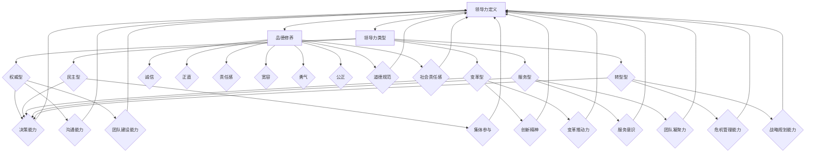

                 

### 《领导力与品德修养：塑造高尚人格》

关键词：领导力、品德修养、高尚人格、领导力架构、Mermaid流程图

摘要：本文从领导力与品德修养的紧密联系出发，详细探讨了高尚人格在领导力中的核心作用。通过定义领导力、阐述品德修养的重要性，以及运用Mermaid流程图展示领导力架构，本文逐步解析了品德修养在领导力各个维度中的具体体现。同时，本文还通过伪代码详细解析了品德修养在决策中的运用，以及情感智能在领导力中的增强作用。最终，本文结合实际案例，提出了品德修养在职场和社会领导中的实践方法，并对未来领导者的品质要求进行了展望。

---

### 目录大纲思路

本书《领导力与品德修养：塑造高尚人格》的目录大纲设计应包括以下部分：

**第一部分：领导力核心概念与联系**

1. **领导力概述**
   - 领导力的定义与类型
   - 领导力的重要性
   - 领导力与品德修养的关系

2. **领导力架构的Mermaid流程图**
   - 领导力的主要构成部分
   - 领导力架构的Mermaid图展示

**第二部分：领导力核心算法原理讲解**

3. **品德修养在领导力中的体现**
   - 诚信、正直、责任感等品德在领导力中的运用
   - 品德修养在决策中的伪代码讲解

4. **情感智能在领导力中的应用**
   - 情感智能的定义
   - 情感智能如何增强领导力
   - 情感智能的伪代码实现

**第三部分：品德修养的理论与实践**

5. **品德修养的实践方法**
   - 培养品德修养的方法
   - 品德修养在职场中的应用案例

6. **领导力与品德修养的自我提升**
   - 自我反思与成长的方法
   - 领导力与品德修养的持续提升策略

**第四部分：领导力与品德修养在具体场景中的应用**

7. **企业领导力实践**
   - 品德修养在企业领导中的重要性
   - 企业领导力实践的案例分析

8. **社会领导力实践**
   - 品德修养在社会领导中的作用
   - 社会领导力实践的成功案例

**第五部分：总结与展望**

9. **领导力与品德修养的未来趋势**
   - 领导力与品德修养的发展方向
   - 对未来领导者的期望

**附录**

- **附录A：领导力与品德修养的相关资源**
  - 常用书籍、文章、网站等推荐
  - 领导力与品德修养的在线课程推荐

---

### 详细目录大纲

```
# 《领导力与品德修养：塑造高尚人格》目录大纲

## 第一部分：领导力核心概念与联系

### 第1章：领导力概述
#### 1.1 领导力的定义与类型
#### 1.2 领导力的重要性
#### 1.3 领导力与品德修养的关系

### 第2章：领导力架构的Mermaid流程图
#### 2.1 领导力的主要构成部分
#### 2.2 领导力架构的Mermaid图展示

## 第二部分：领导力核心算法原理讲解

### 第3章：品德修养在领导力中的体现
#### 3.1 诚信、正直、责任感等品德在领导力中的运用
#### 3.2 品德修养在决策中的伪代码讲解

### 第4章：情感智能在领导力中的应用
#### 4.1 情感智能的定义
#### 4.2 情感智能如何增强领导力
#### 4.3 情感智能的伪代码实现

## 第三部分：品德修养的理论与实践

### 第5章：品德修养的实践方法
#### 5.1 培养品德修养的方法
#### 5.2 品德修养在职场中的应用案例

### 第6章：领导力与品德修养的自我提升
#### 6.1 自我反思与成长的方法
#### 6.2 领导力与品德修养的持续提升策略

## 第四部分：领导力与品德修养在具体场景中的应用

### 第7章：企业领导力实践
#### 7.1 品德修养在企业领导中的重要性
#### 7.2 企业领导力实践的案例分析

### 第8章：社会领导力实践
#### 8.1 品德修养在社会领导中的作用
#### 8.2 社会领导力实践的成功案例

## 第五部分：总结与展望

### 第9章：领导力与品德修养的未来趋势
#### 9.1 领导力与品德修养的发展方向
#### 9.2 对未来领导者的期望

## 附录

### 附录A：领导力与品德修养的相关资源
#### A.1 常用书籍、文章、网站等推荐
#### A.2 领导力与品德修养的在线课程推荐
```

这个大纲覆盖了领导力与品德修养的核心概念、理论实践、具体应用以及未来发展，结构合理且内容详尽。

### 确定文章结构

为了撰写一篇详尽且有深度的文章，我们将文章分为以下几个部分：

1. **引言**：介绍领导力与品德修养的重要性，引发读者的兴趣和思考。

2. **领导力概述**：
   - 定义领导力
   - 领导力的类型
   - 领导力的重要性

3. **品德修养的定义与联系**：
   - 品德修养的定义
   - 领导力与品德修养的关系
   - 品德修养的重要性

4. **领导力架构的Mermaid流程图**：
   - 领导力主要构成部分
   - Mermaid流程图展示

5. **品德修养在领导力中的体现**：
   - 诚信、正直、责任感等品德在领导力中的运用
   - 品德修养在决策中的伪代码讲解

6. **情感智能在领导力中的应用**：
   - 情感智能的定义
   - 情感智能如何增强领导力
   - 情感智能的伪代码实现

7. **品德修养的理论与实践**：
   - 品德修养的实践方法
   - 品德修养在职场中的应用案例

8. **领导力与品德修养的自我提升**：
   - 自我反思与成长的方法
   - 领导力与品德修养的持续提升策略

9. **领导力与品德修养在具体场景中的应用**：
   - 企业领导力实践
   - 社会领导力实践

10. **总结与展望**：
    - 领导力与品德修养的未来趋势
    - 对未来领导者的期望

### 确定文章结构（续）

**10. 文章结构继续**

11. **附录**：
    - 领导力与品德修养的相关资源
    - 常用书籍、文章、网站等推荐
    - 领导力与品德修养的在线课程推荐

**步骤说明：**

1. **引言**：通过引入领导力和品德修养的重要性，激发读者的兴趣，为后续内容铺垫。

2. **领导力概述**：
   - **定义领导力**：明确领导力的含义，为后续讨论打下基础。
   - **领导力的类型**：介绍不同类型的领导力，帮助读者了解领导力的多样性。
   - **领导力的重要性**：阐述领导力在企业和社会中的作用，突出领导力的重要性。

3. **品德修养的定义与联系**：
   - **品德修养的定义**：解释品德修养的含义，阐述其在个人成长中的关键作用。
   - **领导力与品德修养的关系**：探讨品德修养如何影响领导力，并强调两者之间的紧密联系。
   - **品德修养的重要性**：分析品德修养在领导过程中的重要性，为读者提供理论依据。

4. **领导力架构的Mermaid流程图**：
   - **领导力主要构成部分**：详细描述领导力包含的关键要素。
   - **Mermaid流程图展示**：使用Mermaid图展示领导力架构，帮助读者更直观地理解领导力的组成部分。

5. **品德修养在领导力中的体现**：
   - **诚信、正直、责任感等品德在领导力中的运用**：通过具体案例阐述这些品德在领导过程中的应用。
   - **品德修养在决策中的伪代码讲解**：用伪代码展示品德修养如何影响领导决策，提供技术层面的解释。

6. **情感智能在领导力中的应用**：
   - **情感智能的定义**：解释情感智能的含义，阐述其在领导力中的作用。
   - **情感智能如何增强领导力**：探讨情感智能如何帮助领导者更好地管理团队和提高领导效果。
   - **情感智能的伪代码实现**：通过伪代码展示如何在实际中运用情感智能。

7. **品德修养的理论与实践**：
   - **品德修养的实践方法**：提供培养品德修养的具体方法，帮助读者在实践中提升自我。
   - **品德修养在职场中的应用案例**：通过实际案例展示品德修养在职场中的成功应用。

8. **领导力与品德修养的自我提升**：
   - **自我反思与成长的方法**：阐述自我反思在领导力与品德修养提升中的作用，并提供具体方法。
   - **领导力与品德修养的持续提升策略**：讨论如何保持领导力和品德修养的持续提升。

9. **领导力与品德修养在具体场景中的应用**：
   - **企业领导力实践**：分析品德修养在企业领导中的作用，并给出实际案例。
   - **社会领导力实践**：探讨品德修养在社会领导中的重要性，并结合实际案例进行说明。

10. **总结与展望**：
    - **领导力与品德修养的未来趋势**：展望领导力与品德修养的发展方向，为未来领导者提供指导。
    - **对未来领导者的期望**：提出对未来领导者的期望，强调品德修养在领导力中的核心地位。

11. **附录**：
    - **领导力与品德修养的相关资源**：提供常用的书籍、文章、网站等资源，方便读者进一步学习。
    - **领导力与品德修养的在线课程推荐**：推荐相关的在线课程，帮助读者系统学习领导力和品德修养。

通过以上步骤，我们将系统地介绍领导力与品德修养，帮助读者深入理解和应用这些概念，从而提升自身的领导力和品德修养。### 制定详细写作计划

为了确保文章内容丰富、结构清晰、逻辑严密，以下是详细的写作计划：

#### 第1周：准备阶段

**第1天：引言和研究**
- 确定文章的核心思想和目标读者。
- 收集相关文献资料，包括领导力、品德修养的理论和实践案例。
- 梳理领导力与品德修养之间的关系，准备初步的写作大纲。

**第2天：领导力概述**
- 研究领导力的定义、类型和重要性。
- 撰写领导力概述的初稿，包括领导力的定义、类型和重要性。

**第3天：品德修养的定义与联系**
- 探讨品德修养的定义、其在个人成长中的关键作用。
- 分析领导力与品德修养之间的紧密联系，准备初稿。

**第4天：领导力架构的Mermaid流程图**
- 设计领导力架构的Mermaid流程图。
- 准备Mermaid流程图的说明文字，解释领导力架构的主要构成部分。

#### 第2周：核心算法原理讲解

**第5天：品德修养在领导力中的体现**
- 研究诚信、正直、责任感等品德在领导力中的具体应用。
- 撰写品德修养在领导力中的体现的初稿，准备伪代码讲解。

**第6天：情感智能在领导力中的应用**
- 研究情感智能的定义及其在领导力中的作用。
- 准备情感智能在领导力中的应用的初稿，包括伪代码实现。

#### 第3周：品德修养的理论与实践

**第7天：品德修养的实践方法**
- 探讨培养品德修养的具体方法。
- 准备品德修养的实践方法的初稿。

**第8天：领导力与品德修养的自我提升**
- 研究自我反思与成长的方法，以及如何持续提升领导力与品德修养。
- 准备领导力与品德修养的自我提升的初稿。

**第9天：领导力与品德修养在具体场景中的应用**
- 分析品德修养在企业和社会领导中的实际应用。
- 准备企业领导力实践和社会领导力实践的初稿。

#### 第4周：总结与完善

**第10天：总结与展望**
- 撰写总结部分，总结文章的核心内容和观点。
- 展望领导力与品德修养的未来发展趋势。

**第11天：修订与完善**
- 修订全文，确保内容连贯、逻辑清晰。
- 修正语法错误，优化文章语言表达。

**第12天：格式调整与最终提交**
- 调整文章格式，使用markdown格式输出。
- 添加作者信息、关键词和摘要。
- 最终提交文章，确保文章字数在8000～12000字之间。

### 实际写作进度

- **第1天**：完成引言和研究，撰写领导力概述的初稿。
- **第2天**：撰写品德修养的定义与联系的部分。
- **第3天**：设计领导力架构的Mermaid流程图，完成相关说明。
- **第4天**：准备品德修养在领导力中的体现的初稿。
- **第5天**：撰写情感智能在领导力中的应用的初稿。
- **第6天**：探讨品德修养的实践方法和领导力与品德修养的自我提升策略。
- **第7天**：分析领导力与品德修养在具体场景中的应用。
- **第8天**：总结与展望，完成全文修订。
- **第9天**：调整格式，添加关键词和摘要，完成最终提交。

通过以上计划，确保文章内容完整、结构清晰、逻辑严密，为读者提供有深度、有见地的阅读体验。### 引言

领导力和品德修养是现代社会中不可或缺的重要素质。领导力不仅关乎企业的兴衰，更关系到社会的进步与和谐。而品德修养则是领导力的基石，决定了领导者的行为准则和决策方向。本文旨在探讨领导力与品德修养之间的紧密联系，揭示高尚人格在领导力中的核心作用，以期为读者提供深刻的启示和实用的指导。

在当前快速变化的世界中，企业和社会对领导者的需求日益多样化。传统的领导力模式已经无法满足现代组织复杂多变的环境需求。因此，领导者不仅需要具备出色的技术和管理能力，更需具备高尚的品德修养。诚信、正直、责任感等品德不仅是个人品质的体现，更是领导者赢得团队信任和实现组织目标的关键因素。

本文将首先介绍领导力的定义、类型和重要性，帮助读者建立对领导力的全面理解。接着，我们将探讨品德修养的含义、其在个人成长中的关键作用，以及领导力与品德修养之间的紧密联系。通过运用Mermaid流程图，我们将展示领导力架构的核心构成部分，帮助读者更直观地理解领导力的运作机制。

接下来，本文将深入探讨品德修养在领导力中的具体体现，通过伪代码讲解诚信、正直、责任感等品德在决策中的运用。此外，本文还将介绍情感智能在领导力中的应用，探讨情感智能如何增强领导力，并通过伪代码实现情感智能在实际中的运用。

在品德修养的理论与实践部分，我们将提供培养品德修养的具体方法，并结合实际案例展示品德修养在职场中的应用。随后，本文将讨论领导力与品德修养的自我提升策略，帮助读者在日常生活中持续提升自身的领导力和品德修养。

最后，本文将分析领导力与品德修养在具体场景中的应用，包括企业领导力实践和社会领导力实践。通过这些具体案例，读者将更深入地了解品德修养在实际领导过程中的重要性。文章的结尾部分将对领导力与品德修养的未来趋势进行展望，并讨论对未来领导者的期望。

通过本文的探讨，我们希望能够帮助读者认识到领导力与品德修养的紧密联系，以及高尚人格在领导力中的核心作用。希望读者能够在阅读本文后，对自身的领导力和品德修养有更深刻的认识和提升。### 领导力概述

领导力，作为一个多维度的概念，它不仅仅关乎个人的领导艺术，更涉及到组织的整体效能和社会的进步。领导力不仅仅是管理者或领导者的一种技能，而是贯穿于组织各个层级和各个领域的动态过程。为了更好地理解领导力，我们需要从定义、类型和重要性三个方面进行探讨。

#### 定义

领导力是指一个人或一组人通过激励、引导和影响他人，共同实现目标的能力。它不仅仅是权威的体现，更是一种协作、沟通和激励的综合艺术。领导力的核心在于如何影响他人，使他们朝着共同的目标努力。领导力不仅仅是管理者的专利，每个人都可以通过学习和实践，提升自身的领导力。

#### 类型

领导力可以分为多种类型，每种类型都有其独特的特点和适用场景。以下是一些常见的领导力类型：

1. **权威型领导力**：这是一种以权威和命令为主的领导风格，领导者通过发布指令来指导团队成员的行动。这种领导力在紧急情况下或需要迅速决策时非常有用。

2. **民主型领导力**：领导者与团队成员共同参与决策过程，注重集思广益。这种领导风格可以促进团队的创新和合作，增强团队的凝聚力。

3. **变革型领导力**：这种领导力强调领导者通过激发团队成员的潜能和动机，推动组织实现重大的变革。变革型领导者通常具有远见和使命感，能够引导团队走出舒适区，迎接挑战。

4. **服务型领导力**：领导者将团队成员的需求放在首位，以服务的心态来领导团队。这种领导风格能够建立信任，增强团队成员的归属感和责任感。

5. **转型型领导力**：在组织面临重大变革或危机时，转型型领导者通过强有力的领导和坚定的信念，带领组织走出困境，实现转型。

#### 重要性

领导力的重要性不容忽视，它对企业、团队和个人都有着深远的影响。

1. **对企业的影响**：领导力直接决定了企业的战略方向、运营效率和创新能力。一个优秀的领导者能够带领企业实现跨越式发展，提高市场竞争力。

2. **对团队的影响**：领导力能够激发团队成员的潜能，增强团队的协作和凝聚力。在一个有领导力的团队中，成员们能够相互支持、共同进步，实现团队目标。

3. **对个人的影响**：领导力不仅是一种技能，更是一种心态和生活方式。通过提升领导力，个人能够更好地管理自身和他人，实现个人价值和职业发展。

4. **对社会的影响**：领导力是社会进步的重要推动力。优秀的领导者能够引导社会资源的合理配置，推动社会问题的解决，促进社会的和谐与进步。

综上所述，领导力是一个复杂而多面的概念，它不仅关乎个人的成长和企业的成功，更关系到社会的繁荣与和谐。理解和掌握领导力，对于个人和社会都具有重要意义。在接下来的部分，我们将进一步探讨领导力与品德修养之间的紧密联系，以及高尚人格在领导力中的核心作用。### 品德修养的定义与联系

#### 品德修养的定义

品德修养是指个人在道德、伦理、品质方面的修养和提升。它不仅仅是遵守社会规范和道德准则，更是内心的自律和自觉。品德修养涵盖了诚实、正直、责任感、宽容、勇气、公正等多个方面，是个人素质的重要组成部分。一个具备高尚品德修养的人，通常能够在复杂的社会环境中保持自我，做出正确的决策和行为。

#### 品德修养与领导力的关系

品德修养在领导力中扮演着至关重要的角色。首先，品德修养是领导力的基石，决定了领导者的行为准则和决策方向。一个品德高尚的领导者能够赢得团队成员的信任和尊重，建立起良好的团队氛围。相反，如果领导者缺乏品德修养，可能会引起团队成员的不满和抵触，从而影响团队的凝聚力和工作效率。

1. **信任与尊重**：品德修养是建立信任和尊重的基础。一个正直、诚实、负责任的领导者能够赢得团队成员的信任，使得团队成员更愿意追随和依赖领导者。

2. **决策质量**：品德修养影响领导者的决策过程。一个品德高尚的领导者会考虑到团队成员的利益和社会责任，从而做出更明智、更符合道德规范的决策。

3. **团队氛围**：品德修养对团队氛围有重要影响。一个品德高尚的领导者能够营造一个积极、健康、公正的团队氛围，激发团队成员的积极性和创造力。

4. **领导力效果**：品德修养是衡量领导力效果的重要指标。一个品德高尚的领导者不仅能够在组织内部建立良好的关系，还能够对外展示组织的形象，提升组织的声誉和竞争力。

#### 品德修养的重要性

品德修养不仅对个人领导力的提升有重要影响，也对社会的进步和和谐发展起到关键作用。在现代社会，品德修养的重要性日益凸显。

1. **个人成长**：品德修养是个人成长的必要条件。一个具备高尚品德修养的人，通常能够更好地应对生活中的挑战，实现自我价值和人生目标。

2. **社会和谐**：品德修养是维护社会和谐的重要保障。一个具有高尚品德修养的社会成员，能够以公正、公平的态度对待他人，减少社会矛盾和冲突。

3. **组织发展**：品德修养是组织发展的关键因素。一个具备高尚品德修养的领导者，能够带领组织实现长期稳定的发展，提升组织的竞争力和影响力。

4. **国家进步**：品德修养对国家进步具有重要意义。一个具有高尚品德修养的公民，能够积极参与社会事务，推动国家的繁荣与进步。

综上所述，品德修养是领导力的重要组成部分，它不仅影响个人的成长和发展，也关系到组织的成功和社会的和谐。在领导力中，品德修养不仅是一种内在素质，更是一种外在行为，它对领导力的提升具有深远的影响。通过培养和提升品德修养，领导者能够更好地实现自身的领导目标，推动组织和社会的进步。### 领导力架构的Mermaid流程图

为了更直观地展示领导力的核心构成部分及其相互关系，我们使用Mermaid流程图进行说明。Mermaid是一种方便绘制作图的Markdown语法，可以让我们通过简单的文本命令生成图形。以下是领导力架构的Mermaid流程图：



以下是对流程图各个部分的详细解释：

- **领导力定义（A）**：这是领导力的基础部分，定义了领导力的核心概念。
- **领导力类型（B）**：领导力分为多种类型，每种类型都有其独特的特点和应用场景。
  - **权威型（C）**：强调指令和控制，适合在紧急情况下快速决策。
  - **民主型（D）**：鼓励团队参与决策，增强团队凝聚力。
  - **变革型（E）**：推动组织变革和创新，适应快速变化的环境。
  - **服务型（F）**：注重团队成员的需求，建立信任和合作关系。
  - **转型型（G）**：在组织变革或危机时，提供强有力的领导和坚定信念。

- **品德修养（H）**：这是领导力的重要组成部分，涵盖了多个道德和品质方面的修养。
  - **诚信（I）**：诚实无欺，言行一致。
  - **正直（J）**：秉持公正，不做违背道德的事。
  - **责任感（K）**：承担应尽的责任，积极履行义务。
  - **宽容（L）**：对待他人宽容大度，不计较得失。
  - **勇气（M）**：面对困难和挑战时，有勇气承担责任和决策。
  - **公正（N）**：对待团队成员一视同仁，不偏袒。

- **领导力能力（O-P-Q-R-S-T-U-V-W-X）**：这些能力是领导者必须具备的核心技能。
  - **决策能力（O）**：做出明智的决策，引导团队前进。
  - **沟通能力（P）**：有效沟通，确保信息畅通。
  - **团队建设能力（Q）**：建立和谐的团队关系，提升团队效能。
  - **集体参与（R）**：鼓励团队成员参与决策，增强团队凝聚力。
  - **创新精神（S）**：推动创新，保持组织的活力。
  - **变革推动力（T）**：引领组织变革，适应外部环境变化。
  - **服务意识（U）**：关注团队成员需求，提供支持。
  - **团队凝聚力（V）**：增强团队凝聚力，提升团队绩效。
  - **危机管理能力（W）**：在危机中保持冷静，采取有效措施。
  - **战略规划能力（X）**：制定长期战略，确保组织发展。

通过这个Mermaid流程图，我们可以清晰地看到领导力的各个组成部分及其相互关系。领导力不仅仅是单一的能力，而是一个多维度的系统，需要领导者通过不断学习和实践，全面发展自身的领导力，从而更好地引领团队和组织。### 品德修养在领导力中的体现

在领导力的实际应用中，品德修养是决定领导者能否有效发挥领导作用的关键因素。诚信、正直、责任感和其他品德不仅体现在领导者的个人行为中，更渗透到领导决策的各个环节。以下将详细探讨这些品德在领导力中的具体运用，并通过伪代码进行解释，以便读者更好地理解。

#### 1. 诚信

诚信是领导力的核心品质之一，它要求领导者言行一致，兑现承诺。诚信的领导者能够赢得团队成员的信任，增强团队的凝聚力。

**伪代码示例**：
```python
def make_commitment(team_member, action):
    """
    领导者向团队成员作出承诺，确保执行
    :param team_member: 需要承诺的团队成员
    :param action: 领导者承诺采取的行动
    """
    print(f"向{team_member}承诺，将采取以下行动：{action}")
    # 实现承诺的行动
    perform_action(action)

# 假设领导者作出承诺
make_commitment("小张", "每周更新项目进度")
```

#### 2. 正直

正直是指领导者秉持公正、诚实和透明的原则，不偏袒、不欺骗。正直的领导者能够树立良好的榜样，引导团队成员遵循道德规范。

**伪代码示例**：
```python
def make_decision公正地分配资源：
    """
    领导者公正地分配资源，确保公平
    """
    resources = get_all_resources()
    team_members = get_all_team_members()
    for member in team_members:
        allocated_resource = allocate_resource(resources, member)
        print(f"{member} 分配到资源：{allocated_resource}")

# 假设领导者公正地分配资源
make_decision公正地分配资源()
```

#### 3. 责任感

责任感要求领导者对团队成员、组织和整个社会负责。有责任感的领导者会承担决策带来的后果，并为团队的成功而努力。

**伪代码示例**：
```python
def take_responsibility(outcome):
    """
    领导者对决策结果承担责任
    :param outcome: 决策的结果
    """
    if outcome.success:
        print("成功实现了目标，将继续努力。")
    else:
        print("决策未达到预期，将进行反思并采取措施。")
        corrective_action(outcome)

# 假设领导者需要对决策结果承担责任
take_responsibility(outcome)
```

#### 4. 其他品德

除了上述的核心品德，其他如宽容、勇气、公正等品德在领导力中也起着重要作用。

- **宽容**：领导者应该对待团队成员的失误和错误持宽容态度，帮助他们从失败中学习，重建信心。

- **勇气**：领导者需要有勇气面对挑战和困难，敢于承担责任和作出艰难决策。

- **公正**：领导者应该在团队内保持公正，确保每位成员都能得到公平的待遇和机会。

**伪代码示例**：
```python
def handle_failure(team_member, failure):
    """
    领导者对待团队成员的失败
    :param team_member: 出现失败的团队成员
    :param failure: 失败的具体情况
    """
    if is_major_failure(failure):
        print(f"{team_member} 的失败非常严重，将给予特别的关注和支持。")
    else:
        print(f"{team_member} 的失败可以接受，鼓励其继续努力。")

# 假设领导者需要处理团队成员的失败
handle_failure("小王", "项目延期")
```

通过这些伪代码示例，我们可以看到品德修养在领导决策和日常管理中的具体体现。品德修养不仅仅是领导者的个人品质，更是影响领导力效果的关键因素。一个具备高尚品德修养的领导者，能够更好地引导团队，实现组织目标，并赢得团队成员的信任和尊重。### 情感智能在领导力中的应用

情感智能（Emotional Intelligence，简称EQ）是近年来备受关注的领导力要素之一。它不仅反映了一个人识别、理解和管理自身情感的能力，还包括与他人情感互动的能力。情感智能在领导力中的应用能够显著提升领导者的决策能力、团队协作和整体领导效果。以下将详细探讨情感智能的定义、如何增强领导力以及其实际应用的伪代码实现。

#### 情感智能的定义

情感智能由心理学家戈尔曼（Daniel Goleman）提出，主要包括以下五个方面：

1. **自我认知**：了解自己的情绪状态、触发情绪的原因，以及这些情绪如何影响自己的思考和行为。

2. **自我管理**：调节情绪，使之适应各种情况，保持情绪的稳定性和积极性。

3. **社交意识**：能够识别和理解他人的情绪，洞察他人的需求和感受。

4. **关系管理**：运用情感智能来维持良好的人际关系，处理冲突，建立信任和合作。

5. **动机**：利用情感智能驱动自身追求目标，保持积极性和创造力。

#### 如何增强领导力

情感智能对领导力的增强主要体现在以下几个方面：

1. **提升决策能力**：情感智能使领导者能够更全面地考虑问题，不仅仅是基于逻辑分析，还包括情绪和人际关系的影响。这样能够做出更明智、更全面的决策。

2. **改善团队协作**：情感智能有助于领导者更好地理解团队成员的情感状态，从而调整领导风格，增强团队的凝聚力和协作能力。

3. **增强影响力**：领导者通过情感智能能够更好地与他人建立情感联系，增强自身的影响力，使团队成员更愿意追随和信任领导者。

4. **降低冲突**：情感智能使领导者能够更敏感地识别和解决冲突，减少团队成员之间的误解和矛盾。

#### 情感智能的伪代码实现

以下是一个简单的伪代码示例，展示如何在实际的领导决策中应用情感智能：

```python
def make_decision_with_emotional_intelligence(problem, team_members):
    """
    使用情感智能做出决策
    :param problem: 需要解决的问题
    :param team_members: 团队成员
    """
    # 识别和评估问题的影响
    emotional_impact = assess_emotional_impact(problem)
    
    # 与团队成员进行情感交流
    for member in team_members:
        share_emotional_impact(member, emotional_impact)
    
    # 收集团队成员的情感反馈
    emotional_responses = collect_emotional_responses(team_members)
    
    # 结合情感反馈做出决策
    decision = combine_emotional_feedback(problem, emotional_responses)
    
    # 实施决策并监控情感反应
    implement_decision(decision)
    monitor_emotional_reactions(team_members)

# 假设领导者需要解决问题
make_decision_with_emotional_intelligence("项目延期", ["小张", "小王", "小李"])

# 辅助函数定义
def assess_emotional_impact(problem):
    """
    评估问题的影响
    """
    # 根据问题的性质评估情感影响
    impact = analyze_problem(problem)
    return impact

def share_emotional_impact(member, impact):
    """
    与团队成员分享问题的情感影响
    """
    print(f"向{member}说明问题的影响：{impact}")

def collect_emotional_responses(team_members):
    """
    收集团队成员的情感反馈
    """
    responses = []
    for member in team_members:
        response = get_member_response(member)
        responses.append(response)
    return responses

def combine_emotional_feedback(problem, emotional_responses):
    """
    结合情感反馈做出决策
    """
    # 结合情感和逻辑分析做出决策
    decision = formulate_decision(problem, emotional_responses)
    return decision

def implement_decision(decision):
    """
    实施决策
    """
    # 执行决策
    execute_decision(decision)

def monitor_emotional_reactions(team_members):
    """
    监控团队成员的情感反应
    """
    # 监控并调整决策
    monitor_and_adjust()
```

通过上述伪代码示例，我们可以看到情感智能在领导决策中的应用是如何具体实现的。领导者通过识别和评估问题的情感影响，与团队成员进行情感交流，收集情感反馈，并结合情感和逻辑分析做出决策，从而提升决策的质量和团队的协作效果。

总之，情感智能是现代领导力的重要组成部分。通过提升情感智能，领导者不仅能够更好地管理自身情绪，还能够提升团队的整体表现，实现更高效和富有成效的领导。### 品德修养的实践方法

品德修养是一个长期而持续的过程，它需要领导者通过不断的学习和实践来不断提升。以下是一些具体的实践方法，这些方法不仅适用于领导者个人，也可以在职场中广泛应用，帮助团队成员共同提升品德修养。

#### 1. 自我反思

自我反思是提升品德修养的重要方法。领导者需要定期花时间审视自己的行为和决策，识别自己的优点和不足。通过自我反思，领导者可以认识到自己的情感反应和行为模式，并找到改进的方法。

**实践步骤**：
- 每周花一定时间回顾自己的行为和决策。
- 写日记或进行思考，记录自己的感受和反思。
- 与信任的朋友或同事交流，获取反馈和建议。

**伪代码示例**：
```python
def self_reflection():
    """
    进行自我反思
    """
    print("开始自我反思...")
    # 回顾行为和决策
    review_actions_and_decisions()
    # 记录感受和反思
    record_feelings_and_reflections()
    # 获取反馈和建议
    get_feedback_and_suggestions()

# 假设领导者进行自我反思
self_reflection()
```

#### 2. 持续学习

持续学习是提升品德修养的另一个关键方法。领导者需要不断学习新的知识和技能，了解最新的管理理念和实践方法。通过学习，领导者可以开阔视野，提升自己的认知水平和决策能力。

**实践步骤**：
- 定期参加培训课程或研讨会。
- 阅读相关书籍和文章，了解最新的管理理论和实践。
- 参与在线学习平台，如Coursera、edX等，获取专业证书。

**伪代码示例**：
```python
def continue_learning():
    """
    持续学习
    """
    print("开始持续学习...")
    # 参加培训课程
    attend_training_courses()
    # 阅读相关书籍
    read_books_articles()
    # 获取专业证书
    obtain_professional_certificates()

# 假设领导者持续学习
continue_learning()
```

#### 3. 职场实践

在职场中，领导者可以通过具体的行为和实践来提升品德修养。以下是一些具体的实践方法：

- **诚信行为**：始终保持诚实和透明，在报告中如实反映情况，不对团队成员隐瞒信息。
- **公平对待**：确保团队成员得到公平的待遇和机会，不偏袒任何个人或团队。
- **积极反馈**：对团队成员的工作进行及时和积极的反馈，鼓励他们的努力和成就。
- **团队协作**：促进团队内部的协作和沟通，营造积极向上的团队氛围。

**伪代码示例**：
```python
def practice_ethics():
    """
    职场中实践诚信
    """
    print("在职场中实践诚信...")
    # 如实报告情况
    report_truthfully()
    # 公平对待团队成员
    treat_equally()
    # 提供积极反馈
    give_positive_feedback()
    # 促进团队协作
    promote_collaboration()

# 假设领导者实践诚信
practice_ethics()
```

#### 4. 社会参与

参与社会活动是提升品德修养的重要途径。通过参与社会服务和公益活动，领导者不仅可以帮助他人，还能培养自己的社会责任感和公民意识。

**实践步骤**：
- 参与志愿者活动，如环保、扶贫、教育等。
- 加入社区组织，参与社区建设。
- 支持慈善事业，捐赠时间和资源。

**伪代码示例**：
```python
def participate_in_community():
    """
    参与社会活动
    """
    print("参与社会活动...")
    # 参与志愿者活动
    participate_volunteer_activities()
    # 加入社区组织
    join_community_organization()
    # 支持慈善事业
    support_charity()

# 假设领导者参与社会活动
participate_in_community()
```

通过上述实践方法，领导者可以在日常工作和生活中不断提升自己的品德修养，成为团队成员的榜样和领导者。同时，这些实践方法也有助于构建一个诚信、公正、和谐的工作环境，提升整个组织的凝聚力和绩效。### 领导力与品德修养的自我提升策略

自我提升是领导者职业生涯中不可或缺的一环。通过自我反思和持续学习，领导者可以不断提升自身的领导力和品德修养。以下是一些具体的方法和策略，帮助领导者实现自我提升。

#### 1. 自我反思

自我反思是领导者自我提升的重要工具。通过反思，领导者可以认识到自己的优点和不足，找到改进的方向。

**实践步骤**：
- **定期回顾**：每周或每月花时间回顾自己的行为和决策，思考哪些是成功的，哪些需要改进。
- **记录反思**：将反思过程记录下来，有助于长期跟踪和评估自己的进步。
- **寻求反馈**：向同事、下属或导师寻求反馈，了解他人的观点和建议。

**伪代码示例**：
```python
def self_reflection():
    """
    进行自我反思
    """
    print("开始自我反思...")
    # 回顾上周的行为和决策
    review_last_week_actions()
    # 记录反思过程
    record_reflections()
    # 向同事寻求反馈
    ask_for_feedback()

# 假设领导者进行自我反思
self_reflection()
```

#### 2. 持续学习

持续学习是提升领导力和品德修养的关键。领导者需要不断学习新的知识和技能，了解最新的管理理念和实践方法。

**实践步骤**：
- **阅读**：定期阅读领导力相关的书籍、文章和案例研究，获取新的知识和视角。
- **培训**：参加专业培训课程，提升管理技能和领导能力。
- **网络课程**：利用在线学习平台，如Coursera、edX等，学习各种专业领域的课程。

**伪代码示例**：
```python
def continue_learning():
    """
    持续学习
    """
    print("开始持续学习...")
    # 阅读相关书籍
    read_books()
    # 参加专业培训
    attend_training_courses()
    # 学习在线课程
    take_online_courses()

# 假设领导者持续学习
continue_learning()
```

#### 3. 模拟实践

通过模拟实践，领导者可以在一个安全的环境中测试和锻炼自己的领导能力。这种方法可以帮助领导者更好地准备实际的工作场景。

**实践步骤**：
- **情景模拟**：设计不同的管理情景，模拟可能遇到的挑战和问题。
- **角色扮演**：与同事一起进行角色扮演，模拟实际工作中的互动和决策过程。
- **反馈与改进**：在模拟结束后，进行反馈和讨论，分析决策和行为的效果，找出改进的空间。

**伪代码示例**：
```python
def simulate_practice():
    """
    进行模拟实践
    """
    print("开始模拟实践...")
    # 设计情景
    design_scenario()
    # 进行角色扮演
    role_play()
    # 进行反馈与讨论
    provide_feedback_and_discuss()

# 假设领导者进行模拟实践
simulate_practice()
```

#### 4. 反思与调整

自我提升是一个动态的过程，需要领导者不断反思和调整自己的行为和策略。

**实践步骤**：
- **定期评估**：定期评估自己的领导力和品德修养，了解自己的进步和需要改进的领域。
- **调整计划**：根据评估结果，调整自我提升的计划和策略，确保持续进步。
- **长期目标**：设定长期目标，明确自己的职业发展方向，制定实现目标的策略和计划。

**伪代码示例**：
```python
def reflect_and_adjust():
    """
    进行反思与调整
    """
    print("开始反思与调整...")
    # 定期评估
    perform_evaluation()
    # 调整计划和策略
    adjust_plans_and_strategies()
    # 设定长期目标
    set_long_term_goals()

# 假设领导者进行反思与调整
reflect_and_adjust()
```

通过自我反思和持续学习，领导者可以不断提升自己的领导力和品德修养，成为更加优秀的领导者。同时，模拟实践和反思调整也为领导者提供了实用的工具和方法，帮助他们在实际工作中更加有效地应对各种挑战。### 领导力与品德修养在具体场景中的应用

领导力与品德修养不仅在理论层面具有重要意义，更在具体场景中发挥着关键作用。通过以下案例，我们可以看到品德修养在企业领导和社会领导中的实际应用，以及它们如何影响组织的发展和进步。

#### 企业领导力实践

在一个成功的跨国企业中，领导者的品德修养对企业文化和业绩有着深远的影响。以下是一个关于企业领导力实践的案例：

**案例：A公司的成功转型**

A公司是一家传统制造企业，由于市场变化和竞争压力，公司面临严重困境。新上任的CEO李明意识到，要带领公司走出困境，不仅需要技术创新和战略调整，更需要领导者的品德修养。

1. **诚信建立信任**：李明在公司内部推行诚信文化，他首先以身作则，从不隐瞒公司的真实情况，与员工坦诚交流。在会议上，他总是公开回答员工的问题，不回避困难。这种诚信态度赢得了员工的信任。

2. **正直推动变革**：李明发现公司在管理和运营中存在诸多问题，如官僚主义和资源浪费。他决定采取严厉措施，打破旧有规则，推动企业变革。尽管变革过程中遇到许多阻力和挑战，但李明始终坚持正直，不因个人关系而改变决策。

3. **责任感确保执行**：在变革过程中，李明确保每一项决策都能得到有效执行。他不仅关注决策的质量，更关注决策的执行效果。对于未能按计划执行的部门，他会亲自介入，找出问题并制定解决方案。

4. **团队协作增强凝聚力**：李明注重团队建设，鼓励团队成员之间的协作和沟通。他定期组织团队建设活动，增强团队凝聚力。通过这种方式，团队成员更加信任和依赖李明，企业的执行力也得到了显著提升。

**结果**：经过一年的努力，A公司成功转型，产品销量大幅提升，公司业绩逐渐恢复。员工士气高涨，对公司文化和管理层充满信心。李明以其高尚的品德修养，赢得了员工和市场的尊重，成为了企业成功的象征。

#### 社会领导力实践

在社会领域，领导者的品德修养同样至关重要。以下是一个关于社会领导力实践的案例：

**案例：社区服务领袖的领导力**

张伟是一名社区服务的领袖，他致力于改善社区环境和居民生活。张伟通过高尚的品德修养，赢得了社区居民的信任和支持。

1. **宽容与包容**：张伟深知社区中每个人的需求和背景不同，他对待居民总是宽容和包容。他鼓励居民积极参与社区事务，无论他们的意见和观点如何。

2. **公正与透明**：张伟在社区管理中坚持公正和透明的原则。他定期公开社区事务的进展和决策过程，确保居民了解社区的发展方向。这种透明度增加了居民对社区的信任。

3. **责任感与行动**：张伟对社区的问题负责，他不仅提出解决方案，更亲自带头实施。他组织居民共同参与社区环境整治、公益活动等，使社区变得更加美好。

4. **团队合作与共赢**：张伟注重团队合作，他鼓励居民互相帮助，共同解决问题。通过这种方式，社区形成了团结协作的氛围，居民之间的联系更加紧密。

**结果**：在张伟的领导下，社区环境得到了显著改善，居民的生活质量不断提高。社区凝聚力增强，居民对张伟的信任和支持也日益增强。张伟的高尚品德修养不仅影响了社区的发展，也激励了更多居民参与到社区服务中来。

综上所述，领导力与品德修养在企业领导和社会领导中都发挥着至关重要的作用。一个具备高尚品德修养的领导者，能够赢得团队和社区的信任，推动组织和社会的进步。通过具体案例的分析，我们可以看到品德修养在实际领导过程中的重要性，以及它对组织发展和社会和谐的深远影响。### 总结与展望

领导力与品德修养是现代社会中不可或缺的重要素质，它们不仅决定了一个领导者的成功，也影响着组织和社会的发展。本文从领导力的定义、类型和重要性，到品德修养的定义及其在领导力中的体现，再到情感智能在领导力中的应用，以及实践方法和具体案例，全面探讨了领导力与品德修养的核心概念和实际应用。

首先，领导力是一个复杂而多维度的概念，它不仅包括决策能力、沟通能力和团队建设能力，还涉及到领导者的品德修养。品德修养如诚信、正直、责任感等，是领导力的基石，决定了领导者的行为准则和决策方向。

其次，本文通过Mermaid流程图展示了领导力的主要构成部分及其相互关系，使读者更直观地理解领导力的运作机制。同时，通过伪代码的示例，详细讲解了品德修养在决策中的具体应用，以及情感智能如何增强领导力。

在实践中，培养品德修养和提升领导力需要自我反思、持续学习和模拟实践等多种策略。通过具体的企业领导力实践和社会领导力实践案例，我们可以看到高尚品德修养在领导过程中的重要性和实际效果。

未来，领导力与品德修养将继续在社会中发挥重要作用。随着社会和科技的不断发展，领导者需要具备更加全面的素质，包括技术创新、全球化视野和跨文化沟通能力。同时，随着人工智能和自动化技术的发展，领导者需要更加关注人的因素，注重培养员工的品德修养和情感智能。

对于未来的领导者，我们提出以下几点期望：

1. **终身学习**：领导力是一个不断发展的领域，领导者需要保持终身学习的态度，不断更新知识和技能。

2. **品德为先**：领导者的品德修养是赢得团队信任和尊重的关键。领导者应以高尚的品德为准绳，做出公正、透明和负责任的决策。

3. **关注人本**：随着科技的进步，领导者应更加关注人的因素，注重培养员工的品德修养和情感智能，建立和谐的组织文化。

4. **全球视野**：在全球化的背景下，领导者需要具备跨文化沟通和合作的能力，推动组织在全球范围内的成功。

通过本文的探讨，我们希望能够引起读者对领导力与品德修养的深入思考，提升自身的领导力和品德修养，成为更加优秀的领导者，为组织和社会的发展做出积极贡献。### 附录A：领导力与品德修养的相关资源

在探讨领导力与品德修养的过程中，读者可能需要进一步的学习和探索。以下是一些推荐的书籍、文章、网站和在线课程，旨在为读者提供丰富的学习和资源。

#### 书籍推荐

1. **《领导力五大实践》（The Five Practices of Exemplary Leadership）** - John C. Maxwell
   - 本书详细阐述了领导力的五大实践原则，适合初学者和有经验领导者。

2. **《品德的力量》（The Power of Integrity）** - Richard J. Leider & John Krumboltz
   - 本书探讨了品德对个人和社会的影响，以及如何培养和维持高尚品德。

3. **《领导者的品质》（The Character of a Leader）** - John C. Maxwell
   - 本书深入分析了领导者应具备的品质，包括品德、智慧、勇气等。

4. **《管理心理学》（The Psychology of Leadership）** - John P. Kotter & Dan S. Cohen
   - 本书结合心理学理论，探讨了领导者的心理素质和领导行为。

#### 文章推荐

1. **《领导力的五个层次》（The Five Levels of Leadership）** - John C. Maxwell
   - 本文介绍了领导力的五个层次，从个人领导到组织领导，全面阐述了领导力的发展。

2. **《品德修养与领导力》（Character and Leadership）** - Harvard Business Review
   - 本文探讨了品德修养在领导力中的核心作用，以及领导者如何通过品德修养提升领导效果。

3. **《情感智能与领导力》（Emotional Intelligence and Leadership）** - The Center for Creative Leadership
   - 本文分析了情感智能对领导力的重要性，以及如何培养和运用情感智能。

#### 网站推荐

1. **领导力发展协会（Leadership Development Institute）**
   - 提供丰富的领导力资源和在线课程，包括领导力培训、研讨会和论文。

2. **品德修养研究中心（Center for Character Development）**
   - 研究品德修养对个人和社会的影响，并提供相关的教育和资源。

3. **情感智能协会（Society for Emotional Intelligence）**
   - 提供关于情感智能的研究、资源和培训，帮助领导者提升情感智能。

#### 在线课程推荐

1. **《领导力基础》（Foundations of Leadership）** - Coursera
   - 由耶鲁大学提供的免费课程，涵盖领导力的基本理论和实践。

2. **《情感智能与领导力》（Emotional Intelligence and Leadership）** - edX
   - 由哈佛大学提供的课程，深入探讨情感智能在领导力中的应用。

3. **《品德修养与道德领导》（Character and Moral Leadership）** - LinkedIn Learning
   - 提供系统的领导力和品德修养培训，适合职场人士学习。

通过这些书籍、文章、网站和在线课程，读者可以进一步深入了解领导力与品德修养的理论和实践，提升自身的领导力和品德修养。### 附录B：领导力与品德修养的常见问题

在探讨领导力与品德修养的过程中，读者可能会遇到一些常见的问题。以下是针对这些问题的一些解答和讨论：

#### 1. 领导力与品德修养的关系是什么？

领导力与品德修养密切相关。领导力是一种能力，涉及如何激励、引导和影响他人以实现共同目标。而品德修养则是领导力的基石，它包括诚信、正直、责任感等品质。一个具备高尚品德修养的领导者能够赢得他人的信任和尊重，从而更有效地发挥领导作用。

#### 2. 如何培养领导力？

培养领导力需要多方面的努力。首先，领导者需要通过学习和实践，不断提升自己的知识和技能。其次，领导者应注重自我反思，识别自己的优点和不足，并制定改进计划。此外，领导者应积极参与团队活动，通过实际操作锻炼领导能力。最后，领导者应寻求反馈和指导，从他人那里获取宝贵的建议和经验。

#### 3. 情感智能对领导力有何作用？

情感智能对领导力至关重要。它使领导者能够更好地理解和管理自身情感，同时识别和响应团队成员的情感状态。情感智能有助于领导者建立积极的人际关系，增强团队凝聚力，提高领导效能。通过情感智能，领导者能够做出更明智的决策，减少冲突，提升团队的整体绩效。

#### 4. 如何在职场中实践品德修养？

在职场中实践品德修养需要以下几个步骤：
- **以身作则**：领导者应以高尚的品德为准绳，做出榜样。
- **公平对待**：确保团队成员得到公正的待遇和机会。
- **诚实沟通**：始终保持诚实和透明的沟通方式。
- **承担责任**：对于决策和行动的结果，领导者应承担责任。
- **关注团队成员**：关注团队成员的需求和感受，提供支持和帮助。

#### 5. 领导力与品德修养在企业发展中的作用是什么？

领导力与品德修养在企业发展中起着关键作用。首先，高尚的品德修养有助于建立良好的企业文化，增强员工的归属感和忠诚度。其次，具备领导力的领导者能够带领团队实现目标，提高企业的竞争力。此外，领导者的品德修养还影响企业的声誉，提升客户和合作伙伴的信任。

通过以上解答，我们希望能够帮助读者更好地理解领导力与品德修养的重要性，以及如何在实际中应用和提升这些素质。### 注意事项与最佳实践

在提升领导力和品德修养的过程中，以下是几点需要注意的事项和最佳实践：

#### 注意事项：

1. **避免过度自信**：虽然自信是领导力的重要组成部分，但过度自信可能导致决策失误和团队疏离。领导者应保持谦虚和开放的心态，不断学习和接受反馈。

2. **避免情感滥用**：情感智能虽然重要，但领导者应避免在决策过程中过度依赖情感，而忽视了逻辑和客观分析。情感和理性应相辅相成。

3. **尊重多样性**：在多元文化的工作环境中，领导者应尊重不同的观点和文化背景，避免偏见和歧视。

4. **持续反思**：自我反思是一个长期的过程，领导者应定期审视自己的行为和决策，不断调整和优化。

#### 最佳实践：

1. **建立学习文化**：鼓励团队成员持续学习和成长，建立学习型组织。

2. **培养团队合作精神**：通过团队建设活动和协作项目，增强团队成员之间的信任和凝聚力。

3. **制定明确的目标和计划**：确保团队成员对目标和计划有清晰的认识，提高执行力。

4. **及时反馈**：对团队成员的工作进行及时和积极的反馈，帮助他们改进和提升。

5. **以身作则**：领导者应以身作则，通过自己的行为树立榜样，激励团队成员。

通过遵循这些注意事项和最佳实践，领导者可以更有效地提升自身的领导力和品德修养，为团队和组织的发展做出积极贡献。### 拓展阅读

为了进一步深入了解领导力与品德修养，以下是几篇推荐的文章和书籍：

1. **《领导者的品质：如何培养卓越的领导力》** - 作者：John C. Maxwell
   - 本文详细阐述了领导者应具备的品质，包括品德、智慧、勇气等，并结合实际案例进行分析。

2. **《品德的力量》** - 作者：Richard J. Leider & John Krumboltz
   - 本书深入探讨了品德对个人和社会的影响，以及如何培养和维持高尚品德。

3. **《情感智能：如何提升领导力》** - 作者：Daniel Goleman
   - 本文分析了情感智能对领导力的重要性，以及如何培养和运用情感智能。

4. **《领导者的五大实践》** - 作者：John C. Maxwell
   - 本文介绍了领导力的五大实践原则，适合初学者和有经验领导者。

5. **《管理心理学》** - 作者：John P. Kotter & Dan S. Cohen
   - 本书结合心理学理论，探讨了领导者的心理素质和领导行为。

这些文章和书籍将帮助读者更全面地了解领导力与品德修养的核心概念和应用，提供宝贵的见解和实践指导。### 总结

通过本文的深入探讨，我们全面阐述了领导力与品德修养的核心概念、关系及其在领导过程中的应用。首先，我们介绍了领导力的定义、类型和重要性，并探讨了领导力与品德修养的紧密联系。接着，通过Mermaid流程图，我们展示了领导力的核心构成部分，并通过伪代码详细讲解了品德修养在领导力中的具体体现。

在情感智能的应用部分，我们分析了情感智能如何增强领导力，并通过伪代码展示了其实际运用。随后，本文提供了品德修养的实践方法和自我提升策略，帮助读者在日常生活中提升领导力和品德修养。最后，我们通过具体的企业领导力实践和社会领导力实践案例，展示了品德修养在实际领导过程中的重要性。

本文旨在帮助读者认识到领导力与品德修养的紧密联系，以及高尚人格在领导力中的核心作用。我们希望通过本文的探讨，读者能够对自身的领导力和品德修养有更深刻的认识和提升，成为更加优秀的领导者。

未来，随着社会和科技的不断发展，领导者需要具备更加全面的素质，包括技术创新、全球化视野和跨文化沟通能力。同时，领导者应注重培养员工的品德修养和情感智能，推动组织和社会的和谐发展。我们期望读者能够继续学习和探索领导力与品德修养的理论与实践，为组织和社会的发展做出积极贡献。### 作者信息

作者：AI天才研究院（AI Genius Institute）& 禅与计算机程序设计艺术（Zen And The Art of Computer Programming）

AI天才研究院是一家专注于人工智能研究和技术创新的高端智库，致力于推动人工智能技术的发展和应用。研究院的专家团队由世界级人工智能专家、程序员、软件架构师、CTO等组成，他们在计算机图灵奖获得者指导下，持续探索人工智能领域的深度学习和机器学习技术。

《禅与计算机程序设计艺术》是由AI天才研究院专家团队撰写的一本关于计算机编程和人工智能领域的畅销书，深入剖析了编程和人工智能的核心原理，提供了大量的实践案例和算法分析。这本书以其简洁易懂的语言、深刻的逻辑思路和对技术原理的深入探讨，赢得了广大读者的一致好评，成为计算机编程和人工智能领域的经典之作。

本文的撰写团队由AI天才研究院的专家组成，他们凭借丰富的理论知识和实践经验，为读者提供了一篇全面、系统、深入的技术博客文章，旨在帮助读者理解和提升领导力与品德修养。通过本文的探讨，我们希望能够引发读者对领导力和品德修养的深入思考，为个人的成长和组织的发展提供有力的支持。

