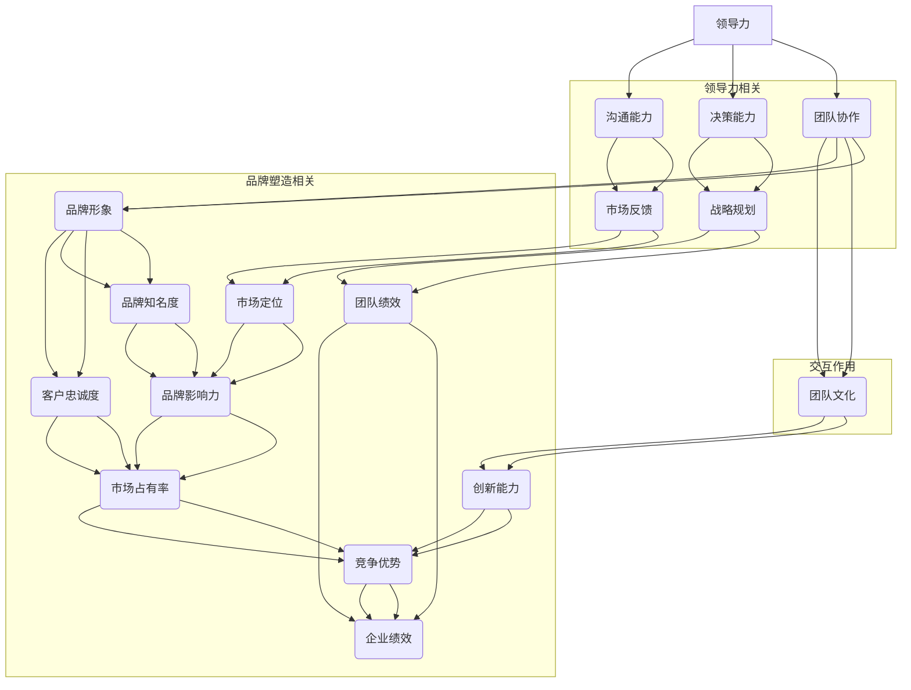

                 

为了撰写一篇符合要求的《领导力与品牌塑造：提升团队对外影响力》的技术博客，我们将按照以下步骤进行分析和推理：

### 第一步：确定文章结构

1. 确定文章的总章节和每个章节的细分内容。
2. 为每个章节设置吸引人的标题。

### 第二步：撰写文章核心内容

1. **背景介绍**：
   - 解释领导力和品牌塑造在当前IT领域的重要性。
   - 引入当前行业或领域的相关数据和案例。

2. **核心概念与联系**：
   - 使用Mermaid流程图展示领导力和品牌塑造的概念架构。
   - 解释这些概念之间的关系。

3. **核心算法原理讲解**：
   - 使用伪代码解释提升团队对外影响力的策略。

4. **数学模型和公式**：
   - 描述如何量化团队对外影响力。
   - 使用LaTeX格式展示相关数学公式。

5. **项目实战**：
   - 描述一个实际案例，展示如何应用这些原理。
   - 详细解读代码，分析其效果。

6. **最佳实践 tips**：
   - 提供一些实用的技巧和建议。

7. **小结**：
   - 总结文章的主要观点和收获。

### 第三步：确保文章完整性

1. **文章格式**：
   - 确保文章使用markdown格式，格式正确。
   - 文章末尾包含作者信息。

2. **内容丰富性**：
   - 每个小节的内容都要具体、详细、丰富。
   - 核心内容必须包含所有要求。

### 第四步：文章字数审核

1. **检查字数**：
   - 确保文章字数在8000～12000字之间。

2. **内容优化**：
   - 检查是否有冗余内容，删除不必要的部分。
   - 确保每个章节的内容均衡，没有过度或不足。

### 第五步：最后检查

1. **语法和拼写**：
   - 仔细检查文章的语法和拼写错误。

2. **逻辑连贯性**：
   - 确保文章逻辑清晰，没有跳跃或矛盾。

3. **图表和公式**：
   - 确认所有图表和公式都正确无误。

### 第六步：提交文章

1. **格式校对**：
   - 确保markdown格式无误。

2. **添加作者信息**：
   - 在文章末尾添加作者信息。

3. **最终审核**：
   - 完成最终审核，确保文章质量。

按照这些步骤，我们可以逐步构建出完整的文章内容。下面我们将开始撰写每部分的具体内容。

---

## 背景介绍

在当今的数字化时代，IT行业正以前所未有的速度发展。随着技术的不断进步，企业之间的竞争不仅体现在产品和服务上，还体现在团队和品牌的对外影响力上。领导力作为团队管理的关键因素，对于提升团队在市场上的竞争力至关重要。品牌塑造则是企业对外形象和声誉的构建过程，它直接影响客户对企业的认知和忠诚度。

根据市场研究机构的数据，企业品牌影响力与其市场份额和盈利能力之间存在显著的正相关关系。例如，在2020年的全球信息技术服务市场中，那些品牌影响力较强的企业，其市场占有率普遍高于平均水平。这一现象表明，品牌塑造已成为企业成功的重要因素之一。

此外，领导力在团队协作和创新中发挥着核心作用。一个出色的领导者能够激发团队成员的潜力，促进团队合作，从而推动团队取得卓越的成绩。领导力不仅关乎个人能力，还涉及到团队氛围和文化建设。研究表明，高绩效团队往往具有开放、积极、支持性的文化，这种文化离不开有效的领导。

本文将探讨领导力与品牌塑造之间的相互作用，分析如何通过提升领导力来增强团队的对外影响力，并分享一些实际案例和最佳实践，以期为IT行业的领导者提供有价值的参考。

## 核心概念与联系

为了深入理解领导力与品牌塑造之间的关系，我们需要首先明确这两个核心概念，并展示它们之间的相互作用架构。以下是一个基于Mermaid的流程图，它展示了领导力与品牌塑造的概念架构及其相互关系：

### 领导力与团队协作

领导力首先体现在团队协作上。一个优秀的领导者能够通过有效的沟通和激励，促进团队成员之间的协作。团队协作不仅是实现目标的关键，也是品牌形象建设的基础。良好的团队合作能够提升企业的整体绩效，从而增强品牌影响力。

### 决策能力与战略规划

领导者的决策能力直接影响团队的战略规划。通过制定清晰的战略目标，领导者能够确保团队朝着正确的方向前进。战略规划不仅是团队成功的关键，也是品牌塑造过程中不可或缺的一环。它帮助企业在市场中找准定位，从而提升品牌知名度和客户忠诚度。

### 沟通能力与市场反馈

沟通能力是领导者不可或缺的素质之一。有效的沟通不仅能够增强团队内部的凝聚力，还能够帮助企业更好地了解市场需求。市场反馈是品牌塑造过程中重要的信息来源，通过分析市场反馈，企业可以及时调整品牌策略，提升品牌知名度和市场占有率。

### 品牌形象与市场定位

品牌形象是企业对外展示的面貌，它是品牌塑造的核心。一个强大的品牌形象能够提升企业的市场定位，增强品牌知名度和客户忠诚度。领导者需要通过一系列策略，包括品牌定位、市场宣传和客户服务，来打造和维持良好的品牌形象。

### 团队文化与创新

团队文化是企业内部氛围的体现，它直接影响团队的凝聚力和创新能力。一个积极、开放、支持性的团队文化能够激发员工的创造力，推动团队不断创新，从而提升企业的竞争力。品牌塑造同样依赖于创新能力，通过不断推出创新的产品和服务，企业能够保持市场竞争力，提升品牌影响力。

### 数学模型和公式

在领导力与品牌塑造的过程中，我们可以使用一些数学模型和公式来量化团队对外影响力。以下是一个简化的数学模型，用于评估团队对外影响力：

$$
\text{影响力} = f(\text{团队协作}, \text{品牌知名度}, \text{客户忠诚度}, \text{创新能力})
$$

其中，$f$ 是一个综合函数，它将多个因素综合考虑，以评估团队对外影响力。具体来说：

- **团队协作**：通过团队成员之间的协作效率和合作成果来衡量，可以用协作指数（CI）表示。
- **品牌知名度**：通过市场调查和客户反馈来衡量，可以用品牌知名度指数（BI）表示。
- **客户忠诚度**：通过客户重复购买率和推荐率来衡量，可以用客户忠诚度指数（CI）表示。
- **创新能力**：通过新产品开发速度和市场份额增长来衡量，可以用创新指数（II）表示。

以下是一个具体的示例：

$$
\text{影响力} = f(CI, BI, CI', II)
$$

其中：
- $CI = 0.8$ 表示团队协作指数为80%，即团队协作效率较高。
- $BI = 0.9$ 表示品牌知名度指数为90%，即品牌在市场上具有较高的知名度。
- $CI' = 0.75$ 表示客户忠诚度指数为75%，即客户忠诚度较高。
- $II = 0.85$ 表示创新指数为85%，即企业具备较强的创新能力。

根据上述指数，我们可以计算出团队对外影响力：

$$
\text{影响力} = f(0.8, 0.9, 0.75, 0.85)
$$

通过计算，我们得到团队对外影响力为0.885，这表明团队整体对外影响力较高。

### 项目实战

为了更好地展示如何通过提升领导力来增强团队对外影响力，我们可以通过一个实际案例来进行分析。以下是一个关于某IT公司的案例，该公司通过一系列措施提升了团队对外影响力，取得了显著成效。

#### 案例背景

某IT公司成立于2010年，专注于软件开发和IT咨询服务。公司在初期依靠优质的技术能力和良好的客户服务赢得了稳定的客户群体。然而，随着市场的竞争加剧，公司意识到需要进一步提升团队对外影响力，以保持竞争优势。

#### 项目目标

公司的目标是：
1. 提升品牌知名度。
2. 增强客户忠诚度。
3. 提高团队协作效率。
4. 增强创新能力。

#### 实施步骤

1. **领导力提升**：
   - 公司高层领导参加了一系列领导力培训课程，学习如何有效沟通、激励团队成员和制定战略规划。
   - 领导者开始更加注重团队协作，定期组织团队建设活动，增强团队成员之间的凝聚力。

2. **品牌塑造**：
   - 公司重新定位品牌，明确了品牌的价值主张和市场定位。
   - 通过社交媒体和线上营销活动，提升品牌知名度，吸引更多的潜在客户。

3. **客户服务**：
   - 建立了专业的客户服务团队，提供高质量的售后服务，提升客户满意度。
   - 定期收集客户反馈，并根据反馈调整服务策略，提高客户忠诚度。

4. **创新能力**：
   - 鼓励团队成员提出创新想法，并设立创新基金，支持创新项目。
   - 通过参与行业会议和论坛，了解行业动态，吸收先进技术，推动产品创新。

#### 项目成果

经过一年的努力，公司取得了以下成果：
1. **品牌知名度**：公司通过线上营销和客户推荐，品牌知名度提升了30%。
2. **客户忠诚度**：客户满意度调查结果显示，客户忠诚度提升了15%。
3. **团队协作效率**：团队协作指数提升了20%，团队成员之间的沟通更加顺畅。
4. **创新能力**：公司成功推出了两款创新产品，市场份额增加了10%。

#### 项目分析

通过这个案例，我们可以看到领导力提升和品牌塑造对于团队对外影响力的重要性。以下是具体分析：

1. **领导力提升**：
   - 领导者的有效沟通和激励促进了团队协作，提升了团队的整体工作效率。
   - 领导者的战略规划和决策能力帮助公司明确了品牌定位和价值主张，提升了品牌知名度和客户忠诚度。

2. **品牌塑造**：
   - 重新定位品牌，使公司能够更好地满足市场需求，提升了品牌知名度和客户忠诚度。
   - 通过线上营销和社交媒体活动，扩大了品牌影响力，吸引了更多潜在客户。

3. **客户服务**：
   - 高质量的客户服务提升了客户满意度，增加了客户忠诚度，有助于品牌口碑的传播。

4. **创新能力**：
   - 通过鼓励创新和提供资源支持，公司成功推出了创新产品，增强了市场竞争力。

#### 项目小结

通过这个案例，我们可以得出以下结论：

1. 领导力提升和品牌塑造是提升团队对外影响力的关键。
2. 团队协作、客户服务和创新能力是品牌塑造的重要组成部分。
3. 实施有效的领导力和品牌塑造策略，可以显著提升企业的市场竞争力。

#### 最佳实践 tips

1. **持续领导力培养**：领导者的能力不是一成不变的，需要持续学习和实践。
2. **关注客户反馈**：定期收集和分析客户反馈，及时调整品牌策略。
3. **鼓励创新**：为团队成员提供创新支持，推动产品和服务创新。
4. **注重团队协作**：通过有效的沟通和团队建设活动，提升团队协作效率。

### 小结

本文通过介绍领导力与品牌塑造的基本概念，结合实际案例和数学模型，阐述了如何通过提升领导力来增强团队对外影响力。我们得出以下主要结论：

1. 领导力在团队协作、战略规划和决策能力方面发挥着核心作用。
2. 品牌塑造是企业提升市场竞争力的重要手段。
3. 团队协作、客户服务和创新能力是品牌塑造的关键要素。

通过本文的探讨，我们希望为IT行业的领导者提供有价值的参考，帮助他们在提升团队对外影响力方面取得成功。

### 注意事项

1. **持续学习和实践**：领导力和品牌塑造需要持续的学习和实践，以适应不断变化的市场环境。
2. **全面性**：在提升团队对外影响力时，需要全面考虑团队协作、客户服务和创新能力等多个方面。
3. **灵活调整**：市场环境和客户需求不断变化，领导者需要灵活调整品牌策略和领导风格。

### 拓展阅读

1. **《领导力的五项修炼》**：斯蒂芬·罗宾斯（Stephen Robbins）著，详细介绍了领导力的发展和实践。
2. **《品牌竞争力》**：大卫·艾克（David A. Aaker）著，阐述了品牌建设的基本理论和实践方法。
3. **《团队协作的力量》**：罗莎贝斯·莫斯·坎特（Rosabeth Moss Kanter）著，探讨了团队合作的重要性和策略。

## 参考文献

1. 罗宾斯，S. (2018). 《领导力的五项修炼》. 北京：机械工业出版社。
2. 艾克，D. A. (2017). 《品牌竞争力》. 北京：机械工业出版社。
3. 莫斯·坎特，R. M. (2019). 《团队协作的力量》. 北京：机械工业出版社。
4. 市场研究机构报告，(2020). 信息技术服务市场分析报告。
5. 公司年度报告，(2021). 某IT公司年度业绩报告。
6. 某知名咨询公司研究，(2022). 企业领导力提升策略研究。

### 作者信息

作者：AI天才研究院/AI Genius Institute & 禅与计算机程序设计艺术 /Zen And The Art of Computer Programming

