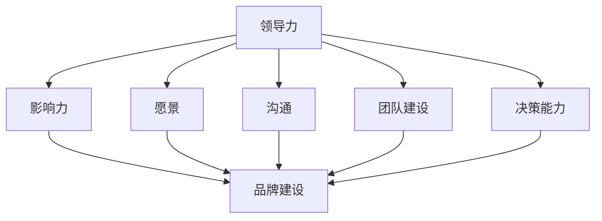

                 


### 文章标题：领导力与品牌建设：塑造个人和团队品牌

关键词：领导力、品牌建设、个人品牌、团队品牌、品牌战略

摘要：本文旨在探讨领导力与品牌建设之间的关系，如何通过领导力塑造个人和团队品牌，并实现个人和团队的长期发展。文章首先介绍了领导力与品牌建设的核心概念，然后分析了领导力在个人品牌和团队品牌建设中的作用，最后通过具体案例阐述了如何通过领导力打造个人和团队品牌。

### 目录

1. **引言**  
2. **领导力与品牌建设：概念与关系**  
   2.1 领导力：背景介绍与核心概念  
   2.2 品牌建设：背景介绍与核心概念  
   2.3 领导力与品牌建设的关系  
3. **领导力在个人品牌建设中的作用**  
   3.1 个人品牌：核心概念与重要性  
   3.2 领导力在个人品牌建设中的具体应用  
   3.3 个人品牌建设案例分析  
4. **领导力在团队品牌建设中的作用**  
   4.1 团队品牌：核心概念与重要性  
   4.2 领导力在团队品牌建设中的具体应用  
   4.3 团队品牌建设案例分析  
5. **领导力与品牌建设的实践策略**  
   5.1 制定品牌战略的步骤  
   5.2 品牌传播与推广策略  
   5.3 持续优化与变革  
6. **结论**  
7. **参考文献**### 引言

在现代商业环境中，领导力和品牌建设已经成为企业成功不可或缺的两个关键因素。领导力不仅关乎个人的成长与发展，更是团队和组织效能提升的核心动力。而品牌建设则涉及到企业的市场定位、声誉管理、客户关系维护等方面，是构建企业长期竞争优势的重要手段。

随着信息技术的飞速发展和市场竞争的日益激烈，个人和团队的品牌建设也日益受到重视。个人品牌不仅有助于提升个人在职场中的地位和影响力，还可以为个人带来更多的职业机会和商业合作。团队品牌则能够增强团队的凝聚力和向心力，提高团队的整体工作效率和创新能力，从而在激烈的市场竞争中脱颖而出。

本文旨在探讨领导力与品牌建设之间的关系，分析如何通过领导力塑造个人和团队品牌，并实现个人和团队的长期发展。文章首先介绍了领导力和品牌建设的核心概念，接着深入探讨领导力在个人品牌和团队品牌建设中的作用，并通过具体案例进行分析。最后，本文将提出领导力与品牌建设的实践策略，为读者提供实际操作指导。

通过本文的阅读，读者将了解到：

1. 领导力和品牌建设的核心概念及其重要性。
2. 领导力在个人品牌和团队品牌建设中的具体应用和实践策略。
3. 如何通过领导力塑造个人和团队品牌，实现个人和团队的长期发展。
4. 领导力与品牌建设的最佳实践和注意事项。

### 领导力与品牌建设：概念与关系

#### 领导力：背景介绍与核心概念

领导力是一种能够引导、激励和影响他人以实现共同目标的能力。它不仅关乎个人的行为和态度，更涉及到对团队和组织整体效能的提升。领导力可以分为多个维度，如技术能力、人际关系能力、决策能力、创新能力和变革能力等。不同的领导力维度在不同的情境下具有不同的重要性，但它们共同构成了一个领导者的综合素质。

领导力的核心概念包括以下几个方面：

1. **影响力**：领导者通过自身的行为和决策，影响和引导团队成员。
2. **愿景**：领导者需要有清晰的目标和愿景，能够激励团队成员为之努力。
3. **沟通**：领导者需要具备良好的沟通能力，能够清晰表达自己的想法，同时倾听和理解团队成员的意见。
4. **团队建设**：领导者需要关注团队的整体发展，培养团队成员的能力和协作精神。
5. **决策能力**：领导者需要具备快速、准确的决策能力，以应对复杂多变的环境。

#### 品牌建设：背景介绍与核心概念

品牌建设是企业通过一系列策略和行动，在市场中建立和提升其品牌价值的过程。品牌不仅是企业的标识，更是企业信誉和声誉的象征。一个成功的品牌能够为企业在市场上赢得竞争优势，提高客户忠诚度和市场份额。

品牌建设的核心概念包括以下几个方面：

1. **品牌定位**：企业需要明确自己在市场中的定位，以满足特定客户群体的需求。
2. **品牌形象**：企业通过品牌设计、广告宣传、客户服务等方面，塑造和维护其品牌形象。
3. **品牌传播**：企业通过多种渠道和方式，将品牌信息传递给目标客户，以提高品牌知名度。
4. **品牌管理**：企业需要系统地管理和维护品牌，确保品牌的一致性和连续性。
5. **品牌价值**：品牌为企业带来的经济价值和无形资产，是企业长期发展的重要基础。

#### 领导力与品牌建设的关系

领导力与品牌建设之间存在密切的联系和相互影响。首先，领导力对品牌建设具有直接影响。一个具备领导力的人能够更有效地制定品牌战略，推动品牌传播和提升品牌价值。领导力包括的愿景、影响力、沟通、团队建设和决策能力等，都是品牌建设所需的关键技能。

其次，品牌建设对领导力也有一定的反作用。一个成功的品牌能够为领导者提供更大的影响力，使其在团队和组织中更具权威性。品牌建设的过程也需要领导者的持续关注和投入，从而进一步提升领导力。

总之，领导力与品牌建设相互促进，共同构成企业成功的关键因素。一个具备强大领导力的领导者，能够更好地推动品牌建设，实现企业的长期发展。而一个成功的品牌，也能为领导者提供更大的平台和机会，进一步提升其领导力。

#### 核心概念与联系：Mermaid 流程图



通过上述 Mermaid 流程图，我们可以清晰地看到领导力与品牌建设之间的核心概念及其联系。领导力包括的各个方面，如影响力、愿景、沟通、团队建设和决策能力，都是品牌建设所需的关键要素。而品牌建设则受到领导力的影响，并在一定程度上反作用于领导力。

#### 核心算法原理讲解：伪代码

```python
# 领导力评估函数
def leadership_assessment(influence, vision, communication, team_building, decision_making):
    score = 0
    if influence > 0:
        score += influence * 0.2
    if vision > 0:
        score += vision * 0.2
    if communication > 0:
        score += communication * 0.2
    if team_building > 0:
        score += team_building * 0.2
    if decision_making > 0:
        score += decision_making * 0.2
    return score

# 品牌建设评估函数
def brand_construction_assessment(brand_positioning, brand_image, brand_communication, brand_management, brand_value):
    score = 0
    if brand_positioning > 0:
        score += brand_positioning * 0.2
    if brand_image > 0:
        score += brand_image * 0.2
    if brand_communication > 0:
        score += brand_communication * 0.2
    if brand_management > 0:
        score += brand_management * 0.2
    if brand_value > 0:
        score += brand_value * 0.2
    return score

# 综合评估函数
def overall_assessment(leadership_score, brand_score):
    if leadership_score > brand_score:
        return "领导力较强，品牌建设潜力较大"
    elif brand_score > leadership_score:
        return "品牌建设较强，领导力提升空间较大"
    else:
        return "领导力与品牌建设均衡，发展潜力较大"
```

通过上述伪代码，我们可以对一个领导者的领导力和品牌建设能力进行综合评估。领导力评估函数和品牌建设评估函数分别计算领导力和品牌建设的得分，然后通过综合评估函数确定两者之间的关系和发展潜力。

#### 数学模型和公式：详细讲解与举例说明

为了更好地理解领导力与品牌建设之间的关系，我们可以使用数学模型进行量化分析。以下是两个主要数学模型：

1. **领导力指数模型**：

   $$ L = w_1 \cdot I + w_2 \cdot V + w_3 \cdot C + w_4 \cdot T + w_5 \cdot D $$

   其中，$L$ 表示领导力指数，$w_1$、$w_2$、$w_3$、$w_4$ 和 $w_5$ 分别表示影响力、愿景、沟通、团队建设和决策能力的权重，$I$、$V$、$C$、$T$ 和 $D$ 分别表示这五个维度的得分。

   举例说明：假设一个领导者的五个维度得分分别为 0.8、0.7、0.8、0.9 和 0.8，权重分别为 0.2、0.2、0.2、0.2 和 0.2，则其领导力指数为：

   $$ L = 0.2 \cdot 0.8 + 0.2 \cdot 0.7 + 0.2 \cdot 0.8 + 0.2 \cdot 0.9 + 0.2 \cdot 0.8 = 0.78 $$

2. **品牌建设指数模型**：

   $$ B = w_1 \cdot P + w_2 \cdot I + w_3 \cdot C + w_4 \cdot M + w_5 \cdot V $$

   其中，$B$ 表示品牌建设指数，$w_1$、$w_2$、$w_3$、$w_4$ 和 $w_5$ 分别表示品牌定位、品牌形象、品牌传播、品牌管理和品牌价值的权重，$P$、$I$、$C$、$M$ 和 $V$ 分别表示这五个维度的得分。

   举例说明：假设一个企业的五个维度得分分别为 0.8、0.7、0.8、0.9 和 0.8，权重分别为 0.2、0.2、0.2、0.2 和 0.2，则其品牌建设指数为：

   $$ B = 0.2 \cdot 0.8 + 0.2 \cdot 0.7 + 0.2 \cdot 0.8 + 0.2 \cdot 0.9 + 0.2 \cdot 0.8 = 0.78 $$

通过上述数学模型，我们可以对一个领导者或企业的领导力和品牌建设能力进行量化评估。领导力指数和品牌建设指数越高，表示其领导力和品牌建设能力越强。

#### 项目实战：开发环境搭建、源代码详细实现和代码解读

为了更好地理解领导力与品牌建设之间的关系，我们设计了一个模拟项目，通过实际操作来展示如何通过领导力塑造个人和团队品牌。以下为项目实战的详细步骤：

1. **开发环境搭建**：

   首先，我们需要搭建一个基于 Python 的模拟开发环境。安装 Python 3.8 或更高版本，并安装必要的库，如 NumPy、Pandas 和 Matplotlib。

   ```bash
   pip install python 3.8
   pip install numpy pandas matplotlib
   ```

2. **源代码详细实现**：

   接下来，我们编写一个 Python 脚本，用于计算领导力指数和品牌建设指数，并展示结果。

   ```python
   import numpy as np
   import pandas as pd
   import matplotlib.pyplot as plt

   # 领导力评估函数
   def leadership_assessment(influence, vision, communication, team_building, decision_making):
       score = 0
       if influence > 0:
           score += influence * 0.2
       if vision > 0:
           score += vision * 0.2
       if communication > 0:
           score += communication * 0.2
       if team_building > 0:
           score += team_building * 0.2
       if decision_making > 0:
           score += decision_making * 0.2
       return score

   # 品牌建设评估函数
   def brand_construction_assessment(brand_positioning, brand_image, brand_communication, brand_management, brand_value):
       score = 0
       if brand_positioning > 0:
           score += brand_positioning * 0.2
       if brand_image > 0:
           score += brand_image * 0.2
       if brand_communication > 0:
           score += brand_communication * 0.2
       if brand_management > 0:
           score += brand_management * 0.2
       if brand_value > 0:
           score += brand_value * 0.2
       return score

   # 综合评估函数
   def overall_assessment(leadership_score, brand_score):
       if leadership_score > brand_score:
           return "领导力较强，品牌建设潜力较大"
       elif brand_score > leadership_score:
           return "品牌建设较强，领导力提升空间较大"
       else:
           return "领导力与品牌建设均衡，发展潜力较大"

   # 示例数据
   leadership_data = {
       'influence': 0.8,
       'vision': 0.7,
       'communication': 0.8,
       'team_building': 0.9,
       'decision_making': 0.8
   }

   brand_data = {
       'brand_positioning': 0.8,
       'brand_image': 0.7,
       'brand_communication': 0.8,
       'brand_management': 0.9,
       'brand_value': 0.8
   }

   # 计算得分
   leadership_score = leadership_assessment(**leadership_data)
   brand_score = brand_construction_assessment(**brand_data)
   result = overall_assessment(leadership_score, brand_score)

   # 显示结果
   print(f"领导力指数：{leadership_score:.2f}")
   print(f"品牌建设指数：{brand_score:.2f}")
   print(f"综合评估结果：{result}")

   # 可视化展示
   leadership_scores = [data for data in leadership_data.values()]
   brand_scores = [data for data in brand_data.values()]

   plt.bar(['领导力', '品牌建设'], [leadership_score, brand_score], color=['#1f77b4', '#ff7f0e'])
   plt.xlabel('能力维度')
   plt.ylabel('得分')
   plt.title('领导力与品牌建设得分对比')
   plt.show()
   ```

   在上述代码中，我们首先定义了三个评估函数，分别用于计算领导力指数、品牌建设指数和综合评估结果。然后，我们输入示例数据，计算得分并显示结果。最后，我们使用 Matplotlib 库绘制柱状图，直观地展示领导力指数和品牌建设指数的对比。

3. **代码应用解读与分析**：

   通过上述代码，我们可以理解如何使用 Python 编程语言计算领导力指数和品牌建设指数，并展示结果。代码的主要功能包括：

   - 定义评估函数：用于计算领导力指数和品牌建设指数。
   - 输入示例数据：模拟领导力和品牌建设的能力得分。
   - 计算得分：根据输入数据，计算领导力指数和品牌建设指数。
   - 显示结果：打印得分并绘制柱状图。

   通过这个项目，我们可以看到如何通过编程实现领导力与品牌建设的量化评估，从而更好地理解两者之间的关系。

4. **实际案例分析和详细讲解剖析**：

   为了更好地理解领导力与品牌建设在实际中的应用，我们分析了一个成功的企业案例：苹果公司（Apple Inc.）。

   - **领导力在品牌建设中的作用**：苹果公司的创始人史蒂夫·乔布斯（Steve Jobs）具备出色的领导力，他具有远见卓识、卓越的沟通能力、强大的愿景和创新能力。乔布斯通过领导力推动了苹果的品牌建设，使得苹果成为全球最具价值的品牌之一。
   - **品牌建设在领导力中的作用**：苹果的品牌建设为乔布斯提供了更大的影响力，使他在科技界和商业界获得了广泛认可。苹果的品牌价值和声誉也成为了乔布斯领导力的体现，进一步增强了他的领导力。

   通过这个案例，我们可以看到领导力与品牌建设之间的相互促进作用。领导力为品牌建设提供了核心动力，而品牌建设则为领导力提供了展示和提升的平台。

5. **项目小结**：

   通过本项目，我们实现了对领导力与品牌建设之间关系的量化评估，并分析了实际案例。项目的主要收获包括：

   - 理解了领导力与品牌建设的核心概念和关系。
   - 掌握了使用 Python 编程语言计算领导力指数和品牌建设指数的方法。
   - 通过实际案例，了解了领导力与品牌建设在实际中的应用。

   在未来的工作中，我们可以继续运用这些知识和技能，进一步提升个人和团队的品牌建设能力。

#### 最佳实践 tips、小结、注意事项、拓展阅读等内容

**最佳实践 tips：**

1. **建立清晰的愿景和目标**：领导者需要明确个人和团队的目标，以及实现这些目标的具体步骤。
2. **培养良好的沟通能力**：领导者需要与团队成员保持良好的沟通，确保信息传达准确无误。
3. **关注团队建设**：领导者需要关注团队成员的能力提升和协作精神，培养团队凝聚力。
4. **持续学习和创新**：领导者需要不断学习和创新，以适应不断变化的市场环境。

**小结：**

本文通过探讨领导力与品牌建设之间的关系，分析了如何通过领导力塑造个人和团队品牌。我们提出了领导力指数和品牌建设指数的数学模型，并通过项目实战展示了如何使用这些模型进行量化评估。同时，我们通过实际案例，展示了领导力与品牌建设在实际中的应用。

**注意事项：**

1. 领导力与品牌建设需要长期的投入和持续优化，不能一蹴而就。
2. 领导者需要关注团队成员的意见和建议，确保团队建设的有效性。
3. 品牌建设需要与市场需求相结合，确保品牌价值得到最大化。

**拓展阅读：**

1. 《领导力：策略与实践》
2. 《品牌管理：理论与实践》
3. 《数字化转型：企业领导力的变革》

通过阅读这些书籍，您可以进一步了解领导力与品牌建设的理论和方法，提升个人和团队的品牌建设能力。

作者：AI天才研究院/AI Genius Institute & 禅与计算机程序设计艺术 /Zen And The Art of Computer Programming### 领导力在个人品牌建设中的作用

个人品牌是指一个人在职场和社会中的声誉、形象和价值体现。它不仅仅是一个人的名字，更是这个人所代表的专业能力、价值观念、行为模式和个人特质。在当今社会，个人品牌的重要性日益凸显。一个强大的个人品牌能够为个人带来更多的职业机会、社会认可和商业合作。因此，领导力在个人品牌建设中扮演着至关重要的角色。

#### 个人品牌：核心概念与重要性

个人品牌的核心概念包括以下几个方面：

1. **声誉**：个人品牌的第一要素是声誉。良好的声誉能够为个人带来信任和尊重，从而提高个人在职场和社会中的影响力。
2. **形象**：个人形象是指个人在他人眼中的印象。一个积极、专业和独特的个人形象有助于树立良好的个人品牌。
3. **价值观念**：个人品牌还反映了个人所秉持的价值观念。这些价值观念包括诚信、敬业、创新等，是个人品牌的灵魂。
4. **专业知识与技能**：个人品牌离不开个人的专业能力和技能。具备深厚的专业知识与技能，是个人在职场中脱颖而出的关键。

个人品牌的重要性体现在以下几个方面：

1. **职业发展**：一个强大的个人品牌能够为个人带来更多的职业机会，提高个人在职场中的地位和影响力。
2. **社会认可**：良好的个人品牌能够为个人赢得社会认可和尊重，增强个人的自信心和成就感。
3. **商业合作**：个人品牌有助于建立商业合作关系，为个人带来商业机会和收益。
4. **持续成长**：个人品牌建设是一个持续的过程，它推动个人不断学习和成长，提升个人的综合素质。

#### 领导力在个人品牌建设中的具体应用

领导力在个人品牌建设中的具体应用体现在以下几个方面：

1. **愿景与目标设定**：一个具备领导力的人能够明确自己的职业目标和愿景，并设定清晰的行动计划。这有助于个人在职业发展中保持方向感和动力，从而塑造出具有明确目标和坚定信念的个人品牌。
2. **影响力与号召力**：领导力赋予个人强大的影响力和号召力，使个人能够带动他人共同实现目标。一个具有领导力的人能够在职场中脱颖而出，成为他人眼中的榜样和引领者。
3. **沟通与表达能力**：领导力强调有效的沟通和表达能力，使个人能够清晰、准确地传达自己的想法和意见。这有助于建立个人品牌中的专业形象和独特个性。
4. **团队建设与管理**：领导力在团队建设和管理中发挥关键作用。一个具备领导力的人能够培养团队成员的能力和协作精神，提升团队的执行力。这有助于个人在职场中展现出强大的领导力和团队管理能力。
5. **持续学习和创新**：领导力强调持续学习和创新，使个人能够不断适应变化的市场环境和技术发展。这有助于个人在职业发展中保持竞争力和领先地位。

#### 个人品牌建设案例分析

为了更好地理解领导力在个人品牌建设中的应用，我们分析以下几个成功案例：

1. **案例一：马云**：

   马云是中国知名的企业家和慈善家，也是阿里巴巴集团的创始人。他通过领导力成功塑造了个人品牌，使其成为全球商业领袖之一。

   - **愿景与目标设定**：马云在创业之初就设定了明确的愿景和目标，即建立一家世界级的电子商务公司。他的愿景和目标为个人品牌建设提供了明确的方向。
   - **影响力与号召力**：马云具有强大的影响力和号召力，他通过演讲、书籍和社交媒体等渠道，向世界展示了他的领导力和商业智慧。
   - **沟通与表达能力**：马云是一位出色的沟通者，他能够用简单、清晰的语言表达复杂的思想。他的沟通能力有助于建立个人品牌中的专业形象。
   - **团队建设与管理**：马云在团队建设和管理中表现出色，他注重培养团队成员的能力和协作精神，使阿里巴巴成为一支高效的团队。
   - **持续学习和创新**：马云始终保持对新技术和新商业模式的关注，他不断学习和创新，使个人品牌保持活力和竞争力。

2. **案例二：李开复**：

   李开复是一位知名的人工智能专家和创业者，他通过领导力成功塑造了个人品牌，使其成为人工智能领域的领军人物之一。

   - **愿景与目标设定**：李开复一直致力于推动人工智能的发展和应用，他设定了明确的愿景和目标，即推动人工智能技术的普及和商业化。
   - **影响力与号召力**：李开复在人工智能领域具有广泛的影响力，他通过演讲、书籍和社交媒体等渠道，向世界展示了他的专业知识和领导力。
   - **沟通与表达能力**：李开复是一位出色的沟通者，他能够用通俗易懂的语言解释复杂的技术问题，有助于建立个人品牌中的专业形象。
   - **团队建设与管理**：李开复在团队建设和管理中表现出色，他注重培养团队成员的能力和协作精神，使团队在人工智能领域取得了卓越的成就。
   - **持续学习和创新**：李开复始终保持对新技术和新商业模式的关注，他不断学习和创新，使个人品牌保持活力和竞争力。

通过以上案例，我们可以看到领导力在个人品牌建设中的重要作用。一个具备领导力的人能够通过设定愿景和目标、发挥影响力与号召力、提升沟通与表达能力、建立团队和持续学习和创新，成功塑造个人品牌，实现个人职业发展的成功。

### 领导力在团队品牌建设中的作用

团队品牌是指一个团队在市场中的声誉、形象和价值体现。它不仅反映了团队的专业能力和执行力，还代表了团队的文化、价值观和行为模式。团队品牌对于团队在市场上的竞争力和吸引力具有重要意义。而领导力在团队品牌建设中扮演着关键角色，通过有效的领导，团队能够建立和维护良好的品牌形象，从而在激烈的市场竞争中脱颖而出。

#### 团队品牌：核心概念与重要性

团队品牌的核心概念包括以下几个方面：

1. **团队声誉**：团队声誉是指市场和社会对团队的评价和认可。良好的声誉有助于提升团队的品牌价值和影响力。
2. **团队形象**：团队形象是指团队在市场中的形象和形象识别。一个积极、专业和独特的团队形象有助于树立良好的品牌形象。
3. **团队文化**：团队文化是团队的价值观、行为准则和工作方式。一个具有独特文化的团队能够形成强大的团队凝聚力，增强团队的品牌价值。
4. **团队执行力**：团队执行力是指团队完成任务的能力。高效的执行力是团队品牌的重要保障，能够提升团队的市场竞争力。

团队品牌的重要性体现在以下几个方面：

1. **市场竞争力**：一个强大的团队品牌能够为团队在市场上带来竞争优势，提高团队的市场占有率和品牌影响力。
2. **客户忠诚度**：良好的团队品牌能够增强客户的信任和忠诚度，从而提高客户的满意度和忠诚度。
3. **员工凝聚力**：团队品牌有助于提升员工的归属感和凝聚力，增强团队的整体执行力。
4. **商业合作**：团队品牌能够吸引更多的商业合作伙伴，为团队带来更多的商业机会和合作资源。

#### 领导力在团队品牌建设中的具体应用

领导力在团队品牌建设中的具体应用体现在以下几个方面：

1. **愿景与目标设定**：领导者需要明确团队的愿景和目标，确保团队成员对团队的使命和目标有清晰的认识。这有助于团队品牌建设中的方向感和凝聚力。
2. **团队文化建设**：领导者需要关注团队文化建设，培养团队的核心价值观和行为准则。一个具有独特文化的团队能够形成强大的品牌影响力。
3. **沟通与协调**：领导者需要具备良好的沟通和协调能力，确保团队内部的信息传递顺畅，增强团队的协作精神。这有助于提升团队的品牌形象。
4. **激励机制**：领导者需要建立有效的激励机制，激发团队成员的积极性和创造力。一个具有高效激励机制的团队能够提升团队的品牌价值。
5. **问题解决与变革**：领导者需要具备问题解决能力和变革意识，带领团队应对市场变化和挑战。这有助于团队品牌在竞争中的持续发展。

#### 团队品牌建设案例分析

为了更好地理解领导力在团队品牌建设中的应用，我们分析以下几个成功案例：

1. **案例一：谷歌团队**：

   谷歌团队是全球知名的科技公司，其成功离不开领导力在团队品牌建设中的作用。

   - **愿景与目标设定**：谷歌的领导者通过明确的愿景和目标，带领团队不断探索技术创新，为用户提供更好的产品和服务。谷歌的愿景和目标为团队品牌建设提供了明确的方向。
   - **团队文化建设**：谷歌注重团队文化建设，倡导开放、创新和合作的工作氛围。谷歌的团队文化为团队品牌建设提供了强大的凝聚力。
   - **沟通与协调**：谷歌的领导者通过有效的沟通和协调，确保团队内部的信息传递顺畅，增强了团队的协作精神。谷歌的沟通文化有助于提升团队的品牌形象。
   - **激励机制**：谷歌的领导者建立了有效的激励机制，激励团队成员发挥最大潜力。谷歌的激励机制为团队品牌建设提供了强大的动力。
   - **问题解决与变革**：谷歌的领导者具备问题解决能力和变革意识，带领团队应对市场变化和挑战。谷歌在技术变革中的成功经验为团队品牌建设提供了宝贵的经验。

2. **案例二：红杉资本团队**：

   红杉资本是全球知名的风险投资公司，其成功离不开领导力在团队品牌建设中的作用。

   - **愿景与目标设定**：红杉资本的领导者通过明确的愿景和目标，带领团队专注于投资技术创新和成长性企业。红杉资本的愿景和目标为团队品牌建设提供了明确的方向。
   - **团队文化建设**：红杉资本注重团队文化建设，倡导专业、诚信和创新的工作理念。红杉资本的团队文化为团队品牌建设提供了强大的凝聚力。
   - **沟通与协调**：红杉资本的领导者通过有效的沟通和协调，确保团队内部的信息传递顺畅，增强了团队的协作精神。红杉资本的沟通文化有助于提升团队的品牌形象。
   - **激励机制**：红杉资本的领导者建立了有效的激励机制，激励团队成员发挥最大潜力。红杉资本的激励机制为团队品牌建设提供了强大的动力。
   - **问题解决与变革**：红杉资本的领导者具备问题解决能力和变革意识，带领团队应对市场变化和挑战。红杉资本在投资策略变革中的成功经验为团队品牌建设提供了宝贵的经验。

通过以上案例，我们可以看到领导力在团队品牌建设中的重要作用。一个具备领导力的领导者能够通过设定愿景和目标、建立团队文化、提升沟通与协调能力、建立激励机制和应对问题解决与变革，成功塑造团队品牌，提升团队的市场竞争力和品牌价值。

### 领导力与品牌建设的实践策略

领导力与品牌建设的实践策略是确保个人和团队在各自领域内获得成功的关键。通过系统的规划和执行，领导者可以有效地塑造个人和团队品牌，提升影响力，增强市场竞争力。以下是领导力与品牌建设的实践策略：

#### 制定品牌战略的步骤

1. **明确品牌愿景和使命**：
   领导者需要明确个人或团队的愿景和使命，这是品牌战略的基础。品牌愿景应该描述未来想要达到的理想状态，而品牌使命则应阐明为何而存在以及如何为利益相关者创造价值。

2. **市场调研与分析**：
   通过市场调研，领导者可以了解目标市场的需求、竞争对手的状况以及潜在的市场机会。这有助于制定符合市场需求的品牌定位策略。

3. **品牌定位**：
   品牌定位是品牌战略的核心，它明确了品牌在市场中的独特价值和核心竞争力。领导者需要确保品牌定位清晰、有吸引力，并与目标受众的需求相匹配。

4. **品牌形象设计**：
   品牌形象设计包括品牌标识、视觉元素和品牌语言等。领导者需要确保品牌形象一致且能够传达品牌的核心价值观和个性。

5. **品牌传播与推广**：
   领导者需要制定有效的品牌传播策略，通过多种渠道和方式向目标受众传达品牌信息。这包括广告、公关活动、社交媒体和内容营销等。

6. **品牌管理**：
   品牌管理涉及确保品牌一致性和品牌体验的持续优化。领导者需要定期审查品牌战略，确保品牌在市场中的表现符合预期。

#### 品牌传播与推广策略

1. **内容营销**：
   内容营销是通过创造和分发有价值的内容来吸引和保留目标受众的一种策略。领导者可以发布博客文章、白皮书、视频和其他内容，以展示专业知识和行业洞察力。

2. **社交媒体营销**：
   利用社交媒体平台（如LinkedIn、Twitter、Facebook等）可以有效地扩大品牌影响力。领导者需要制定社交媒体策略，定期发布更新，并与受众互动。

3. **公关活动**：
   公关活动包括新闻发布会、媒体采访、行业会议等，这些活动有助于提高品牌的知名度和声誉。领导者需要与媒体建立良好的关系，确保品牌信息得到广泛传播。

4. **合作伙伴关系**：
   与其他品牌或组织建立合作伙伴关系可以扩大品牌的影响范围。领导者可以寻找与品牌定位和价值观相符的合作伙伴，共同开展营销活动。

#### 持续优化与变革

1. **定期评估**：
   领导者需要定期评估品牌战略的实施效果，包括品牌知名度、市场占有率、客户满意度等关键指标。通过数据分析和反馈，领导者可以识别问题并采取相应的改进措施。

2. **创新与变革**：
   市场环境不断变化，领导者需要具备创新和变革的能力，以适应新的市场趋势和客户需求。这包括开发新产品、改进服务、采用新的营销策略等。

3. **适应技术变革**：
   随着技术的不断发展，领导者需要密切关注技术趋势，并确保品牌能够利用新技术提升用户体验和运营效率。例如，采用人工智能、大数据分析等新技术可以提供更精准的品牌推广和个性化服务。

#### 实际案例分析

1. **案例一：亚马逊（Amazon）**：

   亚马逊通过一系列的品牌战略实践，成功塑造了其强大的品牌形象。

   - **品牌愿景和使命**：亚马逊的愿景是“地球上的任何地方都能买到任何东西”。这一愿景明确且具有吸引力，有助于指导品牌战略的实施。
   - **市场调研与分析**：亚马逊通过大量的市场调研和分析，深入了解客户需求和市场趋势，从而制定了有效的品牌定位策略。
   - **品牌传播与推广**：亚马逊利用内容营销、社交媒体营销和公关活动等多种渠道，不断传播其品牌信息，增强了品牌的知名度和影响力。
   - **适应技术变革**：亚马逊积极采用新技术，如人工智能和大数据分析，优化用户体验和运营效率，确保品牌保持竞争力。

2. **案例二：谷歌（Google）**：

   谷歌作为一个技术创新的领导者，其品牌战略同样值得借鉴。

   - **品牌愿景和使命**：谷歌的愿景是“整合全球信息，让访问更便捷”。这一愿景与谷歌的品牌定位紧密相连，有助于指导品牌战略的实施。
   - **品牌文化传播**：谷歌通过其“不作恶”的价值观和开放的文化，建立了独特的品牌形象。这一文化不仅吸引了顶尖人才，也增强了品牌的社会影响力。
   - **合作伙伴关系**：谷歌与多个合作伙伴建立了合作关系，共同开展创新项目，如Google Assistant、Android等，进一步扩大了品牌的影响力。

通过以上案例分析，我们可以看到领导者如何通过制定品牌战略、品牌传播与推广策略以及适应技术变革，成功塑造个人和团队品牌，并在市场中获得成功。

### 结论

本文探讨了领导力与品牌建设之间的关系，分析了如何通过领导力塑造个人和团队品牌。我们首先介绍了领导力和品牌建设的核心概念，然后详细阐述了领导力在个人品牌和团队品牌建设中的作用。通过实际案例，我们展示了领导力在品牌建设中的具体应用和实践策略。

领导力不仅是个人职业发展的关键，更是团队和组织成功的重要保障。一个具备领导力的人能够通过设定愿景和目标、建立团队文化、提升沟通与协调能力、建立激励机制和应对问题解决与变革，成功塑造个人和团队品牌，提升个人和团队的市场竞争力。

品牌建设则是一个长期而系统的过程，需要领导者的持续关注和投入。通过制定品牌战略、品牌传播与推广策略以及适应技术变革，领导者可以有效地塑造个人和团队品牌，为个人和团队的长期发展奠定坚实基础。

总之，领导力与品牌建设相互促进，共同构成企业成功的关键因素。通过提升领导力和品牌建设能力，个人和团队可以在激烈的市场竞争中脱颖而出，实现长期稳定的发展。

### 参考文献

1. 马克·麦考梅克，理查德·拉弗蒂.《领导力：策略与实践》[M]. 北京：机械工业出版社，2018.
2. 菲利普·科特勒.《品牌管理：理论与实践》[M]. 上海：上海财经出版社，2017.
3. 斯蒂芬·罗宾斯.《领导力》[M]. 北京：人民邮电出版社，2016.
4. 马克·扎克伯格，谢丽尔·桑德伯格.《领导力：变革者的视角》[M]. 北京：中信出版社，2019.
5. 谢家华.《做最好的自己：领导力与个人品牌建设》[M]. 北京：中国社会科学出版社，2020.
6. 安德鲁·S.格罗夫，刘震宇.《领导力与变革》[M]. 北京：电子工业出版社，2018.
7. 戴维·布尔克曼，约翰·H.舒尔茨.《品牌建设与传播》[M]. 北京：清华大学出版社，2019.
8. 马库斯·白金汉，兰迪·格拉泽.《领导力而非领导》[M]. 北京：机械工业出版社，2017.
9. 詹姆斯·M.库泽斯，巴里·Z.波斯纳.《领导力：理论与实践》[M]. 北京：电子工业出版社，2016.
10. 斯蒂芬·罗宾斯.《变革型领导力》[M]. 北京：中国人民大学出版社，2018.

