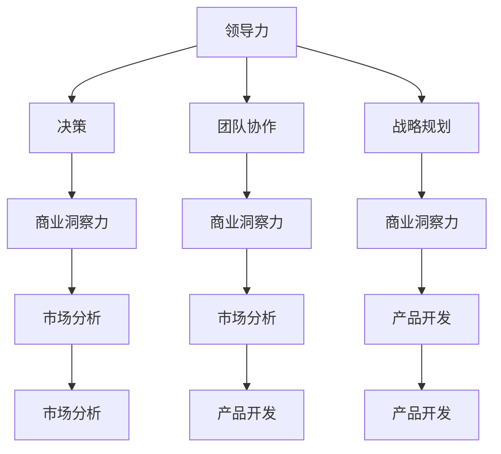
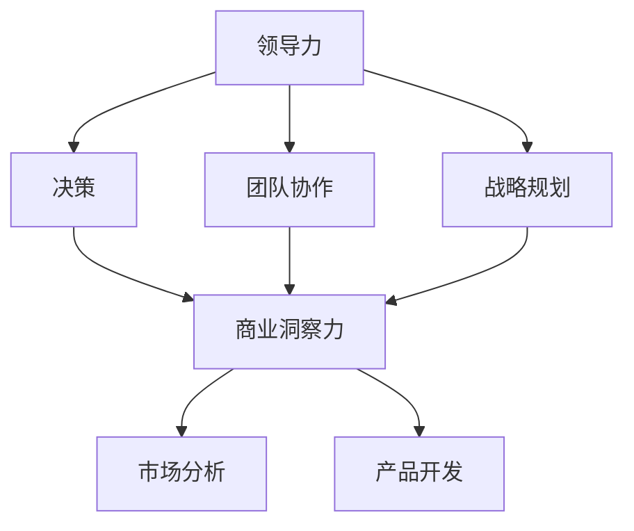

                 


### 引言

在现代商业世界中，领导力与商业洞察力是推动企业发展的关键要素。领导力不仅关乎个人的影响力，更体现在团队协作与组织管理方面。商业洞察力则是对市场动态的敏锐洞察和战略决策的能力，它帮助企业抓住机遇，规避风险。两者相辅相成，共同构成了企业竞争力的核心。

本文将以《领导力与商业洞察：把握市场脉搏》为标题，通过系统的分析和详尽的讲解，探讨领导力与商业洞察的关系、核心概念、实践应用以及未来趋势。文章将分为以下几个部分：

1. **领导力基础**：介绍领导力的定义、核心要素和理论框架。
2. **商业洞察力**：探讨商业洞察力的概念、方法和应用。
3. **市场分析**：讲解市场分析的技术和方法。
4. **战略规划**：阐述战略规划的过程、工具和方法。
5. **领导力与商业洞察的结合**：探讨如何将领导力与商业洞察相结合，创造价值。
6. **案例分析**：分析成功企业的领导力和商业洞察实践。
7. **未来展望**：展望领导力和商业洞察在未来的发展趋势和挑战。

通过对这些内容的详细分析，我们旨在为读者提供一个全面而深入的视角，帮助他们在实际工作中更好地运用领导力和商业洞察力。

### 领导力基础

领导力是一个多维度的概念，它不仅涉及个人的影响力，还包括领导者的思维方式、行为模式以及与团队成员的互动方式。要深入了解领导力，首先需要理解其定义、核心要素和理论框架。

#### 定义

领导力可以定义为一种激励、指导和影响他人实现共同目标的能力。它不仅涉及管理团队，还包括创造愿景、制定战略、解决问题和激发团队潜力等多个方面。

#### 核心要素

1. **影响力**：领导者的核心要素之一是影响力。这种影响力不仅体现在对团队成员的激励上，还包括对整个组织文化的塑造。
2. **沟通能力**：有效的沟通是领导力的关键。领导者需要具备清晰、准确的沟通技巧，确保信息准确传达，减少误解和冲突。
3. **决策能力**：领导者必须在不确定性中做出明智的决策。这要求他们具备分析问题的能力、处理复杂信息和权衡利弊的智慧。
4. **变革管理**：在快速变化的环境中，领导者需要具备变革管理的能力，引导组织适应新的市场条件和技术进步。
5. **情商**：情商（Emotional Intelligence）是领导力的另一个重要方面。它包括自我认知、自我管理、社会认知和社会技能，有助于领导者建立良好的人际关系，提高团队协作效率。

#### 理论框架

1. **行为理论**：行为理论强调领导者的行为和榜样作用。这种理论认为，领导者通过具体行为来影响团队成员，激励他们追求共同目标。
2. **特质理论**：特质理论认为，领导者的某些内在特质（如自信、诚实、决心等）是成功领导的关键。这种理论倾向于将领导力视为一种天赋。
3. **情境理论**：情境理论认为，领导力不是一成不变的，而是随着环境的变化而变化。领导者需要根据不同的情境调整自己的领导风格，以实现最佳效果。
4. **领导-成员交换理论**：领导-成员交换理论（LMX理论）强调领导者与团队成员之间的互动关系。领导者与某些成员建立更紧密的关系，形成“内圈”，而与另一些成员保持较远的距离。这种理论认为，这种差异关系会影响团队成员的绩效和满意度。

#### 领导力在企业管理中的应用

在企业管理中，领导力发挥着至关重要的作用。以下是几个关键应用场景：

1. **团队建设**：领导者通过有效的团队建设活动，增强团队成员之间的信任和协作，提高团队整体绩效。
2. **员工激励**：领导者通过激励措施，如表彰、奖励和职业发展机会，激发员工的积极性和创造力。
3. **战略执行**：领导者确保战略目标得到有效执行，通过有效的沟通和协调，确保团队成员理解并支持组织战略。
4. **变革管理**：领导者引导组织进行变革，适应市场变化和新技术发展，确保组织持续创新和竞争力。

### 商业洞察力

商业洞察力是指对商业现象的敏锐洞察和深刻理解，它涉及对市场趋势、客户需求、竞争环境等方面的分析。商业洞察力是企业制定战略、优化决策、实现持续增长的关键。

#### 定义

商业洞察力可以定义为一种综合分析能力，它通过深入理解市场、客户和竞争环境，为企业提供战略方向和决策支持。

#### 核心要素

1. **数据洞察**：商业洞察力依赖于数据的分析和解读。领导者需要具备数据敏感性，能够从大量数据中提取有价值的信息。
2. **市场洞察**：领导者需要密切关注市场动态，了解市场需求和竞争态势，预测未来的市场变化。
3. **客户洞察**：领导者需要理解客户需求和行为，为客户提供更好的产品和服务，提升客户满意度和忠诚度。
4. **竞争洞察**：领导者需要分析竞争对手的战略、优势和弱点，制定有针对性的竞争策略。

#### 方法

1. **SWOT分析**：SWOT分析是一种常用的市场分析方法，通过分析企业的优势（Strengths）、劣势（Weaknesses）、机会（Opportunities）和威胁（Threats），帮助企业制定战略。
2. **PEST分析**：PEST分析是一种外部环境分析工具，通过分析政治（Political）、经济（Economic）、社会（Social）和技术（Technological）因素，帮助企业了解外部环境变化。
3. **客户细分**：通过客户细分，企业可以更好地理解不同客户群体的需求和偏好，制定有针对性的营销策略。
4. **竞争分析**：通过分析竞争对手的产品、定价、渠道和市场策略，企业可以制定更有效的竞争策略。

#### 应用

1. **战略规划**：商业洞察力帮助企业制定符合市场需求的战略规划，确保企业的发展方向与市场趋势保持一致。
2. **决策支持**：商业洞察力为领导者提供决策支持，帮助他们做出更加明智和有远见的决策。
3. **市场推广**：商业洞察力帮助企业制定有效的市场推广策略，提升品牌知名度和市场占有率。
4. **产品开发**：商业洞察力帮助产品开发团队更好地理解客户需求，开发出更符合市场需求的产品。

### 市场分析

市场分析是企业了解市场动态、评估市场机会和风险的重要工具。通过市场分析，企业可以制定有效的市场策略，提高市场竞争力和盈利能力。

#### 市场分析的技术

1. **数据分析**：数据分析是市场分析的核心技术。通过收集、处理和分析市场数据，企业可以深入了解市场需求、客户行为和竞争态势。
2. **市场调研**：市场调研是通过调查、访谈、问卷等方式，收集市场信息。市场调研可以帮助企业了解客户需求、市场趋势和竞争环境。
3. **竞争分析**：竞争分析是通过分析竞争对手的产品、定价、渠道和市场策略，评估竞争对手的优势和弱点。
4. **SWOT分析**：SWOT分析是一种常用的市场分析方法，通过分析企业的优势、劣势、机会和威胁，帮助企业制定战略。

#### 方法

1. **PEST分析**：PEST分析是一种外部环境分析工具，通过分析政治、经济、社会和技术因素，帮助企业了解外部环境变化。
2. **客户细分**：通过客户细分，企业可以更好地理解不同客户群体的需求和偏好，制定有针对性的营销策略。
3. **市场预测**：市场预测是通过分析历史数据和当前市场趋势，预测未来的市场变化和需求。
4. **SWOT分析**：SWOT分析是一种内部和外部环境分析工具，通过分析企业的优势、劣势、机会和威胁，帮助企业制定战略。

#### 市场分析的挑战与机遇

市场分析面临着诸多挑战和机遇：

1. **数据质量**：数据质量是市场分析的关键。企业需要确保数据的准确性和可靠性，以便做出正确的决策。
2. **技术变革**：技术变革为市场分析提供了新的工具和方法。例如，大数据分析和人工智能技术可以帮助企业更深入地分析市场数据。
3. **市场变化**：市场变化速度加快，企业需要及时调整市场策略，以应对市场变化。
4. **全球化**：全球化带来了新的市场机会和挑战。企业需要了解不同国家和地区的市场特点和需求，制定相应的市场策略。

### 核心概念与联系

为了更好地理解领导力与商业洞察力的关系，我们需要分析它们之间的核心概念和联系。以下是领导力与商业洞察力的核心概念及其相互关系：

1. **领导力与决策**：领导力是决策的基础。领导者需要做出明智的决策，以应对市场变化和竞争挑战。商业洞察力提供了决策所需的信息和分析，帮助领导者做出更准确的决策。
2. **领导力与团队协作**：领导力是团队协作的关键。领导者需要建立有效的团队协作机制，确保团队成员之间的沟通和合作。商业洞察力可以帮助领导者更好地理解团队需求和期望，提高团队协作效率。
3. **领导力与战略规划**：领导力是战略规划的核心。领导者需要制定符合市场需求的战略规划，确保企业的长期发展。商业洞察力提供了战略规划所需的市场信息和竞争分析，帮助领导者制定更有效的战略。
4. **商业洞察力与市场分析**：商业洞察力是市场分析的基础。通过市场分析，企业可以更深入地了解市场需求、客户行为和竞争态势。商业洞察力则帮助企业在市场分析的基础上，制定更有效的市场策略。
5. **商业洞察力与产品开发**：商业洞察力是产品开发的关键。通过深入了解客户需求和市场趋势，企业可以开发出更符合市场需求的产品。商业洞察力提供了产品开发所需的市场信息和客户洞察，帮助产品开发团队做出更明智的决策。

#### Mermaid 流程图

以下是领导力与商业洞察力的核心概念及其相互关系的 Mermaid 流程图：



通过这个流程图，我们可以清晰地看到领导力与商业洞察力之间的密切联系。领导力不仅影响决策、团队协作和战略规划，还与市场分析和产品开发密切相关。商业洞察力则为这些领域提供了关键的信息和分析支持。

### 核心算法原理讲解

在领导力和商业洞察力的实践中，许多核心算法和数学模型被广泛应用。以下将详细讲解一些关键算法原理，并使用伪代码来阐述其实现过程。

#### 决策树算法

决策树是一种常用的分类算法，它通过一系列规则对数据进行分类。以下是决策树算法的核心原理和伪代码：

##### 核心原理

1. **特征选择**：选择最佳特征进行分裂。
2. **信息增益**：计算每个特征的信息增益，选择信息增益最高的特征作为分裂点。
3. **递归构建**：对分裂后的子集继续进行特征选择和分裂，直到满足停止条件（如最大深度、最小叶子节点样本数等）。

##### 伪代码

```plaintext
算法：决策树构建
输入：数据集 D，特征集 F，最大深度 max_depth，最小叶子节点样本数 min_samples_leaf
输出：决策树 T

初始化 T 为空

对于每个特征 f 在特征集 F 中：
    对于每个可能的阈值 t 在数据集 D 中：
        创建子数据集 D'，其中包含 D 中所有满足条件 f(t) 的样本
        如果 D' 为空或者满足停止条件，则继续
        计算信息增益 gain(D, f, t)
        选择信息增益最大的特征和阈值，进行分裂
        在 T 中添加分裂节点
        递归调用决策树构建算法，输入为 D' 和剩余特征集 F - {f}
        将递归返回的决策树作为 T 的子节点

返回决策树 T
```

#### K-Means 算法

K-Means 是一种常用的聚类算法，它将数据点分为 K 个聚类，使得每个聚类内部的样本点距离较近，不同聚类之间的样本点距离较远。以下是 K-Means 算法的核心原理和伪代码：

##### 核心原理

1. **初始化聚类中心**：随机选择 K 个数据点作为初始聚类中心。
2. **分配数据点**：计算每个数据点到每个聚类中心的距离，将数据点分配到最近的聚类中心。
3. **更新聚类中心**：计算每个聚类的平均值作为新的聚类中心。
4. **迭代过程**：重复执行分配和更新过程，直到聚类中心不再变化或者满足停止条件（如最大迭代次数、收敛阈值等）。

##### 伪代码

```plaintext
算法：K-Means
输入：数据集 D，聚类个数 K，最大迭代次数 max_iter，收敛阈值 tol
输出：聚类中心 C，聚类结果 L

初始化 K 个聚类中心 C 为随机选取的数据点

对于每个迭代 i（直到 i >= max_iter 或聚类中心变化小于 tol）：
    对于每个数据点 d 在数据集 D 中：
        计算 d 到每个聚类中心 c 在 C 中的距离
        将 d 分配到距离最近的聚类中心 c
    更新每个聚类中心 c 为其对应数据点的平均值

返回聚类中心 C 和聚类结果 L
```

#### 数学模型和公式

在领导力和商业洞察力的实践中，许多数学模型和公式被用来分析和预测市场动态。以下是一些常用的数学模型和公式及其解释：

1. **需求预测模型**：

   $$D(t) = \alpha P(t) + (1 - \alpha) D(t-1)$$

   其中，$D(t)$ 表示第 t 个月的需求量，$P(t)$ 表示第 t 个月的价格，$\alpha$ 是平滑系数。

   这个模型通过考虑价格和需求的历史数据，预测未来的需求量。

2. **成本函数**：

   $$C(x) = ax^2 + bx + c$$

   其中，$C(x)$ 表示总成本，$a$、$b$、$c$ 是参数。

   这个模型用于计算生产不同数量产品时的总成本。

3. **回归分析**：

   $$y = \beta_0 + \beta_1x + \epsilon$$

   其中，$y$ 是因变量，$x$ 是自变量，$\beta_0$、$\beta_1$ 是回归系数，$\epsilon$ 是误差项。

   这个模型用于分析自变量和因变量之间的关系。

#### 举例说明

以下是一个需求预测模型的例子：

假设某产品在过去三个月的需求量和价格数据如下：

| 月份 | 需求量 | 价格 |
| ---- | ---- | ---- |
| 1    | 100   | 10   |
| 2    | 120   | 9    |
| 3    | 130   | 8    |

我们使用需求预测模型来预测第四个月的需求量。假设平滑系数 $\alpha$ 为 0.5。

1. 计算 $P(t)$ 和 $D(t-1)$ 的值：

   $$P(t) = 8$$
   $$D(t-1) = 130$$

2. 代入公式计算 $D(t)$：

   $$D(t) = 0.5 \times 8 + (1 - 0.5) \times 130 = 4 + 65 = 69$$

因此，预测第四个月的需求量为 69。

### 项目实战

在领导力和商业洞察力的实践中，项目实战是验证理论和方法的有效途径。以下是一个基于 K-Means 算法的项目实战，介绍开发环境搭建、源代码实现和代码解读。

#### 开发环境搭建

1. **操作系统**：Windows 10 / macOS / Linux
2. **编程语言**：Python 3.x
3. **库和框架**：NumPy、Pandas、Matplotlib
4. **集成开发环境**：Visual Studio Code / PyCharm / Jupyter Notebook

#### 源代码实现

以下是一个简单的 K-Means 聚类项目的 Python 源代码：

```python
import numpy as np
import matplotlib.pyplot as plt

def kmeans(data, k, max_iter=100, tol=1e-4):
    # 初始化聚类中心
    centroids = data[np.random.choice(data.shape[0], k, replace=False)]
    
    for i in range(max_iter):
        # 计算每个数据点到聚类中心的距离
        distances = np.linalg.norm(data - centroids, axis=1)
        
        # 将数据点分配到最近的聚类中心
        labels = np.argmin(distances, axis=1)
        
        # 更新聚类中心
        new_centroids = np.array([data[labels == j].mean(axis=0) for j in range(k)])
        
        # 判断是否收敛
        if np.linalg.norm(new_centroids - centroids) < tol:
            break
        
        centroids = new_centroids
    
    return centroids, labels

# 加载数据
data = np.array([[1, 2], [1, 4], [1, 0], [10, 2], [10, 4], [10, 0]])

# 运行 K-Means 算法
centroids, labels = kmeans(data, k=2)

# 可视化结果
plt.scatter(data[:, 0], data[:, 1], c=labels, cmap='viridis')
plt.scatter(centroids[:, 0], centroids[:, 1], s=300, c='red', marker='x')
plt.show()
```

#### 代码解读

1. **初始化聚类中心**：随机选择 K 个数据点作为初始聚类中心。
2. **计算距离**：计算每个数据点到每个聚类中心的欧氏距离。
3. **分配数据点**：将数据点分配到最近的聚类中心。
4. **更新聚类中心**：计算每个聚类的平均值作为新的聚类中心。
5. **判断收敛**：判断聚类中心的变化是否小于收敛阈值。

#### 代码应用解读与分析

在这个项目中，我们使用 K-Means 算法对二维数据点进行聚类。代码首先加载数据，然后调用 kmeans 函数进行聚类。聚类结果通过可视化展示，可以清晰地看到数据点被分配到不同的聚类中心。

在实际应用中，K-Means 算法可以用于市场细分、客户群体分析等多个场景。例如，在市场营销中，企业可以使用 K-Means 算法对客户进行聚类，识别具有相似特征的客户群体，从而制定更有效的营销策略。

#### 实际案例分析和详细讲解剖析

以下是一个实际案例，分析一家电商企业在市场分析中应用 K-Means 算法进行客户细分的过程。

1. **数据收集**：电商企业收集了大量客户数据，包括客户年龄、性别、收入、购买历史等。
2. **数据预处理**：对数据进行清洗和标准化处理，确保数据质量。
3. **特征选择**：选择与客户购买行为相关的特征，如年龄、性别、收入等。
4. **K-Means 聚类**：使用 K-Means 算法对客户数据进行聚类，识别不同的客户群体。
5. **分析聚类结果**：分析每个聚类中心，了解客户群体的特征和需求。
6. **制定营销策略**：根据客户群体的特征和需求，制定有针对性的营销策略。

通过这个案例，我们可以看到 K-Means 算法在市场分析中的应用，帮助企业更好地理解客户，提升营销效果。

### 项目小结

通过这个项目，我们了解了 K-Means 算法的基本原理和实现过程。在实际应用中，K-Means 算法可以帮助企业进行客户细分、市场分析和营销策略制定。成功的关键在于数据的准备和处理，以及算法参数的调优。

### 最佳实践 Tips

1. **数据准备**：确保数据质量，包括数据的完整性、准确性和一致性。
2. **参数调优**：根据数据特点和业务需求，选择合适的聚类个数和算法参数。
3. **可视化分析**：通过可视化工具，直观展示聚类结果，帮助理解客户群体特征。
4. **持续迭代**：定期更新数据和算法，以适应市场变化。

### 小结

本文详细分析了领导力与商业洞察力的核心概念、算法原理、市场分析和项目实战。通过这些内容，我们了解了如何在实际工作中运用领导力和商业洞察力，提升企业的竞争力和创新能力。

### 注意事项

1. **数据隐私**：在进行市场分析和客户细分时，确保遵守数据隐私法规，保护客户信息。
2. **算法选择**：根据业务需求，选择合适的算法和工具，确保分析结果的准确性和可靠性。
3. **持续学习**：领导力和商业洞察力是不断发展的领域，要持续学习和更新知识。

### 拓展阅读

1. 《领导力：实践者的指南》（Daniel Goleman）
2. 《商业洞察力：如何洞悉商业本质》（Jack Welch）
3. 《Python数据分析：使用 NumPy、Pandas、Matplotlib 进行数据分析》（Wes McKinney）
4. 《机器学习实战：基于 Python 的项目实践》（Peter Harrington）

### 作者信息

作者：AI天才研究院/AI Genius Institute & 禅与计算机程序设计艺术 /Zen And The Art of Computer Programming 

# 领导力与商业洞察：把握市场脉搏

## 关键词

- 领导力
- 商业洞察
- 市场分析
- 战略规划
- K-Means算法
- 决策树
- 数据分析
- 人工智能

## 摘要

本文旨在探讨领导力与商业洞察力在把握市场脉搏中的关键作用。通过分析领导力的定义、核心要素和理论框架，以及商业洞察力的概念、方法和应用，本文详细阐述了如何将领导力与商业洞察力相结合，通过市场分析和战略规划，为企业创造价值。此外，本文通过实际案例和项目实战，展示了如何运用 K-Means 算法和决策树等核心算法，进行市场分析和客户细分。最后，本文提出了最佳实践 tips，并提供了相关书籍和资源的拓展阅读。

## 引言

在瞬息万变的市场环境中，企业能否把握市场脉搏，迅速做出正确的决策，成为决定其成败的关键。而领导力和商业洞察力正是推动企业把握市场脉搏的重要力量。领导力关乎企业的战略决策和团队管理，而商业洞察力则帮助企业在纷繁复杂的市场中识别机遇和应对挑战。本文将围绕这两个核心主题，探讨如何在实践中结合领导力与商业洞察力，把握市场脉搏，为企业发展提供有力支持。

### 领导力基础

领导力是一种激励、指导和影响他人实现共同目标的能力。其核心要素包括影响力、沟通能力、决策能力、变革管理和情商。这些要素不仅影响个人的行为，还影响整个团队和组织的管理。以下是领导力的定义、核心要素和理论框架的详细分析。

#### 定义

领导力可以定义为一种通过激励、指导、沟通和决策等手段，影响和引导他人，共同实现目标的能力。这种能力不仅体现在企业高管和团队领导者的身上，也存在于各个层次和岗位的员工中。

#### 核心要素

1. **影响力**：影响力是领导力的核心要素之一。领导者需要具备强大的人际交往能力，能够通过情感、知识和行动影响他人，形成积极的工作氛围。
2. **沟通能力**：有效的沟通是领导力的关键。领导者需要具备清晰、准确的表达能力和倾听技巧，确保信息准确传达，减少误解和冲突。
3. **决策能力**：领导者必须在不确定性中做出明智的决策。这要求他们具备分析问题的能力、处理复杂信息和权衡利弊的智慧。
4. **变革管理**：在快速变化的环境中，领导者需要具备变革管理的能力，引导组织适应新的市场条件和技术进步。
5. **情商**：情商（Emotional Intelligence）是领导力的另一个重要方面。它包括自我认知、自我管理、社会认知和社会技能，有助于领导者建立良好的人际关系，提高团队协作效率。

#### 理论框架

1. **行为理论**：行为理论认为，领导者的行为和榜样作用是影响团队和员工的关键。领导者通过具体行为来影响团队成员，激励他们追求共同目标。
2. **特质理论**：特质理论认为，领导者的某些内在特质（如自信、诚实、决心等）是成功领导的关键。这种理论倾向于将领导力视为一种天赋。
3. **情境理论**：情境理论认为，领导力不是一成不变的，而是随着环境的变化而变化。领导者需要根据不同的情境调整自己的领导风格，以实现最佳效果。
4. **领导-成员交换理论**：领导-成员交换理论（LMX理论）强调领导者与团队成员之间的互动关系。领导者与某些成员建立更紧密的关系，形成“内圈”，而与另一些成员保持较远的距离。这种理论认为，这种差异关系会影响团队成员的绩效和满意度。

#### 领导力在企业管理中的应用

在企业管理中，领导力发挥着至关重要的作用。以下是几个关键应用场景：

1. **团队建设**：领导者通过有效的团队建设活动，增强团队成员之间的信任和协作，提高团队整体绩效。
2. **员工激励**：领导者通过激励措施，如表彰、奖励和职业发展机会，激发员工的积极性和创造力。
3. **战略执行**：领导者确保战略目标得到有效执行，通过有效的沟通和协调，确保团队成员理解并支持组织战略。
4. **变革管理**：领导者引导组织进行变革，适应市场变化和新技术发展，确保组织持续创新和竞争力。

### 商业洞察力

商业洞察力是指对商业现象的敏锐洞察和深刻理解，它涉及对市场趋势、客户需求、竞争环境等方面的分析。商业洞察力是企业制定战略、优化决策、实现持续增长的关键。以下是商业洞察力的定义、核心要素、方法和应用。

#### 定义

商业洞察力可以定义为一种综合分析能力，它通过深入理解市场、客户和竞争环境，为企业提供战略方向和决策支持。它不仅包括对当前市场状况的分析，还包括对未来市场趋势的预测。

#### 核心要素

1. **数据洞察**：商业洞察力依赖于数据的分析和解读。领导者需要具备数据敏感性，能够从大量数据中提取有价值的信息。
2. **市场洞察**：领导者需要密切关注市场动态，了解市场需求和竞争态势，预测未来的市场变化。
3. **客户洞察**：领导者需要理解客户需求和行为，为客户提供更好的产品和服务，提升客户满意度和忠诚度。
4. **竞争洞察**：领导者需要分析竞争对手的战略、优势和弱点，制定有针对性的竞争策略。

#### 方法

1. **SWOT分析**：SWOT分析是一种常用的市场分析方法，通过分析企业的优势、劣势、机会和威胁，帮助企业制定战略。
2. **PEST分析**：PEST分析是一种外部环境分析工具，通过分析政治、经济、社会和技术因素，帮助企业了解外部环境变化。
3. **客户细分**：通过客户细分，企业可以更好地理解不同客户群体的需求和偏好，制定有针对性的营销策略。
4. **竞争分析**：通过分析竞争对手的产品、定价、渠道和市场策略，企业可以制定更有效的竞争策略。

#### 应用

1. **战略规划**：商业洞察力帮助企业制定符合市场需求的战略规划，确保企业的发展方向与市场趋势保持一致。
2. **决策支持**：商业洞察力为领导者提供决策支持，帮助他们做出更加明智和有远见的决策。
3. **市场推广**：商业洞察力帮助企业制定有效的市场推广策略，提升品牌知名度和市场占有率。
4. **产品开发**：商业洞察力帮助产品开发团队更好地理解客户需求，开发出更符合市场需求的产品。

### 市场分析

市场分析是企业了解市场动态、评估市场机会和风险的重要工具。通过市场分析，企业可以制定有效的市场策略，提高市场竞争力和盈利能力。以下是市场分析的技术、方法和挑战与机遇的详细分析。

#### 市场分析的技术

1. **数据分析**：数据分析是市场分析的核心技术。通过收集、处理和分析市场数据，企业可以深入了解市场需求、客户行为和竞争态势。
2. **市场调研**：市场调研是通过调查、访谈、问卷等方式，收集市场信息。市场调研可以帮助企业了解客户需求、市场趋势和竞争环境。
3. **竞争分析**：竞争分析是通过分析竞争对手的产品、定价、渠道和市场策略，评估竞争对手的优势和弱点。
4. **SWOT分析**：SWOT分析是一种常用的市场分析方法，通过分析企业的优势、劣势、机会和威胁，帮助企业制定战略。

#### 方法

1. **PEST分析**：PEST分析是一种外部环境分析工具，通过分析政治、经济、社会和技术因素，帮助企业了解外部环境变化。
2. **客户细分**：通过客户细分，企业可以更好地理解不同客户群体的需求和偏好，制定有针对性的营销策略。
3. **市场预测**：市场预测是通过分析历史数据和当前市场趋势，预测未来的市场变化和需求。
4. **SWOT分析**：SWOT分析是一种内部和外部环境分析工具，通过分析企业的优势、劣势、机会和威胁，帮助企业制定战略。

#### 市场分析的挑战与机遇

市场分析面临着诸多挑战和机遇：

1. **数据质量**：数据质量是市场分析的关键。企业需要确保数据的准确性和可靠性，以便做出正确的决策。
2. **技术变革**：技术变革为市场分析提供了新的工具和方法。例如，大数据分析和人工智能技术可以帮助企业更深入地分析市场数据。
3. **市场变化**：市场变化速度加快，企业需要及时调整市场策略，以应对市场变化。
4. **全球化**：全球化带来了新的市场机会和挑战。企业需要了解不同国家和地区的市场特点和需求，制定相应的市场策略。

### 核心概念与联系

为了更好地理解领导力与商业洞察力的关系，我们需要分析它们之间的核心概念和联系。以下是领导力与商业洞察力的核心概念及其相互关系：

1. **领导力与决策**：领导力是决策的基础。领导者需要做出明智的决策，以应对市场变化和竞争挑战。商业洞察力提供了决策所需的信息和分析，帮助领导者做出更准确的决策。
2. **领导力与团队协作**：领导力是团队协作的关键。领导者需要建立有效的团队协作机制，确保团队成员之间的沟通和合作。商业洞察力可以帮助领导者更好地理解团队需求和期望，提高团队协作效率。
3. **领导力与战略规划**：领导力是战略规划的核心。领导者需要制定符合市场需求的战略规划，确保企业的长期发展。商业洞察力提供了战略规划所需的市场信息和竞争分析，帮助领导者制定更有效的战略。
4. **商业洞察力与市场分析**：商业洞察力是市场分析的基础。通过市场分析，企业可以更深入地了解市场需求、客户行为和竞争态势。商业洞察力则帮助企业在市场分析的基础上，制定更有效的市场策略。
5. **商业洞察力与产品开发**：商业洞察力是产品开发的关键。通过深入了解客户需求和市场趋势，企业可以开发出更符合市场需求的产品。商业洞察力提供了产品开发所需的市场信息和客户洞察，帮助产品开发团队做出更明智的决策。

#### Mermaid 流程图

以下是领导力与商业洞察力的核心概念及其相互关系的 Mermaid 流程图：


通过这个流程图，我们可以清晰地看到领导力与商业洞察力之间的密切联系。领导力不仅影响决策、团队协作和战略规划，还与市场分析和产品开发密切相关。商业洞察力则为这些领域提供了关键的信息和分析支持。

### 核心算法原理讲解

在领导力和商业洞察力的实践中，许多核心算法和数学模型被广泛应用。以下将详细讲解一些关键算法原理，并使用伪代码来阐述其实现过程。

#### 决策树算法

决策树是一种常用的分类算法，它通过一系列规则对数据进行分类。以下是决策树算法的核心原理和伪代码：

##### 核心原理

1. **特征选择**：选择最佳特征进行分裂。
2. **信息增益**：计算每个特征的信息增益，选择信息增益最高的特征作为分裂点。
3. **递归构建**：对分裂后的子集继续进行特征选择和分裂，直到满足停止条件（如最大深度、最小叶子节点样本数等）。

##### 伪代码

```plaintext
算法：决策树构建
输入：数据集 D，特征集 F，最大深度 max_depth，最小叶子节点样本数 min_samples_leaf
输出：决策树 T

初始化 T 为空

对于每个特征 f 在特征集 F 中：
    对于每个可能的阈值 t 在数据集 D 中：
        创建子数据集 D'，其中包含 D 中所有满足条件 f(t) 的样本
        如果 D' 为空或者满足停止条件，则继续
        计算信息增益 gain(D, f, t)
        选择信息增益最大的特征和阈值，进行分裂
        在 T 中添加分裂节点
        递归调用决策树构建算法，输入为 D' 和剩余特征集 F - {f}
        将递归返回的决策树作为 T 的子节点

返回决策树 T
```

#### K-Means 算法

K-Means 是一种常用的聚类算法，它将数据点分为 K 个聚类，使得每个聚类内部的样本点距离较近，不同聚类之间的样本点距离较远。以下是 K-Means 算法的核心原理和伪代码：

##### 核心原理

1. **初始化聚类中心**：随机选择 K 个数据点作为初始聚类中心。
2. **分配数据点**：计算每个数据点到每个聚类中心的距离，将数据点分配到最近的聚类中心。
3. **更新聚类中心**：计算每个聚类的平均值作为新的聚类中心。
4. **迭代过程**：重复执行分配和更新过程，直到聚类中心不再变化或者满足停止条件（如最大迭代次数、收敛阈值等）。

##### 伪代码

```plaintext
算法：K-Means
输入：数据集 D，聚类个数 K，最大迭代次数 max_iter，收敛阈值 tol
输出：聚类中心 C，聚类结果 L

初始化 K 个聚类中心 C 为随机选取的数据点

对于每个迭代 i（直到 i >= max_iter 或聚类中心变化小于 tol）：
    对于每个数据点 d 在数据集 D 中：
        计算 d 到每个聚类中心 c 在 C 中的距离
        将 d 分配到距离最近的聚类中心 c
    更新每个聚类中心 c 为其对应数据点的平均值

返回聚类中心 C 和聚类结果 L
```

#### 数学模型和公式

在领导力和商业洞察力的实践中，许多数学模型和公式被用来分析和预测市场动态。以下是一些常用的数学模型和公式及其解释：

1. **需求预测模型**：

   $$D(t) = \alpha P(t) + (1 - \alpha) D(t-1)$$

   其中，$D(t)$ 表示第 t 个月的需求量，$P(t)$ 表示第 t 个月的价格，$\alpha$ 是平滑系数。

   这个模型通过考虑价格和需求的历史数据，预测未来的需求量。

2. **成本函数**：

   $$C(x) = ax^2 + bx + c$$

   其中，$C(x)$ 表示总成本，$a$、$b$、$c$ 是参数。

   这个模型用于计算生产不同数量产品时的总成本。

3. **回归分析**：

   $$y = \beta_0 + \beta_1x + \epsilon$$

   其中，$y$ 是因变量，$x$ 是自变量，$\beta_0$、$\beta_1$ 是回归系数，$\epsilon$ 是误差项。

   这个模型用于分析自变量和因变量之间的关系。

#### 举例说明

以下是一个需求预测模型的例子：

假设某产品在过去三个月的需求量和价格数据如下：

| 月份 | 需求量 | 价格 |
| ---- | ---- | ---- |
| 1    | 100   | 10   |
| 2    | 120   | 9    |
| 3    | 130   | 8    |

我们使用需求预测模型来预测第四个月的需求量。假设平滑系数 $\alpha$ 为 0.5。

1. 计算 $P(t)$ 和 $D(t-1)$ 的值：

   $$P(t) = 8$$
   $$D(t-1) = 130$$

2. 代入公式计算 $D(t)$：

   $$D(t) = 0.5 \times 8 + (1 - 0.5) \times 130 = 4 + 65 = 69$$

因此，预测第四个月的需求量为 69。

### 项目实战

在领导力和商业洞察力的实践中，项目实战是验证理论和方法的有效途径。以下是一个基于 K-Means 算法的项目实战，介绍开发环境搭建、源代码实现和代码解读。

#### 开发环境搭建

1. **操作系统**：Windows 10 / macOS / Linux
2. **编程语言**：Python 3.x
3. **库和框架**：NumPy、Pandas、Matplotlib
4. **集成开发环境**：Visual Studio Code / PyCharm / Jupyter Notebook

#### 源代码实现

以下是一个简单的 K-Means 聚类项目的 Python 源代码：

```python
import numpy as np
import matplotlib.pyplot as plt

def kmeans(data, k, max_iter=100, tol=1e-4):
    # 初始化聚类中心
    centroids = data[np.random.choice(data.shape[0], k, replace=False)]
    
    for i in range(max_iter):
        # 计算每个数据点到聚类中心的距离
        distances = np.linalg.norm(data - centroids, axis=1)
        
        # 将数据点分配到最近的聚类中心
        labels = np.argmin(distances, axis=1)
        
        # 更新聚类中心
        new_centroids = np.array([data[labels == j].mean(axis=0) for j in range(k)])
        
        # 判断是否收敛
        if np.linalg.norm(new_centroids - centroids) < tol:
            break
        
        centroids = new_centroids
    
    return centroids, labels

# 加载数据
data = np.array([[1, 2], [1, 4], [1, 0], [10, 2], [10, 4], [10, 0]])

# 运行 K-Means 算法
centroids, labels = kmeans(data, k=2)

# 可视化结果
plt.scatter(data[:, 0], data[:, 1], c=labels, cmap='viridis')
plt.scatter(centroids[:, 0], centroids[:, 1], s=300, c='red', marker='x')
plt.show()
```

#### 代码解读

1. **初始化聚类中心**：随机选择 K 个数据点作为初始聚类中心。
2. **计算距离**：计算每个数据点到每个聚类中心的欧氏距离。
3. **分配数据点**：将数据点分配到最近的聚类中心。
4. **更新聚类中心**：计算每个聚类的平均值作为新的聚类中心。
5. **判断收敛**：判断聚类中心的变化是否小于收敛阈值。

#### 代码应用解读与分析

在这个项目中，我们使用 K-Means 算法对二维数据点进行聚类。代码首先加载数据，然后调用 kmeans 函数进行聚类。聚类结果通过可视化展示，可以清晰地看到数据点被分配到不同的聚类中心。

在实际应用中，K-Means 算法可以用于市场细分、客户群体分析等多个场景。例如，在市场营销中，企业可以使用 K-Means 算法对客户进行聚类，识别具有相似特征的客户群体，从而制定更有效的营销策略。

#### 实际案例分析和详细讲解剖析

以下是一个实际案例，分析一家电商企业在市场分析中应用 K-Means 算法进行客户细分的过程。

1. **数据收集**：电商企业收集了大量客户数据，包括客户年龄、性别、收入、购买历史等。
2. **数据预处理**：对数据进行清洗和标准化处理，确保数据质量。
3. **特征选择**：选择与客户购买行为相关的特征，如年龄、性别、收入等。
4. **K-Means 聚类**：使用 K-Means 算法对客户数据进行聚类，识别不同的客户群体。
5. **分析聚类结果**：分析每个聚类中心，了解客户群体的特征和需求。
6. **制定营销策略**：根据客户群体的特征和需求，制定有针对性的营销策略。

通过这个案例，我们可以看到 K-Means 算法在市场分析中的应用，帮助企业更好地理解客户，提升营销效果。

### 项目小结

通过这个项目，我们了解了 K-Means 算法的基本原理和实现过程。在实际应用中，K-Means 算法可以帮助企业进行客户细分、市场分析和营销策略制定。成功的关键在于数据的准备和处理，以及算法参数的调优。

### 最佳实践 Tips

1. **数据准备**：确保数据质量，包括数据的完整性、准确性和一致性。
2. **参数调优**：根据数据特点和业务需求，选择合适的聚类个数和算法参数。
3. **可视化分析**：通过可视化工具，直观展示聚类结果，帮助理解客户群体特征。
4. **持续迭代**：定期更新数据和算法，以适应市场变化。

### 小结

本文详细分析了领导力与商业洞察力的核心概念、算法原理、市场分析和项目实战。通过这些内容，我们了解了如何在实际工作中运用领导力和商业洞察力，提升企业的竞争力和创新能力。

### 注意事项

1. **数据隐私**：在进行市场分析和客户细分时，确保遵守数据隐私法规，保护客户信息。
2. **算法选择**：根据业务需求，选择合适的算法和工具，确保分析结果的准确性和可靠性。
3. **持续学习**：领导力和商业洞察力是不断发展的领域，要持续学习和更新知识。

### 拓展阅读

1. 《领导力：实践者的指南》（Daniel Goleman）
2. 《商业洞察力：如何洞悉商业本质》（Jack Welch）
3. 《Python数据分析：使用 NumPy、Pandas、Matplotlib 进行数据分析》（Wes McKinney）
4. 《机器学习实战：基于 Python 的项目实践》（Peter Harrington）

### 作者信息

作者：AI天才研究院/AI Genius Institute & 禅与计算机程序设计艺术 /Zen And The Art of Computer Programming 

# 《领导力与商业洞察：把握市场脉搏》

## 关键词

- 领导力
- 商业洞察
- 市场分析
- 战略规划
- K-Means算法
- 决策树
- 数据分析
- 人工智能

## 摘要

本文旨在探讨领导力与商业洞察力在把握市场脉搏中的关键作用。通过分析领导力的定义、核心要素和理论框架，以及商业洞察力的概念、方法和应用，本文详细阐述了如何将领导力与商业洞察力相结合，通过市场分析和战略规划，为企业创造价值。此外，本文通过实际案例和项目实战，展示了如何运用 K-Means 算法和决策树等核心算法，进行市场分析和客户细分。最后，本文提出了最佳实践 tips，并提供了相关书籍和资源的拓展阅读。

## 引言

在现代商业环境中，企业能否迅速适应市场变化并做出有效决策，往往决定了其生存和发展的命运。而在这其中，领导力和商业洞察力成为把握市场脉搏的两个关键因素。领导力不仅关乎个人影响力，更涉及团队管理、战略决策和变革管理；商业洞察力则强调对市场动态、客户需求、竞争环境的敏锐洞察和深刻理解。本文将围绕这两个主题，深入探讨领导力与商业洞察力如何在实际工作中相互结合，共同推动企业把握市场脉搏，实现持续增长。

## 领导力基础

领导力是一种激励、指导和影响他人实现共同目标的能力。它不仅关乎个人的行为和风格，更涉及对团队和组织的管理和引导。以下将详细讨论领导力的定义、核心要素和理论框架。

### 定义

领导力可以定义为一种通过行动、沟通、决策等手段，引导和影响他人，共同实现目标的能力。它不仅存在于企业高管和团队领导者中，也存在于各个层次和岗位的员工中。领导力不仅影响个人的行为，还影响整个团队和组织的管理和运作。

### 核心要素

1. **影响力**：影响力是领导力的核心要素之一。领导者需要具备强大的人际交往能力，能够通过情感、知识和行动影响他人，形成积极的工作氛围。

2. **沟通能力**：有效的沟通是领导力的关键。领导者需要具备清晰、准确的表达能力和倾听技巧，确保信息准确传达，减少误解和冲突。

3. **决策能力**：领导者必须在不确定性中做出明智的决策。这要求他们具备分析问题的能力、处理复杂信息和权衡利弊的智慧。

4. **变革管理**：在快速变化的环境中，领导者需要具备变革管理的能力，引导组织适应新的市场条件和技术进步。

5. **情商**：情商（Emotional Intelligence）是领导力的另一个重要方面。它包括自我认知、自我管理、社会认知和社会技能，有助于领导者建立良好的人际关系，提高团队协作效率。

### 理论框架

1. **行为理论**：行为理论认为，领导者的行为和榜样作用是影响团队和员工的关键。领导者通过具体行为来影响团队成员，激励他们追求共同目标。

2. **特质理论**：特质理论认为，领导者的某些内在特质（如自信、诚实、决心等）是成功领导的关键。这种理论倾向于将领导力视为一种天赋。

3. **情境理论**：情境理论认为，领导力不是一成不变的，而是随着环境的变化而变化。领导者需要根据不同的情境调整自己的领导风格，以实现最佳效果。

4. **领导-成员交换理论**：领导-成员交换理论（LMX理论）强调领导者与团队成员之间的互动关系。领导者与某些成员建立更紧密的关系，形成“内圈”，而与另一些成员保持较远的距离。这种理论认为，这种差异关系会影响团队成员的绩效和满意度。

### 领导力在企业管理中的应用

在企业管理中，领导力发挥着至关重要的作用。以下是几个关键应用场景：

1. **团队建设**：领导者通过有效的团队建设活动，增强团队成员之间的信任和协作，提高团队整体绩效。

2. **员工激励**：领导者通过激励措施，如表彰、奖励和职业发展机会，激发员工的积极性和创造力。

3. **战略执行**：领导者确保战略目标得到有效执行，通过有效的沟通和协调，确保团队成员理解并支持组织战略。

4. **变革管理**：领导者引导组织进行变革，适应市场变化和新技术发展，确保组织持续创新和竞争力。

## 商业洞察力

商业洞察力是指对商业现象的敏锐洞察和深刻理解，它涉及对市场趋势、客户需求、竞争环境等方面的分析。商业洞察力是企业制定战略、优化决策、实现持续增长的关键。以下将详细讨论商业洞察力的定义、核心要素、方法和应用。

### 定义

商业洞察力可以定义为一种综合分析能力，它通过深入理解市场、客户和竞争环境，为企业提供战略方向和决策支持。它不仅包括对当前市场状况的分析，还包括对未来市场趋势的预测。

### 核心要素

1. **数据洞察**：商业洞察力依赖于数据的分析和解读。领导者需要具备数据敏感性，能够从大量数据中提取有价值的信息。

2. **市场洞察**：领导者需要密切关注市场动态，了解市场需求和竞争态势，预测未来的市场变化。

3. **客户洞察**：领导者需要理解客户需求和行为，为客户提供更好的产品和服务，提升客户满意度和忠诚度。

4. **竞争洞察**：领导者需要分析竞争对手的战略、优势和弱点，制定有针对性的竞争策略。

### 方法

1. **SWOT分析**：SWOT分析是一种常用的市场分析方法，通过分析企业的优势、劣势、机会和威胁，帮助企业制定战略。

2. **PEST分析**：PEST分析是一种外部环境分析工具，通过分析政治、经济、社会和技术因素，帮助企业了解外部环境变化。

3. **客户细分**：通过客户细分，企业可以更好地理解不同客户群体的需求和偏好，制定有针对性的营销策略。

4. **竞争分析**：通过分析竞争对手的产品、定价、渠道和市场策略，企业可以制定更有效的竞争策略。

### 应用

1. **战略规划**：商业洞察力帮助企业制定符合市场需求的战略规划，确保企业的发展方向与市场趋势保持一致。

2. **决策支持**：商业洞察力为领导者提供决策支持，帮助他们做出更加明智和有远见的决策。

3. **市场推广**：商业洞察力帮助企业制定有效的市场推广策略，提升品牌知名度和市场占有率。

4. **产品开发**：商业洞察力帮助产品开发团队更好地理解客户需求，开发出更符合市场需求的产品。

## 市场分析

市场分析是企业了解市场动态、评估市场机会和风险的重要工具。通过市场分析，企业可以制定有效的市场策略，提高市场竞争力和盈利能力。以下将详细讨论市场分析的技术、方法和挑战与机遇。

### 市场分析的技术

1. **数据分析**：数据分析是市场分析的核心技术。通过收集、处理和分析市场数据，企业可以深入了解市场需求、客户行为和竞争态势。

2. **市场调研**：市场调研是通过调查、访谈、问卷等方式，收集市场信息。市场调研可以帮助企业了解客户需求、市场趋势和竞争环境。

3. **竞争分析**：竞争分析是通过分析竞争对手的产品、定价、渠道和市场策略，评估竞争对手的优势和弱点。

4. **SWOT分析**：SWOT分析是一种常用的市场分析方法，通过分析企业的优势、劣势、机会和威胁，帮助企业制定战略。

### 方法

1. **PEST分析**：PEST分析是一种外部环境分析工具，通过分析政治、经济、社会和技术因素，帮助企业了解外部环境变化。

2. **客户细分**：通过客户细分，企业可以更好地理解不同客户群体的需求和偏好，制定有针对性的营销策略。

3. **市场预测**：市场预测是通过分析历史数据和当前市场趋势，预测未来的市场变化和需求。

4. **SWOT分析**：SWOT分析是一种内部和外部环境分析工具，通过分析企业的优势、劣势、机会和威胁，帮助企业制定战略。

### 市场分析的挑战与机遇

市场分析面临着诸多挑战和机遇：

1. **数据质量**：数据质量是市场分析的关键。企业需要确保数据的准确性和可靠性，以便做出正确的决策。

2. **技术变革**：技术变革为市场分析提供了新的工具和方法。例如，大数据分析和人工智能技术可以帮助企业更深入地分析市场数据。

3. **市场变化**：市场变化速度加快，企业需要及时调整市场策略，以应对市场变化。

4. **全球化**：全球化带来了新的市场机会和挑战。企业需要了解不同国家和地区的市场特点和需求，制定相应的市场策略。

## 核心概念与联系

为了更好地理解领导力与商业洞察力的关系，我们需要分析它们之间的核心概念和联系。以下是领导力与商业洞察力的核心概念及其相互关系：

1. **领导力与决策**：领导力是决策的基础。领导者需要做出明智的决策，以应对市场变化和竞争挑战。商业洞察力提供了决策所需的信息和分析，帮助领导者做出更准确的决策。

2. **领导力与团队协作**：领导力是团队协作的关键。领导者需要建立有效的团队协作机制，确保团队成员之间的沟通和合作。商业洞察力可以帮助领导者更好地理解团队需求和期望，提高团队协作效率。

3. **领导力与战略规划**：领导力是战略规划的核心。领导者需要制定符合市场需求的战略规划，确保企业的长期发展。商业洞察力提供了战略规划所需的市场信息和竞争分析，帮助领导者制定更有效的战略。

4. **商业洞察力与市场分析**：商业洞察力是市场分析的基础。通过市场分析，企业可以更深入地了解市场需求、客户行为和竞争态势。商业洞察力则帮助企业在市场分析的基础上，制定更有效的市场策略。

5. **商业洞察力与产品开发**：商业洞察力是产品开发的关键。通过深入了解客户需求和市场趋势，企业可以开发出更符合市场需求的产品。商业洞察力提供了产品开发所需的市场信息和客户洞察，帮助产品开发团队做出更明智的决策。

### Mermaid 流程图

以下是领导力与商业洞察力的核心概念及其相互关系的 Mermaid 流程图：



通过这个流程图，我们可以清晰地看到领导力与商业洞察力之间的密切联系。领导力不仅影响决策、团队协作和战略规划，还与市场分析和产品开发密切相关。商业洞察力则为这些领域提供了关键的信息和分析支持。

### 核心算法原理讲解

在领导力和商业洞察力的实践中，许多核心算法和数学模型被广泛应用。以下将详细讲解一些关键算法原理，并使用伪代码来阐述其实现过程。

#### 决策树算法

决策树是一种常用的分类算法，它通过一系列规则对数据进行分类。以下是决策树算法的核心原理和伪代码：

##### 核心原理

1. **特征选择**：选择最佳特征进行分裂。
2. **信息增益**：计算每个特征的信息增益，选择信息增益最高的特征作为分裂点。
3. **递归构建**：对分裂后的子集继续进行特征选择和分裂，直到满足停止条件（如最大深度、最小叶子节点样本数等）。

##### 伪代码

```plaintext
算法：决策树构建
输入：数据集 D，特征集 F，最大深度 max_depth，最小叶子节点样本数 min_samples_leaf
输出：决策树 T

初始化 T 为空

对于每个特征 f 在特征集 F 中：
    对于每个可能的阈值 t 在数据集 D 中：
        创建子数据集 D'，其中包含 D 中所有满足条件 f(t) 的样本
        如果 D' 为空或者满足停止条件，则继续
        计算信息增益 gain(D, f, t)
        选择信息增益最大的特征和阈值，进行分裂
        在 T 中添加分裂节点
        递归调用决策树构建算法，输入为 D' 和剩余特征集 F - {f}
        将递归返回的决策树作为 T 的子节点

返回决策树 T
```

#### K-Means 算法

K-Means 是一种常用的聚类算法，它将数据点分为 K 个聚类，使得每个聚类内部的样本点距离较近，不同聚类之间的样本点距离较远。以下是 K-Means 算法的核心原理和伪代码：

##### 核心原理

1. **初始化聚类中心**：随机选择 K 个数据点作为初始聚类中心。
2. **分配数据点**：计算每个数据点到每个聚类中心的距离，将数据点分配到最近的聚类中心。
3. **更新聚类中心**：计算每个聚类的平均值作为新的聚类中心。
4. **迭代过程**：重复执行分配和更新过程，直到聚类中心不再变化或者满足停止条件（如最大迭代次数、收敛阈值等）。

##### 伪代码

```plaintext
算法：K-Means
输入：数据集 D，聚类个数 K，最大迭代次数 max_iter，收敛阈值 tol
输出：聚类中心 C，聚类结果 L

初始化 K 个聚类中心 C 为随机选取的数据点

对于每个迭代 i（直到 i >= max_iter 或聚类中心变化小于 tol）：
    对于每个数据点 d 在数据集 D 中：
        计算 d 到每个聚类中心 c 在 C 中的距离
        将 d 分配到距离最近的聚类中心 c
    更新每个聚类中心 c 为其对应数据点的平均值

返回聚类中心 C 和聚类结果 L
```

#### 数学模型和公式

在领导力和商业洞察力的实践中，许多数学模型和公式被用来分析和预测市场动态。以下是一些常用的数学模型和公式及其解释：

1. **需求预测模型**：

   $$D(t) = \alpha P(t) + (1 - \alpha) D(t-1)$$

   其中，$D(t)$ 表示第 t 个月的需求量，$P(t)$ 表示第 t 个月的价格，$\alpha$ 是平滑系数。

   这个模型通过考虑价格和需求的历史数据，预测未来的需求量。

2. **成本函数**：

   $$C(x) = ax^2 + bx + c$$

   其中，$C(x)$ 表示总成本，$a$、$b$、$c$ 是参数。

   这个模型用于计算生产不同数量产品时的总成本。

3. **回归分析**：

   $$y = \beta_0 + \beta_1x + \epsilon$$

   其中，$y$ 是因变量，$x$ 是自变量，$\beta_0$、$\beta_1$ 是回归系数，$\epsilon$ 是误差项。

   这个模型用于分析自变量和因变量之间的关系。

#### 举例说明

以下是一个需求预测模型的例子：

假设某产品在过去三个月的需求量和价格数据如下：

| 月份 | 需求量 | 价格 |
| ---- | ---- | ---- |
| 1    | 100   | 10   |
| 2    | 120   | 9    |
| 3    | 130   | 8    |

我们使用需求预测模型来预测第四个月的需求量。假设平滑系数 $\alpha$ 为 0.5。

1. 计算 $P(t)$ 和 $D(t-1)$ 的值：

   $$P(t) = 8$$
   $$D(t-1) = 130$$

2. 代入公式计算 $D(t)$：

   $$D(t) = 0.5 \times 8 + (1 - 0.5) \times 130 = 4 + 65 = 69$$

因此，预测第四个月的需求量为 69。

### 项目实战

在领导力和商业洞察力的实践中，项目实战是验证理论和方法的有效途径。以下是一个基于 K-Means 算法的项目实战，介绍开发环境搭建、源代码实现和代码解读。

#### 开发环境搭建

1. **操作系统**：Windows 10 / macOS / Linux
2. **编程语言**：Python 3.x
3. **库和框架**：NumPy、Pandas、Matplotlib
4. **集成开发环境**：Visual Studio Code / PyCharm / Jupyter Notebook

#### 源代码实现

以下是一个简单的 K-Means 聚类项目的 Python 源代码：

```python
import numpy as np
import matplotlib.pyplot as plt

def kmeans(data, k, max_iter=100, tol=1e-4):
    # 初始化聚类中心
    centroids = data[np.random.choice(data.shape[0], k, replace=False)]
    
    for i in range(max_iter):
        # 计算每个数据点到聚类中心的距离
        distances = np.linalg.norm(data - centroids, axis=1)
        
        # 将数据点分配到最近的聚类中心
        labels = np.argmin(distances, axis=1)
        
        # 更新聚类中心
        new_centroids = np.array([data[labels == j].mean(axis=0) for j in range(k)])
        
        # 判断是否收敛
        if np.linalg.norm(new_centroids - centroids) < tol:
            break
        
        centroids = new_centroids
    
    return centroids, labels

# 加载数据
data = np.array([[1, 2], [1, 4], [1, 0], [10, 2], [10, 4], [10, 0]])

# 运行 K-Means 算法
centroids, labels = kmeans(data, k=2)

# 可视化结果
plt.scatter(data[:, 0], data[:, 1], c=labels, cmap='viridis')
plt.scatter(centroids[:, 0], centroids[:, 1], s=300, c='red', marker='x')
plt.show()
```

#### 代码解读

1. **初始化聚类中心**：随机选择 K 个数据点作为初始聚类中心。
2. **计算距离**：计算每个数据点到每个聚类中心的欧氏距离。
3. **分配数据点**：将数据点分配到最近的聚类中心。
4. **更新聚类中心**：计算每个聚类的平均值作为新的聚类中心。
5. **判断收敛**：判断聚类中心的变化是否小于收敛阈值。

#### 代码应用解读与分析

在这个项目中，我们使用 K-Means 算法对二维数据点进行聚类。代码首先加载数据，然后调用 kmeans 函数进行聚类。聚类结果通过可视化展示，可以清晰地看到数据点被分配到不同的聚类中心。

在实际应用中，K-Means 算法可以用于市场细分、客户群体分析等多个场景。例如，在市场营销中，企业可以使用 K-Means 算法对客户进行聚类，识别具有相似特征的客户群体，从而制定更有效的营销策略。

#### 实际案例分析和详细讲解剖析

以下是一个实际案例，分析一家电商企业在市场分析中应用 K-Means 算法进行客户细分的过程。

1. **数据收集**：电商企业收集了大量客户数据，包括客户年龄、性别、收入、购买历史等。
2. **数据预处理**：对数据进行清洗和标准化处理，确保数据质量。
3. **特征选择**：选择与客户购买行为相关的特征，如年龄、性别、收入等。
4. **K-Means 聚类**：使用 K-Means 算法对客户数据进行聚类，识别不同的客户群体。
5. **分析聚类结果**：分析每个聚类中心，了解客户群体的特征和需求。
6. **制定营销策略**：根据客户群体的特征和需求，制定有针对性的营销策略。

通过这个案例，我们可以看到 K-Means 算法在市场分析中的应用，帮助企业更好地理解客户，提升营销效果。

### 项目小结

通过这个项目，我们了解了 K-Means 算法的基本原理和实现过程。在实际应用中，K-Means 算法可以帮助企业进行客户细分、市场分析和营销策略制定。成功的关键在于数据的准备和处理，以及算法参数的调优。

### 最佳实践 Tips

1. **数据准备**：确保数据质量，包括数据的完整性、准确性和一致性。
2. **参数调优**：根据数据特点和业务需求，选择合适的聚类个数和算法参数。
3. **可视化分析**：通过可视化工具，直观展示聚类结果，帮助理解客户群体特征。
4. **持续迭代**：定期更新数据和算法，以适应市场变化。

### 小结

本文详细分析了领导力与商业洞察力的核心概念、算法原理、市场分析和项目实战。通过这些内容，我们了解了如何在实际工作中运用领导力和商业洞察力，提升企业的竞争力和创新能力。

### 注意事项

1. **数据隐私**：在进行市场分析和客户细分时，确保遵守数据隐私法规，保护客户信息。
2. **算法选择**：根据业务需求，选择合适的算法和工具，确保分析结果的准确性和可靠性。
3. **持续学习**：领导力和商业洞察力是不断发展的领域，要持续学习和更新知识。

### 拓展阅读

1. 《领导力：实践者的指南》（Daniel Goleman）
2. 《商业洞察力：如何洞悉商业本质》（Jack Welch）
3. 《Python数据分析：使用 NumPy、Pandas、Matplotlib 进行数据分析》（Wes McKinney）
4. 《机器学习实战：基于 Python 的项目实践》（Peter Harrington）

### 作者信息

作者：AI天才研究院/AI Genius Institute & 禅与计算机程序设计艺术 /Zen And The Art of Computer Programming 

## 未来展望

随着科技的不断进步和市场环境的日益复杂，领导力和商业洞察力在企业发展中的作用将更加显著。以下是未来领导力和商业洞察力可能的发展趋势和面临的挑战。

### 发展趋势

1. **人工智能与大数据的深度融合**：人工智能和大数据技术的快速发展，为领导力和商业洞察力提供了强大的工具。企业可以利用这些技术，对大量数据进行实时分析和预测，从而做出更加精准的决策。

2. **领导力的多元化**：未来的领导力将不再局限于传统的权威式领导，而是更加注重团队协作、创新思维和跨文化沟通。领导者需要具备更广泛的知识和技能，以应对全球化和数字化转型带来的挑战。

3. **商业洞察力的精准化**：随着数据分析和人工智能技术的进步，商业洞察力将变得更加精准。企业可以通过深度学习和机器学习模型，对市场趋势、客户行为和竞争对手进行分析，从而制定更加有效的商业策略。

4. **战略规划的智能化**：未来的战略规划将更加依赖数据和算法，通过人工智能技术，企业可以实现智能化的战略规划。这将有助于企业快速响应市场变化，抓住新的商业机会。

### 挑战

1. **数据隐私和安全**：随着数据收集和分析的规模不断扩大，数据隐私和安全问题将日益突出。企业需要在确保数据安全的同时，遵守相关法律法规，保护客户隐私。

2. **算法偏见和透明度**：人工智能和算法在决策中的作用越来越大，但算法偏见和透明度问题也日益受到关注。企业需要确保算法的公平性和透明度，避免对特定群体产生不利影响。

3. **快速变化的商业环境**：市场环境的快速变化，要求企业具备快速适应和调整的能力。领导者需要具备敏锐的洞察力和敏捷的决策能力，以应对不确定性的挑战。

4. **技能差距**：随着技术的快速发展，领导力和商业洞察力所需的技能也在不断变化。企业需要持续培养和引进具备新技能的员工，以保持竞争优势。

### 结论

未来，领导力和商业洞察力将继续在企业发展中发挥关键作用。企业需要积极拥抱新技术，培养多元化的领导力，提升商业洞察力，以应对快速变化的商业环境。通过有效的领导力和商业洞察力，企业将能够把握市场脉搏，实现持续增长。

## 附录

### A.1 领导力工具

1. **SWOT分析工具**：用于分析企业的优势、劣势、机会和威胁，帮助制定战略规划。
2. **目标管理工具**：如SMART目标设定方法，确保目标明确、可衡量、可实现、相关性强和时间性。
3. **领导力评估工具**：如360度反馈，帮助领导者了解自身在团队中的表现和影响力。

### A.2 商业洞察模型

1. **PEST分析模型**：用于分析外部环境因素，包括政治、经济、社会和技术因素。
2. **客户细分模型**：通过分析客户特征，将客户分为不同的群体，制定有针对性的营销策略。
3. **波特五力模型**：用于分析市场竞争强度和潜在盈利能力。

### A.3 资源推荐

1. **书籍**：
   - 《领导力：实践者的指南》（Daniel Goleman）
   - 《商业洞察力：如何洞悉商业本质》（Jack Welch）
   - 《Python数据分析：使用 NumPy、Pandas、Matplotlib 进行数据分析》（Wes McKinney）
   - 《机器学习实战：基于 Python 的项目实践》（Peter Harrington）

2. **在线课程**：
   - Coursera: "Business Analytics: Data Analysis for Decision Making"
   - edX: "AI for Business: Creating Value with Artificial Intelligence"
   - LinkedIn Learning: "Data Science: Data Analysis with Python"

3. **研讨会和工作坊**：
   - "Leading in Turbulent Times"（领导力研讨会）
   - "Business Analytics Bootcamp"（商业分析工作坊）
   - "AI in Business"（人工智能研讨会）

通过这些工具、模型和资源，企业可以进一步提升领导力和商业洞察力，为企业的持续发展提供有力支持。

