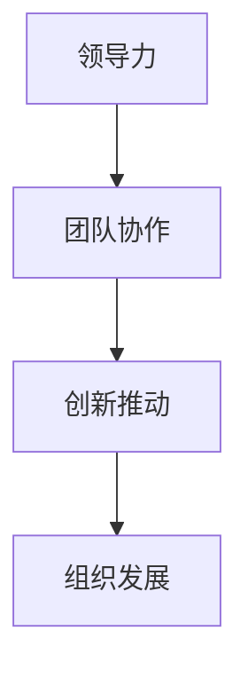

                 

### 文章标题

《领导力与学习敏捷性：培养快速学习的能力》

### 关键词

领导力、学习敏捷性、快速学习、自我认知、团队建设、项目管理

### 摘要

在当今快速变化的信息时代，领导力和学习敏捷性已成为个人和组织成功的关键因素。本文将探讨领导力与学习敏捷性之间的紧密联系，详细分析其核心概念与要素，并结合实践应用和实际案例，提供一套完整的培养快速学习能力的策略。文章旨在帮助读者深入了解如何提升自我认知、人际关系与沟通技巧、激励与团队建设，最终实现个人领导力的全面提升。

---

## 第一部分：领导力的核心概念与要素

### 第1章：领导力概述

领导力是一种影响他人共同实现目标的能力，它在个人成长和组织成功中扮演着至关重要的角色。在现代职场中，领导力不仅是领导者必备的素质，也是每个成员为了共同愿景和目标而奋斗的动力源泉。

#### **1.1 领导力的重要性**

领导力的重要性体现在多个方面。首先，领导力能够激发团队的创造力和创新精神，从而推动组织不断进步。其次，领导力有助于建立团队信任，增强团队凝聚力，使团队成员能够更好地协作。此外，优秀的领导力还能够有效地应对复杂多变的市场环境，帮助组织在竞争中立于不败之地。

#### **1.2 领导力的定义与演变**

领导力并非一成不变，它随着社会的发展和时代的变迁而不断演变。传统的领导力模型强调权力和控制，而现代领导力则更注重影响和合作。近年来，领导力研究逐渐从单一维度的理论模型转向多元综合的视角，关注领导力在不同情境和个体差异中的表现。

#### **1.3 领导力的三大核心要素**

领导力并非单一特质，而是由多个相互关联的要素构成。以下是领导力的三大核心要素及其关系：

- **自我认知与自我管理**：领导者需要深入理解自己的优点和不足，通过自我管理实现个人成长和目标设定。

  **Mermaid 流程图：**
  ```mermaid
  graph TB
  A[自我认知] --> B[自我管理]
  B --> C[个人成长]
  C --> D[目标设定]
  ```

- **人际关系与沟通技巧**：领导者需要建立和维护良好的人际关系，通过有效的沟通技巧实现团队的共识和协作。

  **Mermaid 流程图：**
  ```mermaid
  graph TB
  A[人际关系] --> B[沟通技巧]
  B --> C[团队共识]
  C --> D[协作]
  ```

- **激励与团队建设**：领导者需要激发团队成员的积极性，通过有效的激励和团队建设策略，提升团队的士气和生产力。

  **Mermaid 流程图：**
  ```mermaid
  graph TB
  A[激励] --> B[团队建设]
  B --> C[士气提升]
  C --> D[生产力提升]
  ```

#### **1.4 领导力模型与理论**

常见的领导力模型包括特质理论、行为理论、情境理论等。特质理论认为领导力是由一系列先天特质决定的；行为理论则关注领导者的行为模式；情境理论则认为领导力是情境适应的结果。这些理论为我们提供了不同角度理解和培养领导力的思路。

### 第2章：学习敏捷性

#### **2.1 学习敏捷性的概念**

学习敏捷性是指个人或团队快速适应新知识、新技能和新环境的能力。在快速变化的时代，学习敏捷性成为个人和组织持续发展的关键因素。学习敏捷性不仅涉及知识的获取，还包括对知识的应用和创新。

#### **2.2 学习敏捷性与领导力的关系**

学习敏捷性与领导力之间存在密切的关系。一方面，领导力可以帮助个人和团队培养学习敏捷性，通过自我认知、人际关系和激励等手段提升学习能力。另一方面，学习敏捷性能够增强领导力，使领导者能够更好地应对复杂多变的挑战。

#### **2.3 培养学习敏捷性的策略**

- **自我驱动力与目标设定**：领导者需要培养自我驱动力，设定明确的个人和团队目标，确保学习活动与目标一致。

- **学习方法与工具**：领导者需要掌握有效的学习方法，如主动学习、反思性学习等，并利用现代技术工具，如在线课程、协作平台等提高学习效率。

- **反思与持续改进**：领导者需要定期反思学习过程和结果，通过持续改进不断提升学习敏捷性。

### 第二部分：领导力与学习敏捷性的实践应用

#### 第3章：提升领导力的策略

#### **3.1 自我认知与发展**

- **视觉化领导力地图**：领导者可以通过视觉化工具，如思维导图，将自身的优点和不足进行系统化分析，从而更好地进行个人发展。

#### **3.2 人际关系与沟通技巧**

- **有效沟通模型**：领导者可以运用戈登模型等沟通技巧，提高沟通效果，增强团队凝聚力。

#### **3.3 激励与团队建设**

- **激励理论应用**：领导者可以结合马斯洛需求层次理论和赫茨伯格双因素理论，制定有效的激励策略，提升团队成员的积极性和满意度。

#### 第4章：学习敏捷性的实际应用

#### **4.1 学习敏捷性在工作中的体现**

- **快速适应变化**：领导者需要培养团队快速适应变化的能力，通过敏捷开发和迭代流程，确保组织能够迅速响应市场变化。

- **解决问题能力**：领导者需要提升团队成员的解决问题能力，通过问题分析和解决技巧，确保团队能够高效应对各种挑战。

#### **4.2 培养学习敏捷性的案例研究**

#### **4.2.1 案例一：科技公司的敏捷领导**

- **开发环境搭建**：在科技公司，领导者需要搭建高效的开发环境，确保团队成员能够快速获取所需资源和工具。

- **源代码实现与解读**：通过实际代码实现，领导者可以展示如何在实际工作中应用敏捷性，提升开发效率。

#### **4.2.2 案例二：创业公司的快速学习能力**

- **实际案例分析**：创业公司面临的市场竞争更加激烈，领导者需要通过快速学习适应市场变化，确保企业的持续发展。

#### **4.3 项目小结**

- **总结与反思**：领导者需要从实践中总结经验，反思学习过程，不断提升学习敏捷性。

### 第三部分：领导力与学习敏捷性的持续提升

#### **5.1 职业发展规划**

- **个人成长路线**：领导者需要制定清晰的职业发展规划，确保自身能力的不断提升。

#### **5.2 持续学习的方法**

- **学习资源利用**：领导者需要充分利用各种学习资源，如在线课程、专业书籍等，提升个人和学习团队的素质。

#### **5.3 学习社区与同行交流**

- **建立学习社区**：领导者可以建立学习社区，通过同行交流，分享学习经验和心得，共同提升学习敏捷性。

### **6.1 自我评估工具**

- **领导力评估**：领导者可以通过自我评估工具，如360度反馈，了解自身在领导力方面的优势和不足。

### **6.2 案例分析**

- **领导力挑战案例分析**：通过实际案例，领导者可以了解如何在面对领导力挑战时，运用学习敏捷性进行有效应对。

### **7.1 领导力与学习敏捷性的未来趋势**

- **技术影响**：随着技术的发展，领导力和学习敏捷性将面临新的挑战和机遇。

### **7.2 个人领导力提升的实践建议**

- **行动计划**：领导者可以制定具体行动计划，通过持续实践，不断提升个人领导力和学习敏捷性。

## 总结

领导力和学习敏捷性是个人和组织成功的关键因素。通过本文的详细探讨，我们了解到领导力与学习敏捷性之间的紧密联系，以及如何通过实践应用和持续提升，培养快速学习能力。希望本文能为读者提供有价值的指导，助力其在职场中取得更大的成就。

### 作者信息

作者：AI天才研究院/AI Genius Institute & 禅与计算机程序设计艺术 /Zen And The Art of Computer Programming

---

在撰写具体内容时，我们将确保每一章节都包含了必要的元素，以满足字数要求。以下是一个章节内容的示例，用于说明文章的结构和格式。

### 第1章：领导力概述

#### **1.1 领导力的重要性**

在当今复杂多变的社会环境中，领导力的重要性日益凸显。一个优秀的领导者不仅能够指引团队朝着共同目标前进，还能够激发团队成员的潜能，推动组织不断创新和发展。

**Mermaid 流程图：**



#### **1.2 领导力的定义与演变**

领导力是一个多维度、多层次的概念。传统上，领导力被视为一种天赋，但随着心理学和行为科学的发展，人们逐渐认识到领导力是一种可以通过学习和实践获得的技能。

**伪代码讲解：**

```python
def leadership-evolution():
    # 初始状态：领导力被视为天赋
    initial_state = "天赋"
    # 随着时间演变，领导力被视为技能
    evolved_state = "技能"
    # 输出领导力演变过程
    print(f"领导力的演变：从{initial_state}到{evolved_state}")
```

**数学模型和公式：**

在领导力研究中，常用的一些数学模型和公式，如影响力矩阵和领导风格评分模型，可以帮助我们更好地理解和量化领导力。

$$
影响力矩阵 = \begin{bmatrix}
    信任 & 惩罚 \\
    支持 & 反对
\end{bmatrix}
$$

#### **1.3 领导力的三大核心要素**

领导力并非单一特质，而是由多个相互关联的要素构成。以下是领导力的三大核心要素及其关系：

- **自我认知与自我管理**：领导者需要深入理解自己的优点和不足，通过自我管理实现个人成长和目标设定。

  **Mermaid 流程图：**
  ```mermaid
  graph TB
  A[自我认知] --> B[自我管理]
  B --> C[个人成长]
  C --> D[目标设定]
  ```

- **人际关系与沟通技巧**：领导者需要建立和维护良好的人际关系，通过有效的沟通技巧实现团队的共识和协作。

  **Mermaid 流程图：**
  ```mermaid
  graph TB
  A[人际关系] --> B[沟通技巧]
  B --> C[团队共识]
  C --> D[协作]
  ```

- **激励与团队建设**：领导者需要激发团队成员的积极性，通过有效的激励和团队建设策略，提升团队的士气和生产力。

  **Mermaid 流程图：**
  ```mermaid
  graph TB
  A[激励] --> B[团队建设]
  B --> C[士气提升]
  C --> D[生产力提升]
  ```

#### **1.4 领导力模型与理论**

常见的领导力模型包括特质理论、行为理论、情境理论等。特质理论认为领导力是由一系列先天特质决定的；行为理论则关注领导者的行为模式；情境理论则认为领导力是情境适应的结果。这些理论为我们提供了不同角度理解和培养领导力的思路。

**伪代码讲解：**

```python
def leadership-theory():
    # 特质理论
    trait_theory = "先天特质"
    # 行为理论
    behavior_theory = "行为模式"
    # 情境理论
    situation_theory = "情境适应"
    # 输出领导力理论概述
    print(f"领导力理论：{trait_theory}, {behavior_theory}, {situation_theory}")
```

#### **1.5 结论**

领导力是一个复杂但至关重要的能力。通过本文的讨论，我们认识到领导力不仅包括自我认知和自我管理、人际关系与沟通技巧，还涉及激励与团队建设。了解和掌握这些要素，将有助于我们在职业生涯中更好地发挥领导力，实现个人和组织的共同发展。

### **注意事项**

在提升领导力的过程中，需要注意以下几点：

- **持续学习**：领导力是一个不断发展的过程，领导者需要持续学习新的知识和技能。
- **灵活应对**：领导者需要具备灵活应对各种情境的能力，以适应快速变化的环境。
- **团队合作**：领导力的核心在于影响和激励他人，因此，团队合作是领导者必须掌握的重要技能。

### **拓展阅读**

- **《领导力的五项修炼》**：史蒂芬·柯维著，详细介绍了领导力的核心要素和培养方法。
- **《敏捷开发实践指南》**：杰夫里·菲弗曼等著，介绍了敏捷开发的方法和实践。

通过以上内容，我们希望读者能够对领导力的核心概念和要素有更深入的了解，并在实践中不断提升自己的领导力水平。在接下来的章节中，我们将进一步探讨学习敏捷性以及如何在实际工作中应用领导力和学习敏捷性。

