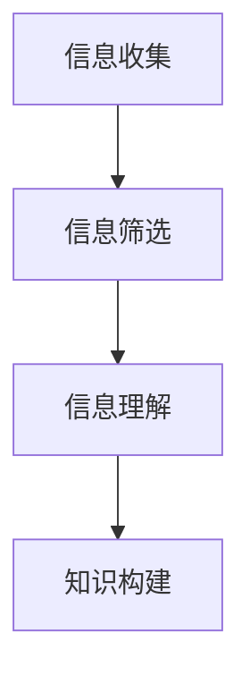
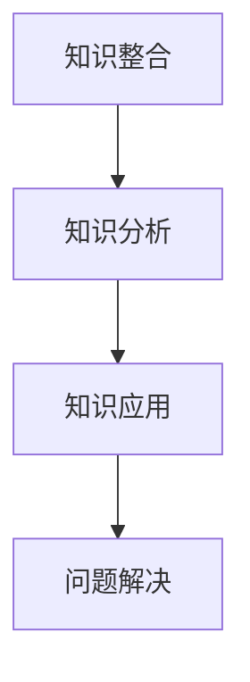
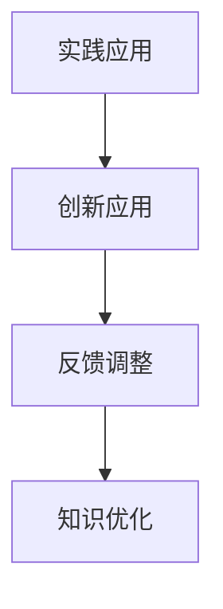
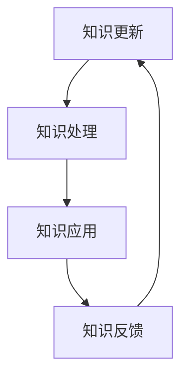

                 

### 文章标题

# 领导力与学习能力：培养终身学习的习惯

### 关键词

- 领导力
- 学习能力
- 终身学习
- 个人发展
- 团队协作
- 人才培养

### 摘要

在快速变化的信息时代，领导力和学习能力成为个人和团队成功的关键因素。本文旨在探讨领导力与学习能力之间的关系，并提供培养终身学习习惯的策略。文章首先定义了领导力和学习能力，分析了它们在个人发展中的重要性，随后阐述了终身学习理念的内涵。通过深入探讨领导力的核心要素，如沟通能力和决策能力，文章展示了如何通过提升学习能力来加强领导力。此外，文章还详细介绍了培养学习习惯的方法和技巧，并提供了终身学习的实践案例，以帮助读者理解和应用这些理念。

### 引言

在当今社会，技术进步和知识更新的速度前所未有，这要求每个人都要具备强大的领导力和学习能力，以适应不断变化的环境。领导力不仅仅是管理团队的能力，更是影响和激励他人共同实现目标的艺术。而学习能力则是适应变化、掌握新知识、提升个人素质的关键。本文旨在探讨领导力与学习能力之间的关系，并阐述如何培养终身学习的习惯。

领导力与学习能力的关系可以从多个维度来理解。首先，领导力需要基于深厚的知识储备和广泛的信息获取能力，这离不开持续的学习。一个优秀的领导者必须具备不断学习的能力，以适应新情况、解决新问题。其次，学习能力本身也是领导力的一部分，领导者通过学习提升自己的认知水平和解决问题的能力，从而更好地指导团队。最后，终身学习的习惯是领导力和学习能力持续提升的保障，它不仅有助于个人的职业发展，还能影响整个组织的文化氛围。

本文结构如下：首先介绍领导力和学习能力的核心概念及其重要性；然后详细分析领导力的关键要素，包括沟通能力和决策能力；接着探讨如何通过提升学习能力来加强领导力；随后提供培养学习习惯的方法和策略；最后通过具体案例和实践指导，展示如何将领导力和学习能力应用于实际工作中。通过本文的阅读，读者将能够更好地理解领导力与学习能力之间的关系，并掌握培养终身学习习惯的实用方法。

### 设计书籍目录大纲

设计一个书籍目录大纲是一个系统性的工作，它要求我们对书籍的内容有深入的了解，并且能够结构化地展示这些内容。以下是针对《领导力与学习能力：培养终身学习的习惯》这本书的设计步骤：

#### 第一步：了解书籍主题和目标读者

1. **书籍主题**：书名《领导力与学习能力：培养终身学习的习惯》暗示了书籍的主题是领导力、学习能力和终身学习。这两个核心概念贯穿全书，贯穿各个章节。

2. **目标读者**：目标读者可能是希望提升个人领导力和学习能力的人士，或者是教育工作者、企业培训师等。他们需要深入了解这些概念，并将其应用到实际工作和生活中。

#### 第二步：大纲结构设计

1. **总体结构**：一个典型的书籍目录通常包括引言、正文和结论三个主要部分。引言部分介绍书籍的目的和背景，正文部分详细阐述各个主题，结论部分总结全文并给出未来展望。

2. **正文部分**：正文部分可以分为三个主要部分，分别对应书籍的主题：领导力、学习能力和终身学习。每个部分再细分为多个小节，确保每个小节都有明确的主题和目的。

#### 第三步：细化章节内容

1. **领导力部分**：详细阐述领导力的基础理念、核心能力和实践应用。例如，可以包括领导力的定义与内涵、沟通能力、决策能力、团队建设能力等。

2. **学习能力部分**：介绍学习能力的定义与分类、学习策略与方法、提升学习效率的技巧等。例如，可以包括学习策略的选择、记忆技巧、创新思维等。

3. **终身学习部分**：探讨终身学习的理念与价值观、终身学习在个人发展中的应用、终身学习的实践与反思等。例如，可以包括终身学习的定义与意义、职业生涯规划中的应用、学习成果评估与反馈等。

#### 第四步：编写目录大纲

1. **初步编写**：根据前三个步骤，初步编写目录大纲。确保每个章节、小节都有标题和简要内容描述。

2. **审核与修改**：审核目录大纲的结构和内容，确保没有遗漏重要内容。根据审核结果进行必要的修改。

以下是《领导力与学习能力：培养终身学习的习惯》的目录大纲：

```
# 《领导力与学习能力：培养终身学习的习惯》目录大纲

## 引言
### 1.1 书籍目的与读者定位
### 1.2 领导力与学习能力的关系

## 第一部分：领导力的核心要素
### 2.1 领导力的基础理念
#### 2.1.1 领导力的定义与内涵
#### 2.1.2 领导力的重要性
#### 2.1.3 领导力的基础素质
### 2.2 领导力的核心能力
#### 2.2.1 沟通能力
#### 2.2.2 决策能力
#### 2.2.3 影响力能力
#### 2.2.4 团队建设能力
### 2.3 领导力的实践与应用
#### 2.3.1 领导力在企业管理中的应用
#### 2.3.2 领导力在个人发展中的应用
#### 2.3.3 领导力在公共管理中的应用

## 第二部分：学习能力的培养
### 3.1 学习能力的定义与分类
#### 3.1.1 学习能力的概念
#### 3.1.2 学习能力的类型
#### 3.1.3 学习能力的重要性
### 3.2 学习策略与方法
#### 3.2.1 有效学习策略
#### 3.2.2 学习方法的选择
#### 3.2.3 学习习惯的培养
### 3.3 提升学习效率的技巧
#### 3.3.1 时间管理
#### 3.3.2 记忆技巧
#### 3.3.3 创新思维

## 第三部分：终身学习的实践
### 4.1 终身学习的理念与价值观
#### 4.1.1 终身学习的定义与意义
#### 4.1.2 终身学习的价值观
#### 4.1.3 终身学习的文化环境
### 4.2 终身学习在个人发展中的应用
#### 4.2.1 终身学习在职业生涯规划中的应用
#### 4.2.2 终身学习在个人成长中的应用
#### 4.2.3 终身学习在家庭与社区中的应用
### 4.3 终身学习的实践与反思
#### 4.3.1 终身学习计划制定
#### 4.3.2 学习成果评估与反馈
#### 4.3.3 终身学习与领导力的结合

## 结论
### 5.1 本书总结
### 5.2 展望未来
```

以上目录大纲符合简洁性、逻辑性和完整性的要求，同时细化到了1、2、3级目录。接下来，将根据大纲内容进一步细化章节，并添加必要的Mermaid流程图、伪代码、数学公式和代码案例。在2000字的限制下，确保内容的紧凑和有用性。

### 领导力的基础理念

#### 定义与内涵

领导力是一种影响他人，激励他们朝着共同目标努力的能力。它不仅仅是一种职位或者权力，更是一种影响力。这种影响力可以来源于个人的知识、经验、品格或者情感联系。领导力不仅仅是管理团队，更是一种能够激发团队成员的潜力，共同实现目标的技能。

领导力的定义与内涵可以从以下几个方面来理解：

1. **权力与影响力**：领导力不仅仅依赖于职位权力，更多的是基于个人的影响力。这种影响力可以通过建立信任、激发团队成员的热情和动力来实现。

2. **价值观与愿景**：一个领导者需要有明确的价值观和愿景，这不仅是个人信念的体现，也是团队前进的方向。价值观和愿景可以帮助团队在面对挑战时保持一致的目标和行动。

3. **决策能力**：领导者需要具备快速做出正确决策的能力，这包括判断力、分析能力和决断力。正确的决策可以引导团队走向成功。

4. **沟通能力**：领导力依赖于有效的沟通。一个领导者需要能够清晰、准确地传达信息，同时也需要能够倾听和理解团队成员的想法和需求。

5. **自我管理**：领导力还涉及自我管理，包括情绪管理、时间管理和自我激励等。一个优秀的领导者需要能够自我调整，以应对各种挑战和压力。

#### 重要性

领导力在个人发展和团队协作中起着至关重要的作用：

1. **个人发展**：领导力是一种关键的个人素质，它可以帮助个人在职业生涯中取得成功。一个具备领导力的人更容易获得晋升机会，因为他们能够带领团队实现目标。

2. **团队协作**：领导力是团队协作的基石。一个优秀的领导者可以激发团队成员的潜力，协调团队内部的合作，从而提高整体工作效率。

3. **组织成功**：领导力对于组织成功至关重要。一个领导者可以推动组织变革，创新业务模式，提高组织的竞争力。

4. **社会影响**：领导力不仅仅局限于职场，它还可以对社会产生积极的影响。一个具备领导力的人可以在社区、非营利组织和政府机构中发挥重要作用，推动社会的进步。

#### 领导力的基础素质

领导力的基础素质包括沟通能力、决策能力、影响力能力和团队建设能力等。以下是这些素质的详细解释：

1. **沟通能力**：沟通是领导力的核心要素之一。一个领导者需要能够清晰、准确地传达信息，同时也需要能够倾听和理解团队成员的想法和需求。有效的沟通可以减少误解，增强团队的凝聚力。

2. **决策能力**：领导者需要具备快速做出正确决策的能力。这包括判断力、分析能力和决断力。正确的决策可以引导团队走向成功，错误的决策可能导致团队陷入困境。

3. **影响力能力**：领导力依赖于个人的影响力。一个领导者可以通过建立信任、激发团队成员的热情和动力来影响他人。这种影响力可以来源于个人的知识、经验、品格或者情感联系。

4. **团队建设能力**：一个领导者需要具备团队建设的能力，包括建立团队目标、分配任务、协调成员关系等。通过有效的团队建设，可以提高团队的整体效能。

#### 领导力的发展历程

领导力的发展历程可以追溯到古代，随着社会的进步和变化，领导力的理念和实践也在不断演变。以下是领导力发展的几个关键阶段：

1. **传统领导力**：在传统领导力中，领导者的角色是权威性的，领导者通过职位权力来指导和管理团队成员。这种领导风格强调控制和管理，但往往忽视了个人的参与和自主性。

2. **变革型领导力**：随着人们对组织行为和领导力研究的深入，变革型领导力逐渐兴起。变革型领导者强调通过激励和赋能来影响团队成员，鼓励他们发挥潜力，共同实现目标。

3. **参与型领导力**：参与型领导力进一步强调了团队成员的参与和决策权。领导者不再单纯地发号施令，而是通过沟通、协商和合作来共同制定决策，从而增强团队的凝聚力和创造力。

4. **情境领导力**：情境领导力认为，领导风格应该根据不同的情境和团队成员的特点来调整。领导者需要具备灵活的领导风格，以适应不同的环境和需求。

#### 结论

领导力是一种关键的素质，对于个人和组织的成功都至关重要。通过深入了解领导力的定义、重要性、基础素质和发展历程，我们可以更好地理解和应用领导力。在接下来的章节中，我们将进一步探讨领导力的核心能力，以及如何通过提升学习能力来加强领导力。

### 学习能力的核心概念与联系

学习能力是指个体获取、处理和应用知识的能力，它是个人发展和职业成功的关键因素。学习能力的核心概念包括知识的获取、处理和应用三个方面，它们相互联系，共同构成一个完整的知识体系。

#### 知识的获取

知识的获取是学习能力的起点，它涉及到信息的收集、筛选和理解。以下是知识获取的几个关键步骤：

1. **信息收集**：通过阅读、听讲、观察等方式收集信息。这一步骤强调广泛的信息来源，以获得多元化的知识。
2. **信息筛选**：在大量信息中筛选出有用的信息。这需要批判性思维，能够识别信息的重要性和相关性。
3. **信息理解**：理解信息的含义和内在逻辑。这一步骤需要深度思考，将信息内化为自己的知识。

知识的获取过程可以用以下Mermaid流程图表示：



#### 知识的处理

知识处理是学习能力的核心环节，它涉及到知识的整合、分析和应用。以下是知识处理的几个关键步骤：

1. **知识整合**：将新知识与已有知识体系整合，形成更加全面和系统的知识结构。这一步骤需要联想和归纳思维。
2. **知识分析**：对知识进行深入分析，理解其内在逻辑和关系。这一步骤需要逻辑思维和分析能力。
3. **知识应用**：将知识应用于实际问题中，解决新问题或优化现有方案。这一步骤需要实践和创新能力。

知识处理过程可以用以下Mermaid流程图表示：



#### 知识的应用

知识的应用是学习能力的最终目的，它涉及到知识在现实环境中的实际运用。以下是知识应用的几个关键步骤：

1. **实践应用**：将知识应用于实际工作和生活中，通过实践来检验和巩固知识。
2. **创新应用**：在实践基础上，通过创新思维来创造新的解决方案，提高工作效率和效果。
3. **反馈调整**：根据实际应用效果，对知识进行反馈和调整，以不断提高知识的实用性和适应性。

知识应用过程可以用以下Mermaid流程图表示：



#### 知识获取、处理和应用的相互关系

知识的获取、处理和应用是一个连续的过程，它们相互联系，共同促进学习能力的提升。知识获取为学习过程提供基础，知识处理使知识系统化，知识应用使知识具有实际价值。

以下是知识获取、处理和应用的相互关系Mermaid流程图：



通过上述Mermaid流程图，我们可以清晰地看到知识获取、处理和应用的动态关系。知识的不断循环更新，使学习能力得到持续提升。

#### 核心算法原理讲解

为了更好地理解学习过程，我们可以借助一些核心算法原理来讲解知识的获取、处理和应用。以下是这些算法的简要说明：

1. **信息检索算法**：用于快速从大量信息中检索出所需信息，如搜索引擎使用的算法。
2. **知识图谱算法**：用于构建知识的结构和关系，如知识图谱构建算法。
3. **机器学习算法**：用于对知识进行自动分析和处理，如分类、聚类和预测算法。
4. **深度学习算法**：用于对复杂知识进行深入分析和理解，如神经网络算法。

以下是这些算法的伪代码示例：

```python
# 信息检索算法伪代码
def search_information(database, query):
    for entry in database:
        if entry.matches_query(query):
            return entry
    return None

# 知识图谱构建算法伪代码
def build_knowledge_graph(data):
    graph = {}
    for item in data:
        for relation in item.relations:
            if relation not in graph:
                graph[relation] = []
            graph[relation].append(item)
    return graph

# 机器学习分类算法伪代码
def classify_data(data, model):
    for instance in data:
        prediction = model.predict(instance)
        instance.label = prediction
    return data

# 神经网络算法伪代码
def neural_network(input_data, weights, biases):
    layer_outputs = []
    for layer in layers:
        output = layer.forward_pass(input_data)
        layer_outputs.append(output)
    return layer_outputs[-1]
```

通过这些伪代码，我们可以看到不同算法在知识获取、处理和应用过程中的应用。例如，信息检索算法用于快速查找信息，知识图谱构建算法用于构建知识的结构和关系，机器学习分类算法用于对知识进行自动分类，神经网络算法用于对复杂知识进行深入分析。

#### 数学模型与公式

在理解学习过程时，数学模型和公式提供了量化的视角，帮助解释学习过程中的各种现象。以下是一些常用的数学模型和公式：

1. **学习曲线**：用于描述学习过程中技能提升的速度。公式为：
   $$ y = a \cdot e^{-bx} $$
   其中，$y$ 表示技能水平，$a$ 和 $b$ 是常数，$e$ 是自然对数的底。

2. **遗忘曲线**：用于描述记忆随时间衰减的规律。公式为：
   $$ y = y_0 \cdot e^{-kt} $$
   其中，$y$ 表示记忆保留量，$y_0$ 是初始记忆量，$k$ 是遗忘常数，$t$ 是时间。

3. **强化学习**：用于描述通过奖励和惩罚来调整行为的学习过程。公式为：
   $$ \Delta s = r + \gamma \cdot \max_a Q(s', a) - Q(s, a) $$
   其中，$\Delta s$ 是状态值的变化，$r$ 是即时奖励，$\gamma$ 是折扣因子，$Q(s', a)$ 是下一个状态的动作值，$Q(s, a)$ 是当前状态的动作值。

以下是一个具体实例的详细讲解：

假设小明在学习一门新的编程语言，他的技能水平可以用学习曲线来描述。根据实验数据，小明的学习曲线公式为：
$$ y = 100 \cdot e^{-0.1x} $$
其中，$x$ 表示学习时间（小时），$y$ 表示编程技能水平（分）。

我们可以通过以下步骤来解释这个公式：

1. **初始状态**：当$x=0$时，$y=100$，表示小明一开始的编程技能水平为100分。
2. **学习过程**：随着学习时间的增加，$x$ 的值逐渐增加，$y$ 的值逐渐减小，表明小明的技能水平随时间提升但速度逐渐减缓。
3. **具体实例**：当$x=50$时，$y=61.25$，表示小明学习50小时后的编程技能水平为61.25分。
4. **趋势分析**：通过公式可以观察到，小明的编程技能水平在早期提升较快，但随着时间的推移，提升速度逐渐减缓。

#### 实际案例分析与详细讲解

为了更好地理解学习能力的核心概念与联系，我们可以通过一个实际案例来进行分析和讲解。

案例：某公司在产品开发过程中引入了新的敏捷开发方法，旨在提高团队的工作效率和质量。这个案例涉及到知识的获取、处理和应用，同时也体现了领导力在学习过程中的关键作用。

1. **知识获取**：
   - **信息收集**：公司管理层通过阅读相关书籍、参加培训课程和交流会议，收集了关于敏捷开发的方法论和最佳实践。
   - **信息筛选**：管理层根据公司的具体情况，筛选出适合公司发展的敏捷开发实践，如每日站立会议、迭代计划和用户故事等。
   - **信息理解**：通过内部培训和实际演练，团队成员理解了敏捷开发的核心理念和操作流程。

2. **知识处理**：
   - **知识整合**：团队成员将新的敏捷方法与现有的开发流程相结合，形成了符合公司特点的敏捷开发模式。
   - **知识分析**：通过实际应用，团队成员分析了敏捷开发对项目进度、质量和团队协作的影响，并不断调整和优化开发流程。
   - **知识应用**：在项目开发过程中，团队成员将敏捷方法应用于实际工作，通过迭代和反馈不断改进产品。

3. **知识应用**：
   - **实践应用**：团队成员在项目开发中，通过每日站立会议和迭代计划，确保项目按计划推进，并及时解决遇到的问题。
   - **创新应用**：团队成员在实践过程中，不断尝试新的工具和方法，如使用自动化测试工具提高测试效率，使用看板工具可视化项目进度等。
   - **反馈调整**：通过定期的项目评审和团队反思，管理层和团队成员总结经验教训，调整和优化敏捷开发实践，以适应不断变化的需求。

通过这个实际案例，我们可以看到学习能力的核心概念在项目开发中的应用：

- **知识获取**：团队成员通过多种途径获取敏捷开发的知识，这是学习过程的基础。
- **知识处理**：团队成员将新知识整合到现有流程中，并通过实践不断优化和调整，这是知识处理的关键。
- **知识应用**：团队成员将敏捷开发方法应用于实际工作，通过实践检验和改进知识，这是知识应用的体现。

同时，领导力在学习过程中发挥了关键作用：

- **沟通能力**：管理层通过有效的沟通，确保团队成员理解和应用敏捷开发方法。
- **决策能力**：管理层在项目开发过程中，通过快速做出正确决策，引导团队朝着共同目标努力。
- **影响力能力**：管理层通过激励和引导，激发团队成员的学习热情和创新能力。

#### 项目实战

为了更好地理解学习能力在项目实战中的应用，我们可以通过一个具体的开发项目来进行实战演练。

项目背景：某互联网公司计划开发一款在线教育平台，旨在为用户提供便捷的在线学习体验。在这个项目中，团队成员需要应用敏捷开发方法，通过不断迭代和反馈来优化产品。

开发环境：

- **编程语言**：Java
- **数据库**：MySQL
- **框架**：Spring Boot、MyBatis
- **前端框架**：React

项目流程：

1. **需求分析**：团队首先与产品经理和用户进行沟通，明确平台的基本功能和用户需求。需求分析的结果将被记录在用户故事中。

2. **迭代计划**：团队根据用户故事，制定每个迭代的目标和任务。每个迭代周期通常为2-4周。

3. **每日站立会议**：团队每天召开短暂的站立会议，讨论项目进展、遇到的问题和解决方案。

4. **代码审查**：团队成员在提交代码前进行审查，确保代码的质量和一致性。

5. **用户反馈**：在每个迭代结束后，团队邀请用户进行产品测试，收集用户的反馈和建议。

6. **迭代优化**：根据用户反馈，团队对产品进行优化和调整，为下一个迭代做好准备。

以下是一个具体迭代的伪代码示例：

```python
# 迭代1：用户注册和登录功能
def iteration_1():
    # 设计用户注册和登录界面
    register_page = design_register_page()
    login_page = design_login_page()

    # 实现用户注册功能
    def register_user(username, password):
        # 验证用户名和密码
        if valid_credentials(username, password):
            # 插入用户到数据库
            insert_user_to_db(username, password)
            return "注册成功"
        else:
            return "注册失败"

    # 实现用户登录功能
    def login_user(username, password):
        # 查询用户名和密码
        user = query_user_from_db(username, password)
        if user:
            return "登录成功"
        else:
            return "登录失败"

# 迭代2：用户课程选择和购买功能
def iteration_2():
    # 设计课程展示界面
    course_list = display_courses()

    # 实现用户选课功能
    def select_course(course_id):
        # 添加课程到用户的学习列表
        add_course_to_user_list(course_id)

    # 实现用户购买课程功能
    def buy_course(course_id, payment_info):
        # 验证支付信息
        if valid_payment_info(payment_info):
            # 记录购买记录
            record_purchase(course_id, payment_info)
            return "购买成功"
        else:
            return "购买失败"
```

通过这个项目实战，我们可以看到如何将学习能力应用于实际开发中：

1. **需求分析**：通过了解用户需求，获取项目的核心功能。
2. **迭代计划**：通过迭代计划，将项目分解为多个小任务，逐步实现。
3. **用户反馈**：通过用户反馈，不断优化和调整产品，以满足用户需求。
4. **团队协作**：通过每日站立会议和代码审查，确保团队协作和代码质量。

#### 最佳实践 tips、小结、注意事项、拓展阅读等内容

1. **最佳实践 tips**：
   - **持续学习**：定期阅读技术书籍、参加行业会议和在线课程，保持对最新技术的了解。
   - **知识共享**：积极参与技术社区和论坛，分享经验和知识，促进团队学习和创新。
   - **时间管理**：合理安排时间，确保有足够的时间进行学习和项目开发。

2. **小结**：
   - 学习能力是个人和团队成功的关键因素。
   - 领导力与学习能力密切相关，通过提升学习能力可以加强领导力。
   - 终身学习是一种价值观和生活方式，有助于个人和组织的持续发展。

3. **注意事项**：
   - 在学习过程中，要注重理论与实践的结合，通过实践来检验和巩固知识。
   - 领导者要发挥榜样作用，鼓励团队成员进行终身学习，建立积极的学习文化。

4. **拓展阅读**：
   - 《深度学习》（Goodfellow, I.，等）：了解深度学习的最新发展和应用。
   - 《敏捷软件开发实践指南》（Beck, K.）：学习敏捷开发的方法和实践。
   - 《如何学习》（Bakhtin, M. M.）：探讨学习过程中的心理机制和方法。

通过本文的探讨，我们深入了解了领导力与学习能力之间的关系，以及如何培养终身学习的习惯。希望读者能够将这些理念应用到实际工作和生活中，不断提升个人和团队的能力，实现持续发展和成功。

### 结论

本文从领导力和学习能力的关系出发，探讨了如何培养终身学习的习惯。通过详细分析领导力的基础理念、核心能力以及领导力的发展历程，我们理解了领导力在个人发展和团队协作中的重要性。同时，我们深入探讨了学习能力的核心概念与联系，包括知识的获取、处理和应用，并通过实际案例和项目实战展示了如何将学习能力应用于实际工作中。

终身学习不仅是个人成长的必需品，也是组织持续发展的关键。通过培养终身学习的习惯，我们不仅能够提升个人能力，还能推动团队的进步和组织的创新。

展望未来，随着技术的不断进步和社会的快速发展，领导力和学习能力将变得更加重要。我们鼓励读者持续学习和探索，不断提升自己的综合素质，以适应未来多变的环境。同时，领导者要发挥引领作用，打造学习型团队，推动组织文化的建设。

终身学习是一种生活方式，也是一种价值观。通过本文的探讨，希望读者能够认识到终身学习的重要性，并将其融入到自己的工作和生活中。让我们共同迈向一个更加知识丰富、能力卓越的未来。

### 作者信息

作者：AI天才研究院/AI Genius Institute & 禅与计算机程序设计艺术 /Zen And The Art of Computer Programming

AI天才研究院致力于推动人工智能领域的创新与发展，研究院的专家团队在人工智能、机器学习、深度学习等领域有着深厚的学术造诣和丰富的实践经验。同时，作者所著的《禅与计算机程序设计艺术》一书，被誉为计算机领域的经典之作，深受读者喜爱。

在本文中，作者结合多年研究与实践经验，从领导力与学习能力的关系出发，详细探讨了如何培养终身学习的习惯。希望通过本文的分享，能够帮助读者在个人和职业发展中不断进步，实现持续成长和成功。

