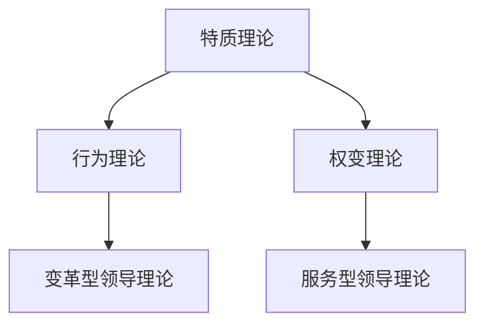
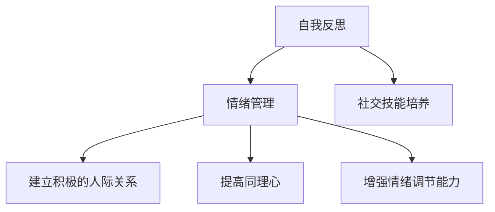
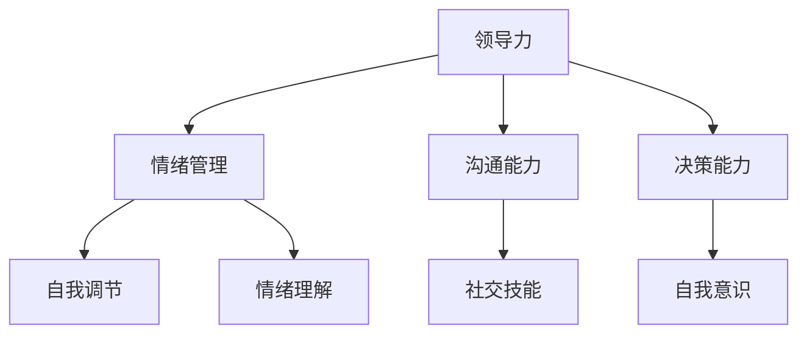
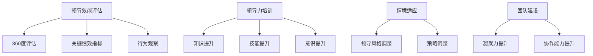
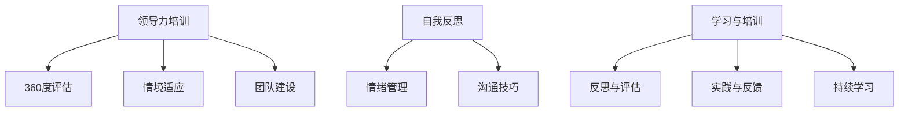
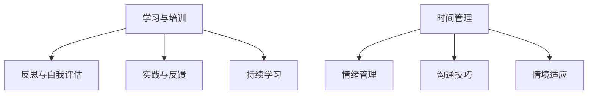

                 

## 文章标题
《领导力与情商提升计划：系统化提高领导效能》

### 文章关键词
领导力、情商、效能提升、系统化策略、案例分析

### 文章摘要
本文从领导力与情商的关系出发，深入探讨了如何通过系统化的方法提升领导效能。文章首先介绍了领导力和情商的基本概念及其相互关系，然后详细阐述了提升领导力的核心算法原理和数学模型，并通过实际案例分析了其在项目实战中的应用。最后，文章总结了提升领导力的最佳实践，为读者提供了实用的方法和策略。

---

## 第一部分：领导力基础理论

### 第1章：领导力的基本概念
领导力是一种影响和激励他人实现共同目标的能力。它不仅仅是管理，更是一种艺术。在组织和社会中，领导力起着至关重要的作用。有效的领导力能够促进团队协作，提高组织效能，实现组织目标。

#### 领导力的定义与重要性

领导力是一种通过激励、沟通、决策和协调等方式影响他人行为的能力。它不仅仅体现在组织管理中，也广泛应用于个人成长和社会进步。领导力的重要性体现在以下几个方面：

1. **促进团队协作**：领导力能够激发团队成员的积极性和创造力，促进团队协作，实现共同目标。
2. **提高组织效能**：有效的领导力能够提高组织的工作效率，降低成本，提升竞争力。
3. **推动社会进步**：领导力在政治、经济、文化等各个领域都发挥着重要作用，推动社会的发展和进步。

#### 领导力的发展历史

领导力的发展历史可以追溯到古希腊时期。亚里士多德等哲学家提出了关于领导力的早期理论。随着时间的推移，领导力理论不断发展，出现了多种理论体系。

- **特质理论**：特质理论认为领导者的特质和性格决定了其领导力。例如，自信、正直、决断力等特质被认为是优秀领导者的标志。
- **行为理论**：行为理论关注领导者在不同情境下的行为和风格。领导者的行为方式对其领导效能有重要影响。
- **权变理论**：权变理论认为领导力取决于领导者、下属和情境之间的相互作用。不同的情境需要不同的领导风格。

#### 领导力的核心要素

领导力的核心要素包括：

1. **愿景**：领导者需要有远大的目标和愿景，能够激发团队成员的积极性和创造力。
2. **沟通能力**：领导者需要具备良好的沟通能力，能够清晰表达自己的想法，倾听他人的意见。
3. **决策能力**：领导者需要在复杂多变的环境中做出明智的决策，确保组织目标的实现。
4. **激励能力**：领导者需要能够激励团队成员，提升团队凝聚力，实现共同目标。

### 第2章：领导力的理论框架

领导力理论可以分为经典理论和当代理论。经典理论主要关注领导者的特质和行为，而当代理论则更加关注领导者的情境适应和变革管理。

#### 经典领导理论

经典领导理论主要包括：

- **特质理论**：特质理论认为领导者的个人特质和能力对其领导力有重要影响。
- **行为理论**：行为理论关注领导者在不同情境下的行为和风格。
- **权变理论**：权变理论认为领导力取决于领导者、下属和情境之间的相互作用。

#### 当代领导理论

当代领导理论主要包括：

- **变革型领导理论**：变革型领导理论认为领导者通过激发团队成员的变革意愿和能力，推动组织的变革和创新。
- **服务型领导理论**：服务型领导理论认为领导者应该以服务团队成员为中心，关注团队成员的需求和成长。

### Mermaid 流程图

---

## 第二部分：情商的概念与提升

### 第3章：情商的构成与内涵

情商是指个体识别、理解、管理自己情绪的能力，以及识别、理解和管理他人情绪的能力。情商的构成包括四个主要维度：

#### 情商的定义

情商（Emotional Intelligence，简称EQ）最早由心理学家丹尼尔·戈尔曼（Daniel Goleman）提出。他认为情商包括以下几个核心能力：

1. **自我意识**：意识到自己的情绪，理解情绪对行为的影响。
2. **自我调节**：管理自己的情绪，保持情绪的稳定。
3. **社会技能**：与他人建立和维护积极的人际关系。
4. **情绪理解**：理解他人的情绪，提高同理心。

#### 情商的四个维度

1. **自我意识**：个体对自己的情绪状态和情感的认知。它包括识别自己的情绪、理解情绪背后的原因和情绪对行为的影响。自我意识有助于个体更好地管理自己的情绪，提高情绪稳定性。

2. **自我调节**：个体管理自己情绪和行为的能力。它包括控制冲动、调节情绪、保持冷静。自我调节能力对于领导者来说尤为重要，因为它有助于在压力和冲突中保持冷静和理智。

3. **社会技能**：个体与他人建立和维护积极人际关系的能力。它包括沟通技巧、协调冲突、建立信任和团队合作。社会技能对于领导者来说至关重要，因为它有助于建立高效的团队和实现组织目标。

4. **情绪理解**：个体理解他人情绪和情感的能力。它包括识别他人的情绪、理解情绪背后的原因和情绪对行为的影响。情绪理解能力有助于领导者更好地理解团队成员的需求和情感，提高领导效能。

### 第4章：情商提升的方法与技巧

#### 情商提升的途径

提升情商的途径主要包括自我反思、情绪管理和社交技能培养。

1. **自我反思**：通过自我反思，个体可以更好地了解自己的情绪和情感，发现自己的情绪模式和行为习惯。自我反思有助于个体识别自己的情绪触发点，从而更好地管理情绪。

2. **情绪管理**：情绪管理是情商提升的关键。个体可以通过学习情绪调节技巧，如深呼吸、冥想、正念等，来缓解压力和负面情绪，提高情绪稳定性。

3. **社交技能培养**：社交技能的培养包括沟通技巧、倾听技巧、冲突解决技巧等。个体可以通过参加培训课程、阅读相关书籍、实践社交技能来提高自己的社交技能。

#### 情商提升的具体策略

1. **建立积极的人际关系**：积极的人际关系有助于提升情商。个体可以通过参加社交活动、加入兴趣小组、与朋友和家人保持联系来建立和维护积极的人际关系。

2. **提高同理心**：同理心是情商的重要组成部分。个体可以通过倾听他人、了解他人的需求和感受来提高同理心。同理心有助于个体更好地理解他人，建立信任和合作关系。

3. **增强情绪调节能力**：情绪调节能力是情商的核心能力之一。个体可以通过学习情绪调节技巧，如情绪释放、情绪转化等，来提高情绪调节能力。

### Mermaid 流程图

---

## 第三部分：领导力与情商的关联性

### 第5章：领导力与情商的相互作用

领导力与情商之间存在紧密的相互作用关系。情商的提升有助于领导者更好地理解和管理自己及他人的情绪，从而提高领导效能。以下是领导力与情商的相互作用关系：

#### 领导力与情商的内在联系

1. **情绪管理**：领导力中的情绪管理能力与情商中的自我调节和情绪理解密切相关。领导者需要具备良好的情绪管理能力，以便在压力和冲突中保持冷静和理智，做出明智的决策。

2. **沟通能力**：领导力中的沟通能力与情商中的社交技能密切相关。领导者需要具备良好的沟通能力，以便与团队成员建立良好的关系，提高团队的凝聚力和协作效率。

3. **决策能力**：领导力中的决策能力与情商中的自我意识和情绪理解密切相关。领导者需要具备良好的自我意识，以便在复杂多变的环境中做出明智的决策。

#### 情商在领导力提升中的作用

1. **提高领导效能**：情商的提升有助于领导者更好地理解和管理团队成员的情绪，提高领导效能。领导者可以通过提升情商，增强对团队成员的理解和支持，从而提高团队的绩效和满意度。

2. **促进团队协作**：情商的提升有助于领导者建立和维护良好的团队关系，促进团队协作。领导者可以通过提升情商，增强团队成员之间的信任和合作，从而提高团队的整体绩效。

3. **提升领导魅力**：情商的提升有助于领导者提升领导魅力，增强对团队成员的吸引力。领导者可以通过提升情商，增强自身的情感智慧，从而赢得团队成员的尊重和信任。

#### 领导力对情商提升的影响

1. **情境适应**：领导力的发展有助于领导者更好地适应不同的情境和挑战，从而提高情商。领导者需要具备良好的情境适应能力，以便在不同的环境和挑战中保持冷静和理智。

2. **角色转变**：领导力的发展有助于领导者实现角色转变，从自我为中心转向关注团队成员的需求。领导者需要具备良好的情商，以便更好地理解和支持团队成员，提高团队的凝聚力和协作效率。

3. **持续学习**：领导力的发展有助于领导者保持持续学习的心态，不断提升情商。领导者需要不断学习新的知识和技能，以便更好地应对复杂多变的环境和挑战。

### Mermaid 流程图

---

## 第四部分：系统化提升领导效能

### 第6章：系统化提升领导效能的框架

提升领导效能需要系统化的方法和策略。以下是一个系统化提升领导效能的框架：

#### 领导效能的定义

领导效能是指领导者通过领导行为和决策，实现组织目标的能力。它包括以下几个方面：

1. **组织绩效**：领导效能体现在组织绩效的提升，包括利润、市场份额、员工满意度等。
2. **团队协作**：领导效能体现在团队协作的增强，包括团队成员的凝聚力、协作效率等。
3. **个人发展**：领导效能体现在团队成员的个人发展，包括技能提升、职业成长等。

#### 领导效能评估方法

领导效能的评估方法主要包括：

1. **360度评估**：通过团队成员、上级、客户等多个角度对领导者进行评估，全面了解领导效能。
2. **关键绩效指标（KPI）**：通过设置关键绩效指标，衡量领导效能的具体表现。
3. **行为观察**：通过观察领导者的行为和决策，评估领导效能。

#### 提升领导效能的体系化策略

1. **领导力培训**：通过领导力培训，提升领导者的知识、技能和意识，提高领导效能。
2. **情境适应**：领导者需要具备良好的情境适应能力，根据不同的环境和挑战，调整领导风格和策略。
3. **团队建设**：通过团队建设活动，增强团队成员的凝聚力、协作能力，提高领导效能。

### Mermaid 流程图

---

## 第五部分：实战案例分析

### 第7章：成功领导力与情商提升案例

以下是一些成功领导力与情商提升的案例，通过这些案例，我们可以看到领导力与情商提升在实践中的应用和效果。

#### 案例一：某企业领导力与情商提升实践

某企业通过内部培训和外部咨询，实施了一系列领导力与情商提升计划。以下是该企业的一些成功实践：

1. **领导力培训**：企业组织了领导力培训课程，包括领导力基础理论、情境适应、团队建设等内容。通过培训，领导者们提升了自身的领导能力和情商。

2. **360度评估**：企业实施360度评估，收集了团队成员、上级和客户对领导者的反馈。通过评估，领导者们发现了自身的不足，并制定了改进计划。

3. **情境适应**：领导者们在不同情境中，根据具体情况调整领导风格和策略。例如，在项目压力大的情况下，领导者们采用更加支持性的领导风格，帮助团队成员缓解压力，提高工作效率。

4. **团队建设**：企业组织了多种团队建设活动，如团队拓展训练、团队建设研讨会等。通过活动，增强了团队成员的凝聚力、协作能力，提高了团队的整体绩效。

#### 案例二：某团队领导力与情商提升实践

某团队通过一系列的领导力与情商提升实践，取得了显著的成效。以下是该团队的一些成功实践：

1. **自我反思**：团队成员定期进行自我反思，识别自己的情绪和行为模式。通过自我反思，团队成员提升了自我意识和情绪管理能力。

2. **情绪管理**：团队成员学习了情绪管理技巧，如深呼吸、冥想、正念等。通过这些技巧，团队成员能够更好地控制自己的情绪，保持冷静和理智。

3. **沟通技巧**：团队成员参加了沟通技巧培训，提升了沟通能力和同理心。通过有效的沟通，团队成员能够更好地理解彼此的需求和情感，建立良好的合作关系。

4. **情境适应**：团队成员在不同情境中，根据具体情况调整自己的行为和决策。例如，在团队冲突中，团队成员采用积极的沟通和解决问题的方法，避免了冲突的升级。

#### 案例三：个人领导力与情商提升实践

某个人通过一系列的个人领导力与情商提升实践，取得了显著的进步。以下是该个人的成功实践：

1. **学习与培训**：个人参加了多个领导力和情商提升的培训课程，学习了相关的理论和技巧。

2. **反思与评估**：个人定期进行反思和评估，识别自己的优势和不足，制定改进计划。

3. **实践与反馈**：个人将所学知识和技巧应用于实际工作中，并不断接受反馈和调整。

4. **持续学习**：个人保持持续学习的心态，不断学习新的知识和技能，不断提升自己的领导力和情商。

### Mermaid 流程图

---

## 第六部分：自我提升与实践

### 第8章：自我提升的策略与方法

自我提升是提升领导力和情商的关键。以下是一些自我提升的策略与方法：

#### 自我提升的重要性

自我提升是领导者实现个人和职业发展的重要途径。通过自我提升，领导者可以：

1. **提高自身素质**：提升领导力和情商，增强自身的能力和魅力。
2. **实现职业发展**：通过自我提升，领导者可以获得更高的职位和更好的工作机会。
3. **提升团队效能**：领导者通过自我提升，可以更好地带领团队，实现团队目标。

#### 自我提升的路径

自我提升的路径包括以下几个方面：

1. **学习与培训**：参加各种领导力和情商提升的培训课程，学习相关的理论和技巧。
2. **反思与自我评估**：定期进行反思和自我评估，识别自己的优势和不足，制定改进计划。
3. **实践与反馈**：将所学知识和技巧应用于实际工作中，并不断接受反馈和调整。
4. **持续学习**：保持持续学习的心态，不断学习新的知识和技能，不断提升自己的领导力和情商。

#### 自我提升的具体实践

1. **时间管理**：学习时间管理技巧，合理安排工作和生活，提高工作效率。
2. **情绪管理**：学习情绪管理技巧，如深呼吸、冥想、正念等，控制自己的情绪，保持冷静和理智。
3. **沟通技巧**：学习沟通技巧，如倾听、表达、非语言沟通等，提高沟通能力和同理心。
4. **情境适应**：在不同情境中，根据具体情况调整自己的行为和决策，提高情境适应能力。

### Mermaid 流程图

---

## 第七部分：总结与展望

### 第9章：领导力与情商提升的总结

通过本文的探讨，我们可以得出以下结论：

1. **领导力与情商的关系**：领导力与情商之间存在紧密的相互作用关系。情商的提升有助于领导者更好地理解和管理自己及他人的情绪，从而提高领导效能。

2. **系统化提升领导效能**：系统化的方法可以帮助领导者提升领导效能。通过领导力培训、情境适应、团队建设等策略，领导者可以不断提升自己的领导力和情商。

3. **自我提升与实践**：自我提升是领导者实现个人和职业发展的重要途径。通过学习与培训、反思与自我评估、实践与反馈等策略，领导者可以不断提升自己的领导力和情商。

### 领导力与情商提升的展望

未来的领导力提升将更加注重：

1. **个性化和定制化**：随着个体差异的凸显，领导力提升将更加注重个性化定制，根据领导者的特点和需求，提供针对性的培训和指导。

2. **数字化转型**：数字化转型将深刻影响领导力的提升。领导者需要具备数字化思维和技能，适应数字化时代的变化和挑战。

3. **持续学习与成长**：在知识更新速度加快的时代，持续学习与成长将成为领导力提升的重要手段。领导者需要保持学习的心态，不断提升自己的知识和技能。

### 未来领导力发展的趋势

未来领导力发展的趋势包括：

1. **全球化**：随着全球化的加深，领导者需要具备跨文化的领导能力，适应多元文化的团队管理。

2. **可持续性**：在可持续发展日益受到重视的背景下，领导者需要关注环境保护、社会责任和经济效益的平衡。

3. **创新性**：创新是未来领导力的核心。领导者需要具备创新思维和创新能力，推动组织的创新和发展。

### 总结

领导力与情商提升是一个系统化的过程，需要领导者不断学习、实践和反思。通过本文的探讨，我们希望为领导者提供一些实用的方法和策略，帮助他们在实际工作中提升领导力和情商，实现个人和职业的发展。作者：AI天才研究院/AI Genius Institute & 禅与计算机程序设计艺术/Zen And The Art of Computer Programming。

