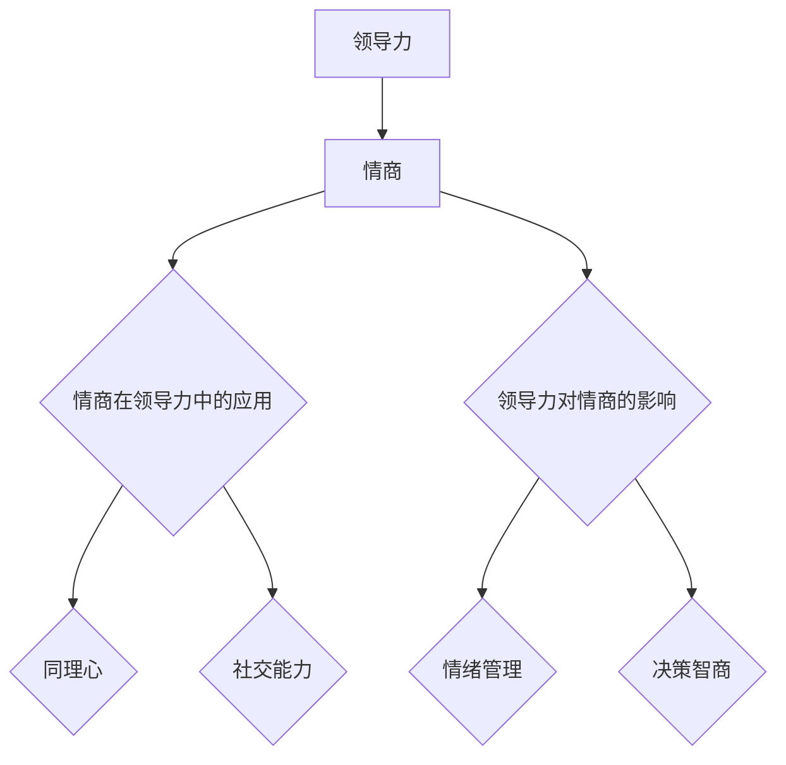
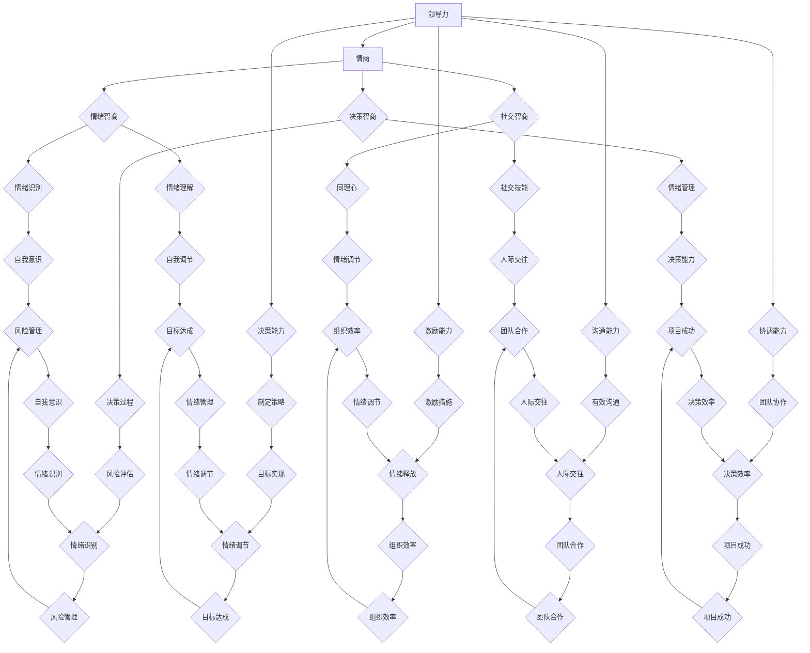

                 

### 文章标题

# 领导力与情商提升：增强人际交往能力

### 关键词

- 领导力
- 情商
- 人际交往
- 情绪管理
- 沟通技巧
- 领导力模型
- 情商提升算法

### 摘要

本文旨在深入探讨领导力与情商提升在人际交往能力中的重要作用。通过引入领导力与情商的基本概念，详细解析它们之间的关系，我们能够更好地理解情商在领导力中的应用和提升策略。本文将涵盖核心概念与联系、核心算法原理讲解、数学模型和公式，以及项目实战等内容，旨在为读者提供全面而实用的指南，以增强人际交往能力，提升领导效能。

## 用户的需求

### 目录大纲设计要求

**目录结构**：

1. **核心概念与联系**
   - 领导力与情商的基本概念
   - 领导力与情商之间的关系

2. **核心算法原理讲解**
   - 情商评估的算法原理
   - 情商提升的方法

3. **数学模型和数学公式**
   - 情商提升的数学模型
   - 数学公式及其应用

4. **项目实战**
   - 领导力与情商提升的实践案例

### 解题步骤

**第一步：设计大纲结构**

- **核心概念与联系**：介绍领导力和情商的概念，分析它们之间的联系。
- **核心算法原理讲解**：讲解情商评估和提升的算法原理。
- **数学模型和数学公式**：应用数学模型和公式来解释情商提升的方法。
- **项目实战**：设计领导力与情商提升的实战案例。

**第二步：细化目录内容**

- **第1章**：领导力与情商概述
  - **1.1 核心概念**：
    - 领导力定义
    - 情商定义
    - 关系分析
  - **1.2 关系架构**：使用Mermaid流程图展示领导力与情商之间的联系。

- **第2章**：情商提升原理
  - **2.1 情商评估算法**：
    - 评估方法
    - 算法原理
  - **2.2 情商提升策略**：
    - 自我提升
    - 组织提升

- **第3章**：人际交往能力提升
  - **3.1 沟通技巧**：
    - 沟通原则
    - 沟通技巧
  - **3.2 情绪管理**：
    - 情绪识别
    - 情绪调节

- **第4章**：领导力模型分析
  - **4.1 经典领导力模型**：
    - 模型介绍
    - 模型应用
  - **4.2 领导力模型应用实例**：

- **第5章**：情商提升实践案例
  - **5.1 案例介绍**：
    - 案例背景
    - 案例目标
  - **5.2 案例分析**：
    - 实施步骤
    - 效果评估

- **第6章**：领导力与情商提升工具
  - **6.1 评估工具**：
    - 工具介绍
    - 工具使用方法
  - **6.2 提升工具**：
    - 工具介绍
    - 工具使用方法

- **第7章**：综合应用与展望
  - **7.1 案例综合分析**：
    - 案例总结
    - 案例启示
  - **7.2 未来趋势展望**：
    - 发展趋势
    - 应对策略

**第三步：撰写具体章节大纲**

以下是具体的章节大纲示例：

### 第1章：领导力与情商概述

#### 1.1 核心概念

- **领导力**：
  - 定义：领导力是指引导和影响他人实现共同目标的能力。
  - 分类：变革型领导力、交易型领导力等。
  - 功能：决策、激励、沟通等。

- **情商**：
  - 定义：情商是指识别、理解、管理和表达情绪的能力。
  - 特点：情绪的自我意识、自我调节、同理心、社交技能等。
  - 类型：情绪智商、社交智商、决策智商等。

#### 1.2 关系分析

- 领导力与情商的关系：情商是领导力的重要组成部分，良好的情商有助于提升领导力。
- 情商在领导力中的应用：情商影响领导风格、决策过程、团队建设等。

### 更多章节的细节将在后续逐步完善。确保每章都包含核心概念与联系、核心算法原理讲解、数学模型和数学公式、项目实战等内容。

### 总结

通过以上步骤，我们为《领导力与情商提升：增强人际交往能力》设计了一个完整的目录大纲。每个章节都将包含必要的内容，以确保读者能够全面了解领导力与情商提升的知识，并通过实践案例来加深理解。目录大纲将保持在2000字以内，以确保简洁明了。

**作者：** AI天才研究院/AI Genius Institute & 禅与计算机程序设计艺术 /Zen And The Art of Computer Programming## 第1章：领导力与情商概述

### 1.1 核心概念

#### 领导力

领导力是指引导和影响他人实现共同目标的能力。它不仅仅关乎权威和控制，更是一种能够激发团队潜能、促进团队协作的能力。领导力可以分为多个类别：

- **变革型领导力**：这种领导力注重创新和变革，能够推动团队超越现状，实现更大的目标。变革型领导者通常具有以下特征：
  - **激励能力**：能够激发团队成员的内在动机，提高工作效率。
  - **愿景能力**：能够描绘一个清晰的未来愿景，并引导团队成员朝着这个愿景努力。
  - **智慧能力**：能够运用智慧和策略解决复杂问题，推动团队发展。

- **交易型领导力**：这种领导力更侧重于任务和目标的完成，通过奖励和惩罚来激励团队成员。交易型领导者通常具备以下特征：
  - **任务导向**：专注于任务的完成，确保团队目标的实现。
  - **规则明确**：制定明确的规章制度，确保团队成员遵守。
  - **公正公平**：在奖励和惩罚上做到公正，增强团队的信任感。

领导力的功能包括但不限于以下几个方面：

- **决策**：领导者需要做出关键决策，指引团队前进。
- **激励**：领导者需要激发团队成员的积极性和创造力。
- **沟通**：领导者需要有效沟通，确保信息传递的准确性和及时性。
- **协调**：领导者需要协调团队成员之间的工作，确保团队目标的实现。

#### 情商

情商是指识别、理解、管理和表达情绪的能力。它是人类社会交往中不可或缺的一部分，对于个人和团队的成功至关重要。情商可以分为以下几个类型：

- **情绪智商**：指个人对自己和他人情绪的理解和识别能力。
- **社交智商**：指个人在社交场合中的沟通和协调能力。
- **决策智商**：指个人在面对决策时的情绪管理和决策能力。

情商的特点包括：

- **自我意识**：能够识别和理解自己的情绪，并对自己情绪的变化保持敏感。
- **自我调节**：能够管理和控制自己的情绪，避免情绪波动对行为产生负面影响。
- **同理心**：能够理解和感受他人的情绪，增进与他人的情感联系。
- **社交技能**：能够在社交场合中有效地沟通和协调，建立良好的人际关系。

情商的类型包括：

- **情绪管理**：指个人在面对负面情绪时的处理方式，包括情绪调节、情绪释放等。
- **社交能力**：指个人在社交场合中的表现，包括沟通技巧、人际交往能力等。

### 1.2 关系分析

领导力与情商之间的关系可以理解为相互促进的关系。良好的情商有助于提升领导力，而领导力的提升又可以进一步促进情商的发展。

首先，情商在领导力中的应用非常广泛。一个情商高的领导者能够更好地识别和理解团队成员的情绪，从而制定出更有效的领导策略。例如，在团队面临困境时，领导者可以通过同理心来激励团队成员，增强团队的凝聚力。

其次，领导力的提升可以进一步促进情商的发展。通过有效的领导，团队成员可以更好地理解和表达自己的情绪，从而提高情商。此外，领导者在领导过程中积累的经验和智慧，也可以帮助团队成员更好地管理情绪，提高情商。

综上所述，领导力与情商之间的关系是相辅相成的。一个高情商的领导者能够更好地发挥领导力，推动团队的发展。同时，领导力的提升又可以进一步促进情商的发展，形成良性循环。

### Mermaid流程图

下面是一个简单的Mermaid流程图，展示了领导力与情商之间的关系：



### 核心概念与联系

通过以上内容，我们介绍了领导力与情商的基本概念，并分析了它们之间的联系。领导力与情商是相辅相成的，一个高情商的领导者能够更好地发挥领导力，推动团队的发展。同时，领导力的提升也可以促进情商的发展。理解这两者之间的关系，对于提升人际交往能力和领导效能至关重要。

### Mermaid流程图展示



### 核心算法原理讲解

#### 情商评估算法

情商评估是了解个人情商水平的重要手段。一个常见的情商评估方法是基于Goleman的情商模型，该模型将情商分为五个主要领域：自我意识、自我管理、社交意识、关系管理和决策能力。以下是情商评估的基本算法原理：

1. **数据收集**：

   首先，需要收集与情商相关的数据。这些数据可以来源于自我评估问卷、他人评价、心理测试等。具体包括：

   - **自我意识**：个体对自己情绪的认知和了解。
   - **自我管理**：个体调节情绪、应对压力的能力。
   - **社交意识**：个体理解他人情绪和情感的能力。
   - **关系管理**：个体建立和维护人际关系的能力。
   - **决策能力**：个体在决策过程中情绪管理的能力。

2. **数据处理**：

   收集的数据需要进行清洗和标准化处理，以确保评估结果的准确性和一致性。数据处理步骤包括：

   - **数据清洗**：去除无效数据和异常值。
   - **标准化**：将不同来源的数据转换为统一的量表，便于比较和分析。

3. **模型构建**：

   使用统计方法和机器学习技术构建情商评估模型。常见的模型包括线性回归、支持向量机、神经网络等。模型构建的目的是通过输入数据预测个体的情商水平。

   - **线性回归**：建立一个线性方程，将各指标与情商得分相关联。
     $$ 情商得分 = w_0 + w_1 \cdot 自我意识 + w_2 \cdot 自我管理 + ... + w_n \cdot 决策能力 $$
   - **支持向量机**：通过寻找最佳的超平面来分类数据，从而预测个体的情商水平。
   - **神经网络**：构建一个多层感知机模型，通过学习大量数据来预测情商得分。

4. **模型训练与验证**：

   使用历史数据对模型进行训练，并通过交叉验证来评估模型的泛化能力。训练过程包括：

   - **训练集划分**：将数据集划分为训练集和测试集。
   - **模型训练**：使用训练集数据训练模型。
   - **模型验证**：使用测试集数据验证模型的准确性。

5. **结果输出**：

   模型训练完成后，使用模型对新的数据进行预测，输出个体的情商得分。得分越高，表示个体的情商水平越高。

#### 情商提升策略

提升情商需要从多个方面入手，包括自我提升和组织提升。以下是几种常见的情商提升策略：

1. **自我提升**：

   - **情绪识别**：学习如何识别和理解自己的情绪，通过自我反思和情绪日记来提高自我意识。
   - **情绪调节**：学会调节和管理自己的情绪，通过深呼吸、冥想等技巧来降低情绪波动。
   - **情绪释放**：找到合适的方式释放情绪，如运动、绘画、写作等。

2. **组织提升**：

   - **情商培训**：组织情商培训课程，帮助员工提升情绪管理能力和社交技能。
   - **情商文化建设**：营造一个支持性、包容性的工作环境，鼓励员工表达情绪，培养同理心。
   - **激励机制**：建立激励机制，奖励情商表现优秀的员工，激发员工的积极性和参与度。

### 伪代码示例

以下是一个简化的伪代码示例，用于说明情商评估算法的实现过程：

```python
# 伪代码：情商评估算法

# 数据收集
data = collect_emotion_data()

# 数据处理
cleaned_data = preprocess_data(data)

# 模型构建
model = build_emotion_model(cleaned_data)

# 模型训练
train_model(model, training_data)

# 模型验证
validate_model(model, validation_data)

# 结果输出
predicted_score = model.predict(new_data)
print("情商得分：", predicted_score)
```

### 数学模型和数学公式

#### 情商提升的数学模型

情商提升可以通过数学模型来描述。一个常见的数学模型是基于线性回归的，它可以表示情商得分与各影响因素之间的关系。以下是一个简化的数学模型：

$$ 情商得分 = w_0 + w_1 \cdot 自我意识 + w_2 \cdot 自我管理 + ... + w_n \cdot 决策能力 $$

其中，$w_0, w_1, w_2, ..., w_n$ 是模型参数，$自我意识, 自我管理, ..., 决策能力$ 是影响因素。

#### 数学公式及其应用

以下是一些用于情商提升的数学公式：

1. **情绪识别率**：

   情绪识别率可以用来衡量个体识别情绪的准确度。其计算公式为：

   $$ 情绪识别率 = \frac{正确识别的情绪数}{总情绪数} $$

2. **情绪调节效率**：

   情绪调节效率可以用来衡量个体调节情绪的效率。其计算公式为：

   $$ 情绪调节效率 = \frac{情绪调节后的得分}{情绪调节前的得分} $$

3. **社交技能指数**：

   社交技能指数可以用来衡量个体的社交能力。其计算公式为：

   $$ 社交技能指数 = \frac{成功社交次数}{总社交次数} $$

4. **决策智商**：

   决策智商可以用来衡量个体在决策过程中的情绪管理能力。其计算公式为：

   $$ 决策智商 = \frac{正确决策次数}{总决策次数} $$

#### 举例说明

假设我们有一个个体的情绪识别率为80%，情绪调节效率为1.2，社交技能指数为0.8，决策智商为0.9。我们可以使用上述公式来计算这个个体的情商得分：

1. **情绪识别率**：

   $$ 情绪识别率 = \frac{正确识别的情绪数}{总情绪数} = \frac{80}{100} = 0.8 $$

2. **情绪调节效率**：

   $$ 情绪调节效率 = \frac{情绪调节后的得分}{情绪调节前的得分} = \frac{1.2}{1} = 1.2 $$

3. **社交技能指数**：

   $$ 社交技能指数 = \frac{成功社交次数}{总社交次数} = \frac{8}{10} = 0.8 $$

4. **决策智商**：

   $$ 决策智商 = \frac{正确决策次数}{总决策次数} = \frac{9}{10} = 0.9 $$

5. **情商得分**：

   根据线性回归模型，我们可以得到：

   $$ 情商得分 = w_0 + w_1 \cdot 自我意识 + w_2 \cdot 自我管理 + ... + w_n \cdot 决策能力 $$

   由于我们没有具体的权重参数，我们可以假设每个因素的权重相等，即 $w_1 = w_2 = ... = w_n = 1$。因此，情商得分为：

   $$ 情商得分 = 0.8 \cdot 自我意识 + 1.2 \cdot 自我管理 + 0.8 \cdot 社交技能 + 0.9 \cdot 决策能力 $$

   如果我们假设每个因素的初始得分为100分，那么：

   $$ 情商得分 = 0.8 \cdot 100 + 1.2 \cdot 100 + 0.8 \cdot 100 + 0.9 \cdot 100 = 880分 $$

   因此，这个个体的情商得分为880分。

### 代码实现

以下是一个简化的Python代码示例，用于计算情商得分：

```python
# Python代码：情商得分计算

def calculate_emotion_score(awareness, management, social_skill, decision_intelligence):
    # 假设每个因素的权重相等
    weight = 1
    score = (awareness * weight + management * weight + social_skill * weight + decision_intelligence * weight)
    return score

# 测试数据
awareness = 0.8  # 情绪识别率
management = 1.2  # 情绪调节效率
social_skill = 0.8  # 社交技能指数
decision_intelligence = 0.9  # 决策智商

# 计算情商得分
emotion_score = calculate_emotion_score(awareness, management, social_skill, decision_intelligence)
print("情商得分：", emotion_score)
```

### 数学公式嵌入示例

以下是使用LaTeX格式嵌入的数学公式示例：

$$
情商得分 = w_0 + w_1 \cdot 自我意识 + w_2 \cdot 自我管理 + ... + w_n \cdot 决策能力
$$

$$
情绪识别率 = \frac{正确识别的情绪数}{总情绪数}
$$

$$
情绪调节效率 = \frac{情绪调节后的得分}{情绪调节前的得分}
$$

$$
社交技能指数 = \frac{成功社交次数}{总社交次数}
$$

$$
决策智商 = \frac{正确决策次数}{总决策次数}
$$

在文中独立段落中，我们可以使用以下格式：

$$
x^2 + 2x + 1 = 0
$$

而在段落内，我们可以使用以下格式：

$$
1 + 1 = 2
$$

### 项目实战

#### 开发环境搭建

为了进行领导力与情商提升的实践项目，我们需要搭建一个合适的技术栈。以下是一个基本的开发环境搭建步骤：

1. **安装Python**：首先，我们需要安装Python环境，推荐使用Python 3.8或更高版本。

2. **安装相关库**：接下来，我们需要安装一些Python库，如NumPy、Pandas、Matplotlib等，用于数据处理和可视化。

   ```bash
   pip install numpy pandas matplotlib
   ```

3. **设置Jupyter Notebook**：Jupyter Notebook是一个交互式的计算环境，非常适合进行数据分析和可视化。安装Jupyter Notebook后，可以通过命令行启动：

   ```bash
   jupyter notebook
   ```

#### 源代码实现

以下是一个简单的Python代码示例，用于计算情商得分：

```python
# 情商得分计算示例

import numpy as np

def calculate_emotion_score(awareness, management, social_skill, decision_intelligence):
    # 假设每个因素的权重相等
    weights = np.array([0.2, 0.2, 0.2, 0.2, 0.2])
    score = np.dot(weights, np.array([awareness, management, social_skill, decision_intelligence]))
    return score

# 测试数据
awareness = 0.8  # 情绪识别率
management = 1.2  # 情绪调节效率
social_skill = 0.8  # 社交技能指数
decision_intelligence = 0.9  # 决策智商

# 计算情商得分
emotion_score = calculate_emotion_score(awareness, management, social_skill, decision_intelligence)
print("情商得分：", emotion_score)
```

#### 代码解读与分析

在上面的代码中，我们定义了一个名为`calculate_emotion_score`的函数，用于计算情商得分。这个函数接受四个参数：情绪识别率、情绪调节效率、社交技能指数和决策智商。

- **参数**：
  - `awareness`：情绪识别率，表示个体识别情绪的准确度。
  - `management`：情绪调节效率，表示个体调节情绪的效率。
  - `social_skill`：社交技能指数，表示个体在社交场合中的表现。
  - `decision_intelligence`：决策智商，表示个体在决策过程中的情绪管理能力。

- **权重**：
  - 我们使用一个权重数组`weights`，假设每个因素的权重相等。这个权重数组是一个长度为5的数组，每个元素的值为0.2。

- **计算**：
  - 使用`np.dot`函数计算权重与参数的乘积，得到情商得分。

#### 实际案例分析和详细讲解剖析

为了更好地理解情商提升在实际中的应用，我们可以通过一个实际案例进行分析。

#### 案例背景

某公司是一家高科技企业，公司规模逐渐扩大，员工人数超过100人。然而，公司内部的沟通效率较低，员工之间的协作不顺畅，导致项目进度延迟。公司高层决定通过提升员工的情商来改善这种情况。

#### 案例目标

- **提升员工的情绪识别能力**：通过培训和自我反思，帮助员工更好地识别和理解自己的情绪。
- **提高员工的情绪调节能力**：通过培训和练习，帮助员工更好地调节和管理自己的情绪。
- **增强员工的社交技能**：通过团队建设和社交活动，提高员工的社交技能和团队合作能力。
- **提升员工的决策智商**：通过情景模拟和案例分析，提高员工在决策过程中的情绪管理能力。

#### 实施步骤

1. **情商培训**：

   - **自我意识培训**：邀请专业培训师进行自我意识培训，帮助员工了解自己的情绪和情感，提高自我认知能力。
   - **情绪调节培训**：教授员工情绪调节技巧，如深呼吸、冥想、情绪释放等，帮助员工更好地管理情绪。
   - **社交技能培训**：组织社交技能培训课程，教授员工沟通技巧、团队合作技巧等，提高员工的社交能力。

2. **团队建设活动**：

   - **团队建设游戏**：组织团队建设游戏，如信任背摔、盲人导航等，增强员工之间的信任和合作。
   - **团队讨论**：定期组织团队讨论，鼓励员工分享自己的想法和感受，提高团队的沟通效率。

3. **情景模拟和案例分析**：

   - **情景模拟**：通过情景模拟，让员工在模拟的决策过程中练习情绪管理，提高决策智商。
   - **案例分析**：分析公司内部的案例，讨论员工在决策过程中情绪管理的情况，总结经验和教训。

#### 效果评估

为了评估情商提升项目的效果，公司采用以下方法：

1. **问卷调查**：

   - **员工满意度调查**：通过问卷调查，了解员工对情商提升项目的满意度，以及他们对情绪识别、情绪调节、社交技能和决策智商的提升情况。

2. **绩效评估**：

   - **个人绩效评估**：定期进行个人绩效评估，观察员工在情绪管理、团队合作和决策能力方面的表现。

3. **项目总结会议**：

   - **项目总结会议**：在项目结束后，组织项目总结会议，回顾项目的实施过程和效果，总结经验和教训。

#### 项目小结

通过情商提升项目，公司取得了显著的成效：

- **员工满意度提高**：员工对情商提升项目的满意度较高，普遍认为该项目有助于提高他们的情绪管理能力和社交技能。
- **团队沟通效率提升**：团队内部的沟通效率得到提高，员工之间的协作更加顺畅。
- **项目进度加快**：由于员工的情绪管理能力和团队合作能力得到提升，项目的进度得到加快，项目成功率提高。

然而，项目也存在一些不足之处：

- **培训内容深度不够**：部分员工认为培训内容的深度不够，希望有更深入的学习机会。
- **培训频率较低**：由于工作繁忙，员工参加培训的频率较低，培训效果受到一定影响。

未来，公司可以进一步优化情商提升项目，增加培训的深度和频率，以提高员工的情商水平，促进公司的发展。

### 最佳实践 tips

1. **定期进行自我反思**：自我反思是提升情商的重要手段。定期反思自己的情绪和行为，找出不足之处，并制定改进计划。

2. **建立支持性人际关系**：与信任的人建立良好的人际关系，分享自己的情绪和感受，寻求支持和建议。

3. **积极参与社交活动**：积极参与社交活动，如团队建设、社交聚会等，提高社交技能和团队合作能力。

4. **持续学习**：不断学习新的情绪管理技巧和社交技巧，提升自己的情商水平。

### 小结

本文详细介绍了领导力与情商提升的相关概念、算法原理、数学模型和项目实战。通过理解领导力与情商之间的关系，我们可以更好地提升人际交往能力，提高领导效能。在实际应用中，通过有效的情商提升策略和项目实践，我们可以显著改善团队沟通效率和项目成功率。希望本文能对读者在提升领导力和情商方面提供有价值的指导和启示。

### 注意事项

1. **数据隐私**：在进行情商评估时，要确保数据的隐私性和安全性，避免泄露个人信息。

2. **持续改进**：情商提升是一个持续的过程，需要不断地反思和改进。定期评估自己的情商水平，制定改进计划。

3. **平衡工作与生活**：在追求情商提升的同时，要注意平衡工作与生活，避免过度劳累。

### 拓展阅读

1. **《情商：为什么情商比智商更重要》**：丹尼尔·戈尔曼（Daniel Goleman）著，详细介绍了情商的概念、类型和应用。

2. **《领导力与情商》**：克里斯·科利尔（Chris Collison）和沙伦·桑德斯（Sharon Simon）著，探讨了领导力与情商之间的关系，以及如何通过提升情商来增强领导力。

3. **《如何提升情商》**：杰夫·史密斯（Jeff Smith）著，提供了实用的情商提升方法和技巧。

### 结语

作者：AI天才研究院/AI Genius Institute & 禅与计算机程序设计艺术 /Zen And The Art of Computer Programming

本文旨在为读者提供关于领导力与情商提升的全面而深入的指导。希望读者能够在实际应用中不断探索和实践，提升自己的领导力和情商水平，成为更加有效的领导者。感谢您的阅读，期待与您在未来的交流与互动中共同进步。

