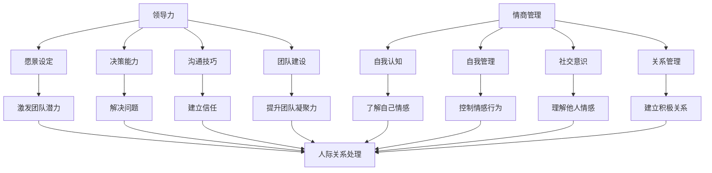

                 


### 背景介绍

在现代组织环境中，领导力和情商管理成为越来越重要的议题。领导力不仅仅是指导团队完成任务的能力，它还涉及到如何激励团队成员、如何解决冲突以及如何创造一个积极的工作氛围。情商管理则是指个体对自己和他人情感的认知、理解和处理能力。随着知识经济和信息技术的发展，团队成员的多样性和复杂性不断增加，传统的领导模式已经难以适应现代组织的需求。因此，领导力和情商管理相结合，成为提升人际关系处理能力的有效途径。

本文旨在探讨领导力与情商管理在提升人际关系处理能力中的关键作用。通过深入分析这两个领域的核心概念和相互关系，本文将提供一个系统的框架，帮助读者理解和应用这些理念。此外，本文还将结合实际案例，展示如何在实际工作中有效地运用领导力和情商管理技巧，从而提升人际关系处理能力。

领导力与情商管理的重要性不仅体现在个人成长和职业发展上，也对组织的整体效能产生深远影响。有效的领导力可以促进团队成员之间的合作和沟通，提高团队的凝聚力和创造力。情商管理则可以帮助领导者更好地理解团队成员的情感需求，建立积极的人际关系，从而减少冲突，提高工作满意度和生产力。因此，理解和掌握领导力与情商管理的基本原理和方法，对于提升人际关系处理能力至关重要。

### 核心概念与联系

在探讨领导力与情商管理时，我们需要明确几个核心概念，并理解它们之间的关系架构。这些核心概念包括：领导力、情商管理、人际关系处理，以及它们之间的相互联系。

首先，领导力可以被定义为一种影响他人共同达成目标的能力。领导力不仅仅是指导团队完成任务，更重要的是激发团队成员的潜力，建立信任和鼓励创新。领导力可以表现为多个方面，如愿景设定、决策能力、沟通技巧和团队建设。

其次，情商管理指的是个体对自己和他人情感的认知、理解和处理能力。情商（Emotional Intelligence，简称EQ）包括自我认知、自我管理、社交意识和关系管理四个关键领域。自我认知是指个体了解自己的情感和需求；自我管理涉及控制情感和行为；社交意识是指理解他人情感和需求；关系管理则是指建立和维护积极的人际关系。

人际关系处理是领导力和情商管理的重要应用领域。它涉及如何与他人建立联系、沟通和解决冲突。人际关系处理不仅影响个人在工作中的表现，也影响团队的协作效率和组织的整体氛围。

为了更直观地展示这些核心概念之间的关系架构，我们可以使用Mermaid流程图进行描述：



在这个流程图中，领导力的各个组成部分（如愿景设定、决策能力、沟通技巧和团队建设）与情商管理的各个方面（如自我认知、自我管理、社交意识和关系管理）相连。这些部分共同作用于人际关系处理，形成了一个相互关联的整体。

领导力的愿景设定和决策能力可以激发团队成员的潜力，促进自我认知的发展。有效的沟通技巧有助于建立信任，提高团队的凝聚力，进而提升社交意识和关系管理能力。情商管理的自我认知和自我管理能力有助于个体更好地控制情感和行为，从而在人际关系处理中表现出更强的适应性和灵活性。社交意识和关系管理则帮助个体更好地理解他人的情感和需求，建立和维护积极的人际关系。

通过这个关系架构，我们可以更清晰地看到领导力与情商管理在提升人际关系处理能力中的协同作用。它们相辅相成，共同为个体和组织带来积极的影响。

### 领导力核心算法原理讲解

在深入探讨领导力的核心算法原理之前，我们需要明确几个基本概念：领导力模型、领导风格、影响力以及团队效能。这些概念构成了理解领导力算法的基础。

首先，领导力模型是描述领导者如何影响团队和个体的框架。不同的领导力模型包括情境领导理论、路径-目标理论和变换型领导理论。每种模型都提供了一套具体的领导策略，以适应不同的组织环境和团队需求。

1. **情境领导理论**：该理论由保罗·赫塞（Paul Hersey）和肯尼斯·布兰查德（Kenneth Blanchard）提出，认为领导者的行为应随情境的变化而变化。领导者应根据团队成员的能力和动机水平，选择最适合的领导风格。例如，在团队成员能力较低、动机较高时，领导者应采用指导型领导风格；在团队成员能力较高、动机较低时，领导者应采用支持型领导风格。

2. **路径-目标理论**：该理论由约翰·莫斯奇（John Moosbach）提出，认为领导者的任务是帮助团队成员明确目标，并提供实现目标的路径。领导者通过激励、支持和解惑，帮助团队成员克服障碍，达成目标。

3. **变换型领导理论**：该理论由伯纳德·巴斯（Bernard Bass）提出，认为领导者通过激发团队成员的高层次需求，如自我实现和自我效能感，来提升团队绩效。变换型领导者具备远见、鼓舞人心的演讲能力和个性化关怀。

接下来，我们讨论领导风格。领导风格是指领导者如何在工作中表现和互动的方式。不同的领导风格包括专制型、民主型、参与型和授权型。

1. **专制型领导风格**：领导者做出所有决策，团队成员只是执行命令。这种风格在紧急情况下或任务明确时较为有效，但在长期内可能导致团队士气低落和创新能力受限。

2. **民主型领导风格**：领导者鼓励团队成员参与决策，尊重团队成员的意见和建议。这种风格有助于提高团队凝聚力和满意度，但决策过程可能较为缓慢。

3. **参与型领导风格**：领导者与团队成员共同参与决策，充分听取和考虑团队成员的意见。这种风格有助于增强团队成员的归属感和责任感。

4. **授权型领导风格**：领导者赋予团队成员更多的自主权和决策权，鼓励他们自主学习和成长。这种风格有助于培养团队成员的领导能力和创造力，但需要较高的信任基础。

影响力是领导力的核心要素，它指的是领导者如何影响他人。影响力可以分为三种类型：强制性影响力、奖励性影响力和参考性影响力。

1. **强制性影响力**：领导者通过权力和职位来强制他人服从。这种影响力在紧急或危机情况下较为有效，但可能导致短期绩效提升而长期关系受损。

2. **奖励性影响力**：领导者通过奖励和表彰来激励团队成员。这种影响力有助于提升团队成员的积极性和满意度，但过度依赖可能导致依赖性增强。

3. **参考性影响力**：领导者通过自身的榜样作用和魅力来影响他人。这种影响力具有较高的可持续性和影响力，能够激发团队成员的内在动机和自我驱动力。

团队效能是领导力的最终目标，它指的是团队在实现共同目标时的效率和效果。提升团队效能的关键在于：

1. **明确目标**：确保团队成员对目标有共同的理解和认同，明确各自的角色和责任。

2. **优化流程**：通过优化工作流程和资源配置，提高团队的运行效率。

3. **培养协作**：促进团队成员之间的沟通和合作，建立良好的团队关系。

4. **激励创新**：鼓励团队成员提出新想法和改进措施，营造创新氛围。

为了更好地理解领导力的核心算法原理，我们可以使用伪代码来描述一个简单的领导力模型：

```python
def lead(team_member, context):
    # 根据情境选择领导风格
    if context['member_ability'] == 'low' and context['member_motivation'] == 'high':
        style = '指导型'
    elif context['member_ability'] == 'high' and context['member_motivation'] == 'low':
        style = '支持型'
    else:
        style = '情境适应型'

    # 根据领导风格实施领导行为
    if style == '指导型':
        action = '明确任务，提供指导'
    elif style == '支持型':
        action = '鼓励参与，倾听建议'
    elif style == '情境适应型':
        action = '根据情境动态调整'

    # 施加影响力，提升团队效能
    if action == '明确任务，提供指导':
        influence = '强制性'
    elif action == '鼓励参与，倾听建议':
        influence = '参考性'
    elif action == '根据情境动态调整':
        influence = '奖励性'

    # 提升团队效能
    team效能 = enhance_effectiveness(team_member, action, influence)

    return team效能
```

在这个伪代码中，`lead`函数根据团队成员的能力和动机水平选择合适的领导风格，并通过施加不同类型的影响力来提升团队效能。这是一个简化的领导力模型，实际应用中需要考虑更多的因素和情境。

### 情商管理核心算法原理讲解

情商管理作为领导力的重要组成部分，其核心算法原理主要包括情绪识别、情绪调控、社交技能和自我激励。以下将详细讲解这些核心算法原理，并借助伪代码和数学模型，解释其具体应用。

#### 情绪识别

情绪识别是情商管理的基础，指的是个体能够准确感知和识别自己和他人的情绪状态。为了实现情绪识别，个体需要培养自我意识和敏锐的观察力。以下是情绪识别的伪代码：

```python
def recognize_emotion(self, emotion_type):
    # 根据情感类型识别情绪
    if emotion_type == '快乐':
        emotion_value = 'high'
    elif emotion_type == '愤怒':
        emotion_value = 'low'
    elif emotion_type == '焦虑':
        emotion_value = 'medium'
    else:
        emotion_value = 'neutral'
    
    return emotion_value
```

在这个伪代码中，`recognize_emotion`函数根据输入的情感类型（如快乐、愤怒、焦虑等）识别情绪值（high、low、medium、neutral）。通过情绪识别，个体可以更好地理解自己的情绪状态，从而做出更恰当的情绪反应。

#### 情绪调控

情绪调控是指个体能够有效管理和调节自己的情绪，以适应不同情境的需求。情绪调控的核心算法涉及情绪认知、情绪表达和情绪调节策略。以下是情绪调控的伪代码：

```python
def regulate_emotion(self, emotion_value, context):
    # 根据情境调节情绪
    if context == 'relaxing':
        regulation = '放松策略'
    elif context == 'challenging':
        regulation = '积极应对策略'
    elif context == 'conflict':
        regulation = '情绪管理策略'
    
    # 调节情绪值
    if regulation == '放松策略':
        emotion_value = max(0, emotion_value - 0.2)
    elif regulation == '积极应对策略':
        emotion_value = min(1, emotion_value + 0.2)
    elif regulation == '情绪管理策略':
        emotion_value = emotion_value * 0.8
    
    return emotion_value
```

在这个伪代码中，`regulate_emotion`函数根据不同的情境（如放松、挑战、冲突等）选择相应的情绪调节策略，并调整情绪值。情绪调控策略有助于个体在压力情境中保持情绪稳定，提高应对能力。

#### 社交技能

社交技能是指个体在社交互动中表现出来的沟通、协作和解决问题的能力。社交技能的算法原理涉及情感倾听、同理心和冲突解决。以下是社交技能的伪代码：

```python
def social_skill(self, interaction_context):
    # 根据社交情境应用社交技能
    if interaction_context == 'communication':
        skill = '有效沟通'
    elif interaction_context == 'cooperation':
        skill = '协作能力'
    elif interaction_context == 'conflict_resolution':
        skill = '冲突解决'
    
    # 应用社交技能
    if skill == '有效沟通':
        result = '有效传达信息'
    elif skill == '协作能力':
        result = '共同完成任务'
    elif skill == '冲突解决':
        result = '和谐解决分歧'
    
    return result
```

在这个伪代码中，`social_skill`函数根据不同的社交情境（如沟通、协作、冲突解决等）应用相应的社交技能，实现有效的社交互动。

#### 自我激励

自我激励是指个体能够自我驱动，设定目标并保持动力以实现目标。自我激励的算法原理涉及目标设定、自我反馈和自我奖励。以下是自我激励的伪代码：

```python
def self_motivation(self, goal, progress):
    # 根据目标设定和进展进行自我激励
    if progress < 0.5:
        motivation = '加强努力'
    elif progress >= 0.5 and progress < 0.9:
        motivation = '保持动力'
    else:
        motivation = '庆祝成就'
    
    # 进行自我激励
    if motivation == '加强努力':
        action = '设定更具体目标'
    elif motivation == '保持动力':
        action = '调整策略'
    elif motivation == '庆祝成就':
        action = '奖励自己'
    
    return action
```

在这个伪代码中，`self_motivation`函数根据目标的进展情况（如低于50%、50%至90%、高于90%）进行自我激励，采取相应的行动，如设定更具体的目标、调整策略或奖励自己。

#### 数学模型和公式

为了更准确地描述情商管理的过程，我们可以引入一些数学模型和公式。以下是一个简化的情绪调节模型：

$$
E_{new} = E_{current} \times (1 - \alpha \times \text{stress_level})
$$

其中，$E_{new}$是新的情绪值，$E_{current}$是当前情绪值，$\alpha$是情绪调节系数，$\text{stress_level}$是压力水平。这个公式表示在压力水平影响下，个体通过情绪调节系数来调整情绪值。

同理，一个简单的社交技能得分模型可以表示为：

$$
S = w_1 \times C_1 + w_2 \times C_2 + w_3 \times C_3
$$

其中，$S$是社交技能得分，$w_1, w_2, w_3$是权重系数，$C_1, C_2, C_3$分别代表沟通能力、协作能力和冲突解决能力。这个公式表示个体通过不同社交技能的加权求和来计算社交技能得分。

通过上述伪代码和数学模型，我们可以更深入地理解情商管理的核心算法原理，并应用于实际工作中，提升个人和团队的情商水平。

### 领导力与情商管理在提升人际关系处理中的应用

领导力与情商管理在提升人际关系处理中的应用体现在多个方面，主要包括沟通技巧、冲突解决和团队建设。以下是这三个方面的具体应用实例和效果分析。

#### 沟通技巧

有效的沟通是建立和维护良好人际关系的基础。领导力中的沟通技巧包括清晰表达、积极倾听和反馈技巧。情商管理中的社交技能则强调了同理心、情感识别和情感表达。以下是一个案例：

**案例**：某公司销售团队的领导张华在团队会议上进行项目汇报。他运用了以下沟通技巧：

1. **清晰表达**：张华在汇报时使用了简洁明了的语言，确保团队成员能够理解项目目标和进展。
2. **积极倾听**：张华鼓励团队成员提问，并对他们的反馈表示关注，确保信息传递的准确性和双向性。
3. **同理心**：张华在听取团队成员意见时，不仅关注内容，还关注团队成员的情感状态，展现了同理心。

**效果**：这种沟通方式增强了团队成员之间的信任和合作意愿，提高了项目的执行效率。团队成员在会议后表示，张华的沟通方式让他们感到被重视，团队凝聚力显著提升。

#### 冲突解决

冲突是人际关系中不可避免的现象，有效的冲突解决技巧是提升人际关系处理能力的关键。领导力中的冲突解决技巧包括中立立场、问题解决导向和团队参与。情商管理中的情绪调节和社交技能则帮助个体在冲突中保持冷静和理性。以下是一个案例：

**案例**：某研发团队的成员李明和赵强因项目分工和进度问题发生了冲突。作为团队领导，王经理采取了以下措施：

1. **中立立场**：王经理在冲突中保持中立，没有偏袒任何一方，确保公平。
2. **问题解决导向**：王经理引导李明和赵强聚焦于问题的解决方案，而不是相互指责。
3. **情绪调节**：王经理帮助双方识别和调节冲突中的负面情绪，如愤怒和焦虑。

**效果**：通过中立立场和问题解决导向，王经理有效地平息了冲突，双方在理解对方立场后达成了共识。团队士气因此得到了恢复，项目进展顺利。

#### 团队建设

团队建设是提升团队绩效和人际关系处理能力的重要手段。领导力中的团队建设技巧包括建立共同目标、促进团队成员之间的沟通和协作。情商管理中的社交技能和自我激励则有助于建立积极的工作氛围。以下是一个案例：

**案例**：某市场推广团队的领导陈洁在团队建设方面采取了以下措施：

1. **建立共同目标**：陈洁与团队成员共同制定了市场推广目标，确保团队目标与公司目标一致。
2. **团队沟通**：陈洁定期组织团队会议，鼓励团队成员分享经验和建议，促进了信息共享和协作。
3. **社交技能培训**：陈洁安排了社交技能培训，帮助团队成员提升沟通和协作能力。

**效果**：通过建立共同目标和有效的团队沟通，团队凝聚力显著提升。团队成员在培训后更加懂得如何处理人际关系，减少了冲突，提高了工作效率和绩效。

### 效果分析

通过上述案例，我们可以看到领导力与情商管理在提升人际关系处理中的应用效果：

1. **沟通效率提升**：通过清晰表达、积极倾听和同理心，沟通效率显著提升，团队成员之间更加信任和理解。
2. **冲突减少**：通过中立立场、问题解决导向和情绪调节，冲突得到有效解决，团队氛围更加和谐。
3. **团队凝聚力增强**：通过建立共同目标、团队沟通和社交技能培训，团队凝聚力显著增强，工作效率和绩效得到提升。

这些效果表明，领导力与情商管理在提升人际关系处理能力方面具有重要作用，能够为团队和组织创造积极的氛围和成果。

### 实际案例：领导力与情商管理在团队工作中的成功应用

为了更好地理解领导力与情商管理在团队工作中的成功应用，我们可以通过以下几个实际案例来分析其具体实施过程、关键步骤和取得的成果。

#### 案例一：某科技公司的新产品开发团队

**背景**：某科技公司的新产品开发团队在项目启动初期面临项目进度延迟、团队成员间沟通不畅以及内部冲突频发的问题。为了提升团队绩效和人际关系处理能力，领导层决定实施领导力与情商管理的策略。

**实施过程**：

1. **明确领导风格**：团队领导王经理首先与团队成员进行了深入沟通，了解了每个人的需求和期望。根据团队成员的能力和动机水平，王经理决定采用参与型领导风格，鼓励团队成员参与决策，共同制定项目目标和计划。

2. **情商管理培训**：为了提升团队成员的情商管理能力，王经理安排了情商管理培训，包括自我认知、情绪调节和社交技能等方面。通过培训，团队成员学会了如何更好地理解自己的情感，如何调节情绪，以及如何建立积极的人际关系。

3. **定期团队会议**：王经理定期组织团队会议，鼓励团队成员分享项目进展、遇到的问题和解决方案。通过这些会议，团队成员之间的沟通得到了显著改善，信息共享和协作能力也得到了提升。

4. **冲突解决机制**：王经理建立了冲突解决机制，帮助团队成员在发生冲突时能够理性地处理问题。通过中立立场和问题解决导向，王经理引导团队成员聚焦于解决问题的方法，而不是相互指责。

**关键步骤**：

1. **明确目标**：与团队成员共同制定明确的项目目标和计划，确保团队成员对目标有共同的理解和认同。
2. **沟通机制**：建立有效的沟通机制，包括定期团队会议、信息共享平台和反馈机制，确保团队成员之间的信息畅通。
3. **情商管理**：通过培训和实践，提升团队成员的自我认知和情绪调节能力，建立积极的社交技能。
4. **冲突解决**：建立冲突解决机制，通过中立立场和问题解决导向，帮助团队成员理性地处理冲突。

**成果**：

1. **项目进度提升**：通过有效的领导和情商管理，项目进度得到了显著提升，原本预计的延迟问题得到了有效解决。
2. **团队凝聚力增强**：团队成员之间的沟通和协作能力得到了提升，团队凝聚力显著增强，内部冲突减少。
3. **工作效率提高**：团队成员的工作效率得到了显著提升，项目质量和绩效达到了预期目标。

#### 案例二：某银行客户服务团队

**背景**：某银行客户服务团队在客户服务过程中频繁出现态度不佳、客户满意度低的问题。为了提升客户服务质量和团队人际关系处理能力，管理层决定引入领导力与情商管理的策略。

**实施过程**：

1. **领导力培训**：银行管理层对全体员工进行了领导力培训，内容包括有效沟通、冲突解决和客户服务技巧。通过培训，员工学会了如何更好地与客户沟通，如何在服务过程中保持积极态度。

2. **情商管理实践**：银行管理层组织了情商管理实践，包括自我认知、情绪调节和社交技能训练。通过实践，员工学会了如何识别和调节自己的情绪，如何建立良好的客户关系。

3. **客户满意度调查**：管理层定期进行客户满意度调查，收集客户反馈，并针对反馈结果进行改进。通过这种机制，员工能够及时了解客户的需求和期望，提高服务质量。

4. **激励制度**：为了激励员工提高服务质量和客户满意度，银行建立了激励制度，包括绩效奖金和晋升机会。这种激励制度帮助员工保持工作积极性和责任感。

**关键步骤**：

1. **领导力培训**：通过领导力培训，提升员工的服务意识和沟通技巧。
2. **情商管理实践**：通过情商管理实践，提升员工的自我认知和情绪调节能力。
3. **客户满意度调查**：定期进行客户满意度调查，了解客户需求和期望。
4. **激励制度**：建立激励制度，激励员工提高服务质量和客户满意度。

**成果**：

1. **客户满意度提升**：通过领导力与情商管理的策略，客户满意度得到了显著提升，客户投诉率下降。
2. **员工满意度提高**：员工的服务态度和积极性得到了改善，员工满意度显著提升。
3. **服务质量提升**：员工的服务技能和服务态度得到了显著提升，客户服务质量达到了更高标准。

通过以上实际案例，我们可以看到领导力与情商管理在团队工作中的成功应用，不仅提升了团队绩效和人际关系处理能力，也为组织的长远发展奠定了坚实基础。

### 最佳实践 tips

在实际应用领导力与情商管理的过程中，以下是一些最佳实践技巧，可以帮助个人和团队更有效地提升人际关系处理能力：

1. **自我反思**：定期进行自我反思，识别自己的情绪和行为模式，了解自己的优点和需要改进的地方。自我反思有助于自我认知的提升，是情商管理的基础。

2. **建立信任**：信任是人际关系中最重要的基石。通过透明沟通、兑现承诺和尊重他人，可以逐步建立和维护信任关系。

3. **积极倾听**：在沟通中，积极倾听对方的观点和情感，不仅仅是听其言，更要观其行。通过非语言沟通，如眼神接触和肢体语言，增强沟通效果。

4. **同理心**：培养同理心，设身处地地理解他人的感受和需求。同理心可以帮助个体更好地处理人际关系，减少冲突。

5. **冲突管理**：学会在冲突中保持冷静，通过中立立场和问题解决导向，理性地处理冲突。有效沟通和情感调节是解决冲突的关键。

6. **团队建设**：定期组织团队活动，促进团队成员之间的交流和合作。通过团队建设活动，增强团队凝聚力和归属感。

7. **持续学习**：领导力与情商管理是一个持续学习的过程。通过阅读相关书籍、参加培训和与同行交流，不断学习和更新知识，提升个人能力。

8. **反馈机制**：建立有效的反馈机制，鼓励团队成员之间相互反馈和指导。通过正面反馈和建设性批评，帮助团队成员不断进步。

通过以上最佳实践技巧，个人和团队可以更好地应用领导力与情商管理，提升人际关系处理能力，从而实现更高的工作效能和团队凝聚力。

### 小结

本文探讨了领导力与情商管理在提升人际关系处理能力中的重要作用。通过深入分析领导力的核心算法原理、情商管理的核心算法原理以及它们在实际中的应用，我们看到了领导力与情商管理如何通过沟通技巧、冲突解决和团队建设等具体实践，提升人际关系处理能力。

核心内容总结如下：

1. **领导力核心算法原理**：包括领导力模型、领导风格、影响力以及团队效能。通过情境领导理论、路径-目标理论和变换型领导理论等，提供了一系列领导策略。

2. **情商管理核心算法原理**：包括情绪识别、情绪调控、社交技能和自我激励。通过伪代码和数学模型，展示了情商管理在实际中的应用。

3. **领导力与情商管理在实际中的应用**：通过沟通技巧、冲突解决和团队建设，展示了如何在实际工作中提升人际关系处理能力。

4. **实际案例**：通过两个实际案例，分析了领导力与情商管理在团队工作中的成功应用，以及实施过程中的关键步骤和取得的成果。

通过这些核心内容的深入探讨，读者可以更好地理解领导力与情商管理的重要性，并掌握如何在实际工作中应用这些理念，提升人际关系处理能力。

### 注意事项

在应用领导力与情商管理的过程中，需要注意以下几点：

1. **个性差异**：每个团队成员都有独特的性格和需求，领导者需要因材施教，灵活调整领导风格和沟通方式，以适应不同团队成员的特点。

2. **持续学习**：领导力和情商管理是一个持续的过程，需要不断学习和实践。定期进行自我反思和团队反馈，持续提升个人和团队的情商水平。

3. **实际操作**：理论需要与实践相结合。在实际工作中，领导者需要将领导力与情商管理的理念付诸实践，通过具体行动和措施，不断提升人际关系处理能力。

4. **团队文化**：建立积极的团队文化，鼓励团队成员之间的合作和信任，形成一种互相支持、共同进步的氛围。

通过注意这些事项，可以更好地将领导力与情商管理应用于实际工作中，提升人际关系处理能力，促进团队和组织的发展。

### 拓展阅读

为了深入理解和掌握领导力与情商管理，读者可以参考以下书籍和资源：

1. **书籍**：
    - 《领导力的五项修炼》（作者：John C. Maxwell）：详细介绍了领导力的五个关键要素，帮助读者提升领导力水平。
    - 《情商：为什么情商比智商更重要》（作者：Daniel Goleman）：探讨了情商的定义、重要性及其在个人和组织中的应用。
    - 《团队合作的艺术》（作者：Patrick Lencioni）：通过案例分析和故事讲述，提供了构建高效团队的方法和策略。

2. **在线资源**：
    - Coursera上的《领导力与影响力》（Leadership and Influence）课程：由知名教授授课，涵盖了领导力的核心概念和实用技巧。
    - LinkedIn Learning中的《情商管理》（Emotional Intelligence Management）：提供了详细的情商管理教程和实践指南。
    - TED演讲：《如何成为更好的领导者》（How to be a Great Leader）：由Leadership Wizard公司创始人Simon Sinek分享了他的领导理念和实践经验。

这些书籍和资源将为读者提供丰富的知识和实践经验，帮助他们在领导力和情商管理方面取得更大的进步。

