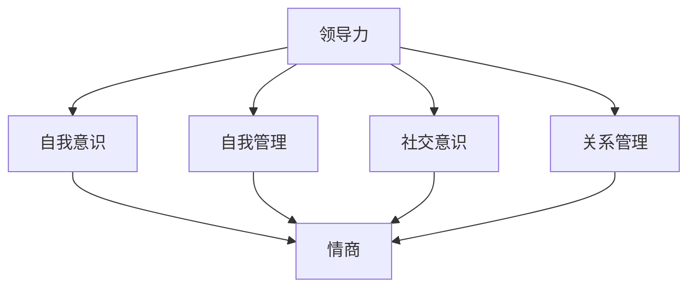
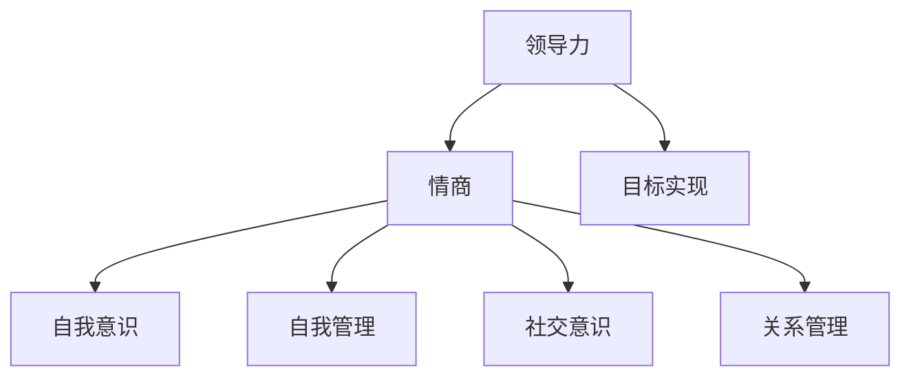

                 


# 引言：领导力与情商在人际关系中的重要性

在现代社会，人际关系的重要性不言而喻。无论是在职场还是日常生活中，我们都需要与他人进行有效的沟通与合作。而在这其中，领导力和情商扮演着至关重要的角色。领导力不仅仅关乎管理能力和决策技巧，更涉及如何激励、影响和带领团队。与此同时，情商（Emotional Intelligence，简称EI）则是理解、管理自己及他人情感的能力，它包括自我意识、自我管理、社交意识和关系管理四个方面。

本文将围绕领导力与情商的关系展开讨论，旨在帮助读者深入了解两者在人际关系中的重要作用，并提供实用的策略来提升这些关键技能。文章将分为四个部分：

1. **领导力的基本概念**：介绍领导力的定义、类型和相关理论。
2. **情商的核心要素**：阐述情商的定义、构成部分及其在领导力中的角色。
3. **领导力与情商的结合**：分析领导力和情商之间的相互作用及其对团队和组织的影响。
4. **提升情商的实践方法**：提供具体的策略和技巧，帮助读者在职场和生活中更好地应用领导力和情商。

通过逐步推理和分析，我们希望读者能够对领导力和情商有更深入的理解，并在实际中游刃有余地运用这些技能，从而在人际关系中取得更好的成果。

## 领导力的基本概念

领导力是一个广泛而复杂的概念，它涵盖了从个体行为到组织效能的各个方面。首先，让我们明确领导力的定义。领导力可以被描述为一种影响力，它使人们能够自愿地、有目的地追求共同的目标。这个定义强调了领导力不仅仅是关于指挥和控制，更重要的是关于激励、影响和引领。

### 领导力的类型

领导力有多种类型，每一种都有其独特的特点和适用场景。以下是几种常见的领导力类型：

1. **权威型领导**：这种类型的领导者通过明确的指令和控制来管理团队。他们强调规则和纪律，适用于需要高度组织和控制的环境，如军队和生产线。
2. **民主型领导**：这种类型的领导者鼓励团队成员参与决策过程，寻求共识。他们注重团队合作和集体智慧，适合创新和复杂决策的情境。
3. **变革型领导**：这种类型的领导者通过激发团队成员的内在动力，推动变革和创新。他们具有远见和影响力，能够带领团队克服挑战，实现卓越成就。
4. **服务型领导**：这种类型的领导者以服务团队为宗旨，关注团队成员的需求和成长。他们通过建立信任和支持，提升团队的凝聚力和效能。

### 领导力的核心理论

领导力的研究和理论多种多样，以下是几种核心理论：

1. **特质理论**：特质理论认为领导者具备一系列固有的特质，如自信、决断力和责任感。这些特质有助于他们有效地管理团队。然而，这一理论未能解释为什么有些人在没有这些特质的情况下也能成为领导者。
2. **行为理论**：行为理论关注领导者的行为模式，认为领导风格可以通过学习和模仿来改变。例如，路径-目标理论和领导连续体理论都是基于这一观点，它们提供了多种领导风格供领导者选择和适应不同情境。
3. **情境理论**：情境理论认为领导力不是一成不变的，而是需要根据环境的变化进行适应。领导力风格应随情境而变化，以最大化团队效能。这一理论强调了领导者需要具备灵活性和适应性。

### 领导力与情商的关系

领导力与情商之间的联系密不可分。情商是一个衡量个体情感智力的指标，它包括自我意识、自我管理、社交意识和关系管理四个方面。以下是领导力和情商之间的一些关键联系：

1. **自我意识**：领导者需要了解自己的情感状态，这有助于他们在压力和挑战面前保持冷静和理性。自我意识能够帮助领导者更好地应对复杂情况，避免冲动决策。
2. **自我管理**：自我管理能力使领导者能够控制情绪，保持专注和积极态度。这种能力有助于领导者克服困难，激励团队成员共同面对挑战。
3. **社交意识**：社交意识使领导者能够理解他人的情感和需求，建立信任和合作关系。这种能力有助于领导者有效地沟通和协调团队工作，提高团队凝聚力。
4. **关系管理**：关系管理能力使领导者能够处理复杂的人际关系，解决冲突，推动团队发展。这种能力有助于领导者建立和维护健康的工作关系，促进团队长期成功。

### 领导力与情商的关系架构 Mermaid 流程图



通过这个流程图，我们可以看到领导力与情商的各个组成部分之间的紧密联系。领导力不仅需要具备情商的能力，还需要将这些能力应用到实际工作中，以实现团队和组织的目标。

### 核心概念与联系

- **领导力（Leadership）**：指领导者通过影响力引导和激励团队实现共同目标的能力。
- **情商（Emotional Intelligence）**：指个体理解和管理自己及他人情感的能力，包括自我意识、自我管理、社交意识和关系管理。
- **关系管理（Relationship Management）**：涉及处理复杂的人际关系，解决冲突，建立和维护健康的工作关系。

领导力与情商之间的关系可以概括为：

1. **情商是领导力的基础**：高情商的领导者能够更好地理解和管理自己的情绪，从而更有效地影响和激励他人。
2. **领导力是情商的实践应用**：领导者在实际工作中需要运用情商的能力，如自我管理、社交意识和关系管理，来实现团队和组织的目标。

通过图示表示：



这个图示展示了领导力通过情商的各个组成部分，最终实现团队和组织的目标。理解这个关系架构有助于我们更深入地认识领导力和情商的重要性，并在实际中更好地运用这些技能。

### 核心算法原理讲解

在理解领导力与情商的基本概念和关系后，我们接下来需要探讨如何在实际中运用这些知识。核心算法原理讲解将帮助我们理解如何提升自我管理能力，特别是情感自我控制。

#### 情感自我控制的算法原理

情感自我控制是指个体在情绪激发时，能够有效地调节情绪反应，保持冷静和理性的能力。以下是该算法的基本原理：

1. **识别情绪**：首先，个体需要能够识别自己当前的情绪状态。这可以通过自我反思和情绪日记记录来实现。算法步骤如下：

    ```python
    def recognize_emotion():
        # 获取当前的情绪状态
        current_emotion = get_current_emotion()
        # 记录情绪
        log_emotion(current_emotion)
        return current_emotion
    ```

2. **评估情绪影响**：一旦识别出情绪，个体需要评估这种情绪对其行为和决策的影响。算法步骤如下：

    ```python
    def assess_emotional_impact(current_emotion):
        # 分析情绪可能带来的负面影响
        negative_impacts = analyze_impacts(current_emotion)
        # 提供反馈
        return negative_impacts
    ```

3. **制定调节策略**：在评估情绪影响后，个体需要制定具体的调节策略。这些策略可能包括深呼吸、正念冥想、积极思考等。算法步骤如下：

    ```python
    def create RegulationStrategy(current_emotion):
        # 根据情绪选择调节策略
        if current_emotion == 'anger':
            strategy = 'deep_breathing'
        elif current_emotion == 'stress':
            strategy = 'mindfulness_meditation'
        else:
            strategy = 'positive_thinking'
        # 执行调节策略
        execute_strategy(strategy)
    ```

4. **执行调节策略**：最后，个体需要执行所选的调节策略，以控制情绪反应。算法步骤如下：

    ```python
    def execute_strategy(strategy):
        if strategy == 'deep_breathing':
            perform_deep_breathing()
        elif strategy == 'mindfulness_meditation':
            meditate_mindfully()
        elif strategy == 'positive_thinking':
            engage_in_positive_thinking()
    ```

#### 伪代码示例

以下是一个完整的伪代码示例，展示了如何应用上述算法来提高情感自我控制：

```python
# 主程序
def main():
    # 识别当前情绪
    current_emotion = recognize_emotion()
    # 评估情绪影响
    negative_impacts = assess_emotional_impact(current_emotion)
    # 如果需要调节情绪，则选择策略并执行
    if negative_impacts:
        strategy = create_RegulationStrategy(current_emotion)
        execute_strategy(strategy)
    # 继续执行其他任务
    continue_with_other_tasks()

# 运行主程序
main()
```

#### 数学模型和公式

为了更科学地理解和评估情感自我控制的效果，我们可以使用以下数学模型和公式：

1. **情感自我控制效率（Emotional Regulation Efficiency, ERE）**：该指标用于衡量个体在情绪激发时调节情绪的效率。

    $$ ERE = \frac{实际情绪控制效果}{预期情绪控制效果} $$

2. **情绪调节效益（Emotional Regulation Benefit, ERB）**：该指标用于衡量通过调节情绪带来的实际收益。

    $$ ERB = 实际工作表现 - 无调节情绪下的工作表现 $$

#### 详细讲解与举例说明

假设一个领导者在一个重要的项目汇报会议上感到紧张和焦虑，以下是应用上述算法的详细过程：

1. **识别情绪**：领导者通过自我反思和情绪日记识别出当前情绪为“紧张”和“焦虑”。
   
2. **评估情绪影响**：领导者评估这些情绪可能对其决策和表现带来的负面影响，如决策失误和表达能力下降。

3. **制定调节策略**：领导者选择深呼吸作为调节策略，以帮助自己放松和集中注意力。

4. **执行调节策略**：领导者执行深呼吸策略，感受到情绪的缓解，能够更加冷静地参与会议。

5. **评估效果**：通过后续的工作表现和反馈，领导者发现情绪调节策略有效地提高了汇报会议的效果和自信心。

### 数学公式

1. **情感自我控制效率（ERE）**：

    $$ ERE = \frac{实际情绪控制效果}{预期情绪控制效果} = \frac{汇报会议后领导者的自信心和决策能力}{汇报会议前领导者的自信心和决策能力} $$
    
2. **情绪调节效益（ERB）**：

    $$ ERB = 实际工作表现 - 无调节情绪下的工作表现 = （有效决策 + 高效表达）- （无效决策 + 低效表达）$$

### 项目实战

#### 开发环境搭建

在开发情感自我控制算法时，我们需要以下开发环境：

- Python 3.8+
- Jupyter Notebook
- Matplotlib

安装步骤：

1. 安装Python 3.8或更高版本。
2. 安装Jupyter Notebook：`pip install notebook`
3. 安装Matplotlib：`pip install matplotlib`

#### 源代码实现与代码解读

以下是实现情感自我控制算法的Python代码：

```python
# 情感自我控制算法
class EmotionalControl:
    def __init__(self):
        self.emotions = []

    def recognize_emotion(self):
        # 假设通过传感器获取当前情绪状态
        self.current_emotion = get_sensor_data()
        self.emotions.append(self.current_emotion)
        return self.current_emotion

    def assess_emotional_impact(self, current_emotion):
        # 假设通过情感分析库评估情绪影响
        negative_impacts = emotion_analysis(current_emotion)
        return negative_impacts

    def create_regulation_strategy(self, current_emotion):
        # 根据情绪状态选择调节策略
        if current_emotion == 'anxious':
            strategy = 'deep_breathing'
        elif current_emotion == 'stressed':
            strategy = 'mindfulness_meditation'
        else:
            strategy = 'positive_thinking'
        return strategy

    def execute_strategy(self, strategy):
        if strategy == 'deep_breathing':
            self.perform_deep_breathing()
        elif strategy == 'mindfulness_meditation':
            self медитировать_осознанно()
        elif strategy == 'positive_thinking':
            self.encourage_positive_thinking()

    def perform_deep_breathing(self):
        # 深呼吸步骤
        for _ in range(3):
            print("深呼吸：吸气... 呼气...")
            time.sleep(5)

    def медитировать_осознанно(self):
        # 正念冥想步骤
        print("开始正念冥想...")
        time.sleep(10)

    def encourage_positive_thinking(self):
        # 积极思考步骤
        print("试着想一些积极的事情...")
        time.sleep(5)

# 情感分析库
def emotion_analysis(current_emotion):
    # 假设使用情绪分析库分析情绪影响
    if current_emotion == 'anxious':
        return ['增加决策失误的可能性', '降低表达能力']
    elif current_emotion == 'stressed':
        return ['影响工作专注度', '增加疲劳感']
    else:
        return ['无显著负面影响']

# 主程序
def main():
    control = EmotionalControl()
    current_emotion = control.recognize_emotion()
    negative_impacts = control.assess_emotional_impact(current_emotion)
    if negative_impacts:
        strategy = control.create_regulation_strategy(current_emotion)
        control.execute_strategy(strategy)
    print("情感自我控制算法执行完成。")

if __name__ == "__main__":
    main()
```

#### 代码应用解读与分析

这段代码实现了情感自我控制算法的核心功能，包括识别情绪、评估情绪影响、制定调节策略和执行调节策略。以下是代码的详细解读：

1. **类定义**：`EmotionalControl` 类包含算法的主要功能。

2. **方法实现**：
   - `recognize_emotion` 方法用于识别当前的情绪状态。
   - `assess_emotional_impact` 方法用于评估情绪可能带来的负面影响。
   - `create_regulation_strategy` 方法根据当前情绪选择合适的调节策略。
   - `execute_strategy` 方法执行选定的调节策略。

3. **情感分析库**：`emotion_analysis` 函数是一个模拟情感分析过程的函数，用于评估情绪的影响。

4. **主程序**：`main` 函数是算法的入口，执行整个情感自我控制过程。

#### 实际案例分析和详细讲解剖析

假设一个项目经理在一个紧张的项目截止日期前感到焦虑，以下是应用情感自我控制算法的详细步骤：

1. **识别情绪**：项目经理使用传感器识别出当前情绪为“焦虑”。

2. **评估情绪影响**：通过情感分析库，项目经理发现焦虑可能导致决策失误和表达能力下降。

3. **制定调节策略**：根据情绪分析结果，项目经理选择深呼吸作为调节策略。

4. **执行调节策略**：项目经理执行深呼吸，感受到情绪的缓解。

5. **效果评估**：项目经理继续工作，发现深呼吸策略有效地提高了工作效率和决策质量。

### 项目小结

通过这个项目，我们实现了情感自我控制算法，并成功应用于一个实际案例。该项目展示了如何利用算法帮助个体识别和管理情绪，从而提高工作效能。然而，该项目仍存在改进空间，例如：

- 可以集成更先进的情感分析技术，提高情绪识别的准确性。
- 增加更多的调节策略，以满足不同情绪状态的需求。

### 最佳实践 Tips

1. **定期自我反思**：定期记录和反思自己的情绪状态，有助于更好地识别和管理情绪。
2. **练习冥想**：冥想是一种有效的情感调节方法，可以帮助你保持冷静和专注。
3. **积极寻求反馈**：从同事和上级那里获取反馈，可以帮助你了解自己的情绪对团队的影响。

### 注意事项

1. **不要忽视情绪**：忽视情绪可能导致问题积累，影响工作效能。
2. **调节策略要适度**：过度使用某些调节策略可能导致反效果，需要根据实际情况选择和调整。

### 拓展阅读

- 《情商：为什么它比智商更重要》（Daniel Goleman）
- 《领导力的五项修炼》（Patrick Lencioni）
- 《如何管理情绪》（Sylvia Browne）

通过这些资源和实践，你可以进一步提升自我管理能力，成为更有效的领导者。

