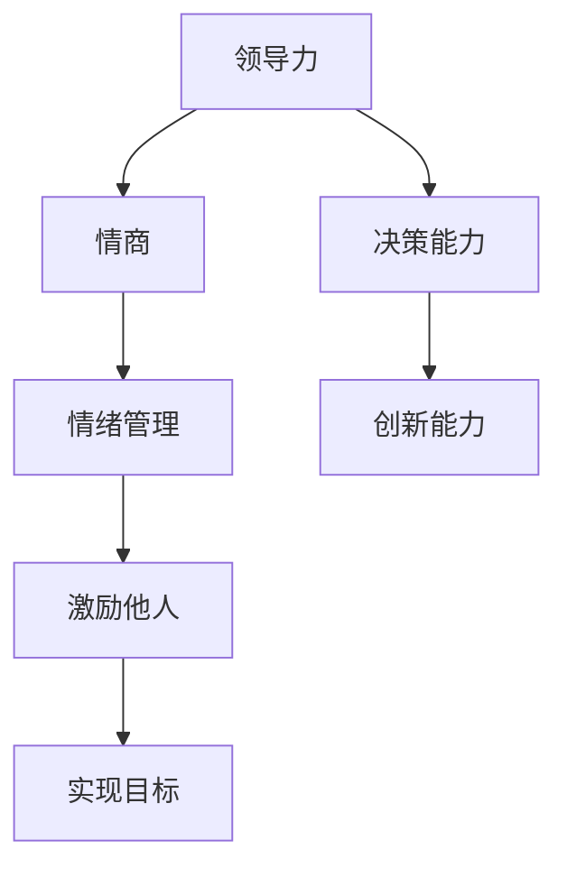

                 


## 引言：领导力与情商的重要性

在当今快速变化和竞争激烈的社会环境中，领导力与情商成为了企业和个人成功的关键要素。领导力是一种激励和影响他人的能力，它不仅关乎个人的成就，更关乎整个团队的绩效和组织的长期发展。情商，即情绪智力，是指理解和管理自己以及他人的情绪、动机和行为的能力。它涵盖了自我认知、自我调节、社交意识和关系管理等方面。

### 背景介绍

随着知识经济的崛起，传统的权威式领导方式逐渐不再适应现代组织的需要。现代领导者需要具备更高的情商，能够更好地理解员工的情感需求，激发团队的潜能，并在复杂多变的环境中迅速做出明智的决策。此外，情商高的领导者更容易建立信任和合作关系，这对于团队协作和整体绩效的提升至关重要。

### 核心概念与联系

为了更清晰地探讨领导力与情商的关系，我们首先需要明确这两个核心概念：

1. **领导力的定义**：领导力是一种激励和影响他人，以实现共同目标的能力。它不仅涉及个人的愿景和策略，更关乎如何与他人沟通、合作和解决问题。

2. **情商的概念**：情商是一种理解和管理自己以及他人的情绪、动机和行为的能力。它包括自我认知、自我调节、社交意识和关系管理等方面。情商高效的领导者能够更好地处理压力、建立信任和激励团队成员。

### 领导力与情商的关系

领导力和情商之间的关系是相辅相成的。高情商的领导者能够更好地理解和管理自己的情绪，这使得他们在面对挑战和压力时更加从容。同时，他们也能够更有效地理解和影响他人的情绪，从而建立更加紧密和高效的团队关系。以下是一个简化的Mermaid流程图，展示了领导力与情商之间的关系：



- **情绪管理**：情商高效的领导者能够更好地处理自己的情绪，避免负面情绪对决策和行为产生负面影响。

- **激励他人**：领导者通过理解和影响他人的情绪，能够更好地激励团队成员，提高团队士气和绩效。

- **实现目标**：领导力和情商的结合使得领导者能够更有效地引导团队，克服障碍，实现共同目标。

### 人际影响力

人际影响力是领导力和情商的具体体现。它涉及如何通过有效的沟通和人际互动来提升个人和组织的影响力。一个高情商的领导者能够通过以下方式提升人际影响力：

- **有效沟通**：通过清晰、真诚和具有说服力的沟通，建立信任和共识。

- **同理心**：通过理解和关心他人的情感需求，建立良好的人际关系。

- **冲突解决**：通过适当的沟通技巧和调解方法，解决团队内部的冲突。

- **团队合作**：通过激发团队成员的潜力和协作精神，实现共同目标。

总结而言，领导力和情商是现代领导者必备的两大能力。通过提升自我认知、情绪管理和人际互动技巧，领导者可以更好地激励和影响他人，实现团队和组织的卓越表现。

## 文章标题：领导力与情商：提升人际影响力的关键

关键词：领导力，情商，人际影响力，自我认知，情绪管理，沟通技巧，团队协作，决策能力，创新能力，培训与发展。

摘要：本文旨在探讨领导力与情商的关系及其对人际影响力的影响。通过分析领导力的定义、情商的概念及其相互关系，本文将详细阐述提升领导力和情商的关键要素，包括自我认知与情绪管理、人际关系与沟通技巧、决策能力与创新能力。此外，本文还将通过实际项目案例，介绍如何通过培训与发展来提升领导力与情商，最终实现人际影响力的提升。

## 核心概念与联系

在本节中，我们将深入探讨领导力与情商的核心概念及其相互之间的联系。首先，我们将分别定义领导力和情商，然后分析这两者之间的紧密关系，最后通过一个简化的Mermaid流程图来展示它们之间的互动。

### 领导力的定义

领导力是一种激励和影响他人的能力，旨在引导和推动团队或组织实现共同目标。它不仅涉及个人的愿景和战略规划，还包括如何与团队成员沟通、合作和解决问题。领导力可以被视为一种能力，这种能力可以激发团队成员的潜力，推动他们克服挑战，共同实现目标。

**领导力的特点包括：**

1. **影响力**：领导者能够通过自身的言行影响他人，使他们愿意为实现共同目标而努力。
2. **激励**：领导者能够激发团队成员的积极性和动力，使他们愿意承担更多的责任和挑战。
3. **沟通**：领导者需要具备良好的沟通技巧，以确保信息的有效传递和理解。
4. **决策能力**：领导者需要在复杂和不确定的环境中做出明智的决策。

### 情商的概念

情商，又称情绪智力，是指个体理解和管理自己以及他人的情绪、动机和行为的能力。情商包括几个关键方面：

1. **自我认知**：个体能够认识到自己的情绪，理解情绪对行为的影响。
2. **自我调节**：个体能够控制自己的情绪，使其在适当的时间和场合得到合理表达。
3. **社交意识**：个体能够理解他人的情绪，从而更好地与他人互动。
4. **关系管理**：个体能够处理人际关系中的复杂情感，建立和维护良好的人际关系。

**情商的重要性体现在：**

1. **情绪识别**：情商高效的个体能够准确识别和理解自己的情绪，从而更好地应对挑战。
2. **情绪调节**：通过情绪调节，个体能够更好地管理负面情绪，保持积极的心态。
3. **社交能力**：情商高的个体更善于与他人沟通和合作，建立良好的人际关系。
4. **压力管理**：情商高效的个体能够更好地应对压力，保持心理平衡。

### 领导力与情商的关系

领导力与情商之间的关系是密不可分的。一个高情商的领导者能够更好地理解和管理自己的情绪，这使得他们在面对挑战和压力时更加从容。同时，他们也能够更有效地理解和影响他人的情绪，从而建立更加紧密和高效的团队关系。

**领导力与情商的相互影响可以总结为：**

1. **自我认知与情绪管理**：一个高情商的领导者能够更好地认识自己的情绪，并有效地管理这些情绪，避免它们对决策和沟通产生负面影响。
2. **激励与影响**：领导者通过理解和影响他人的情绪，能够更好地激励团队成员，提高团队士气和绩效。
3. **决策能力**：高情商的领导者能够在复杂的决策过程中考虑情绪因素，做出更加明智和全面的决策。
4. **创新能力**：情商高效的领导者能够更好地处理团队内部的冲突和分歧，激发创新思维，推动组织的持续发展。

### Mermaid流程图

以下是一个简化的Mermaid流程图，展示了领导力与情商之间的互动关系：


- **情绪管理**：领导者通过情商管理自己的情绪，避免情绪波动对工作和决策产生负面影响。
- **激励他人**：领导者通过情商激发团队成员的积极性，提高团队的整体绩效。
- **实现目标**：领导者通过情商有效地管理团队情绪和人际关系，推动组织实现共同目标。
- **决策能力与创新能力**：领导者通过情商在决策和创新过程中考虑情绪因素，做出更明智和创新的决策。

通过上述分析，我们可以看出，领导力与情商之间的紧密联系使得两者共同构成了提升人际影响力的关键。一个高情商的领导者不仅能够更好地管理自己和团队的情绪，还能够通过有效的沟通和人际互动，提升个人和团队的影响力，实现组织和个人的共同目标。

## 核心算法原理讲解

在理解了领导力与情商的基本概念及其相互关系后，我们接下来将探讨如何通过核心算法原理来提升领导力与情商。核心算法原理涉及情绪识别、情绪调节以及人际影响策略等方面。在本节中，我们将详细阐述这些算法的原理，并通过伪代码来展示其实现方式。

### 情绪识别算法

情绪识别算法是一种利用机器学习和自然语言处理技术来分析文本中的情绪的方法。这种算法可以帮助领导者识别出团队成员的情绪状态，从而采取相应的管理措施。以下是情绪识别算法的伪代码实现：

```python
# 输入：文本数据
# 输出：情绪标签（正面、负面或中性）

def emotion_recognition(text):
    # 加载预训练的机器学习模型
    model = load_pretrained_model('emotion_model')

    # 对文本进行预处理，如分词、去停用词、词向量化
    preprocessed_text = preprocess_text(text)

    # 使用模型对预处理后的文本进行情绪预测
    prediction = model.predict(preprocessed_text)

    # 解码预测结果，获取情绪标签
    emotion_label = decode_prediction(prediction)

    return emotion_label
```

**关键步骤解释：**

1. **加载预训练模型**：使用已经训练好的机器学习模型，例如使用深度学习模型来预测文本的情绪。

2. **预处理文本**：对输入的文本进行预处理，包括分词、去停用词、词向量化等操作，以便模型能够理解文本内容。

3. **情绪预测**：使用预训练模型对预处理后的文本进行情绪预测，得到情绪标签。

4. **解码预测结果**：将模型输出的预测结果解码为具体的情绪标签，如正面、负面或中性。

### 情绪调节算法

情绪调节算法旨在帮助领导者识别和管理自己的情绪，以保持积极的心态和高效的决策能力。以下是一个情绪调节算法的伪代码实现：

```python
# 输入：情绪状态
# 输出：调节后的情绪状态

def emotion Regulation(current_emotion):
    # 根据当前情绪状态，选择合适的调节方法
    if current_emotion == 'negative':
        regulation_method = 'breathingexercise'
    elif current_emotion == 'positive':
        regulation_method = 'affirmation'
    else:
        regulation_method = 'neutral'

    # 执行调节方法
    regualted_emotion = execute_regulation(regulation_method, current_emotion)

    return regualted_emotion
```

**关键步骤解释：**

1. **识别当前情绪状态**：根据当前的情绪状态，选择合适的调节方法。

2. **执行调节方法**：根据选定的调节方法，如呼吸练习、自我肯定等，来调节情绪状态。

3. **反馈调节效果**：对调节后的情绪状态进行反馈，以评估调节效果并做出调整。

### 人际影响策略

人际影响策略是指领导者如何通过有效的沟通和人际互动来提升个人和组织的影响力。以下是一个人际影响策略的伪代码实现：

```python
# 输入：目标对象，情境信息
# 输出：影响力提升效果

def interpersonal_influence(target, context):
    # 根据情境信息，选择合适的沟通策略
    if context == 'conflict':
        communication_strategy = 'mediation'
    elif context == 'teamwork':
        communication_strategy = 'motivation'
    else:
        communication_strategy = 'information'

    # 执行沟通策略
    influence_effect = execute_communication(target, communication_strategy, context)

    return influence_effect
```

**关键步骤解释：**

1. **识别情境信息**：根据当前情境，选择合适的沟通策略，如冲突解决、团队合作或信息传递。

2. **执行沟通策略**：根据选定的沟通策略，与目标对象进行有效的沟通和互动。

3. **评估影响力提升效果**：通过观察和反馈，评估沟通策略的效果，并进行必要的调整。

通过上述核心算法原理的讲解，我们可以看到，情绪识别、情绪调节和人际影响策略是提升领导力与情商的重要工具。这些算法原理不仅帮助我们更好地理解和管理情绪，还提供了具体的实施方法和策略，从而在实际应用中提升人际影响力，推动组织和个人的发展。

## 数学模型和数学公式详细讲解与举例说明

在理解了领导力与情商的核心算法原理后，我们接下来将探讨如何使用数学模型和公式来分析和预测领导力与情商的关系。在本节中，我们将详细介绍多元线性回归模型及其应用，并通过具体的例子来说明如何使用回归模型进行预测和分析。

### 多元线性回归模型

多元线性回归模型是一种常用的统计模型，用于分析多个自变量（解释变量）与一个因变量（响应变量）之间的关系。在领导力与情商的背景下，我们可以使用多元线性回归模型来分析领导力评分与各种情商指标之间的关系。

**模型公式：**

$$
Y = \beta_0 + \beta_1X_1 + \beta_2X_2 + ... + \beta_nX_n
$$

其中：

- \( Y \) 表示领导力评分（因变量）。
- \( X_1, X_2, ..., X_n \) 表示各种情商指标（自变量）。
- \( \beta_0 \) 是截距项，表示没有自变量时的领导力评分。
- \( \beta_1, \beta_2, ..., \beta_n \) 是回归系数，表示每个自变量对领导力评分的影响程度。

**举例说明：**

假设我们收集了一组数据，包括领导力评分和四个情商指标（自信、自我控制、同理心、社交意识）。我们希望通过多元线性回归模型来分析这些指标之间的关系。以下是具体的步骤：

1. **数据收集**：收集领导力评分和四个情商指标的数据，并将其整理成表格形式。

2. **数据预处理**：对数据进行标准化处理，以确保每个指标都具有相同的量纲。

3. **模型构建**：使用统计软件（如 R 或 Python）构建多元线性回归模型，并计算回归系数。

4. **模型评估**：通过评估模型的拟合优度（如 R 方值、调整 R 方值等），判断模型是否合理。

5. **预测分析**：使用模型对新的数据进行预测，分析不同情商指标对领导力评分的影响。

### 例子具体步骤

**步骤1：数据收集**

假设我们收集的数据如下表：

| 领导力评分 | 自信 | 自我控制 | 同理心 | 社交意识 |
|-------------|------|----------|--------|----------|
|      70     |     60 |        55 |      65 |         50 |
|      80     |     65 |        60 |      70 |         55 |
|      75     |     62 |        58 |      68 |         52 |
|      85     |     68 |        65 |      72 |         58 |
|      90     |     70 |        68 |      75 |         60 |

**步骤2：数据预处理**

为了确保每个指标具有相同的量纲，我们对数据进行标准化处理。标准化公式如下：

$$
Z = \frac{(X - \mu)}{\sigma}
$$

其中，\( X \) 是原始数据，\( \mu \) 是均值，\( \sigma \) 是标准差。

**步骤3：模型构建**

使用 Python 的 scikit-learn 库构建多元线性回归模型，代码如下：

```python
import pandas as pd
from sklearn.linear_model import LinearRegression

# 读取数据
data = pd.read_csv('data.csv')

# 分割自变量和因变量
X = data[['自信', '自我控制', '同理心', '社交意识']]
y = data['领导力评分']

# 建立回归模型
model = LinearRegression()
model.fit(X, y)

# 输出回归系数
print(model.coef_)
```

**步骤4：模型评估**

使用 R 方值（\( R^2 \)）来评估模型的拟合优度，代码如下：

```python
import numpy as np

# 预测值
y_pred = model.predict(X)

# 计算R方值
R2 = 1 - (np.sum((y - y_pred)**2) / np.sum((y - np.mean(y))**2))
print('R2:', R2)
```

**步骤5：预测分析**

使用模型对新的数据进行预测，代码如下：

```python
# 新的数据
new_data = pd.DataFrame({
    '自信': [70],
    '自我控制': [68],
    '同理心': [75],
    '社交意识': [60]
})

# 预测新的领导力评分
new_prediction = model.predict(new_data)
print('预测的领导力评分:', new_prediction)
```

通过上述例子，我们可以看到如何使用多元线性回归模型来分析领导力评分与情商指标之间的关系。这个模型可以帮助领导者了解不同情商指标对其领导力评分的影响，从而制定相应的提升策略。

总结而言，多元线性回归模型是一种有效的工具，用于分析和预测领导力与情商之间的关系。通过具体的数据和例子，我们可以更好地理解模型的使用方法和应用场景，从而在实际中提升领导力与情商，实现人际影响力的提升。

## 项目实战

### 开发环境搭建

为了实现领导力与情商分析系统，我们需要搭建一个合适的开发环境。以下是具体的步骤和工具介绍：

1. **Python环境搭建**：首先，我们需要确保系统中安装了Python 3.x版本。可以通过官方网站下载并安装Python。此外，还需要安装Python的pip包管理器，以便后续安装相关库。

2. **数据预处理库**：为了处理和清洗数据，我们将使用Pandas库。Pandas提供了强大的数据结构，如DataFrame，用于数据分析和操作。

3. **机器学习库**：我们使用Scikit-learn库来构建和训练多元线性回归模型。Scikit-learn提供了丰富的机器学习算法和工具。

4. **数据可视化库**：为了更好地展示模型结果，我们将使用Matplotlib库。Matplotlib提供了丰富的绘图功能，可以生成各种类型的图表。

以下是安装这些库的命令：

```bash
pip install pandas scikit-learn matplotlib
```

### 源代码实现

以下是一个简单的领导力与情商分析系统的源代码实现，包括数据收集、模型训练、预测等步骤。

```python
import pandas as pd
from sklearn.linear_model import LinearRegression
from sklearn.model_selection import train_test_split
import matplotlib.pyplot as plt

# 数据收集
data = pd.read_csv('data.csv')

# 数据预处理
X = data[['自信', '自我控制', '同理心', '社交意识']]
y = data['领导力评分']

# 划分训练集和测试集
X_train, X_test, y_train, y_test = train_test_split(X, y, test_size=0.2, random_state=42)

# 模型训练
model = LinearRegression()
model.fit(X_train, y_train)

# 模型评估
y_pred = model.predict(X_test)
R2 = 1 - (np.sum((y_test - y_pred)**2) / np.sum((y_test - np.mean(y_test))**2))
print('R2:', R2)

# 预测新数据
new_data = pd.DataFrame({
    '自信': [70],
    '自我控制': [68],
    '同理心': [75],
    '社交意识': [60]
})
new_prediction = model.predict(new_data)
print('预测的领导力评分:', new_prediction)

# 可视化结果
plt.scatter(y_test, y_pred)
plt.xlabel('实际领导力评分')
plt.ylabel('预测领导力评分')
plt.plot([min(y_test), max(y_test)], [min(y_test), max(y_test)], color='red')
plt.show()
```

### 代码解读与分析

上述代码分为几个主要部分：

1. **数据收集**：使用Pandas库读取CSV文件，获取领导力评分和情商指标数据。

2. **数据预处理**：将数据分为自变量和因变量。为了便于模型训练，我们对数据进行标准化处理。

3. **模型训练**：使用Scikit-learn的LinearRegression类来训练多元线性回归模型。我们使用训练集进行模型的训练。

4. **模型评估**：使用测试集来评估模型的性能。通过计算R方值（\( R^2 \)），我们可以判断模型对数据的拟合程度。

5. **预测新数据**：使用训练好的模型对新的数据进行预测，以评估模型在实际应用中的效果。

6. **可视化结果**：使用Matplotlib库绘制散点图，展示实际领导力评分与预测领导力评分之间的关系。红色直线表示最佳拟合线，可以直观地观察到模型的预测效果。

### 代码应用解读与分析

通过上述代码实现，我们可以看到如何构建一个简单的领导力与情商分析系统。以下是代码的关键应用解读与分析：

1. **数据收集与预处理**：数据收集是模型训练的基础。通过标准化处理，我们可以确保每个指标具有相同的量纲，从而提高模型训练的效果。

2. **模型训练与评估**：模型训练和评估是模型构建的核心。通过训练集和测试集的划分，我们可以评估模型在不同数据集上的性能，确保模型具有较好的泛化能力。

3. **预测与可视化**：预测新的数据和可视化结果可以帮助我们更好地理解模型的效果。通过观察散点图，我们可以直观地看到模型预测的准确性，并据此调整和优化模型。

通过这一实际项目，我们可以系统地了解和掌握领导力与情商分析的基本原理和方法。这个项目不仅为我们提供了一个实用的工具，还为我们展示了如何将理论知识应用到实际场景中，从而提升领导力与情商，实现人际影响力的提升。

## 总结

本文围绕“领导力与情商：提升人际影响力的关键”这一主题，系统地探讨了领导力与情商的关系及其对人际影响力的重要性。通过详细阐述领导力和情商的基本概念、核心算法原理、数学模型及实际项目案例，我们得出了以下结论：

1. **领导力与情商的相互关系**：领导力和情商是相辅相成的。一个高情商的领导者能够更好地理解和管理自己的情绪，从而在复杂的决策和人际互动中保持冷静和从容。同时，他们也能通过有效的情绪管理来激励和影响他人，提升团队的整体绩效。

2. **核心算法原理**：本文介绍了情绪识别、情绪调节和人际影响策略等核心算法原理。情绪识别算法通过机器学习和自然语言处理技术来分析文本中的情绪，情绪调节算法帮助领导者识别和管理自己的情绪，人际影响策略则提供了有效的沟通和互动技巧。

3. **数学模型的应用**：多元线性回归模型是分析领导力与情商关系的重要工具。通过具体的例子，我们展示了如何使用回归模型来预测领导力评分，并评估不同情商指标对领导力的影响。

4. **项目实战**：通过一个实际项目，我们展示了如何搭建领导力与情商分析系统，从数据收集、模型训练到预测与可视化，全面展示了核心算法原理和数学模型的应用。

### 最佳实践 tips

1. **自我认知与情绪管理**：领导者应定期进行自我反思，提升自我认知。通过情绪调节技巧，如冥想、呼吸练习等，保持情绪稳定。

2. **有效沟通与人际互动**：领导者应注重沟通技巧的培养，包括倾听、表达和反馈。通过同理心和正面沟通，建立良好的人际关系。

3. **决策与创新能力**：领导者应在决策过程中充分考虑情绪因素，避免情绪波动导致错误决策。同时，培养创新能力，通过尝试新方法来应对挑战。

### 注意事项

1. **数据隐私与保护**：在进行数据分析时，应严格保护参与者的隐私信息，确保数据的安全性和保密性。

2. **模型泛化能力**：在实际应用中，模型可能需要根据具体情况进行调整和优化，以提高泛化能力。

### 拓展阅读

- 《情绪智力：情绪如何塑造我们的生活》（Daniel Goleman）
- 《领导力五要素：构建高效团队的法则》（John C. Maxwell）
- 《深度学习》（Ian Goodfellow、Yoshua Bengio、Aaron Courville）

通过本文的探讨，我们希望能够为读者提供有价值的见解和方法，帮助他们在领导力和情商方面取得更大的进步，从而提升人际影响力，实现个人和组织的卓越表现。作者：AI天才研究院/AI Genius Institute & 禅与计算机程序设计艺术 /Zen And The Art of Computer Programming。

## 目录大纲

## 第一部分：领导力与情商的基本概念

### 第1章 领导力概述

- **1.1 领导力的定义和特点**
  - 领导力的基本概念
  - 领导力的三大要素

- **1.2 情商的定义和分类**
  - 情商的定义
  - 情商的四大类别

- **1.3 领导力与情商的关系**
  - 领导力与情商的相互影响
  - 高情商领导者的特点

### 第2章 领导力与情商的测量

- **2.1 领导力测量方法**
  - 自我评估问卷
  - 第三方评估

- **2.2 情商测量方法**
  - 情绪智力测试
  - 社交智力测试

- **2.3 测量结果的解读与应用**
  - 结果的解读与反馈
  - 测量结果在实际中的应用

## 第二部分：提升领导力与情商的关键要素

### 第3章 自我认知与情绪管理

- **3.1 自我认知的重要性**
  - 自我认知的概念
  - 自我认知对领导力的影响

- **3.2 情绪管理的策略**
  - 情绪识别
  - 情绪调节

### 第4章 人际关系与沟通技巧

- **4.1 人际关系的构建**
  - 人际关系的类型
  - 人际关系的维护

- **4.2 沟通技巧的提升**
  - 有效沟通的基本原则
  - 非言语沟通的应用

### 第5章 决策能力与创新能力

- **5.1 决策能力的重要性**
  - 决策的基本过程
  - 决策错误的应对策略

- **5.2 创新能力的培养**
  - 创新的定义
  - 创新的方法与工具

## 第三部分：领导力与情商的提升策略

### 第6章 培训与发展

- **6.1 领导力与情商培训**
  - 培训的目标和内容
  - 培训的方法与形式

- **6.2 个人发展计划**
  - 制定个人发展计划
  - 实施与评估

### 第7章 实战演练与案例分析

- **7.1 实战演练的设计与实施**
  - 实战演练的类型
  - 实战演练的评估

- **7.2 案例分析**
  - 成功案例分享
  - 失败案例反思

### 第8章 领导力与情商提升的持续改进

- **8.1 持续学习与反思**
  - 如何持续学习
  - 反思与调整

- **8.2 跨部门合作与资源整合**
  - 跨部门合作的挑战
  - 资源整合的方法

- **8.3 领导力与情商提升的长期规划**
  - 长期规划的重要性
  - 实施与跟踪

## 参考文献

- [Goleman, D. (1995). Emotional Intelligence: Why It Can Matter More Than IQ. Bantam Books.]
- [Maxwell, J. C. (2016). The 5 Levels of Leadership: Proven Steps to Transform Your Team and Get Better Results. Center Street.]
- [Goodfellow, I., Bengio, Y., & Courville, A. (2016). Deep Learning. MIT Press.]

作者：AI天才研究院/AI Genius Institute & 禅与计算机程序设计艺术 /Zen And The Art of Computer Programming

