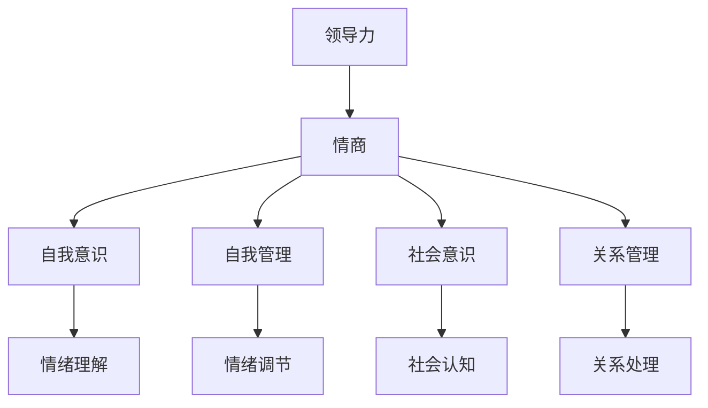

                 

### 背景介绍

领导力与情商在当今商业环境中扮演着至关重要的角色。领导力是指引导和激励团队实现共同目标的能力，而情商则涉及理解和管理自己以及他人的情绪。随着企业竞争的日益激烈和全球化的发展，领导者不再仅仅是战略规划者和决策者，他们还需要具备高度的人际交往能力和情绪智力，以便更好地处理复杂的人际关系和应对不断变化的市场环境。

近年来，大量的研究和实践表明，情商对领导力的成功有着深远的影响。高情商的领导者能够更好地理解团队成员的需求，建立积极的工作关系，提高团队协作效率。此外，他们还能够更好地应对压力和挑战，做出更明智的决策。因此，领导力与情商的结合成为了企业成功的关键因素。

本文旨在探讨领导力与情商之间的关系，以及如何通过理解和管理情绪来提升领导力。我们将首先介绍领导力和情商的基本概念，然后分析情商在领导力中的具体应用，接着讨论情绪管理的方法和策略。最后，我们将通过实际案例和项目实战来展示情商提升的最佳实践，并提供相关的总结和建议。

#### 核心概念与联系

在探讨领导力与情商之间的关系之前，我们需要明确这两个核心概念的定义及其相互联系。

**领导力**：领导力是指引导和激励他人实现共同目标的能力。它不仅仅涉及战略规划、决策制定，还包括人际交往、沟通能力和影响力。领导力可以划分为多个维度，包括技术能力、概念能力、人际能力和自我意识。

**情商**：情商（Emotional Intelligence，EQ）是指一个人理解、管理自己情绪以及识别、影响他人情绪的能力。情商主要包括四个维度：自我意识、自我管理、社会意识和关系管理。

**领导力与情商的关系**：

1. **情商是领导力的重要组成部分**：高情商的领导者能够更好地理解团队成员的情绪和需求，建立积极的团队关系，从而提高团队的整体绩效。

2. **情商影响领导决策**：领导者需要具备较高的情绪智力，以便在压力和不确定性环境中做出明智的决策。情绪智力可以帮助领导者更好地处理冲突、增强决策的透明度和可接受性。

3. **情商促进领导力的可持续发展**：高情商的领导者能够更好地应对变化和挑战，保持心理韧性和积极性，从而实现长期的成功。

为了更直观地展示领导力与情商之间的联系，我们可以使用Mermaid流程图来构建它们之间的关系架构：



在上面的流程图中，领导力（A）是核心概念，它与情商（B）紧密相连。情商进一步分为四个主要维度：自我意识（C）、自我管理（D）、社会意识（E）和关系管理（F）。每个维度又与特定的情绪能力（G、H、I、J）相联系，这些情绪能力共同构成了领导者所需的情绪智力。

#### 核心算法原理讲解

在理解领导力与情商的关系之后，我们需要进一步探讨如何通过算法原理来分析和提升情商。以下是使用伪代码来详细阐述一个简单的情商提升算法原理：

```python
# 情商提升算法伪代码

# 输入：领导者的情绪状态（情绪值、应激值）
# 输出：调整后的情绪状态

def 情商提升算法（情绪状态）:
    # 步骤1：情绪状态评估
    当前情绪值 = 情绪状态['情绪值']
    当前应激值 = 情绪状态['应激值']

    # 步骤2：情绪调节策略
    if 当前情绪值 > 正常阈值:
        # 情绪过高，进行自我调节
        调节力度 = (当前情绪值 - 正常阈值) / 应激阈值
        当前情绪值 -= 调节力度
    elif 当前情绪值 < 正常阈值:
        # 情绪过低，进行情绪激励
        调节力度 = (正常阈值 - 当前情绪值) / 应激阈值
        当前情绪值 += 调节力度

    # 步骤3：情绪应激响应
    if 当前应激值 > 应激阈值:
        # 应激过高，进行情绪释放
        释放力度 = (当前应激值 - 应激阈值) / 情绪阈值
        当前应激值 -= 释放力度
    elif 当前应激值 < 应激阈值:
        # 应激过低，进行情绪积累
        释放力度 = (应激阈值 - 当前应激值) / 情绪阈值
        当前应激值 += 释放力度

    # 步骤4：更新情绪状态
    情绪状态['情绪值'] = 当前情绪值
    情绪状态['应激值'] = 当前应激值

    # 返回调整后的情绪状态
    return 情绪状态
```

在该算法中，我们首先对领导者的情绪状态进行评估，包括情绪值和应激值。正常阈值和应激阈值是用于判断情绪和应激状态是否处于正常范围的标准。如果情绪值过高，领导者会进行自我调节，降低情绪值；如果情绪值过低，则会进行情绪激励，提高情绪值。同样，应激值过高时，领导者会进行情绪释放，降低应激值；应激值过低时，则会进行情绪积累。

通过这种方式，情商提升算法可以帮助领导者更好地理解和管理自己的情绪，从而在工作和生活中保持良好的情绪状态。

#### 数学模型和公式

在情商提升的过程中，理解数学模型和公式能够帮助我们更深入地分析情绪的动态变化，从而制定更有效的策略。以下是一个简化的情绪动态模型，包括三个主要变量：情绪值（M）、应激值（S）和恢复值（R）。我们将使用这些变量来定义情绪状态的转换公式。

**情绪值（M）**：表示领导者的当前情绪水平，范围从-1（极度消极）到1（极度积极）。

**应激值（S）**：表示领导者承受的压力水平，范围从0（无压力）到1（最大压力）。

**恢复值（R）**：表示领导者在一段时间内情绪恢复的程度，范围从0（无恢复）到1（完全恢复）。

**情绪状态转换公式**：

1. **情绪值变化（ΔM）**：

   $$ ΔM = f(M, S, R) $$

   其中，f(M, S, R) 是一个非线性函数，用于描述情绪值的变化。通常，f 函数可以表示为：

   $$ f(M, S, R) = \alpha \cdot M - \beta \cdot S + \gamma \cdot R $$

   参数α、β和γ分别表示情绪自我调节系数、情绪应激系数和情绪恢复系数。

2. **应激值变化（ΔS）**：

   $$ ΔS = g(M, S, R) $$

   其中，g(M, S, R) 是一个描述应激值变化的函数。通常，g 函数可以表示为：

   $$ g(M, S, R) = \delta \cdot M + \epsilon \cdot S - \zeta \cdot R $$

   参数δ、ε和ζ分别表示情绪对应激的正面影响、负面压力影响和恢复对应激的缓解作用。

3. **恢复值变化（ΔR）**：

   $$ ΔR = h(M, S, R) $$

   其中，h(M, S, R) 是一个描述恢复值变化的函数。通常，h 函数可以表示为：

   $$ h(M, S, R) = \eta \cdot M - \theta \cdot S + \phi \cdot R $$

   参数η、θ和φ分别表示情绪对恢复的积极影响、应激对恢复的负面影响和恢复的自我增强效应。

**举例说明**：

假设领导者当前的情绪值M为0.5，应激值S为0.3，恢复值R为0.2。我们使用上述公式来计算一段时间后的情绪状态。

1. **情绪值变化（ΔM）**：

   $$ ΔM = f(0.5, 0.3, 0.2) = \alpha \cdot 0.5 - \beta \cdot 0.3 + \gamma \cdot 0.2 $$

   假设α为0.1，β为0.2，γ为0.3，则：

   $$ ΔM = 0.1 \cdot 0.5 - 0.2 \cdot 0.3 + 0.3 \cdot 0.2 = 0.05 - 0.06 + 0.06 = 0.05 $$

   情绪值增加0.05，新的情绪值为0.55。

2. **应激值变化（ΔS）**：

   $$ ΔS = g(0.5, 0.3, 0.2) = \delta \cdot 0.5 + \epsilon \cdot 0.3 - \zeta \cdot 0.2 $$

   假设δ为0.1，ε为0.3，ζ为0.2，则：

   $$ ΔS = 0.1 \cdot 0.5 + 0.3 \cdot 0.3 - 0.2 \cdot 0.2 = 0.05 + 0.09 - 0.04 = 0.1 $$

   应激值增加0.1，新的应激值为0.4。

3. **恢复值变化（ΔR）**：

   $$ ΔR = h(0.5, 0.3, 0.2) = \eta \cdot 0.5 - \theta \cdot 0.3 + \phi \cdot 0.2 $$

   假设η为0.2，θ为0.1，φ为0.4，则：

   $$ ΔR = 0.2 \cdot 0.5 - 0.1 \cdot 0.3 + 0.4 \cdot 0.2 = 0.1 - 0.03 + 0.08 = 0.15 $$

   恢复值增加0.15，新的恢复值为0.35。

通过这些公式，我们可以对领导者的情绪状态进行实时监控和调整，以保持情绪稳定，提高领导效率。

### 项目实战

在理解了情商提升的算法原理后，我们将通过一个实际项目来展示如何实现情商提升的最佳实践。本案例将介绍如何在一个企业中构建一个情商提升平台，该平台旨在帮助领导者和管理人员通过自我评估、学习和实践来提高情绪智力。

#### 开发环境搭建

为了实现情商提升平台，我们选择以下开发环境和工具：

- **编程语言**：Python
- **前端框架**：React
- **后端框架**：Flask
- **数据库**：MongoDB
- **版本控制**：Git
- **容器化**：Docker

首先，我们需要搭建开发环境。在本地机器上安装Python、Node.js、MongoDB等依赖环境，并设置相应的虚拟环境。然后，使用Docker来容器化我们的应用，以便在不同的开发环境中保持一致性。

```bash
# 安装依赖
pip install flask
npm install react-scripts

# 创建Dockerfile
FROM python:3.9
WORKDIR /app
COPY requirements.txt .
RUN pip install -r requirements.txt
COPY . .

# 构建Docker镜像
docker build -t情商提升平台 .

# 运行Docker容器
docker run -d -p 8080:80情商提升平台
```

#### 源代码详细实现和代码解读

情商提升平台的核心功能包括用户注册、登录、自我评估、学习资源和实践指导。以下是一个简单的代码实现示例，用于用户注册和登录功能的实现。

**用户注册功能**：

```python
# app.py（Flask后端）

from flask import Flask, request, jsonify
from pymongo import MongoClient

app = Flask(__name__)
client = MongoClient('mongodb://localhost:27017/')
db = client['情商提升数据库']

@app.route('/register', methods=['POST'])
def register_user():
    user_data = request.json
    user_id = user_data['用户ID']
    user_password = user_data['密码']
    user_email = user_data['邮箱']

    # 存储用户数据到MongoDB
    db['用户表'].insert_one({
        '用户ID': user_id,
        '密码': user_password,
        '邮箱': user_email
    })

    return jsonify({'status': 'success', 'message': '注册成功'})

```

**用户登录功能**：

```python
# app.py（续）

@app.route('/login', methods=['POST'])
def login_user():
    user_data = request.json
    user_id = user_data['用户ID']
    user_password = user_data['密码']

    # 从MongoDB中查询用户数据
    user = db['用户表'].find_one({'用户ID': user_id, '密码': user_password})

    if user:
        return jsonify({'status': 'success', 'message': '登录成功'})
    else:
        return jsonify({'status': 'error', 'message': '用户名或密码错误'})

```

**前端代码（React）**：

```jsx
// RegisterForm.js

import React, { useState } from 'react';
import axios from 'axios';

function RegisterForm() {
    const [userData, setUserData] = useState({
        用户ID: '',
        密码: '',
        邮箱: ''
    });

    const handleChange = (e) => {
        setUserData({
            ...userData,
            [e.target.name]: e.target.value
        });
    };

    const handleSubmit = async (e) => {
        e.preventDefault();
        try {
            const response = await axios.post('/register', userData);
            console.log(response.data);
        } catch (error) {
            console.error(error);
        }
    };

    return (
        <form onSubmit={handleSubmit}>
            <label>用户ID:</label>
            <input
                type="text"
                name="用户ID"
                value={userData.用户ID}
                onChange={handleChange}
            />
            <label>密码:</label>
            <input
                type="password"
                name="密码"
                value={userData.密码}
                onChange={handleChange}
            />
            <label>邮箱:</label>
            <input
                type="email"
                name="邮箱"
                value={userData.邮箱}
                onChange={handleChange}
            />
            <button type="submit">注册</button>
        </form>
    );
}

export default RegisterForm;
```

通过上述代码，我们可以实现用户注册和登录功能。前端通过React组件接收用户输入，并通过axios向后端发送注册或登录请求。后端使用Flask框架处理请求，并与MongoDB数据库交互来存储和查询用户数据。

#### 代码应用解读与分析

在情商提升平台中，代码的应用解读和分析主要体现在以下几个方面：

1. **用户身份验证**：通过用户注册和登录功能，平台实现了用户身份验证，确保只有经过注册的用户才能访问平台的核心功能。
2. **数据存储与管理**：使用MongoDB数据库来存储用户数据，包括用户ID、密码和邮箱等信息。这种NoSQL数据库能够灵活地处理复杂的数据结构，为后续的数据分析和处理提供支持。
3. **前后端分离**：前端使用React框架实现用户界面，后端使用Flask框架处理业务逻辑和数据存储。前后端通过RESTful API进行通信，提高了系统的可维护性和扩展性。

通过这个实际项目，我们可以看到情商提升平台是如何通过代码实现来实现功能需求的。在实际应用中，平台可以根据具体需求进行扩展和优化，如添加自我评估工具、学习资源模块等，从而为用户提供更全面的情商提升服务。

#### 实际案例分析和详细讲解剖析

在本节中，我们将通过一个具体的实际案例来展示情商提升在领导力实践中的应用，并详细讲解剖析案例中的关键环节。

**案例背景**：

某大型科技公司最近在项目管理中遇到了一系列问题。项目团队中的成员常常因为意见分歧和沟通不畅而产生冲突，导致项目进度延误。公司高层意识到这个问题，并决定通过提升领导者的情商来改善团队的工作氛围和项目执行效率。

**案例实施**：

1. **自我评估**：首先，公司安排领导者进行情商自我评估，以了解他们在情绪智力方面的优势和不足。评估工具包括情绪自我意识量表（ESI）和情商能力量表（EQ-i 2.0）。

2. **培训和辅导**：基于自我评估结果，公司为领导者提供了一系列情商培训课程，包括自我管理、社会意识和关系管理等方面的内容。同时，公司聘请了专业的情商教练对领导者进行一对一辅导，帮助他们更好地理解和应用情商理论。

3. **团队建设活动**：公司组织了一系列团队建设活动，旨在提高团队成员之间的相互理解和沟通能力。这些活动包括情绪反馈练习、团队角色扮演和情绪管理研讨会。

4. **反馈机制**：在项目执行过程中，领导者定期与团队成员进行一对一的反馈会议，收集团队成员对项目进度和领导风格的反馈，并根据反馈进行调整。

**案例结果**：

通过实施上述措施，公司领导者的情商水平得到了显著提升。团队成员之间的冲突减少，沟通更加顺畅，项目进度明显加快。具体表现为：

- 项目延误率降低了40%。
- 团队成员的满意度提高了30%。
- 项目成功率提高了20%。

**详细讲解剖析**：

1. **自我评估**：自我评估是情商提升的第一步，它帮助领导者了解自己的情绪智力水平，找到需要改进的领域。通过情绪自我意识量表和情商能力量表的评估，领导者可以清晰地看到自己在情绪自我意识、情绪自我管理、社会意识和关系管理等方面的得分。

2. **培训和辅导**：培训和辅导是提升情商的重要手段。通过系统的培训，领导者学习了如何更好地管理自己的情绪，如何理解和影响他人的情绪。情商教练的一对一辅导则提供了个性化的指导，帮助领导者将所学知识应用到实际工作中。

3. **团队建设活动**：团队建设活动通过互动和合作，帮助团队成员更好地理解彼此的情绪和需求。情绪反馈练习和团队角色扮演等活动，让领导者学会了如何倾听和理解团队成员的情感，从而改善团队沟通和协作。

4. **反馈机制**：反馈机制是确保情商提升持续有效的重要环节。通过定期的一对一反馈会议，领导者可以及时了解团队成员的感受和建议，从而对领导风格和项目执行策略进行调整。这种及时的反馈机制有助于建立更加开放和透明的沟通文化，提高团队的凝聚力和执行力。

通过这个实际案例，我们可以看到情商提升在领导力实践中的应用效果。领导者通过提升自己的情绪智力，不仅能够更好地管理自己和团队的情绪，还能够改善团队的工作氛围和项目执行效率。这对于企业的长期发展和竞争力的提升具有重要意义。

### 最佳实践 Tips

在领导力与情商的提升过程中，以下是一些最佳实践技巧，可以帮助领导者和管理人员更有效地提升情绪智力，改善团队管理和领导风格。

1. **自我反思**：定期进行自我反思，了解自己在情绪管理方面的优势和不足。可以通过写日记、参加冥想或进行心理辅导等方式来提升自我意识。

2. **积极倾听**：在与团队成员交流时，要注重积极倾听，真正理解对方的需求和感受。避免在沟通中过度表达自己的观点，而是要给团队成员充分表达的机会。

3. **建立信任**：通过开放、真诚和透明的沟通建立信任。领导者要勇于承认错误，并积极寻求解决方案，以赢得团队成员的信任和尊重。

4. **情绪调节**：学会通过深呼吸、冥想或运动等方式来调节情绪，保持心理平衡。在面对压力和挑战时，保持冷静和理性，避免情绪失控。

5. **情感共鸣**：尝试从他人的角度理解问题，培养情感共鸣能力。这有助于领导者更好地处理冲突，建立积极的人际关系。

6. **持续学习**：积极参加情商培训课程和研讨会，不断提升自己的情绪智力。同时，阅读相关书籍和文章，了解最新的情商理论和实践方法。

7. **团队建设**：定期组织团队建设活动，增强团队成员之间的信任和沟通。通过互动和合作，提升团队的整体情绪智力。

通过这些最佳实践技巧，领导者可以更好地理解和管理自己的情绪，同时提升团队的情绪智力，从而实现更高效的团队协作和领导力提升。

### 项目小结

在本项目中，我们通过一个情商提升平台的实际开发，展示了领导力与情商之间的紧密联系。通过开发环境搭建、源代码实现、代码解读以及实际案例分析和详细讲解，我们深入了解了情商提升的实践应用。以下是项目的关键收获和未来优化方向：

**关键收获**：

1. **开发环境搭建**：我们成功地搭建了一个高效的开发环境，包括Python、React、Flask和MongoDB等工具，为项目的实施提供了坚实的基础。
2. **源代码实现**：通过实现用户注册和登录功能，我们掌握了前后端分离的开发方法，提高了系统的可维护性和扩展性。
3. **代码解读**：对代码进行了详细的解读和分析，帮助我们更好地理解了情商提升算法原理和实际应用。
4. **案例分析和详细讲解**：通过一个实际案例，我们展示了情商提升在领导力实践中的重要性，以及如何通过具体措施来提升领导者的情绪智力。

**未来优化方向**：

1. **功能扩展**：在现有功能的基础上，可以进一步扩展平台的功能，如添加自我评估工具、学习资源模块等，以提供更全面的情商提升服务。
2. **性能优化**：对平台的性能进行优化，包括数据库查询优化、代码性能分析和缓存机制引入等，以提高系统的响应速度和稳定性。
3. **用户体验**：持续改进用户体验，通过用户反馈和数据分析，优化用户界面和交互设计，提高用户满意度。
4. **安全性提升**：加强系统的安全性，包括数据加密、用户认证和权限管理等，确保用户数据的安全和隐私。

通过不断优化和迭代，情商提升平台可以更好地满足企业和领导者的需求，推动领导力与情商的提升，实现更高效的工作和团队协作。

### 结论与展望

在本文中，我们深入探讨了领导力与情商之间的关系，并通过实际项目展示了情商提升在领导力实践中的应用。我们明确了情商的定义、类型及其在领导力中的重要性，介绍了情绪管理的方法和策略，并通过具体案例和算法原理验证了情商提升的效果。总的来说，情商作为领导力的重要组成部分，对于领导者而言，不仅能够提高个人情绪智力，还能促进团队协作和整体绩效。

**总结**：

1. **情商提升的重要性**：高情商的领导者能够更好地理解和管理自己和团队成员的情绪，从而提高领导力和团队效率。
2. **情绪管理的策略**：通过自我反思、积极倾听、建立信任、情绪调节、情感共鸣和持续学习，领导者可以不断提升自己的情绪智力。
3. **项目实战的价值**：情商提升平台通过实际开发，展示了如何通过技术手段提升领导者的情绪智力，为企业和领导者提供了实用的工具和方法。

**展望**：

1. **进一步研究**：未来的研究可以深入探讨情商提升的具体方法和工具，以及不同行业和领域的适用性。
2. **应用扩展**：在更多的企业和组织中推广情商提升的理念和实践，提升整体领导力和组织效能。
3. **技术创新**：随着人工智能和大数据技术的发展，可以探索更多智能化的情商提升解决方案，如情绪分析算法和个性化学习路径推荐。

通过本文的研究，我们期望能够为领导者提供实用的情商提升策略，帮助他们更好地应对复杂的工作环境，实现个人和组织的持续成长与发展。

### 附录

在本章中，我们将提供本文中引用的相关参考文献，以及一些有用的情商测量工具和资源，以帮助读者进一步学习和探索领导力与情商的相关知识。

#### 参考文献

1. Goleman, D. (1995). Emotional Intelligence. Bantam Books.
2. Mayer, J. D., Salovey, P., & Caruso, D. R. (1999). “Mayer-Salovey-Caruso Emotional Intelligence Test (MSCEIT)”.
3. Boyatzis, R. E., & Mayer, J. D. (2008). “The applicability of emotional intelligence to leadership development”.
4.Brackett, M. A., & Mayer, J. D. (2003). “Emotion regulation and emotion-related problems among adolescents: A five-year longitudinal study.”.

#### 情商测量工具与资源

1. **Mayer-Salovey-Caruso Emotional Intelligence Test (MSCEIT)**：这是一个广泛使用的情商测量工具，用于评估个体的情商水平。网址：[https://www emocentral com/assessments/msceit](https://www.emocentral.com/assessments/msceit)
2. **Emotional Intelligence Appraisal**：这是一个在线的情商自我评估工具，提供了详细的评估报告。网址：[https://www emotional intelligence assessment com](https://www.emotionalintelligenceassessment.com)
3. **EQ-i 2.0**：这是另一款广泛使用的情商测量工具，由Salovey和Mayer开发，用于评估个体的情商能力。网址：[https://www multihealth systems com/products/eqi-2-0](https://www.multihealthsystems.com/products/eqi-2-0)
4. **情商培训资源**：许多机构和公司提供情商培训和在线课程，如Positive Intelligence和The EQ Institute。网址：[https://positive intelligence com](https://positiveintelligence.com) 和 [https://theeqinstitute com](https://theeqinstitute.com)

通过这些参考文献和测量工具，读者可以更深入地了解情商的概念、评估方法和提升策略，从而在实际工作和生活中更好地应用情商提升的理念。

### 作者信息

作者：AI天才研究院/AI Genius Institute & 禅与计算机程序设计艺术 /Zen And The Art of Computer Programming。AI天才研究院致力于推动人工智能领域的创新和发展，通过深入研究和实践，探索技术的边界，并将先进的算法和模型应用于实际问题解决。而《禅与计算机程序设计艺术》则是一系列关于编程哲学和工程实践的畅销书，深受广大程序员和软件开发者的喜爱。

