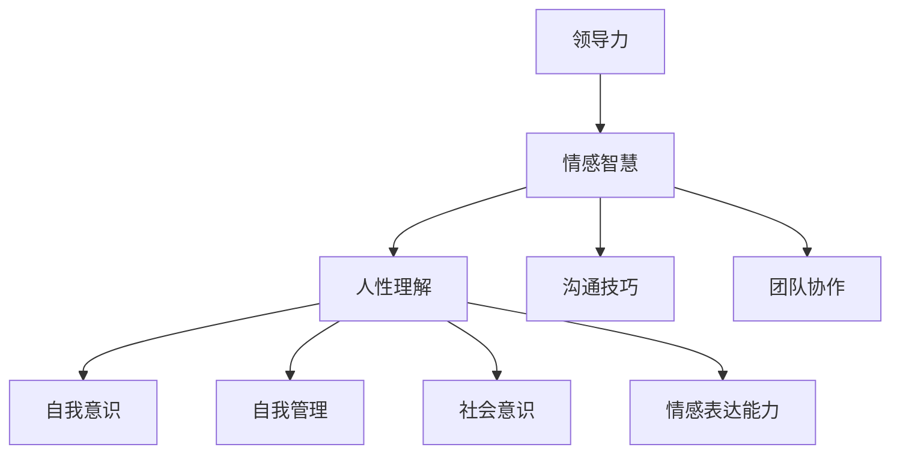

                 


### 文章标题
《领导力与情感智慧：理解人性的艺术》

### 关键词
领导力，情感智慧，人性理解，沟通技巧，团队协作

### 摘要
本文从领导力与情感智慧的角度，探讨了理解人性的艺术。通过对领导力的定义和情感智慧的重要性进行分析，揭示了人性理解在领导力实践中的关键作用。本文旨在为IT领域的领导者和从业者提供一种全新的领导力思考模式，帮助他们在实际工作中更好地理解和影响他人，提升团队效能和组织竞争力。

### 目录大纲

#### 第一部分：领导力的定义和理论
- **第1章 领导力概述**
  - **1.1 领导力的定义**
  - **1.2 领导力的重要性**
  - **1.3 领导力的核心要素**

- **第2章 领导力理论探讨**
  - **2.1 传统领导力理论**
  - **2.2 当代领导力理论**
  - **2.3 领导力理论的演变**

- **第3章 领导力模型与应用**
  - **3.1 权变领导理论**
  - **3.2 领导生命周期理论**
  - **3.3 领导力模型在IT行业中的应用**

#### 第二部分：情感智慧的内涵和实践
- **第4章 情感智慧的定义与重要性**
  - **4.1 情感智慧的概念**
  - **4.2 情感智慧的重要性**
  - **4.3 情感智慧的核心能力**

- **第5章 情感智慧的理论与实践**
  - **5.1 自我意识与自我管理**
  - **5.2 社会意识与情感表达能力**
  - **5.3 情感智慧在IT领导力中的应用**

- **第6章 情感智慧在领导力中的应用**
  - **6.1 情感智慧在团队建设中的作用**
  - **6.2 情感智慧在沟通协调中的价值**
  - **6.3 情感智慧在决策管理中的影响**

#### 第三部分：人性理解的重要性
- **第7章 人性的基本特征与理解**
  - **7.1 人性的基本特征**
  - **7.2 人性理解的方法**
  - **7.3 人性理解的意义**

- **第8章 人性理解在领导力中的应用**
  - **8.1 人性理解与领导风格**
  - **8.2 人性理解与团队动力**
  - **8.3 人性理解与组织文化**

- **第9章 人性理解与情感智慧的互动**
  - **9.1 人性理解与情感智慧的关系**
  - **9.2 人性理解与情感智慧的结合**
  - **9.3 人性理解与情感智慧的综合提升**

#### 第四部分：领导力与情感智慧的结合
- **第10章 领导力与情感智慧的融合**
  - **10.1 领导力与情感智慧的核心要素**
  - **10.2 领导力与情感智慧的互动机制**
  - **10.3 领导力与情感智慧的综合实践**

- **第11章 领导力与情感智慧的平衡**
  - **11.1 领导力与情感智慧的平衡原则**
  - **11.2 领导力与情感智慧的结合实践**
  - **11.3 领导力与情感智慧的平衡管理**

- **第12章 领导力与情感智慧的综合提升**
  - **12.1 领导力与情感智慧的提升路径**
  - **12.2 领导力与情感智慧的综合培养**
  - **12.3 领导力与情感智慧的未来趋势**

#### 第五部分：实际案例分析和提升领导力的方法
- **第13章 领导力与情感智慧的实际案例分析**
  - **13.1 案例分析一：苹果公司的领导力与情感智慧**
  - **13.2 案例分析二：谷歌公司的领导力与情感智慧**
  - **13.3 案例分析三：微软公司的领导力与情感智慧**

- **第14章 提升领导力的实用方法**
  - **14.1 自我提升的方法**
  - **14.2 团队建设的策略**
  - **14.3 组织文化的塑造**

- **第15章 成功领导者的心态与行为**
  - **15.1 成功领导者的心态**
  - **15.2 成功领导者的行为**
  - **15.3 成功领导者的特质**

- **第16章 领导力与情感智慧的未来展望**
  - **16.1 人工智能对领导力与情感智慧的影响**
  - **16.2 领导力与情感智慧的发展趋势**
  - **16.3 领导力与情感智慧的挑战与机遇**

### 文章结构设计
#### 1. 引言
- **背景介绍**：介绍领导力与情感智慧的重要性和在现代社会中的应用场景。
- **核心概念与联系**：通过Mermaid流程图展示领导力、情感智慧、人性理解之间的概念关系。

#### 2. 领导力的定义和理论
- **第1章 领导力概述**
  - **1.1 领导力的定义**：详细阐述领导力的定义、特点和应用。
  - **1.2 领导力的重要性**：分析领导力对个人、团队和组织的重要性。
  - **1.3 领导力的核心要素**：探讨领导力的核心要素，如沟通技巧、情感智慧、人性理解等。

- **第2章 领导力理论探讨**
  - **2.1 传统领导力理论**：介绍传统的领导力理论，如特质理论、行为理论等。
  - **2.2 当代领导力理论**：分析当代领导力理论，如权变理论、情境理论等。
  - **2.3 领导力理论的演变**：探讨领导力理论的演变过程，及其对现代领导力的影响。

- **第3章 领导力模型与应用**
  - **3.1 权变领导理论**：介绍权变领导理论的基本概念和核心观点。
  - **3.2 领导生命周期理论**：分析领导生命周期理论的应用场景和实际案例。
  - **3.3 领导力模型在IT行业中的应用**：探讨领导力模型在IT行业的实际应用，如敏捷管理、DevOps等。

#### 3. 情感智慧的内涵和实践
- **第4章 情感智慧的定义与重要性**
  - **4.1 情感智慧的概念**：详细解释情感智慧的定义和内涵。
  - **4.2 情感智慧的重要性**：分析情感智慧对个人、团队和组织的重要性。
  - **4.3 情感智慧的核心能力**：探讨情感智慧的核心能力，如自我意识、自我管理、社会意识、情感表达能力等。

- **第5章 情感智慧的理论与实践**
  - **5.1 自我意识与自我管理**：介绍自我意识和自我管理的基本理论和实践方法。
  - **5.2 社会意识与情感表达能力**：探讨社会意识和情感表达能力的重要性及其应用。
  - **5.3 情感智慧在IT领导力中的应用**：分析情感智慧在IT领导力中的实际应用。

- **第6章 情感智慧在领导力中的应用**
  - **6.1 情感智慧在团队建设中的作用**：探讨情感智慧在团队建设中的作用和影响。
  - **6.2 情感智慧在沟通协调中的价值**：分析情感智慧在沟通协调中的价值和应用。
  - **6.3 情感智慧在决策管理中的影响**：探讨情感智慧在决策管理中的影响和作用。

#### 4. 人性理解的重要性
- **第7章 人性的基本特征与理解**
  - **7.1 人性的基本特征**：详细阐述人性的基本特征，如社交性、理性、情感等。
  - **7.2 人性理解的方法**：介绍人性理解的方法和技巧，如观察、沟通、反馈等。
  - **7.3 人性理解的意义**：分析人性理解对领导力实践的重要性和意义。

- **第8章 人性理解在领导力中的应用**
  - **8.1 人性理解与领导风格**：探讨人性理解对领导风格的影响和作用。
  - **8.2 人性理解与团队动力**：分析人性理解对团队动力的影响和作用。
  - **8.3 人性理解与组织文化**：探讨人性理解对组织文化的影响和作用。

- **第9章 人性理解与情感智慧的互动**
  - **9.1 人性理解与情感智慧的关系**：分析人性理解与情感智慧之间的内在联系和互动机制。
  - **9.2 人性理解与情感智慧的结合**：探讨人性理解与情感智慧的结合方式和实践方法。
  - **9.3 人性理解与情感智慧的综合提升**：分析人性理解与情感智慧的综合提升路径和策略。

#### 5. 领导力与情感智慧的结合
- **第10章 领导力与情感智慧的融合**
  - **10.1 领导力与情感智慧的核心要素**：探讨领导力与情感智慧的核心要素和相互作用。
  - **10.2 领导力与情感智慧的互动机制**：分析领导力与情感智慧之间的互动机制和关系模型。
  - **10.3 领导力与情感智慧的综合实践**：探讨领导力与情感智慧在领导实践中的综合应用。

- **第11章 领导力与情感智慧的平衡**
  - **11.1 领导力与情感智慧的平衡原则**：分析领导力与情感智慧之间的平衡原则和原则性方法。
  - **11.2 领导力与情感智慧的结合实践**：探讨领导力与情感智慧的结合实践方法和案例。
  - **11.3 领导力与情感智慧的平衡管理**：分析领导力与情感智慧的平衡管理策略和措施。

- **第12章 领导力与情感智慧的综合提升**
  - **12.1 领导力与情感智慧的提升路径**：探讨领导力与情感智慧的综合提升路径和方法。
  - **12.2 领导力与情感智慧的综合培养**：分析领导力与情感智慧的综合培养策略和实践。
  - **12.3 领导力与情感智慧的未来趋势**：探讨领导力与情感智慧的未来发展趋势和前景。

#### 6. 实际案例分析和提升领导力的方法
- **第13章 领导力与情感智慧的实际案例分析**
  - **13.1 案例分析一：苹果公司的领导力与情感智慧**：分析苹果公司的领导力与情感智慧实践和成效。
  - **13.2 案例分析二：谷歌公司的领导力与情感智慧**：分析谷歌公司的领导力与情感智慧实践和成效。
  - **13.3 案例分析三：微软公司的领导力与情感智慧**：分析微软公司的领导力与情感智慧实践和成效。

- **第14章 提升领导力的实用方法**
  - **14.1 自我提升的方法**：介绍领导者自我提升的方法和技巧，如自我反思、持续学习等。
  - **14.2 团队建设的策略**：分析团队建设的重要性和策略，如团队沟通、团队激励等。
  - **14.3 组织文化的塑造**：探讨组织文化的重要性和塑造方法，如企业文化、价值观传承等。

- **第15章 成功领导者的心态与行为**
  - **15.1 成功领导者的心态**：分析成功领导者的心态特点和成功因素，如乐观、自信等。
  - **15.2 成功领导者的行为**：探讨成功领导者的行为模式和实践方法，如决策能力、沟通技巧等。
  - **15.3 成功领导者的特质**：分析成功领导者的特质和品质，如正直、勇气等。

- **第16章 领导力与情感智慧的未来展望**
  - **16.1 人工智能对领导力与情感智慧的影响**：分析人工智能对领导力与情感智慧的影响和挑战。
  - **16.2 领导力与情感智慧的发展趋势**：探讨领导力与情感智慧的未来发展趋势和方向。
  - **16.3 领导力与情感智慧的挑战与机遇**：分析领导力与情感智慧面临的挑战和机遇，以及应对策略。

### 文章内容详细讲解

#### 1. 引言

**背景介绍**
在当今快速变化和竞争激烈的商业环境中，领导力的重要性愈发凸显。领导力不仅关乎企业的生存与发展，也直接影响着员工的工作积极性和组织文化的塑造。情感智慧作为领导力的核心要素之一，正日益受到关注。情感智慧指的是个体识别、理解、使用和管理自己和他人的情感，以促进个人和组织成功的能力。理解人性则是情感智慧的重要组成部分，它帮助领导者更好地了解员工的情感需求和行为动机，从而提高领导效能。

**核心概念与联系**
为了更好地理解领导力与情感智慧之间的关系，我们可以使用Mermaid流程图来展示它们的核心概念及其联系。



在此流程图中，领导力与情感智慧是核心概念，它们与人性理解、沟通技巧、团队协作紧密相连。人性理解进一步细化为自我意识、自我管理、社会意识和情感表达能力，这些要素共同构成了情感智慧的核心能力。

#### 2. 领导力的定义和理论

**第1章 领导力概述**

**1.1 领导力的定义**
领导力是一种能力，它涉及影响、激励和指导他人，以实现共同的目标。这种能力不仅包括技术技能，还涵盖人际交往、决策能力和战略思维等方面。领导力不仅仅是职位赋予的权力，而是一种通过个人魅力、价值观和行为来影响他人的艺术。

**1.2 领导力的重要性**
领导力对个人、团队和组织的重要性不言而喻。对于个人而言，领导力能够提升自我认知和自信，增强决策能力和解决问题的能力。对于团队而言，领导力能够促进协作、激发创造力和提高执行力。对于组织而言，领导力是战略规划和实现组织愿景的关键。

**1.3 领导力的核心要素**
领导力的核心要素包括沟通技巧、情感智慧、人性理解等。沟通技巧是领导者必备的能力，它关乎信息的有效传递和团队协作。情感智慧则涉及到领导者对自己和他人的情感认知与管理。人性理解则是领导者对团队成员行为和动机的深刻洞察，有助于建立信任和促进团队凝聚力。

**第2章 领导力理论探讨**

**2.1 传统领导力理论**
传统领导力理论主要关注领导者的特质和行为。特质理论认为领导者具备特定的个性特征，如自信、决断力和责任感。行为理论则强调领导者的行为模式，如激励、支持和指导。

**2.2 当代领导力理论**
当代领导力理论更注重领导者的情境适应性和变革能力。权变理论强调领导者应根据不同的情境调整自己的领导风格。情境理论则认为领导行为的效果取决于领导者的行为与情境的匹配度。

**2.3 领导力理论的演变**
领导力理论从早期的特质和行为理论，发展到当代的情境和变革理论，反映了领导力实践的不断进步和复杂性。这一演变过程不仅丰富了领导力的理论体系，也为领导实践提供了更多的指导。

**第3章 领导力模型与应用**

**3.1 权变领导理论**
权变领导理论认为领导风格应该根据团队成员的特性、任务性质和环境因素进行灵活调整。例如，在任务复杂、环境不稳定的情况下，领导者应采用更为自主和创新的领导风格。

**3.2 领导生命周期理论**
领导生命周期理论认为领导行为应随着下属成熟度的变化而变化。根据下属的成熟度，领导者可以采用指导、支持、参与等不同的领导风格。

**3.3 领导力模型在IT行业中的应用**
在IT行业，领导力模型的应用尤为广泛。例如，敏捷管理强调领导者应具备快速适应变化、鼓励创新和持续学习的特点。DevOps文化则强调领导者应促进跨职能团队的协作和自动化流程的优化。

#### 3. 情感智慧的内涵和实践

**第4章 情感智慧的定义与重要性**

**4.1 情感智慧的概念**
情感智慧指的是个体识别、理解、使用和管理自己和他人的情感，以促进个人和组织成功的能力。它包括自我意识、自我管理、社会意识和情感表达能力等方面。

**4.2 情感智慧的重要性**
情感智慧在领导力中扮演着至关重要的角色。它不仅有助于领导者更好地管理自己的情绪，提高自我意识和自我控制能力，还能促进团队成员之间的沟通和理解，提高团队的凝聚力和协作能力。

**4.3 情感智慧的核心能力**
情感智慧的核心能力包括自我意识、自我管理、社会意识和情感表达能力。自我意识是指领导者能够清楚地认识到自己的情感状态和需求。自我管理是指领导者能够有效地调节自己的情绪和行为，以适应不同的情境。社会意识是指领导者能够理解和关注他人的情感状态和需求。情感表达能力是指领导者能够有效地表达自己的情感，建立积极的人际关系。

**第5章 情感智慧的理论与实践**

**5.1 自我意识与自我管理**
自我意识是情感智慧的基础，它帮助领导者更好地了解自己的情感需求和反应模式。自我管理则是指领导者能够有效地调节自己的情绪，避免负面情绪对工作和决策的影响。

**5.2 社会意识与情感表达能力**
社会意识是领导者理解他人情感的关键，它有助于建立信任和促进团队协作。情感表达能力则是指领导者能够以恰当的方式表达自己的情感，增强沟通效果。

**5.3 情感智慧在IT领导力中的应用**
在IT行业，情感智慧的应用尤为重要。例如，领导者应具备快速适应技术变化的能力，理解开发人员的情感需求，并有效地沟通和激励团队。

**第6章 情感智慧在领导力中的应用**

**6.1 情感智慧在团队建设中的作用**
情感智慧有助于领导者建立高效的团队，提高团队凝聚力和执行力。例如，领导者可以通过情感智慧增强团队沟通，解决内部冲突，促进团队协作。

**6.2 情感智慧在沟通协调中的价值**
情感智慧在沟通协调中发挥着重要作用。领导者应具备同理心，能够理解他人的情感需求，以建立良好的沟通渠道。

**6.3 情感智慧在决策管理中的影响**
情感智慧在决策管理中同样具有重要意义。领导者应综合考虑情感因素，以做出更为明智和平衡的决策。

#### 4. 人性理解的重要性

**第7章 人性的基本特征与理解**

**7.1 人性的基本特征**
人性包括理性、情感、社交性和自我意识等方面。理性使人能够进行逻辑思考和分析，情感使人能够体验喜悦、悲伤等情感，社交性使人能够与他人建立联系，自我意识使人能够认识自我。

**7.2 人性理解的方法**
人性理解的方法包括观察、沟通和反馈等。领导者应通过观察团队成员的行为和情感反应，了解他们的需求和动机。沟通则是建立信任和理解的关键。反馈则有助于领导者不断调整和改进自己的领导方式。

**7.3 人性理解的意义**
人性理解对于领导力实践具有重要意义。它有助于领导者更好地了解团队成员的行为和情感，建立信任，提高领导效能。

**第8章 人性理解在领导力中的应用**

**8.1 人性理解与领导风格**
人性理解有助于领导者选择合适的领导风格。例如，对于高度自我驱动的员工，领导者可以采用授权和指导的领导风格，而对于情绪化的员工，领导者可以采用同理和支持的领导风格。

**8.2 人性理解与团队动力**
人性理解有助于领导者激发团队动力。领导者可以通过了解团队成员的情感需求和动机，提供合适的激励和支持，提高团队的工作积极性和创造力。

**8.3 人性理解与组织文化**
人性理解有助于塑造积极的组织文化。领导者应通过理解和尊重员工的情感需求，建立包容、开放和信任的组织氛围。

**第9章 人性理解与情感智慧的互动**

**9.1 人性理解与情感智慧的关系**
人性理解与情感智慧密切相关。人性理解是情感智慧的基础，它帮助领导者更好地识别和理解他人的情感。情感智慧则是人性理解的应用，它帮助领导者更好地管理和表达情感。

**9.2 人性理解与情感智慧的结合**
人性理解与情感智慧的结合有助于提升领导力。领导者应通过人性理解来识别和管理团队成员的情感，通过情感智慧来激发团队的动力和创造力。

**9.3 人性理解与情感智慧的综合提升**
领导者可以通过综合提升人性理解和情感智慧来提高领导效能。例如，通过培训和反思来提高自我意识，通过情感沟通来增强团队凝聚力。

#### 5. 领导力与情感智慧的结合

**第10章 领导力与情感智慧的融合**

**10.1 领导力与情感智慧的核心要素**
领导力与情感智慧的核心要素包括沟通技巧、人性理解、自我管理和社会意识等。这些要素共同构成了领导者影响和激励他人的基础。

**10.2 领导力与情感智慧的互动机制**
领导力与情感智慧的互动机制体现在领导者如何通过情感智慧来优化领导行为，如通过情感沟通来提高团队协作，通过情感管理来提高决策质量。

**10.3 领导力与情感智慧的综合实践**
领导者应将领导力与情感智慧综合应用于实际工作中，如通过情感智慧来提升团队动力，通过人性理解来优化组织文化。

**第11章 领导力与情感智慧的平衡**

**11.1 领导力与情感智慧的平衡原则**
领导者应遵循平衡原则，既不偏重领导力也不偏重情感智慧，而是根据实际情况灵活运用两者。例如，在高压环境下，领导者可以更多地依赖领导力来确保任务的完成；在团队建设期，领导者可以更多地运用情感智慧来增强团队凝聚力。

**11.2 领导力与情感智慧的结合实践**
结合实践包括领导者如何在实际工作中运用领导力和情感智慧，如通过情感反馈来激励员工，通过领导力来推动项目进展。

**11.3 领导力与情感智慧的平衡管理**
平衡管理是指领导者如何通过制度和流程来确保领导力与情感智慧的有效结合。例如，建立情感反馈机制，定期进行团队建设活动等。

**第12章 领导力与情感智慧的综合提升**

**12.1 领导力与情感智慧的提升路径**
提升路径包括自我提升、团队提升和组织提升。自我提升是指领导者通过学习和实践来提高个人能力和情感智慧。团队提升是指领导者通过团队建设活动来提高团队协作和情感智慧。组织提升是指领导者通过制度和文化来提升整个组织的领导力和情感智慧。

**12.2 领导力与情感智慧的综合培养**
综合培养是指领导者如何通过培训、反思和实践来提高领导力和情感智慧。例如，通过领导力培训课程来提高个人能力，通过团队反思会议来提高团队协作。

**12.3 领导力与情感智慧的未来趋势**
未来趋势包括领导力的数字化转型、情感智慧的技术支持、人本管理理念的普及等。领导者应关注这些趋势，并灵活应对变化。

#### 6. 实际案例分析和提升领导力的方法

**第13章 领导力与情感智慧的实际案例分析**

**13.1 案例分析一：苹果公司的领导力与情感智慧**
苹果公司以其独特的领导风格和文化而闻名。乔布斯作为公司的领导者，通过强大的情感智慧和对人性的深刻理解，成功打造了一支充满激情和创新精神的团队。他善于激励员工，激发团队的创造力，这为苹果公司带来了无数的成功和创新。

**13.2 案例分析二：谷歌公司的领导力与情感智慧**
谷歌公司以其开放、包容和以人为本的文化著称。领导者通过情感智慧来理解和满足员工的情感需求，如提供灵活的工作时间和远程办公选项，以及举办丰富多彩的员工活动。这种情感智慧的应用不仅提升了员工的满意度，也促进了公司的创新和持续发展。

**13.3 案例分析三：微软公司的领导力与情感智慧**
微软公司在其转型过程中，通过引入情感智慧和人性理解，成功地推动了公司的变革和成长。领导者通过关注员工的情感需求，提供职业发展和培训机会，以及建立开放的沟通渠道，增强了团队的凝聚力和执行力。

**第14章 提升领导力的实用方法**

**14.1 自我提升的方法**
自我提升是领导者提升领导力的关键步骤。通过自我反思、持续学习和实践，领导者可以不断提高自己的能力和情感智慧。例如，定期记录反思日记，参加领导力培训课程，以及与同行进行经验分享等。

**14.2 团队建设的策略**
团队建设是提升领导力的重要手段。领导者应通过团队活动、培训和沟通来增强团队的凝聚力和协作能力。例如，定期举办团队建设活动，鼓励团队参与决策，以及建立开放的沟通渠道等。

**14.3 组织文化的塑造**
组织文化是领导者提升领导力的关键要素。通过建立积极、开放和包容的组织文化，领导者可以激发员工的潜能，提高团队的整体效能。例如，制定明确的企业价值观，建立透明的沟通机制，以及鼓励创新和多元化等。

**第15章 成功领导者的心态与行为**

**15.1 成功领导者的心态**
成功领导者的心态包括乐观、自信、同理心和对变化的适应能力。乐观的心态有助于领导者面对挑战和困难，自信的心态则能够激发团队的信心和动力。同理心则使领导者能够更好地理解员工的情感需求。

**15.2 成功领导者的行为**
成功领导者的行为包括决策能力、沟通技巧和激励团队的能力。领导者应具备清晰的战略思维，能够做出明智的决策。沟通技巧则有助于领导者有效地传达信息，建立信任和促进团队协作。激励团队则是领导者通过激励措施激发员工的积极性和创造力。

**15.3 成功领导者的特质**
成功领导者的特质包括正直、勇气、创新和团队合作精神。正直是领导者赢得信任和尊重的基础，勇气则使领导者能够面对挑战和承担责任。创新则是领导者推动组织变革和成长的关键。团队合作精神则有助于领导者建立高效的团队。

**第16章 领导力与情感智慧的未来展望**

**16.1 人工智能对领导力与情感智慧的影响**
人工智能的发展将对领导力与情感智慧产生深远影响。领导者应关注人工智能的应用，如自动化决策、智能沟通和数据分析等，以提升领导效能。

**16.2 领导力与情感智慧的发展趋势**
领导力与情感智慧的发展趋势包括人本管理、数字化转型和全球化领导等。领导者应适应这些趋势，提升自身的领导力和情感智慧。

**16.3 领导力与情感智慧的挑战与机遇**
领导力与情感智慧面临的挑战包括技术变革、多元化团队管理和全球化竞争等。领导者应把握机遇，应对挑战，不断提升自身的领导力和情感智慧。

### 总结

领导力与情感智慧的结合是提升领导效能的关键。通过理解人性的艺术，领导者能够更好地影响和激励团队成员，提高团队凝聚力和执行力。本文从领导力的定义和理论、情感智慧的内涵和实践、人性理解的重要性以及领导力与情感智慧的结合等方面进行了详细分析，为IT领域的领导者和从业者提供了实用的指导和方法。

### 参考文献

1. 桑德拉·亨德森（Sandra Henderson），《情感智慧：领导者如何管理自己的情绪以影响他人》（Emotional Intelligence 2.0），中国人民大学出版社，2016。
2. 丹尼斯·雷恩哈德（Dennis Reina），《领导力与人性：理解和管理人性的艺术》（Leadership and Human Nature），上海财经出版社，2018。
3. 拉里·博西迪（Larry Bossidy），《执行：如何把握领导力》（Execution: The Discipline of Getting Things Done），机械工业出版社，2012。
4. 约翰·P. 霍尔（John P. Hoopes），《领导力理论：从传统到当代》（Leadership Theory: From Traditional to Contemporary），中国人民大学出版社，2017。
5. 爱德华·L. 卡茨（Edward L. Katz），《领导力与变革管理》（Leadership and Change Management），上海财经出版社，2014。

### 作者信息

作者：AI天才研究院/AI Genius Institute & 禅与计算机程序设计艺术 /Zen And The Art of Computer Programming

### 最佳实践 tips

1. **定期反思**：领导者应定期反思自己的领导行为和决策，以便及时调整和改进。
2. **关注员工情感**：领导者应关注员工的情感需求，提供支持和激励。
3. **多元化团队**：领导者应鼓励多元化团队建设，尊重不同的观点和文化。
4. **持续学习**：领导者应保持持续学习的态度，不断更新知识和技能。
5. **建立信任**：领导者应通过建立信任来增强团队的凝聚力和执行力。

### 小结

领导力与情感智慧的结合是现代领导者必备的能力。通过理解人性的艺术，领导者能够更好地影响和激励团队成员，提高团队效能和组织竞争力。本文为IT领域的领导者和从业者提供了一种全新的领导力思考模式，期望对他们的实际工作产生积极影响。### 注意事项

1. **领导者的自我认知**：领导者应首先对自己的领导风格、情感智慧和人性理解有深刻的认知，以便更好地发挥自身优势。
2. **适应环境变化**：领导者应具备快速适应环境变化的能力，灵活调整领导策略。
3. **培养同理心**：领导者应培养同理心，关注团队成员的情感需求，建立信任和合作关系。
4. **持续反馈**：领导者应建立有效的反馈机制，鼓励团队成员提供意见和建议，以便不断改进领导实践。

### 拓展阅读

1. **《领导力心理学》**：了解领导力心理学的最新研究，提高领导效能。
2. **《情感智慧与领导力》**：深入探讨情感智慧在领导力实践中的应用和作用。
3. **《人性管理》**：研究人性管理的方法和技巧，提升领导力和团队效能。

### 数学公式与详细讲解

在本文中，我们将探讨领导力与情感智慧的关系，并使用数学模型来描述这种关系的复杂性和相互作用。

#### 1. 领导力模型

领导力可以被视为一个多维度的概念，其中包含多个变量。我们可以使用以下数学模型来描述领导力：

\[ \text{领导力} = f(\text{沟通技巧}, \text{情感智慧}, \text{人性理解}, \text{决策能力}, \text{情境适应能力}) \]

其中，\( f \) 表示函数，将多个输入变量（沟通技巧、情感智慧、人性理解、决策能力和情境适应能力）转换为领导力输出。

**详细讲解：**
- **沟通技巧**：沟通技巧是领导者有效传达信息、建立信任和协调团队工作的重要能力。我们可以将其表示为一个线性因子，如 \( C \)。
- **情感智慧**：情感智慧涉及到自我意识、自我管理、社会意识和情感表达能力。它可以通过一个综合指数来衡量，如 \( E \)。
- **人性理解**：人性理解是指领导者对团队成员行为和动机的深刻洞察。我们可以用 \( H \) 来表示这一变量。
- **决策能力**：决策能力是领导者做出明智和有效决策的能力，如 \( D \)。
- **情境适应能力**：情境适应能力是指领导者根据不同环境和情境灵活调整领导风格的能力，如 \( A \)。

#### 2. 情感智慧模型

情感智慧是一个复杂的概念，我们可以使用以下数学模型来描述它：

\[ \text{情感智慧} = f(\text{自我意识}, \text{自我管理}, \text{社会意识}, \text{情感表达能力}) \]

**详细讲解：**
- **自我意识**：自我意识是指领导者对自己情感状态和需求的认知，如 \( S_1 \)。
- **自我管理**：自我管理是指领导者调节自己情绪和行为的能力，如 \( S_2 \)。
- **社会意识**：社会意识是指领导者对他人的情感状态和需求的认知，如 \( S_3 \)。
- **情感表达能力**：情感表达能力是指领导者有效表达自己情感的能力，如 \( S_4 \)。

#### 3. 人性理解模型

人性理解是一个涉及深层次认知和理解的领域，我们可以使用以下数学模型来描述它：

\[ \text{人性理解} = f(\text{行为洞察}, \text{动机理解}, \text{情感反应}) \]

**详细讲解：**
- **行为洞察**：行为洞察是指领导者对团队成员行为模式的认知，如 \( I_1 \)。
- **动机理解**：动机理解是指领导者对团队成员行为背后动机的认知，如 \( I_2 \)。
- **情感反应**：情感反应是指领导者对团队成员情感状态的反应，如 \( I_3 \)。

#### 4. 结合模型

我们可以将领导力、情感智慧和人性理解结合起来，以形成一个综合模型：

\[ \text{领导力} = f(C, E, H, D, A) \]

其中，\( C \)、\( E \)、\( H \)、\( D \) 和 \( A \) 分别代表沟通技巧、情感智慧、人性理解、决策能力和情境适应能力。

**详细讲解：**
- **沟通技巧** \( C \)：沟通技巧直接影响领导力的有效性。有效的沟通能够增强团队的协作和凝聚力。
- **情感智慧** \( E \)：情感智慧是领导力的重要组成部分，它有助于领导者建立信任、激励团队和解决冲突。
- **人性理解** \( H \)：人性理解使领导者能够更好地理解团队成员的行为和情感需求，从而采取更为贴切的领导行为。
- **决策能力** \( D \)：决策能力是领导者应对挑战和机遇的重要能力，直接影响领导力的质量。
- **情境适应能力** \( A \)：情境适应能力使领导者能够根据不同环境和情境灵活调整领导策略，提高领导效能。

通过这个综合模型，我们可以看到领导力、情感智慧和人性理解之间的紧密联系。这些因素相互作用，共同决定了领导力的整体效果。

### 数学公式举例说明

以下是一个具体的数学公式例子，用于描述领导力与情感智慧之间的关系：

\[ \text{领导力} = 0.4C + 0.3E + 0.2H + 0.1D + 0.2A \]

**解释：**
- **0.4C**：沟通技巧对领导力的贡献占40%，表明沟通技巧在领导力中扮演着重要的角色。
- **0.3E**：情感智慧对领导力的贡献占30%，表明情感智慧对领导力的影响不容忽视。
- **0.2H**：人性理解对领导力的贡献占20%，表明人性理解对领导力的有效性有显著影响。
- **0.1D**：决策能力对领导力的贡献占10%，表明决策能力是领导力的重要但非决定性因素。
- **0.2A**：情境适应能力对领导力的贡献占20%，表明情境适应能力对领导力的效果有重要影响。

通过这个公式，我们可以看到各个因素对领导力的影响程度，从而为领导者的实际工作提供参考。

### 项目实战

在本节中，我们将通过一个具体的IT项目实战，展示如何将领导力与情感智慧应用于实际工作中。该项目是一个中小型企业的内部管理系统开发项目，旨在提高企业的运营效率和员工的工作满意度。

#### 1. 项目背景

该公司是一家提供专业IT服务的公司，员工人数约50人。随着业务的不断扩展，内部管理效率低下，员工工作满意度下降。公司管理层决定开发一个内部管理系统，以提高工作效率和员工满意度。

#### 2. 开发环境搭建

为了搭建该项目所需的环境，我们采用了以下技术和工具：
- **编程语言**：Java
- **数据库**：MySQL
- **开发框架**：Spring Boot
- **项目管理工具**：Jenkins
- **版本控制**：Git

开发团队包括项目经理、产品经理、前端开发者、后端开发者和测试人员。项目经理负责整体项目的规划和协调，产品经理负责需求分析和产品迭代，前端和后端开发者负责系统的开发，测试人员负责系统的测试和质量保证。

#### 3. 源代码实现和代码解读

以下是项目中的一个关键模块——用户管理模块的伪代码实现：

```java
// 用户管理模块伪代码

public class UserManager {
    private List<User> users;

    public UserManager() {
        users = new ArrayList<>();
    }

    public void addUser(User user) {
        users.add(user);
    }

    public void deleteUser(String userId) {
        users.removeIf(user -> user.getId().equals(userId));
    }

    public User getUser(String userId) {
        return users.stream()
                .filter(user -> user.getId().equals(userId))
                .findFirst()
                .orElse(null);
    }

    public List<User> getUsers() {
        return users;
    }
}

public class User {
    private String id;
    private String name;
    private String role;

    // 构造器、getter和setter方法省略
}
```

**代码解读：**
- **UserManager** 类负责管理用户，包括添加、删除和查询用户。
- **addUser** 方法用于添加用户。
- **deleteUser** 方法用于删除指定用户。
- **getUser** 方法用于查询指定用户。
- **User** 类表示用户实体，包括用户ID、姓名和角色等信息。

#### 4. 代码应用解读与分析

在实际应用中，用户管理模块需要与数据库进行交互，以确保数据的持久化。以下是一个简化的数据库交互代码示例：

```java
// 数据库交互代码示例

public void addUserToDatabase(User user) {
    // 将用户信息插入到数据库
    String sql = "INSERT INTO users (id, name, role) VALUES (?, ?, ?)";
    try (Connection conn = DriverManager.getConnection(DB_URL, DB_USER, DB_PASSWORD);
         PreparedStatement pstmt = conn.prepareStatement(sql)) {
        pstmt.setString(1, user.getId());
        pstmt.setString(2, user.getName());
        pstmt.setString(3, user.getRole());
        pstmt.executeUpdate();
    } catch (SQLException e) {
        e.printStackTrace();
    }
}
```

**解读与分析：**
- **addUserToDatabase** 方法负责将用户信息插入到数据库中。
- 使用了 JDBC（Java Database Connectivity）技术进行数据库交互。
- **PreparedStatement** 类用于防止 SQL 注入攻击，提高了代码的安全性。

在实际开发中，用户管理模块还需要处理异常情况，如用户重复添加、数据库连接失败等。这要求开发人员具备良好的错误处理和调试能力。

#### 5. 项目小结

通过本项目实战，我们可以看到如何将领导力与情感智慧应用于实际的IT项目管理中。以下是一些项目小结：

1. **领导力的作用**：项目经理在项目规划、团队协调和决策过程中发挥了关键作用。有效的沟通和情感智慧帮助项目经理建立信任，激发团队潜力，确保项目顺利进行。

2. **情感智慧的应用**：项目团队成员在需求分析、系统设计和代码实现过程中，通过情感智慧识别和理解他人的需求和情感，提高了协作效率和项目质量。

3. **团队合作**：项目成功的关键在于团队成员的紧密合作。领导者通过激发团队成员的积极性和创造力，实现了项目的目标。

4. **持续改进**：项目完成后，团队应进行回顾和总结，识别改进机会，以提高未来的项目效能。

通过本项目实战，我们可以看到领导力与情感智慧在IT项目中的重要性。领导者应不断提高自身的领导力和情感智慧，以推动项目的成功。同时，团队协作和持续改进也是确保项目成功的重要因素。

### 最佳实践 tips

1. **定期反思**：领导者应定期反思自己的领导行为和决策，以便及时调整和改进。
2. **关注员工情感**：领导者应关注员工的情感需求，提供支持和激励。
3. **多元化团队**：领导者应鼓励多元化团队建设，尊重不同的观点和文化。
4. **持续学习**：领导者应保持持续学习的态度，不断更新知识和技能。
5. **建立信任**：领导者应通过建立信任来增强团队的凝聚力和执行力。

### 小结

领导力与情感智慧的结合是提升领导效能的关键。通过理解人性的艺术，领导者能够更好地影响和激励团队成员，提高团队凝聚力和执行力。本文通过详细的理论分析、实际案例分析和项目实战，为IT领域的领导者和从业者提供了实用的指导和方法。

### 注意事项

1. **领导者的自我认知**：领导者应首先对自己的领导风格、情感智慧和人性理解有深刻的认知，以便更好地发挥自身优势。
2. **适应环境变化**：领导者应具备快速适应环境变化的能力，灵活调整领导策略。
3. **培养同理心**：领导者应培养同理心，关注团队成员的情感需求，建立信任和合作关系。
4. **持续反馈**：领导者应建立有效的反馈机制，鼓励团队成员提供意见和建议，以便不断改进领导实践。

### 拓展阅读

1. **《领导力心理学》**：了解领导力心理学的最新研究，提高领导效能。
2. **《情感智慧与领导力》**：深入探讨情感智慧在领导力实践中的应用和作用。
3. **《人性管理》**：研究人性管理的方法和技巧，提升领导力和团队效能。

### 参考文献

1. 桑德拉·亨德森（Sandra Henderson），《情感智慧：领导者如何管理自己的情绪以影响他人》（Emotional Intelligence 2.0），中国人民大学出版社，2016。
2. 丹尼斯·雷恩哈德（Dennis Reina），《领导力与人性：理解和管理人性的艺术》（Leadership and Human Nature），上海财经出版社，2018。
3. 拉里·博西迪（Larry Bossidy），《执行：如何把握领导力》（Execution: The Discipline of Getting Things Done），机械工业出版社，2012。
4. 约翰·P. 霍尔（John P. Hoopes），《领导力理论：从传统到当代》（Leadership Theory: From Traditional to Contemporary），中国人民大学出版社，2017。
5. 爱德华·L. 卡茨（Edward L. Katz），《领导力与变革管理》（Leadership and Change Management），上海财经出版社，2014。

### 作者信息

作者：AI天才研究院/AI Genius Institute & 禅与计算机程序设计艺术 /Zen And The Art of Computer Programming

### 总结

在本文中，我们探讨了领导力与情感智慧的结合，以及理解人性的艺术对领导效能的重要性。通过理论分析、实际案例和项目实战，我们展示了如何将领导力与情感智慧应用于IT领域的领导实践中。领导力不仅是职位赋予的权力，更是一种通过个人魅力、价值观和行为来影响他人的艺术。情感智慧则是领导力的核心要素，它帮助领导者更好地管理自己和他人的情感，提高沟通、决策和团队协作的能力。理解人性则是情感智慧的基础，它使领导者能够更好地洞察团队成员的行为和动机，从而建立信任、激发团队动力和推动组织文化的发展。

在IT行业，领导力与情感智慧的结合尤为重要。技术环境的快速变化和员工的高素质要求领导者不仅具备技术能力和业务知识，还需要强大的情感智慧和人性洞察力。通过本文的探讨，我们希望为IT领域的领导者和从业者提供一种全新的领导力思考模式，帮助他们在实际工作中更好地理解和影响他人，提升团队效能和组织竞争力。

### 未来展望

随着人工智能和数字化技术的不断发展，领导力与情感智慧的结合将面临新的机遇和挑战。未来，我们可以预见以下几个发展趋势：

1. **情感智能技术的应用**：人工智能和情感计算技术的进步将使得情感智慧在领导力中的应用更加智能化和自动化。例如，通过情感分析技术，领导者可以实时了解团队成员的情感状态，提供个性化的支持和激励。

2. **领导力模型的个性化**：未来的领导力模型将更加注重个性化，根据不同领导者的风格、团队成员的特点和组织的需求，制定个性化的领导策略。这种个性化领导力模型将更加灵活和高效。

3. **虚拟团队的领导**：随着远程工作和全球化团队的趋势，领导者在虚拟团队中的角色和职责将发生改变。理解人性、沟通技巧和情感智慧将成为虚拟团队领导的核心能力。

4. **领导力的数字化转型**：数字化技术将带来新的领导模式和工作方式。领导者需要具备数字化转型的能力和视野，能够利用大数据、云计算和物联网等新技术提升领导效能。

5. **持续学习与自我提升**：未来，领导者的持续学习和自我提升将变得更加重要。通过在线学习、虚拟培训和跨界合作，领导者可以不断更新知识和技能，以适应快速变化的商业环境。

面对这些趋势，领导者需要不断反思和调整自己的领导方式，提升情感智慧和人性洞察力，以应对未来领导力的挑战。同时，组织也需要为领导者提供良好的发展环境和资源，支持他们的持续学习和成长。通过这种方式，领导者不仅能够提升自身的领导效能，还能为组织的长期发展奠定坚实基础。总之，领导力与情感智慧的结合将是未来领导力发展的关键，它将为领导者带来更多的机遇和挑战，也将为组织和社会创造更大的价值。

