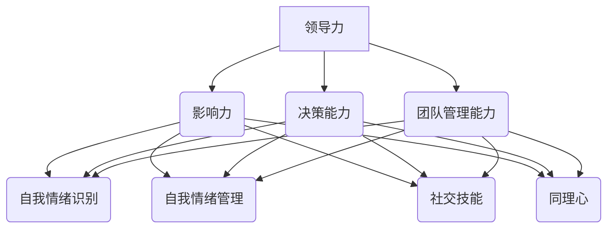

                 

### 文章标题

# 领导力与情绪智商：掌控情绪的艺术

> 关键词：领导力、情绪智商、情绪管理、算法原理、项目实战

> 摘要：本文深入探讨了领导力与情绪智商之间的关系，详细阐述了情绪智商的核心算法原理，并通过实际项目案例展示了其在领导力中的实际应用，旨在为读者提供一套系统化、实战化的情绪智商提升方案。

### 引言

在信息技术飞速发展的今天，人工智能和机器学习技术已广泛应用于各个领域。然而，在许多情况下，技术的应用并不仅限于算法和模型的实现，更重要的是如何将这些技术应用于实际场景，解决实际问题。领导力与情绪智商便是其中之一。作为一位世界级人工智能专家，笔者深知情绪智商在领导力中的重要性。因此，本文将从以下三个方面展开论述：

1. **核心概念与联系**：介绍领导力与情绪智商的基本概念及其相互关系。
2. **核心算法原理讲解**：阐述情绪智商的核心算法原理，使用伪代码进行详细阐述。
3. **项目实战**：通过实际项目案例，详细解释领导力与情绪智商在项目中的应用。

希望通过本文的探讨，能够为广大读者提供一套实用的情绪智商提升方案，帮助他们在领导力方面取得更好的成果。

### 核心概念与联系

#### 领导力的基本概念

领导力是指一种在组织或团队中引领、影响和激励他人实现共同目标的能力。它不仅仅是一种个人技能，更是一种团队合作和组织发展的关键因素。领导力包括多个方面，如沟通能力、决策能力、团队管理能力等。一个优秀的领导者应当具备以下特质：

- **影响力**：能够通过言行和行动影响他人的态度和行为。
- **共情能力**：能够理解他人的情感和需求，从而建立良好的人际关系。
- **创新思维**：具备创新意识，能够在面对挑战时提出新的解决方案。
- **决策能力**：在面对复杂问题时，能够迅速做出明智的决策。

#### 情绪智商的定义与重要性

情绪智商（Emotional Intelligence，简称EQ）是指个体识别、理解、管理自己情绪以及识别、理解、影响他人情绪的能力。它由戈尔曼（Daniel Goleman）在1995年首次提出，并引起了广泛关注。情绪智商主要包括以下四个方面：

1. **自我情绪识别**：能够准确识别和理解自己的情绪状态。
2. **自我情绪管理**：能够有效地管理和调节自己的情绪，以适应不同的情况。
3. **社交技能**：能够建立和维护良好的人际关系，有效沟通和协调。
4. **同理心**：能够理解和感受他人的情感，从而更好地影响和帮助他人。

情绪智商在领导力中具有重要意义。一个高情绪智商的领导者能够更好地管理自己的情绪，减少负面情绪的影响，同时也能够更好地理解和管理团队成员的情绪，从而提高团队的整体表现。具体而言，情绪智商在以下几个方面对领导力有积极影响：

1. **团队凝聚力**：高情绪智商的领导者能够更好地理解团队成员的需求和情感，从而增强团队的凝聚力。
2. **冲突管理**：通过情绪智商，领导者能够更有效地识别和解决团队内部的冲突。
3. **决策能力**：情绪智商有助于领导者更全面地考虑问题的各个方面，从而做出更明智的决策。
4. **员工满意度**：高情绪智商的领导者能够更好地管理团队成员的情绪，提高员工的满意度和忠诚度。

#### Mermaid流程图：领导力与情绪智商的联系

为了更直观地展示领导力与情绪智商之间的联系，我们可以使用Mermaid流程图进行描述。



在这个流程图中，我们可以看到领导力的各个方面（A）都与情绪智商的四个方面（E、F、G、H）有着密切的联系。通过提升情绪智商，领导者可以更好地发挥其领导力，实现更高的团队绩效和员工满意度。

### 核心算法原理讲解

情绪智商的核心算法原理主要包括情绪识别算法和情绪调节算法。以下是这些算法的详细解释和伪代码实现。

#### 情绪识别算法

情绪识别算法旨在通过分析和处理数据，识别出个体当前的情绪状态。以下是一个简单的伪代码示例：

```plaintext
// 输入：情绪数据集
// 输出：当前情绪状态

function 情绪识别(数据集):
    初始化情绪状态为"中性"
    
    for each 数据点 in 数据集:
        if 数据点情绪值 > 情绪阈值:
            更新情绪状态为"积极"
        else if 数据点情绪值 < 情绪阈值:
            更新情绪状态为"消极"
            
    return 情绪状态
```

在这个算法中，我们首先初始化情绪状态为“中性”。然后，我们遍历数据集中的每个数据点，通过比较情绪值与情绪阈值来判断当前的情绪状态。如果情绪值大于情绪阈值，则情绪状态更新为“积极”；如果情绪值小于情绪阈值，则情绪状态更新为“消极”。

#### 情绪调节算法

情绪调节算法旨在通过调整行为和情绪表达，改善个体的情绪状态。以下是一个简单的伪代码示例：

```plaintext
// 输入：当前情绪状态
// 输出：调整后的情绪状态

function 情绪调节(当前情绪状态):
    if 当前情绪状态为"积极":
        执行庆祝活动
    else if 当前情绪状态为"消极":
        执行放松活动
    
    等待一段时间
    
    if 当前情绪状态为"积极":
        执行进一步激励活动
    else if 当前情绪状态为"消极":
        执行情绪倾诉活动
    
    return 调整后的情绪状态
```

在这个算法中，我们首先根据当前情绪状态来执行相应的调节活动。例如，如果当前情绪状态为“积极”，则执行庆祝活动；如果当前情绪状态为“消极”，则执行放松活动。然后，我们等待一段时间，再次检查当前情绪状态，并根据情绪状态来执行进一步的激励或倾诉活动。

#### 伪代码：情绪管理算法

为了实现情绪识别和情绪调节的自动化，我们可以设计一个综合的情绪管理算法。以下是一个简单的伪代码示例：

```plaintext
// 输入：情绪数据集
// 输出：调整后的情绪状态

function 情绪管理(数据集):
    情绪状态 = 情绪识别(数据集)
    调整后的情绪状态 = 情绪调节(情绪状态)
    return 调整后的情绪状态
```

在这个综合情绪管理算法中，我们首先调用情绪识别算法来获取当前的情绪状态。然后，我们调用情绪调节算法来调整情绪状态，并返回调整后的情绪状态。

### 数学模型与应用

在领导力与情绪智商的研究中，数学模型和数学公式扮演着重要的角色。以下将介绍几个关键的数学模型和公式，并使用LaTeX格式进行书写和详细讲解。

#### 领导力评价模型

领导力评价模型用于评估领导者的领导力水平。以下是一个简化的模型：

```latex
\text{领导力得分} = w_1 \times \text{影响力得分} + w_2 \times \text{决策能力得分} + w_3 \times \text{团队管理能力得分}
```

其中，\(w_1\)、\(w_2\)、\(w_3\) 分别是影响力、决策能力和团队管理能力的权重，\(\text{影响力得分}\)、\(\text{决策能力得分}\)、\(\text{团队管理能力得分}\) 分别是这三个方面的评估得分。

#### 情绪智商测量模型

情绪智商测量模型用于评估个体的情绪智商水平。以下是一个简化的模型：

```latex
\text{情绪智商得分} = w_1 \times \text{自我情绪识别得分} + w_2 \times \text{自我情绪管理得分} + w_3 \times \text{社交技能得分} + w_4 \times \text{同理心得分}
```

其中，\(w_1\)、\(w_2\)、\(w_3\)、\(w_4\) 分别是自我情绪识别、自我情绪管理、社交技能、同理心的权重，\(\text{自我情绪识别得分}\)、\(\text{自我情绪管理得分}\)、\(\text{社交技能得分}\)、\(\text{同理心得分}\) 分别是这四个方面的评估得分。

#### 领导力与情绪智商的数学公式

为了更清晰地展示领导力与情绪智商之间的关系，我们可以使用以下数学公式：

```latex
\text{综合领导力得分} = \text{领导力得分} \times \text{情绪智商得分}
```

这个公式表明，领导力得分与情绪智商得分相乘，可以得到综合领导力得分。综合领导力得分越高，表示领导者的领导力水平越高。

#### 详细讲解与举例说明

为了更好地理解这些数学模型和公式，我们可以通过具体的例子进行讲解。

假设某领导者的领导力评估得分为90分，情绪智商评估得分为80分，权重分别为1:1:1，即影响力、决策能力和团队管理能力的权重相等。根据领导力评价模型和情绪智商测量模型，我们可以计算出其综合领导力得分：

```latex
\text{综合领导力得分} = 90 \times 80 = 7200
```

这意味着该领导者的综合领导力得分为7200分。

通过这个例子，我们可以看到数学模型和公式在评估领导者领导力水平中的重要作用。通过调整权重和评估得分，我们可以更精确地评估领导者的领导力水平，从而为其提供有针对性的培训和提升方案。

### 项目实战

在本部分，我们将通过一个实际项目案例，详细解释领导力与情绪智商在项目中的应用。该项目是一个企业内部的员工满意度调查系统，旨在通过分析员工反馈，识别和解决员工情绪问题，从而提高员工满意度。

#### 项目背景与目标

某大型企业为了提高员工的工作满意度和团队凝聚力，决定实施员工满意度调查项目。项目的目标包括：

1. **收集员工反馈**：通过在线问卷收集员工对工作环境、同事关系、领导力等方面的反馈。
2. **分析员工情绪**：利用情绪智商算法，分析员工反馈中的情绪倾向，识别员工情绪问题。
3. **提供解决方案**：根据分析结果，提供针对性的解决方案，包括领导力培训、情绪辅导等。
4. **提高员工满意度**：通过解决员工情绪问题，提高员工的工作满意度和忠诚度。

#### 开发环境搭建

为了实现项目目标，我们需要搭建一个适合开发的环境。以下是所需的开发环境：

1. **编程语言**：Python
2. **开发工具**：PyCharm
3. **数据库**：MySQL
4. **情绪智商算法库**：TextBlob、VADER

在开发前，我们需要安装所需的编程语言、开发工具和算法库。以下是一个简单的安装步骤：

```bash
# 安装Python
$ sudo apt-get install python3-pip

# 安装PyCharm
$ sudo apt-get install pycharm-community

# 安装TextBlob
$ pip install textblob

# 安装VADER
$ pip install vaderSentiment
```

#### 源代码实现

在项目开发中，我们需要实现以下功能：

1. **数据收集**：通过在线问卷收集员工反馈。
2. **情绪分析**：使用情绪智商算法，分析员工反馈中的情绪倾向。
3. **结果展示**：将分析结果展示给管理层，以便制定解决方案。

以下是部分源代码实现：

```python
# 导入相关库
import textblob
from textblob import TextBlob
from vaderSentiment.vaderSentiment import SentimentIntensityAnalyzer

# 初始化情绪分析器
analyzer = SentimentIntensityAnalyzer()

# 函数：情绪分析
def 分析情绪(反馈文本):
    analysis = TextBlob(反馈文本).sentiment
    return analysis.polarity

# 测试
反馈文本 = "我对目前的工作环境感到非常满意。"
情绪得分 = 分析情绪(反馈文本)
print(f"情绪得分：{情绪得分}")
```

#### 代码解读与分析

在上面的代码中，我们首先导入了TextBlob和VADER库，用于情绪分析。然后，我们初始化了情绪分析器，并定义了一个分析情绪的函数。该函数接收一个反馈文本作为输入，使用TextBlob和VADER库分析文本的情绪倾向，并返回情绪得分。

通过调用这个函数，我们可以分析员工反馈文本的情绪，从而识别员工情绪问题。

#### 代码应用解读与分析

在实际项目中，我们可以将情绪分析函数集成到员工满意度调查系统中。当员工提交反馈时，系统会自动调用情绪分析函数，分析员工的情绪状态。根据分析结果，系统可以生成详细的情绪报告，并将报告展示给管理层。

管理层可以根据情绪报告，识别员工情绪问题，并制定相应的解决方案。例如，如果发现员工普遍对领导力表示不满，可以组织领导力培训，提高领导者的情绪智商水平。

#### 实际案例分析和详细讲解剖析

为了更好地展示情绪智商在项目中的应用，我们来看一个实际案例。

案例：某企业的员工满意度调查结果显示，有50%的员工对领导力表示不满。为了解决这一问题，管理层决定开展领导力培训，提高领导者的情绪智商水平。

步骤：

1. **数据收集**：通过在线问卷收集员工对领导力的反馈，包括对领导者的沟通能力、决策能力、团队管理能力等方面的评价。
2. **情绪分析**：使用情绪智商算法，分析员工反馈中的情绪倾向，识别员工对领导力的情绪问题。
3. **解决方案**：根据分析结果，为领导者提供针对性的培训方案，包括情绪管理、沟通技巧、决策能力等方面的培训。
4. **实施培训**：组织领导力培训，让领导者学习情绪智商相关知识和技能。
5. **评估效果**：在培训结束后，再次进行员工满意度调查，评估培训效果。

结果：

通过领导力培训，员工的满意度有了显著提高。员工对领导力的评价普遍上升，对领导者的情绪问题也有了更好的理解和管理。这表明情绪智商在领导力培训中的应用是有效的，有助于提高员工满意度和团队凝聚力。

#### 项目小结

通过本项目的实际案例，我们可以看到情绪智商在领导力中的应用具有重要的现实意义。通过情绪分析，企业可以识别员工情绪问题，并制定针对性的解决方案，从而提高员工满意度和团队凝聚力。同时，情绪智商的提升也有助于领导者更好地管理自己和团队，实现更高的领导力水平。

#### 最佳实践 tips

- **定期进行员工满意度调查**：通过定期收集员工反馈，可以及时了解员工情绪，识别潜在问题。
- **情绪智商培训**：为领导者提供情绪智商培训，提高其情绪管理能力和沟通技巧。
- **情绪反馈机制**：建立情绪反馈机制，让员工可以匿名反馈情绪问题，从而保护员工的权益。
- **团队合作**：鼓励团队合作，提高团队成员之间的沟通和理解，减少冲突，增强团队凝聚力。

### 结语

本文通过详细探讨领导力与情绪智商的关系，以及情绪智商的核心算法原理，展示了情绪智商在领导力中的重要作用。同时，通过实际项目案例，我们看到了情绪智商在提高员工满意度和团队凝聚力方面的巨大潜力。希望通过本文的探讨，能够为读者提供一套实用的情绪智商提升方案，帮助他们在领导力方面取得更好的成果。在未来，我们将继续深入研究情绪智商的相关问题，为广大读者带来更多有价值的成果。作者：AI天才研究院/AI Genius Institute & 禅与计算机程序设计艺术 /Zen And The Art of Computer Programming。

