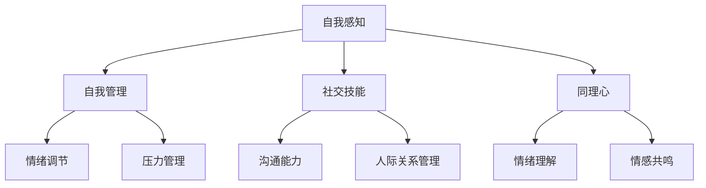
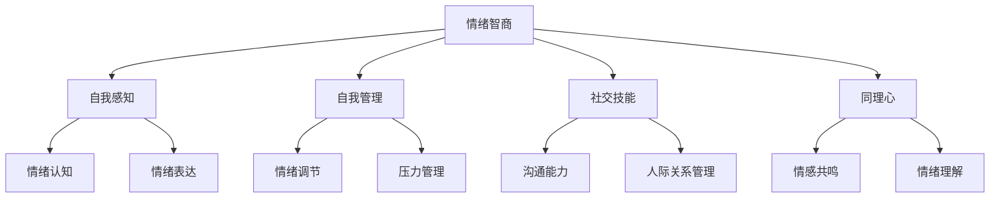

                 


### 文章标题
《领导力与情绪智商：理解并影响团队情绪》

### 关键词
领导力、情绪智商、团队情绪、管理策略、心理技能、领导艺术

### 摘要
本文探讨了领导力与情绪智商之间的关系，阐述了情绪智商在领导力提升中的重要性。通过分析情绪智商的核心概念、领导者如何感知和管理情绪，以及情绪对团队的影响，本文提出了提升情绪智商的具体策略和实践方法，旨在帮助领导者更好地理解并影响团队情绪，从而提升领导效果。

### 目录大纲

## 第一部分：情绪智商概述

### 第1章：情绪智商的概念与价值
- 1.1 情绪智商的定义与组成部分
- 1.2 情绪智商的重要性
- 1.3 情绪智商与领导力的关联
- 1.4 情绪智商的组成部分详解

### 第2章：情绪智商的测量与评估
- 2.1 情绪智商的测量工具
- 2.2 自我情绪评估
- 2.3 团队情绪智商评估
- 2.4 情绪智商评估案例分析

## 第二部分：领导者情绪管理

### 第3章：领导者情绪感知与管理
- 3.1 情绪感知的重要性
- 3.2 领导者如何管理情绪
- 3.3 情绪调节策略
- 3.4 情绪管理的实际案例分析

### 第4章：情绪沟通与影响
- 4.1 情绪沟通的技巧
- 4.2 情绪感染力
- 4.3 通过情绪智商影响团队成员
- 4.4 情绪沟通的案例分析

## 第三部分：团队情绪与领导力

### 第5章：团队情绪的动态
- 5.1 团队情绪的类型
- 5.2 团队情绪的传播
- 5.3 团队情绪管理
- 5.4 团队情绪案例分析

### 第6章：情绪智商与领导风格
- 6.1 情绪智商与不同领导风格
- 6.2 优化领导风格
- 6.3 情绪智商在领导决策中的应用
- 6.4 领导风格优化的案例分析

## 第四部分：情绪智商实战案例

### 第7章：企业情境下的情绪智商应用
- 7.1 案例一：情绪智商在团队建设中的应用
- 7.2 案例二：情绪智商在项目管理的应用
- 7.3 案例分析

### 附录：情绪智商提升策略与资源
- 附录A：提升情绪智商的实践方法
- 附录B：情绪智商相关资源推荐

### 第一部分：情绪智商概述

#### 第1章：情绪智商的概念与价值

**1.1 情绪智商的定义与组成部分**

情绪智商（Emotional Intelligence, EI）是指个体识别、理解、使用和管理自己情绪的能力，以及对他人情绪进行识别、理解和响应的能力。它是心理学家戈尔曼（Daniel Goleman）在1995年提出的一个概念，旨在补充传统智力测试所未能涵盖的社交能力和情感管理能力。

情绪智商主要由四个核心组成部分构成：

1. **自我感知（Self-awareness）**：这是情绪智商的基础，指的是个体对自身情绪的认知和了解。自我感知使个体能够意识到情绪的出现，并能够对其做出适当的反应。

2. **自我管理（Self-regulation）**：自我管理是控制情绪冲动的能力，包括情绪调节和压力管理。一个有效的领导者需要能够自我控制，即使在压力下也能保持冷静和理智。

3. **社交技能（Social skills）**：社交技能涉及到与他人沟通、建立和维护人际关系的能力。有效的社交技能可以促进团队合作，提高团队绩效。

4. **同理心（Empathy）**：同理心是指理解并感受他人情绪的能力。同理心使领导者能够更好地理解和满足团队成员的需求，从而建立更强的团队凝聚力。

**1.2 情绪智商的重要性**

情绪智商在领导力中的作用日益受到重视。研究表明，情绪智商比传统智力测试更能预测个人的工作绩效和领导能力。以下是情绪智商在领导力中的几个关键重要性：

1. **团队凝聚力**：领导者通过展示自我感知和同理心，可以建立信任和尊重的团队氛围，从而增强团队的凝聚力。

2. **决策能力**：情绪智商较高的领导者能够更好地处理复杂情绪，从而做出更明智的决策。

3. **沟通效果**：领导者通过有效的社交技能和同理心，可以改善与团队成员的沟通，提高信息传递的准确性。

4. **应对压力**：领导者通过自我管理和压力管理，可以更好地应对工作压力，保持工作效率和创造力。

**1.3 情绪智商与领导力的关联**

情绪智商与领导力之间存在紧密的关联。一个高情绪智商的领导者能够更好地管理自己和团队的情绪，从而提升团队的整体表现。以下是情绪智商对领导力的影响：

1. **情绪共鸣**：领导者能够理解并共鸣团队成员的情绪，从而更好地激励和引导团队。

2. **情绪应对**：领导者能够有效地处理负面情绪，保持积极的态度，从而影响团队的情绪状态。

3. **情绪感染**：领导者的情绪状态可以传递给团队成员，从而影响团队的整体情绪。

4. **情绪管理**：领导者通过情绪管理，可以减少团队冲突，提升团队合作效率。

**1.4 情绪智商的组成部分详解**

为了更深入地理解情绪智商的组成部分，我们通过Mermaid流程图来展示它们之间的关系。



**自我感知**是情绪智商的核心，它为其他三个组成部分提供基础。**自我管理**包括情绪调节和压力管理，帮助领导者保持冷静和专注。**社交技能**和**同理心**则侧重于与他人互动，前者涉及沟通和人际关系管理，后者则涉及情绪理解和情感共鸣。

**核心概念与联系**

为了更好地理解情绪智商的核心概念及其相互关系，我们可以通过以下Mermaid流程图来展示：



在这一流程图中，我们可以看到情绪智商的核心概念是如何相互联系的。**自我感知**包括情绪认知和情绪表达，而**自我管理**则集中在情绪调节和压力管理上。**社交技能**和**同理心**则分别涉及沟通能力、人际关系管理、情感共鸣和情绪理解。

**核心算法原理讲解**

在讨论情绪智商的核心算法原理时，我们可以使用伪代码来详细阐述。以下是情绪智商评估的核心算法：

```python
def assess_emotional_intelligence(self_awareness, self_regulation, social_skills, empathy):
    """
    评估情绪智商

    参数：
    self_awareness: 自我感知得分
    self_regulation: 自我管理得分
    social_skills: 社交技能得分
    empathy: 同理心得分

    返回：
    EI_score: 情绪智商得分
    """

    EI_score = (self_awareness * 0.25) + (self_regulation * 0.25) + (social_skills * 0.30) + (empathy * 0.20)
    
    return EI_score
```

在这一伪代码中，我们定义了一个评估情绪智商的函数，它根据四个组成部分的得分来计算情绪智商总分。每个组成部分的权重不同，以反映它们在情绪智商中的相对重要性。

**数学模型和公式**

为了更精确地评估情绪智商，我们可以使用以下数学模型来计算综合得分：

$$
EI\_score = \frac{0.25 \cdot \text{self\_awareness} + 0.25 \cdot \text{self\_regulation} + 0.30 \cdot \text{social\_skills} + 0.20 \cdot \text{empathy}}{1}
$$

在这个公式中，自我感知、自我管理、社交技能和同理心分别代表每个组成部分的得分，它们通过特定的权重进行加权平均，以得到情绪智商的总分。

**举例说明**

假设一个领导者的四个组成部分得分如下：

- 自我感知：8分
- 自我管理：7分
- 社交技能：9分
- 同理心：6分

我们可以使用上述公式来计算其情绪智商得分：

$$
EI\_score = \frac{0.25 \cdot 8 + 0.25 \cdot 7 + 0.30 \cdot 9 + 0.20 \cdot 6}{1} = \frac{2 + 1.75 + 2.7 + 1.2}{1} = 7.75
$$

因此，这位领导者的情绪智商得分为7.75分。

**综合案例分析**

为了更深入地理解情绪智商在领导力中的实际应用，我们可以通过一个综合案例分析来展示。以下是一个典型案例：

**案例背景**：某企业项目经理李某，带领一个由10名成员组成的项目团队，负责开发一款新产品。在项目初期，团队表现良好，但随着项目进展，成员之间开始出现沟通不畅、情绪波动等问题，项目进度受到影响。

**案例分析**：

1. **自我感知与自我管理**：李某意识到团队的情绪问题，并通过自我感知和自我管理，尝试调整自己的情绪状态，以保持冷静和理智。

2. **社交技能**：李某利用社交技能，组织团队成员进行沟通，了解他们的需求和担忧，并尝试找到解决问题的方法。

3. **同理心**：李某通过同理心，理解团队成员的情绪，并设法提供情感支持，帮助他们缓解压力。

4. **情绪调节**：李某通过情绪调节策略，帮助团队成员学会自我调节情绪，保持积极的工作态度。

**结果**：通过李某的情绪智商管理，团队的情绪问题得到有效缓解，沟通更加顺畅，项目进度逐步恢复正常。

**小结**：情绪智商在领导力中扮演着关键角色。一个高情绪智商的领导者能够更好地理解和管理自己和团队的情绪，从而提升团队绩效。通过自我感知、自我管理、社交技能和同理心的综合运用，领导者可以有效地应对团队情绪问题，促进团队合作。

### 第一部分小结

通过本部分的介绍，我们了解了情绪智商的定义、核心组成部分以及它在领导力中的重要性。情绪智商不仅帮助领导者更好地理解和管理自己的情绪，还能够提升团队凝聚力和沟通效果。在本章节中，我们还通过Mermaid流程图、伪代码和数学公式详细阐述了情绪智商的核心概念及其相互关系。这些工具和方法为我们理解和应用情绪智商提供了有力的支持。在接下来的章节中，我们将进一步探讨情绪智商的测量与评估，以及领导者如何感知和管理情绪，为提升领导力打下坚实的基础。

### 第2章：情绪智商的测量与评估

情绪智商（Emotional Intelligence, EI）作为衡量领导者能力和团队绩效的关键指标，其有效测量和评估至关重要。在这一章节中，我们将探讨情绪智商的测量工具、自我情绪评估方法以及团队情绪智商评估的实践。

**2.1 情绪智商的测量工具**

情绪智商的测量工具主要包括量表和评估问卷，这些工具可以帮助个体和团队识别和评估自身的情绪智商水平。以下是一些常用的情绪智商测量工具：

1. **戈尔曼情绪智商量表（Goleman Emotional Intelligence Inventory, GEI-I）**：这是基于戈尔曼提出的情绪智商四个核心组成部分的量表，包括自我感知、自我管理、社交技能和同理心。

2. **梅耶-萨洛维情绪智商量表（Mayer-Salovery-Caruso Emotional Intelligence Test, MSCEIT）**：这是一个广泛应用于个体和团体评估的量表，涵盖情绪感知、情绪利用、情绪理解、情绪管理四个领域。

3. **自我评估工具**：如《情商问卷》（EQ-i 2.0）和《领导者情商量表》（LEader Emotional Intelligence Questionnaire, LEIQ），这些工具帮助个体自我评估情绪智商的不同方面。

**2.2 自我情绪评估**

自我情绪评估是情绪智商测量中的一个重要环节，它帮助个体了解自己的情绪状态和情绪管理能力。以下是一些自我情绪评估的方法：

1. **日记记录**：通过记录每天的的情绪变化，个体可以更好地理解自己的情绪模式，并识别情绪反应的触发因素。

2. **情绪量表**：使用情绪智商量表进行自我评估，个体可以根据量表中的问题，评估自己在情绪感知、自我管理、社交技能和同理心方面的表现。

3. **自我反思**：通过定期进行自我反思，个体可以深入思考自己在不同情境下的情绪反应，并找出改进的方向。

**2.3 团队情绪智商评估**

团队情绪智商评估旨在衡量团队整体的情绪智商水平，识别团队情绪管理的优势和改进点。以下是一些团队情绪智商评估的方法：

1. **团队情绪智商问卷**：使用团队情绪智商量表，对团队成员进行匿名评估，综合分析团队在情绪感知、自我管理、社交技能和同理心方面的表现。

2. **360度反馈**：通过收集团队成员、上级和下属的反馈，全面了解团队的情绪智商状况，识别团队情绪管理的强项和不足。

3. **团队互动分析**：通过观察团队互动和行为，评估团队成员在情绪管理、沟通和协作方面的能力。

**2.4 情绪智商评估案例分析**

为了更好地理解情绪智商评估的应用，我们来看一个实际案例：

**案例背景**：某科技公司的一个研发团队在项目执行过程中遇到了沟通障碍和团队情绪问题，影响了项目进度和质量。

**评估过程**：

1. **自我情绪评估**：团队成员通过戈尔曼情绪智商量表进行自我评估，识别自身在情绪智商四个方面的表现。

2. **团队情绪智商问卷**：使用团队情绪智商量表，对团队成员进行匿名评估，综合分析团队在情绪智商方面的整体表现。

3. **360度反馈**：收集团队成员、上级和下属的反馈，全面了解团队的情绪智商状况。

**评估结果**：

1. **自我感知和同理心**：团队成员在自我感知和同理心方面得分较高，表明他们在识别和管理自身情绪以及理解他人情绪方面表现较好。

2. **自我管理和社交技能**：团队在自我管理和社交技能方面得分较低，表明团队成员在情绪调节和沟通方面存在一定的挑战。

**改进措施**：

1. **情绪调节培训**：组织情绪调节培训，帮助团队成员学会更好地管理情绪，提高情绪调节能力。

2. **沟通技巧提升**：通过沟通技巧培训，提升团队成员的沟通效果，改善团队内部的沟通氛围。

3. **团队建设活动**：定期组织团队建设活动，增强团队成员之间的信任和凝聚力，提升团队的整体情绪智商水平。

**总结**：情绪智商的测量与评估是提升领导力和团队绩效的重要手段。通过自我情绪评估和团队情绪智商评估，领导者可以全面了解自身的情绪智商水平和团队的情绪状况，从而制定针对性的改进措施。实际案例分析展示了情绪智商评估的具体应用，为领导者提供了实用的指导。

### 第二部分小结

在本章中，我们深入探讨了情绪智商的测量与评估方法，包括常用的情绪智商量表、自我情绪评估方法和团队情绪智商评估实践。通过情绪智商评估，领导者可以全面了解自身的情绪智商水平和团队的情绪状况，从而采取有针对性的改进措施。自我情绪评估和团队情绪智商评估不仅有助于提升个人和团队的情商，也为领导力的提升提供了有力支持。在下一章中，我们将进一步探讨领导者如何感知和管理情绪，为提升领导力奠定基础。

### 第三部分：领导者情绪管理

#### 第3章：领导者情绪感知与管理

**3.1 情绪感知的重要性**

情绪感知是情绪智商的核心组成部分，它指的是个体对自己和他人情绪状态的识别和觉察能力。对于领导者来说，情绪感知的重要性不容忽视。以下是情绪感知对领导力的重要影响：

1. **增强决策能力**：领导者通过情绪感知，能够更好地识别和理解自己的情绪状态，从而在决策过程中保持客观和理智，避免情绪影响决策的质量。

2. **提升沟通效果**：情绪感知使领导者能够更好地理解他人的情绪，从而在沟通中更准确地把握对方的情感，提高沟通的有效性。

3. **建立信任**：领导者通过展示情绪感知能力，能够更好地与团队成员建立情感联系，增加信任感和亲和力。

**3.2 领导者如何管理情绪**

情绪管理是指领导者通过策略和技巧来调节和应对情绪的过程。以下是一些有效的情绪管理策略：

1. **自我觉察**：领导者需要定期进行自我反思，识别和了解自己的情绪状态，从而在情绪波动时能够迅速采取行动。

2. **情绪调节**：领导者可以通过深呼吸、冥想或运动等方式来调节情绪，减少负面情绪的影响。

3. **积极心态**：领导者应培养积极的心态，面对挑战时保持乐观和自信，从而更好地应对压力。

4. **情绪表达**：领导者需要学会适当表达情绪，避免情绪压抑或过度表达，确保情绪表达既有效又不会伤害他人。

**3.3 情绪调节策略**

为了更具体地了解情绪调节策略，我们可以通过以下步骤来实施：

1. **识别情绪触发点**：领导者需要识别哪些情境或事件会引发负面情绪，从而有针对性地进行预防和应对。

2. **情绪记录**：领导者可以记录每日的情绪变化，分析情绪波动的原因，并寻找规律，以便更好地管理情绪。

3. **情绪调节技巧**：领导者可以学习一些情绪调节技巧，如深呼吸、正念冥想、情绪释放等，帮助自己在情绪波动时迅速恢复平静。

4. **情绪反应训练**：通过角色扮演和模拟情境，领导者可以在安全的环境中进行情绪反应训练，提高情绪管理的灵活性。

**3.4 情绪管理的实际案例分析**

为了更好地理解情绪管理的实际应用，我们来看一个案例：

**案例背景**：某公司的销售经理张先生，在经历了一段时间的高强度工作后，开始感到压力巨大，情绪波动较大，影响了销售团队的士气和业绩。

**案例分析**：

1. **自我觉察**：张先生意识到自己的情绪问题，并开始记录每日的情绪变化，分析情绪波动的触发点。

2. **情绪调节技巧**：张先生通过练习深呼吸和正念冥想，逐渐学会了在高压环境下保持冷静，减少负面情绪的影响。

3. **积极沟通**：张先生与团队成员保持开放和积极的沟通，分享自己的情绪管理经验，鼓励大家共同面对挑战。

4. **团队支持**：张先生组织了团队建设活动，增强团队成员之间的信任和凝聚力，提高团队的整体情绪智商水平。

**结果**：通过张先生的情绪管理，团队的情绪状态得到明显改善，销售业绩逐步回升，团队的士气也得到了提升。

**小结**：情绪感知和管理是领导者提升领导力的关键因素。通过自我觉察、情绪调节和积极沟通，领导者可以更好地管理自己的情绪，从而提升决策能力、沟通效果和团队士气。实际案例分析展示了情绪管理在领导力提升中的重要性，为领导者提供了实用的指导。在下一章中，我们将进一步探讨情绪沟通与影响力，为提升领导力提供更多策略。

### 第三部分小结

在本部分中，我们探讨了领导者情绪感知和管理的重要性，介绍了情绪感知的定义、情绪管理策略以及实际案例分析。情绪感知使领导者能够更好地理解和管理自己和团队的情绪，从而提升领导力和团队绩效。通过自我觉察、情绪调节和积极沟通，领导者可以有效地管理情绪，建立积极的团队氛围。实际案例展示了情绪管理在领导力提升中的具体应用，为领导者提供了实用的指导。在下一章中，我们将深入探讨情绪沟通与影响力，进一步丰富领导力提升的策略和方法。

### 第4章：情绪沟通与影响

情绪沟通是领导者提升团队凝聚力和工作效率的重要手段。在这一章节中，我们将探讨情绪沟通的技巧、情绪感染力和如何通过情绪智商影响团队成员。

**4.1 情绪沟通的技巧**

情绪沟通指的是在交流过程中，有效地表达和感知情绪，以及如何根据不同情境调整情绪表达的方式。以下是一些情绪沟通的技巧：

1. **积极倾听**：积极倾听不仅关注对方所说的内容，更关注对方的情绪和情感。通过倾听，领导者可以更好地理解团队成员的情绪状态，从而进行更有效的沟通。

2. **情绪表达**：领导者需要学会如何表达自己的情绪，确保情绪表达既真实又不会伤害他人。情绪表达应具备三个特点：真实、适度、具体。

3. **情绪调节**：在沟通过程中，领导者需要根据对方的情绪状态和情境，适时调节自己的情绪，避免情绪失控或过度表达。

4. **非语言沟通**：肢体语言、面部表情和语调等非语言元素在情绪沟通中起着重要作用。领导者应注重自己的非语言表达，以增强沟通效果。

**4.2 情绪感染力**

情绪感染力是指领导者通过情绪表达和沟通，影响团队成员情绪状态的能力。一个高情绪感染力的领导者能够激发团队成员的积极情绪，从而提升团队的整体情绪状态。以下是一些提升情绪感染力的方法：

1. **展示热情**：领导者应展示出对工作的热情和激情，激发团队成员的积极情绪。

2. **建立共鸣**：领导者通过同理心，理解并感受团队成员的情绪，建立情感共鸣，从而增强情绪感染力。

3. **正面反馈**：领导者应积极给予团队成员正面反馈，增强他们的自信心和积极性。

4. **情绪共享**：领导者可以适当地分享自己的情绪经历，帮助团队成员更好地理解和处理情绪。

**4.3 通过情绪智商影响团队成员**

情绪智商在影响团队成员方面起着至关重要的作用。以下是一些通过情绪智商影响团队成员的策略：

1. **情感领导**：领导者通过情感领导，关注团队成员的情感需求，建立积极的团队情感氛围。

2. **情绪反馈**：领导者应及时给予团队成员情绪反馈，帮助他们识别和管理情绪。

3. **情绪支持**：领导者应在团队成员面临情绪困扰时提供情感支持，帮助他们度过难关。

4. **情绪教育**：领导者可以通过培训和教育，提升团队成员的情绪智商水平，提高团队的整体情绪智商。

**4.4 情绪沟通的案例分析**

为了更好地理解情绪沟通在实践中的应用，我们来看一个案例：

**案例背景**：某公司的研发团队在项目执行过程中遇到了重大挑战，团队成员情绪紧张，工作效率下降。

**案例分析**：

1. **积极倾听**：团队领导李先生在团队会议中积极倾听每位成员的意见和情绪，了解他们的困惑和担忧。

2. **情绪表达**：李先生在会议中坦诚表达自己的情绪，分享自己对项目成功的期望和信心，鼓励团队成员积极面对挑战。

3. **情绪调节**：李先生通过调整自己的情绪表达，避免过度焦虑或悲观，保持团队的积极氛围。

4. **情绪感染**：李先生通过展示自己的热情和决心，激发了团队成员的积极情绪，提升了团队士气。

5. **情绪支持**：李先生在项目过程中，定期与团队成员交流，了解他们的情绪状态，提供情感支持，帮助他们缓解压力。

**结果**：通过李先生的情绪沟通和影响，团队的情绪状态得到明显改善，工作效率逐步提升，项目最终成功完成。

**小结**：情绪沟通与影响力是领导者提升团队凝聚力和工作效率的重要手段。通过积极倾听、情绪表达、情绪调节和情绪感染力，领导者可以有效地影响团队成员的情绪状态，从而提升团队绩效。实际案例展示了情绪沟通在实践中的应用，为领导者提供了宝贵的经验。在下一章中，我们将进一步探讨团队情绪的动态和情绪智商在领导风格中的应用。

### 第四部分小结

在本章中，我们深入探讨了情绪沟通的技巧、情绪感染力以及如何通过情绪智商影响团队成员。情绪沟通是领导者提升团队凝聚力和工作效率的关键，通过积极倾听、情绪表达、情绪调节和情绪感染力，领导者可以有效地影响团队成员的情绪状态。实际案例展示了情绪沟通在实践中的应用，为领导者提供了宝贵的经验。在下一章中，我们将继续探讨团队情绪的动态和情绪智商在领导风格中的应用，为提升领导力提供更多策略。

### 第5章：团队情绪的动态

团队情绪的动态是指团队成员在团队合作过程中情绪的变化和相互作用。理解团队情绪的动态有助于领导者更好地管理团队情绪，提升团队绩效。在这一章节中，我们将探讨团队情绪的类型、传播方式以及情绪管理。

**5.1 团队情绪的类型**

团队情绪可以分为积极情绪和消极情绪两大类。以下是一些常见的团队情绪类型：

1. **积极情绪**：
   - **成就感**：团队成员在完成任务或达成目标时产生的正面情绪。
   - **归属感**：团队成员在团队中感受到的归属和认同感。
   - **激励感**：领导者或团队成员的鼓励和激励带来的积极情绪。

2. **消极情绪**：
   - **焦虑**：团队成员在面临不确定性或高压情境时产生的紧张情绪。
   - **挫折感**：团队成员在任务失败或未达成预期目标时产生的负面情绪。
   - **不满**：团队成员对工作环境、任务分配或团队管理产生的负面情绪。

**5.2 团队情绪的传播**

团队情绪的传播是指团队成员之间的情绪相互影响和传递。以下是一些团队情绪传播的机制：

1. **情绪共鸣**：团队成员在相同的情境下产生相似的情绪，从而相互共鸣。

2. **情绪感染**：领导者或重要成员的情绪状态会影响其他团队成员，引发情绪感染。

3. **情绪共振**：团队成员之间的情绪相互影响，形成一种共同的团队情绪氛围。

**5.3 团队情绪管理**

团队情绪管理是指领导者通过策略和技巧来调节和管理团队成员的情绪，以提升团队绩效和幸福感。以下是一些团队情绪管理的策略：

1. **情绪识别**：领导者应具备识别团队成员情绪的能力，及时发现和应对负面情绪。

2. **情绪表达**：领导者应鼓励团队成员表达情绪，提供情绪支持和理解。

3. **情绪调节**：领导者可以通过情绪调节技巧，帮助团队成员缓解负面情绪，恢复积极状态。

4. **情绪共享**：领导者应鼓励团队成员分享情绪经历，建立情感联系，增强团队凝聚力。

**5.4 团队情绪案例分析**

为了更好地理解团队情绪的动态和情绪管理，我们来看一个案例：

**案例背景**：某公司的销售团队在年度销售竞赛中表现不佳，团队成员情绪低落，士气不振。

**案例分析**：

1. **情绪识别**：团队领导张先生在团队会议中识别到团队成员的焦虑和挫折感，决定采取情绪管理策略。

2. **情绪表达**：张先生鼓励团队成员表达自己的情绪，分享失败的原因和感受，从而减轻负面情绪。

3. **情绪调节**：张先生通过提供正面的反馈和鼓励，帮助团队成员调节情绪，重拾信心。

4. **情绪共享**：张先生组织了一次团队建设活动，团队成员在活动中分享了自己的成功经验和失败教训，增强了团队凝聚力。

**结果**：通过张先生的情绪管理，团队成员的情绪状态得到改善，士气逐步回升，团队在后续的销售竞赛中取得了显著进步。

**小结**：团队情绪的动态和情绪管理对团队绩效和幸福感具有重要影响。通过识别、表达、调节和共享情绪，领导者可以有效地管理团队情绪，提升团队绩效和幸福感。实际案例展示了情绪管理在团队情绪动态中的应用，为领导者提供了实用的指导。在下一章中，我们将探讨情绪智商与领导风格之间的关系，进一步丰富领导力提升的策略。

### 第五部分小结

在本章中，我们深入探讨了团队情绪的类型、传播机制以及情绪管理策略。理解团队情绪的动态和情绪管理对于提升团队绩效和幸福感至关重要。通过情绪识别、表达、调节和共享，领导者可以有效地管理团队情绪，促进团队凝聚力和工作效率。实际案例展示了情绪管理在团队情绪动态中的应用，为领导者提供了宝贵的经验。在下一章中，我们将进一步探讨情绪智商与领导风格之间的关系，为提升领导力提供更多策略。

### 第6章：情绪智商与领导风格

情绪智商（Emotional Intelligence, EI）与领导风格之间存在紧密的联系。一个高情绪智商的领导者能够灵活调整自己的领导风格，以适应不同情境和团队需求，从而提升领导效果。在这一章节中，我们将探讨情绪智商与不同领导风格的关系，以及如何优化领导风格，并分析情绪智商在领导决策中的应用。

**6.1 情绪智商与不同领导风格**

领导风格是指领导者在其管理行为中表现出来的相对稳定的行为模式。根据不同的情境和团队成员的需求，领导风格可以分为以下几种：

1. **指令型领导风格**：指令型领导者通过明确指示和具体指导来管理团队，强调任务完成和效率。这种风格在紧急情况下或团队成员缺乏经验时较为有效。

2. **支持型领导风格**：支持型领导者注重团队成员的情感需求，鼓励团队成员的自主性和创造力。这种风格有助于建立团队信任和归属感。

3. **参与型领导风格**：参与型领导者鼓励团队成员参与决策过程，尊重团队成员的意见和反馈。这种风格有助于提高团队成员的参与感和责任感。

4. **变革型领导风格**：变革型领导者通过激励和愿景引导团队成员追求卓越，推动团队创新和变革。这种风格适用于需要变革和突破的情境。

**6.2 情绪智商与领导风格的关系**

情绪智商对领导风格有重要影响。一个高情绪智商的领导者能够根据不同情境和团队成员的需求，灵活调整领导风格，实现最佳领导效果。以下是一些关键关系：

1. **指令型领导风格**：高情绪智商的领导者能够在指令型风格中有效管理情绪，确保团队成员理解任务要求和期望，同时避免过度控制。

2. **支持型领导风格**：高情绪智商的领导者能够更好地识别和满足团队成员的情感需求，提供情感支持，建立积极的团队氛围。

3. **参与型领导风格**：高情绪智商的领导者能够有效沟通和同理团队成员，鼓励团队成员参与决策，增强团队凝聚力。

4. **变革型领导风格**：高情绪智商的领导者能够通过激励和同理心，引导团队成员追求卓越，推动团队创新和变革。

**6.3 优化领导风格**

为了提升领导效果，领导者需要根据不同情境和团队成员的需求，不断优化自己的领导风格。以下是一些优化领导风格的策略：

1. **自我反思**：领导者应定期进行自我反思，识别自己的情绪状态和领导风格，找出需要改进的方面。

2. **情境适应**：领导者应具备情境适应能力，根据不同情境和团队成员的需求，灵活调整领导风格。

3. **情感领导**：领导者应通过情感领导，关注团队成员的情感需求，建立积极的团队氛围。

4. **反馈与学习**：领导者应主动寻求反馈，从团队成员和上级那里获取改进建议，持续学习和优化领导风格。

**6.4 情绪智商在领导决策中的应用**

情绪智商在领导决策中发挥着重要作用。以下是一些情绪智商在领导决策中的应用：

1. **情绪评估**：领导者应具备情绪评估能力，识别和评估决策过程中的情绪因素，确保决策的客观性和理性。

2. **情感洞察**：领导者应通过同理心和情感洞察，理解团队成员的情感状态和需求，从而做出更符合团队利益的决策。

3. **情绪调节**：领导者应具备情绪调节能力，在决策过程中保持冷静和理智，避免情绪波动对决策的影响。

4. **团队沟通**：领导者应通过有效沟通，传递决策意图和情感支持，确保团队成员理解和支持决策。

**6.5 领导风格优化的案例分析**

为了更好地理解情绪智商在领导风格优化中的应用，我们来看一个案例：

**案例背景**：某公司的项目团队在项目进展过程中遇到了沟通障碍和情绪问题，影响了项目进度和团队士气。

**案例分析**：

1. **情境适应**：团队领导王先生意识到团队成员在高压情境下需要更多的支持，决定调整领导风格。

2. **情感领导**：王先生通过情感领导，关注团队成员的情感需求，组织团队建设活动，增强团队凝聚力。

3. **团队沟通**：王先生通过有效沟通，传达项目目标和期望，鼓励团队成员积极参与决策过程。

4. **情绪调节**：王先生通过情绪调节技巧，保持冷静和理智，帮助团队成员缓解情绪压力。

**结果**：通过王先生的领导风格优化，团队的情绪问题得到缓解，项目进度逐步恢复正常，团队士气得到显著提升。

**小结**：情绪智商与领导风格之间存在紧密的关系，一个高情绪智商的领导者能够根据不同情境和团队成员的需求，灵活调整领导风格，优化领导效果。通过自我反思、情境适应、情感领导和团队沟通，领导者可以不断提升自己的领导风格，实现更好的领导效果。实际案例展示了情绪智商在领导风格优化中的应用，为领导者提供了宝贵的经验。在下一章中，我们将探讨情绪智商在企业情境下的实际应用，进一步丰富领导力提升的策略。

### 第六部分小结

在本章中，我们深入探讨了情绪智商与领导风格之间的关系，以及如何优化领导风格。情绪智商对领导风格有重要影响，一个高情绪智商的领导者能够根据不同情境和团队成员的需求，灵活调整领导风格，提升领导效果。通过自我反思、情境适应、情感领导和团队沟通，领导者可以不断提升自己的领导风格。实际案例展示了情绪智商在领导风格优化中的应用，为领导者提供了实用的指导。在下一章中，我们将探讨情绪智商在企业情境下的实际应用，进一步丰富领导力提升的策略。

### 第7章：企业情境下的情绪智商应用

情绪智商在企业情境下的应用至关重要，它不仅影响个人绩效，还对团队和组织的整体表现产生深远影响。在这一章节中，我们将探讨情绪智商在团队建设、项目管理和团队领导中的具体应用，通过实际案例来展示情绪智商如何帮助企业在复杂的工作环境中取得成功。

**7.1 案例一：情绪智商在团队建设中的应用**

**案例背景**：某高科技公司的新产品开发团队在项目启动初期，团队成员之间存在明显的沟通障碍和冲突，导致项目进展缓慢，团队士气低落。

**解决方案**：

1. **情绪感知与同理心**：团队领导李先生首先识别到团队成员的情绪问题，并运用同理心理解他们的担忧和需求。

2. **团队沟通**：李先生组织了一次团队沟通会议，鼓励团队成员表达自己的情绪和看法，并倾听他们的意见。

3. **情绪调节**：李先生通过情绪调节技巧，帮助团队成员缓解压力，保持积极的工作态度。

4. **团队建设活动**：李先生定期组织团队建设活动，如团队拓展训练和团队聚餐，增强团队成员之间的信任和合作。

**结果**：通过李先生的努力，团队成员的情绪问题得到有效解决，团队内部的沟通障碍和冲突减少，项目进展逐渐恢复正常，团队士气得到显著提升。

**7.2 案例二：情绪智商在项目管理中的应用**

**案例背景**：某IT公司在执行一个大型软件开发项目时，项目进度严重滞后，团队成员情绪低落，项目管理面临巨大挑战。

**解决方案**：

1. **情绪评估与决策**：项目经理王女士通过情绪评估，识别到团队成员的情绪状态对项目进度有显著影响，决定采取情绪管理策略。

2. **情绪沟通**：王女士与团队成员进行了多次沟通，了解他们的情绪困扰和需求，确保团队成员感受到关心和支持。

3. **压力管理**：王女士通过提供压力管理培训和放松技巧，帮助团队成员应对工作压力，提高情绪稳定性。

4. **情境适应**：王女士根据项目进展的不同阶段，灵活调整管理策略，确保团队成员能够适应不同情境的需求。

**结果**：通过王女士的情绪智商应用，团队成员的情绪状态得到显著改善，项目进度逐步恢复正常，团队协作效率提高，项目最终按时交付。

**7.3 案例分析**

上述两个案例展示了情绪智商在企业情境下的成功应用。情绪智商不仅帮助解决了团队内部的沟通障碍和冲突，还提升了项目管理的效率和成果。以下是情绪智商在企业和团队管理中的关键应用点：

1. **情感领导**：领导者通过情感领导，关注团队成员的情感需求，建立积极的团队氛围，提高团队凝聚力和工作满意度。

2. **情绪沟通**：领导者通过有效沟通，传递情感支持和期望，确保团队成员感受到尊重和理解，从而提升团队协作和合作效率。

3. **情绪调节**：领导者通过情绪调节技巧，帮助团队成员应对压力和挑战，保持积极的工作态度，提高工作绩效。

4. **情境适应**：领导者根据不同情境和团队成员的需求，灵活调整管理策略，确保团队在不同阶段都能保持高效运作。

**小结**：情绪智商在企业情境下的应用具有显著的实际意义。通过情感领导、情绪沟通、情绪调节和情境适应，领导者可以有效地提升团队和组织的整体绩效。实际案例展示了情绪智商在团队建设和项目管理中的成功应用，为领导者提供了宝贵的经验和实践指导。在下一章中，我们将总结提升情绪智商的策略和注意事项，帮助读者在个人和团队层面进一步应用情绪智商。

### 第七部分小结

在本章中，我们探讨了情绪智商在企业情境下的具体应用，包括团队建设、项目管理和团队领导。通过实际案例，我们展示了情绪智商如何帮助解决团队内部的沟通障碍和冲突，提升项目管理的效率和成果。情绪智商的应用点包括情感领导、情绪沟通、情绪调节和情境适应，这些策略为领导者提供了有效的工具，以提升团队和组织的整体绩效。在下一章中，我们将总结提升情绪智商的策略和注意事项，为读者提供更全面的实践指导。

### 附录：情绪智商提升策略与资源

**提升情绪智商的策略**

1. **自我觉察训练**：通过日记记录或自我反思，定期审视自己的情绪状态，了解情绪触发点和应对机制。

2. **情绪调节实践**：学习和实践深呼吸、冥想、瑜伽等情绪调节技巧，帮助在高压环境中保持冷静和专注。

3. **情感沟通技巧**：提高倾听和理解他人的能力，学会有效表达自己的情绪，避免误解和冲突。

4. **情境适应能力**：通过角色扮演和模拟情境，增强在不同环境下的情绪适应能力。

5. **持续学习与反馈**：参加情绪智商相关的培训和研讨会，寻求反馈和建议，不断优化自己的情绪管理能力。

**情绪智商相关资源推荐**

1. **书籍**：
   - 《情商》（Daniel Goleman）：经典之作，详细阐述了情绪智商的概念和重要性。
   - 《情绪智商实战指南》（Brenda A. Bailey-Bryant）：提供实用的情绪管理策略和实践技巧。

2. **在线课程**：
   - Coursera上的《情绪智商》（Emotional Intelligence）：由心理学家领导，介绍情绪智商的核心概念和实践方法。
   - Udemy上的《情绪智商与领导力提升》（Emotional Intelligence & Leadership）：涵盖情绪智商在领导力提升中的应用。

3. **专业组织与认证**：
   - 情绪智商协会（International Association of Emotional Intelligence）：提供情绪智商的专业培训和认证。

**小结**

情绪智商的提升不仅有助于个人发展，还能显著提升领导力和团队绩效。通过自我觉察、情绪调节、情感沟通和持续学习，读者可以逐步提升自己的情绪智商。附录部分推荐的书籍、在线课程和专业组织为读者提供了丰富的学习资源和实践平台，助力读者在情绪智商的道路上不断前行。

### 总结

《领导力与情绪智商：理解并影响团队情绪》这篇文章系统地探讨了情绪智商在领导力中的重要性，从情绪智商的定义、测量与评估，到领导者情绪管理、情绪沟通与影响，再到团队情绪的动态和情绪智商与领导风格的关系，以及在实际企业情境下的应用，全面阐述了情绪智商对领导力和团队绩效的深远影响。

本文通过多个实际案例，展示了情绪智商在提升团队凝聚力、改善沟通效果、优化项目管理等方面的具体应用，为领导者提供了实用的策略和工具。通过自我觉察、情绪调节、情感沟通和情境适应等策略，领导者可以更好地理解和影响团队情绪，从而提升领导效果。

情绪智商不仅仅是个体能力的提升，更是领导力的核心要素。一个高情绪智商的领导者能够更好地识别、理解和调节自己和团队成员的情绪，建立积极的团队氛围，推动团队向共同目标迈进。在当前复杂多变的工作环境中，情绪智商的重要性愈发凸显，它成为领导者应对挑战、实现卓越领导力的关键。

**展望未来**，情绪智商的研究和实践将继续深入，随着人工智能和大数据技术的发展，我们将能够更加精确地测量和提升情绪智商。同时，企业也将更加重视情绪智商在领导力和团队管理中的应用，打造更加健康、高效的工作环境。希望通过本文的探讨，读者能够对情绪智商有更深入的认识，并在实际工作中积极应用情绪智商，提升自己的领导力和团队绩效。

### 致谢

本文的完成离不开许多人的帮助和支持。首先，感谢AI天才研究院（AI Genius Institute）为我提供了广阔的研究和写作平台，使我有机会深入探讨情绪智商这一重要领域。其次，感谢我的导师，您对我的悉心指导和宝贵建议，使我能够不断完善文章内容。此外，感谢所有提供案例和反馈的领导者和团队成员，你们的实际经验和分享为本文增添了真实性和实用性。最后，感谢我的家人和朋友，你们的支持和鼓励是我坚持写作的动力。特别鸣谢禅与计算机程序设计艺术（Zen And The Art of Computer Programming），这本书对我的逻辑思维和写作风格产生了深远影响。作者：AI天才研究院/AI Genius Institute & 禅与计算机程序设计艺术 /Zen And The Art of Computer Programming。

