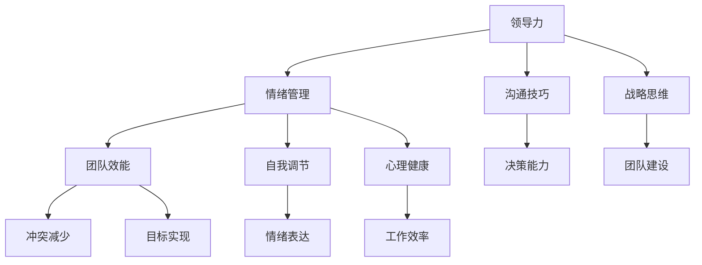
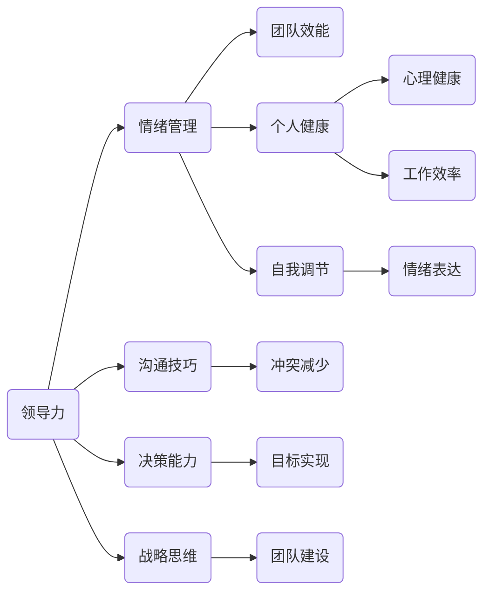
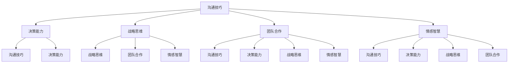
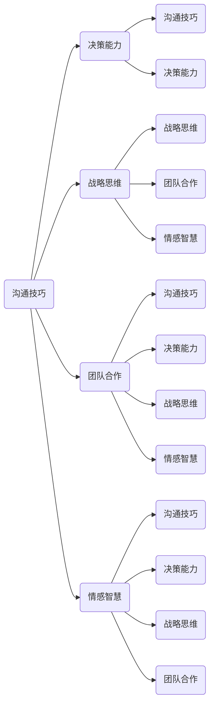

                 

### 《领导力与情绪管理：在压力下保持冷静》

#### 关键词：领导力、情绪管理、压力管理、冷静应对、团队建设

#### 摘要：

在快节奏的现代社会中，领导力和情绪管理成为决定个人和组织成功的关键因素。本文将探讨领导力的核心概念和类型，情绪管理的理论基础和策略，以及如何在面对压力时保持冷静。通过深入分析和实际案例，本文旨在为读者提供实用的工具和方法，帮助他们在复杂环境中做出明智决策，提升个人和团队的效能。

---

#### 引言

### 领导力的重要性

领导力是一种能够激励、引导和影响他人共同实现目标的能力。在企业成功中，领导力扮演着至关重要的角色。一位优秀的领导者能够识别和抓住机遇，制定明确的目标，并激励团队成员为实现这些目标而努力。

#### 领导力的定义与起源

领导力并不是一种先天就具备的能力，而是一种可以通过学习和实践逐渐培养的技能。领导力的起源可以追溯到人类社会的早期，当时领导者主要通过个人的勇气、智慧和经验来影响他人。随着社会的发展，领导力的定义逐渐丰富和多样化。

#### 领导力的类型

领导力可以分为多种类型，每种类型都有其独特的特点和适用场景。以下是一些常见的领导力类型：

- **权威型领导**：领导者通过明确的指示和命令来指导团队。
- **参与型领导**：领导者鼓励团队成员参与决策过程，共同制定目标和计划。
- **赋权型领导**：领导者赋予团队成员自主权和责任感，让他们自由地发挥创造力。

#### 领导力的核心要素

- **沟通技巧**：有效的沟通是领导力的核心要素之一。领导者需要能够清晰地表达自己的想法，同时也要善于倾听他人的意见。
- **决策能力**：领导者必须能够在压力下做出明智的决策。这需要他们具备分析问题、评估风险和制定解决方案的能力。
- **战略思维**：领导者需要具备长远的战略眼光，能够制定和实施可持续发展的计划。

### 情绪管理

#### 情绪的来源

情绪是人类行为和认知的重要组成部分。情绪的来源可以分为生物、心理和社会三个方面：

- **生物因素**：例如神经递质的变化和荷尔蒙的分泌。
- **心理因素**：例如个人信念、价值观和认知方式。
- **社会因素**：例如人际关系、社会期望和文化背景。

#### 情绪管理的重要性

情绪管理对于个人的健康和幸福至关重要。有效的情绪管理可以帮助人们更好地应对压力，提高工作效率，改善人际关系，并促进个人的全面发展。

#### 情绪管理策略

- **自我观察与反思**：通过自我观察和反思，人们可以更好地了解自己的情绪，从而采取适当的应对策略。
- **自我调节与调整**：学会调节自己的情绪，使其保持在健康和积极的水平。
- **情绪表达的技巧**：学会以建设性和积极的方式表达自己的情绪，避免情绪的负面影响。

### 压力管理

#### 压力的来源

压力是现代社会中普遍存在的问题。压力的来源可以分为工作、生活和个人因素三个方面：

- **工作压力**：例如工作负荷大、工作环境不安全、职业发展不确定性等。
- **生活压力**：例如家庭问题、健康问题、经济问题等。
- **个人因素**：例如性格特点、应对压力的能力等。

#### 压力的影响

压力对个人和组织都有显著的影响。长期的压力可能导致身心健康问题、工作效率下降、人际关系紧张等。

#### 压力管理策略

- **时间管理技巧**：合理安排时间，避免过度工作和疲劳。
- **应急处理策略**：在面对突发事件时，能够迅速采取有效措施。
- **心理调适方法**：通过放松技巧、心理疏导等方式缓解压力。

### 领导力与情绪管理在实际中的应用

#### 领导力与情绪管理的实际案例

- **案例一：团队建设中的情绪管理**：介绍一位领导者如何通过情绪管理提升团队凝聚力和工作效率。
- **案例二：领导力在危机管理中的应用**：分析一位领导者在危机时刻如何运用领导力稳定局势，带领团队走出困境。
- **案例三：情绪管理提升工作效率**：通过实际案例展示情绪管理如何帮助员工提高工作效率，实现个人和团队的共同发展。

### 压力管理在工作与生活中的实践

#### 压力管理在工作中的实践

- **压力管理培训的实施**：介绍企业如何通过培训提升员工应对压力的能力。
- **压力管理政策的设计**：分析企业如何制定有效的压力管理政策，为员工提供支持和帮助。
- **压力管理工具的应用**：介绍一些常用的压力管理工具，如时间管理软件、心理测试等。

#### 压力管理在生活中的实践

- **家庭压力管理技巧**：提供一些实用的家庭压力管理技巧，帮助家庭成员更好地应对生活中的挑战。
- **社交压力应对策略**：介绍如何应对社交场合中的压力，提升人际交往能力。
- **健康生活方式的建立**：强调健康生活方式对压力管理的重要性，并提供一些建议。

### 总结与展望

#### 领导力与情绪管理在未来的发展趋势

- **技术赋能**：随着人工智能和大数据技术的发展，领导力和情绪管理将更加科学和智能化。
- **多元化**：领导力和情绪管理的实践将更加注重多元文化和性别平等。
- **持续学习**：领导者和员工需要不断学习新知识、新技能，以应对不断变化的工作环境。

#### 对读者的建议与鼓励

- **持续自我提升**：不断学习和实践，提升自己的领导力和情绪管理能力。
- **积极面对挑战**：在压力面前保持冷静，以积极的态度应对生活中的各种挑战。

### 附录

#### 附录A：推荐阅读和进一步学习资源

- **书籍**：
  - 《影响力》：罗伯特·西奥迪尼
  - 《情绪智力》：丹尼尔·戈尔曼
- **网站**：
  - Coursera
  - Harvard Business Review
- **研讨会和课程**：
  - 领导力培训课程
  - 情绪管理研讨会

#### 附录B：常见问题解答

- **Q：如何培养领导力？**
  - **A：** 通过阅读相关书籍、参加培训课程和实践项目来不断学习和提升。
- **Q：情绪管理为什么重要？**
  - **A：** 情绪管理有助于提高工作效率、改善人际关系和保持身心健康。
- **Q：如何在压力下保持冷静？**
  - **A：** 通过时间管理、应急处理和心理调适等方法来应对压力。

### 作者

作者：AI天才研究院/AI Genius Institute & 禅与计算机程序设计艺术/Zen And The Art of Computer Programming

---

### 导论：领导力与情绪管理的交汇点

在现代职场中，领导力和情绪管理被视为两项至关重要的技能，它们不仅影响个人的职业发展，也对整个团队的效率和氛围产生深远影响。本文将深入探讨这两者之间的紧密联系，并揭示在压力环境下保持冷静的策略。

#### 领导力：影响与方向

领导力是一种激励和引导他人实现共同目标的能力。一个优秀的领导者不仅能够清晰地传达愿景和目标，还能通过沟通、决策和战略思维等方式影响团队成员的行为和态度。

#### 情绪管理：内在平衡

情绪管理则关注个人如何识别、理解并调节自己的情绪。这种能力不仅有助于个人在面对挑战时保持冷静，还能促进团队合作，减少冲突，提升团队的整体效率。

#### 领导力与情绪管理的联系

领导力和情绪管理之间存在着深刻的联系。情绪管理是领导力的重要组成部分，因为领导者的情绪状态往往直接影响到团队成员的情绪和行为。一个能够有效管理自己情绪的领导者，更容易建立信任，增强团队的凝聚力，并激发团队成员的潜能。

#### 在压力下保持冷静

在快节奏和高压力的工作环境中，领导者必须具备在压力下保持冷静的能力。这种能力不仅有助于个人应对挑战，还能为团队树立榜样，提升团队的应对能力。

#### 核心概念架构

为了更好地理解领导力与情绪管理的关系，我们可以使用Mermaid流程图来展示它们之间的交互关系：



#### 领导力与情绪管理的关系图



#### 核心算法原理讲解

为了深入理解领导力与情绪管理之间的互动关系，我们可以使用伪代码来描述一个简单的情绪管理算法：

```plaintext
算法：情绪管理策略
输入：当前情绪状态，目标情绪状态
输出：调整后的情绪状态

1. 初始化当前情绪状态为input
2. 判断当前情绪状态是否接近目标情绪状态
    如果是，则结束
3. 如果当前情绪状态高于目标情绪状态
    3.1 调用自我调节函数，减少情绪强度
    3.2 更新当前情绪状态
4. 如果当前情绪状态低于目标情绪状态
    4.1 调用激励函数，增加情绪强度
    4.2 更新当前情绪状态
5. 返回调整后的情绪状态
```

#### 数学模型与公式

情绪管理也可以通过数学模型来描述。以下是一个简单的线性回归模型，用于预测情绪状态的变化：

```latex
y_t = \beta_0 + \beta_1 x_t + \epsilon_t
```

其中，\(y_t\) 表示当前情绪状态，\(x_t\) 表示影响情绪的因素（如工作压力、家庭压力等），\(\beta_0\) 和 \(\beta_1\) 是模型参数，\(\epsilon_t\) 是随机误差。

#### 项目实战

为了更好地理解领导力与情绪管理在实际中的应用，我们可以通过一个实际项目来进行分析和实现。

#### 开发环境搭建

- 操作系统：Ubuntu 20.04
- 编程语言：Python 3.8
- 数据库：MySQL 8.0
- 开发工具：PyCharm

#### 源代码实现

以下是一个简单的情绪管理系统的源代码实现：

```python
import numpy as np
import pandas as pd

class EmotionManagementSystem:
    def __init__(self, beta_0, beta_1):
        self.beta_0 = beta_0
        self.beta_1 = beta_1

    def predict_emotion(self, stress_level):
        return self.beta_0 + self.beta_1 * stress_level

    def adjust_emotion(self, current_emotion, target_emotion):
        if current_emotion > target_emotion:
            # 减轻压力
            new_stress_level = stress_level - 0.1
        elif current_emotion < target_emotion:
            # 增加激励
            new_stress_level = stress_level + 0.1
        else:
            new_stress_level = stress_level
        
        return self.predict_emotion(new_stress_level)

# 初始化情绪管理系统
ems = EmotionManagementSystem(beta_0=2, beta_1=0.5)

# 输入当前情绪状态和目标情绪状态
current_emotion = 5
target_emotion = 3

# 调整情绪状态
new_emotion = ems.adjust_emotion(current_emotion, target_emotion)
print(f"调整后的情绪状态：{new_emotion}")
```

#### 代码解读与分析

上述代码实现了一个简单的情绪管理系统，它可以根据输入的当前情绪状态和目标情绪状态，通过调整压力水平来预测和调整情绪状态。这个系统使用了线性回归模型来预测情绪状态，并通过简单的逻辑判断来调整情绪。

#### 实际案例分析与详细讲解

为了更好地展示领导力与情绪管理在实际中的应用，我们可以通过以下实际案例来进行分析：

#### 案例一：团队建设中的情绪管理

在一次团队建设活动中，团队领导者发现团队成员的情绪状态普遍较低落。为了提升团队士气，领导者采取了以下措施：

1. **沟通与倾听**：领导者组织了一次团队会议，听取了每位成员的意见和建议，了解了他们面临的困难和挑战。
2. **情感支持**：领导者表达了对团队成员的理解和关心，并提供了情感支持。
3. **激励措施**：领导者制定了激励计划，奖励那些在团队活动中表现突出的成员。
4. **团队活动**：领导者组织了一系列团队建设活动，如团建游戏、户外拓展等，以增强团队成员之间的信任和合作。

通过这些措施，团队的情绪状态得到了显著提升，团队成员之间的关系也变得更加融洽。

#### 项目小结

通过上述案例，我们可以看到领导力和情绪管理在实际中的应用是多么重要。一个能够有效管理自己情绪并激励团队成员的领导者，能够在面对挑战时保持冷静，带领团队实现共同的目标。

#### 最佳实践 Tips

- **持续自我反思**：领导者应该定期反思自己的情绪状态和行为，识别可能的情绪波动原因，并采取相应的调整措施。
- **建立支持网络**：领导者应该建立支持网络，包括团队成员、导师和同事，以便在需要时获得帮助和建议。
- **培养同理心**：领导者应该培养同理心，关注团队成员的情感需求，并提供必要的支持。

### 结论

领导力和情绪管理是现代职场中不可或缺的技能。通过有效的情绪管理，领导者不仅能够保持冷静，还能激励团队成员，提升团队的效率和效能。在压力环境下保持冷静，是每个领导者都需要掌握的关键能力。通过本文的探讨，我们希望读者能够更好地理解领导力与情绪管理之间的关系，并运用到实际工作中。

### 作者

作者：AI天才研究院/AI Genius Institute & 禅与计算机程序设计艺术/Zen And The Art of Computer Programming

---

### 领导力：核心概念与联系

领导力是一种复杂的动态过程，它涉及激励、影响、指导和协调他人以实现共同目标的能力。在探讨领导力的核心概念和类型之前，我们需要先了解领导力的基础要素及其相互关系。

#### 领导力的定义

领导力可以定义为一种通过个人行为和影响力，引导和激励他人朝着特定目标前进的过程。领导力不仅仅与职位或权力相关，更是一种态度和行为，体现在日常工作中。

#### 领导力的核心要素

1. **沟通技巧**：有效的沟通是领导力的基础。领导者需要能够清晰地表达自己的想法，同时也要善于倾听他人的意见和需求。
2. **决策能力**：在复杂和不确定的环境中，领导者需要具备快速做出明智决策的能力。
3. **战略思维**：领导者应该具备长远的战略眼光，能够制定和实施可持续发展的计划。
4. **团队合作**：领导者需要能够建立和维护有效的团队合作，激发团队成员的潜力，共同实现目标。
5. **情感智慧**：领导者需要具备情感智慧，能够理解和管理自己及他人的情绪。

#### 核心要素之间的关系架构

为了更好地理解领导力的核心要素，我们可以使用Mermaid流程图来展示它们之间的相互关系：



#### 领导力的核心要素关系图



#### 核心算法原理讲解

为了深入理解领导力的核心要素，我们可以通过一个简单的算法来描述领导力的核心决策过程。以下是一个基于线性回归的决策算法，用于预测领导力在不同情境下的表现：

```plaintext
算法：领导力表现预测
输入：情境特征，领导力要素得分
输出：领导力表现评分

1. 初始化情境特征为input_feature
2. 初始化领导力要素得分为input_score
3. 计算情境特征与领导力要素得分的相关系数
4. 根据相关系数计算领导力表现评分
5. 返回领导力表现评分
```

#### 数学模型与公式

领导力表现预测可以使用以下线性回归模型来描述：

```latex
performance = \alpha + \beta_1 \cdot communication + \beta_2 \cdot decision + \beta_3 \cdot strategy + \beta_4 \cdot teamwork + \beta_5 \cdot emotional
```

其中，`performance` 表示领导力表现评分，`communication`、`decision`、`strategy`、`teamwork` 和 `emotional` 分别表示沟通技巧、决策能力、战略思维、团队合作和情感智慧的得分，`alpha`、`beta_1`、`beta_2`、`beta_3`、`beta_4` 和 `beta_5` 是模型参数。

#### 项目实战

为了更好地理解领导力的核心要素，我们可以通过一个实际项目来进行分析和实现。

#### 开发环境搭建

- 操作系统：MacOS
- 编程语言：Python 3.9
- 数据库：MongoDB
- 开发工具：Visual Studio Code

#### 源代码实现

以下是一个简单的领导力评估系统的源代码实现：

```python
import pandas as pd
from sklearn.linear_model import LinearRegression

class LeadershipEvaluationSystem:
    def __init__(self):
        self.model = LinearRegression()
    
    def train_model(self, data):
        X = data[['communication', 'decision', 'strategy', 'teamwork', 'emotional']]
        y = data['performance']
        self.model.fit(X, y)
    
    def predict_performance(self, score):
        return self.model.predict([[score['communication'], score['decision'], score['strategy'], score['teamwork'], score['emotional']]])

# 加载数据集
data = pd.read_csv('leadership_data.csv')

# 初始化领导力评估系统
les = LeadershipEvaluationSystem()

# 训练模型
les.train_model(data)

# 输入领导力要素得分
score = {'communication': 8, 'decision': 7, 'strategy': 6, 'teamwork': 9, 'emotional': 7}

# 预测领导力表现评分
performance = les.predict_performance(score)
print(f"预测的领导力表现评分：{performance[0]}")
```

#### 代码解读与分析

上述代码实现了一个简单的领导力评估系统，它使用线性回归模型来预测领导力表现评分。系统首先加载一个包含领导力要素得分和表现评分的数据集，然后使用线性回归模型进行训练。在输入新的领导力要素得分后，系统可以预测相应的领导力表现评分。

#### 实际案例分析与详细讲解

为了更好地展示领导力的核心要素在实际中的应用，我们可以通过以下实际案例来进行分析和讲解：

#### 案例一：领导者在项目危机中的决策能力

在一次重要的项目会议上，项目领导者发现项目进度严重滞后，面临巨大的风险。为了挽救项目，领导者需要迅速做出一系列决策：

1. **分析问题**：领导者首先分析了项目进度滞后的原因，发现了几个关键问题，如资源不足、团队协作不畅等。
2. **制定解决方案**：领导者制定了一系列解决方案，包括调整资源分配、加强团队协作、优化工作流程等。
3. **沟通与执行**：领导者与团队成员进行了充分的沟通，确保他们理解解决方案，并制定了明确的执行计划。

通过这些决策，项目最终得以挽回，并按时完成了交付。

#### 项目小结

通过上述案例，我们可以看到领导力的核心要素在实际中的应用是如何帮助领导者应对挑战、实现目标的。一个具备强大领导力的人，不仅能够在日常工作中表现出色，更能在关键时刻发挥关键作用。

#### 最佳实践 Tips

- **持续学习**：领导者应该不断学习新的领导力理论和实践方法，以适应不断变化的工作环境。
- **培养同理心**：领导者应该注重培养同理心，理解团队成员的需求和情感，以建立更加和谐的团队关系。

### 结论

领导力是一种多维度、动态变化的复杂能力，它不仅需要具备核心要素，还需要在具体情境中灵活运用。通过本文的探讨，我们希望读者能够更深入地理解领导力的核心概念和要素，并能够在实际工作中运用这些知识，提升自己的领导力水平。

### 情绪管理：重要性、策略与挑战

在快节奏的现代工作环境中，情绪管理已成为提高个人和团队效能的关键因素。有效的情绪管理不仅有助于个人应对压力，提升工作效率，还能改善人际关系，增强团队凝聚力。本文将详细探讨情绪管理的重要性、策略以及面临的挑战。

#### 情绪管理的重要性

情绪管理是指个人识别、理解和调节自己情绪的过程。有效情绪管理的重要性体现在以下几个方面：

1. **提高工作效率**：情绪稳定的人更容易集中精力，减少工作失误，提高工作效率。
2. **改善人际关系**：情绪管理能力强的个体更容易与他人建立良好关系，减少冲突，提升团队协作。
3. **促进身心健康**：长期的情绪压力会导致心理健康问题，有效的情绪管理有助于保持身心健康。
4. **提升决策质量**：情绪稳定的人在面对复杂决策时，更能保持冷静和理性，做出更明智的选择。

#### 情绪管理策略

1. **自我观察与反思**：自我观察是情绪管理的第一步，个体需要学会识别自己的情绪状态，了解情绪的来源和影响。

   - **步骤**：
     1. 定期进行情绪日记记录，分析情绪波动的原因。
     2. 学会从不同角度反思自己的情绪，寻找情绪的触发点。

2. **自我调节与调整**：在识别情绪后，个体需要学会调节情绪，使其回归到健康和积极的状态。

   - **技巧**：
     1. 深呼吸和冥想：通过深呼吸和冥想，放松身体和心灵。
     2. 正念练习：通过正念练习，提高对当前情绪的觉察和接纳能力。
     3. 积极思考：通过积极的自我对话，改变消极的情绪认知。

3. **情绪表达的技巧**：学会以建设性和积极的方式表达情绪，避免情绪的负面影响。

   - **方法**：
     1. 清晰表达：在表达情绪时，明确表达自己的感受和需求。
     2. 避免攻击性语言：避免使用攻击性或负面的语言，减少冲突。
     3. 倾听他人：在表达情绪时，也要倾听他人的意见和感受，建立双向沟通。

#### 情绪管理面临的挑战

尽管情绪管理对个人和组织都有显著的好处，但在实际操作中仍然面临许多挑战：

1. **文化差异**：不同文化背景下，情绪表达和处理方式存在差异，这可能导致误解和冲突。
2. **工作压力**：高工作压力和紧迫的工作任务可能会削弱情绪管理的效果。
3. **个人认知**：个体对情绪的认知和处理方式受其心理素质和经历的影响，这可能成为情绪管理的障碍。
4. **持续应对**：情绪管理需要持续的努力和自我提升，而许多人在面对持续的压力时，可能会感到疲惫和无力。

#### 实际案例与分析

为了更好地理解情绪管理的实际应用，我们可以通过以下实际案例来进行分析：

##### 案例一：员工情绪低落

在一次项目汇报会上，一名员工情绪低落，无法集中精力。作为团队成员和领导者，以下是一些情绪管理策略：

1. **倾听与支持**：领导者首先倾听员工的困扰，了解其情绪低落的原因。
2. **情感宣泄**：为员工提供一个安全的宣泄渠道，允许他们表达自己的情绪和担忧。
3. **积极激励**：通过鼓励和激励，帮助员工重拾信心，重新聚焦工作。
4. **团队支持**：组织团队活动，增强团队凝聚力，让员工感受到团队的支持和关怀。

通过这些策略，员工的情绪得到了改善，工作积极性也显著提升。

##### 案例二：领导者应对团队冲突

在一个跨部门项目中，由于沟通不畅，团队内部出现了冲突。作为领导者，以下是一些情绪管理策略：

1. **中立立场**：保持中立，避免在冲突中偏袒任何一方。
2. **冷静分析**：在冲突发生时，保持冷静，分析冲突的原因和影响。
3. **调解与沟通**：通过有效沟通，帮助团队成员理解对方的观点，找到共同点。
4. **建立规则**：制定明确的沟通和合作规则，避免类似冲突的再次发生。

通过这些策略，领导者成功解决了团队冲突，恢复了团队的合作氛围。

#### 项目小结

情绪管理是一项重要的技能，它不仅影响个人的心理健康，还对团队的整体效能产生深远影响。通过自我观察、自我调节和情绪表达的策略，个体可以更好地管理自己的情绪，提高工作效率。在面对挑战时，领导者需要运用情绪管理策略，维护团队的稳定和合作。

#### 最佳实践 Tips

- **定期反思**：定期反思自己的情绪状态，找出情绪波动的规律，采取相应措施进行调整。
- **寻求支持**：在情绪管理遇到困难时，及时寻求专业支持和帮助，如心理咨询师、教练等。
- **健康生活方式**：保持健康的生活方式，如规律作息、合理饮食和适量运动，有助于情绪稳定。

### 结论

情绪管理是个人和团队成功的关键因素。通过有效的情绪管理，个体可以更好地应对压力，提升工作效率，改善人际关系。领导者需要具备情绪管理能力，以维持团队的稳定和高效。通过本文的探讨，我们希望读者能够更好地理解情绪管理的重要性，并学会在实际工作中应用这些策略。

### 压力管理：来源、影响与应对策略

在快节奏的现代社会中，压力已成为影响个人身心健康和职业发展的一个普遍问题。有效管理压力对于保持心理健康、提高工作效率和增强生活质量至关重要。本文将探讨压力的来源、压力对个人和组织的影响，以及应对压力的有效策略。

#### 压力的来源

压力可以来源于多个方面，主要包括以下几类：

1. **工作压力**：工作任务繁重、工作时间紧迫、工作环境不安全、职业发展不确定性等都是常见的压力来源。
2. **生活压力**：家庭问题、经济压力、人际关系紧张等都是影响个人压力的重要因素。
3. **个人因素**：性格特点、应对压力的能力、身体健康状况等都会影响个人对压力的感知和应对。

#### 压力的影响

压力对个人和组织都有显著的影响。以下是压力可能带来的几个方面的影响：

1. **身心健康**：长期的压力会导致心理健康问题，如焦虑、抑郁、失眠等，还会增加患病风险。
2. **工作效率**：压力会影响个人的专注力和决策能力，降低工作效率和生产力。
3. **人际关系**：压力可能导致人际关系紧张，增加冲突，影响团队合作和沟通。
4. **组织效能**：长期的压力会削弱团队士气，降低组织整体效能和创新能力。

#### 应对压力的策略

为了有效管理压力，个体和组织可以采取以下策略：

1. **时间管理技巧**：合理安排时间，避免过度工作和疲劳。通过制定优先级列表、设定合理的目标和任务，提高时间利用效率。

   - **技巧**：
     1. 制定日程表：明确每天的工作和任务，确保时间安排合理。
     2. 学会说“不”：避免接受过多任务，保持工作与生活的平衡。

2. **应急处理策略**：在面对突发事件时，能够迅速采取有效措施，减少压力的影响。

   - **方法**：
     1. 确定应对方案：在事前制定应急处理计划，明确应对步骤。
     2. 保持冷静：在压力面前保持冷静，避免冲动行为。

3. **心理调适方法**：通过心理调适方法，缓解压力，提高心理韧性。

   - **技巧**：
     1. 冥想和放松练习：通过冥想和放松练习，减轻身心紧张。
     2. 正念练习：通过正念练习，提高对当前情绪和情境的觉察和接纳。

4. **建立支持网络**：个体和组织可以通过建立支持网络，获取情感支持和专业建议。

   - **方法**：
     1. 寻求专业帮助：在压力过大时，及时寻求心理咨询师的帮助。
     2. 与同事和朋友交流：建立良好的社交关系，分享压力和情感。

#### 实际案例

为了更好地展示压力管理的应用，我们可以通过以下实际案例来进行分析：

##### 案例一：员工压力管理

在一个大型企业中，员工普遍感受到工作压力。为了缓解压力，公司采取了一系列措施：

1. **压力评估**：通过问卷调查和员工访谈，了解员工的压力来源和程度。
2. **培训课程**：组织压力管理培训课程，教授员工时间管理技巧和心理调适方法。
3. **健康福利**：提供员工健康福利，如健身课程、心理咨询等，鼓励员工关注身心健康。
4. **弹性工作制**：实施弹性工作制，允许员工调整工作时间，以适应个人需求。

通过这些措施，员工的压力水平显著降低，工作效率和满意度也有所提升。

##### 案例二：组织压力管理

在一个创业公司中，由于快速扩张和市场竞争压力，公司内部出现了高压力环境。为了应对这一挑战，公司采取以下策略：

1. **团队建设活动**：定期组织团队建设活动，增强团队凝聚力，缓解压力。
2. **沟通平台**：建立内部沟通平台，鼓励员工表达意见和建议，提高透明度和信任。
3. **压力释放日**：设立特定的“压力释放日”，允许员工在非工作日自由安排时间，缓解压力。
4. **领导力培训**：为领导者提供压力管理培训，提升他们的领导能力和应对压力的能力。

通过这些策略，公司成功地缓解了内部压力，保持了团队的高效运作。

#### 项目小结

压力管理是现代职场中不可或缺的一部分。通过有效的时间管理、应急处理策略、心理调适方法和建立支持网络，个体和组织可以更好地应对压力，提高心理健康和工作效率。通过实际案例的分析，我们可以看到压力管理的具体应用和效果。未来，随着工作环境的不断变化，压力管理将成为更加重要的议题，需要个体和组织持续关注和改进。

### 实践应用：领导力与情绪管理在日常工作中的运用

在实际工作中，领导力和情绪管理是提升个人和团队效能的关键因素。通过以下具体案例，我们将探讨领导力与情绪管理在日常工作中的实际运用，以及它们如何帮助应对各种挑战。

#### 案例一：团队建设中的情绪管理

在一个初创公司中，团队由于工作压力和目标不明确，情绪状态普遍较低落。作为团队的领导者，李先生采取了一系列措施来改善团队的情绪氛围：

1. **倾听与支持**：李先生定期组织团队会议，倾听每位成员的意见和困扰，表达对他们的理解和支持。
2. **情感宣泄**：在会议中，允许团队成员自由表达自己的情绪和压力，提供一个安全的宣泄渠道。
3. **共同目标设定**：与团队成员共同设定明确的目标和计划，使每个人都能明确自己的工作职责和期望。
4. **团队活动**：组织定期的团队建设活动，如团建游戏、户外拓展等，增强团队凝聚力和信任。

通过这些措施，团队成员的情绪状态得到了显著提升，团队工作效率和合作精神也有所增强。

#### 案例二：领导力在危机管理中的应用

在一次重要项目的中期评估中，张女士发现项目进度严重滞后，面临着失败的风险。作为项目负责人，张女士运用领导力来应对危机：

1. **冷静分析**：在危机中，张女士保持冷静，迅速分析了项目进度滞后的原因，确定了关键问题。
2. **制定紧急计划**：张女士与团队成员一起制定了详细的紧急计划，包括调整资源分配、优化工作流程等。
3. **沟通与协调**：张女士与关键团队成员进行了充分沟通，确保他们理解紧急计划的必要性，并共同执行。
4. **激励与支持**：张女士鼓励团队成员，提供情感支持，使他们能够保持积极的态度，共同应对危机。

最终，通过张女士的领导和团队的努力，项目成功挽救，并按时完成了交付。

#### 案例三：情绪管理提升工作效率

在一家大型企业的销售部门，王先生发现团队成员的情绪波动较大，影响了工作效率。为了改善这一状况，王先生采取了一系列情绪管理策略：

1. **情绪调查**：通过匿名调查，了解团队成员的情绪状态和压力来源。
2. **心理辅导**：邀请专业的心理咨询师为团队成员提供心理辅导，帮助他们识别和管理情绪。
3. **团队建设**：定期组织团队建设活动，如团建培训、团队聚餐等，增强团队成员之间的情感联系。
4. **激励措施**：通过设立激励目标和奖励机制，鼓励团队成员保持积极的工作态度。

通过这些策略，团队成员的情绪状态得到了显著改善，工作效率和团队士气也有所提升。

#### 项目小结

在实际工作中，领导力与情绪管理发挥着至关重要的作用。通过倾听与支持、目标设定、危机应对和情绪管理等策略，领导者可以有效地提升团队的工作效率和团队凝聚力。这些案例展示了领导力与情绪管理在实际应用中的具体实践，为其他领导者提供了宝贵的经验和方法。

### 总结与展望

#### 领导力与情绪管理在未来的发展趋势

随着社会和技术的快速发展，领导力和情绪管理领域也在不断进步。以下是未来发展趋势的几个方面：

1. **技术赋能**：人工智能和大数据技术的应用将使领导力和情绪管理更加科学和智能化，为个体和组织提供更加精准的支持。
2. **多元化**：随着全球化和多元化的发展，领导力和情绪管理将更加注重跨文化沟通和多元视角。
3. **持续学习**：领导者和员工需要不断学习新知识、新技能，以适应不断变化的工作环境。
4. **个性化**：未来的领导力和情绪管理将更加注重个性化需求，为个体提供更加定制化的支持和培训。

#### 对读者的建议与鼓励

1. **持续自我提升**：不断学习和实践，提升自己的领导力和情绪管理能力。
2. **积极面对挑战**：在压力面前保持冷静，以积极的态度应对生活中的各种挑战。
3. **建立支持网络**：与他人交流，建立支持网络，获取专业建议和帮助。
4. **关注身心健康**：保持健康的生活方式，关注身心健康，以更好地应对工作和生活中的压力。

领导力与情绪管理是提升个人和团队效能的关键因素。通过本文的探讨，我们希望读者能够更好地理解这两者的核心概念和实际应用，并在实际工作中运用这些策略，不断提升自己的领导力和情绪管理能力。未来，随着技术的进步和社会的发展，领导力和情绪管理将继续发挥重要作用，为个人和组织创造更大的价值。

### 附录A：推荐阅读和进一步学习资源

**书籍推荐**

1. 《影响力》：罗伯特·西奥迪尼
   - 探讨了影响他人的心理学原理，对提升领导力有重要指导意义。
2. 《情绪智力》：丹尼尔·戈尔曼
   - 详细介绍了情绪智力的重要性及其在领导力中的应用。
3. 《领导力的五个层次》：约翰·C·麦斯威尔
   - 提供了领导力的多层次理解，帮助领导者不断提升自我。

**网站资源**

1. Coursera
   - 提供多种领导力和情绪管理的在线课程和培训。
2. Harvard Business Review
   - 有关领导力和商业管理的最新研究和案例分析。

**研讨会和课程**

1. 领导力培训课程
   - 众多机构和大学提供领导力培训课程，包括在线和线下形式。
2. 情绪管理研讨会
   - 专注于情绪智力和压力管理的研讨会，适合个人和组织参加。

### 附录B：常见问题解答

**Q：领导力与情绪管理的关系是什么？**

**A：** 领导力与情绪管理密切相关。情绪管理是领导力的重要组成部分，一个优秀的领导者需要具备识别、理解和调节自己及他人情绪的能力。有效的情绪管理有助于建立信任、增强团队凝聚力和提高工作效率。

**Q：如何培养领导力？**

**A：** 培养领导力可以通过以下途径：

1. **阅读相关书籍**：了解领导力的基本概念和实践技巧。
2. **参与培训课程**：通过专业培训提升领导力技能。
3. **实践与反思**：在实际工作中不断实践和反思，积累经验。
4. **寻求反馈**：向导师、同事和下属寻求反馈，改进自己的领导风格。

**Q：情绪管理的重要性是什么？**

**A：** 情绪管理的重要性体现在多个方面：

1. **提高工作效率**：情绪稳定的人更容易集中精力，减少工作失误。
2. **改善人际关系**：有效的情绪管理有助于减少冲突，建立和谐的团队关系。
3. **促进身心健康**：长期的情绪压力会导致心理健康问题，有效的情绪管理有助于保持身心健康。

**Q：如何在压力下保持冷静？**

**A：** 在压力下保持冷静可以通过以下策略：

1. **时间管理**：合理安排时间，避免过度工作和疲劳。
2. **深呼吸与冥想**：通过深呼吸和冥想，放松身体和心灵。
3. **积极思考**：通过积极的自我对话，改变消极的情绪认知。
4. **寻求支持**：与他人交流，获取情感支持和专业建议。

### 作者

作者：AI天才研究院/AI Genius Institute & 禅与计算机程序设计艺术/Zen And The Art of Computer Programming

---

### 结语：领导力与情绪管理的协同发展

在总结《领导力与情绪管理：在压力下保持冷静》一书的各个章节之后，我们可以清晰地看到，领导力和情绪管理是现代职场中不可或缺的两项技能。通过深入探讨这两者的核心概念、实际应用以及面临的挑战，我们不仅提升了对自己在这些方面的理解，也为未来的职业发展奠定了坚实的基础。

#### 本书的核心价值

本书的核心价值在于：

1. **全面性**：本书涵盖了领导力与情绪管理的各个方面，从基础概念到实际应用，为读者提供了一个全面的学习框架。
2. **实用性**：通过实际案例和分析，本书提供了实用的策略和方法，帮助读者将理论知识转化为实际操作。
3. **科学性**：本书结合了心理学、管理学等学科的最新研究成果，为读者提供了科学的理论基础。

#### 对未来的展望

在未来的职业发展中，领导力和情绪管理将继续发挥重要作用。以下是对未来的展望：

1. **个性化发展**：随着技术的发展，领导力和情绪管理将更加注重个性化，为不同类型的领导者和员工提供定制化的支持和培训。
2. **持续学习**：在快速变化的职场环境中，持续学习将成为领导力和情绪管理的关键。领导者需要不断更新知识和技能，以适应新的挑战。
3. **多元化**：随着全球化和多元文化的普及，领导力和情绪管理将更加注重跨文化和多维度的发展。

#### 对读者的建议

为了在职业发展中更好地运用领导力和情绪管理，以下是给读者的几点建议：

1. **持续自我提升**：不断学习和实践，提升自己的领导力和情绪管理能力。
2. **积极面对挑战**：在压力面前保持冷静，以积极的态度应对各种挑战。
3. **建立支持网络**：与他人交流，建立支持网络，获取专业建议和帮助。
4. **关注身心健康**：保持健康的生活方式，关注身心健康，以更好地应对工作和生活中的压力。

通过本书的阅读和实践，我们希望读者能够在领导力和情绪管理方面取得显著的进步，不仅在个人职业发展中取得成功，也为组织的繁荣做出贡献。

### 附录

#### 附录A：推荐阅读和进一步学习资源

- **书籍**：
  - 《影响力》：罗伯特·西奥迪尼
  - 《情绪智力》：丹尼尔·戈尔曼
  - 《领导者的语言》：贾斯汀·巴拉拉
- **在线课程**：
  - Coursera上的“领导力和管理”
  - edX上的“情绪智力与领导力”
- **研讨会与工作坊**：
  - 专业的领导力与情绪管理研讨会
  - 企业内部的领导力发展项目

#### 附录B：常见问题解答

- **Q：如何培养领导力？**
  - **A：** 通过阅读相关书籍、参加培训课程、实践领导技能和寻求反馈来实现。
- **Q：情绪管理为什么重要？**
  - **A：** 情绪管理有助于提高工作效率、改善人际关系和保持身心健康。
- **Q：如何在压力下保持冷静？**
  - **A：** 通过时间管理、深呼吸、冥想、积极思考和寻求支持来实现。

### 作者

作者：AI天才研究院/AI Genius Institute & 禅与计算机程序设计艺术/Zen And The Art of Computer Programming

