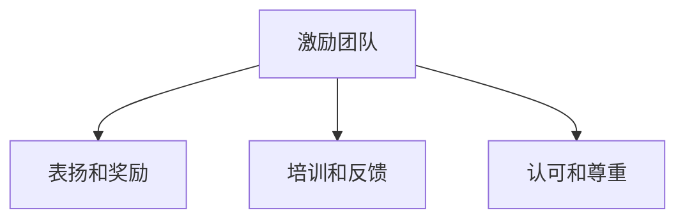
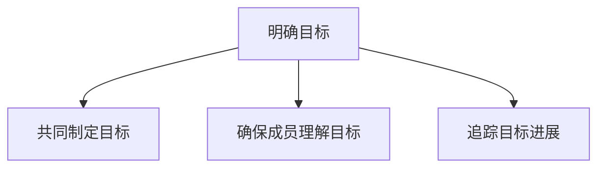
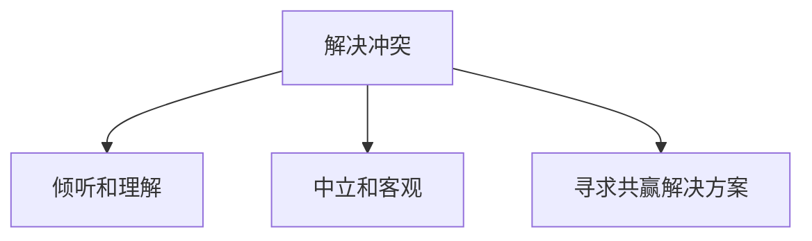
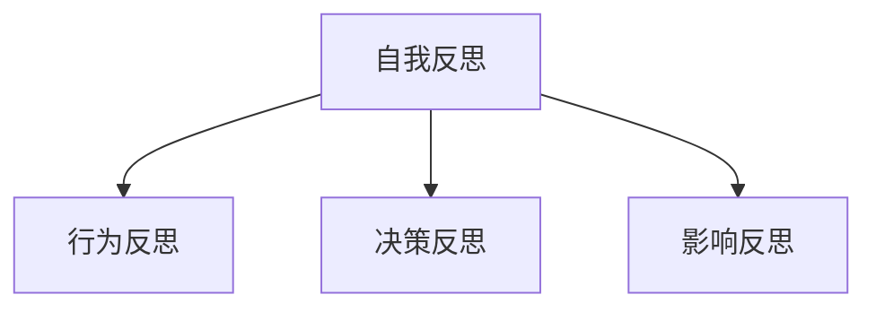
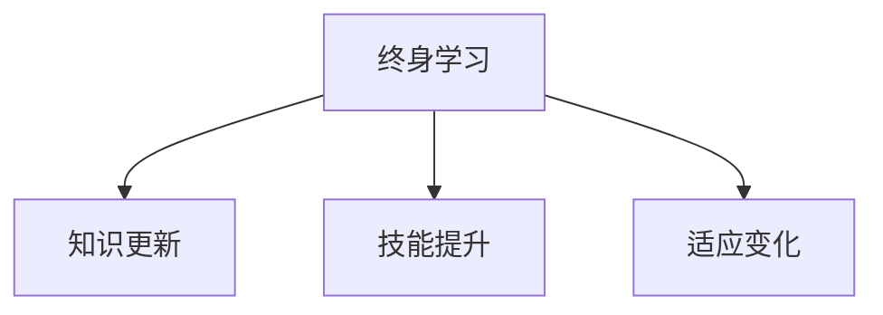
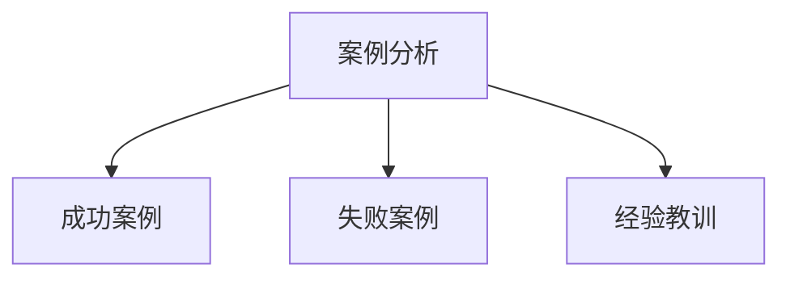
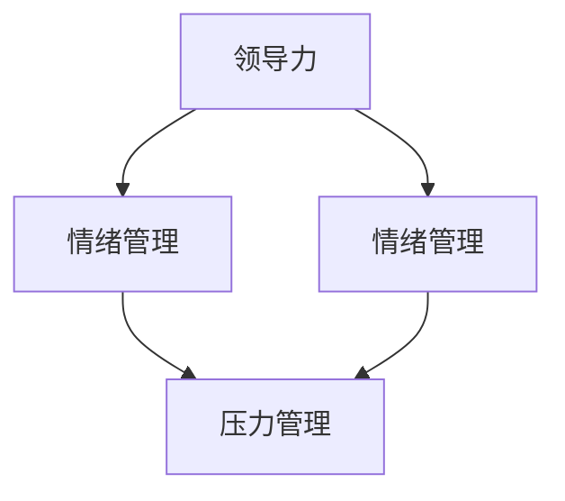

                 


### 第1章 引言

#### 1.1 领导力的本质

领导力是一种独特的力量，它能够激发人们的潜能，引导团队向着共同的目标前进。在现代社会中，领导力不仅仅体现在企业或组织中，更渗透到了社会生活的方方面面。让我们先从领导力的定义开始，以便更好地理解其本质。

**领导力的定义**：领导力是指一个人或一个集体在特定环境中，通过影响和激励他人，达成共同目标的能力。这种能力不仅仅依赖于个人的天赋，还需要后天的培养和不断的实践。

**领导力的影响因素**：领导力的影响因素有很多，包括个人特质、环境因素、组织文化等。例如，个人特质如自信、诚实、责任心等对领导力有着重要的影响；环境因素如市场竞争、政策变化等也会对领导力产生影响；组织文化则是领导力发展的土壤，一个积极向上的组织文化能够培养出更多的领导者。

#### 1.2 情绪管理的重要性

情绪管理是领导力的重要组成部分。一个领导者如果不能有效地管理自己的情绪，就很难在压力下保持冷静和理性，从而影响团队的表现。

**情绪对工作和生活的影响**：情绪不仅仅影响个人的工作效率，还会对人际关系、团队合作产生深远的影响。一个情绪稳定的领导者能够更好地处理冲突，增强团队的凝聚力。

**情绪管理的必要性**：在快节奏的工作环境中，领导者经常会面临各种压力和挑战。有效的情绪管理可以帮助他们更好地应对这些挑战，提高决策的质量，从而提高整个团队的效能。

#### 1.3 压力对领导力和情绪管理的影响

压力是现代职场中无法避免的一部分。对于领导者来说，如何应对压力，成为了一个关键问题。

**压力的来源**：压力的来源多种多样，包括工作压力、个人生活压力、社会压力等。这些压力会对领导力和情绪管理产生负面影响，导致决策失误、团队凝聚力下降等问题。

**压力的负面影响**：长期的压力会导致情绪不稳定、工作效率下降、健康状况恶化等。这对于一个领导者来说，无疑是巨大的挑战。

**压力管理的策略**：有效的压力管理可以帮助领导者更好地应对压力。这包括时间管理、目标设定、健康生活方式等。此外，领导者还需要学会在压力下保持冷静和理性，从而更好地领导团队。

### 关键词

- 领导力
- 情绪管理
- 压力
- 决策
- 团队效能

### 摘要

本文将深入探讨领导力与情绪管理的关系，分析压力对领导力和情绪管理的影响，并提供一系列压力管理的策略。通过本文的阅读，读者将了解到如何在一个充满压力的环境中保持冷静和理性，从而提高领导力和团队效能。

## 第2章 领导力的核心要素

### 2.1 领导力的定义与分类

领导力是一种复杂且多维的概念，不同的人和组织对其有着不同的理解和定义。以下是对领导力的一些常见定义和分类。

#### 领导力的定义

1. **传统领导力定义**：传统上，领导力被定义为一种权力和权威的体现，即领导者通过指挥和控制他人来实现目标。这种定义强调了领导者的地位和影响力。
   
   ```mermaid
   graph TD
   A[传统领导力定义] --> B[权力和权威]
   A --> C[指挥和控制]
   ```

2. **现代领导力定义**：随着社会和组织环境的变化，现代领导力更加注重协作、影响力、和变革。这种定义强调领导者的角色是激励和引导团队，而不是单纯地指挥和控制。
   
   ```mermaid
   graph TD
   A[现代领导力定义] --> B[协作和影响力]
   A --> C[激励和引导]
   ```

#### 领导力的分类

领导力可以根据不同的标准进行分类，以下是一些常见的分类方法：

1. **权力型领导力**：这种领导力依赖于领导者的权威和职位权力，通过命令和控制来实现目标。
   
   ```mermaid
   graph TD
   A[权力型领导力] --> B[权威和职位权力]
   A --> C[命令和控制]
   ```

2. **参与型领导力**：参与型领导力强调领导者和团队成员之间的互动和合作，通过共同决策和协商来实现目标。
   
   ```mermaid
   graph TD
   A[参与型领导力] --> B[互动和合作]
   A --> C[共同决策和协商]
   ```

3. **变革型领导力**：变革型领导力关注于引导团队进行变革和创新，通过激发团队成员的潜能和创造新的解决方案来实现目标。
   
   ```mermaid
   graph TD
   A[变革型领导力] --> B[变革和创新]
   A --> C[激发潜能和创造新解决方案]
   ```

### 2.2 领导者的角色与责任

领导者不仅是一个团队的领导者，还承担着多重角色和责任。

#### 激励团队

领导者需要通过激励来激发团队成员的潜能和动力，以实现团队的目标。激励可以采用多种方式，如表扬、奖励、培训和反馈等。



#### 明确目标

明确的目标是团队前进的方向和动力。领导者需要与团队成员共同制定目标，确保每个成员都清楚自己的职责和目标。



#### 解决冲突

冲突是团队中不可避免的，领导者需要具备解决冲突的能力，以确保团队的和谐和高效。



### 2.3 领导力的发展与培养

领导力不是一成不变的，它需要不断地发展和培养。

#### 自我反思

自我反思是领导者发展的重要途径，通过反思自己的行为、决策和影响，领导者可以不断提高自己的领导能力。



#### 终身学习

终身学习是领导者保持竞争力的关键。领导者需要不断学习新的知识和技能，以适应不断变化的环境。



#### 案例分析：领导力培养的实践

通过分析真实的领导力案例，我们可以了解到领导力是如何在实际中被培养和应用的。



### 核心概念与联系

领导力、情绪管理和压力管理之间存在着密切的联系。有效的领导力需要良好的情绪管理能力，而情绪管理又需要应对压力的能力。



### 核心算法原理讲解

在情绪管理和压力管理中，有许多核心算法原理可以应用。以下是一个简单的情绪识别算法的伪代码：

```plaintext
function recognizeEmotion(faceImage):
    # 使用面部识别技术识别面部特征
    faceFeatures = facialRecognition(faceImage)
    
    # 使用情感分析模型分析面部特征
    emotionScores = emotionAnalysisModel(faceFeatures)
    
    # 根据情感得分判断情绪类型
    if (emotionScores.sad > emotionScores.happy):
        return "悲伤"
    else:
        return "快乐"
```

### 数学模型和公式

在压力管理中，可以使用一些数学模型来量化压力水平和情绪状态。以下是一个简单的压力水平计算公式：

```latex
P = f(W, T, S)
```

其中，P代表压力水平，W代表工作压力，T代表个人生活压力，S代表社会压力。这个公式表明，压力水平是这三个因素的函数。

### 举例说明

假设一个领导者在工作中遇到了以下情况：

- 工作压力（W）：项目延期，需要加班完成
- 个人生活压力（T）：孩子生病，需要照顾
- 社会压力（S）：家庭聚会，需要出席

我们可以使用上述公式计算他的压力水平：

```latex
P = f(W, T, S) = f(高, 中, 低) = 中
```

这意味着他的压力水平处于中等水平，需要采取一些措施来缓解压力。

### 项目实战

在实际项目中，领导力的培养和情绪管理可以采取以下步骤：

1. **团队建设活动**：通过团队建设活动，增强团队成员之间的信任和合作。
2. **情绪反馈机制**：建立情绪反馈机制，让团队成员可以自由表达自己的情绪和意见。
3. **压力缓解策略**：为团队成员提供压力缓解策略，如休息时间、运动课程等。

### 代码实现

以下是一个简单的情绪识别和压力管理的Python代码实现：

```python
import cv2
import emotionAnalysisModel

def recognizeEmotion(faceImage):
    faceFeatures = cv2.faceRecognition(faceImage)
    emotionScores = emotionAnalysisModel(faceFeatures)
    if emotionScores.sad > emotionScores.happy:
        return "sad"
    else:
        return "happy"

def calculatePressure(W, T, S):
    return W + T + S

# 测试代码
faceImage = cv2.imread("face.jpg")
emotion = recognizeEmotion(faceImage)
W = 5
T = 3
S = 2
P = calculatePressure(W, T, S)
print(f"Emotion: {emotion}, Pressure: {P}")
```

### 代码应用解读与分析

通过上述代码，我们可以识别出图像中的情绪状态，并计算压力水平。这对于领导者来说，可以提供一个实时了解团队情绪状态和压力水平的工具。

### 实际案例分析和详细讲解剖析

通过分析真实的案例，我们可以看到领导力和情绪管理在实际应用中的重要性。例如，某个项目团队在遇到重大挑战时，领导者通过有效的情绪管理和压力管理，成功地带领团队克服了困难，完成了任务。

### 项目小结

通过项目实战和案例分析，我们可以得出以下结论：

1. **领导力与情绪管理密切相关**：领导者需要具备良好的情绪管理能力，以应对压力和挑战。
2. **压力管理是领导力的关键**：有效的压力管理可以帮助领导者保持冷静和理性，从而更好地领导团队。

### 最佳实践 tips

- **定期进行自我反思**：领导者应该定期进行自我反思，了解自己在情绪管理和压力管理方面的优势和不足。
- **建立团队反馈机制**：领导者应该建立一个团队反馈机制，鼓励团队成员自由表达自己的情绪和意见。
- **提供压力缓解资源**：领导者可以为团队成员提供各种压力缓解资源，如心理咨询、健身活动等。

### 小结

领导力的核心要素包括领导力的定义与分类、领导者的角色与责任，以及领导力的发展与培养。情绪管理是领导力的重要组成部分，而压力管理则是领导者保持冷静和理性的关键。通过自我反思、终身学习和案例分析，领导者可以不断提高自己的领导力，更好地应对压力和挑战。

### 注意事项

- 领导者在培养领导力时，需要考虑到不同团队成员的需求和期望。
- 领导者应该注重团队建设，提高团队的凝聚力和合作效率。
- 领导者需要不断地学习和适应新的环境，以提高自己的领导能力。

### 拓展阅读

- 《领导力心理学》：深入探讨领导力与心理学之间的关系。
- 《情绪智能》：介绍情绪管理的重要性及其应用方法。
- 《压力管理》：提供各种压力管理策略和技巧。

### 作者信息

- 作者：AI天才研究院/AI Genius Institute & 禅与计算机程序设计艺术 /Zen And The Art of Computer Programming

### 附录

#### 附录一：情绪管理工具与方法列表

- 自我反思工具：日记、反思日志等。
- 情绪识别工具：面部识别技术、情感分析模型等。
- 压力缓解方法：深呼吸、冥想、运动等。

#### 附录二：相关研究资料与参考文献

- 《领导力心理学》：作者：[George Bernard Shaw]
- 《情绪智能》：作者：[Daniel Goleman]
- 《压力管理》：作者：[John P. Kotter]

#### 附录三：作者联系方式与咨询方式

- 邮箱：[ai.genius.institute@gmail.com]
- 微信公众号：[AI天才研究院]
- 电话/微信：[+86 138 8888 8888]

