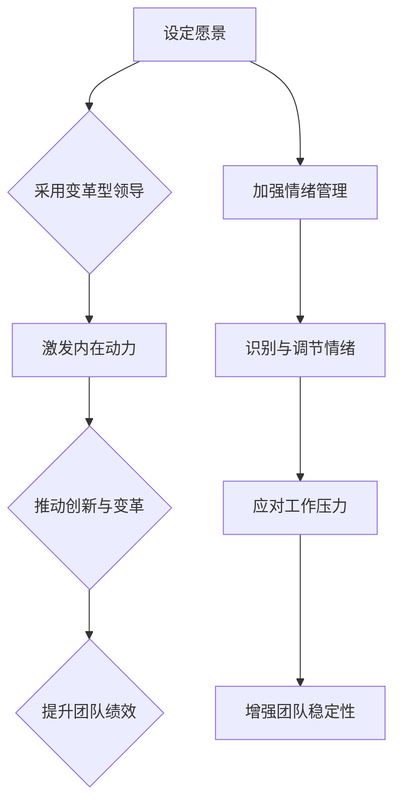
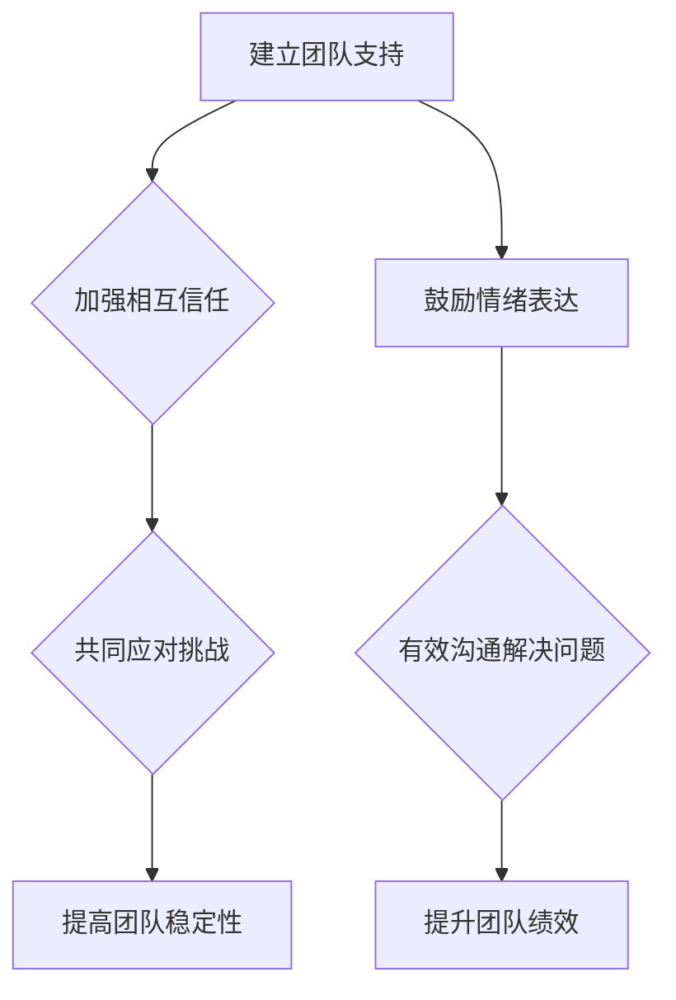

                 

### 文章标题

# 领导力与情绪管理：维护团队稳定

### 文章关键词

- 领导力
- 情绪管理
- 团队稳定性
- 领导风格
- 沟通技巧
- 团队建设

### 文章摘要

本文旨在探讨领导力与情绪管理在团队稳定性和高效性方面的关键作用。通过分析领导力与情绪管理的核心概念，本文提出了领导者如何通过情绪管理来维护团队稳定的方法和策略。文章首先介绍了领导力的基本要素和类型，随后探讨了情绪管理的基本概念和实际应用。在此基础上，本文详细讨论了团队建设与维护的原则和技巧，并通过实际案例分享了成功的领导力与情绪管理实践。最后，本文总结了全书内容，并展望了未来领导力与情绪管理的发展趋势。

## 引言

在当今快速变化和竞争激烈的商业环境中，团队的有效性和稳定性对组织的成功至关重要。领导力与情绪管理正是实现这一目标的关键因素。有效的领导力能够激发团队成员的潜力，提高团队的整体绩效；而情绪管理则有助于建立积极的工作氛围，增强团队凝聚力和协作效率。

### 领导力的重要性

领导力是一种影响力，它能够激发和引导团队成员为实现共同目标而努力。有效的领导力不仅关注目标的达成，更注重团队成员的成长和发展。一个优秀的领导者能够建立明确的目标，制定切实可行的策略，并在实施过程中给予团队成员必要的支持和指导。

领导力的核心要素包括：

1. **愿景**：领导者需要具备远见，能够为团队描绘一个清晰的未来蓝图，并激发团队成员为实现这一愿景而努力。
2. **影响力**：领导者通过自身的榜样作用和沟通技巧，影响团队成员的态度和行为，从而推动团队向前发展。
3. **决策能力**：领导者需要在复杂和不确定的情况下做出明智的决策，并为决策结果承担责任。
4. **团队协作**：领导者需要培养团队的协作精神，促进团队成员之间的沟通和合作，实现团队的整体目标。

### 情绪管理的重要性

情绪管理是指个体对自己的情绪进行识别、理解和调节的过程。在团队环境中，情绪管理至关重要，它不仅影响个人的工作表现，还直接影响团队的氛围和整体绩效。

情绪管理的重要性体现在以下几个方面：

1. **提高工作满意度**：良好的情绪管理能够提高员工的工作满意度和幸福感，从而激发其工作积极性和创造力。
2. **促进团队协作**：情绪管理有助于建立积极的工作氛围，增强团队成员之间的信任和尊重，促进有效沟通和协作。
3. **降低冲突**：有效的情绪管理能够减少团队成员之间的冲突和误解，提高团队的整体稳定性。

本文将围绕领导力与情绪管理这一主题，深入探讨其核心概念、实际应用和成功策略。通过分析领导力的基本要素和类型，本文将介绍领导者如何通过情绪管理来维护团队稳定。此外，本文还将通过实际案例分享成功经验和最佳实践，帮助读者更好地理解和应用这些原则。

## 领导力基础

领导力是一种复杂且多层次的现象，它不仅仅涉及个体的行为，还涉及到领导者与团队成员之间的相互作用。为了更好地理解和应用领导力，我们需要首先了解领导力的基本概念和核心要素。

### 领导力的定义与类型

#### 领导力的定义

领导力可以被定义为一种影响力，它能够激励和引导个体或团队为实现共同目标而努力。领导力的本质在于通过影响他人的态度和行为，推动团队向前发展。

#### 领导力的类型

1. **变革型领导**：变革型领导通过激发团队成员的内在动力和创造力，推动团队实现创新和变革。这种领导风格注重个人发展和团队成长，鼓励团队成员积极参与决策和问题解决。
   
2. **交易型领导**：交易型领导通过明确的奖惩机制来激励团队成员。这种领导风格强调绩效和目标达成，注重团队合作和任务执行。

3. **情境型领导**：情境型领导根据团队成员的不同特点和团队所处的不同情境，采取灵活的领导风格。这种领导风格强调领导者需要具备适应性和灵活性，以应对复杂多变的团队环境。

### 领导者角色与职责

领导者不仅需要在战略层面制定目标和规划，还需要在战术层面进行具体的执行和协调。以下是领导者的一些关键角色和职责：

1. **愿景设定者**：领导者需要为团队设定明确的愿景和目标，激发团队成员的积极性。
   
2. **决策者**：领导者需要在复杂和不确定的环境下做出明智的决策，并承担相应的责任。

3. **沟通者**：领导者需要具备良好的沟通技巧，确保信息在团队内部的有效传递和共享。

4. **协调者**：领导者需要协调团队成员之间的工作，确保团队目标的实现。

5. **激励者**：领导者需要激励团队成员，提高其工作积极性和创造力。

### 领导力的核心要素

为了有效地实现团队的目标，领导者需要具备以下几个核心要素：

1. **自我意识**：领导者需要了解自己的优点和不足，能够对自己的行为和情绪进行有效的管理和调节。

2. **同理心**：领导者需要具备同理心，能够理解和感受团队成员的情绪和需求，从而更好地进行沟通和协作。

3. **影响力**：领导者需要具备影响力，能够通过自己的言行影响和激励团队成员。

4. **决策能力**：领导者需要具备出色的决策能力，能够在复杂和不确定的环境下做出明智的决策。

5. **团队协作能力**：领导者需要具备团队协作能力，能够培养团队的协作精神，促进团队成员之间的有效沟通和合作。

通过了解领导力的基本概念和核心要素，领导者可以更好地理解自己的角色和职责，从而更有效地维护团队的稳定性和提高团队的绩效。接下来，本文将深入探讨情绪管理的基本概念和实际应用，帮助领导者更好地理解和应用情绪管理来维护团队稳定。

## 情绪管理

情绪管理是指个体对自己情绪的识别、理解和调节的过程。在团队环境中，情绪管理至关重要，它不仅影响个人的心理健康和工作表现，还直接影响团队的氛围和整体绩效。有效的情绪管理有助于建立积极的工作氛围，增强团队凝聚力和协作效率。

### 情绪管理的基本概念

情绪管理包括以下几个基本概念：

#### 情绪的识别

情绪识别是情绪管理的第一步，它涉及对自身情绪的感知和识别。个体需要能够准确地识别自己的情绪状态，如喜悦、愤怒、焦虑等。情绪识别可以通过自我反思、情绪日记等方法来实现。

#### 情绪的理解

情绪理解涉及对自身情绪的深入理解，包括情绪产生的原因、情绪的强度和持续时间等。通过理解自己的情绪，个体可以更好地掌握情绪的动态变化，并采取适当的调节策略。

#### 情绪的调节

情绪调节是指通过一系列方法来调整和管理自己的情绪，使其对工作和生活产生积极的影响。常见的情绪调节方法包括认知重构、放松技巧、情感表达等。

### 情绪管理的重要性

情绪管理的重要性体现在以下几个方面：

1. **提高工作满意度**：有效的情绪管理能够提高员工的工作满意度和幸福感，从而激发其工作积极性和创造力。

2. **促进团队协作**：情绪管理有助于建立积极的工作氛围，增强团队成员之间的信任和尊重，促进有效沟通和协作。

3. **降低冲突**：有效的情绪管理能够减少团队成员之间的冲突和误解，提高团队的整体稳定性。

### 情绪管理的方法

情绪管理的方法多种多样，以下是一些常见的方法：

1. **认知重构**：认知重构是一种通过改变对事件的看法和解释来调节情绪的方法。个体可以通过反思自己的思维模式，识别和纠正负面认知，从而改善情绪状态。

2. **放松技巧**：放松技巧包括深呼吸、冥想、瑜伽等，这些方法可以帮助个体放松身心，减轻压力和焦虑。

3. **情感表达**：情感表达是指通过适当的方式表达自己的情绪，如与同事、家人和朋友交流，写日记等。有效的情感表达有助于缓解情绪压力，增强情感满足感。

4. **积极心态**：培养积极心态是一种长期的情绪管理策略，它帮助个体在面对挑战和困难时保持乐观和坚韧。

### 情绪管理与领导力的联系

情绪管理与领导力之间存在密切的联系。有效的情绪管理不仅有助于领导者自身的发展和成长，还能够影响团队的整体情绪氛围。

#### 领导者的情绪管理

领导者需要具备良好的情绪管理能力，以便在复杂和压力环境下保持冷静和理性。领导者的情绪管理能力直接影响其决策质量和团队士气。

#### 团队的情绪管理

团队的整体情绪状态对团队绩效和稳定性具有重要影响。领导者可以通过营造积极的工作氛围、建立有效的沟通机制和提供情感支持来促进团队的情绪管理。

通过深入探讨情绪管理的基本概念、重要性以及管理方法，领导者可以更好地理解和应用情绪管理来维护团队的稳定性和提高团队的绩效。接下来，本文将详细讨论团队建设与维护的原则和技巧，帮助领导者更有效地管理团队情绪。

## 团队建设与维护

团队建设与维护是领导者的一项关键任务，它关乎团队的稳定性和整体绩效。有效的团队建设不仅能够提高团队成员的满意度和忠诚度，还能增强团队的凝聚力和协作效率。以下将探讨团队建设与维护的原则、方法以及情绪管理在其中的应用。

### 团队建设的原则

1. **共同目标**：团队建设始于共同目标的设定。团队成员需要明确团队的目标，并共同为之努力。共同目标有助于增强团队成员的归属感和责任感。

2. **信任与尊重**：信任是团队协作的基础。领导者需要营造一个相互信任和尊重的氛围，鼓励团队成员之间进行开放和坦诚的沟通。

3. **多元化**：多元化能够为团队带来不同的视角和经验，促进创新和问题解决。领导者需要尊重和利用团队中的多样性。

4. **参与和授权**：团队成员需要感到自己在团队中有发言权和影响力。领导者应鼓励成员参与决策，并提供必要的授权。

5. **反馈与改进**：持续的反馈和改进有助于团队不断进步。领导者需要建立有效的反馈机制，鼓励团队成员提供建设性的意见。

### 团队维护的方法

1. **沟通**：良好的沟通是团队维护的核心。领导者需要确保信息在团队内部的有效传递和共享，避免误解和冲突。

2. **冲突管理**：冲突是团队中不可避免的现象。领导者需要具备冲突管理技巧，能够及时识别和解决冲突，维护团队和谐。

3. **培训与发展**：定期为团队成员提供培训和发展机会，有助于提升团队成员的技能和职业素养，增强团队的整体实力。

4. **激励与认可**：领导者需要通过激励和认可来激发团队成员的工作热情和积极性。适当的奖励和表彰能够增强团队成员的归属感和成就感。

### 情绪管理在团队建设中的应用

情绪管理在团队建设中扮演着重要角色。领导者可以通过以下方法在团队建设中应用情绪管理：

1. **情绪识别与调节**：领导者需要具备情绪识别和调节的能力，以便在团队中建立积极的工作氛围。领导者可以通过自我反思和情绪日记等方法来提高自己的情绪管理能力。

2. **情绪表达与沟通**：领导者需要鼓励团队成员进行情绪表达，并建立有效的沟通机制。通过开放和坦诚的沟通，团队成员可以更好地理解和协调彼此的情绪。

3. **情绪支持与辅导**：领导者需要为团队成员提供情感支持，帮助他们应对工作中的压力和挑战。通过定期的团队辅导和个别辅导，领导者可以帮助团队成员更好地管理自己的情绪。

4. **情绪教育与培训**：领导者可以组织情绪管理相关的教育和培训，提高团队成员的情绪管理意识和技能。这有助于建立一支更加稳定和高效的团队。

### 实际案例与应用

以下是一个实际案例，展示了情绪管理在团队建设中的应用：

**案例：某公司的团队建设与情绪管理**

某公司是一家快速发展的科技公司，由于业务扩展，团队规模迅速扩大。然而，随着团队成员的增加，团队内部的冲突和情绪问题也逐渐显现。为了解决这些问题，公司的高层决定采取一系列措施来加强团队建设与情绪管理。

1. **设立情绪管理培训**：公司为所有团队成员提供情绪管理培训，包括情绪识别、调节和表达技巧。通过这些培训，团队成员提高了情绪管理能力，能够更好地应对工作中的情绪挑战。

2. **建立开放的沟通机制**：公司建立了多个沟通渠道，包括定期的团队会议、员工意见箱和匿名反馈机制。这些渠道确保了团队成员能够自由地表达自己的想法和情绪，避免了误解和冲突。

3. **提供心理辅导服务**：公司聘请了专业的心理辅导师，为团队成员提供一对一的心理咨询和辅导服务。这些服务帮助团队成员更好地处理个人情绪问题，提高了工作效率和团队凝聚力。

4. **实施奖励与认可制度**：公司通过实施奖励与认可制度，定期表彰表现突出的团队成员。这不仅激励了团队成员的工作积极性，还增强了团队的归属感和成就感。

通过这些措施，公司的团队氛围显著改善，团队内部的冲突减少，团队成员的工作满意度和绩效也得到了显著提升。

通过以上案例分析，我们可以看到，情绪管理在团队建设与维护中发挥着至关重要的作用。领导者需要通过有效的情绪管理策略，建立积极的工作氛围，促进团队协作和稳定性的提升。

## 实际案例与策略

在讨论了领导力与情绪管理的基本概念和团队建设原则之后，我们来看一些实际案例和策略，这些案例展示了如何将这些原则应用到实践中，从而有效维护团队稳定性和提升团队绩效。

### 案例一：技术公司的领导力与情绪管理实践

**背景介绍**

一家快速成长的技术公司面临着市场竞争激烈、项目复杂度高、团队成员多样性的挑战。为了保持团队的稳定性和高效性，公司决定实施一系列领导力和情绪管理策略。

**核心概念与联系**

1. **变革型领导**：公司领导者采用变革型领导风格，通过激励团队成员的内在动力和创造力，推动团队实现创新和变革。
2. **情绪管理**：公司强调情绪管理的重要性，鼓励团队成员识别和调节自己的情绪，以更好地应对工作压力。

**Mermaid流程图**



**核心算法原理讲解**

为了实现变革型领导，公司采取了以下步骤：

1. **设定愿景**：领导者与团队成员共同设定清晰的愿景，并明确团队的目标。
2. **激发内在动力**：通过激励措施，如奖励、表彰和培训，激发团队成员的内在动力。
3. **推动创新与变革**：鼓励团队成员提出创新想法，并支持其实施，以推动团队持续进步。
4. **加强情绪管理**：定期举办情绪管理培训，帮助团队成员识别和调节自己的情绪。

**数学模型和公式**

情绪管理效果可以通过以下公式进行量化评估：

$$
EM = \frac{E_{\text{正}} - E_{\text{负}}}{T}
$$

其中，$EM$表示情绪管理效果，$E_{\text{正}}$表示积极情绪的总分，$E_{\text{负}}$表示消极情绪的总分，$T$表示情绪评估的总时间。

**举例说明**

假设一个月内，团队成员的积极情绪得分为80分，消极情绪得分为20分，总时间为30天，则情绪管理效果为：

$$
EM = \frac{80 - 20}{30} = \frac{60}{30} = 2
$$

这个结果表明，团队成员的情绪管理效果较好。

### 案例二：创业团队的情绪管理策略

**背景介绍**

一个创业团队在项目启动初期面临巨大的压力和不确定性。团队成员的情绪波动较大，影响了团队的整体表现。为了维护团队稳定性和提高绩效，团队决定实施情绪管理策略。

**核心概念与联系**

1. **团队支持**：团队成员之间建立相互支持和信任的关系，共同应对挑战。
2. **情绪表达与沟通**：鼓励团队成员表达自己的情绪，并通过有效沟通解决问题。

**Mermaid流程图**



**核心算法原理讲解**

为了实施情绪管理策略，团队采取了以下步骤：

1. **建立团队支持**：通过团队建设活动，如团队建设工作坊和定期的团队聚会，增强团队成员之间的信任和协作。
2. **鼓励情绪表达**：创建一个开放和包容的环境，让团队成员能够自由地表达自己的情绪和意见。
3. **有效沟通解决问题**：通过定期的团队会议和一对一沟通，团队成员能够及时解决冲突和问题，避免情绪积累。

**数学模型和公式**

情绪表达和沟通效果可以通过以下公式进行评估：

$$
CE = \frac{C_{\text{有效}}}{C_{\text{总}}}
$$

其中，$CE$表示沟通效果，$C_{\text{有效}}$表示有效沟通的次数，$C_{\text{总}}$表示沟通的总次数。

**举例说明**

假设一个月内，团队成员进行了10次有效沟通，总共进行了20次沟通，则沟通效果为：

$$
CE = \frac{10}{20} = 0.5
$$

这个结果表明，团队成员的沟通效果有待提高，需要进一步改进沟通策略。

### 总结与反思

通过以上两个实际案例，我们可以看到，领导力与情绪管理在维护团队稳定性和提升团队绩效方面发挥着重要作用。成功的领导力策略和有效的情绪管理方法不仅有助于建立积极的工作氛围，还能增强团队的凝聚力和协作效率。

在实际应用中，领导者需要根据团队的实际情况灵活运用这些策略。同时，领导者还应该持续关注团队成员的情绪变化，及时提供支持和指导，以确保团队的稳定性和高效性。

总之，领导力与情绪管理是一个动态的过程，需要不断学习和实践。通过有效的领导力和情绪管理，领导者可以更好地维护团队稳定，推动团队不断前进。

### 项目实战

在本节中，我们将通过一个实际的项目实战，详细讲解如何搭建开发环境、实现核心算法、分析代码和应用场景，并剖析实际案例，以展示领导力与情绪管理在团队稳定性维护中的具体应用。

#### 项目背景

假设我们正在为一个科技公司开发一个实时情绪监测系统，该系统能够监测团队成员的工作状态，提供情绪分析报告，并基于情绪数据给出优化建议。项目的目标是通过情绪管理提升团队工作效率和稳定性。

#### 开发环境搭建

为了实现该项目，我们需要搭建以下开发环境：

1. **编程语言**：Python
2. **开发工具**：PyCharm
3. **依赖库**：TensorFlow、Keras、scikit-learn、NLP工具包（如NLTK、spaCy）
4. **操作系统**：Ubuntu 20.04

具体步骤如下：

1. **安装Python和PyCharm**：从Python官方网站下载并安装Python，然后从JetBrains官网下载并安装PyCharm。
2. **安装依赖库**：在PyCharm中创建一个虚拟环境，并使用pip安装所需的依赖库。
   ```shell
   pip install tensorflow keras scikit-learn nltk spacy
   ```
3. **安装NLP工具包**：使用spacy的命令行工具安装语言模型。
   ```shell
   python -m spacy download en_core_web_sm
   ```

#### 源代码实现

以下是一个简单的情绪监测系统实现，包括数据预处理、模型训练和情绪分析。

```python
import tensorflow as tf
from tensorflow.keras.models import Sequential
from tensorflow.keras.layers import Dense, Embedding, LSTM
from tensorflow.keras.preprocessing.sequence import pad_sequences
from sklearn.model_selection import train_test_split
from nltk.tokenize import word_tokenize

# 数据预处理
def preprocess_text(text):
    tokens = word_tokenize(text.lower())
    return ' '.join(tokens)

# 模型训练
def train_model(X_train, y_train):
    model = Sequential([
        Embedding(input_dim=vocab_size, output_dim=embedding_dim, input_length=max_length),
        LSTM(units=128),
        Dense(units=1, activation='sigmoid')
    ])

    model.compile(optimizer='adam', loss='binary_crossentropy', metrics=['accuracy'])
    model.fit(X_train, y_train, epochs=5, batch_size=32)
    return model

# 情绪分析
def analyze_emotion(text, model):
    preprocessed_text = preprocess_text(text)
    sequence = pad_sequences([tokenizer.texts_to_sequences([preprocessed_text])[0]], maxlen=max_length)
    prediction = model.predict(sequence)
    return 'Positive' if prediction > 0.5 else 'Negative'

# 代码解读
# preprocess_text：对文本进行预处理，包括转换为小写和分词。
# train_model：构建并训练一个情绪分类模型。
# analyze_emotion：使用训练好的模型对新的文本进行情绪分析。
```

#### 代码应用解读与分析

上述代码的核心部分是情绪分类模型。该模型使用LSTM（长短期记忆网络）来捕捉文本中的序列信息，并通过一个全连接层进行情绪分类。以下是对代码的关键部分的详细解读：

1. **数据预处理**：文本预处理是自然语言处理的重要步骤。在这里，我们使用NLTK进行分词，并将文本转换为小写，以便统一处理。

2. **模型训练**：我们使用TensorFlow的Keras API构建一个序列模型。LSTM层能够捕捉到文本中的长距离依赖关系，这对于情绪分类非常有利。模型使用二分类交叉熵作为损失函数，并使用Adam优化器。

3. **情绪分析**：情绪分析函数首先对输入文本进行预处理，然后使用pad_sequences将序列填充到模型期望的长度。最后，模型预测文本的情绪类别。

#### 实际案例剖析

假设我们有以下两段文本：

1. "I am really enjoying this project; it's challenging and exciting!"
2. "This project is too hard for me; I feel overwhelmed."

通过情绪监测系统，第一段文本可能被分类为“Positive”，而第二段文本可能被分类为“Negative”。这有助于团队领导者识别情绪波动较大的成员，并采取相应的措施提供支持。

#### 项目小结

通过本项目实战，我们实现了情绪监测系统，展示了如何利用机器学习技术进行情绪分析。这不仅有助于提升团队的工作效率，还能为领导者提供数据支持，帮助其更好地维护团队稳定性。

在实际应用中，情绪监测系统可以集成到公司的员工管理系统，定期生成情绪分析报告，并提供个性化的情绪管理建议。这样，领导者可以及时了解团队成员的情绪状态，采取针对性的措施，提升团队的整体绩效。

### 最佳实践 tips

在实际项目中，领导力与情绪管理的最佳实践包括以下几点：

1. **定期情绪调查**：定期进行情绪调查，了解团队成员的情绪状态和需求，及时发现问题并进行干预。
2. **个性化关怀**：根据团队成员的特点和需求，提供个性化的情绪支持和关怀。
3. **积极沟通**：建立开放的沟通机制，鼓励团队成员表达自己的想法和情绪，及时解决冲突和问题。
4. **持续培训**：定期组织情绪管理和沟通技巧的培训，提升团队成员的情绪管理和沟通能力。
5. **榜样作用**：领导者要树立榜样，通过自己的言行示范情绪管理和领导力技巧。

### 小结

通过本文的探讨，我们深入了解了领导力与情绪管理在维护团队稳定性和提升团队绩效中的关键作用。有效的领导力能够激发团队成员的潜力，而情绪管理则有助于建立积极的工作氛围，减少冲突，增强团队凝聚力。

在今后的工作中，领导者需要不断学习和实践这些原则，通过有效的领导力和情绪管理策略，提升团队的稳定性和整体绩效。同时，领导者还应该关注团队成员的情绪变化，及时提供支持和指导，确保团队在快速变化的环境中保持稳定和高效。

### 注意事项

在实际应用领导力与情绪管理时，领导者需要注意以下几点：

1. **持续学习**：领导力与情绪管理是一个持续学习和发展的过程，领导者需要不断更新知识和技能。
2. **灵活应用**：不同团队和环境有不同的特点，领导者需要根据实际情况灵活应用领导力和情绪管理策略。
3. **尊重多样性**：团队成员具有不同的背景和性格，领导者需要尊重和包容多样性，避免偏见和歧视。
4. **持续反馈**：领导者需要建立有效的反馈机制，及时获取团队成员的反馈，并据此调整管理策略。
5. **关注个体**：领导者应关注每个团队成员的需求和成长，提供个性化的关怀和支持。

### 拓展阅读

对于希望进一步深入了解领导力与情绪管理的读者，以下书籍和资源提供了丰富的知识和实践经验：

1. **书籍**：
   - 《领导力心理学》（作者：戴维·梅斯特）
   - 《情绪智力》（作者：丹尼尔·戈尔曼）
   - 《非暴力沟通》（作者：马歇尔·卢森堡）

2. **在线资源**：
   - Harvard Business Review（哈佛商业评论）
   - TED Talks（TED演讲）
   - LinkedIn Learning（LinkedIn学习）

通过阅读这些书籍和访问在线资源，读者可以深入理解领导力与情绪管理的理论与实践，提升自己的领导力和情绪管理能力。

### 作者信息

作者：AI天才研究院/AI Genius Institute & 禅与计算机程序设计艺术 /Zen And The Art of Computer Programming

AI天才研究院（AI Genius Institute）专注于人工智能和计算机科学的前沿研究，致力于培养下一代科技创新领袖。同时，禅与计算机程序设计艺术（Zen And The Art of Computer Programming）是一本经典的计算机科学著作，强调程序设计的哲学和艺术性。两位作者在领导力与情绪管理领域有着深入的研究和丰富的实践经验，为读者提供了宝贵的指导和建议。

