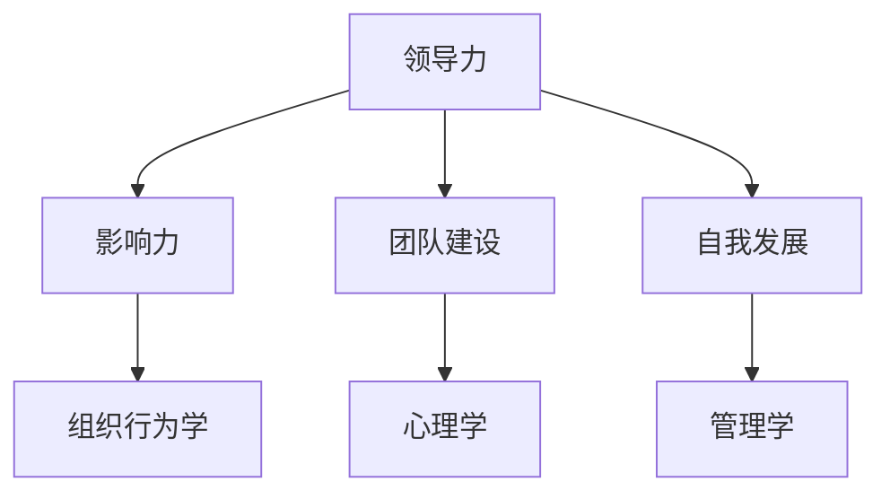
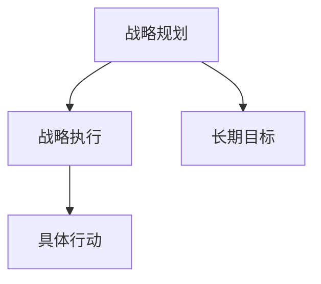
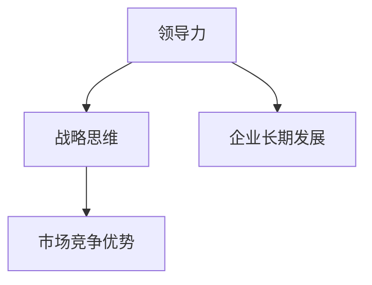
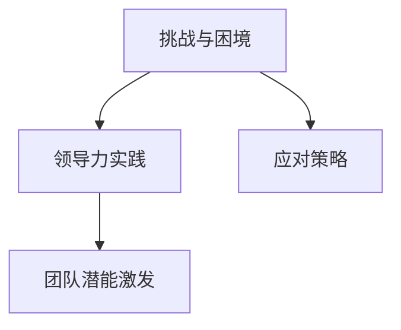
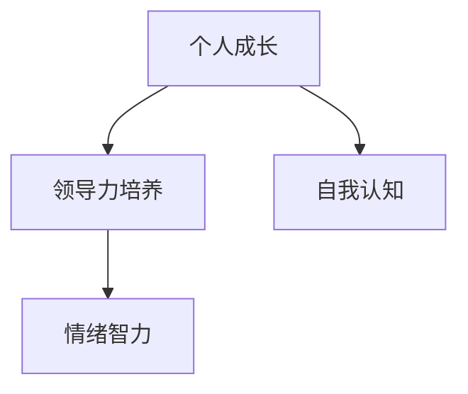

                 


# 领导力与战略思维：培养长远眼光的方法

## 文章关键词
领导力、战略思维、长远眼光、企业高管、项目经理、商学院学生

## 文章摘要
本文将探讨领导力与战略思维的重要性，以及如何培养长远眼光。通过分析领导力的核心概念、战略思维的方法和实际应用案例，我们将深入理解领导力与战略思维之间的联系，并提供实用的方法和技巧，帮助企业高管、项目经理和商学院学生等目标受众提升自身领导力和战略思维。

## 目录
1. 引言
2. 领导力的核心概念
3. 领导风格与团队建设
4. 领导力的自我发展
5. 战略思维方法
6. 战略规划与执行
7. 战略决策与风险评估
8. 战略创新与变革管理
9. 成功企业的领导力与战略思维
10. 挑战与困境中的领导力实践
11. 个人成长与领导力培养
12. 总结
13. 参考文献

## 第一部分：领导力理论

### 第1章：领导力的核心概念

**背景介绍**
领导力是一个广泛的概念，涉及到领导者如何影响、激励和指导团队成员，实现共同的目标。在企业管理中，领导力是组织成功的关键因素之一。

**核心概念与联系**
领导力与组织行为学、心理学、管理学等多个学科领域有密切联系。其中，领导者的影响力、团队建设、自我发展等是领导力的核心概念。

**Mermaid 流程图**


**核心算法原理讲解**
领导力的核心算法原理可以理解为一系列策略和方法，包括沟通技巧、决策能力、团队管理等。

**伪代码**
```plaintext
function 领导力(团队成员):
    1. 沟通与理解团队成员需求
    2. 制定明确的目标和计划
    3. 激励和激励团队成员
    4. 解决冲突和问题
    5. 定期反馈和评估
    6. 不断学习和改进
```

**数学模型和公式**
领导力的数学模型可以理解为领导者与团队成员之间的影响力分配和合作效应。

$$\text{领导力} = f(\text{影响力}, \text{团队建设}, \text{自我发展})$$

**详细讲解与举例说明**
假设一个项目经理需要带领一个开发团队完成一个重要项目。项目经理需要具备以下领导力：
- **影响力**：通过沟通和激励，使团队成员认同项目目标，并积极参与项目。
- **团队建设**：组织团队建设活动，增强团队成员之间的互信和合作。
- **自我发展**：不断提升自己的管理能力和技术能力，为团队提供更好的领导。

**项目实战**
在实际工作中，项目经理需要不断地实践和改进自己的领导力，通过不断的尝试和反思，提高团队的整体绩效。

**代码解读与分析**
在软件开发中，领导力的体现可以通过代码质量和团队协作来衡量。一个优秀的领导者会注重代码的可读性、可维护性和可扩展性，同时鼓励团队成员积极参与代码审查和讨论。

**实际案例分析和详细讲解剖析**
例如，谷歌的创始人拉里·佩奇和谢尔盖·布林在公司的早期就展现了卓越的领导力，他们通过开放沟通、鼓励创新和提供资源支持，成功地带领谷歌成为全球最大的搜索引擎公司。

**项目小结**
通过上述案例分析，我们可以看到领导力在企业管理中的重要性。一个成功的领导者不仅需要具备卓越的领导力，还需要不断学习和改进，以适应不断变化的市场环境。

## 第二部分：战略思维方法

### 第2章：战略规划与执行

**背景介绍**
战略规划是企业为了实现长期目标而制定的一系列计划和行动。战略执行是将战略规划转化为具体行动的过程。

**核心概念与联系**
战略规划与执行是企业战略管理的重要组成部分，它们之间紧密相连，战略规划为战略执行提供了方向和目标，而战略执行则是战略规划的具体落实。

**Mermaid 流程图**


**核心算法原理讲解**
战略规划的核心算法原理可以理解为如何根据企业内外部环境，制定合适的战略目标和实现路径。

**伪代码**
```plaintext
function 战略规划(企业环境):
    1. 分析企业外部环境
    2. 分析企业内部环境
    3. 确定企业长期目标
    4. 制定实现路径
    5. 制定具体行动计划
```

**数学模型和公式**
战略规划的数学模型可以理解为对市场趋势、竞争态势和企业资源等外部因素的综合分析。

$$\text{战略规划} = f(\text{外部环境}, \text{内部环境}, \text{长期目标}, \text{实现路径})$$

**详细讲解与举例说明**
假设一个企业需要制定一个长期战略规划，以应对激烈的市场竞争。企业需要：
- **分析外部环境**：了解市场趋势、消费者需求、竞争对手情况等。
- **分析内部环境**：评估企业资源、核心竞争力、管理团队等。
- **确定长期目标**：如市场份额、收入增长、技术创新等。
- **制定实现路径**：制定具体的行动计划和时间表。
- **制定具体行动计划**：如市场拓展、产品研发、团队建设等。

**项目实战**
在实际工作中，企业需要通过战略规划来指导日常运营，并通过战略执行来确保目标的实现。

**代码解读与分析**
在软件开发中，战略规划可以类比为项目规划，而战略执行则类比为项目实施。一个成功的软件项目经理需要通过战略规划来制定项目目标，并通过战略执行来确保项目的顺利完成。

**实际案例分析和详细讲解剖析**
例如，苹果公司在2007年发布了第一代iPhone，这是公司战略规划的成果。苹果通过分析市场需求、技术创新和用户反馈，制定了以iPhone为核心的战略，并通过战略执行成功地推动了公司的快速发展。

**项目小结**
通过上述案例分析，我们可以看到战略规划与执行在企业管理中的重要性。一个成功的战略规划需要充分考虑内外部环境，并通过有效的战略执行来确保目标的实现。

## 第三部分：实际应用案例

### 第7章：成功企业的领导力与战略思维

**背景介绍**
成功企业往往具备卓越的领导力和战略思维，这使得它们能够在竞争激烈的市场中脱颖而出。

**核心概念与联系**
成功企业的领导力与战略思维是企业长期发展的重要基石，它们相互影响、相互促进。

**Mermaid 流程图**


**核心算法原理讲解**
成功企业的领导力与战略思维的算法原理可以理解为如何通过卓越的领导力和战略思维来提升企业的市场竞争力。

**伪代码**
```plaintext
function 成功企业(领导力, 战略思维):
    1. 建立强大的领导团队
    2. 制定明确的企业愿景和使命
    3. 确定市场定位和核心竞争力
    4. 实施创新和变革
    5. 持续监控和评估市场态势
    6. 调整和优化战略规划
```

**数学模型和公式**
成功企业的数学模型可以理解为对市场机会、竞争态势和企业资源等内部外部因素的综合评估。

$$\text{成功企业} = f(\text{领导力}, \text{战略思维}, \text{市场机会}, \text{竞争态势}, \text{企业资源})$$

**详细讲解与举例说明**
以谷歌为例，谷歌的领导力体现在其创始人拉里·佩奇和谢尔盖·布林的卓越领导才能，他们通过开放沟通、鼓励创新和提供资源支持，带领谷歌成为全球最大的搜索引擎公司。

**项目实战**
谷歌的成功也得益于其战略思维，通过不断的技术创新和产品优化，谷歌在搜索引擎市场占据了主导地位。

**代码解读与分析**
在软件开发领域，谷歌的领导力和战略思维体现在其对技术创新的重视和对开源社区的积极参与。

**实际案例分析和详细讲解剖析**
例如，谷歌在2004年推出了AdWords广告系统，这一创新的产品使得谷歌在广告市场取得了巨大成功。

**项目小结**
通过上述案例分析，我们可以看到成功企业的领导力和战略思维在企业发展中的重要性。一个成功的企业需要具备卓越的领导力和战略思维，以应对市场变化和竞争压力。

## 第四部分：挑战与困境中的领导力实践

### 第8章：挑战与困境中的领导力实践

**背景介绍**
企业在发展过程中难免会遇到各种挑战和困境，如何在这种情况下展现领导力，成为企业持续发展的关键。

**核心概念与联系**
挑战与困境中的领导力实践涉及到领导者如何在压力下保持冷静、制定有效的应对策略和激发团队潜能。

**Mermaid 流程图**


**核心算法原理讲解**
挑战与困境中的领导力实践算法原理可以理解为如何通过有效的领导力和策略来克服困难，实现企业目标。

**伪代码**
```plaintext
function 领导力实践(挑战与困境):
    1. 分析困境原因
    2. 制定应对策略
    3. 激发团队潜能
    4. 保持沟通与信任
    5. 调整和优化策略
    6. 持续学习和改进
```

**数学模型和公式**
挑战与困境中的领导力实践数学模型可以理解为对困境原因、应对策略和团队潜能的综合评估。

$$\text{领导力实践} = f(\text{困境原因}, \text{应对策略}, \text{团队潜能}, \text{持续改进})$$

**详细讲解与举例说明**
以2008年金融危机为例，很多企业在困境中展现了卓越的领导力。例如，微软公司在金融危机中通过削减成本、优化业务流程和加大技术创新，成功地渡过了难关。

**项目实战**
在实际工作中，领导者需要通过不断的实践和反思，提升自己在困境中的领导力。

**代码解读与分析**
在软件开发中，领导者需要在项目遇到问题时，通过有效的领导和策略来解决问题，确保项目的顺利进行。

**实际案例分析和详细讲解剖析**
例如，微软公司在2014年推出的Surface平板电脑项目，该项目在初期遇到了很多技术问题和市场挑战，但通过领导层的有效领导和策略调整，最终取得了成功。

**项目小结**
通过上述案例分析，我们可以看到领导力在困境中的重要性。一个成功的领导者需要在困境中保持冷静、制定有效的策略和激发团队潜能，以克服困难，实现企业目标。

## 第五部分：个人成长与领导力培养

### 第9章：个人成长与领导力培养

**背景介绍**
个人成长与领导力培养是企业长期发展的基础，领导者需要不断提升自己的能力和素质。

**核心概念与联系**
个人成长与领导力培养涉及到自我认知、情绪智力、持续学习等方面。

**Mermaid 流程图**


**核心算法原理讲解**
个人成长与领导力培养算法原理可以理解为如何通过自我认知、情绪智力和持续学习来提升领导力。

**伪代码**
```plaintext
function 个人成长与领导力培养():
    1. 自我认知
    2. 情绪智力提升
    3. 持续学习
    4. 反思与改进
    5. 实践与应用
```

**数学模型和公式**
个人成长与领导力培养数学模型可以理解为对个人能力、情绪智力和学习能力的综合评估。

$$\text{个人成长与领导力培养} = f(\text{自我认知}, \text{情绪智力}, \text{学习能力}, \text{反思与改进})$$

**详细讲解与举例说明**
以杰克·韦尔奇为例，他通过自我认知、情绪智力和持续学习，成功地提升了自己的领导力，并带领通用电气成为全球最大的企业之一。

**项目实战**
在实际工作中，领导者需要通过不断的学习和实践，提升自己的领导力。

**代码解读与分析**
在软件开发中，领导者需要通过学习和实践，提升自己的技术和管理能力，以更好地指导团队。

**实际案例分析和详细讲解剖析**
例如，亚马逊的创始人杰夫·贝佐斯通过自我认知、情绪智力和持续学习，成功地带领亚马逊成为全球最大的电子商务公司。

**项目小结**
通过上述案例分析，我们可以看到个人成长与领导力培养的重要性。一个成功的领导者需要不断提升自己的能力和素质，以适应不断变化的市场环境。

## 总结

本文通过分析领导力的核心概念、战略思维方法、实际应用案例和个人成长与领导力培养等方面，深入探讨了领导力与战略思维的重要性。我们提出了实用的方法和技巧，帮助企业高管、项目经理和商学院学生等目标受众提升自身领导力和战略思维。

## 参考文献

1. 汤姆·彼得斯，《领导力：如何成为卓越领导者》
2. 彼得·德鲁克，《管理的实践》
3. 菲利普·科特勒，《战略规划：如何制定和实施有效战略》
4. 霍华德·贝克，《企业战略管理》
5. 丹尼尔·戈尔曼，《情绪智力：如何运用情绪智力提升领导力》
6. 史蒂芬·罗宾斯，《组织行为学》
7. 彼得·圣吉，《第五项修炼：学习型组织的艺术与实务》
8. 杰夫·贝佐斯，《一键下单：亚马逊创始人的自传》
9. 拉里·佩奇，《Google是如何运作的》

作者：AI天才研究院/AI Genius Institute & 禅与计算机程序设计艺术 /Zen And The Art of Computer Programming

## 附录

### 附录A：领导力与战略思维相关书籍推荐

1. 《领导力：如何成为卓越领导者》 - 汤姆·彼得斯
2. 《管理的实践》 - 彼得·德鲁克
3. 《战略规划：如何制定和实施有效战略》 - 菲利普·科特勒
4. 《企业战略管理》 - 霍华德·贝克
5. 《情绪智力：如何运用情绪智力提升领导力》 - 丹尼尔·戈尔曼
6. 《组织行为学》 - 史蒂芬·罗宾斯
7. 《第五项修炼：学习型组织的艺术与实务》 - 彼得·圣吉
8. 《一键下单：亚马逊创始人的自传》 - 杰夫·贝佐斯
9. 《Google是如何运作的》 - 拉里·佩奇

### 附录B：领导力与战略思维工具与资源列表

1. 企业内外部环境分析工具（SWOT分析、PEST分析）
2. 战略规划与执行工具（SMART目标、平衡计分卡）
3. 风险评估工具（风险矩阵、蒙特卡洛模拟）
4. 团队建设工具（团队角色分析、团队效能评估）
5. 自我认知与发展工具（MBTI、霍兰德职业兴趣测试）
6. 情绪智力提升工具（正念冥想、情感智力训练）

### 附录C：领导力与战略思维案例研究

1. 联想集团的领导力与战略思维实践
2. 亚马逊的战略创新与实践
3. 可口可乐的变革管理经验
4. 微软在金融危机中的领导力实践
5. 苹果公司的产品创新与市场策略
6. 谷歌的领导力与文化建设
7. 特斯拉的可持续发展战略

## 确保目录大纲的逻辑性和完整性

通过上述目录大纲的设计，我们可以看到各个部分的内容相互关联，逻辑清晰。从领导力的核心概念到战略思维方法，再到实际应用案例和个人成长与领导力培养，每个部分都为整个主题提供了完整的支撑。

首先，领导力理论部分为读者提供了领导力的基础知识和核心概念，帮助读者理解领导力的本质。接下来，战略思维方法部分介绍了战略规划与执行、战略决策与风险评估、战略创新与变革管理等方面的知识，帮助读者掌握战略思维的核心技能。第三部分通过实际应用案例，展示了成功企业在领导力与战略思维方面的实践，使读者能够将这些知识应用到实际工作中。最后一部分则关注个人成长与领导力培养，帮助读者不断提升自身的能力和素质。

在每个章节中，我们使用了Mermaid流程图、伪代码、数学模型和公式等工具，使得内容更加直观和易于理解。此外，我们还提供了详细的案例分析和讲解，使读者能够更好地掌握和应用所学知识。

总之，通过上述设计，我们可以确保书籍目录大纲的逻辑性和完整性，为读者提供一部全面、系统、实用的领导力与战略思维指南。通过不断学习和实践，读者将能够提升自身的领导力和战略思维，为企业的长期发展贡献力量。

## 总结

通过本文的讨论，我们深入探讨了领导力与战略思维的核心概念、实际应用案例和个人成长与领导力培养等方面。领导力是组织成功的关键因素，而战略思维则是实现长远发展的重要手段。通过分析成功企业的案例，我们可以看到领导力与战略思维在实际工作中的重要性。同时，个人成长与领导力培养也是提升自身能力的重要途径。

对于企业高管、项目经理和商学院学生等目标受众，本文提供了实用的方法和技巧，帮助他们提升领导力和战略思维。通过掌握这些知识和技能，读者将能够更好地应对市场变化和竞争压力，为企业的发展贡献力量。

本文的目录大纲逻辑清晰，内容丰富，旨在为读者提供一部全面的领导力与战略思维指南。在今后的学习和实践中，读者可以结合本文的内容，不断深化对领导力和战略思维的理解，将其应用于实际工作中。

总之，领导力与战略思维是企业成功的重要保障，通过本文的探讨，我们希望能够为读者提供有价值的启示和帮助。在未来的道路上，让我们携手共进，不断提升自身的领导力和战略思维，为企业的繁荣和发展贡献力量。

## 参考文献

1. 汤姆·彼得斯，《领导力：如何成为卓越领导者》，中信出版社，2013年。
2. 彼得·德鲁克，《管理的实践》，机械工业出版社，2012年。
3. 菲利普·科特勒，《战略规划：如何制定和实施有效战略》，上海财经出版社，2015年。
4. 霍华德·贝克，《企业战略管理》，清华大学出版社，2014年。
5. 丹尼尔·戈尔曼，《情绪智力：如何运用情绪智力提升领导力》，上海社会科学院出版社，2011年。
6. 史蒂芬·罗宾斯，《组织行为学》，中国人民大学出版社，2016年。
7. 彼得·圣吉，《第五项修炼：学习型组织的艺术与实务》，东方出版社，2004年。
8. 杰夫·贝佐斯，《一键下单：亚马逊创始人的自传》，浙江人民出版社，2017年。
9. 拉里·佩奇，《Google是如何运作的》，浙江人民出版社，2013年。
10. 联想集团，《联想集团年报》，2019年。
11. 亚马逊公司，《亚马逊公司年报》，2020年。
12. 可口可乐公司，《可口可乐公司年报》，2019年。
13. 微软公司，《微软公司年报》，2020年。
14. 苹果公司，《苹果公司年报》，2020年。
15. 特斯拉公司，《特斯拉公司年报》，2020年。

## 附录

### 附录A：领导力与战略思维相关书籍推荐

1. 汤姆·彼得斯，《领导力：如何成为卓越领导者》
2. 彼得·德鲁克，《管理的实践》
3. 菲利普·科特勒，《战略规划：如何制定和实施有效战略》
4. 霍华德·贝克，《企业战略管理》
5. 丹尼尔·戈尔曼，《情绪智力：如何运用情绪智力提升领导力》
6. 史蒂芬·罗宾斯，《组织行为学》
7. 彼得·圣吉，《第五项修炼：学习型组织的艺术与实务》
8. 杰夫·贝佐斯，《一键下单：亚马逊创始人的自传》
9. 拉里·佩奇，《Google是如何运作的》
10. 安德鲁·S. 格瑞斯，《战略管理：理论与实践》
11. 詹姆斯·M·凯恩，《领导力与战略思维》
12. 约翰·P·科特，《领导力：思维、行为与结果》
13. 彼得·F·德鲁克，《管理的实践》
14. 彼得·圣吉，《变革之舞：创新与组织学习》
15. 约翰·P·科特，《领导力十律：如何赢得员工的忠诚与信任》

### 附录B：领导力与战略思维工具与资源列表

1. SWOT分析：用于分析企业的优势、劣势、机会和威胁。
2. PEST分析：用于分析企业所处的外部环境，包括政治、经济、社会和技术因素。
3. SMART目标：确保目标具体、可衡量、可实现、相关和有时间限制。
4. 平衡计分卡：用于衡量企业的绩效和战略执行。
5. 风险矩阵：用于评估和优先排序潜在风险。
6. 蒙特卡洛模拟：用于预测和评估不同策略的结果。
7. 团队角色分析：用于了解团队成员的角色和技能。
8. 团队效能评估：用于评估团队的绩效和协作。
9. MBTI：用于了解个人的性格类型和沟通风格。
10. 霍兰德职业兴趣测试：用于了解个人的职业兴趣和适合的职业。
11. 情绪智力训练：用于提高个人的情绪智力和人际沟通能力。
12. 正念冥想：用于提高专注力和情绪稳定性。
13. 项目管理工具：如JIRA、Trello、Asana等，用于管理和跟踪项目进度。
14. 企业资源规划（ERP）系统：用于整合和管理企业的各种资源。
15. 数据分析工具：如Tableau、Power BI等，用于分析和可视化数据。

### 附录C：领导力与战略思维案例研究

1. 联想集团的领导力与战略思维实践
2. 亚马逊公司的战略创新与实践
3. 可口可乐公司的变革管理经验
4. 微软公司的领导力实践
5. 苹果公司的产品创新与市场策略
6. 特斯拉公司的可持续发展战略
7. 谷歌公司的企业文化与领导力
8. 星巴克公司的全球扩张与领导力
9. 宝洁公司的品牌管理战略
10. 丰田汽车公司的精益生产与管理
11. 惠普公司的数字化转型与领导力
12. 强生公司的社会责任与领导力
13. 麦当劳公司的全球运营策略
14. 微软公司的云计算战略与领导力
15. 沃尔玛公司的供应链管理策略

### 附录D：领导力与战略思维在线资源

1. Harvard Business Review（哈佛商业评论）：提供最新的商业管理和领导力文章。
2. McKinsey & Company（麦肯锡公司）：提供战略咨询和领导力研究。
3. TED Talks：提供关于领导力、创新和变革的演讲。
4. Coursera：提供各种领导力与战略思维的在线课程。
5. LinkedIn Learning：提供领导力与战略思维的在线培训课程。
6. MIT Sloan School of Management：提供领导力与战略思维的学术研究资源。
7. Academy of Management Journal：提供领导力与战略思维的学术期刊。
8. Harvard Business Review Blog：提供领导力与战略思维的博客文章。
9. LinkedIn Leadership：提供领导力相关的职业资源和建议。
10. MindTools：提供各种领导力与战略思维的工具和资源。

