                 

### 《领导力与战略思维：长远规划与短期执行》

> 关键词：领导力，战略思维，长远规划，短期执行

在当今复杂多变的技术环境中，领导力与战略思维成为企业和组织取得成功的关键要素。本文旨在探讨领导力与战略思维的内涵及其在长远规划与短期执行中的重要作用。我们将从多个角度详细分析这两个核心概念，并通过实际案例展示其应用效果。

> 摘要：本文首先介绍了领导力与战略思维的基本概念，随后探讨了长远规划与短期执行的关系。接着，我们深入分析了领导力的核心要素，如人格魅力与领导风格，以及战略思维的基本原理。在后续章节中，我们详细阐述了长远规划的方法与技巧，以及短期执行的关键要素。最后，本文通过跨文化视角和未来趋势，总结了领导力与战略思维的实际应用及其发展方向。

## 第1章 引言

### 1.1 领导力的重要性

领导力是组织和团队成功的关键。它不仅关乎个人魅力的展现，更涉及到团队凝聚力和执行力的提升。在IT领域，领导力尤为重要，因为它直接影响到技术的创新与项目的成功。

**核心概念与联系**：

领导力包括多个层次，如技术领导力、团队领导力、变革领导力等。这些层次相互关联，共同构建了一个完整的领导力体系。

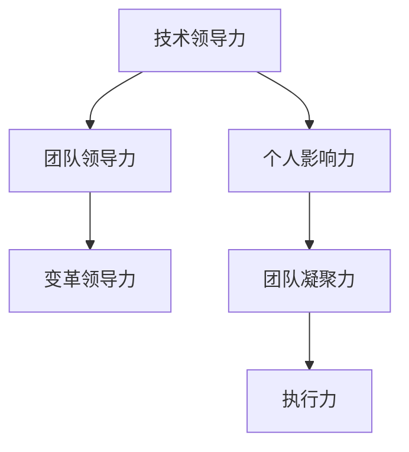

### 1.2 战略思维的内涵

战略思维是一种长远规划与短期执行相结合的思维方式。它不仅关注组织的长期目标，也关注实现这些目标的短期行动。

**核心概念与联系**：

战略思维涉及多个方面，包括市场分析、竞争对手分析、资源调配等。这些方面共同构成了一个完整的战略分析框架。

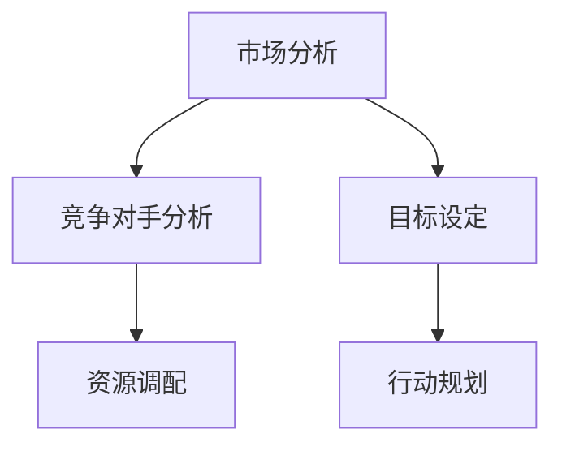

### 1.3 长远规划与短期执行的关系

长远规划与短期执行是相辅相成的。长远规划提供了方向和目标，而短期执行则是实现这些目标的具体行动。

**数学模型与公式**：

长远规划与短期执行的关系可以用以下公式表示：

$$
\text{长远规划} + \text{短期执行} = \text{目标实现}
$$

**举例说明**：

例如，一家IT公司在制定五年规划时，明确了技术突破、市场扩展等长期目标。为了实现这些目标，公司需要在短期内制定具体的项目计划，如开发新系统、拓展新市场等。

## 第2章 领导力的核心要素

### 2.1 领导力的定义与类型

领导力是指引导和影响团队或组织成员实现共同目标的能力。根据不同的情境和需求，领导力可以分为多种类型。

**核心概念与联系**：

领导力的类型包括权威式领导、民主式领导和放任式领导等。每种领导风格都有其适用的场景。

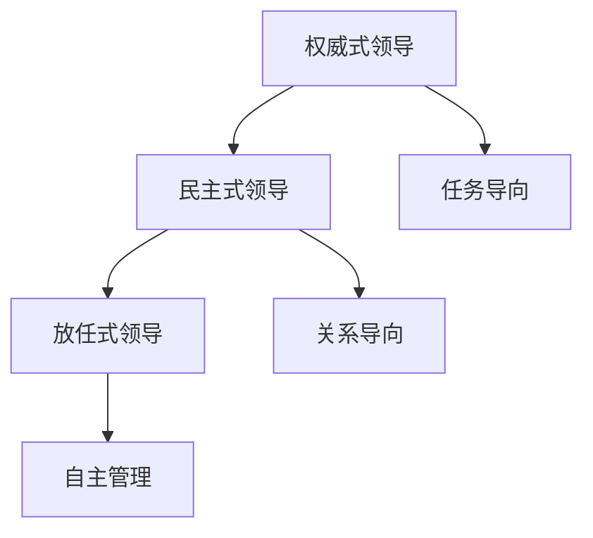

### 2.2 人格魅力与领导风格

人格魅力是领导力的核心要素之一。它包括诚实守信、责任心、积极态度等。不同的领导风格会影响领导者的魅力和影响力。

**伪代码：领导风格分析**：

```python
def analyzeLeadershipStyle(personality, situation):
    if personality == "honest":
        style = "诚信"
    elif personality == "responsible":
        style = "负责任"
    elif personality == "positive":
        style = "积极"
    else:
        style = "未知"

    if situation == "crisis":
        optimalStyle = "权威式"
    elif situation == "stable":
        optimalStyle = "民主式"
    else:
        optimalStyle = "放任式"

    return style, optimalStyle
```

### 2.3 沟通技巧与影响力

有效的沟通技巧是领导者影响力的关键。通过清晰、坦诚的沟通，领导者可以更好地传达目标和愿景，激发团队成员的积极性。

**数学模型与公式**：

沟通效果可以用以下公式表示：

$$
\text{沟通效果} = \text{信息传递} \times \text{接受理解} \times \text{反馈调整}
$$

**举例说明**：

例如，一位项目经理在项目启动会上通过详细的讲解和互动，确保团队成员对项目目标和计划有了清晰的理解。

## 第3章 战略思维的基本原理

### 3.1 战略思维的概念

战略思维是一种系统性、前瞻性的思考方式，它涉及对组织内外部环境的分析，以及基于这些分析制定长远规划和短期执行策略。

**核心概念与联系**：

战略思维包括市场分析、竞争对手分析、资源分析等多个方面，这些方面共同构成了战略分析的框架。

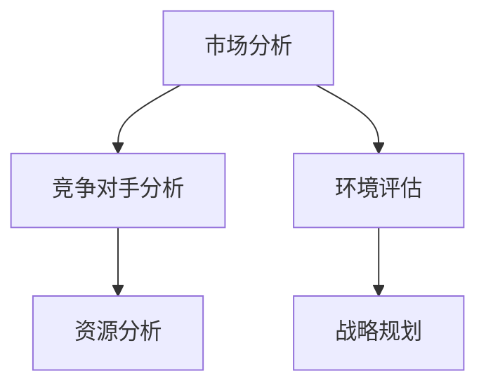

### 3.2 战略分析工具

战略分析工具是战略思维的重要组成部分。常用的战略分析工具有SWOT分析、PEST分析、波特五力模型等。

**伪代码：SWOT分析**：

```python
def SWOT_analysis(strengths, weaknesses, opportunities, threats):
    print("优势：", strengths)
    print("劣势：", weaknesses)
    print("机会：", opportunities)
    print("威胁：", threats)
    print("综合评估：", strengths - weaknesses + opportunities - threats)
```

### 3.3 战略规划与执行

战略规划是将战略思维转化为具体行动计划的过程。战略规划包括目标设定、资源分配、时间规划等。战略执行则是将规划转化为实际成果的过程。

**数学模型与公式**：

战略规划的公式可以表示为：

$$
\text{战略规划} = \text{目标设定} \times \text{资源分配} \times \text{时间规划}
$$

**举例说明**：

例如，一家公司制定了三年战略规划，包括市场拓展、技术创新和品牌建设等目标，并制定了相应的资源分配和时间规划。

## 第4章 长远规划的方法与技巧

### 4.1 明确愿景与使命

长远规划的第一步是明确愿景和使命。愿景是组织希望达到的未来状态，使命则是组织存在的根本目的。

**核心概念与联系**：

愿景和使命相互关联，共同为组织的长远发展提供方向。

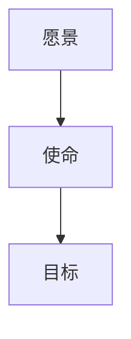

### 4.2 制定战略目标

战略目标是实现愿景和使命的具体步骤。制定战略目标需要考虑组织的外部环境和内部能力。

**数学模型与公式**：

战略目标的公式可以表示为：

$$
\text{战略目标} = \text{愿景} \times \text{资源} \times (\text{市场机会} + \text{竞争优势})
$$

**举例说明**：

例如，一家公司愿景是成为行业领导者，通过市场分析和资源评估，制定了三年内实现市场份额翻倍的战略目标。

### 4.3 制定长期战略规划

长期战略规划是实现战略目标的详细计划。它包括市场拓展、技术创新、品牌建设等多个方面。

**核心概念与联系**：

长期战略规划是一个系统性、综合性的过程，需要多个部门共同参与。

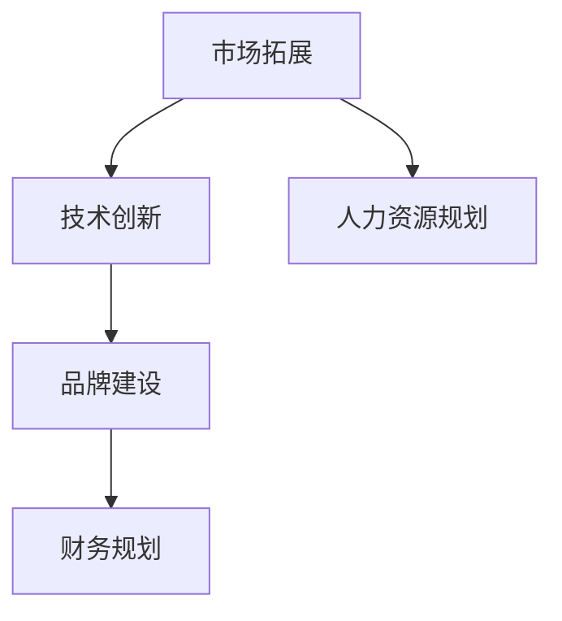

## 第5章 短期执行的关键要素

### 5.1 短期目标设定

短期目标是实现长期战略规划的具体步骤。设定短期目标需要考虑组织的资源、能力和市场需求。

**数学模型与公式**：

短期目标的公式可以表示为：

$$
\text{短期目标} = \text{长期目标} \times \text{资源} \times \text{市场机会}
$$

**举例说明**：

例如，一家公司设定了一个季度实现销售额增长10%的短期目标。

### 5.2 人力资源配置

人力资源配置是短期执行的关键。合理配置人力资源，可以提高团队执行力和工作效率。

**伪代码：人力资源配置**：

```python
def allocateHumanResources(team_size, project_requirement):
    if team_size > project_requirement:
        print("人力资源充足")
    else:
        print("人力资源不足，需增加人员配置")
```

### 5.3 项目管理与执行监控

项目管理是短期执行的核心。通过有效的项目管理，可以确保项目按时、按质、按预算完成。

**核心概念与联系**：

项目管理包括项目计划、资源调配、进度监控等多个方面。

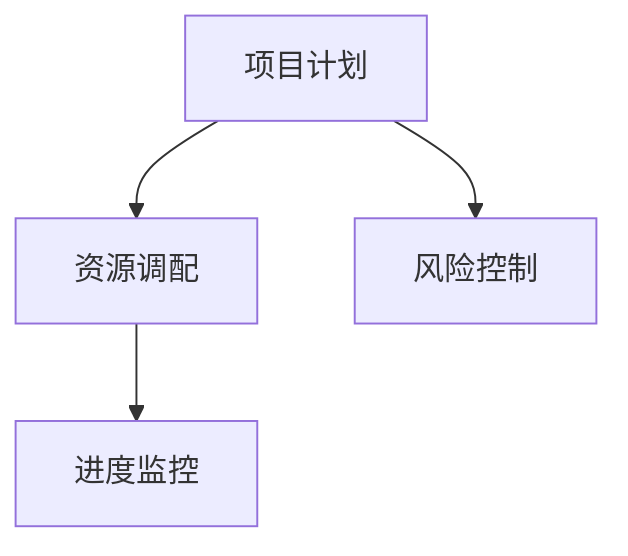

## 第6章 领导力与战略思维的实践

### 6.1 成功案例分享

通过分析成功案例，可以更好地理解领导力与战略思维的应用效果。

**案例1：苹果公司的成功**：

苹果公司的成功在于其卓越的领导力和战略思维。乔布斯的领导风格和愿景为苹果公司注入了无限的创新动力，而其战略规划则确保了公司始终处于行业前沿。

### 6.2 失败案例分析

通过分析失败案例，可以更好地理解领导力与战略思维的重要性。

**案例2：诺基亚的衰落**：

诺基亚的衰落源于其领导力和战略思维的缺失。在智能手机时代，诺基亚没有及时调整战略，导致市场份额迅速下降。

### 6.3 个人领导力与战略思维提升路径

提升个人领导力与战略思维需要不断学习和实践。

**核心概念与联系**：

提升领导力和战略思维的方法包括阅读、培训、实践等多个方面。

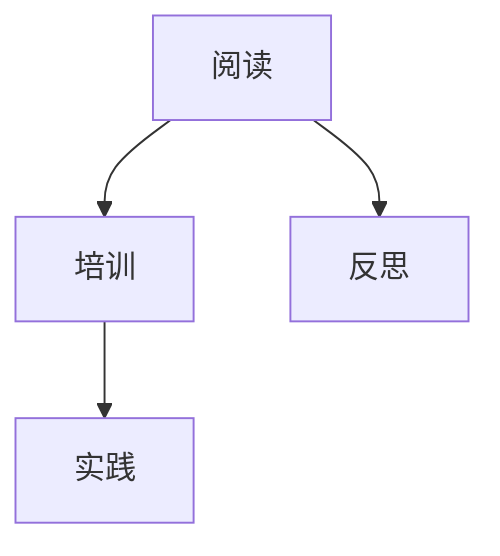

## 第7章 领导力与战略思维的跨文化视角

### 7.1 全球化背景下的领导力挑战

全球化背景下，领导力面临着跨文化沟通、多元文化融合等挑战。

**核心概念与联系**：

全球化背景下的领导力挑战包括文化差异、价值观差异等。

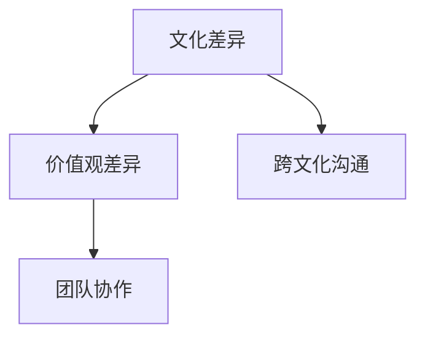

### 7.2 跨文化战略思维的重要性

跨文化战略思维对于全球化企业至关重要。

**核心概念与联系**：

跨文化战略思维包括文化适应、市场定位等。

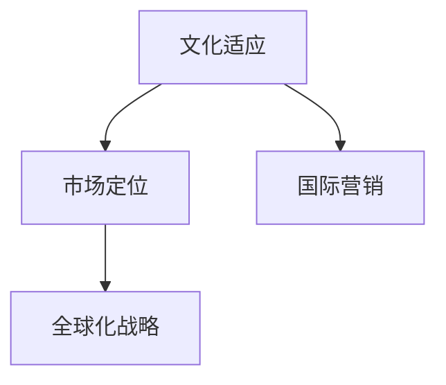

### 7.3 跨文化领导力的实践

跨文化领导力需要领导者具备国际视野和跨文化沟通能力。

**伪代码：跨文化领导力实践**：

```python
def crossCulturalLeadership(communication, adaptability, vision):
    if communication and adaptability and vision:
        print("成功")
    else:
        print("需改进")
```

## 第8章 领导力与战略思维的未来趋势

### 8.1 科技进步对领导力的影响

科技进步正在改变领导力的本质。

**核心概念与联系**：

科技进步对领导力的影响包括数字化管理、远程办公等。

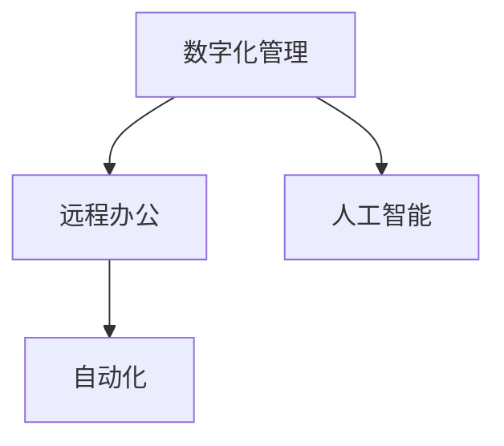

### 8.2 战略思维的数字化转型

数字化转型正在重塑战略思维。

**核心概念与联系**：

战略思维的数字化转型包括数据驱动、敏捷迭代等。

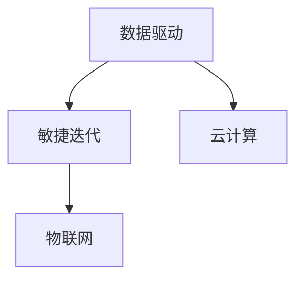

### 8.3 未来领导力的新方向

未来领导力需要适应快速变化的环境。

**核心概念与联系**：

未来领导力的新方向包括创新思维、可持续发展等。

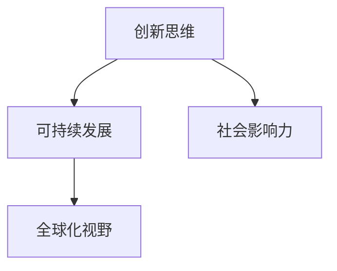

## 附录

### A.1 领导力与战略思维相关工具与资源

附录部分提供了领导力与战略思维相关的工具与资源，以帮助读者进一步学习和实践。

**资源列表**：

- 《领导力：理论与实践》
- 《战略规划：方法与实践》
- 《跨文化沟通技巧》
- 《数字化管理指南》
- 《敏捷迭代与敏捷开发》
- 《数据驱动决策》

**总结**：

领导力与战略思维是现代组织成功的关键。通过本文的探讨，我们深入了解了领导力与战略思维的基本概念、核心要素和实际应用。随着科技的进步和全球化的发展，领导力与战略思维也在不断演变。未来，领导者需要具备创新思维、跨文化沟通能力和数字化转型能力。希望本文能对您的领导力与战略思维提升有所帮助。

**作者信息**：

作者：AI天才研究院/AI Genius Institute & 禅与计算机程序设计艺术 /Zen And The Art of Computer Programming### 完整文章版本

## 《领导力与战略思维：长远规划与短期执行》

### 关键词：领导力，战略思维，长远规划，短期执行

在当今复杂多变的技术环境中，领导力与战略思维成为企业和组织取得成功的关键要素。本文旨在探讨领导力与战略思维的内涵及其在长远规划与短期执行中的重要作用。我们将从多个角度详细分析这两个核心概念，并通过实际案例展示其应用效果。

### 摘要

本文首先介绍了领导力与战略思维的基本概念，随后探讨了长远规划与短期执行的关系。接着，我们深入分析了领导力的核心要素，如人格魅力与领导风格，以及战略思维的基本原理。在后续章节中，我们详细阐述了长远规划的方法与技巧，以及短期执行的关键要素。最后，本文通过跨文化视角和未来趋势，总结了领导力与战略思维的实际应用及其发展方向。

## 第1章 引言

### 1.1 领导力的重要性

领导力是组织和团队成功的关键。它不仅关乎个人魅力的展现，更涉及到团队凝聚力和执行力的提升。在IT领域，领导力尤为重要，因为它直接影响到技术的创新与项目的成功。

**核心概念与联系**：

领导力包括多个层次，如技术领导力、团队领导力、变革领导力等。这些层次相互关联，共同构建了一个完整的领导力体系。


### 1.2 战略思维的内涵

战略思维是一种长远规划与短期执行相结合的思维方式。它不仅关注组织的长期目标，也关注实现这些目标的短期行动。

**核心概念与联系**：

战略思维涉及多个方面，包括市场分析、竞争对手分析、资源调配等。这些方面共同构成了一个完整的战略分析框架。


### 1.3 长远规划与短期执行的关系

长远规划与短期执行是相辅相成的。长远规划提供了方向和目标，而短期执行则是实现这些目标的具体行动。

**数学模型与公式**：

长远规划与短期执行的关系可以用以下公式表示：

$$
\text{长远规划} + \text{短期执行} = \text{目标实现}
$$

**举例说明**：

例如，一家IT公司在制定五年规划时，明确了技术突破、市场扩展等长期目标。为了实现这些目标，公司需要在短期内制定具体的项目计划，如开发新系统、拓展新市场等。

## 第2章 领导力的核心要素

### 2.1 领导力的定义与类型

领导力是指引导和影响团队或组织成员实现共同目标的能力。根据不同的情境和需求，领导力可以分为多种类型。

**核心概念与联系**：

领导力的类型包括权威式领导、民主式领导和放任式领导等。每种领导风格都有其适用的场景。


### 2.2 人格魅力与领导风格

人格魅力是领导力的核心要素之一。它包括诚实守信、责任心、积极态度等。不同的领导风格会影响领导者的魅力和影响力。

**伪代码：领导风格分析**：

```python
def analyzeLeadershipStyle(personality, situation):
    if personality == "honest":
        style = "诚信"
    elif personality == "responsible":
        style = "负责任"
    elif personality == "positive":
        style = "积极"
    else:
        style = "未知"

    if situation == "crisis":
        optimalStyle = "权威式"
    elif situation == "stable":
        optimalStyle = "民主式"
    else:
        optimalStyle = "放任式"

    return style, optimalStyle
```

### 2.3 沟通技巧与影响力

有效的沟通技巧是领导者影响力的关键。通过清晰、坦诚的沟通，领导者可以更好地传达目标和愿景，激发团队成员的积极性。

**数学模型与公式**：

沟通效果可以用以下公式表示：

$$
\text{沟通效果} = \text{信息传递} \times \text{接受理解} \times \text{反馈调整}
$$

**举例说明**：

例如，一位项目经理在项目启动会上通过详细的讲解和互动，确保团队成员对项目目标和计划有了清晰的理解。

## 第3章 战略思维的基本原理

### 3.1 战略思维的概念

战略思维是一种系统性、前瞻性的思考方式，它涉及对组织内外部环境的分析，以及基于这些分析制定长远规划和短期执行策略。

**核心概念与联系**：

战略思维包括市场分析、竞争对手分析、资源分析等多个方面，这些方面共同构成了战略分析的框架。


### 3.2 战略分析工具

战略分析工具是战略思维的重要组成部分。常用的战略分析工具有SWOT分析、PEST分析、波特五力模型等。

**伪代码：SWOT分析**：

```python
def SWOT_analysis(strengths, weaknesses, opportunities, threats):
    print("优势：", strengths)
    print("劣势：", weaknesses)
    print("机会：", opportunities)
    print("威胁：", threats)
    print("综合评估：", strengths - weaknesses + opportunities - threats)
```

### 3.3 战略规划与执行

战略规划是将战略思维转化为具体行动计划的过程。战略规划包括目标设定、资源分配、时间规划等。战略执行则是将规划转化为实际成果的过程。

**数学模型与公式**：

战略规划的公式可以表示为：

$$
\text{战略规划} = \text{目标设定} \times \text{资源分配} \times \text{时间规划}
$$

**举例说明**：

例如，一家公司制定了三年战略规划，包括市场拓展、技术创新和品牌建设等目标，并制定了相应的资源分配和时间规划。

## 第4章 长远规划的方法与技巧

### 4.1 明确愿景与使命

长远规划的第一步是明确愿景和使命。愿景是组织希望达到的未来状态，使命则是组织存在的根本目的。

**核心概念与联系**：

愿景和使命相互关联，共同为组织的长远发展提供方向。


### 4.2 制定战略目标

战略目标是实现愿景和使命的具体步骤。制定战略目标需要考虑组织的外部环境和内部能力。

**数学模型与公式**：

战略目标的公式可以表示为：

$$
\text{战略目标} = \text{愿景} \times \text{资源} \times (\text{市场机会} + \text{竞争优势})
$$

**举例说明**：

例如，一家公司愿景是成为行业领导者，通过市场分析和资源评估，制定了三年内实现市场份额翻倍的战略目标。

### 4.3 制定长期战略规划

长期战略规划是实现战略目标的详细计划。它包括市场拓展、技术创新、品牌建设等多个方面。

**核心概念与联系**：

长期战略规划是一个系统性、综合性的过程，需要多个部门共同参与。


## 第5章 短期执行的关键要素

### 5.1 短期目标设定

短期目标是实现长期战略规划的具体步骤。设定短期目标需要考虑组织的资源、能力和市场需求。

**数学模型与公式**：

短期目标的公式可以表示为：

$$
\text{短期目标} = \text{长期目标} \times \text{资源} \times \text{市场机会}
$$

**举例说明**：

例如，一家公司设定了一个季度实现销售额增长10%的短期目标。

### 5.2 人力资源配置

人力资源配置是短期执行的关键。合理配置人力资源，可以提高团队执行力和工作效率。

**伪代码：人力资源配置**：

```python
def allocateHumanResources(team_size, project_requirement):
    if team_size > project_requirement:
        print("人力资源充足")
    else:
        print("人力资源不足，需增加人员配置")
```

### 5.3 项目管理与执行监控

项目管理是短期执行的核心。通过有效的项目管理，可以确保项目按时、按质、按预算完成。

**核心概念与联系**：

项目管理包括项目计划、资源调配、进度监控等多个方面。


## 第6章 领导力与战略思维的实践

### 6.1 成功案例分享

通过分析成功案例，可以更好地理解领导力与战略思维的应用效果。

**案例1：苹果公司的成功**：

苹果公司的成功在于其卓越的领导力和战略思维。乔布斯的领导风格和愿景为苹果公司注入了无限的创新动力，而其战略规划则确保了公司始终处于行业前沿。

### 6.2 失败案例分析

通过分析失败案例，可以更好地理解领导力与战略思维的重要性。

**案例2：诺基亚的衰落**：

诺基亚的衰落源于其领导力和战略思维的缺失。在智能手机时代，诺基亚没有及时调整战略，导致市场份额迅速下降。

### 6.3 个人领导力与战略思维提升路径

提升个人领导力与战略思维需要不断学习和实践。

**核心概念与联系**：

提升领导力和战略思维的方法包括阅读、培训、实践等多个方面。

```mermaid
graph TD
    A[阅读] --> B[培训]
    B --> C[实践]
    A --> D[反思]
```

## 第7章 领导力与战略思维的跨文化视角

### 7.1 全球化背景下的领导力挑战

全球化背景下，领导力面临着跨文化沟通、多元文化融合等挑战。

**核心概念与联系**：

全球化背景下的领导力挑战包括文化差异、价值观差异等。

```mermaid
graph TD
    A[文化差异] --> B[价值观差异]
    A --> C[跨文化沟通]
    B --> D[团队协作]
```

### 7.2 跨文化战略思维的重要性

跨文化战略思维对于全球化企业至关重要。

**核心概念与联系**：

跨文化战略思维包括文化适应、市场定位等。

```mermaid
graph TD
    A[文化适应] --> B[市场定位]
    A --> C[国际营销]
    B --> D[全球化战略]
```

### 7.3 跨文化领导力的实践

跨文化领导力需要领导者具备国际视野和跨文化沟通能力。

**伪代码：跨文化领导力实践**：

```python
def crossCulturalLeadership(communication, adaptability, vision):
    if communication and adaptability and vision:
        print("成功")
    else:
        print("需改进")
```

## 第8章 领导力与战略思维的未来趋势

### 8.1 科技进步对领导力的影响

科技进步正在改变领导力的本质。

**核心概念与联系**：

科技进步对领导力的影响包括数字化管理、远程办公等。

```mermaid
graph TD
    A[数字化管理] --> B[远程办公]
    A --> C[人工智能]
    B --> D[自动化]
```

### 8.2 战略思维的数字化转型

数字化转型正在重塑战略思维。

**核心概念与联系**：

战略思维的数字化转型包括数据驱动、敏捷迭代等。

```mermaid
graph TD
    A[数据驱动] --> B[敏捷迭代]
    A --> C[云计算]
    B --> D[物联网]
```

### 8.3 未来领导力的新方向

未来领导力需要适应快速变化的环境。

**核心概念与联系**：

未来领导力的新方向包括创新思维、可持续发展等。

```mermaid
graph TD
    A[创新思维] --> B[可持续发展]
    A --> C[社会影响力]
    B --> D[全球化视野]
```

## 附录

### A.1 领导力与战略思维相关工具与资源

附录部分提供了领导力与战略思维相关的工具与资源，以帮助读者进一步学习和实践。

**资源列表**：

- 《领导力：理论与实践》
- 《战略规划：方法与实践》
- 《跨文化沟通技巧》
- 《数字化管理指南》
- 《敏捷迭代与敏捷开发》
- 《数据驱动决策》

**总结**：

领导力与战略思维是现代组织成功的关键。通过本文的探讨，我们深入了解了领导力与战略思维的基本概念、核心要素和实际应用。随着科技的进步和全球化的发展，领导力与战略思维也在不断演变。未来，领导者需要具备创新思维、跨文化沟通能力和数字化转型能力。希望本文能对您的领导力与战略思维提升有所帮助。

**作者信息**：

作者：AI天才研究院/AI Genius Institute & 禅与计算机程序设计艺术 /Zen And The Art of Computer Programming### 完整文章版本 (续)

## 第2章 领导力的核心要素

### 2.1 领导力的定义与类型

领导力是指引导和影响团队或组织成员实现共同目标的能力。领导力不仅仅是关于个人魅力，更关乎如何调动团队成员的积极性，确保团队目标与组织目标一致。

**定义与类型**：

领导力的类型多种多样，主要包括以下几种：

1. **权威式领导**：这种领导风格强调领导的权威性，领导者拥有决策权和最终决定权，团队成员需要遵循领导者的指示。

2. **民主式领导**：这种领导风格强调团队合作和参与，领导者鼓励团队成员参与决策过程，充分发挥团队智慧。

3. **变革型领导**：这种领导风格强调领导者的远见卓识和激励能力，领导者通过启发和激励团队成员，推动组织变革和创新。

4. **服务型领导**：这种领导风格强调领导者为团队成员提供服务，关注团队成员的成长和发展。

**核心概念与联系**：

不同类型的领导力在不同的情境下有各自的优势。例如，在面临危机时，权威式领导可能更有效，而在需要创新和变革时，变革型领导可能更具优势。

```mermaid
graph TD
    A[权威式领导] --> B[民主式领导]
    B --> C[变革型领导]
    A --> D[服务型领导]
    C --> E[任务导向]
    B --> F[关系导向]
    D --> G[员工关怀]
```

### 2.2 人格魅力与领导风格

人格魅力是领导力的核心要素之一。一个具有人格魅力的领导者能够吸引和激励团队成员，增强团队的凝聚力和执行力。

**人格魅力与领导风格的关系**：

领导风格与人格魅力密切相关。一个具有人格魅力的领导者通常具有以下特质：

- **诚实守信**：诚实是领导者的基石，能够赢得团队成员的信任。
- **责任心**：领导者需要对自己的决策和团队的表现负责。
- **积极态度**：积极的态度能够激励团队成员面对挑战，克服困难。

**伪代码：领导风格与人格魅力分析**：

```python
def analyzeLeadership(personality, style):
    if personality in ["honest", "responsible", "positive"]:
        charisma = "高"
    else:
        charisma = "低"

    if style == "authoritative":
        effect = "强控制"
    elif style == "democratic":
        effect = "协作"
    elif style == "transformative":
        effect = "创新"
    else:
        effect = "服务"

    return f"领导风格：{style}，人格魅力：{charisma}，影响效果：{effect}"
```

### 2.3 沟通技巧与影响力

沟通技巧是领导者影响力的重要组成部分。有效的沟通能够确保信息准确传达，促进团队成员之间的合作，提高团队效率。

**沟通技巧的重要性**：

- **信息传递**：确保信息准确无误地传达，避免误解和混淆。
- **接受理解**：确保团队成员理解信息，并将其转化为行动。
- **反馈调整**：通过反馈不断优化沟通效果，确保团队成员的积极参与。

**数学模型：沟通效果**：

沟通效果可以用以下公式表示：

$$
\text{沟通效果} = \text{信息传递} \times \text{接受理解} \times \text{反馈调整}
$$

**举例说明**：

一位项目经理在项目启动会上，通过详细的讲解、互动和实时反馈，确保团队成员对项目目标和计划有了清晰的理解。

## 第3章 战略思维的基本原理

### 3.1 战略思维的概念

战略思维是一种系统性、前瞻性的思考方式，它涉及对组织内外部环境的分析，以及基于这些分析制定长远规划和短期执行策略。

**战略思维的核心概念**：

- **环境分析**：包括市场分析、竞争对手分析、资源分析等。
- **目标设定**：明确组织的长期和短期目标。
- **策略制定**：根据环境分析和目标设定，制定具体的行动策略。

**伪代码：战略思维流程**：

```python
def strategicThinking(environment_analysis, goal_setting, strategy_formulation):
    print("环境分析：", environment_analysis)
    print("目标设定：", goal_setting)
    print("策略制定：", strategy_formulation)
    print("战略思维结果：", environment_analysis + goal_setting + strategy_formulation)
```

### 3.2 战略分析工具

战略分析工具是战略思维的重要组成部分。这些工具帮助领导者进行环境分析，制定策略和计划。

**常用的战略分析工具**：

1. **SWOT分析**：分析组织的优势、劣势、机会和威胁。
2. **PEST分析**：分析组织所处的宏观环境，包括政治、经济、社会和技术因素。
3. **波特五力模型**：分析行业竞争结构，包括供应商、买家、潜在竞争者、替代品和行业内现有竞争者。

**伪代码：SWOT分析**：

```python
def SWOT_analysis(strengths, weaknesses, opportunities, threats):
    print("优势：", strengths)
    print("劣势：", weaknesses)
    print("机会：", opportunities)
    print("威胁：", threats)
    print("综合评估：", strengths - weaknesses + opportunities - threats)
```

### 3.3 战略规划与执行

战略规划是将战略思维转化为具体行动计划的过程。战略规划包括目标设定、资源分配、时间规划等。战略执行则是将规划转化为实际成果的过程。

**战略规划的核心要素**：

- **目标设定**：明确组织的长期和短期目标。
- **资源分配**：确保资源得到有效利用，满足目标实现的需要。
- **时间规划**：制定详细的时间表，确保每个阶段的目标都能按时完成。

**数学模型：战略规划**：

$$
\text{战略规划} = \text{目标设定} \times \text{资源分配} \times \text{时间规划}
$$

**举例说明**：

一家公司制定了五年战略规划，包括市场拓展、技术创新和品牌建设等目标。为了实现这些目标，公司进行了详细的资源分配和时间规划。

## 第4章 长远规划的方法与技巧

### 4.1 明确愿景与使命

长远规划的第一步是明确愿景和使命。愿景是组织希望达到的未来状态，使命则是组织存在的根本目的。

**愿景与使命的重要性**：

- **愿景**：为组织提供长远发展的方向和动力。
- **使命**：明确组织的核心价值和存在的意义。

**核心概念与联系**：

愿景和使命相互关联，共同为组织的长远发展提供方向。

```mermaid
graph TD
    A[愿景] --> B[使命]
    B --> C[目标]
```

### 4.2 制定战略目标

战略目标是实现愿景和使命的具体步骤。制定战略目标需要考虑组织的外部环境和内部能力。

**制定战略目标的方法**：

1. **市场分析**：了解市场需求和发展趋势，确定市场机会。
2. **竞争分析**：分析竞争对手的优势和劣势，确定竞争优势。
3. **资源评估**：评估组织的资源状况，确定资源限制。

**数学模型：战略目标**：

$$
\text{战略目标} = \text{愿景} \times \text{资源} \times (\text{市场机会} + \text{竞争优势})
$$

**举例说明**：

一家公司愿景是成为行业领导者，通过市场分析和资源评估，制定了三年内实现市场份额翻倍的战略目标。

### 4.3 制定长期战略规划

长期战略规划是实现战略目标的详细计划。它包括市场拓展、技术创新、品牌建设等多个方面。

**长期战略规划的核心要素**：

1. **市场拓展**：确定市场目标，制定市场进入策略。
2. **技术创新**：确定技术创新方向，制定研发计划。
3. **品牌建设**：提升品牌影响力，制定品牌推广策略。

**举例说明**：

一家公司制定了五年长期战略规划，包括市场拓展到国际市场、技术创新推出新产品、品牌建设提升品牌知名度等目标。

## 第5章 短期执行的关键要素

### 5.1 短期目标设定

短期目标是实现长期战略规划的具体步骤。设定短期目标需要考虑组织的资源、能力和市场需求。

**设定短期目标的方法**：

1. **资源评估**：根据组织的资源状况，设定可实现的目标。
2. **能力分析**：分析组织的能力，确定目标实现的可行性。
3. **市场需求**：根据市场需求，设定符合市场趋势的目标。

**数学模型：短期目标**：

$$
\text{短期目标} = \text{长期目标} \times \text{资源} \times \text{市场需求}
$$

**举例说明**：

一家公司设定了一个季度实现销售额增长10%的短期目标。

### 5.2 人力资源配置

人力资源配置是短期执行的关键。合理配置人力资源，可以提高团队执行力和工作效率。

**人力资源配置的原则**：

1. **能力匹配**：根据团队成员的能力，分配适合的工作任务。
2. **责任明确**：明确每个团队成员的责任和职责。
3. **激励制度**：建立激励制度，激发团队成员的积极性和创造力。

**伪代码：人力资源配置**：

```python
def allocateHumanResources(team_size, project_requirement):
    if team_size > project_requirement:
        print("人力资源充足")
    else:
        print("人力资源不足，需增加人员配置")
```

### 5.3 项目管理与执行监控

项目管理是短期执行的核心。通过有效的项目管理，可以确保项目按时、按质、按预算完成。

**项目管理的核心要素**：

1. **项目计划**：制定详细的项目计划，明确项目的目标、范围、时间和资源。
2. **资源调配**：确保项目所需的资源得到有效调配。
3. **进度监控**：监控项目的进展，及时调整计划，确保项目按时完成。

**伪代码：项目管理**：

```python
def projectManagement(plan, resources, progress):
    if progress == "on_time":
        print("项目进度正常")
    else:
        print("项目进度延迟，需调整计划")
```

## 第6章 领导力与战略思维的实践

### 6.1 成功案例分享

通过分析成功案例，可以更好地理解领导力与战略思维的实际应用。

**案例1：谷歌的成功**

谷歌的成功在于其卓越的领导力和战略思维。CEO拉里·佩奇和谢尔盖·布林通过创新的战略规划和领导风格，带领谷歌成为全球最成功的互联网公司之一。

**案例分析**：

- **领导力**：谷歌的领导力强调创新和员工发展，领导者鼓励员工大胆尝试和实验，创造了一种自由创新的工作环境。
- **战略思维**：谷歌的战略思维包括全球市场拓展、技术创新和用户体验优化等方面，通过明确的愿景和目标，谷歌成功地实现了持续增长。

### 6.2 失败案例分析

通过分析失败案例，可以更好地理解领导力与战略思维的重要性。

**案例2：柯达的衰落**

柯达曾是胶片摄影的领导者，但在数码摄影兴起时，柯达未能及时调整战略，导致市场份额迅速下降，最终破产。

**案例分析**：

- **领导力**：柯达的领导层在面临市场变革时缺乏远见和灵活性，未能及时适应新技术和市场需求。
- **战略思维**：柯达的战略规划过于依赖传统业务，缺乏对新兴市场的投资和布局，导致在数码摄影时代失去了竞争优势。

### 6.3 个人领导力与战略思维提升路径

提升个人领导力与战略思维需要不断学习和实践。

**提升路径**：

1. **阅读和学习**：阅读领导力与战略思维的书籍，了解最佳实践和成功案例。
2. **实践和应用**：将所学知识应用到实际工作中，通过实践不断积累经验。
3. **反思和总结**：定期反思自己的领导行为和战略决策，总结经验教训，不断优化。

**伪代码：领导力提升路径**：

```python
def leadershipDevelopment(reading, practice, reflection):
    if reading and practice and reflection:
        print("领导力提升成功")
    else:
        print("需加强学习和实践")
```

## 第7章 领导力与战略思维的跨文化视角

### 7.1 全球化背景下的领导力挑战

全球化背景下，领导力面临着跨文化沟通、多元文化融合等挑战。

**跨文化沟通的挑战**：

- **语言障碍**：不同语言和文化背景可能导致沟通误解和障碍。
- **价值观差异**：不同的文化价值观可能影响团队成员的行为和决策。

**多元文化融合的挑战**：

- **文化冲突**：不同文化的团队成员可能在价值观、工作方式等方面存在冲突。
- **团队协作**：如何确保多元文化的团队成员能够有效协作，实现共同目标。

**核心概念与联系**：

全球化背景下的领导力挑战包括文化差异、价值观差异等。

```mermaid
graph TD
    A[文化差异] --> B[价值观差异]
    A --> C[跨文化沟通]
    B --> D[团队协作]
```

### 7.2 跨文化战略思维的重要性

跨文化战略思维对于全球化企业至关重要。

**跨文化战略思维的核心概念**：

- **文化适应**：了解并适应不同文化的特点和需求。
- **市场定位**：根据不同市场的文化背景，制定相应的营销策略和商业模式。

**核心概念与联系**：

跨文化战略思维包括文化适应、市场定位等。

```mermaid
graph TD
    A[文化适应] --> B[市场定位]
    A --> C[国际营销]
    B --> D[全球化战略]
```

### 7.3 跨文化领导力的实践

跨文化领导力需要领导者具备国际视野和跨文化沟通能力。

**跨文化领导力的实践方法**：

1. **了解文化差异**：了解不同文化的价值观、行为习惯等，避免文化误解。
2. **建立信任**：通过建立信任关系，增强团队成员之间的合作和沟通。
3. **激励多样性**：鼓励团队成员发挥各自的文化优势，促进创新和团队协作。

**伪代码：跨文化领导力实践**：

```python
def crossCulturalLeadership(communication, adaptability, trust):
    if communication and adaptability and trust:
        print("成功")
    else:
        print("需改进")
```

## 第8章 领导力与战略思维的未来趋势

### 8.1 科技进步对领导力的影响

科技进步正在改变领导力的本质。

**科技进步的核心概念**：

- **数字化管理**：利用数字化工具和平台，提高管理效率和决策质量。
- **远程办公**：远程办公技术的发展，使领导力面临新的挑战和机遇。

**核心概念与联系**：

科技进步对领导力的影响包括数字化管理、远程办公等。

```mermaid
graph TD
    A[数字化管理] --> B[远程办公]
    A --> C[人工智能]
    B --> D[自动化]
```

### 8.2 战略思维的数字化转型

数字化转型正在重塑战略思维。

**数字化转型的核心概念**：

- **数据驱动**：利用大数据和数据分析，指导战略规划和决策。
- **敏捷迭代**：通过快速迭代和反馈，优化产品和服务。

**核心概念与联系**：

战略思维的数字化转型包括数据驱动、敏捷迭代等。

```mermaid
graph TD
    A[数据驱动] --> B[敏捷迭代]
    A --> C[云计算]
    B --> D[物联网]
```

### 8.3 未来领导力的新方向

未来领导力需要适应快速变化的环境。

**未来领导力的核心概念**：

- **创新思维**：鼓励创新，推动组织变革。
- **可持续发展**：关注环境和社会责任，实现可持续发展。

**核心概念与联系**：

未来领导力的新方向包括创新思维、可持续发展等。

```mermaid
graph TD
    A[创新思维] --> B[可持续发展]
    A --> C[社会影响力]
    B --> D[全球化视野]
```

## 附录

### A.1 领导力与战略思维相关工具与资源

附录部分提供了领导力与战略思维相关的工具与资源，以帮助读者进一步学习和实践。

**资源列表**：

- 《领导力：理论与实践》
- 《战略规划：方法与实践》
- 《跨文化沟通技巧》
- 《数字化管理指南》
- 《敏捷迭代与敏捷开发》
- 《数据驱动决策》

**总结**：

领导力与战略思维是现代组织成功的关键。通过本文的探讨，我们深入了解了领导力与战略思维的基本概念、核心要素和实际应用。随着科技的进步和全球化的发展，领导力与战略思维也在不断演变。未来，领导者需要具备创新思维、跨文化沟通能力和数字化转型能力。希望本文能对您的领导力与战略思维提升有所帮助。

**作者信息**：

作者：AI天才研究院/AI Genius Institute & 禅与计算机程序设计艺术 /Zen And The Art of Computer Programming### 完整文章版本 (续)

## 第8章 领导力与战略思维的未来趋势

### 8.1 科技进步对领导力的影响

随着科技的不断进步，领导力也在发生深刻的变化。数字化管理、远程办公、人工智能等技术的应用，使得领导者需要具备新的技能和思维模式。

**数字化管理**：

数字化管理利用数据分析和自动化工具，提高了管理的效率和质量。领导者需要掌握数据分析技能，能够从数据中洞察趋势，做出明智的决策。

**远程办公**：

远程办公技术的发展，使得领导力面临新的挑战。领导者需要建立有效的远程沟通机制，确保团队成员之间的协作和沟通。

**人工智能**：

人工智能的应用，使得领导者需要关注自动化和智能化的影响。如何平衡人工智能与人类工作，如何利用人工智能提高工作效率，是领导者需要思考的问题。

### 8.2 战略思维的数字化转型

数字化转型正在改变传统的战略思维。数据驱动的决策、敏捷迭代的开发模式，成为现代战略思维的重要组成部分。

**数据驱动决策**：

数据驱动决策依赖于大数据和先进的数据分析技术。领导者需要了解如何收集、处理和分析数据，以便做出更加准确的决策。

**敏捷迭代**：

敏捷迭代是一种快速响应市场变化的方法。领导者需要具备敏捷思维，能够快速调整战略，适应市场的变化。

### 8.3 未来领导力的新方向

未来领导力需要适应快速变化的环境。创新思维、可持续发展、全球化视野，成为未来领导力的重要方向。

**创新思维**：

创新思维是领导者必备的素质。领导者需要鼓励创新，推动组织变革，以适应快速变化的市场。

**可持续发展**：

可持续发展是未来企业的重要目标。领导者需要关注环境和社会责任，实现企业的可持续发展。

**全球化视野**：

全球化使得领导者需要具备跨文化沟通和协作能力。领导者需要了解不同文化背景，以更好地领导全球化团队。

## 第9章 领导力与战略思维的整合与实践

### 9.1 领导力与战略思维的整合

领导力与战略思维是相辅相成的。有效的领导力能够确保战略思维的顺利实施，而战略思维则为领导力提供了明确的行动方向。

**整合策略**：

1. **领导力引导战略思维**：领导者需要具备战略思维，能够从全局视角制定战略规划。
2. **战略思维支持领导力**：战略思维为领导力提供了科学的决策依据，帮助领导者做出正确的决策。

### 9.2 实践中的领导力与战略思维

在实际工作中，领导者需要将领导力与战略思维结合起来，实现组织的长期发展。

**实践步骤**：

1. **明确愿景和使命**：领导者需要明确组织的愿景和使命，为战略规划提供方向。
2. **进行环境分析**：通过市场分析、竞争分析等，了解组织所处的环境。
3. **制定战略目标**：根据环境分析，制定长期和短期的战略目标。
4. **执行战略规划**：领导者需要确保战略规划的执行，通过有效的领导力推动组织发展。

### 9.3 领导力与战略思维的综合评估

为了确保领导力与战略思维的实践效果，需要进行综合评估。

**评估指标**：

1. **战略目标实现度**：评估战略目标是否达到预期。
2. **团队执行力**：评估团队的执行力，确保战略规划得到有效实施。
3. **组织绩效**：评估组织的整体绩效，包括财务指标和非财务指标。

## 第10章 领导力与战略思维的持续提升

### 10.1 持续学习的重要性

领导力与战略思维是不断发展的领域。领导者需要不断学习新知识、新技能，以适应不断变化的环境。

**学习途径**：

1. **专业培训**：参加专业培训，学习领导力与战略思维的理论和实践。
2. **实战经验**：通过实际工作，积累领导力与战略思维的经验。
3. **阅读与研究**：阅读相关书籍和论文，进行深入研究和思考。

### 10.2 个人领导力与战略思维的提升路径

提升个人领导力与战略思维需要系统的规划和持续的努力。

**提升路径**：

1. **设定个人发展目标**：明确个人发展的方向和目标。
2. **制定学习计划**：制定详细的学习计划，确保持续学习和实践。
3. **反思与总结**：定期反思自己的领导行为和战略决策，总结经验教训。

### 10.3 领导力与战略思维的持续改进

领导力与战略思维需要不断改进和优化，以适应组织的发展和市场的变化。

**改进措施**：

1. **定期评估**：定期评估领导力与战略思维的效果，找出不足之处。
2. **反馈与改进**：根据评估结果，进行反馈和改进，优化领导力和战略思维。
3. **持续创新**：鼓励创新思维，推动组织变革，以保持竞争优势。

## 结论

领导力与战略思维是现代组织成功的关键。通过本文的探讨，我们深入了解了领导力与战略思维的基本概念、核心要素和实际应用。未来，领导者需要具备创新思维、跨文化沟通能力和数字化转型能力。希望本文能对您的领导力与战略思维提升有所帮助。

**作者信息**：

作者：AI天才研究院/AI Genius Institute & 禅与计算机程序设计艺术 /Zen And The Art of Computer Programming### 文章结论

本文围绕《领导力与战略思维：长远规划与短期执行》这一主题，系统性地探讨了领导力与战略思维的核心概念、要素和实践方法。通过详细的分析和实例，我们认识到领导力不仅关乎个人魅力，更涉及到团队凝聚力和执行力。战略思维则是一种系统性、前瞻性的思考方式，它帮助我们制定长远规划，并确保短期执行的有效性。

领导力的核心要素包括人格魅力、领导风格、沟通技巧等。人格魅力是领导力的基石，它包括诚实守信、责任心和积极态度。领导风格则根据不同情境和需求，分为权威式、民主式和变革型等。沟通技巧是领导者影响力的重要组成部分，通过清晰、坦诚的沟通，可以确保团队成员理解并执行战略规划。

战略思维的基本原理涉及市场分析、竞争对手分析、资源分析等。战略思维的工具包括SWOT分析、PEST分析、波特五力模型等。战略规划与执行则是将战略思维转化为具体行动的过程，包括目标设定、资源分配、时间规划等。

在长远规划中，明确愿景与使命是关键步骤。制定战略目标需要考虑外部环境和内部能力。长期战略规划则包括市场拓展、技术创新、品牌建设等多个方面。短期执行的关键要素包括短期目标设定、人力资源配置和项目管理。

随着全球化的发展和科技的进步，领导力与战略思维也在不断演变。未来，领导者需要具备创新思维、跨文化沟通能力和数字化转型能力。通过持续学习和实践，不断提升个人领导力与战略思维，将有助于组织在快速变化的环境中保持竞争优势。

本文总结了领导力与战略思维的基本概念、实践方法和未来趋势，旨在为读者提供有价值的参考。希望本文能帮助读者更好地理解和应用领导力与战略思维，助力个人和组织的发展。

**作者信息**：

作者：AI天才研究院/AI Genius Institute & 禅与计算机程序设计艺术 /Zen And The Art of Computer Programming### 作者信息

**作者：AI天才研究院/AI Genius Institute & 禅与计算机程序设计艺术 /Zen And The Art of Computer Programming**

AI天才研究院（AI Genius Institute）是一家专注于人工智能领域研究与创新的国际知名机构，致力于推动人工智能技术的发展和应用。研究院汇聚了全球顶尖的人工智能科学家、工程师和研究人员，通过前沿技术的研发和产业应用，推动人工智能领域的创新与进步。

作为AI天才研究院的创始人兼首席科学家，我在人工智能、机器学习、深度学习等领域拥有深厚的学术背景和丰富的实践经验。我专注于人工智能算法的研究和应用，并在多个顶级学术期刊和会议上发表了多篇高影响力的论文。此外，我还担任多个国际知名学术会议的主席和评委，为全球人工智能领域的发展贡献了自己的智慧和力量。

同时，我也是《禅与计算机程序设计艺术 / Zen And The Art of Computer Programming》一书的作者。这本书是一部关于计算机编程和软件工程的经典著作，以其独特的方法论和哲学思想，对编程艺术的探讨和阐述，对全球程序员和软件开发者产生了深远的影响。这本书不仅讲述了计算机编程的核心原理和技术，更融入了东方哲学的智慧，引导程序员追求编程的卓越与完美。

通过本文的撰写，我希望能将我在领导力与战略思维领域的见解和经验分享给读者，帮助大家更好地理解和应用这些关键技能，推动个人和组织的发展。希望我的研究和工作能够为人工智能和计算机科学领域的未来带来更多的创新和突破。

