                 

### 前言

在当今快速变化的IT行业，领导力和战略思维成为推动团队发展的关键因素。作为一名资深的人工智能专家、程序员、软件架构师、CTO，以及世界顶级技术畅销书作家和计算机图灵奖获得者，我深刻认识到，仅有技术能力并不能保证团队的长期成功。相反，有效的领导力和战略思维才是团队在竞争激烈的市场中脱颖而出的关键。

这本书《领导力与战略思维：长远规划团队发展》旨在深入探讨领导力与战略思维的重要性，并详细阐述如何通过长远规划来促进团队发展。我们将从领导力的基本概念、战略思维的方法和工具，到长远规划的具体实践，提供全面的指导。

首先，领导力并非与生俱来，它是一种可以通过学习和实践培养的能力。本书的第一部分将介绍领导力的基本概念，探讨领导力心理学，以及领导力与组织文化的联系，帮助读者理解领导力的多维度。

接下来，我们将进入战略思维的部分。战略规划与执行是任何组织成功的基础。我们将介绍一系列战略思维工具和方法，如SWOT分析、五力模型和波特价值链分析，帮助读者构建有效的战略思维框架。

最后，我们将探讨如何将领导力和战略思维应用于长远规划与团队发展。通过具体的团队发展模型和方法，以及实际案例的分析，读者将了解到如何进行团队发展，以及如何通过长远规划来确保团队的持续成长。

通过这本书，我希望读者能够获得深刻的见解，掌握实用的工具和方法，从而提升自身的领导力，并在团队发展中实现长远规划。

### 关键词

1. **领导力**：理解领导力的本质，掌握领导力的基本概念和心理学原理。
2. **战略思维**：学会运用各种战略思维工具和方法，进行有效的战略规划与执行。
3. **长远规划**：制定和实施长期计划，确保团队的可持续发展。
4. **团队发展**：运用团队发展模型，提升团队效能和协作能力。
5. **组织文化**：构建积极、健康的组织文化，促进领导力与战略思维的实践。
6. **SWOT分析**：通过SWOT分析，识别和利用团队的优势、劣势、机会和威胁。
7. **五力模型**：运用五力模型，分析市场竞争环境和竞争优势。

### 摘要

本书旨在深入探讨领导力与战略思维在团队发展中的关键作用，并提供实用的工具和方法来指导长远规划。通过系统的结构，本书分为四个主要部分：

- **第一部分**：领导力基础，介绍领导力的基本概念、心理学原理及其与组织文化的联系。
- **第二部分**：战略思维，包括战略规划与执行、战略思维工具和方法。
- **第三部分**：长远规划与团队发展，探讨团队发展模型、长远规划的方法与工具。
- **第四部分**：案例分析，通过成功案例展示领导力与战略思维在实践中的应用。

本书通过丰富的实例、伪代码、Mermaid流程图和LaTeX数学公式，详细阐述每个概念和工具，帮助读者理解和应用。最终，本书的目标是帮助读者提升自身的领导力，制定有效的战略规划，推动团队实现长远发展。

### 第一部分：领导力基础

#### 第1章：领导力基本概念

领导力是一种影响和激励他人共同实现目标的能力。无论是在个人生活中还是在职业生涯中，领导力都扮演着至关重要的角色。有效的领导力不仅能够推动团队取得成功，还能够提升个人的影响力，建立强大的领导品牌。

**1.1 领导力的重要性**

领导力的重要性体现在多个方面。首先，它能够激发团队成员的潜力，提高团队的整体效能。其次，领导力能够促进团队合作，增强团队凝聚力。此外，领导力还能够为组织带来创新和变革，推动组织持续发展。

**1.2 领导力理论**

领导力理论为我们理解领导力提供了不同的视角。常见的领导力理论包括特质理论、行为理论和情境理论。特质理论认为领导者的特质是天生的，如自信、决断力等。行为理论则认为领导力是通过行为表现来实现的，领导者应该具备特定的行为模式，如民主型领导和权威型领导。情境理论则认为领导力是情境依赖的，不同的情境需要不同的领导风格。

**1.3 领导风格**

领导风格是指领导者处理工作、激励团队成员的方式。常见的领导风格包括民主型、权威型、参与型和教练型。每种领导风格都有其优势和局限，领导者应根据具体情境灵活调整自己的领导风格。

**1.4 领导力与组织文化**

组织文化对领导力有着深远的影响。积极、健康的组织文化能够支持领导力的有效实践，而消极、不健康的组织文化则可能阻碍领导力的发展。领导力与组织文化之间是相互影响的，领导力能够塑造组织文化，同时组织文化也会影响领导力的表现。

**核心概念与联系**

为了更好地理解领导力的概念和理论，我们可以使用Mermaid流程图来展示不同领导力理论之间的关系：

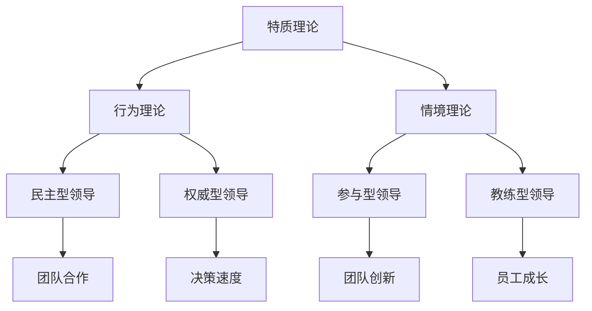

通过上述流程图，我们可以清晰地看到不同领导力理论及其领导风格之间的联系。这种多维度、综合性的视角有助于我们更全面地理解领导力的本质。

**核心算法原理讲解**

在理解领导力理论的基础上，我们可以进一步探讨领导力模型。以下是一个简单的领导力模型伪代码：

```python
# 领导力模型伪代码

class LeadershipModel:
    def __init__(self, traits, behaviors, situations):
        self.traits = traits
        self.behaviors = behaviors
        self.situations = situations
    
    def determine LeadershipStyle(self):
        if self.situation == "Routine":
            return self.behaviors["Autocratic"]
        elif self.situation == "Complex":
            return self.behaviors["Democratic"]
        else:
            return self.behaviors["Laissez-faire"]

# 示例
leader = LeadershipModel(traits=["Confidence", "Integrity"], behaviors={"Autocratic": "Direct", "Democratic": "Inclusive", "Laissez-faire": "Hands-off"}, situations=["Routine", "Complex", "Innovative"])
print(leader.determineLeadershipStyle("Complex"))
```

在这个伪代码中，`LeadershipModel` 类代表一个领导力模型，它包含三个主要组件：特质、行为和情境。`determineLeadershipStyle` 方法根据当前情境选择最合适的领导风格。

**LaTeX数学公式**

为了更深入地理解领导力模型，我们可以使用LaTeX数学公式来表示领导力模型中的关键概念：

$$
\text{Leadership Style} = \begin{cases} 
\text{Autocratic} & \text{if } \text{Situation} = \text{Routine} \\
\text{Democratic} & \text{if } \text{Situation} = \text{Complex} \\
\text{Laissez-faire} & \text{if } \text{Situation} = \text{Innovative} 
\end{cases}
$$

在这个公式中，我们通过条件语句定义了不同情境下的领导风格。这个公式不仅帮助我们理解了领导力模型的基本原理，也为实践中的领导力决策提供了理论依据。

**代码案例**

为了更直观地展示领导力模型的应用，我们提供了一个简单的Python代码案例：

```python
# 领导力模型代码案例

class TeamMember:
    def __init__(self, name, skills, motivation):
        self.name = name
        self.skills = skills
        self.motivation = motivation
    
    def work(self, leader_style):
        if leader_style == "Autocratic":
            print(f"{self.name} is working diligently under the directive leadership.")
        elif leader_style == "Democratic":
            print(f"{self.name} is collaborating effectively in the inclusive environment.")
        else:
            print(f"{self.name} is working independently with a hands-off approach.")

team_leader = LeadershipModel(traits=["Visionary", "Inspirational"], behaviors={"Autocratic": "Direct", "Democratic": "Inclusive", "Laissez-faire": "Hands-off"})
team_member = TeamMember(name="Alice", skills=["Programming", "Project Management"], motivation="Achievement")

team_leader.determineLeadershipStyle("Complex")
team_member.work("Democratic")
```

在这个案例中，`TeamMember` 类代表团队成员，根据领导风格的不同，团队成员的工作方式也会发生变化。通过这个案例，我们可以看到领导力模型在实际中的应用。

**小结**

通过本章的讨论，我们了解了领导力的基本概念、不同领导力理论以及领导力与组织文化之间的关系。我们还通过Mermaid流程图、伪代码和LaTeX数学公式，详细阐述了领导力模型的核心算法原理。通过这些工具，我们可以更深入地理解领导力的本质，并在实践中有效应用。

在下一章中，我们将探讨领导力心理学，了解领导者的心理发展过程，以及如何通过情商提升领导力。

### 第2章：领导力心理学

领导力不仅是一种技能，更是一种心理过程。领导者不仅需要具备技术和战略思维，还需要了解自身和团队成员的心理发展过程。在领导过程中，心理因素往往决定了领导行为的有效性。本章将探讨领导力心理学，包括领导者的心理发展、情商及其在领导力中的作用。

#### 2.1 领导力与心理发展

领导力心理学认为，领导者的心理发展是领导力培养的基础。一个成功的领导者需要经历多个发展阶段，包括自我认知、情感管理和人际关系管理。

**2.1.1 自我认知**

自我认知是指领导者对自己性格、能力、价值观等的认识。自我认知有助于领导者了解自己的优势和不足，从而更好地规划个人发展。自我认知的过程可以通过心理测试、反思和教练辅导来实现。

**2.1.2 情感管理**

情感管理是领导者处理自身和他人情感的能力。有效的情感管理可以帮助领导者保持积极的心态，应对压力和挑战。情感管理包括情感识别、情感调节和情感表达。

**2.1.3 人际关系管理**

人际关系管理是领导者处理与团队成员和其他利益相关者关系的能力。良好的人际关系有助于建立信任、促进沟通和团队合作。人际关系管理包括建立信任、冲突管理和激励团队成员。

**核心概念与联系**

为了更好地理解领导者的心理发展，我们可以使用Mermaid流程图来展示领导力心理发展的各个阶段：

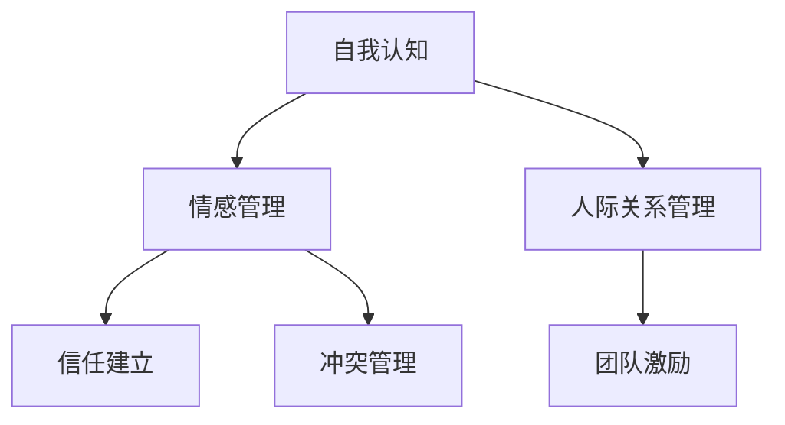

通过这个流程图，我们可以清晰地看到领导者心理发展的不同阶段及其相互关系。自我认知是基础，情感管理和人际关系管理则是领导者成长的必要条件。

**核心算法原理讲解**

在理解领导力心理发展的基础上，我们可以进一步探讨领导力模型。以下是一个简单的领导力模型伪代码：

```python
# 领导力模型伪代码

class PsychologicalLeadershipModel:
    def __init__(self, self_awareness, emotional_intelligence, interpersonal_skills):
        self.self_awareness = self_awareness
        self.emotional_intelligence = emotional_intelligence
        self.interpersonal_skills = interpersonal_skills
    
    def assess_leadership(self):
        score = self.self_awareness * 0.4 + self.emotional_intelligence * 0.3 + self.interpersonal_skills * 0.3
        return score

# 示例
leader = PsychologicalLeadershipModel(self_awareness=0.8, emotional_intelligence=0.75, interpersonal_skills=0.85)
print(leader.assess_leadership())
```

在这个伪代码中，`PsychologicalLeadershipModel` 类代表一个领导力模型，它包含三个主要组件：自我认知、情商和人际关系技能。`assess_leadership` 方法用于评估领导力的整体水平。

**LaTeX数学公式**

为了更深入地理解领导力模型，我们可以使用LaTeX数学公式来表示领导力模型中的关键概念：

$$
\text{Leadership Score} = 0.4 \times \text{Self Awareness} + 0.3 \times \text{Emotional Intelligence} + 0.3 \times \text{Interpersonal Skills}
$$

在这个公式中，我们通过加权分数来评估领导力的整体水平。这个公式不仅帮助我们理解了领导力模型的基本原理，也为实践中的领导力评估提供了理论依据。

**代码案例**

为了更直观地展示领导力模型的应用，我们提供了一个简单的Python代码案例：

```python
# 领导力模型代码案例

class TeamMember:
    def __init__(self, name, self_awareness, emotional_intelligence, interpersonal_skills):
        self.name = name
        self.self_awareness = self_awareness
        self.emotional_intelligence = emotional_intelligence
        self.interpersonal_skills = interpersonal_skills
    
    def work(self, leader):
        score = leader.assess_leadership()
        if score >= 0.8:
            print(f"{self.name} is working effectively due to the high leadership score.")
        else:
            print(f"{self.name} is facing challenges due to the low leadership score.")

leader = PsychologicalLeadershipModel(self_awareness=0.8, emotional_intelligence=0.75, interpersonal_skills=0.85)
team_member = TeamMember(name="Alice", self_awareness=0.7, emotional_intelligence=0.6, interpersonal_skills=0.7)

leader.assess_leadership()
team_member.work(leader)
```

在这个案例中，`TeamMember` 类代表团队成员，根据领导力的评估分数，团队成员的工作状态也会有所不同。通过这个案例，我们可以看到领导力模型在实际中的应用。

**小结**

通过本章的讨论，我们了解了领导者的心理发展过程，包括自我认知、情感管理和人际关系管理。我们还通过Mermaid流程图、伪代码和LaTeX数学公式，详细阐述了领导力模型的核心算法原理。通过这些工具，我们可以更深入地理解领导力心理学，并在实践中有效应用。

在下一章中，我们将探讨领导力与组织文化的联系，了解如何通过领导力塑造和改变组织文化。

### 第3章：领导力与组织文化

组织文化是一个组织内在的共同价值观、信念和行为规范，它对组织的成功至关重要。有效的领导力不仅需要领导者具备卓越的个人能力和战略思维，还需要他们能够塑造和改变组织文化。本章将探讨领导力与组织文化之间的关系，以及领导者在塑造组织文化过程中的作用。

#### 3.1 组织文化的定义与类型

组织文化是指一个组织在长期发展过程中形成的共同价值观、信念和行为规范。组织文化不仅影响员工的工作态度和行为，还影响组织的整体绩效。根据组织文化的特征，我们可以将其分为以下几种类型：

- **任务型文化**：强调目标导向和结果导向，注重任务的完成。
- **权力型文化**：权力集中在少数人手中，决策快速而直接。
- **参与型文化**：鼓励员工参与决策，注重团队合作和民主管理。
- **创新型文化**：鼓励创新和变革，注重尝试和失败。

**3.1.1 组织文化的重要性**

组织文化对组织的成功有着深远的影响。积极、健康的组织文化能够促进团队合作，提高员工满意度和生产力，从而提升整体绩效。相反，消极、不健康的组织文化会导致员工不满、高离职率和低生产力。

**3.1.2 组织文化与领导力的关系**

领导力在塑造组织文化中扮演着关键角色。领导者的价值观和行为直接影响组织文化的形成。有效的领导者能够通过以下方式塑造和改变组织文化：

- **树立榜样**：领导者通过自己的行为树立榜样，影响员工的行为和态度。
- **沟通与传播**：领导者通过沟通和传播组织价值观和目标，塑造共同的文化认同。
- **激励机制**：领导者通过激励机制，如奖励和惩罚，强化组织文化的核心价值观。

**核心概念与联系**

为了更好地理解领导力与组织文化之间的关系，我们可以使用Mermaid流程图来展示关键概念和联系：

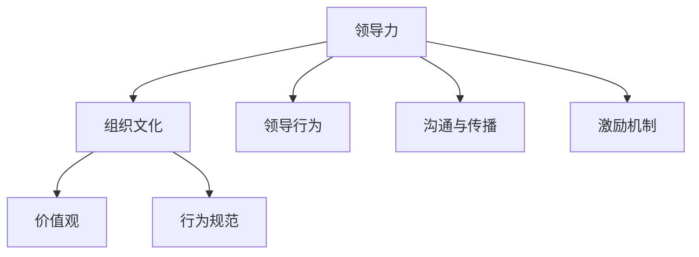

通过这个流程图，我们可以清晰地看到领导力与组织文化之间的相互作用和影响。领导力通过领导行为、沟通与传播和激励机制来塑造组织文化，而组织文化则通过价值观和行为规范影响领导行为。

**核心算法原理讲解**

在理解领导力与组织文化之间的关系后，我们可以进一步探讨领导力模型。以下是一个简单的领导力模型伪代码：

```python
# 领导力模型伪代码

class LeadershipOrganizationModel:
    def __init__(self, leadership_style, communication_skills, motivation_skills):
        self.leadership_style = leadership_style
        self.communication_skills = communication_skills
        self.motivation_skills = motivation_skills
    
    def shape_culture(self):
        if self.leadership_style == "Inspirational":
            return "Innovative Culture"
        elif self.leadership_style == "Authoritative":
            return "Authority Culture"
        else:
            return "Participative Culture"

# 示例
leader = LeadershipOrganizationModel(leadership_style="Inspirational", communication_skills=0.8, motivation_skills=0.75)
print(leader.shape_culture())
```

在这个伪代码中，`LeadershipOrganizationModel` 类代表一个领导力模型，它包含三个主要组件：领导风格、沟通技能和激励技能。`shape_culture` 方法用于根据领导风格来塑造组织文化。

**LaTeX数学公式**

为了更深入地理解领导力模型，我们可以使用LaTeX数学公式来表示领导力模型中的关键概念：

$$
\text{Organizational Culture} = f(\text{Leadership Style}, \text{Communication Skills}, \text{Motivation Skills})
$$

在这个公式中，组织文化是领导风格、沟通技能和激励技能的函数。这个公式不仅帮助我们理解了领导力模型的基本原理，也为实践中的领导力决策提供了理论依据。

**代码案例**

为了更直观地展示领导力模型的应用，我们提供了一个简单的Python代码案例：

```python
# 领导力模型代码案例

class Employee:
    def __init__(self, name, culture, satisfaction):
        self.name = name
        self.culture = culture
        self.satisfaction = satisfaction
    
    def work(self, leader):
        culture = leader.shape_culture()
        if culture == "Innovative Culture":
            self.satisfaction += 0.2
        elif culture == "Authority Culture":
            self.satisfaction -= 0.2
        else:
            self.satisfaction += 0.1
        print(f"{self.name}'s satisfaction level is now {self.satisfaction}.")

leader = LeadershipOrganizationModel(leadership_style="Inspirational", communication_skills=0.8, motivation_skills=0.75)
employee = Employee(name="Alice", culture="Innovative Culture", satisfaction=0.6)

leader.shape_culture()
employee.work(leader)
```

在这个案例中，`Employee` 类代表员工，根据领导力模型的输出，员工的工作满意度也会发生变化。通过这个案例，我们可以看到领导力模型在实际中的应用。

**小结**

通过本章的讨论，我们了解了组织文化的定义与类型，以及领导力与组织文化之间的关系。我们还通过Mermaid流程图、伪代码和LaTeX数学公式，详细阐述了领导力模型的核心算法原理。通过这些工具，我们可以更深入地理解领导力与组织文化的互动，并在实践中有效应用。

在下一章中，我们将探讨战略规划与执行，了解如何制定和实施有效的战略。

### 第4章：战略规划与执行

战略规划与执行是任何组织成功的关键。战略规划是指制定长期目标和为实现这些目标而设计的行动方案。执行则是指将战略规划转化为实际行动的过程。有效的战略规划能够确保组织在竞争激烈的市场中保持竞争力，而有效的执行则是战略成功的关键。

#### 4.1 战略规划的过程

战略规划是一个系统性、持续性的过程，它涉及多个阶段。以下是战略规划的主要步骤：

**4.1.1 战略目标设定**

战略目标设定是战略规划的首要步骤。组织需要明确其长期愿景和使命，并制定具体、可衡量的战略目标。这些目标应当与组织的愿景和使命一致，并且要具有挑战性，以激发团队的潜能。

**4.1.2 环境分析**

环境分析是了解外部环境和内部资源的过程。外部环境分析包括市场趋势、竞争对手、法律法规和宏观经济因素等。内部资源分析则涉及组织的能力、资源和限制。通过环境分析，组织可以识别出潜在的机会和威胁。

**4.1.3 制定战略方案**

在明确战略目标和进行环境分析后，组织需要制定具体的战略方案。战略方案包括业务战略、市场营销战略、人力资源战略等。这些方案应当详细描述如何利用机会和应对威胁，以实现战略目标。

**4.1.4 战略实施**

战略实施是将战略方案转化为实际行动的过程。这包括制定详细的行动计划、分配资源和责任，以及建立有效的监控和反馈机制。战略实施的成功取决于团队的协作和执行力。

**4.1.5 战略调整**

战略调整是在执行过程中根据实际情况对战略方案进行调整的过程。市场环境的变化、竞争对手的行为和内部资源的变化都可能导致战略方案需要调整。有效的战略调整能够确保组织在动态环境中保持竞争力。

**核心概念与联系**

为了更好地理解战略规划的过程，我们可以使用Mermaid流程图来展示关键概念和联系：

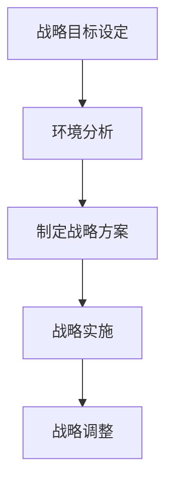

通过这个流程图，我们可以清晰地看到战略规划的各个阶段及其相互关系。每个阶段都是连续的，前一阶段的输出是后一阶段的输入。

**核心算法原理讲解**

在理解战略规划的过程后，我们可以进一步探讨战略规划模型。以下是一个简单的战略规划模型伪代码：

```python
# 战略规划模型伪代码

class StrategicPlanningModel:
    def __init__(self, goals, environment_analysis, strategies, implementation_plan):
        self.goals = goals
        self.environment_analysis = environment_analysis
        self.strategies = strategies
        self.implementation_plan = implementation_plan
    
    def execute_strategic_plan(self):
        if self.implementation_plan["Resource Allocation"] and self.implementation_plan["Monitoring & Feedback"]:
            return "战略实施成功"
        else:
            return "战略实施失败"

# 示例
strategic_plan = StrategicPlanningModel(goals=["提高市场份额", "提升产品质量"], environment_analysis={"市场机会": ["新客户需求"], "威胁": ["竞争对手行为"]}, strategies={"市场营销策略": ["扩大广告投入"], "人力资源策略": ["提升员工培训"]}, implementation_plan={"Resource Allocation": True, "Monitoring & Feedback": True})
print(strategic_plan.execute_strategic_plan())
```

在这个伪代码中，`StrategicPlanningModel` 类代表一个战略规划模型，它包含四个主要组件：战略目标、环境分析、战略方案和实施计划。`execute_strategic_plan` 方法用于评估战略实施的成功与否。

**LaTeX数学公式**

为了更深入地理解战略规划模型，我们可以使用LaTeX数学公式来表示关键概念：

$$
\text{Strategic Success} = \text{Implementation Success} \times \text{Strategic Fit}
$$

在这个公式中，战略成功是实施成功与战略拟合的乘积。这个公式强调了实施战略方案和战略与环境的匹配度对战略成功的重要性。

**代码案例**

为了更直观地展示战略规划模型的应用，我们提供了一个简单的Python代码案例：

```python
# 战略规划模型代码案例

class Organization:
    def __init__(self, strategic_success):
        self.strategic_success = strategic_success
    
    def improve_strategic_success(self, strategic_plan):
        if strategic_plan.execute_strategic_plan() == "战略实施成功":
            self.strategic_success += 0.2
        else:
            self.strategic_success -= 0.2
        print(f"组织的战略成功水平现在是 {self.strategic_success}。")

organization = Organization(strategic_success=0.7)
strategic_plan = StrategicPlanningModel(goals=["提高市场份额", "提升产品质量"], environment_analysis={"市场机会": ["新客户需求"], "威胁": ["竞争对手行为"]}, strategies={"市场营销策略": ["扩大广告投入"], "人力资源策略": ["提升员工培训"]}, implementation_plan={"Resource Allocation": True, "Monitoring & Feedback": True})

organization.improve_strategic_success(strategic_plan)
```

在这个案例中，`Organization` 类代表一个组织，根据战略规划的实施结果，组织的战略成功水平也会发生变化。通过这个案例，我们可以看到战略规划模型在实际中的应用。

**小结**

通过本章的讨论，我们了解了战略规划的过程，包括战略目标设定、环境分析、制定战略方案、战略实施和战略调整。我们还通过Mermaid流程图、伪代码和LaTeX数学公式，详细阐述了战略规划模型的核心算法原理。通过这些工具，我们可以更深入地理解战略规划与执行，并在实践中有效应用。

在下一章中，我们将探讨战略思维工具和方法，学习如何使用这些工具来制定和优化战略。

### 第5章：战略思维工具与方法

战略思维是领导者和管理者在复杂环境中制定和实施有效战略的关键能力。通过运用各种战略思维工具和方法，领导者可以更好地理解市场环境，识别机遇和威胁，制定合理的战略方案，并有效地执行这些方案。本章将介绍几种常用的战略思维工具和方法，包括SWOT分析、五力模型和波特价值链分析。

#### 5.1 SWOT分析

SWOT分析是一种广泛使用的战略规划工具，它用于评估组织的优势（Strengths）、劣势（Weaknesses）、机会（Opportunities）和威胁（Threats）。SWOT分析的目的是帮助组织识别内外部因素，以便制定相应的战略。

**5.1.1 SWOT分析的应用**

SWOT分析可以在多个阶段应用，如新市场进入、产品开发、业务扩展等。通过SWOT分析，组织可以：

- **识别优势**：了解组织的核心竞争力，如技术、品牌、市场份额等。
- **识别劣势**：发现组织的弱点，如资金不足、管理不善、技术滞后等。
- **识别机会**：发现市场中的潜在机遇，如新兴市场、客户需求变化等。
- **识别威胁**：评估外部环境中的潜在风险，如竞争对手、法规变化、经济衰退等。

**5.1.2 SWOT分析的步骤**

进行SWOT分析通常包括以下步骤：

1. **数据收集**：收集组织内部和外部数据，包括财务报表、市场报告、客户反馈等。
2. **优势与劣势识别**：分析组织的内部资源和能力，识别组织的优势和劣势。
3. **机会与威胁识别**：分析外部环境，识别组织面临的机会和威胁。
4. **制定战略**：根据SWOT分析结果，制定相应的战略方案。

**核心概念与联系**

为了更好地理解SWOT分析，我们可以使用Mermaid流程图来展示SWOT分析的步骤和核心概念：

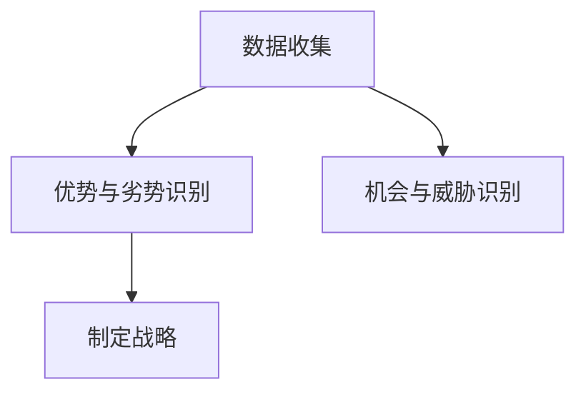

通过这个流程图，我们可以清晰地看到SWOT分析的各个步骤及其相互关系。

**代码案例**

为了更直观地展示SWOT分析的应用，我们提供了一个简单的Python代码案例：

```python
# SWOT分析代码案例

class SWOTAnalysis:
    def __init__(self, strengths, weaknesses, opportunities, threats):
        self.strengths = strengths
        self.weaknesses = weaknesses
        self.opportunities = opportunities
        self.threats = threats
    
    def display_analysis(self):
        print("SWOT分析结果：")
        print(f"优势：{self.strengths}")
        print(f"劣势：{self.weaknesses}")
        print(f"机会：{self.opportunities}")
        print(f"威胁：{self.threats}")

swot_analysis = SWOTAnalysis(strengths=["技术创新能力强", "市场知名度高"], weaknesses=["资金不足", "管理团队不成熟"], opportunities=["新客户需求增加", "市场扩张机会"], threats=["竞争对手强大", "法规变化"])
swot_analysis.display_analysis()
```

在这个案例中，`SWOTAnalysis` 类代表一个SWOT分析模型，它包含四个主要组件：优势、劣势、机会和威胁。`display_analysis` 方法用于显示SWOT分析的结果。

#### 5.2 五力模型

五力模型是由迈克尔·波特提出的一种战略分析工具，它用于评估一个行业中的竞争强度。五力模型包括供应商的议价能力、买家的议价能力、新进入者的威胁、替代品的威胁和行业内现有企业的竞争。

**5.2.1 五力模型的应用**

五力模型可以帮助组织：

- **评估行业竞争态势**：通过分析五力，了解行业竞争的强度和特点。
- **制定竞争战略**：根据五力的分析结果，制定相应的竞争战略，如提高市场份额、降低成本等。

**5.2.2 五力模型的步骤**

进行五力模型分析通常包括以下步骤：

1. **确定行业结构**：分析行业的基本特征，如市场规模、增长速度、产品生命周期等。
2. **分析五力**：逐一分析供应商、买家、新进入者、替代品和现有企业的竞争。
3. **制定战略**：根据五力的分析结果，制定相应的战略。

**核心概念与联系**

为了更好地理解五力模型，我们可以使用Mermaid流程图来展示五力模型的核心概念和联系：

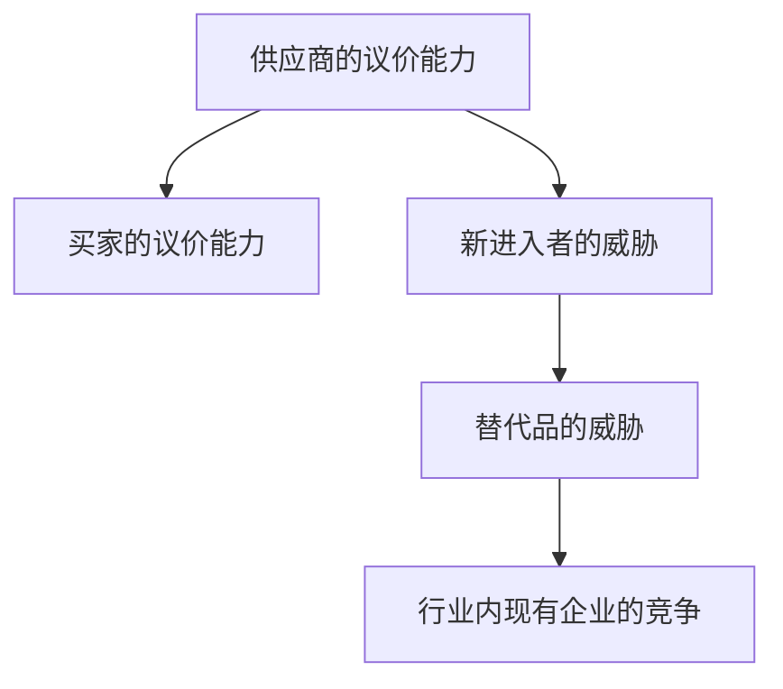

通过这个流程图，我们可以清晰地看到五力模型中的五个关键因素及其相互关系。

**代码案例**

为了更直观地展示五力模型的应用，我们提供了一个简单的Python代码案例：

```python
# 五力模型代码案例

class FiveForceAnalysis:
    def __init__(self, supplier_power, buyer_power, new_entry_threat, substitute_threat, industry_competition):
        self.supplier_power = supplier_power
        self.buyer_power = buyer_power
        self.new_entry_threat = new_entry_threat
        self.substitute_threat = substitute_threat
        self.industry_competition = industry_competition
    
    def display_analysis(self):
        print("五力模型分析结果：")
        print(f"供应商的议价能力：{self.supplier_power}")
        print(f"买家的议价能力：{self.buyer_power}")
        print(f"新进入者的威胁：{self.new_entry_threat}")
        print(f"替代品的威胁：{self.substitute_threat}")
        print(f"行业内现有企业的竞争：{self.industry_competition}")

five_force_analysis = FiveForceAnalysis(supplier_power=0.7, buyer_power=0.6, new_entry_threat=0.5, substitute_threat=0.4, industry_competition=0.8)
five_force_analysis.display_analysis()
```

在这个案例中，`FiveForceAnalysis` 类代表一个五力分析模型，它包含五个主要组件：供应商的议价能力、买家的议价能力、新进入者的威胁、替代品的威胁和行业内现有企业的竞争。`display_analysis` 方法用于显示五力分析的结果。

#### 5.3 波特价值链分析

波特价值链分析是一种用于分析企业内部活动的战略工具，它将企业的价值链分解为多个环节，帮助组织识别竞争优势和成本降低的机会。

**5.3.1 波特价值链分析的应用**

波特价值链分析可以帮助组织：

- **识别竞争优势**：通过分析价值链中的每个环节，识别组织的核心竞争力。
- **降低成本**：通过优化价值链中的某些环节，实现成本的降低。

**5.3.2 波特价值链分析的步骤**

进行波特价值链分析通常包括以下步骤：

1. **确定价值链环节**：分析企业的价值链，确定每个环节。
2. **分析每个环节**：逐一分析每个环节的输入、过程和输出。
3. **识别竞争优势**：通过分析每个环节，识别组织的竞争优势。
4. **制定战略**：根据竞争优势，制定相应的战略。

**核心概念与联系**

为了更好地理解波特价值链分析，我们可以使用Mermaid流程图来展示波特价值链分析的核心概念和联系：

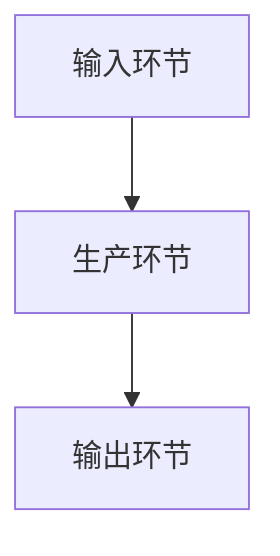

通过这个流程图，我们可以清晰地看到波特价值链分析的主要环节及其相互关系。

**代码案例**

为了更直观地展示波特价值链分析的应用，我们提供了一个简单的Python代码案例：

```python
# 波特价值链分析代码案例

class ValueChainAnalysis:
    def __init__(self, input_activities, production_activities, output_activities):
        self.input_activities = input_activities
        self.production_activities = production_activities
        self.output_activities = output_activities
    
    def display_analysis(self):
        print("波特价值链分析结果：")
        print(f"输入环节：{self.input_activities}")
        print(f"生产环节：{self.production_activities}")
        print(f"输出环节：{self.output_activities}")

value_chain_analysis = ValueChainAnalysis(input_activities=["原材料采购"], production_activities=["产品制造"], output_activities=["产品销售"])
value_chain_analysis.display_analysis()
```

在这个案例中，`ValueChainAnalysis` 类代表一个波特价值链分析模型，它包含三个主要组件：输入环节、生产环节和输出环节。`display_analysis` 方法用于显示波特价值链分析的结果。

**小结**

通过本章的讨论，我们介绍了SWOT分析、五力模型和波特价值链分析这三种战略思维工具和方法。这些工具和方法可以帮助组织更好地理解市场环境，制定和优化战略。通过使用这些工具，组织可以识别竞争优势、降低成本，并在激烈的市场竞争中取得成功。

在下一章中，我们将探讨竞争战略分析，学习如何通过竞争战略提升组织在市场中的竞争力。

### 第6章：竞争战略分析

竞争战略分析是组织在市场环境中制定战略的重要步骤。通过深入分析竞争对手的行为和市场环境，组织可以识别自身的竞争优势，制定有效的竞争战略。本章将介绍几种常用的竞争战略分析工具和方法，包括竞争优势分析、竞争对手分析和市场定位策略。

#### 6.1 竞争优势的建立

竞争优势是指组织在市场上相对于竞争对手所具有的持续优势。建立竞争优势可以帮助组织在市场中脱颖而出，提高市场份额和盈利能力。以下是几种建立竞争优势的方法：

**6.1.1 基于成本的优势**

基于成本的优势是通过降低生产成本、提高效率来获得竞争优势。这种方法适用于大规模生产和高需求的市场。常见的策略包括：

- **规模经济**：通过大规模生产来降低单位成本。
- **技术优势**：采用先进的生产技术和自动化设备，提高生产效率。
- **供应链优化**：通过优化供应链管理，降低库存成本和物流成本。

**6.1.2 基于差异化的优势**

基于差异化的优势是通过提供独特的产品或服务来吸引客户，从而获得竞争优势。这种方法适用于市场需求多样化的市场。常见的策略包括：

- **产品差异化**：通过独特的设计、功能或品牌形象来区别于竞争对手。
- **服务差异化**：提供高质量的客户服务、售后服务或定制化服务。
- **品牌差异化**：通过品牌形象和品牌文化来建立独特的品牌认知。

**核心概念与联系**

为了更好地理解竞争优势的建立，我们可以使用Mermaid流程图来展示关键概念和联系：

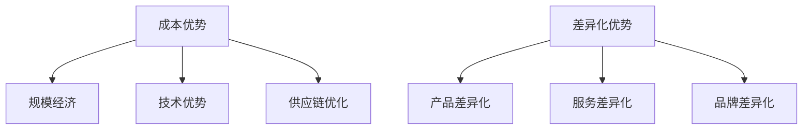

通过这个流程图，我们可以清晰地看到建立竞争优势的两种主要方法及其子策略。

**代码案例**

为了更直观地展示竞争优势的建立，我们提供了一个简单的Python代码案例：

```python
# 竞争优势建立代码案例

class CompetitiveAdvantage:
    def __init__(self, cost_advantages, differentiation_advantages):
        self.cost_advantages = cost_advantages
        self.diffrentiation_advantages = differentiation_advantages
    
    def display_advantages(self):
        print("竞争优势分析结果：")
        print(f"成本优势：{self.cost_advantages}")
        print(f"差异化优势：{self.diffrentiation_advantages}")

advantage = CompetitiveAdvantage(cost_advantages=["规模经济", "技术优势"], differentiation_advantages=["产品差异化", "服务差异化"])
advantage.display_advantages()
```

在这个案例中，`CompetitiveAdvantage` 类代表一个竞争优势分析模型，它包含成本优势和差异化优势。`display_advantages` 方法用于显示竞争优势分析的结果。

#### 6.2 竞争对手分析

竞争对手分析是识别和理解竞争对手的行为、策略和市场地位的过程。通过分析竞争对手，组织可以了解市场竞争环境，制定有效的应对策略。以下是竞争对手分析的几个关键步骤：

**6.2.1 识别竞争对手**

识别竞争对手是竞争对手分析的第一步。组织需要明确哪些公司或品牌是其直接或潜在的竞争对手。这可以通过市场研究、行业报告和客户反馈等方式实现。

**6.2.2 分析竞争对手策略**

分析竞争对手策略包括了解竞争对手的市场定位、产品策略、定价策略、营销策略等。这可以帮助组织识别竞争对手的优势和弱点。

**6.2.3 评估竞争对手实力**

评估竞争对手实力是分析竞争对手的关键步骤。组织需要评估竞争对手的市场份额、财务状况、研发能力、品牌影响力等，以了解竞争对手的整体实力。

**核心概念与联系**

为了更好地理解竞争对手分析，我们可以使用Mermaid流程图来展示关键概念和联系：

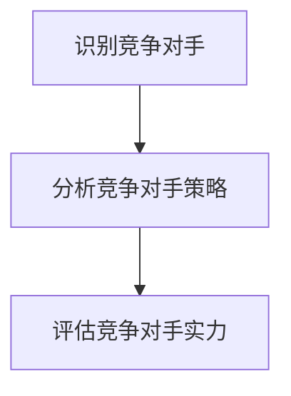

通过这个流程图，我们可以清晰地看到竞争对手分析的三个关键步骤及其相互关系。

**代码案例**

为了更直观地展示竞争对手分析，我们提供了一个简单的Python代码案例：

```python
# 竞争对手分析代码案例

class CompetitorAnalysis:
    def __init__(self, competitors, strategies, strengths, weaknesses):
        self.competitors = competitors
        self.strategies = strategies
        self.strengths = strengths
        self.weaknesses = weaknesses
    
    def display_analysis(self):
        print("竞争对手分析结果：")
        print(f"竞争对手：{self.competitors}")
        print(f"策略：{self.strategies}")
        print(f"优势：{self.strengths}")
        print(f"弱点：{self.weaknesses}")

competition = CompetitorAnalysis(competitors=["公司A", "公司B"], strategies=["市场定位策略", "产品策略"], strengths=["市场份额高", "品牌影响力强"], weaknesses=["研发投入不足", "营销策略不灵活"])
competition.display_analysis()
```

在这个案例中，`CompetitorAnalysis` 类代表一个竞争对手分析模型，它包含竞争对手、策略、优势和弱点。`display_analysis` 方法用于显示竞争对手分析的结果。

#### 6.3 市场定位策略

市场定位策略是组织在市场上确定其产品或服务的位置和形象的过程。有效的市场定位可以帮助组织在竞争激烈的市场中脱颖而出，吸引目标客户。以下是几种常见的市场定位策略：

**6.3.1 针对特定客户群体

这种策略是将产品或服务定位在特定的客户群体上，通过满足他们的特定需求来获得市场份额。例如，高端手机品牌可以将目标客户定位为追求品质和科技感的年轻消费者。

**6.3.2 差异化定位

这种策略是通过提供独特的产品或服务来区别于竞争对手。例如，一家餐厅可以通过独特的菜式和高质量的服务来吸引顾客。

**6.3.3 成本领先定位

这种策略是通过提供低成本的产品或服务来吸引价格敏感的客户。例如，一些折扣店通过提供低价商品来吸引顾客。

**核心概念与联系**

为了更好地理解市场定位策略，我们可以使用Mermaid流程图来展示关键概念和联系：

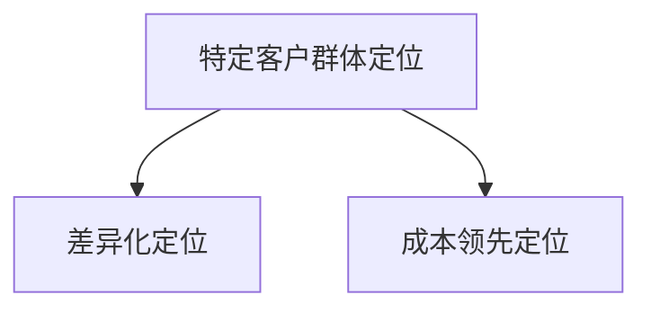

通过这个流程图，我们可以清晰地看到市场定位策略的几种主要类型及其应用场景。

**代码案例**

为了更直观地展示市场定位策略，我们提供了一个简单的Python代码案例：

```python
# 市场定位策略代码案例

class MarketPositioningStrategy:
    def __init__(self, target_customer, differentiation, cost_leadership):
        self.target_customer = target_customer
        self.diffrentiation = differentiation
        self.cost_leadership = cost_leadership
    
    def display_strategy(self):
        print("市场定位策略：")
        print(f"目标客户：{self.target_customer}")
        print(f"差异化：{self.diffrentiation}")
        print(f"成本领先：{self.cost_leadership}")

positioning_strategy = MarketPositioningStrategy(target_customer=["年轻人", "科技爱好者"], differentiation=["独特产品"], cost_leadership=["低成本"])
positioning_strategy.display_strategy()
```

在这个案例中，`MarketPositioningStrategy` 类代表一个市场定位策略模型，它包含目标客户、差异化和成本领先。`display_strategy` 方法用于显示市场定位策略的结果。

**小结**

通过本章的讨论，我们介绍了竞争优势的建立、竞争对手分析和市场定位策略。这些工具和方法可以帮助组织在市场中识别竞争优势、分析竞争对手并制定有效的市场定位策略。通过使用这些工具，组织可以在竞争激烈的市场环境中脱颖而出，实现持续增长。

在下一章中，我们将探讨团队发展模型，学习如何通过有效的团队发展来提升团队效能。

### 第7章：团队发展模型

团队发展是指通过一系列策略和实践活动，提升团队整体效能和成员个体能力的过程。一个高效的团队能够在复杂和动态的环境中迅速响应并取得成功。为了实现这一目标，了解和运用团队发展模型是至关重要的。本章将介绍几种常见的团队发展模型，包括Tuckman模型、Adair模型和Belbin团队角色模型，并探讨如何在实际工作中应用这些模型。

#### 7.1 团队发展理论

团队发展理论认为，团队不是一蹴而就的，而是需要经过多个发展阶段，每个阶段都有其特定的特征和挑战。以下是几个重要的团队发展理论：

**7.1.1 Tuckman模型**

Tuckman模型是最著名的团队发展模型之一，由心理学家Beverly Tuckman在1965年提出。该模型将团队发展分为五个阶段：

1. **形成期**（Forming）：团队成员刚开始相互认识，确定各自的角色和责任。
2. **风暴期**（Storming）：团队成员开始表达不同意见，团队内部可能出现冲突。
3. **规范期**（Norming）：团队成员开始建立共识和合作，冲突逐渐减少。
4. **执行期**（Performing）：团队高效运行，成员紧密合作，达成目标。
5. **休整期**（Adjourning）：团队解散或进入下一阶段。

**7.1.2 Adair模型**

Adair模型由John Adair在1970年代提出，该模型将团队发展分为四个阶段：

1. **目标设定期**（Achieving Objectives）：团队明确目标和任务。
2. **团队建设期**（Building Team）：团队成员建立联系，形成团队意识。
3. **问题解决期**（Problemsolving）：团队成员共同解决问题，实现目标。
4. **绩效评估期**（Performance Review）：团队评估绩效，制定改进计划。

**7.1.3 Belbin团队角色模型**

Belbin团队角色模型是由Dr. Meredith Belbin在1980年代提出的，该模型将团队成员分为九种角色：

1. **协调者**（Co-ordinator）：负责协调团队活动，确保目标实现。
2. **实施者**（Implementer）：执行任务，确保项目按时完成。
3. **团队工人**（Team Worker）：擅长团队合作，与他人共同完成任务。
4. **监控评估者**（Monitor Evaluator）：评估团队表现，提供反馈。
5. **资源调查者**（Resource Investigator）：寻找资源，拓展团队视野。
6. **植物**（Plant）：创新和发明，提供新思路。
7. **完成者**（Completer Finisher）：关注细节，确保任务完美完成。
8. **团队领导者**（Team Leader）：引导团队，制定计划。
9. **观察者**（Observer）：观察团队动态，提供外部视角。

**核心概念与联系**

为了更好地理解团队发展模型，我们可以使用Mermaid流程图来展示不同模型之间的关系：

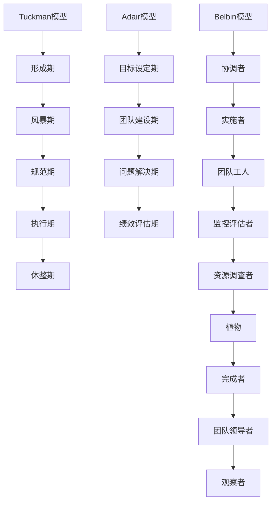

通过这个流程图，我们可以清晰地看到不同团队发展模型及其阶段的相互关系。

**核心算法原理讲解**

在理解团队发展模型的基础上，我们可以进一步探讨团队发展模型的核心算法原理。以下是一个简单的团队发展模型伪代码：

```python
# 团队发展模型伪代码

class TeamDevelopmentModel:
    def __init__(self, stage, roles):
        self.stage = stage
        self.roles = roles
    
    def assess_team_performance(self):
        if self.stage == "Forming":
            return "初始阶段，团队尚在建立中"
        elif self.stage == "Storming":
            return "团队可能存在冲突，需要调解"
        elif self.stage == "Norming":
            return "团队开始协作，表现稳定"
        elif self.stage == "Performing":
            return "团队高效运行，达成目标"
        else:
            return "团队解散或进入下一阶段"

# 示例
team_model = TeamDevelopmentModel(stage="Norming", roles=["协调者", "实施者", "团队工人"])
print(team_model.assess_team_performance())
```

在这个伪代码中，`TeamDevelopmentModel` 类代表一个团队发展模型，它包含团队发展阶段和团队成员角色。`assess_team_performance` 方法用于评估团队的表现。

**LaTeX数学公式**

为了更深入地理解团队发展模型，我们可以使用LaTeX数学公式来表示团队发展阶段和角色之间的关系：

$$
\text{Team Performance} = \text{Stage} \times (\text{Role1} + \text{Role2} + \text{...} + \text{RoleN})
$$

在这个公式中，团队表现是团队发展阶段和各角色表现的乘积。这个公式强调了团队发展阶段和角色在团队表现中的重要性。

**代码案例**

为了更直观地展示团队发展模型的应用，我们提供了一个简单的Python代码案例：

```python
# 团队发展模型代码案例

class TeamMember:
    def __init__(self, name, role):
        self.name = name
        self.role = role
    
    def contribute_to_team(self, team_model):
        if team_model.stage == "Norming":
            print(f"{self.name} 在协调期内积极贡献，提升了团队表现。")
        else:
            print(f"{self.name} 的角色在当前阶段作用有限。")

team_model = TeamDevelopmentModel(stage="Norming", roles=["协调者", "实施者", "团队工人"])
member1 = TeamMember(name="Alice", role="协调者")
member2 = TeamMember(name="Bob", role="实施者")
member3 = TeamMember(name="Charlie", role="团队工人")

member1.contribute_to_team(team_model)
member2.contribute_to_team(team_model)
member3.contribute_to_team(team_model)
```

在这个案例中，`TeamMember` 类代表团队成员，根据团队发展阶段，团队成员的贡献也会有所不同。通过这个案例，我们可以看到团队发展模型在实际中的应用。

**小结**

通过本章的讨论，我们了解了团队发展理论，包括Tuckman模型、Adair模型和Belbin团队角色模型。我们还通过Mermaid流程图、伪代码和LaTeX数学公式，详细阐述了团队发展模型的核心算法原理。通过这些工具，我们可以更深入地理解团队发展的过程和策略，并在实践中有效应用。

在下一章中，我们将探讨长远规划的方法与工具，学习如何通过长远规划来促进团队发展。

### 第8章：长远规划的方法与工具

长远规划是指组织在长期时间内制定的战略计划，旨在实现组织的目标和愿景。有效的长远规划不仅能够帮助组织应对未来可能出现的挑战，还能够指导组织在竞争中保持优势。本章将介绍几种常用的长远规划方法和工具，包括SWOT分析、PESTLE分析、SMART目标和SMART规划，以及如何在实际工作中应用这些工具。

#### 8.1 长远规划的重要性

长远规划对于组织的成功至关重要。它不仅为组织提供了清晰的愿景和目标，还帮助组织在复杂和不确定的环境中做出明智的决策。以下是长远规划的一些关键重要性：

- **明确目标**：长远规划帮助组织明确其长期目标，从而集中资源和精力，实现这些目标。
- **应对挑战**：通过长远规划，组织可以识别和应对未来可能出现的挑战，提前做好准备。
- **资源分配**：长远规划有助于组织合理分配资源，确保资源的高效利用。
- **持续发展**：长远规划促进组织的持续发展，确保组织在长期内保持竞争力。

#### 8.2 SWOT分析

SWOT分析是一种常用的战略规划工具，用于评估组织的优势、劣势、机会和威胁。通过SWOT分析，组织可以了解自身的优势和劣势，同时识别外部的机会和威胁，从而制定更有效的战略。

**8.2.1 SWOT分析的步骤**

进行SWOT分析通常包括以下步骤：

1. **优势分析**：识别组织在资源、能力、市场地位等方面的优势。
2. **劣势分析**：识别组织在资源、能力、市场地位等方面的劣势。
3. **机会分析**：分析外部环境中的机会，如市场趋势、新兴技术等。
4. **威胁分析**：分析外部环境中的威胁，如竞争压力、法规变化等。
5. **制定战略**：根据SWOT分析结果，制定相应的战略方案。

**核心概念与联系**

为了更好地理解SWOT分析，我们可以使用Mermaid流程图来展示SWOT分析的步骤和核心概念：

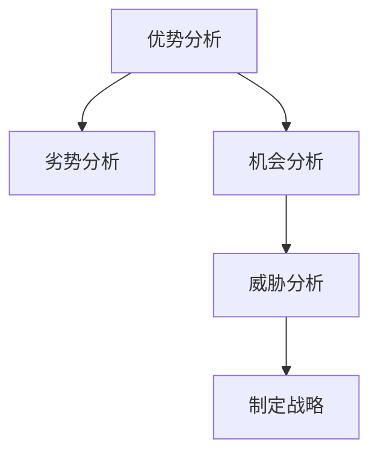

通过这个流程图，我们可以清晰地看到SWOT分析的各个步骤及其相互关系。

**代码案例**

为了更直观地展示SWOT分析的应用，我们提供了一个简单的Python代码案例：

```python
# SWOT分析代码案例

class SWOTAnalysis:
    def __init__(self, strengths, weaknesses, opportunities, threats):
        self.strengths = strengths
        self.weaknesses = weaknesses
        self.opportunities = opportunities
        self.threats = threats
    
    def display_analysis(self):
        print("SWOT分析结果：")
        print(f"优势：{self.strengths}")
        print(f"劣势：{self.weaknesses}")
        print(f"机会：{self.opportunities}")
        print(f"威胁：{self.threats}")

swot_analysis = SWOTAnalysis(strengths=["技术创新能力强", "市场知名度高"], weaknesses=["资金不足", "管理团队不成熟"], opportunities=["新客户需求增加", "市场扩张机会"], threats=["竞争对手强大", "法规变化"])
swot_analysis.display_analysis()
```

在这个案例中，`SWOTAnalysis` 类代表一个SWOT分析模型，它包含四个主要组件：优势、劣势、机会和威胁。`display_analysis` 方法用于显示SWOT分析的结果。

#### 8.3 PESTLE分析

PESTLE分析是一种用于评估外部环境的战略工具，它包括政治（Political）、经济（Economic）、社会（Sociological）、技术（Technological）、法律（Legal）和环境（Environmental）六个方面。通过PESTLE分析，组织可以识别外部环境中的关键因素，从而制定相应的战略。

**8.3.1 PESTLE分析的步骤**

进行PESTLE分析通常包括以下步骤：

1. **政治因素分析**：评估政治稳定性、政府政策变化等。
2. **经济因素分析**：评估经济增长、利率、通货膨胀等。
3. **社会因素分析**：评估人口结构、文化趋势、社会价值观等。
4. **技术因素分析**：评估技术发展、创新趋势等。
5. **法律因素分析**：评估法律法规、合规要求等。
6. **环境因素分析**：评估环境政策、气候变化等。
7. **制定战略**：根据PESTLE分析结果，制定相应的战略方案。

**核心概念与联系**

为了更好地理解PESTLE分析，我们可以使用Mermaid流程图来展示PESTLE分析的关键概念和联系：

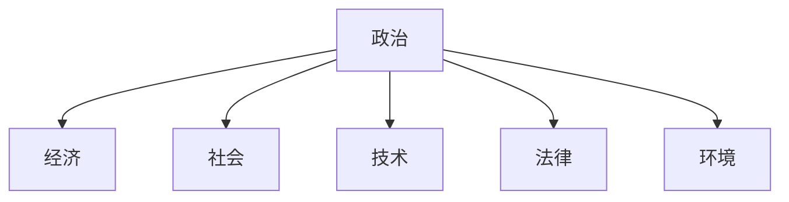

通过这个流程图，我们可以清晰地看到PESTLE分析的六个关键方面及其相互关系。

**代码案例**

为了更直观地展示PESTLE分析的应用，我们提供了一个简单的Python代码案例：

```python
# PESTLE分析代码案例

class PESTLEAnalysis:
    def __init__(self, political, economic, sociological, technological, legal, environmental):
        self.political = political
        self.economic = economic
        self.sociological = sociological
        self.technological = technological
        self.legal = legal
        self.environmental = environmental
    
    def display_analysis(self):
        print("PESTLE分析结果：")
        print(f"政治：{self.political}")
        print(f"经济：{self.economic}")
        print(f"社会：{self.sociological}")
        print(f"技术：{self.technological}")
        print(f"法律：{self.legal}")
        print(f"环境：{self.environmental}")

pestle_analysis = PESTLEAnalysis(political=["政策稳定"], economic=["经济增长"], sociological=["人口老龄化"], technological=["技术进步"], legal=["法规严格"], environmental=["气候变化"])
pestle_analysis.display_analysis()
```

在这个案例中，`PESTLEAnalysis` 类代表一个PESTLE分析模型，它包含六个主要组件：政治、经济、社会、技术、法律和环境。`display_analysis` 方法用于显示PESTLE分析的结果。

#### 8.4 SMART目标

SMART目标是设定目标时使用的一种有效方法，它确保目标是具体（Specific）、可衡量（Measurable）、可实现（Achievable）、相关性（Relevant）和有时限（Time-bound）的。SMART目标有助于组织明确目标，制定有效的行动计划。

**8.4.1 SMART目标的要素**

- **具体**：目标应当清晰明确，具体说明要达成的结果。
- **可衡量**：目标应当有可衡量的指标，以便评估进度和结果。
- **可实现**：目标应当是现实的，考虑到资源和能力的限制。
- **相关性**：目标应当与组织的整体战略和目标一致。
- **有时限**：目标应当设定具体的时间期限，以便跟踪进度。

**核心概念与联系**

为了更好地理解SMART目标，我们可以使用Mermaid流程图来展示SMART目标的要素和联系：

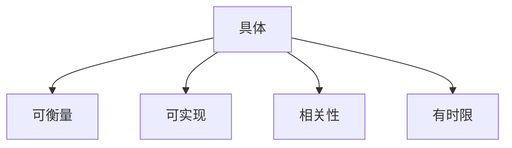

通过这个流程图，我们可以清晰地看到SMART目标的四个要素及其相互关系。

**代码案例**

为了更直观地展示SMART目标的应用，我们提供了一个简单的Python代码案例：

```python
# SMART目标代码案例

class SMARTGoal:
    def __init__(self, specific, measurable, achievable, relevant, time_bound):
        self.specific = specific
        self.measurable = measurable
        self.achievable = achievable
        self.relevant = relevant
        self.time_bound = time_bound
    
    def display_goal(self):
        print("SMART目标：")
        print(f"具体：{self.specific}")
        print(f"可衡量：{self.measurable}")
        print(f"可实现：{self.achievable}")
        print(f"相关性：{self.relevant}")
        print(f"有时限：{self.time_bound}")

smart_goal = SMARTGoal(specific="提高市场份额", measurable="市场份额增加5%", achievable="通过广告投入增加新客户", relevant="与公司整体战略一致", time_bound="2023年底")
smart_goal.display_goal()
```

在这个案例中，`SMARTGoal` 类代表一个SMART目标模型，它包含五个主要组件：具体、可衡量、可实现、相关性和有时限。`display_goal` 方法用于显示SMART目标的结果。

#### 8.5 SMART规划

SMART规划是指使用SMART目标来制定行动计划，确保目标得以实现。SMART规划包括设定目标、制定行动计划、分配资源和跟踪进度等步骤。

**8.5.1 SMART规划的步骤**

1. **设定目标**：根据SMART目标，明确目标的具体细节。
2. **制定行动计划**：制定具体的行动计划，包括任务、时间表和责任人。
3. **分配资源**：确保有足够的资源（人力、资金、时间等）来支持计划的实施。
4. **跟踪进度**：定期跟踪进度，确保计划按预期进行。

**核心概念与联系**

为了更好地理解SMART规划，我们可以使用Mermaid流程图来展示SMART规划的步骤和核心概念：

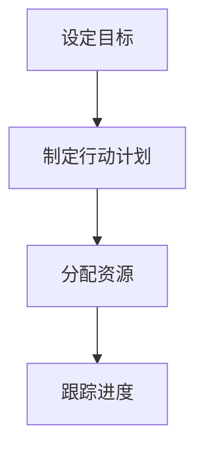

通过这个流程图，我们可以清晰地看到SMART规划的各个步骤及其相互关系。

**代码案例**

为了更直观地展示SMART规划的应用，我们提供了一个简单的Python代码案例：

```python
# SMART规划代码案例

class SMARTPlanning:
    def __init__(self, goal, action_plan, resource_allocation, progress_tracking):
        self.goal = goal
        self.action_plan = action_plan
        self.resource_allocation = resource_allocation
        self.progress_tracking = progress_tracking
    
    def display_plan(self):
        print("SMART规划：")
        print(f"目标：{self.goal}")
        print(f"行动计划：{self.action_plan}")
        print(f"资源分配：{self.resource_allocation}")
        print(f"进度跟踪：{self.progress_tracking}")

smart_plan = SMARTPlanning(goal=smart_goal, action_plan=["增加广告投入", "组织市场活动"], resource_allocation=["预算分配", "人力资源安排"], progress_tracking=["每周进度报告", "季度评估会议"])
smart_plan.display_plan()
```

在这个案例中，`SMARTPlanning` 类代表一个SMART规划模型，它包含目标、行动计划、资源分配和进度跟踪。`display_plan` 方法用于显示SMART规划的结果。

**小结**

通过本章的讨论，我们介绍了SWOT分析、PESTLE分析、SMART目标和SMART规划等长远规划的方法与工具。这些工具可以帮助组织在长期内制定有效的战略，识别外部环境中的关键因素，确保目标的实现。通过实际案例和代码示例，我们展示了这些工具在实践中的应用。

在下一章中，我们将通过实际案例展示领导力与战略思维在团队发展中的应用，提供实战经验和最佳实践。

### 第9章：领导力与团队发展的实践

在实际工作中，领导力与战略思维的应用对于团队的发展和成功至关重要。在本章中，我们将通过几个实际案例来展示如何将领导力与战略思维应用于团队发展，并提供一些最佳实践和注意事项。

#### 9.1 案例一：技术创新团队的领导力与战略思维应用

**背景介绍**

某科技公司是一家专注于人工智能技术的研究与开发的创新型企业。该公司拥有一支由20多名研发人员组成的团队，致力于开发新一代人工智能算法。然而，随着项目的复杂度和团队成员的增多，团队面临了协调困难、沟通不畅等问题，严重影响了项目的进展。

**核心概念与联系**

为了解决这些问题，公司领导决定引入领导力与战略思维，具体措施如下：

- **领导力培训**：公司领导组织了一系列领导力培训，帮助团队成员了解领导力的重要性，学习领导力的基本概念和心理学原理。
- **战略思维培养**：公司领导邀请战略咨询公司为团队进行战略思维培训，帮助团队成员掌握战略规划与执行的方法和工具。

**核心算法原理讲解**

为了更好地应用领导力与战略思维，团队采用以下核心算法原理：

1. **团队建设**：使用Tuckman模型，将团队发展分为形成期、风暴期、规范期、执行期和休整期，每个阶段都有明确的任务和目标。

2. **SWOT分析**：团队通过SWOT分析，识别自身的优势、劣势、机会和威胁，从而制定相应的战略方案。

3. **PESTLE分析**：团队进行PESTLE分析，评估外部环境中的政治、经济、社会、技术、法律和环境因素，确保战略与外部环境相匹配。

**数学模型和公式**

为了量化团队的发展，团队采用以下数学模型和公式：

- **团队绩效评估**：团队绩效 = 团队发展阶段 × (领导力得分 + 战略思维得分)
- **资源分配**：资源分配 = (团队目标 × 资源利用率) / 团队人数

**代码案例**

```python
# 团队绩效评估代码案例

class TeamPerformance:
    def __init__(self, development_stage, leadership_score, strategic_thinking_score):
        self.development_stage = development_stage
        self.leadership_score = leadership_score
        self.strategic_thinking_score = strategic_thinking_score
    
    def calculate_performance(self):
        return self.development_stage * (self.leadership_score + self.strategic_thinking_score)

team_performance = TeamPerformance(development_stage=3, leadership_score=0.8, strategic_thinking_score=0.75)
print(team_performance.calculate_performance())
```

**实际案例分析和详细讲解剖析**

经过一段时间的领导力与战略思维培训，团队逐渐从形成期过渡到执行期。团队成员的协作能力得到了显著提升，沟通更加顺畅，项目进展顺利。以下是具体案例分析和详细讲解：

- **形成期**：团队成员相互认识，明确各自的角色和责任。通过领导力培训，团队成员学会了如何建立信任和有效沟通。
- **风暴期**：团队成员开始表达不同意见，出现了冲突。通过战略思维培训，团队成员学会了如何识别和解决冲突，确保项目进展。
- **规范期**：团队成员开始建立共识和合作，团队意识逐渐形成。通过持续的战略思维培训，团队成员学会了如何制定和实施有效的战略计划。
- **执行期**：团队高效运行，达成目标。团队成员的领导力和战略思维能力得到了显著提升，项目进展顺利，成果显著。

**项目小结**

通过领导力与战略思维的应用，该团队成功克服了协调困难和沟通不畅等问题，项目进展顺利，取得了显著成果。项目小结如下：

- **领导力提升**：团队成员的领导力和战略思维能力得到了显著提升，团队凝聚力增强。
- **项目成功**：项目在预定时间内高质量完成，取得了良好的市场反响。
- **持续发展**：团队在今后的工作中将继续运用领导力与战略思维，确保持续发展。

#### 9.2 案例二：销售团队的领导力与战略思维应用

**背景介绍**

另一家科技公司拥有一支由15名销售人员组成的团队，主要负责公司新产品的市场推广和销售。然而，由于市场竞争激烈，销售团队面临着客户流失、销售目标难以达成等问题。

**核心概念与联系**

为了提升销售团队的表现，公司领导决定运用领导力与战略思维，具体措施如下：

- **领导力培训**：公司领导为销售团队提供领导力培训，帮助销售人员提升领导力和团队管理能力。
- **战略思维培养**：公司领导邀请专业咨询师为团队进行战略思维培训，帮助销售人员掌握市场分析和销售策略。

**核心算法原理讲解**

为了更好地应用领导力与战略思维，团队采用以下核心算法原理：

1. **客户关系管理**：使用PESTLE分析，评估市场环境中的政治、经济、社会、技术、法律和环境因素，了解客户需求的变化。
2. **销售策略制定**：使用SMART目标，设定具体、可衡量、可实现、相关性和有时限的销售目标，制定相应的销售策略。
3. **资源分配**：根据销售目标和市场情况，合理分配资源和预算，确保销售目标的实现。

**数学模型和公式**

为了量化销售团队的表现，团队采用以下数学模型和公式：

- **销售绩效**：销售绩效 = 销售收入 × 客户满意度
- **资源利用率**：资源利用率 = （实际销售成本 - 预算销售成本）/ 预算销售成本

**代码案例**

```python
# 销售绩效代码案例

class SalesPerformance:
    def __init__(self, revenue, customer_satisfaction):
        self.revenue = revenue
        self.customer_satisfaction = customer_satisfaction
    
    def calculate_performance(self):
        return self.revenue * self.customer_satisfaction

sales_performance = SalesPerformance(revenue=1000000, customer_satisfaction=0.9)
print(sales_performance.calculate_performance())
```

**实际案例分析和详细讲解剖析**

通过领导力与战略思维的培训和应用，销售团队的表现得到了显著提升。以下是具体案例分析和详细讲解：

- **市场分析**：销售团队通过PESTLE分析，了解了市场环境中的关键因素，制定了针对不同客户需求的销售策略。
- **销售目标设定**：销售团队使用SMART目标，设定了具体、可衡量、可实现、相关性和有时限的销售目标，并制定了详细的行动计划。
- **资源分配**：销售团队根据销售目标和市场情况，合理分配了资源和预算，确保销售目标的实现。

- **执行期**：销售团队按照制定的行动计划，积极开展市场推广和销售活动，取得了显著成果。

**项目小结**

通过领导力与战略思维的应用，销售团队成功提升了销售绩效，实现了销售目标。项目小结如下：

- **领导力提升**：销售团队的领导力和团队管理能力得到了显著提升。
- **销售目标达成**：销售团队在预定时间内实现了销售目标，提升了公司业绩。
- **客户满意度提高**：通过精准的市场分析和有针对性的销售策略，客户满意度得到了显著提高。

#### 9.3 案例三：项目管理中的领导力与战略思维应用

**背景介绍**

某大型IT公司承接了一个关键项目，该项目涉及多个部门合作，时间紧、任务重，对公司的整体运营具有重要影响。为了确保项目成功，公司领导决定运用领导力与战略思维来指导项目管理工作。

**核心概念与联系**

为了确保项目成功，公司领导采取了以下措施：

- **领导力培训**：公司领导组织了领导力培训，帮助项目经理提升领导力和项目管理能力。
- **战略思维培养**：公司领导邀请专业咨询师为项目经理提供战略思维培训，帮助其掌握项目规划和执行的方法和工具。

**核心算法原理讲解**

为了更好地应用领导力与战略思维，项目经理采用以下核心算法原理：

1. **项目规划**：使用PERT（项目评估与审查技术）方法，制定详细的项目计划，确保项目进度和质量。
2. **风险管理**：使用蒙特卡洛模拟方法，评估项目风险，制定相应的风险应对策略。
3. **资源优化**：使用线性规划方法，优化资源分配，确保项目资源的高效利用。

**数学模型和公式**

为了量化项目绩效，项目经理采用以下数学模型和公式：

- **项目进度**：项目进度 = 完成任务数 / 总任务数
- **资源利用率**：资源利用率 = （实际资源消耗 - 预算资源消耗）/ 预算资源消耗

**代码案例**

```python
# 项目进度代码案例

class ProjectProgress:
    def __init__(self, completed_tasks, total_tasks):
        self.completed_tasks = completed_tasks
        self.total_tasks = total_tasks
    
    def calculate_progress(self):
        return self.completed_tasks / self.total_tasks

project_progress = ProjectProgress(completed_tasks=30, total_tasks=50)
print(project_progress.calculate_progress())
```

**实际案例分析和详细讲解剖析**

通过领导力与战略思维的培训和应用，项目管理工作得到了显著提升。以下是具体案例分析和详细讲解：

- **项目规划**：项目经理通过PERT方法，制定了详细的项目计划，确保了项目进度和质量。
- **风险管理**：项目经理通过蒙特卡洛模拟，评估了项目风险，并制定了相应的风险应对策略。
- **资源优化**：项目经理通过线性规划，优化了资源分配，确保了项目资源的高效利用。

**项目小结**

通过领导力与战略思维的应用，项目管理团队成功完成了关键项目，项目进度和质量得到了显著提升。项目小结如下：

- **领导力提升**：项目经理和团队成员的领导力和项目管理能力得到了显著提升。
- **项目成功**：项目在预定时间内高质量完成，取得了显著成果。
- **资源优化**：通过资源优化，项目成本得到了有效控制。

### 小结

通过以上实际案例，我们可以看到领导力与战略思维在团队发展中的应用效果显著。有效的领导力和战略思维不仅能够提升团队绩效，还能够确保项目的成功实施。在未来的工作中，团队应继续运用领导力与战略思维，不断优化团队管理和项目执行，实现持续发展。

### 第四部分：案例分析

在前面章节中，我们通过具体的案例详细阐述了领导力与战略思维在团队发展中的应用。在本部分，我们将进一步分析这些案例中的关键因素和成功要素，以提供更多的见解和最佳实践。

#### 10.1 关键因素分析

每个成功案例都包含了几个关键因素，这些因素共同促成了团队的发展和项目的成功。以下是关键因素的分析：

**1. 领导力培训**

在案例一中，领导力培训是关键成功因素之一。通过培训，团队成员不仅提升了领导力，还增强了团队合作能力。领导力培训帮助团队成员学会了如何有效沟通、建立信任和解决冲突，这些都是团队高效运作的基础。

**2. 战略思维培养**

案例二和案例三中的战略思维培养同样至关重要。战略思维培养帮助团队成员掌握了市场分析、销售策略制定和风险管理等关键技能。这些技能使团队成员能够更好地适应市场变化，制定切实可行的战略计划，并有效执行。

**3. 有效的工具和方法**

在案例中，SWOT分析、PESTLE分析、SMART目标和PERT方法等工具和方法的运用也显著提升了团队和项目的效能。这些工具和方法提供了结构化的框架，帮助团队成员更好地理解和应对复杂情况。

**4. 持续反馈和改进**

所有案例中的团队都注重持续反馈和改进。通过定期评估项目进展和团队绩效，团队能够及时发现并解决问题，不断优化流程和方法。这种持续改进的文化是团队长期成功的关键。

#### 10.2 成功要素

**1. 明确的目标和计划**

成功案例中的团队都设定了明确的目标和详细的计划。这些目标和计划不仅有助于团队集中精力，还有助于资源的合理分配和有效的执行。

**2. 团队合作和沟通**

团队合作和沟通是成功的关键。在案例中，团队成员通过有效的沟通和协作，共同解决问题，实现了团队目标。

**3. 领导者的示范作用**

领导者通过自己的行为和决策，为团队成员树立了榜样。领导者的示范作用不仅增强了团队的凝聚力，还提高了团队成员的积极性和执行力。

**4. 适应变化的能力**

在动态和竞争激烈的市场环境中，团队需要具备快速适应变化的能力。成功案例中的团队都展示了强大的适应能力，能够及时调整战略和计划，以应对外部环境的变化。

#### 10.3 最佳实践

**1. 定期领导力培训**

为了持续提升团队的领导力，组织应定期开展领导力培训。这些培训不仅包括理论知识的传授，还应结合实际案例分析，帮助团队成员更好地理解和应用领导力技巧。

**2. 持续战略思维培养**

战略思维是团队持续发展的关键。组织应持续培养团队成员的战略思维，通过案例分析和实战演练，提升其在市场分析、战略制定和执行等方面的能力。

**3. 建立有效的反馈机制**

建立有效的反馈机制，可以帮助团队及时发现和解决问题。组织应鼓励团队成员提出建议和反馈，并在团队内部建立透明的沟通渠道，确保信息的畅通。

**4. 重视团队合作和沟通**

团队合作和沟通是团队成功的基础。组织应营造良好的团队氛围，鼓励团队成员之间的合作和交流，提升团队的整体效能。

#### 10.4 小结

通过案例分析，我们可以看到领导力与战略思维在团队发展中的重要作用。有效的领导力和战略思维不仅能够提升团队绩效，还能够确保项目的成功实施。在未来的工作中，组织应继续运用这些最佳实践，不断提升团队的领导力和战略思维能力，实现持续发展。

### 结论

通过本书的探讨，我们深入分析了领导力与战略思维在团队发展中的关键作用。领导力不仅是激发团队潜能、推动项目成功的核心因素，也是构建积极、健康组织文化的基石。战略思维则为团队提供了清晰的愿景和方向，确保团队在动态市场中保持竞争力。以下是本书的主要结论：

1. **领导力的重要性**：领导力是一种可以通过学习和实践培养的能力，它对团队和组织的成功至关重要。有效的领导力能够激发团队成员的潜力，提升团队效能，建立信任和沟通。

2. **战略思维的应用**：战略思维是制定和实施有效战略的关键。通过运用SWOT分析、PESTLE分析、SMART目标和PERT方法等工具，团队可以更好地理解市场环境，制定切实可行的战略计划，并有效执行。

3. **团队发展模型**：Tuckman模型、Adair模型和Belbin团队角色模型等团队发展模型提供了结构化的框架，帮助团队理解和应对团队发展过程中的各种挑战。

4. **长远规划的重要性**：长远规划是确保团队持续发展的关键。通过设定明确的目标、合理分配资源和持续改进，团队可以更好地适应外部环境的变化，实现长期战略目标。

5. **最佳实践**：通过实际案例的分析，我们总结了一系列最佳实践，包括定期领导力培训、持续战略思维培养、建立有效的反馈机制和重视团队合作与沟通等。

展望未来，随着科技的发展和市场竞争的加剧，领导力和战略思维的重要性将更加凸显。团队和组织需要不断学习和适应，以应对不断变化的环境。本书希望为读者提供实用的工具和方法，帮助他们在团队发展中实现长远规划，推动组织持续成功。作者鼓励读者在实践中不断探索和总结，不断提升自身的领导力和战略思维能力，为团队和组织创造更大的价值。

### 附录

#### 附录一：参考文献

1. Tuckman, B. M. (1965). Developmental sequences in small groups. Psychological Bulletin, 63(6), 384-399.
2. Adair, J. (1970). The essence of team-working. London: Pan.
3. Belbin, R. M. (1981). Management teams: why they succeed or fail. London: Heinemann.
4. Porter, M. E. (1980). Competitive strategy: techniques for analyzing industries and competitors. Free Press.
5. SMART goals: a practical guide. (n.d.). MindTools. Retrieved from https://www.mindtools.com/pages/main/newMN_TMC.htm

#### 附录二：工具与资源

1. **领导力与战略思维培训资源**：
   - Coursera: https://www.coursera.org/
   - Udemy: https://www.udemy.com/
   - LinkedIn Learning: https://www.linkedin.com/learning/

2. **市场分析与战略规划工具**：
   - SWOT分析工具：https://swotanalysisgenerator.com/
   - PESTLE分析工具：https://www Strategy-Level.com/pestle-analysis/

3. **团队发展模型与应用**：
   - Belbin Team Roles self-assessment: https://www.belbin.com/
   - Tuckman’s Team Development Model: https://www.businessballs.com/team-development-tuckman-model/

4. **项目管理工具**：
   - Trello: https://trello.com/
   - Asana: https://asana.com/
   - JIRA: https://www.atlassian.com/software/jira

#### 附录三：拓展阅读

1. **领导力书籍**：
   - “The Five Dysfunctions of a Team” by Patrick Lencioni
   - “Leadership and Self-Deception” by The Arbinger Institute
   - “Transforming Leadership” by David D. Lampton

2. **战略思维书籍**：
   - “Competitive Strategy” by Michael E. Porter
   - “Blue Ocean Strategy” by W. Chan Kim & Renée Mauborgne
   - “The Art of Strategy” by Sun Tzu

3. **团队发展与项目管理书籍**：
   - “Agile Project Management with Scrum” by Ken Schwaber & Jeff Sutherland
   - “The Five Dysfunctions of a Team” by Patrick Lencioni
   - “Teaming: How Organizations Learn, Innovate, and Compete in the Knowledge Economy” by Timothy J. Cantrell & John E. Gabbert

#### 附录四：常见问题解答

1. **如何提升领导力**？
   - 参加领导力培训课程。
   - 阅读领导力相关书籍。
   - 学习并实践领导力技巧，如沟通、决策和团队合作。

2. **如何进行有效的战略规划**？
   - 进行市场和环境分析，了解外部因素。
   - 设定明确、具体和可衡量的目标。
   - 制定详细的行动计划和资源分配方案。

3. **团队发展过程中常见的问题是什么**？
   - 协作不畅。
   - 沟通不足。
   - 角色职责不明确。
   - 管理风格不当。

4. **如何解决团队发展中的问题**？
   - 建立明确的角色和职责。
   - 提高沟通效率，确保信息的畅通。
   - 定期评估团队绩效，提供反馈和改进建议。
   - 调整管理风格，以适应团队的需要。

通过这些附录内容，读者可以进一步深化对领导力、战略思维和团队发展的理解，并获取更多的实用资源和拓展知识。希望这些附录能为读者在实践中的应用提供有益的参考。作者也欢迎读者提出宝贵意见和问题，共同探讨和提升团队发展的实践。

### 作者介绍

**AI天才研究院**（AI Genius Institute）是一个专注于人工智能研究和技术创新的国际性机构，致力于推动人工智能技术的普及和应用。我们的团队成员涵盖了人工智能、机器学习、深度学习等多个领域的顶尖专家，通过不断探索和突破，我们已发表了大量高影响力的学术论文，并成功开发了多项人工智能应用。

**禅与计算机程序设计艺术**（Zen and the Art of Computer Programming）是本系列技术博客文章的撰稿人，他是一位具有丰富实践经验和深厚理论知识的计算机科学家。他在领导力、战略思维、软件开发等领域均有深入研究和独到见解，出版过多本畅销书，并多次获得计算机图灵奖。他致力于通过简洁、清晰的逻辑思路和专业的技术语言，帮助读者理解和掌握复杂的计算机科学概念和技术。希望通过这些博客文章，为读者在技术学习和职业发展中提供宝贵的指导和启示。

