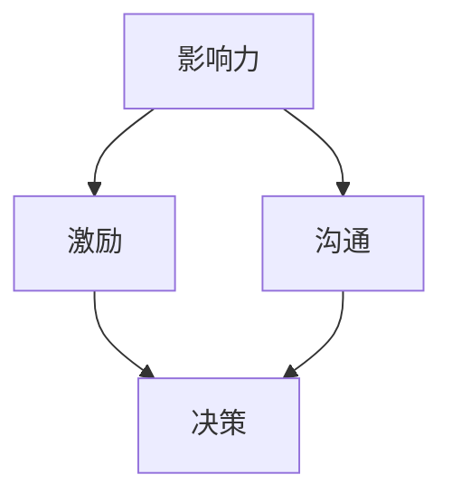

                 

### 文章标题：领导力与战略执行：从规划到落地

#### 关键词：领导力、战略执行、规划、落地、组织变革

#### 摘要：
本文深入探讨了领导力与战略执行的关系，从规划到落地的全过程。通过详细解析领导力的核心概念、战略规划与执行的方法，以及落地实践的关键步骤，为企业和个人在领导力和战略执行力提升方面提供了系统的指导。

### 第一部分：领导力基础

#### 第1章 领导力：核心概念与架构

**背景介绍：**
领导力是影响组织成功的关键因素。一个高效的领导者不仅能够激发团队成员的潜力，还能够引领组织实现战略目标。

**核心概念与联系：**
领导力的核心概念包括影响力、激励、沟通等。它们之间相互关联，共同构成了领导力的架构。以下是领导力核心概念的Mermaid流程图：

**核心算法原理讲解：**
领导力发展可以视为一个动态的过程，涉及多个算法原理，如：

- **SWOT分析**：用于评估组织的优势、劣势、机会和威胁。
- **SMART目标设定**：确保目标是具体、可衡量、可达成、相关和时限的。

**数学模型和公式：**
领导力发展的数学模型可以表示为：

$$
L = f(\text{知识}, \text{技能}, \text{经验}, \text{态度})
$$

其中，L代表领导力，知识、技能、经验和态度是影响领导力的因素。

**详细讲解与举例说明：**
例如，一个企业的领导力发展可以通过以下步骤进行：

1. **知识培训**：组织领导力培训课程，提高管理者的知识水平。
2. **技能提升**：通过实践和模拟，提升领导者的技能。
3. **经验积累**：鼓励管理者参与实际项目，积累经验。
4. **态度调整**：培养积极的工作态度和团队合作精神。

**项目实战：**
在一个大型科技公司中，领导力发展项目通过上述四个步骤，成功提升了管理团队的整体领导力。

**最佳实践 tips：**
- **持续学习**：领导力不是一成不变的，持续学习是提升领导力的关键。
- **实践与反思**：将理论应用于实际工作中，并定期反思和调整。

#### 第2章 领导风格与影响力

**背景介绍：**
领导风格是领导者管理行为和决策方式的体现，直接影响组织的氛围和绩效。

**核心概念与联系：**
领导风格可分为权威型、民主型、支持型和变革型等。每种风格都有其适用的场景和影响。

**核心算法原理讲解：**
领导风格评估可以通过以下算法实现：

- **360度反馈**：收集来自下属、同事和上级的反馈，评估领导风格的有效性。

**数学模型和公式：**
领导风格的有效性可以用以下公式表示：

$$
E = f(\text{适应度}, \text{效果}, \text{满意度})
$$

其中，E代表领导风格的有效性，适应度、效果和满意度是评估领导风格的因素。

**详细讲解与举例说明：**
例如，一个团队在面临重大变革时，变革型领导风格可能更为有效。

**项目实战：**
在一个创业公司中，通过引入变革型领导风格，成功推动了公司文化的转型。

**最佳实践 tips：**
- **了解团队成员**：根据团队成员的特点和需求，调整领导风格。
- **持续改进**：定期评估领导风格的有效性，并做出相应调整。

#### 第3章 领导力发展

**背景介绍：**
领导力发展是一个持续的过程，涉及自我提升、技能培养和经验积累。

**核心概念与联系：**
领导力发展包括个人发展计划、领导力培训和学习等。

**核心算法原理讲解：**
领导力发展可以通过以下算法实现：

- **PDCA循环**：计划（Plan）、执行（Do）、检查（Check）、行动（Act）。

**数学模型和公式：**
领导力发展可以表示为：

$$
LD = f(\text{学习}, \text{实践}, \text{反思})
$$

其中，LD代表领导力发展，学习、实践和反思是领导力发展的关键因素。

**详细讲解与举例说明：**
例如，一个企业可以通过以下步骤提升领导力：

1. **制定个人发展计划**：明确目标和路径。
2. **参与领导力培训**：提高知识和技能。
3. **实践与反思**：将所学应用于实际工作中，并不断反思和调整。

**项目实战：**
在一个跨国企业中，通过实施领导力发展项目，成功提升了管理团队的整体素质。

**最佳实践 tips：**
- **明确目标**：设定清晰的个人和团队目标。
- **持续学习**：利用各种资源和机会进行学习。

### 第二部分：战略规划与执行

#### 第4章 战略规划的过程

**背景介绍：**
战略规划是组织长期发展的蓝图，涉及外部环境分析、内部能力评估和战略选择。

**核心概念与联系：**
战略规划包括以下步骤：

1. **环境分析**：了解外部环境和内部条件。
2. **能力评估**：评估组织的优势和劣势。
3. **战略选择**：确定组织的战略方向。

**核心算法原理讲解：**
战略规划可以通过以下算法实现：

- **SWOT分析**：分析组织的优势、劣势、机会和威胁。
- **BSC模型**：平衡计分卡，用于综合评估组织的绩效。

**数学模型和公式：**
战略规划可以表示为：

$$
S = f(EA, IA, OS)
$$

其中，S代表战略规划，EA代表环境分析，IA代表能力评估，OS代表战略选择。

**详细讲解与举例说明：**
例如，一个企业可以通过以下步骤制定战略规划：

1. **环境分析**：分析市场需求、竞争环境和政策法规。
2. **能力评估**：评估企业的产品、技术和财务状况。
3. **战略选择**：确定企业的长期发展目标和策略。

**项目实战：**
在一个快速消费品公司中，通过详细的战略规划，成功实现了市场份额的增长。

**最佳实践 tips：**
- **全面分析**：确保分析过程全面、准确。
- **灵活调整**：根据实际情况及时调整战略规划。

#### 第5章 战略分析工具

**背景介绍：**
战略分析工具是战略规划过程中不可或缺的辅助工具，用于评估和分析组织的战略方向。

**核心概念与联系：**
常见的战略分析工具包括：

1. **SWOT分析**：分析组织的优势、劣势、机会和威胁。
2. **PEST分析**：分析外部环境中的政治、经济、社会和技术因素。
3. **五力模型**：分析行业竞争环境。

**核心算法原理讲解：**
战略分析工具的核心算法原理包括：

- **SWOT分析**：通过列出优势、劣势、机会和威胁，评估组织的战略方向。
- **PEST分析**：通过分析政治、经济、社会和技术因素，预测外部环境的变化。
- **五力模型**：通过分析行业内的竞争力量，评估行业的竞争程度。

**数学模型和公式：**
战略分析工具可以表示为：

$$
ST = f(S, W, O, T)
$$

其中，ST代表战略分析，S、W、O、T分别代表优势、劣势、机会和威胁。

**详细讲解与举例说明：**
例如，一个企业可以通过以下步骤使用SWOT分析：

1. **列出优势**：分析企业的核心竞争力。
2. **列出劣势**：分析企业的不足之处。
3. **列出机会**：分析市场趋势和外部环境。
4. **列出威胁**：分析潜在的风险和挑战。

**项目实战：**
在一个制造业企业中，通过使用SWOT分析和PEST分析，成功制定了有效的战略计划。

**最佳实践 tips：**
- **灵活运用**：根据实际情况选择合适的分析工具。
- **持续更新**：定期更新分析结果，确保战略规划的准确性。

#### 第6章 执行策略

**背景介绍：**
执行策略是战略规划的核心，涉及战略地图、关键绩效指标（KPI）和执行策略的制定。

**核心概念与联系：**
执行策略包括以下关键要素：

1. **战略地图**：明确组织的战略目标。
2. **关键绩效指标（KPI）**：衡量组织绩效的关键指标。
3. **执行策略**：确保战略目标的实现。

**核心算法原理讲解：**
执行策略可以通过以下算法实现：

- **平衡计分卡**：综合评估组织的绩效。
- **KPI设定**：确保关键指标的明确和可衡量。

**数学模型和公式：**
执行策略可以表示为：

$$
ES = f(SM, KPI, ET)
$$

其中，ES代表执行策略，SM代表战略地图，KPI代表关键绩效指标，ET代表执行策略。

**详细讲解与举例说明：**
例如，一个企业可以通过以下步骤制定执行策略：

1. **制定战略地图**：明确组织的战略目标。
2. **设定关键绩效指标（KPI）**：确保绩效指标的明确和可衡量。
3. **制定执行策略**：确保战略目标的实现。

**项目实战：**
在一个互联网公司中，通过制定详细的执行策略，成功实现了业务的快速增长。

**最佳实践 tips：**
- **明确目标**：确保战略目标和关键绩效指标的明确性。
- **持续监控**：定期监控和评估执行策略的有效性。

### 第三部分：落地实践

#### 第7章 战略落地实施步骤

**背景介绍：**
战略落地实施是战略规划的重要环节，涉及实施计划的制定、组织变革管理和团队管理。

**核心概念与联系：**
战略落地实施包括以下步骤：

1. **制定实施计划**：明确实施的具体步骤和时间表。
2. **组织变革管理**：应对组织变革的挑战。
3. **团队管理**：确保团队的协同合作。

**核心算法原理讲解：**
战略落地实施可以通过以下算法实现：

- **变革管理模型**：应对组织变革的挑战。
- **团队协作模型**：确保团队的协同合作。

**数学模型和公式：**
战略落地实施可以表示为：

$$
IL = f(IP, OC, TM)
$$

其中，IL代表战略落地实施，IP代表实施计划，OC代表组织变革管理，TM代表团队管理。

**详细讲解与举例说明：**
例如，一个企业可以通过以下步骤实施战略落地：

1. **制定实施计划**：明确实施的具体步骤和时间表。
2. **组织变革管理**：通过培训和沟通，应对组织变革的挑战。
3. **团队管理**：通过激励和沟通，确保团队的协同合作。

**项目实战：**
在一个大型制造企业中，通过详细的战略落地实施，成功实现了业务的转型和增长。

**最佳实践 tips：**
- **制定详细计划**：确保实施计划的明确性和可操作性。
- **灵活应对变化**：根据实际情况及时调整实施计划。

#### 第8章 团队管理与个人发展

**背景介绍：**
团队管理和个人发展是战略落地的重要支撑，涉及团队角色的明确、领导者的沟通技巧和个人发展计划。

**核心概念与联系：**
团队管理和个人发展包括以下关键要素：

1. **团队角色**：明确团队成员的职责和角色。
2. **沟通技巧**：提升领导者的沟通能力。
3. **个人发展计划**：明确个人的发展目标和路径。

**核心算法原理讲解：**
团队管理和个人发展可以通过以下算法实现：

- **团队角色模型**：明确团队成员的角色和职责。
- **沟通模型**：提升领导者的沟通能力。
- **个人发展模型**：制定个人发展计划。

**数学模型和公式：**
团队管理和个人发展可以表示为：

$$
DM = f(TR, CT, PD)
$$

其中，DM代表团队管理，TR代表团队角色，CT代表沟通技巧，PD代表个人发展计划。

**详细讲解与举例说明：**
例如，一个企业可以通过以下步骤进行团队管理和个人发展：

1. **明确团队角色**：确保团队成员的职责清晰。
2. **提升沟通技巧**：通过培训和实践，提升领导者的沟通能力。
3. **制定个人发展计划**：明确个人的发展目标和路径。

**项目实战：**
在一个科技初创公司中，通过有效的团队管理和个人发展计划，成功打造了一支高效的团队。

**最佳实践 tips：**
- **明确职责**：确保团队成员的职责清晰。
- **持续沟通**：建立良好的沟通机制，促进团队的协作。

#### 第9章 落地实践案例研究

**背景介绍：**
落地实践案例研究是对战略落地实施过程的具体分析和总结，有助于提升战略执行的效果。

**核心概念与联系：**
落地实践案例研究包括以下关键要素：

1. **案例选择**：选择具有代表性的落地实践案例。
2. **案例分析**：深入分析案例的成功经验和挑战。
3. **案例总结**：总结案例中的关键教训和最佳实践。

**核心算法原理讲解：**
落地实践案例研究可以通过以下算法实现：

- **案例选择算法**：选择具有代表性的案例。
- **案例分析算法**：深入分析案例的具体细节。
- **案例总结算法**：总结案例中的关键教训和最佳实践。

**数学模型和公式：**
落地实践案例研究可以表示为：

$$
CR = f(CS, CA, CS)
$$

其中，CR代表落地实践案例研究，CS代表案例选择，CA代表案例分析，CS代表案例总结。

**详细讲解与举例说明：**
例如，一个企业可以通过以下步骤进行落地实践案例研究：

1. **案例选择**：选择成功的落地实践案例。
2. **案例分析**：深入分析案例的成功经验和挑战。
3. **案例总结**：总结案例中的关键教训和最佳实践。

**项目实战：**
在一个金融服务公司中，通过落地实践案例研究，成功提升了战略执行的效果。

**最佳实践 tips：**
- **选择合适案例**：确保案例具有代表性和实际价值。
- **深入分析**：确保对案例的深入分析和总结。

### 结束语

本文从领导力与战略执行的角度，详细探讨了从规划到落地的全过程。通过理论讲解、案例分析、实践指南等，为企业和个人在领导力和战略执行力提升方面提供了系统的指导。希望本文能对读者有所启发，助力其在领导力和战略执行方面的成长。

**作者信息：**
作者：AI天才研究院/AI Genius Institute & 禅与计算机程序设计艺术 /Zen And The Art of Computer Programming**本文完**

