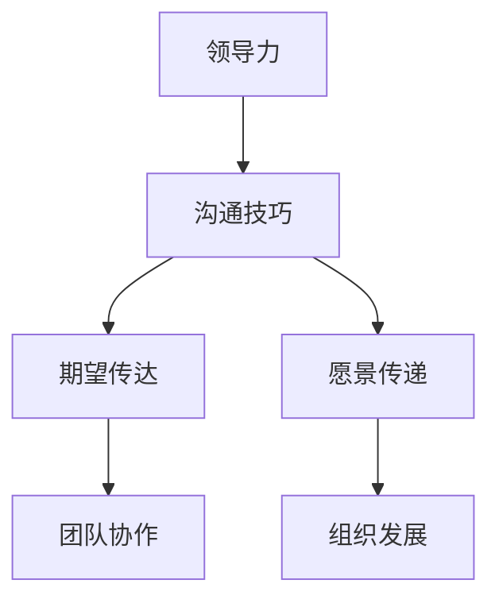

                 

## 文章标题：领导力与沟通技巧：有效传达期望和愿景

### 关键词：领导力、沟通技巧、期望传达、愿景传递、团队协作

> 摘要：本文深入探讨领导力与沟通技巧在有效传达期望和愿景方面的关键作用。通过解析领导力的核心要素和沟通技巧的基本框架，结合实践案例和工具应用，本文旨在为读者提供一套实用的方法，以提升领导者的期望传达和愿景传递能力，促进团队协作与组织发展。

---

## 引言

在当今快速变化的社会环境中，领导者的角色和职责变得愈发复杂。作为团队的领导者，不仅要具备优秀的业务能力，还要掌握有效的领导力和沟通技巧。本文将重点探讨如何通过有效的领导力和沟通技巧来传达期望和愿景，从而激发团队的动力和创造力，实现组织的长期目标。

### 领导力与沟通技巧的关系

领导力与沟通技巧是相辅相成的，二者缺一不可。领导力是领导者引导和激励团队成员的能力，而沟通技巧则是领导者与团队成员之间有效交流的关键。通过有效的沟通，领导者可以清晰地传达期望和愿景，确保团队成员理解并认同组织的方向。同时，沟通技巧也有助于建立信任和共识，增强团队凝聚力。

### 本文结构

本文将分为五个主要部分：

1. **领导力基础**：介绍领导力的定义、核心要素及其在组织中的角色。
2. **沟通技巧**：探讨沟通技巧的基本框架，包括倾听、提问和非语言沟通等。
3. **期望传达**：详细解释如何设定合理期望并有效地传达给团队成员。
4. **愿景传递**：阐述愿景的重要性以及如何有效地传递愿景。
5. **实践案例与工具**：通过实践案例展示领导力与沟通技巧的应用，并提供相关工具和资源。

---

## 领导力基础

### 1.1 领导力的定义与重要性

领导力是一种能够影响和激励他人实现共同目标的能力。它不仅包括决策能力和战略规划，更涉及到对团队成员的情感共鸣和激励。领导力的重要性在于，它能够为组织带来方向、动力和凝聚力。

### 1.2 领导力的核心要素

#### 1.2.1 诚信与透明度

诚信是领导力的基石。一个领导者必须具备高度的诚信，以赢得团队成员的信任和尊重。透明度则是确保团队信息流通的重要手段，通过透明沟通，领导者可以减少误解和猜疑。

#### 1.2.2 激励与支持

激励是领导力的关键要素之一。领导者需要了解团队成员的需求，并采取合适的激励措施，如奖励、晋升和培训等，以激发团队成员的积极性和创造力。同时，领导者还应在团队成员遇到困难时提供必要的支持。

#### 1.2.3 决策能力与风险管理

领导者需要具备出色的决策能力，能够迅速、准确地做出关键决策。此外，领导者还应对潜在的风险进行有效管理，确保组织在面临不确定性时能够保持稳定和发展。

---

## 沟通技巧

### 2.1 沟通技巧的重要性

有效沟通是领导者成功的关键。良好的沟通能力可以确保信息准确传达，减少误解和冲突，增强团队协作和效率。领导者需要通过有效的沟通技巧，确保团队成员对组织的期望和愿景有清晰的理解。

### 2.2 沟通技巧的框架

#### 2.2.1 倾听技巧

倾听是有效沟通的基础。领导者需要学会倾听团队成员的意见和反馈，理解他们的需求和期望。通过有效的倾听，领导者可以建立信任，增强团队的凝聚力。

#### 2.2.2 提问技巧

提问技巧是沟通的重要组成部分。通过提问，领导者可以引导对话，获取更多信息，并确保团队成员对组织的期望和愿景有清晰的理解。

#### 2.2.3 非语言沟通

非语言沟通包括肢体语言、面部表情和语调等。领导者需要学会通过非语言沟通来增强语言沟通的效果，确保信息传达的准确性和完整性。

---

## 期望传达

### 3.1 设定合理期望

设定合理期望是有效领导的重要一环。领导者需要根据组织的战略目标和团队成员的能力，设定既具挑战性又可实现的期望。合理的期望可以激励团队成员发挥潜力，提高工作效率。

### 3.2 传达期望的方法

#### 3.2.1 清晰明确地传达

领导者需要使用清晰明确的语言，将期望传达给团队成员。通过书面或口头形式，确保团队成员对期望有准确的理解。

#### 3.2.2 反馈与确认

在期望传达后，领导者应积极获取团队成员的反馈，确保他们理解并接受了期望。通过反馈与确认，领导者可以及时纠正误解和偏差。

#### 3.2.3 鼓励和支持

在实现期望的过程中，领导者需要鼓励和支持团队成员。通过积极的反馈和激励，帮助团队成员克服困难，实现期望。

---

## 愿景传递

### 4.1 愿景的定义与重要性

愿景是组织未来发展的蓝图，它为团队成员提供了共同的目标和方向。有效的愿景传递可以激发团队成员的积极性和创造力，推动组织实现长期目标。

### 4.2 传递愿景的方法

#### 4.2.1 个人化传递

领导者需要根据团队成员的特点和需求，采用个性化的传递方式。通过一对一的沟通和团队会议，将愿景传递给每个团队成员。

#### 4.2.2 情感共鸣

领导者需要通过情感共鸣，使团队成员感受到愿景的重要性和意义。通过故事、例子和案例，让团队成员对愿景产生共鸣。

#### 4.2.3 持续更新

愿景是一个持续发展的过程。领导者需要定期更新愿景，确保团队成员对组织的方向始终保持清晰的认识。

---

## 实践案例与工具

### 5.1 案例分析一：领导力与沟通技巧的融合

#### 5.1.1 案例背景

在一家快速发展的科技公司，领导层意识到通过提升领导力和沟通技巧，可以更好地传达期望和愿景，促进团队的协作和创新能力。

#### 5.1.2 领导力与沟通技巧的应用

- **领导力模型**：公司引入了“情境领导模型”，根据不同团队成员的能力和需求，采取不同的领导风格，以激励团队成员发挥最大潜力。
- **沟通技巧**：公司定期举办沟通技巧培训，教导领导者如何倾听、提问和反馈，提高团队沟通的效率和效果。

#### 5.1.3 案例效果

通过领导力与沟通技巧的融合，公司的团队协作效率显著提升，创新能力和执行力也得到加强。团队成员对公司的期望和愿景有了更清晰的认识，组织凝聚力大幅提高。

### 5.2 愿景传递工具

#### 5.2.1 愿景地图

愿景地图是一种帮助领导者传递愿景的工具。通过图表形式，清晰地展示组织的愿景、目标和路径，使团队成员对组织的发展方向有更直观的了解。

#### 5.2.2 愿景故事

愿景故事是一种通过讲述方式传递愿景的方法。领导者可以通过故事的形式，将愿景的内涵和价值传递给团队成员，激发他们的共鸣和参与。

---

## 结论

领导力与沟通技巧是领导者成功的关键。通过有效的领导力和沟通技巧，领导者可以清晰传达期望和愿景，激发团队成员的积极性和创造力，推动组织的发展。本文提供了一系列实用的方法和工具，旨在帮助领导者提升期望传达和愿景传递的能力，实现团队的协作与组织的持续发展。

### 作者信息

作者：AI天才研究院/AI Genius Institute & 禅与计算机程序设计艺术 /Zen And The Art of Computer Programming

---

## 附录

### 核心概念与联系

在领导力与沟通技巧中，核心概念包括领导力、沟通技巧、期望传达和愿景传递。这些概念之间的关系可以通过以下Mermaid流程图表示：



### 核心算法原理讲解

以下是一个关于如何设定合理期望的伪代码示例：

```plaintext
function 设定合理期望(目标，团队成员能力) {
    // 计算期望值
    期望值 = (目标 - 安全边际) / 成员能力系数

    // 验证期望值是否合理
    if (期望值 > 最大努力值) {
        // 调整期望值
        期望值 = 最大努力值
    }

    return 期望值
}
```

### 数学模型与公式

在期望传达中，可以使用以下数学模型来评估期望的合理性：

$$
\text{期望合理性} = \frac{\text{目标达成率} + \text{团队成员满意度}}{2}
$$

### 实际案例分析与详细讲解剖析

在实际案例中，领导者通过以下步骤来传达期望和愿景：

1. **明确目标**：领导者首先与团队成员明确项目的目标。
2. **了解能力**：领导者评估团队成员的能力，确保期望值在合理范围内。
3. **沟通期望**：通过一对一会议或团队会议，领导者明确传达期望。
4. **反馈与确认**：定期获取团队成员的反馈，确认他们对期望的理解。
5. **激励与支持**：在实现期望过程中，领导者提供必要的激励和支持。

### 最佳实践 Tips

1. **倾听团队成员的意见**：倾听是建立信任和共识的关键。
2. **持续更新愿景**：愿景是一个动态的过程，领导者需要定期更新。
3. **个性化沟通**：根据团队成员的特点和需求，采取个性化的沟通方式。

### 小结

领导力与沟通技巧是领导者成功的关键。通过有效的领导力和沟通技巧，领导者可以清晰传达期望和愿景，激发团队成员的积极性和创造力，推动组织的发展。本文提供了一系列实用的方法和工具，旨在帮助领导者提升期望传达和愿景传递的能力，实现团队的协作与组织的持续发展。

### 注意事项

1. **确保信息透明**：透明度是建立信任的基础。
2. **注重情感共鸣**：情感共鸣可以增强愿景的吸引力。
3. **持续学习和改进**：领导力和沟通技巧需要持续学习和改进。

### 拓展阅读

1. **《领导力的五个层次》**：史蒂芬·柯维著，详细介绍了领导力的五个层次，对提升领导力有很好的指导作用。
2. **《非暴力沟通》**：马歇尔·卢森堡著，介绍了非暴力沟通的四个步骤，对提升沟通技巧有很好的借鉴意义。

### 结语

领导力与沟通技巧是领导者不可或缺的能力。通过本文的探讨，我们希望能够帮助领导者更好地理解如何通过有效的领导力和沟通技巧来传达期望和愿景，推动团队的协作与组织的发展。让我们在实践中不断学习、提升，成为更优秀的领导者！

